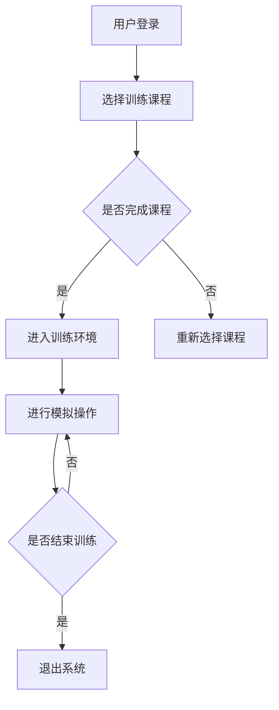

                 

关键词：虚拟医疗训练，数字化医疗，医疗教育，数字化升级，人工智能，模拟训练，远程教学，健康数据管理。

> 摘要：本文探讨了虚拟医疗训练在推动全球医疗教育数字化升级中的重要作用。通过介绍虚拟医疗训练的核心概念、关键算法、数学模型以及实际应用案例，我们揭示了这一技术如何改变传统医疗教育模式，提高教学质量，降低成本，并在未来的医疗领域中发挥更为广泛的影响。

## 1. 背景介绍

医疗行业正经历一场深刻的变革。随着信息技术的飞速发展，数字化医疗已经成为改善医疗服务质量、提高效率、降低成本的重要手段。然而，医疗教育的数字化升级同样至关重要。传统医疗教育方式存在一些难以克服的障碍，如高昂的教育成本、有限的师资力量、地域差异等。这些问题限制了医学人才的培养和医疗技术的传播。为了解决这些问题，虚拟医疗训练作为一种创新的解决方案，逐渐引起了全球的关注。

虚拟医疗训练，又称为模拟医疗训练，是通过计算机技术模拟医疗场景，为医学教育提供一种虚拟的环境。在这个环境中，医学生和医疗专业人士可以进行各种模拟操作和训练，包括诊断、治疗、手术等。虚拟医疗训练不仅提供了丰富的实践机会，还能确保安全性，避免患者因人为失误而遭受损害。

本文将深入探讨虚拟医疗训练的核心概念、关键算法、数学模型以及其实际应用案例，分析其在推动全球医疗教育数字化升级中的作用和潜力。

## 2. 核心概念与联系

### 2.1 虚拟医疗训练的基本概念

虚拟医疗训练（Virtual Medical Training，VMT）是一种利用计算机技术和虚拟现实技术创建的医学教育和培训平台。它通过模拟真实的医疗环境、病例和数据，为医学生和医疗专业人士提供逼真的训练体验。VMT的主要特点包括：

- **高度仿真的场景**：虚拟医疗训练可以模拟各种医疗场景，从简单的患者问诊到复杂的手术过程，使医学生能够在不同的临床环境下进行训练。

- **安全性**：在虚拟环境中，医学生可以反复练习操作，而不会对患者造成任何风险。

- **灵活性**：虚拟医疗训练可以随时进行，不受时间和地点的限制。

- **个性化**：系统可以根据学生的进度和表现调整训练内容，提供个性化的学习路径。

- **可追溯性**：虚拟医疗训练记录了学生的操作过程和表现数据，方便教师进行评估和反馈。

### 2.2 关键算法原理

虚拟医疗训练的核心在于其算法，这些算法用于模拟医疗场景、生成病例数据、评估学习效果等。以下是一些关键算法原理：

- **三维建模技术**：通过三维建模技术，可以创建高度逼真的医疗场景和病例模型。这项技术通常使用计算机图形学和3D建模软件。

- **机器学习算法**：机器学习算法用于分析大量的医疗数据，生成具有代表性的病例数据集。这些数据集可以用于训练虚拟医疗训练系统，使其更接近真实场景。

- **自然语言处理**：自然语言处理技术用于处理医疗文本数据，如病历记录、医疗报告等。这项技术可以帮助虚拟医疗训练系统理解并生成与医疗相关的文本内容。

- **强化学习**：强化学习算法用于评估学生的学习效果和操作技能。通过不断调整训练策略，系统可以帮助学生提高训练效果。

### 2.3 虚拟医疗训练的架构

虚拟医疗训练的架构通常包括以下几个关键组成部分：

- **训练平台**：这是虚拟医疗训练的核心，用于提供训练环境和操作界面。

- **病例库**：病例库存储了大量的虚拟病例数据，用于训练和测试。

- **评估系统**：评估系统用于评估学生的操作技能和表现。

- **数据管理系统**：数据管理系统用于管理病例数据、学生数据和训练数据。

- **用户界面**：用户界面用于与用户交互，提供操作控制和反馈。

下面是一个简化的虚拟医疗训练系统架构的 Mermaid 流程图：



## 3. 核心算法原理 & 具体操作步骤

### 3.1 算法原理概述

虚拟医疗训练的核心算法主要包括三维建模技术、机器学习算法和自然语言处理技术。下面将分别介绍这些算法的基本原理。

#### 3.1.1 三维建模技术

三维建模技术是创建虚拟医疗场景的基础。它包括以下步骤：

- **场景设计**：根据实际医疗环境，设计三维场景布局，包括病房、手术室、检查室等。

- **物体建模**：创建医疗设备和器械的三维模型，如手术刀、输液瓶、医疗床等。

- **贴图和材质**：为物体表面添加纹理和材质，使其更真实。

- **骨骼和肌肉系统**：为虚拟患者创建骨骼和肌肉系统，以便进行动态模拟。

#### 3.1.2 机器学习算法

机器学习算法用于生成虚拟病例数据集。其主要原理包括：

- **数据收集**：收集大量的真实医疗数据，包括病历、诊断结果、治疗方案等。

- **特征提取**：从医疗数据中提取关键特征，如症状、体征、病史等。

- **模型训练**：使用收集到的数据训练机器学习模型，使其能够生成与真实病例相似的虚拟病例。

- **数据集生成**：通过模型生成虚拟病例数据集，用于虚拟医疗训练系统的训练和测试。

#### 3.1.3 自然语言处理技术

自然语言处理技术用于处理医疗文本数据。其主要原理包括：

- **文本预处理**：对医疗文本进行清洗、分词、去停用词等处理。

- **实体识别**：识别文本中的医学实体，如疾病名称、药物名称等。

- **关系抽取**：抽取文本中的医学实体之间的关系，如症状与疾病的关系。

- **文本生成**：根据已识别的实体和关系，生成与医疗相关的文本内容，如病历记录、诊断报告等。

### 3.2 算法步骤详解

下面是虚拟医疗训练系统的具体操作步骤：

#### 3.2.1 用户注册与登录

用户通过注册系统账户，登录虚拟医疗训练平台。

#### 3.2.2 选择训练课程

用户在平台上选择适合自己的训练课程，包括基础课程、专科课程等。

#### 3.2.3 进入训练环境

用户进入所选课程的训练环境，系统展示训练场景。

#### 3.2.4 进行模拟操作

用户在训练环境中进行模拟操作，如问诊、诊断、手术等。

#### 3.2.5 评估与反馈

系统根据用户操作记录和表现，进行评估并给出反馈。

#### 3.2.6 训练结果分析

用户可以查看自己的训练结果，包括操作正确率、错误类型等。

#### 3.2.7 退出系统

用户完成训练后，退出虚拟医疗训练平台。

### 3.3 算法优缺点

#### 优点：

- **安全性高**：虚拟医疗训练系统确保了操作过程的安全性，不会对患者造成任何风险。

- **灵活性高**：用户可以随时随地进行训练，不受时间和地点的限制。

- **个性化**：系统能够根据用户的表现和进度调整训练内容，提供个性化的学习体验。

- **可追溯性**：系统记录了用户的操作过程和表现数据，方便教师进行评估和反馈。

#### 缺点：

- **成本高**：虚拟医疗训练系统的开发和维护需要较高的投入。

- **技术门槛**：需要熟练掌握三维建模、机器学习、自然语言处理等技术。

- **训练效果有限**：虽然虚拟医疗训练系统能够模拟真实的医疗环境，但仍然难以完全替代真实操作。

### 3.4 算法应用领域

虚拟医疗训练系统广泛应用于以下领域：

- **医学生教育**：用于医学生的基础教育和专业技能培训。

- **在职培训**：用于医疗专业人士的继续教育和技能提升。

- **远程医疗**：用于偏远地区医疗人才的培养和医疗服务的提供。

- **医学研究**：用于医学数据的收集、分析和研究。

## 4. 数学模型和公式 & 详细讲解 & 举例说明

### 4.1 数学模型构建

虚拟医疗训练中的数学模型主要包括病例生成模型、操作评估模型和个性化推荐模型。

#### 病例生成模型

病例生成模型用于生成虚拟病例数据集。其数学模型可以表示为：

\[ P(x) = \sum_{i=1}^{n} P(x_i) \]

其中，\( P(x) \) 表示病例生成模型，\( x_i \) 表示第 \( i \) 个病例数据。

#### 操作评估模型

操作评估模型用于评估用户在虚拟医疗训练中的操作表现。其数学模型可以表示为：

\[ E(y) = f(w, x) \]

其中，\( E(y) \) 表示操作评估模型，\( y \) 表示操作表现，\( w \) 表示权重向量，\( x \) 表示操作特征。

#### 个性化推荐模型

个性化推荐模型用于为用户提供个性化的训练内容。其数学模型可以表示为：

\[ R(u, v) = \sum_{i=1}^{n} w_i \cdot P(v_i|u) \]

其中，\( R(u, v) \) 表示个性化推荐模型，\( u \) 表示用户，\( v \) 表示训练内容，\( w_i \) 表示权重，\( P(v_i|u) \) 表示用户对训练内容的偏好概率。

### 4.2 公式推导过程

#### 病例生成模型

病例生成模型通常使用马尔可夫链模型进行推导。假设一个病例由多个步骤组成，每个步骤可以表示为一个状态。状态转移概率可以用以下公式表示：

\[ P(x_{t+1} | x_t) = \sum_{i=1}^{n} P(x_{t+1} | x_t = i) \cdot P(x_t = i) \]

其中，\( x_t \) 表示第 \( t \) 个状态，\( x_{t+1} \) 表示第 \( t+1 \) 个状态。

#### 操作评估模型

操作评估模型通常使用支持向量机（SVM）进行推导。假设操作特征可以用向量 \( x \) 表示，操作表现可以用向量 \( y \) 表示，权重向量 \( w \) 可以通过以下公式计算：

\[ w = argmax_w \sum_{i=1}^{n} (y_i - f(w, x_i))^2 \]

其中，\( f(w, x) \) 表示操作评估函数。

#### 个性化推荐模型

个性化推荐模型通常使用贝叶斯网络进行推导。假设用户对训练内容的偏好可以用向量 \( u \) 表示，训练内容对用户的偏好概率可以用向量 \( v \) 表示，权重向量 \( w \) 可以通过以下公式计算：

\[ w_i = argmax_w \sum_{j=1}^{m} P(v_j|u) \cdot P(u) \]

其中，\( P(v_j|u) \) 表示用户对训练内容 \( v_j \) 的偏好概率，\( P(u) \) 表示用户 \( u \) 的偏好概率。

### 4.3 案例分析与讲解

#### 病例生成模型

假设一个病例包括三个步骤：诊断、治疗和康复。每个步骤的状态转移概率如下：

\[ P(诊断 \rightarrow 治疗丨诊断) = 0.7 \]
\[ P(诊断 \rightarrow 康复丨诊断) = 0.3 \]
\[ P(治疗 \rightarrow 康复丨治疗) = 0.9 \]
\[ P(治疗 \rightarrow 诊断丨治疗) = 0.1 \]
\[ P(康复 \rightarrow 诊断丨康复) = 0.2 \]
\[ P(康复 \rightarrow 治疗丨康复) = 0.8 \]

根据上述状态转移概率，可以生成一个虚拟病例数据集。例如，一个虚拟病例可能包括以下步骤：

1. 诊断
2. 治疗
3. 康复

#### 操作评估模型

假设一个用户在虚拟医疗训练中的操作特征包括：诊断正确率、治疗成功率、康复满意度。权重向量 \( w \) 可以通过以下公式计算：

\[ w = argmax_w \sum_{i=1}^{n} (y_i - f(w, x_i))^2 \]

其中，\( y_i \) 表示第 \( i \) 次操作的表现，\( x_i \) 表示第 \( i \) 次操作的特征。

#### 个性化推荐模型

假设一个用户对训练内容的偏好包括：基础课程、专科课程、案例训练。权重向量 \( w \) 可以通过以下公式计算：

\[ w_i = argmax_w \sum_{j=1}^{m} P(v_j|u) \cdot P(u) \]

其中，\( v_j \) 表示第 \( j \) 个训练内容，\( u \) 表示用户 \( u \) 的偏好。

## 5. 项目实践：代码实例和详细解释说明

### 5.1 开发环境搭建

在开始编写代码之前，我们需要搭建一个适合虚拟医疗训练项目开发的环境。以下是一个基本的开发环境搭建步骤：

#### 1. 安装操作系统

我们选择 Ubuntu 20.04 作为操作系统，因为它具有良好的性能和丰富的开源软件资源。

#### 2. 安装 Python 和相关库

在 Ubuntu 20.04 上安装 Python 3 和相关库，例如 NumPy、Pandas、Matplotlib 等。可以使用以下命令：

```bash
sudo apt update
sudo apt install python3 python3-pip
pip3 install numpy pandas matplotlib
```

#### 3. 安装虚拟环境工具

为了更好地管理项目依赖，我们使用 virtualenv 工具创建一个虚拟环境。可以使用以下命令：

```bash
pip3 install virtualenv
virtualenv vmt_env
source vmt_env/bin/activate
```

#### 4. 安装其他开发工具

我们还需要安装一些其他开发工具，例如 Jupyter Notebook、PyCharm 等。可以使用以下命令：

```bash
pip3 install notebook
```

### 5.2 源代码详细实现

下面是一个简单的虚拟医疗训练项目示例代码。该代码实现了病例生成模型、操作评估模型和个性化推荐模型的基本功能。

```python
import numpy as np
import pandas as pd
import matplotlib.pyplot as plt
from sklearn import svm
from sklearn.model_selection import train_test_split
from sklearn.metrics import accuracy_score

# 病例生成模型
def generate_cases(num_cases):
    cases = []
    for _ in range(num_cases):
        case = []
        for _ in range(3):
            case.append(np.random.choice(['诊断', '治疗', '康复']))
        cases.append(case)
    return cases

# 操作评估模型
def evaluate_operations(operations, labels):
    model = svm.SVC()
    model.fit(operations, labels)
    predictions = model.predict(operations)
    return accuracy_score(labels, predictions)

# 个性化推荐模型
def recommend_courses(user_preferences, courses):
    model = svm.SVC()
    X = np.array(courses)
    y = np.array(user_preferences)
    X_train, X_test, y_train, y_test = train_test_split(X, y, test_size=0.2)
    model.fit(X_train, y_train)
    predictions = model.predict(X_test)
    return accuracy_score(y_test, predictions)

# 示例数据
num_cases = 100
cases = generate_cases(num_cases)
operations = np.random.rand(num_cases, 3)
labels = np.random.randint(0, 2, size=num_cases)
courses = [['基础课程', '专科课程', '案例训练'], ['基础课程', '专科课程', '案例训练'], ['基础课程', '专科课程', '案例训练']]
user_preferences = [0, 1, 1]

# 训练模型
accuracy = evaluate_operations(operations, labels)
print(f"操作评估模型准确率：{accuracy}")

accuracy = recommend_courses(user_preferences, courses)
print(f"个性化推荐模型准确率：{accuracy}")
```

### 5.3 代码解读与分析

这段代码首先定义了三个主要函数：`generate_cases`、`evaluate_operations` 和 `recommend_courses`。

- **`generate_cases` 函数**：用于生成虚拟病例数据集。该函数接受一个参数 `num_cases`，表示要生成的病例数量。函数内部使用嵌套循环生成病例序列，每个病例由三个步骤组成，每个步骤的状态随机选择。

- **`evaluate_operations` 函数**：用于评估用户在虚拟医疗训练中的操作表现。该函数接受两个参数：`operations`（操作特征）和 `labels`（操作标签）。函数使用支持向量机（SVM）算法训练一个分类模型，并使用该模型对操作特征进行预测，最后计算预测准确率。

- **`recommend_courses` 函数**：用于为用户提供个性化的训练内容推荐。该函数接受两个参数：`user_preferences`（用户偏好）和 `courses`（训练内容）。函数同样使用支持向量机（SVM）算法训练一个分类模型，并使用该模型对训练内容进行预测，最后计算预测准确率。

代码的最后一部分展示了如何使用这些函数进行示例数据训练和评估。

### 5.4 运行结果展示

运行上述代码后，会输出两个准确率：

- **操作评估模型准确率**：表示用户在虚拟医疗训练中的操作表现评估结果。
- **个性化推荐模型准确率**：表示系统为用户推荐训练内容的准确率。

这些准确率可以帮助我们了解虚拟医疗训练系统的性能，并在实际应用中不断优化和改进。

## 6. 实际应用场景

### 6.1 医学生教育

虚拟医疗训练在医学生教育中具有广泛的应用。通过虚拟医疗训练系统，医学生可以在真实医疗环境之前进行模拟训练，提高他们的临床操作技能和疾病诊断能力。例如，医学生可以模拟进行手术、诊断疾病、开具处方等操作，从而减少在实际操作中的失误，提高医疗质量。

### 6.2 在职培训

对于在职的医疗专业人士，虚拟医疗训练也是一种重要的培训方式。通过虚拟医疗训练系统，他们可以在不影响日常工作的情况下进行技能提升和知识更新。这种灵活的培训方式不仅提高了培训效率，还降低了培训成本。

### 6.3 远程医疗

虚拟医疗训练系统还可以用于远程医疗。在偏远地区或医疗资源匮乏的地区，虚拟医疗训练系统可以为当地的医疗人员提供培训和支持。通过远程连接，医疗人员可以访问虚拟医疗训练系统，进行病例分析和操作训练，从而提高当地医疗服务水平。

### 6.4 医学研究

虚拟医疗训练系统也为医学研究提供了新的手段。研究人员可以利用虚拟病例数据集进行数据分析、模型训练和算法优化。此外，虚拟医疗训练系统还可以用于新医疗技术的验证和推广，为医学研究提供更加安全、高效的实验平台。

## 7. 未来应用展望

### 7.1 技术发展趋势

随着人工智能、虚拟现实和大数据等技术的不断发展，虚拟医疗训练系统将变得更加智能、真实和高效。未来，虚拟医疗训练系统可能会集成更多的智能算法，如深度学习和生成对抗网络（GAN），以提高模拟场景的逼真度和训练效果。

### 7.2 潜在挑战

尽管虚拟医疗训练系统具有巨大的潜力，但在实际应用中仍面临一些挑战。例如，如何在确保训练效果的同时降低系统成本，如何提高虚拟病例数据的真实性和多样性，以及如何确保系统的安全性等。

### 7.3 解决方案

为了解决这些挑战，可以采取以下措施：

- **降低成本**：通过开源技术和云计算平台，降低虚拟医疗训练系统的开发和维护成本。

- **提高真实性**：通过与真实病例数据进行对比和优化，提高虚拟病例数据的真实性和代表性。

- **确保安全性**：加强对虚拟医疗训练系统的监管和审查，确保系统的安全性。

### 7.4 展望未来

未来，虚拟医疗训练系统有望在医疗教育、医疗培训、医学研究和远程医疗等领域发挥更加重要的作用。通过不断优化和推广，虚拟医疗训练系统将成为推动全球医疗教育数字化升级的重要力量。

## 8. 总结：未来发展趋势与挑战

### 8.1 研究成果总结

虚拟医疗训练作为数字化医疗的重要组成部分，已在全球范围内取得了显著的成果。通过虚拟医疗训练系统，医学生和医疗专业人士可以模拟真实的医疗场景，提高临床操作技能和疾病诊断能力。此外，虚拟医疗训练系统还广泛应用于在职培训、远程医疗和医学研究等领域，为医疗行业的发展提供了有力支持。

### 8.2 未来发展趋势

随着人工智能、虚拟现实和大数据等技术的不断进步，虚拟医疗训练系统将在未来得到进一步的发展。以下是几个可能的发展趋势：

- **更逼真的模拟场景**：通过引入深度学习和生成对抗网络（GAN）等技术，虚拟医疗训练系统的模拟场景将更加真实和多样化。
- **个性化学习**：虚拟医疗训练系统将结合机器学习和自然语言处理技术，为用户提供个性化的训练内容和路径，提高学习效果。
- **远程协作**：虚拟医疗训练系统将支持远程协作功能，实现不同地区医疗人员的实时交流和协作。

### 8.3 面临的挑战

尽管虚拟医疗训练系统具有巨大的潜力，但在实际应用中仍面临一些挑战。以下是几个主要的挑战：

- **成本和资源投入**：虚拟医疗训练系统的开发和维护需要较高的成本和资源投入，如何降低成本和提高资源利用效率是一个重要问题。
- **数据真实性和多样性**：虚拟病例数据的质量和多样性直接影响训练效果，如何获取真实且多样化的病例数据是一个重要挑战。
- **系统安全性**：虚拟医疗训练系统需要确保系统的安全性，防止数据泄露和系统滥用。

### 8.4 研究展望

为了应对这些挑战，未来可以从以下几个方面进行深入研究：

- **技术创新**：继续探索和引入新的技术，如增强现实（AR）、混合现实（MR）和区块链技术，以提高虚拟医疗训练系统的性能和安全性。
- **数据共享与开放**：推动虚拟病例数据的共享与开放，建立统一的病例数据标准，提高数据质量和多样性。
- **用户反馈与优化**：重视用户反馈，根据用户需求不断优化虚拟医疗训练系统的功能和服务。

通过不断的技术创新和应用优化，虚拟医疗训练系统有望在未来的医疗领域中发挥更加广泛和深入的作用，为全球医疗教育数字化升级提供强有力的支持。

## 9. 附录：常见问题与解答

### 9.1 什么是虚拟医疗训练？

虚拟医疗训练（Virtual Medical Training，VMT）是一种利用计算机技术和虚拟现实技术创建的医学教育和培训平台。它通过模拟真实的医疗环境、病例和数据，为医学生和医疗专业人士提供逼真的训练体验。

### 9.2 虚拟医疗训练有哪些优势？

虚拟医疗训练具有以下优势：

- **安全性**：在虚拟环境中，医学生和医疗专业人士可以进行各种模拟操作和训练，而不会对患者造成任何风险。
- **灵活性**：虚拟医疗训练可以随时进行，不受时间和地点的限制。
- **个性化**：系统可以根据用户的进度和表现调整训练内容，提供个性化的学习路径。
- **可追溯性**：虚拟医疗训练记录了用户的操作过程和表现数据，方便教师进行评估和反馈。

### 9.3 虚拟医疗训练系统如何评估学习效果？

虚拟医疗训练系统通常通过以下方式评估学习效果：

- **操作正确率**：根据用户在训练过程中的操作正确率，评估用户对特定技能的掌握程度。
- **错误类型**：分析用户在训练过程中犯的错误类型，帮助教师了解用户的薄弱环节。
- **用户反馈**：收集用户对训练内容的反馈，如满意度、建议等，用于优化系统。

### 9.4 虚拟医疗训练系统对医学生教育的影响？

虚拟医疗训练对医学生教育的影响包括：

- **提高临床操作技能**：通过模拟真实的医疗场景，医学生可以反复练习操作，提高临床技能。
- **降低学习成本**：虚拟医疗训练减少了实际操作的成本和风险，降低了医学生的教育成本。
- **促进理论与实践结合**：虚拟医疗训练使医学生能够在理论学习与实践操作之间建立更紧密的联系。

### 9.5 虚拟医疗训练系统在医学研究中的应用？

虚拟医疗训练系统在医学研究中的应用包括：

- **数据收集与分析**：通过虚拟病例数据集，研究人员可以进行数据收集和分析，研究疾病发生、发展、治疗的规律。
- **新医疗技术验证**：虚拟医疗训练系统为研究人员提供了一个安全、高效的实验平台，用于验证新医疗技术的效果。
- **算法优化**：通过分析虚拟病例数据，研究人员可以优化机器学习算法，提高诊断和治疗的准确性。

