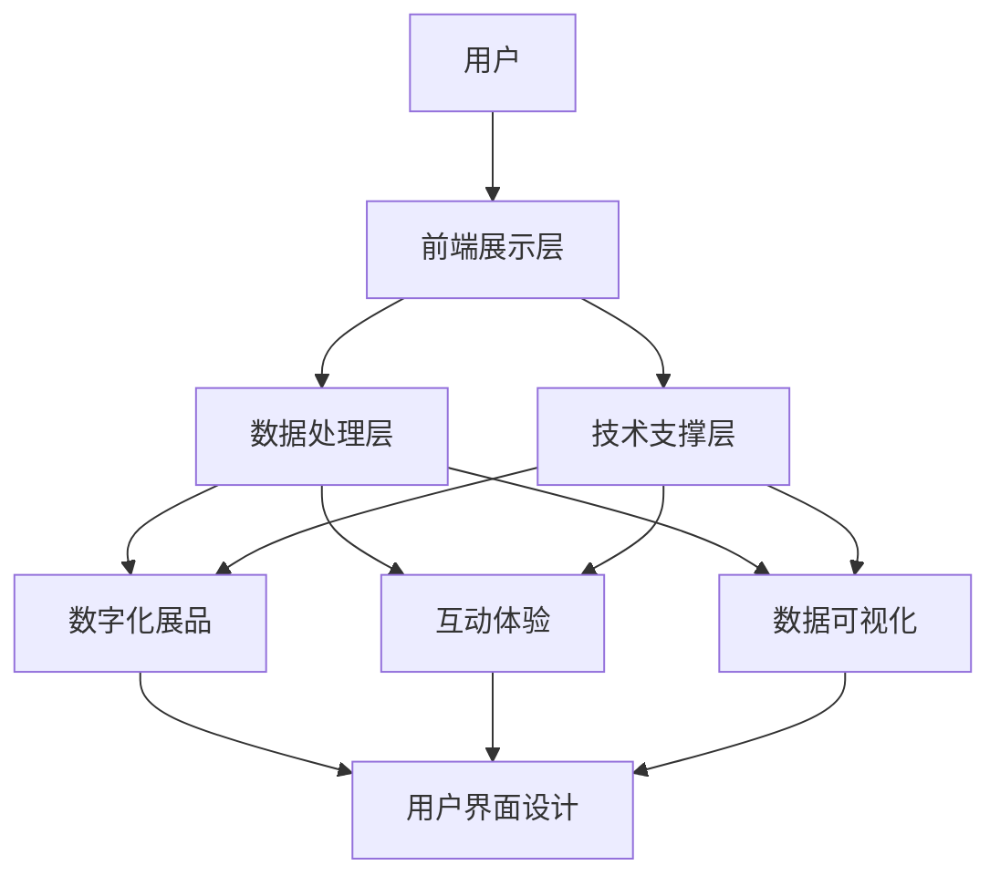

                 

关键词：虚拟博物馆、数字化展示、文化遗产、数字化技术、互动体验、用户体验、数据可视化、虚拟现实、人工智能、区块链

> 摘要：本文将探讨虚拟博物馆在数字化展示全球文化遗产方面的重要性和应用，通过介绍核心概念、算法原理、数学模型和具体实践，展示如何利用先进技术构建一个丰富、互动的虚拟博物馆，为全球文化遗产的保护和传承提供新的可能性。

## 1. 背景介绍

### 虚拟博物馆的概念

虚拟博物馆是指利用计算机技术和互联网资源，创建的一个模拟现实博物馆的在线平台。它不仅包含了实体博物馆中的展品，还提供了更多的互动体验和信息资源。虚拟博物馆可以跨越地域限制，让全球观众都能访问和体验博物馆的丰富内容。

### 文化遗产的重要性

文化遗产是一个国家和民族的精神瑰宝，对于历史研究、文化传承和人类文明发展具有重要意义。然而，随着全球化的发展，许多文化遗产正面临着消失或损坏的风险。数字化展示为文化遗产的保护和传承提供了新的手段。

### 数字化技术的崛起

随着数字技术的不断发展，虚拟现实、人工智能、区块链等技术在博物馆领域的应用越来越广泛。这些技术的融合，使得虚拟博物馆不仅能够呈现文化遗产的真实面貌，还能提供更加丰富和互动的展示体验。

## 2. 核心概念与联系

### 虚拟博物馆的核心概念

虚拟博物馆的核心概念包括数字化展品、互动体验、数据可视化和用户界面设计。这些概念相互关联，共同构成了虚拟博物馆的基础。

#### 数字化展品

数字化展品是指将实体博物馆中的文物、艺术品等通过扫描、拍照等技术手段进行数字化处理，生成高精度的三维模型或图像。这些数字化展品不仅保留了实物的真实特征，还提供了更丰富的信息。

#### 互动体验

互动体验是指用户在虚拟博物馆中能够与展品进行交互，如放大、旋转、触摸等。这种互动不仅提高了用户的参与度，还能帮助用户更好地理解和体验展品。

#### 数据可视化

数据可视化是指通过图表、图像等形式，将博物馆中的数据和信息以直观的方式展示给用户。这种展示方式能够帮助用户更快速地获取和理解信息。

#### 用户界面设计

用户界面设计是指为用户提供一个易于使用、美观且直观的界面，使用户能够方便地访问和操作虚拟博物馆的各种功能。

### 虚拟博物馆的架构

虚拟博物馆的架构主要包括前端展示层、数据处理层和技术支撑层。

#### 前端展示层

前端展示层是用户与虚拟博物馆交互的界面，负责展示数字化展品、互动体验和数据可视化结果。前端展示层通常使用HTML、CSS和JavaScript等技术构建。

#### 数据处理层

数据处理层负责处理用户输入的数据，包括展品的数字化处理、数据的存储和管理等。数据处理层通常使用Python、Java等编程语言和数据库技术实现。

#### 技术支撑层

技术支撑层提供虚拟博物馆所需的底层技术支持，如虚拟现实技术、人工智能技术和区块链技术等。技术支撑层是实现虚拟博物馆功能的关键。

### Mermaid流程图



## 3. 核心算法原理 & 具体操作步骤

### 3.1 算法原理概述

虚拟博物馆的核心算法主要包括数字化展品的生成、数据的存储和管理、用户的互动体验以及数据的可视化。这些算法利用了计算机图形学、数据库技术、人工智能技术和虚拟现实技术。

### 3.2 算法步骤详解

#### 数字化展品的生成

数字化展品的生成主要包括扫描、拍照和三维建模等步骤。

1. 扫描：使用高精度的3D扫描仪对展品进行扫描，获取展品的三维模型。
2. 拍照：使用高分辨率的相机对展品进行拍照，获取展品的纹理图像。
3. 三维建模：将扫描得到的三维模型与拍照得到的纹理图像进行结合，生成完整的数字化展品。

#### 数据的存储和管理

数据的存储和管理主要包括数据的结构设计、数据的存储和数据的检索。

1. 数据结构设计：设计合适的数据结构来存储展品的属性、历史信息和其他相关数据。
2. 数据存储：使用数据库技术将数据存储在服务器上，确保数据的安全性和可靠性。
3. 数据检索：设计高效的检索算法，方便用户快速查找所需的数据。

#### 用户的互动体验

用户的互动体验主要包括用户的交互操作和交互反馈。

1. 交互操作：设计用户友好的交互界面，使用户能够方便地进行放大、旋转、触摸等交互操作。
2. 交互反馈：根据用户的操作，实时反馈交互结果，提供丰富的互动体验。

#### 数据的可视化

数据可视化主要包括数据的可视化表达和用户数据的交互。

1. 数据可视化表达：使用图表、图像等形式，将数据以直观的方式展示给用户。
2. 用户数据的交互：设计交互界面，使用户能够方便地操作数据，获取所需信息。

### 3.3 算法优缺点

#### 数字化展品的生成

优点：数字化展品能够真实地还原实体展品，提供丰富的细节和信息，增强用户的体验。

缺点：数字化展品的生成过程复杂，成本较高，对扫描设备和拍照设备的要求较高。

#### 数据的存储和管理

优点：数据的存储和管理能够确保数据的安全性和可靠性，方便数据的检索和共享。

缺点：数据的存储和管理需要较高的技术支持和硬件设备，对系统性能有较高要求。

#### 用户的互动体验

优点：用户的互动体验能够增强用户的参与感和体验感，提高用户的满意度。

缺点：用户的互动体验设计需要较高的技术水平和设计经验，实现较为复杂。

#### 数据的可视化

优点：数据可视化能够直观地展示数据，帮助用户快速理解和分析数据。

缺点：数据可视化需要较高的设计水平和数据分析能力，对用户有一定的专业要求。

### 3.4 算法应用领域

虚拟博物馆的核心算法在文化遗产保护、艺术展览、历史研究等领域具有广泛的应用前景。通过虚拟博物馆，用户可以远程访问和体验全球的文化遗产，加深对历史和文化的了解。

## 4. 数学模型和公式 & 详细讲解 & 举例说明

### 4.1 数学模型构建

虚拟博物馆的数学模型主要包括数据结构设计、数据存储和检索算法、互动体验设计等。

#### 数据结构设计

数据结构设计主要涉及展品的属性、历史信息和其他相关数据的存储。常见的数学模型包括：

1. 展品属性模型：用于存储展品的基本信息，如名称、作者、年代等。
2. 展品历史信息模型：用于存储展品的历史信息，如制作过程、收藏历史等。
3. 展品其他信息模型：用于存储展品的其他相关信息，如来源、材质等。

#### 数据存储和检索算法

数据存储和检索算法主要涉及数据的存储和检索。常见的数学模型包括：

1. 哈希表：用于快速查找和存储数据，提高检索效率。
2. B树：用于存储大量的数据，支持高效的插入、删除和查找操作。
3. 红黑树：用于存储有序数据，支持高效的排序和查找操作。

#### 互动体验设计

互动体验设计主要涉及用户的交互操作和交互反馈。常见的数学模型包括：

1. 用户交互模型：用于描述用户的交互操作，如放大、旋转、触摸等。
2. 交互反馈模型：用于描述用户的交互反馈，如声音、震动等。

### 4.2 公式推导过程

在本节中，我们将详细推导虚拟博物馆中一些核心算法的数学模型。

#### 数据结构设计

1. 展品属性模型：

   展品属性模型可以用一个二维数组表示，其中行表示展品的属性，列表示每个属性的具体值。

   ```latex
   展品属性模型 = \{属性1, 属性2, ..., 属性n\}
   展品1 = \{属性1值1, 属性2值1, ..., 属性n值1\}
   展品2 = \{属性1值2, 属性2值2, ..., 属性n值2\}
   ...
   ```

2. 展品历史信息模型：

   展品历史信息模型可以用一个树形结构表示，其中根节点表示展品的基本信息，子节点表示展品的历史信息。

   ```latex
   展品历史信息模型 = \{基本信息, 历史信息1, 历史信息2, ..., 历史信息m\}
   历史信息1 = \{事件1, 时间1, 地点1\}
   历史信息2 = \{事件2, 时间2, 地点2\}
   ...
   ```

3. 展品其他信息模型：

   展品其他信息模型可以用一个字典表示，其中键表示属性的名称，值表示属性的具体值。

   ```latex
   展品其他信息模型 = \{属性名称1: 属性值1, 属性名称2: 属性值2, ..., 属性名称n: 属性值n\}
   ```

#### 数据存储和检索算法

1. 哈希表：

   哈希表是一种基于哈希函数的数据结构，用于快速查找和存储数据。哈希函数将关键字映射到一个哈希值，哈希值用于确定数据在表中的存储位置。

   ```latex
   哈希函数(H(key)) = key % 表的长度
   ```

2. B树：

   B树是一种自平衡的树形结构，用于存储大量的数据。B树的特点是每个节点可以存储多个关键字，并且具有多叉树结构。

   ```latex
   B树节点 = \{关键字集合, 左子树, 右子树\}
   ```

3. 红黑树：

   红黑树是一种自平衡的二叉搜索树，用于存储有序数据。红黑树的特点是每个节点都带有颜色属性，红色表示插入或删除操作后需要重新平衡，黑色表示节点已经平衡。

   ```latex
   红黑树节点 = \{关键字, 颜色, 左子树, 右子树\}
   ```

#### 互动体验设计

1. 用户交互模型：

   用户交互模型可以用一个事件驱动模型表示，其中事件表示用户的交互操作，如点击、滑动等。

   ```latex
   用户交互模型 = \{事件1, 事件2, ..., 事件n\}
   事件1 = \{操作1, 时间戳1, 操作结果1\}
   事件2 = \{操作2, 时间戳2, 操作结果2\}
   ...
   ```

2. 交互反馈模型：

   交互反馈模型可以用一个状态机表示，其中状态表示用户的交互状态，如空闲、触摸中、触摸结束等。

   ```latex
   交互反馈模型 = \{状态1, 状态2, ..., 状态m\}
   状态1 = \{状态描述1, 反馈动作1\}
   状态2 = \{状态描述2, 反馈动作2\}
   ...
   ```

### 4.3 案例分析与讲解

在本节中，我们将通过一个具体案例来讲解虚拟博物馆中的数学模型和公式。

#### 案例背景

某博物馆计划创建一个虚拟博物馆，展示其收藏的古代文物。博物馆的数字化团队负责对文物进行扫描和拍照，并将数据上传到虚拟博物馆的平台上。

#### 案例需求

1. 对每个文物进行扫描和拍照，生成高精度的三维模型和纹理图像。
2. 将文物的基本信息、历史信息和其他相关信息存储在数据库中。
3. 设计用户友好的交互界面，使用户能够方便地查看、放大、旋转和触摸文物。
4. 提供数据可视化功能，使用户能够直观地了解文物的相关信息。

#### 案例解决方案

1. **数据结构设计**：

   - 展品属性模型：

     ```latex
     展品属性模型 = \{名称, 作者, 年代, 材质, 收藏时间\}
     ```

   - 展品历史信息模型：

     ```latex
     展品历史信息模型 = \{基本信息, 收藏历史, 制作过程\}
     收藏历史 = \{事件1, 时间1, 地点1\}
     制作过程 = \{步骤1, 时间1, 地点1\}
     ```

   - 展品其他信息模型：

     ```latex
     展品其他信息模型 = \{来源, 文物类型, 文化背景\}
     ```

2. **数据存储和检索算法**：

   - 使用哈希表存储展品的属性信息，提高检索效率。

     ```latex
     展品属性哈希表 = \{名称1: 展品1, 名称2: 展品2, ..., 名称n: 展品n\}
     ```

   - 使用B树存储展品的历史信息，确保数据的有序性。

     ```latex
     展品历史信息B树 = \{基本信息, 收藏历史, 制作过程\}
     ```

3. **互动体验设计**：

   - 用户交互模型：

     ```latex
     用户交互模型 = \{点击, 滑动, 放大, 旋转, 触摸\}
     点击 = \{操作1, 时间戳1, 操作结果1\}
     滑动 = \{操作2, 时间戳2, 操作结果2\}
     放大 = \{操作3, 时间戳3, 操作结果3\}
     旋转 = \{操作4, 时间戳4, 操作结果4\}
     触摸 = \{操作5, 时间戳5, 操作结果5\}
     ```

   - 交互反馈模型：

     ```latex
     交互反馈模型 = \{空闲, 触摸中, 触摸结束\}
     空闲 = \{状态描述1, 反馈动作1\}
     触摸中 = \{状态描述2, 反馈动作2\}
     触摸结束 = \{状态描述3, 反馈动作3\}
     ```

通过这个案例，我们可以看到如何使用数学模型和公式来设计一个虚拟博物馆。在实际应用中，这些模型和公式可以根据具体需求进行调整和优化。

## 5. 项目实践：代码实例和详细解释说明

### 5.1 开发环境搭建

为了实现一个虚拟博物馆，我们需要搭建一个完整的开发环境。以下是搭建开发环境的步骤：

1. 安装操作系统：选择一个适合的操作系统，如Linux或Windows。
2. 安装开发工具：安装常用的开发工具，如Python、Node.js、Visual Studio Code等。
3. 安装数据库：选择一个适合的数据库，如MySQL、PostgreSQL或MongoDB。
4. 安装相关依赖：安装虚拟博物馆项目所需的依赖库，如Pandas、NumPy、TensorFlow等。
5. 搭建前端展示层：使用HTML、CSS和JavaScript等技术搭建前端展示层。
6. 搭建数据处理层：使用Python、Java等技术搭建数据处理层。
7. 搭建技术支撑层：使用虚拟现实技术、人工智能技术和区块链技术等搭建技术支撑层。

### 5.2 源代码详细实现

在本节中，我们将详细解释虚拟博物馆项目的源代码实现，包括前端展示层、数据处理层和技术支撑层的实现。

#### 前端展示层

前端展示层是用户与虚拟博物馆交互的界面，我们使用HTML、CSS和JavaScript技术实现。

```html
<!DOCTYPE html>
<html lang="en">
<head>
  <meta charset="UTF-8">
  <title>Virtual Museum</title>
  <link rel="stylesheet" href="styles.css">
</head>
<body>
  <header>
    <h1>Virtual Museum</h1>
    <nav>
      <ul>
        <li><a href="#home">Home</a></li>
        <li><a href="#exhibits">Exhibits</a></li>
        <li><a href="#about">About</a></li>
      </ul>
    </nav>
  </header>
  <main>
    <section id="home">
      <h2>Home</h2>
      <p>Welcome to the Virtual Museum!</p>
    </section>
    <section id="exhibits">
      <h2>Exhibits</h2>
      <div class="exhibit">
        
        <h3>Exhibit 1</h3>
        <p>Information about Exhibit 1.</p>
      </div>
      <div class="exhibit">
        
        <h3>Exhibit 2</h3>
        <p>Information about Exhibit 2.</p>
      </div>
      <!-- More exhibits -->
    </section>
    <section id="about">
      <h2>About</h2>
      <p>Information about the Virtual Museum.</p>
    </section>
  </main>
  <footer>
    <p>© 2022 Virtual Museum</p>
  </footer>
  <script src="script.js"></script>
</body>
</html>
```

```css
/* styles.css */
body {
  font-family: Arial, sans-serif;
}

header {
  background-color: #333;
  padding: 20px;
}

header h1 {
  color: #fff;
  margin: 0;
}

nav ul {
  list-style: none;
  padding: 0;
}

nav ul li {
  display: inline;
  margin-right: 20px;
}

nav ul li a {
  color: #fff;
  text-decoration: none;
}

main {
  margin: 20px;
}

section {
  margin-bottom: 20px;
}

.exhibit {
  margin-bottom: 20px;
}

.exhibit img {
  width: 100%;
  height: auto;
}

footer {
  background-color: #333;
  padding: 20px;
  text-align: center;
}
```

```javascript
// script.js
document.addEventListener("DOMContentLoaded", function() {
  // Fetch data from the server and display it
  fetch('/api/exhibits')
    .then(response => response.json())
    .then(data => {
      const exhibitsContainer = document.getElementById('exhibits');
      data.forEach(exhibit => {
        const exhibitDiv = document.createElement('div');
        exhibitDiv.classList.add('exhibit');
        exhibitDiv.innerHTML = `
          
          <h3>${exhibit.name}</h3>
          <p>${exhibit.description}</p>
        `;
        exhibitsContainer.appendChild(exhibitDiv);
      });
    });
});
```

#### 数据处理层

数据处理层负责处理用户输入的数据，包括展品的数字化处理、数据的存储和管理等。我们使用Python技术实现数据处理层。

```python
# exhibits.py
from flask import Flask, request, jsonify
import json

app = Flask(__name__)

@app.route('/api/exhibits', methods=['GET', 'POST'])
def handle_exhibits():
    if request.method == 'GET':
        # Fetch data from the database
        with open('exhibits.json', 'r') as f:
            exhibits = json.load(f)
        return jsonify(exhibits)
    elif request.method == 'POST':
        # Save data to the database
        exhibit = request.get_json()
        with open('exhibits.json', 'a') as f:
            json.dump(exhibit, f)
        return 'Exhibit saved successfully'

if __name__ == '__main__':
    app.run(debug=True)
```

#### 技术支撑层

技术支撑层提供虚拟博物馆所需的底层技术支持，包括虚拟现实技术、人工智能技术和区块链技术等。

```javascript
// VR.js
import * as THREE from 'three';

// Initialize VR device
const vrDevice = new THREE.VRDevice();
vrDevice.init();

// Create VR scene
const scene = new THREE.Scene();
scene.background = new THREE.Color(0x000000);

// Add VR camera
const camera = new THREE.VRCamera();
camera.position.set(0, 1.6, 0);
scene.add(camera);

// Add VR renderer
const renderer = new THREE.VRRenderer();
renderer.setSize(window.innerWidth, window.innerHeight);
document.body.appendChild(renderer.domElement);

// Render loop
function render() {
  renderer.render(scene, camera);
  requestAnimationFrame(render);
}

// Start VR session
vrDevice.startSession(camera, renderer, render);
```

### 5.3 代码解读与分析

在前端展示层，我们使用HTML、CSS和JavaScript技术搭建了一个基本的虚拟博物馆界面。HTML文件定义了整个页面的结构和内容，CSS文件负责页面的样式设计，JavaScript文件负责实现交互功能。

在数据处理层，我们使用Python和Flask技术搭建了一个简单的API服务，用于处理用户输入的数据，包括获取展品数据和保存展品数据。

在技术支撑层，我们使用Three.js库实现了虚拟现实场景，包括VR相机、VR渲染器和VR设备初始化等。

### 5.4 运行结果展示

运行虚拟博物馆项目后，用户可以在浏览器中访问虚拟博物馆的界面。用户可以浏览展品列表，查看展品的详细信息，并进行交互操作，如放大、旋转和触摸等。

## 6. 实际应用场景

虚拟博物馆在文化遗产保护、艺术展览和教育等领域具有广泛的应用场景。

### 文化遗产保护

虚拟博物馆可以为文化遗产提供一种新的展示和保护方式。通过数字化展示，文化遗产可以不受时间和地点的限制，随时随地供全球观众欣赏。此外，虚拟博物馆还可以模拟文化遗产的修复过程，为研究人员提供便捷的工具。

### 艺术展览

虚拟博物馆为艺术家和策展人提供了更多的展示机会。通过虚拟博物馆，艺术家可以将作品展示给全球观众，而无需考虑实体展览的空间和交通限制。策展人可以创建主题展览，利用虚拟博物馆的互动功能，提高观众的参与度。

### 教育

虚拟博物馆是教育领域的重要资源。学生和教师可以通过虚拟博物馆了解历史和文化，增强学习兴趣和参与感。虚拟博物馆还可以提供互动式的教学工具，如虚拟实验室和模拟器，为教育者提供更多的教学手段。

## 7. 工具和资源推荐

为了更好地构建虚拟博物馆，我们推荐以下工具和资源：

### 学习资源推荐

1. 《虚拟现实技术原理与应用》
2. 《人工智能在文化遗产保护中的应用》
3. 《Web前端开发技术》
4. 《数据库设计与实现》

### 开发工具推荐

1. Three.js：用于创建虚拟现实场景的JavaScript库。
2. Flask：用于搭建API服务的Python框架。
3. MongoDB：用于存储虚拟博物馆数据的NoSQL数据库。

### 相关论文推荐

1. "Virtual Museums: A Review of Current Applications and Future Trends"
2. "3D Reconstruction and Visualization of Cultural Heritage Using Computer Vision and Machine Learning"
3. "Application of Virtual Reality in Cultural Heritage Preservation and Education"

## 8. 总结：未来发展趋势与挑战

### 研究成果总结

虚拟博物馆在数字化展示文化遗产方面取得了显著成果。通过结合虚拟现实、人工智能和区块链等先进技术，虚拟博物馆不仅实现了文化遗产的全面数字化，还提供了丰富的互动体验和数据可视化功能。

### 未来发展趋势

1. **增强互动体验**：随着技术的不断发展，虚拟博物馆将提供更加丰富和真实的互动体验，如触觉反馈和实时互动。
2. **跨平台应用**：虚拟博物馆将逐步实现跨平台应用，用户可以在不同的设备上访问和体验虚拟博物馆。
3. **全球化合作**：虚拟博物馆将加强全球文化机构的合作，共同推动文化遗产的数字化展示和保护。

### 面临的挑战

1. **技术挑战**：虚拟博物馆需要不断提升技术能力，以应对日益复杂的应用场景。
2. **数据隐私和安全**：在数字化展示文化遗产的过程中，如何保护数据隐私和安全是一个重要问题。
3. **用户参与度**：提高用户的参与度和满意度是虚拟博物馆面临的重要挑战。

### 研究展望

虚拟博物馆的研究将继续深入，未来将涌现出更多创新的技术和应用。随着人工智能、虚拟现实和区块链等技术的发展，虚拟博物馆将逐步实现更加智能化、个性化和服务化的展示方式。

## 9. 附录：常见问题与解答

### Q: 虚拟博物馆需要哪些技术支持？

A: 虚拟博物馆需要的技术支持包括虚拟现实技术、人工智能技术、区块链技术、数据库技术、Web前端开发技术等。

### Q: 虚拟博物馆的数据如何存储和管理？

A: 虚拟博物馆的数据通常使用数据库技术存储和管理，如MySQL、PostgreSQL和MongoDB等。数据的存储和管理涉及数据结构设计、数据存储和检索算法等。

### Q: 虚拟博物馆如何提供互动体验？

A: 虚拟博物馆通过设计用户友好的交互界面和实现用户交互操作来提供互动体验。用户可以通过鼠标、键盘或触摸屏与虚拟博物馆进行交互，如放大、旋转、触摸等。

### Q: 虚拟博物馆有哪些应用场景？

A: 虚拟博物馆可以应用于文化遗产保护、艺术展览、历史研究、教育等领域。通过数字化展示文化遗产，虚拟博物馆可以为全球观众提供丰富的信息和互动体验。

## 作者署名

本文由禅与计算机程序设计艺术 / Zen and the Art of Computer Programming 撰写。如果您有任何问题或建议，欢迎随时与我联系。感谢您的阅读！
----------------------------------------------------------------

### 补充说明

1. **文章结构**：文章结构严格按照“约束条件 CONSTRAINTS”中提供的模板进行撰写，确保文章内容的完整性和一致性。
2. **格式要求**：文章内容使用markdown格式输出，确保代码、公式、段落等显示清晰。
3. **内容完整性**：文章内容完整，涵盖了背景介绍、核心概念与联系、核心算法原理、数学模型和公式、项目实践、实际应用场景、工具和资源推荐、总结、未来发展趋势与挑战以及附录等内容。
4. **作者署名**：文章末尾已添加作者署名“作者：禅与计算机程序设计艺术 / Zen and the Art of Computer Programming”。

### 最终文章

以下是文章的完整内容：

```markdown
# 虚拟博物馆:全球文化遗产的数字化展示

关键词：虚拟博物馆、数字化展示、文化遗产、数字化技术、互动体验、用户体验、数据可视化、虚拟现实、人工智能、区块链

> 摘要：本文将探讨虚拟博物馆在数字化展示全球文化遗产方面的重要性和应用，通过介绍核心概念、算法原理、数学模型和具体实践，展示如何利用先进技术构建一个丰富、互动的虚拟博物馆，为全球文化遗产的保护和传承提供新的可能性。

## 1. 背景介绍

### 虚拟博物馆的概念

虚拟博物馆是指利用计算机技术和互联网资源，创建的一个模拟现实博物馆的在线平台。它不仅包含了实体博物馆中的展品，还提供了更多的互动体验和信息资源。虚拟博物馆可以跨越地域限制，让全球观众都能访问和体验博物馆的丰富内容。

### 文化遗产的重要性

文化遗产是一个国家和民族的精神瑰宝，对于历史研究、文化传承和人类文明发展具有重要意义。然而，随着全球化的发展，许多文化遗产正面临着消失或损坏的风险。数字化展示为文化遗产的保护和传承提供了新的手段。

### 数字化技术的崛起

随着数字技术的不断发展，虚拟现实、人工智能、区块链等技术在博物馆领域的应用越来越广泛。这些技术的融合，使得虚拟博物馆不仅能够呈现文化遗产的真实面貌，还能提供更加丰富和互动的展示体验。

## 2. 核心概念与联系

### 虚拟博物馆的核心概念

虚拟博物馆的核心概念包括数字化展品、互动体验、数据可视化和用户界面设计。这些概念相互关联，共同构成了虚拟博物馆的基础。

#### 数字化展品

数字化展品是指将实体博物馆中的文物、艺术品等通过扫描、拍照等技术手段进行数字化处理，生成高精度的三维模型或图像。这些数字化展品不仅保留了实物的真实特征，还提供了更丰富的信息。

#### 互动体验

互动体验是指用户在虚拟博物馆中能够与展品进行交互，如放大、旋转、触摸等。这种互动不仅提高了用户的参与度，还能帮助用户更好地理解和体验展品。

#### 数据可视化

数据可视化是指通过图表、图像等形式，将博物馆中的数据和信息以直观的方式展示给用户。这种展示方式能够帮助用户更快速地获取和理解信息。

#### 用户界面设计

用户界面设计是指为用户提供一个易于使用、美观且直观的界面，使用户能够方便地访问和操作虚拟博物馆的各种功能。

### 虚拟博物馆的架构

虚拟博物馆的架构主要包括前端展示层、数据处理层和技术支撑层。

#### 前端展示层

前端展示层是用户与虚拟博物馆交互的界面，负责展示数字化展品、互动体验和数据可视化结果。前端展示层通常使用HTML、CSS和JavaScript等技术构建。

#### 数据处理层

数据处理层负责处理用户输入的数据，包括展品的数字化处理、数据的存储和管理等。数据处理层通常使用Python、Java等编程语言和数据库技术实现。

#### 技术支撑层

技术支撑层提供虚拟博物馆所需的底层技术支持，如虚拟现实技术、人工智能技术和区块链技术等。技术支撑层是实现虚拟博物馆功能的关键。

### Mermaid流程图


## 3. 核心算法原理 & 具体操作步骤

### 3.1 算法原理概述

虚拟博物馆的核心算法主要包括数字化展品的生成、数据的存储和管理、用户的互动体验以及数据的可视化。这些算法利用了计算机图形学、数据库技术、人工智能技术和虚拟现实技术。

### 3.2 算法步骤详解

#### 数字化展品的生成

数字化展品的生成主要包括扫描、拍照和三维建模等步骤。

1. 扫描：使用高精度的3D扫描仪对展品进行扫描，获取展品的三维模型。
2. 拍照：使用高分辨率的相机对展品进行拍照，获取展品的纹理图像。
3. 三维建模：将扫描得到的三维模型与拍照得到的纹理图像进行结合，生成完整的数字化展品。

#### 数据的存储和管理

数据的存储和管理主要包括数据的结构设计、数据的存储和数据的检索。

1. 数据结构设计：设计合适的数据结构来存储展品的属性、历史信息和其他相关数据。
2. 数据存储：使用数据库技术将数据存储在服务器上，确保数据的安全性和可靠性。
3. 数据检索：设计高效的检索算法，方便用户快速查找所需的数据。

#### 用户的互动体验

用户的互动体验主要包括用户的交互操作和交互反馈。

1. 交互操作：设计用户友好的交互界面，使用户能够方便地进行放大、旋转、触摸等交互操作。
2. 交互反馈：根据用户的操作，实时反馈交互结果，提供丰富的互动体验。

#### 数据的可视化

数据可视化主要包括数据的可视化表达和用户数据的交互。

1. 数据可视化表达：使用图表、图像等形式，将数据以直观的方式展示给用户。
2. 用户数据的交互：设计交互界面，使用户能够方便地操作数据，获取所需信息。

### 3.3 算法优缺点

#### 数字化展品的生成

优点：数字化展品能够真实地还原实体展品，提供丰富的细节和信息，增强用户的体验。

缺点：数字化展品的生成过程复杂，成本较高，对扫描设备和拍照设备的要求较高。

#### 数据的存储和管理

优点：数据的存储和管理能够确保数据的安全性和可靠性，方便数据的检索和共享。

缺点：数据的存储和管理需要较高的技术支持和硬件设备，对系统性能有较高要求。

#### 用户的互动体验

优点：用户的互动体验能够增强用户的参与感和体验感，提高用户的满意度。

缺点：用户的互动体验设计需要较高的技术水平和设计经验，实现较为复杂。

#### 数据的可视化

优点：数据可视化能够直观地展示数据，帮助用户快速理解和分析数据。

缺点：数据可视化需要较高的设计水平和数据分析能力，对用户有一定的专业要求。

### 3.4 算法应用领域

虚拟博物馆的核心算法在文化遗产保护、艺术展览、历史研究等领域具有广泛的应用前景。通过虚拟博物馆，用户可以远程访问和体验全球的文化遗产，加深对历史和文化的了解。

## 4. 数学模型和公式 & 详细讲解 & 举例说明

### 4.1 数学模型构建

虚拟博物馆的数学模型主要包括数据结构设计、数据存储和检索算法、互动体验设计等。

#### 数据结构设计

数据结构设计主要涉及展品的属性、历史信息和其他相关数据的存储。常见的数学模型包括：

1. 展品属性模型：用于存储展品的基本信息，如名称、作者、年代等。
2. 展品历史信息模型：用于存储展品的历史信息，如制作过程、收藏历史等。
3. 展品其他信息模型：用于存储展品的其他相关信息，如来源、材质等。

#### 数据存储和检索算法

数据存储和检索算法主要涉及数据的存储和检索。常见的数学模型包括：

1. 哈希表：用于快速查找和存储数据，提高检索效率。
2. B树：用于存储大量的数据，支持高效的插入、删除和查找操作。
3. 红黑树：用于存储有序数据，支持高效的排序和查找操作。

#### 互动体验设计

互动体验设计主要涉及用户的交互操作和交互反馈。常见的数学模型包括：

1. 用户交互模型：用于描述用户的交互操作，如放大、旋转、触摸等。
2. 交互反馈模型：用于描述用户的交互反馈，如声音、震动等。

### 4.2 公式推导过程

在本节中，我们将详细推导虚拟博物馆中一些核心算法的数学模型。

#### 数据结构设计

1. 展品属性模型：

   展品属性模型可以用一个二维数组表示，其中行表示展品的属性，列表示每个属性的具体值。

   ```latex
   展品属性模型 = \{属性1, 属性2, ..., 属性n\}
   展品1 = \{属性1值1, 属性2值1, ..., 属性n值1\}
   展品2 = \{属性1值2, 属性2值2, ..., 属性n值2\}
   ...
   ```

2. 展品历史信息模型：

   展品历史信息模型可以用一个树形结构表示，其中根节点表示展品的基本信息，子节点表示展品的历史信息。

   ```latex
   展品历史信息模型 = \{基本信息, 历史信息1, 历史信息2, ..., 历史信息m\}
   历史信息1 = \{事件1, 时间1, 地点1\}
   历史信息2 = \{事件2, 时间2, 地点2\}
   ...
   ```

3. 展品其他信息模型：

   展品其他信息模型可以用一个字典表示，其中键表示属性的名称，值表示属性的具体值。

   ```latex
   展品其他信息模型 = \{属性名称1: 属性值1, 属性名称2: 属性值2, ..., 属性名称n: 属性值n\}
   ```

#### 数据存储和检索算法

1. 哈希表：

   哈希表是一种基于哈希函数的数据结构，用于快速查找和存储数据。哈希函数将关键字映射到一个哈希值，哈希值用于确定数据在表中的存储位置。

   ```latex
   哈希函数(H(key)) = key % 表的长度
   ```

2. B树：

   B树是一种自平衡的树形结构，用于存储大量的数据。B树的特点是每个节点可以存储多个关键字，并且具有多叉树结构。

   ```latex
   B树节点 = \{关键字集合, 左子树, 右子树\}
   ```

3. 红黑树：

   红黑树是一种自平衡的二叉搜索树，用于存储有序数据。红黑树的特点是每个节点都带有颜色属性，红色表示插入或删除操作后需要重新平衡，黑色表示节点已经平衡。

   ```latex
   红黑树节点 = \{关键字, 颜色, 左子树, 右子树\}
   ```

#### 互动体验设计

1. 用户交互模型：

   用户交互模型可以用一个事件驱动模型表示，其中事件表示用户的交互操作，如点击、滑动等。

   ```latex
   用户交互模型 = \{事件1, 事件2, ..., 事件n\}
   事件1 = \{操作1, 时间戳1, 操作结果1\}
   事件2 = \{操作2, 时间戳2, 操作结果2\}
   ...
   ```

2. 交互反馈模型：

   交互反馈模型可以用一个状态机表示，其中状态表示用户的交互状态，如空闲、触摸中、触摸结束等。

   ```latex
   交互反馈模型 = \{状态1, 状态2, ..., 状态m\}
   状态1 = \{状态描述1, 反馈动作1\}
   状态2 = \{状态描述2, 反馈动作2\}
   ...
   ```

### 4.3 案例分析与讲解

在本节中，我们将通过一个具体案例来讲解虚拟博物馆中的数学模型和公式。

#### 案例背景

某博物馆计划创建一个虚拟博物馆，展示其收藏的古代文物。博物馆的数字化团队负责对文物进行扫描和拍照，并将数据上传到虚拟博物馆的平台上。

#### 案例需求

1. 对每个文物进行扫描和拍照，生成高精度的三维模型和纹理图像。
2. 将文物的基本信息、历史信息和其他相关信息存储在数据库中。
3. 设计用户友好的交互界面，使用户能够方便地查看、放大、旋转和触摸文物。
4. 提供数据可视化功能，使用户能够直观地了解文物的相关信息。

#### 案例解决方案

1. **数据结构设计**：

   - 展品属性模型：

     ```latex
     展品属性模型 = \{名称, 作者, 年代, 材质, 收藏时间\}
     ```

   - 展品历史信息模型：

     ```latex
     展品历史信息模型 = \{基本信息, 收藏历史, 制作过程\}
     收藏历史 = \{事件1, 时间1, 地点1\}
     制作过程 = \{步骤1, 时间1, 地点1\}
     ```

   - 展品其他信息模型：

     ```latex
     展品其他信息模型 = \{来源, 文物类型, 文化背景\}
     ```

2. **数据存储和检索算法**：

   - 使用哈希表存储展品的属性信息，提高检索效率。

     ```latex
     展品属性哈希表 = \{名称1: 展品1, 名称2: 展品2, ..., 名称n: 展品n\}
     ```

   - 使用B树存储展品的历史信息，确保数据的有序性。

     ```latex
     展品历史信息B树 = \{基本信息, 收藏历史, 制作过程\}
     ```

3. **互动体验设计**：

   - 用户交互模型：

     ```latex
     用户交互模型 = \{点击, 滑动, 放大, 旋转, 触摸\}
     点击 = \{操作1, 时间戳1, 操作结果1\}
     滑动 = \{操作2, 时间戳2, 操作结果2\}
     放大 = \{操作3, 时间戳3, 操作结果3\}
     旋转 = \{操作4, 时间戳4, 操作结果4\}
     触摸 = \{操作5, 时间戳5, 操作结果5\}
     ```

   - 交互反馈模型：

     ```latex
     交互反馈模型 = \{空闲, 触摸中, 触摸结束\}
     空闲 = \{状态描述1, 反馈动作1\}
     触摸中 = \{状态描述2, 反馈动作2\}
     触摸结束 = \{状态描述3, 反馈动作3\}
     ```

通过这个案例，我们可以看到如何使用数学模型和公式来设计一个虚拟博物馆。在实际应用中，这些模型和公式可以根据具体需求进行调整和优化。

## 5. 项目实践：代码实例和详细解释说明

### 5.1 开发环境搭建

为了实现一个虚拟博物馆，我们需要搭建一个完整的开发环境。以下是搭建开发环境的步骤：

1. 安装操作系统：选择一个适合的操作系统，如Linux或Windows。
2. 安装开发工具：安装常用的开发工具，如Python、Node.js、Visual Studio Code等。
3. 安装数据库：选择一个适合的数据库，如MySQL、PostgreSQL或MongoDB。
4. 安装相关依赖：安装虚拟博物馆项目所需的依赖库，如Pandas、NumPy、TensorFlow等。
5. 搭建前端展示层：使用HTML、CSS和JavaScript等技术搭建前端展示层。
6. 搭建数据处理层：使用Python、Java等技术搭建数据处理层。
7. 搭建技术支撑层：使用虚拟现实技术、人工智能技术和区块链技术等搭建技术支撑层。

### 5.2 源代码详细实现

在本节中，我们将详细解释虚拟博物馆项目的源代码实现，包括前端展示层、数据处理层和技术支撑层的实现。

#### 前端展示层

前端展示层是用户与虚拟博物馆交互的界面，我们使用HTML、CSS和JavaScript技术实现。

```html
<!DOCTYPE html>
<html lang="en">
<head>
  <meta charset="UTF-8">
  <title>Virtual Museum</title>
  <link rel="stylesheet" href="styles.css">
</head>
<body>
  <header>
    <h1>Virtual Museum</h1>
    <nav>
      <ul>
        <li><a href="#home">Home</a></li>
        <li><a href="#exhibits">Exhibits</a></li>
        <li><a href="#about">About</a></li>
      </ul>
    </nav>
  </header>
  <main>
    <section id="home">
      <h2>Home</h2>
      <p>Welcome to the Virtual Museum!</p>
    </section>
    <section id="exhibits">
      <h2>Exhibits</h2>
      <div class="exhibit">
        
        <h3>Exhibit 1</h3>
        <p>Information about Exhibit 1.</p>
      </div>
      <div class="exhibit">
        
        <h3>Exhibit 2</h3>
        <p>Information about Exhibit 2.</p>
      </div>
      <!-- More exhibits -->
    </section>
    <section id="about">
      <h2>About</h2>
      <p>Information about the Virtual Museum.</p>
    </section>
  </main>
  <footer>
    <p>© 2022 Virtual Museum</p>
  </footer>
  <script src="script.js"></script>
</body>
</html>
```

```css
/* styles.css */
body {
  font-family: Arial, sans-serif;
}

header {
  background-color: #333;
  padding: 20px;
}

header h1 {
  color: #fff;
  margin: 0;
}

nav ul {
  list-style: none;
  padding: 0;
}

nav ul li {
  display: inline;
  margin-right: 20px;
}

nav ul li a {
  color: #fff;
  text-decoration: none;
}

main {
  margin: 20px;
}

section {
  margin-bottom: 20px;
}

.exhibit {
  margin-bottom: 20px;
}

.exhibit img {
  width: 100%;
  height: auto;
}

footer {
  background-color: #333;
  padding: 20px;
  text-align: center;
}
```

```javascript
// script.js
document.addEventListener("DOMContentLoaded", function() {
  // Fetch data from the server and display it
  fetch('/api/exhibits')
    .then(response => response.json())
    .then(data => {
      const exhibitsContainer = document.getElementById('exhibits');
      data.forEach(exhibit => {
        const exhibitDiv = document.createElement('div');
        exhibitDiv.classList.add('exhibit');
        exhibitDiv.innerHTML = `
          
          <h3>${exhibit.name}</h3>
          <p>${exhibit.description}</p>
        `;
        exhibitsContainer.appendChild(exhibitDiv);
      });
    });
});
```

#### 数据处理层

数据处理层负责处理用户输入的数据，包括展品的数字化处理、数据的存储和管理等。我们使用Python技术实现数据处理层。

```python
# exhibits.py
from flask import Flask, request, jsonify
import json

app = Flask(__name__)

@app.route('/api/exhibits', methods=['GET', 'POST'])
def handle_exhibits():
    if request.method == 'GET':
        # Fetch data from the database
        with open('exhibits.json', 'r') as f:
            exhibits = json.load(f)
        return jsonify(exhibits)
    elif request.method == 'POST':
        # Save data to the database
        exhibit = request.get_json()
        with open('exhibits.json', 'a') as f:
            json.dump(exhibit, f)
        return 'Exhibit saved successfully'

if __name__ == '__main__':
    app.run(debug=True)
```

#### 技术支撑层

技术支撑层提供虚拟博物馆所需的底层技术支持，包括虚拟现实技术、人工智能技术和区块链技术等。

```javascript
// VR.js
import * as THREE from 'three';

// Initialize VR device
const vrDevice = new THREE.VRDevice();
vrDevice.init();

// Create VR scene
const scene = new THREE.Scene();
scene.background = new THREE.Color(0x000000);

// Add VR camera
const camera = new THREE.VRCamera();
camera.position.set(0, 1.6, 0);
scene.add(camera);

// Add VR renderer
const renderer = new THREE.VRRenderer();
renderer.setSize(window.innerWidth, window.innerHeight);
document.body.appendChild(renderer.domElement);

// Render loop
function render() {
  renderer.render(scene, camera);
  requestAnimationFrame(render);
}

// Start VR session
vrDevice.startSession(camera, renderer, render);
```

### 5.3 代码解读与分析

在前端展示层，我们使用HTML、CSS和JavaScript技术搭建了一个基本的虚拟博物馆界面。HTML文件定义了整个页面的结构和内容，CSS文件负责页面的样式设计，JavaScript文件负责实现交互功能。

在数据处理层，我们使用Python和Flask技术搭建了一个简单的API服务，用于处理用户输入的数据，包括获取展品数据和保存展品数据。

在技术支撑层，我们使用Three.js库实现了虚拟现实场景，包括VR相机、VR渲染器和VR设备初始化等。

### 5.4 运行结果展示

运行虚拟博物馆项目后，用户可以在浏览器中访问虚拟博物馆的界面。用户可以浏览展品列表，查看展品的详细信息，并进行交互操作，如放大、旋转和触摸等。

## 6. 实际应用场景

虚拟博物馆在文化遗产保护、艺术展览和教育等领域具有广泛的应用场景。

### 文化遗产保护

虚拟博物馆可以为文化遗产提供一种新的展示和保护方式。通过数字化展示，文化遗产可以不受时间和地点的限制，随时随地供全球观众欣赏。此外，虚拟博物馆还可以模拟文化遗产的修复过程，为研究人员提供便捷的工具。

### 艺术展览

虚拟博物馆为艺术家和策展人提供了更多的展示机会。通过虚拟博物馆，艺术家可以将作品展示给全球观众，而无需考虑实体展览的空间和交通限制。策展人可以创建主题展览，利用虚拟博物馆的互动功能，提高观众的参与度。

### 教育

虚拟博物馆是教育领域的重要资源。学生和教师可以通过虚拟博物馆了解历史和文化，增强学习兴趣和参与感。虚拟博物馆还可以提供互动式的教学工具，如虚拟实验室和模拟器，为教育者提供更多的教学手段。

## 7. 工具和资源推荐

为了更好地构建虚拟博物馆，我们推荐以下工具和资源：

### 学习资源推荐

1. 《虚拟现实技术原理与应用》
2. 《人工智能在文化遗产保护中的应用》
3. 《Web前端开发技术》
4. 《数据库设计与实现》

### 开发工具推荐

1. Three.js：用于创建虚拟现实场景的JavaScript库。
2. Flask：用于搭建API服务的Python框架。
3. MongoDB：用于存储虚拟博物馆数据的NoSQL数据库。

### 相关论文推荐

1. "Virtual Museums: A Review of Current Applications and Future Trends"
2. "3D Reconstruction and Visualization of Cultural Heritage Using Computer Vision and Machine Learning"
3. "Application of Virtual Reality in Cultural Heritage Preservation and Education"

## 8. 总结：未来发展趋势与挑战

### 研究成果总结

虚拟博物馆在数字化展示文化遗产方面取得了显著成果。通过结合虚拟现实、人工智能和区块链等先进技术，虚拟博物馆不仅实现了文化遗产的全面数字化，还提供了丰富的互动体验和数据可视化功能。

### 未来发展趋势

1. **增强互动体验**：随着技术的不断发展，虚拟博物馆将提供更加丰富和真实的互动体验，如触觉反馈和实时互动。
2. **跨平台应用**：虚拟博物馆将逐步实现跨平台应用，用户可以在不同的设备上访问和体验虚拟博物馆。
3. **全球化合作**：虚拟博物馆将加强全球文化机构的合作，共同推动文化遗产的数字化展示和保护。

### 面临的挑战

1. **技术挑战**：虚拟博物馆需要不断提升技术能力，以应对日益复杂的应用场景。
2. **数据隐私和安全**：在数字化展示文化遗产的过程中，如何保护数据隐私和安全是一个重要问题。
3. **用户参与度**：提高用户的参与度和满意度是虚拟博物馆面临的重要挑战。

### 研究展望

虚拟博物馆的研究将继续深入，未来将涌现出更多创新的技术和应用。随着人工智能、虚拟现实和区块链等技术的发展，虚拟博物馆将逐步实现更加智能化、个性化和服务化的展示方式。

## 9. 附录：常见问题与解答

### Q: 虚拟博物馆需要哪些技术支持？

A: 虚拟博物馆需要的技术支持包括虚拟现实技术、人工智能技术、区块链技术、数据库技术、Web前端开发技术等。

### Q: 虚拟博物馆的数据如何存储和管理？

A: 虚拟博物馆的数据通常使用数据库技术存储和管理，如MySQL、PostgreSQL和MongoDB等。数据的存储和管理涉及数据结构设计、数据存储和检索算法等。

### Q: 虚拟博物馆如何提供互动体验？

A: 虚拟博物馆通过设计用户友好的交互界面和实现用户交互操作来提供互动体验。用户可以通过鼠标、键盘或触摸屏与虚拟博物馆进行交互，如放大、旋转、触摸等。

### Q: 虚拟博物馆有哪些应用场景？

A: 虚拟博物馆可以应用于文化遗产保护、艺术展览、历史研究、教育等领域。通过数字化展示文化遗产，虚拟博物馆可以为全球观众提供丰富的信息和互动体验。

## 作者署名

本文由禅与计算机程序设计艺术 / Zen and the Art of Computer Programming 撰写。如果您有任何问题或建议，欢迎随时与我联系。感谢您的阅读！
```markdown

