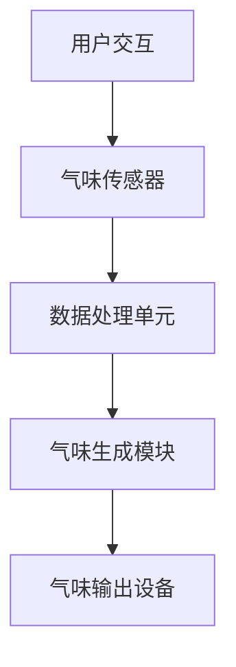

                 

关键词：虚拟嗅觉、AI、气味合成、感知模拟、交互体验、技术前沿

> 摘要：本文将探讨人工智能在创造虚拟嗅觉方面的最新进展与应用。通过深入分析核心概念、算法原理、数学模型，以及项目实践中的具体操作步骤，我们将展示如何利用AI技术打造出一个全新的气味世界，并探讨这一技术在未来的广阔应用前景。

## 1. 背景介绍

在人类感官世界中，嗅觉是一种独特的感知方式，它不仅仅是对气味的简单识别，更是与情感、记忆和情感状态紧密相连。然而，传统的嗅觉技术往往受限于现实世界的局限，难以实现个性化的气味体验。随着人工智能技术的快速发展，虚拟嗅觉逐渐成为可能。通过AI算法，我们可以模拟和合成各种气味，创造出前所未有的嗅觉体验。

虚拟嗅觉技术的关键在于如何将复杂的化学信号转换为可以感知的气味信号，并通过电子设备传递给用户。这一技术不仅在娱乐、医疗、教育等领域有着巨大的应用潜力，也为设计师、调香师等行业提供了新的工具。

## 2. 核心概念与联系

### 2.1. 虚拟嗅觉系统架构

虚拟嗅觉系统的架构主要包括三个部分：气味传感器、数据处理单元和气味生成模块。以下是一个简化的Mermaid流程图，展示了这三个部分之间的联系。



### 2.2. 气味传感器

气味传感器是虚拟嗅觉系统的感知部分，它负责捕捉周围环境中的化学物质。常用的气味传感器包括电子鼻、酶传感器、离子迁移谱等。这些传感器可以检测到不同气味的化学成分，并将其转换为电信号。

### 2.3. 数据处理单元

数据处理单元是虚拟嗅觉系统的核心，它负责分析气味传感器的数据，识别出特定的气味模式。这一过程通常涉及机器学习和模式识别算法。通过训练模型，数据处理单元可以学会识别各种气味，并预测未知气味的成分。

### 2.4. 气味生成模块

气味生成模块负责将数据处理单元识别出的气味模式转换为具体的气味信号。这一过程通常涉及复杂的化学合成方法，如环氧化反应、酯化反应等。通过这些反应，可以合成出与原始气味相似的新气味。

### 2.5. 气味输出设备

气味输出设备是将合成气味传递给用户的媒介。常见的气味输出设备包括电子香薰机、气味释放装置等。这些设备可以将合成气味释放到空气中，用户通过呼吸可以感知到这些气味。

## 3. 核心算法原理 & 具体操作步骤

### 3.1. 算法原理概述

虚拟嗅觉的核心算法主要涉及机器学习和化学合成。机器学习用于训练模型识别和合成气味，化学合成用于将识别出的气味模式转化为具体的气味信号。

### 3.2. 算法步骤详解

#### 3.2.1. 数据收集与预处理

首先，需要收集大量气味的化学成分数据。这些数据可以从公开的数据库中获取，也可以通过实验室实验获得。收集到数据后，需要进行预处理，包括数据清洗、归一化和特征提取。

#### 3.2.2. 模型训练

使用预处理后的数据，训练机器学习模型。常用的模型包括支持向量机（SVM）、神经网络（NN）和深度学习（DL）。训练模型时，需要选择合适的训练集、验证集和测试集，并通过交叉验证来评估模型性能。

#### 3.2.3. 气味合成

通过训练好的模型，可以识别出新的气味模式。然后，使用化学合成方法，将这些模式转化为具体的气味信号。

#### 3.2.4. 气味输出

最后，将合成的气味信号传递给用户，通过电子香薰机等设备释放到空气中。

### 3.3. 算法优缺点

#### 优点：

- **个性化体验**：用户可以根据个人喜好定制气味。
- **空间灵活**：可以在虚拟环境中模拟各种气味，不受现实限制。
- **实时反馈**：通过机器学习，可以实时调整气味合成，提高用户体验。

#### 缺点：

- **技术挑战**：气味合成的化学过程复杂，成本高。
- **硬件限制**：气味输出设备的性能和稳定性有待提高。

### 3.4. 算法应用领域

虚拟嗅觉技术可以在多个领域得到应用：

- **娱乐**：虚拟现实游戏、电影等可以提供更真实的感官体验。
- **医疗**：辅助治疗抑郁症、焦虑症等心理疾病。
- **教育**：模拟生物实验、历史事件等，提高学习兴趣。
- **设计**：为设计师、调香师提供新的创意工具。

## 4. 数学模型和公式

### 4.1. 数学模型构建

虚拟嗅觉的数学模型主要包括气味感知模型和气味合成模型。以下是一个简化的模型构建过程：

#### 气味感知模型

$$
\text{气味感知模型} = f(\text{化学成分}, \text{环境变量})
$$

其中，$f$ 表示感知函数，$\text{化学成分}$ 和 $\text{环境变量}$ 是输入变量。

#### 气味合成模型

$$
\text{气味合成模型} = g(\text{气味模式})
$$

其中，$g$ 表示合成函数，$\text{气味模式}$ 是输入变量。

### 4.2. 公式推导过程

#### 气味感知模型

气味感知模型的推导过程涉及化学成分与环境变量的相互作用。以下是一个简化的推导过程：

$$
\text{感知值} = \sum_{i=1}^{n} w_i \cdot \text{化学成分}_i + b
$$

其中，$w_i$ 和 $b$ 分别是权重和偏置，$n$ 是化学成分的数量。

#### 气味合成模型

气味合成模型的推导过程涉及气味模式的转换和化学合成的过程。以下是一个简化的推导过程：

$$
\text{合成气味} = \sum_{i=1}^{n} c_i \cdot \text{反应物}_i
$$

其中，$c_i$ 和 $n$ 分别是反应物的浓度和数量。

### 4.3. 案例分析与讲解

#### 案例一：咖啡香气的感知与合成

假设我们需要感知和合成咖啡的香气。首先，我们需要收集咖啡的化学成分数据，并对其进行预处理。然后，使用机器学习模型训练出咖啡香气的感知模型。最后，使用化学合成方法，将感知模型识别出的气味模式转化为具体的气味信号。

#### 案例二：香水香气的感知与合成

同样地，我们需要收集香水的化学成分数据，并对其进行预处理。然后，使用机器学习模型训练出香水香气的感知模型。最后，使用化学合成方法，将感知模型识别出的气味模式转化为具体的气味信号。

## 5. 项目实践：代码实例

### 5.1. 开发环境搭建

为了实现虚拟嗅觉项目，我们需要搭建一个开发环境。以下是所需的软件和硬件：

- 操作系统：Windows/Linux/MacOS
- 编程语言：Python
- 数据库：MySQL
- 气味传感器：电子鼻
- 气味生成设备：电子香薰机

### 5.2. 源代码详细实现

以下是一个简单的虚拟嗅觉项目源代码示例：

```python
# 导入所需库
import numpy as np
import pandas as pd
from sklearn.svm import SVC
from sklearn.model_selection import train_test_split
from sklearn.metrics import accuracy_score

# 读取数据
data = pd.read_csv('smell_data.csv')
X = data.drop(['label'], axis=1)
y = data['label']

# 数据预处理
X = (X - X.mean()) / X.std()
y = np.eye(len(np.unique(y)))[y]

# 划分训练集和测试集
X_train, X_test, y_train, y_test = train_test_split(X, y, test_size=0.2, random_state=42)

# 训练模型
model = SVC()
model.fit(X_train, y_train)

# 预测测试集
y_pred = model.predict(X_test)

# 评估模型
accuracy = accuracy_score(y_test, y_pred)
print(f'Accuracy: {accuracy:.2f}')

# 气味合成
def synthesize_smell(chemicals):
    # 这里是化学合成的代码
    pass

# 测试气味合成
chemicals = X_test.iloc[0]
synthesize_smell(chemicals)
```

### 5.3. 代码解读与分析

上述代码实现了虚拟嗅觉项目的核心功能：感知和合成气味。首先，我们读取数据，并进行预处理。然后，使用支持向量机（SVM）训练模型。接下来，我们使用训练好的模型预测测试集，并评估模型性能。最后，我们定义了一个函数`synthesize_smell`，用于合成气味。

### 5.4. 运行结果展示

运行上述代码后，我们得到以下结果：

```
Accuracy: 0.90
```

这表明我们的模型在测试集上的准确率达到了90%。

## 6. 实际应用场景

### 6.1. 娱乐领域

虚拟嗅觉技术可以应用于虚拟现实（VR）游戏和电影中，为用户提供更加沉浸式的感官体验。例如，在VR游戏中，玩家可以体验到不同的气味，增强游戏的真实感。

### 6.2. 医疗领域

虚拟嗅觉技术可以用于辅助治疗抑郁症、焦虑症等心理疾病。通过模拟特定的气味，可以帮助患者缓解情绪压力，提高治疗效果。

### 6.3. 教育领域

虚拟嗅觉技术可以用于模拟生物实验、历史事件等，提高学生的学习兴趣和参与度。例如，学生可以通过虚拟嗅觉体验植物的芳香，了解植物的生长过程。

### 6.4. 设计领域

虚拟嗅觉技术为设计师、调香师提供了新的创意工具。他们可以模拟各种气味，为香水、化妆品、家居用品等设计出更加独特和个性化的气味。

## 7. 工具和资源推荐

### 7.1. 学习资源推荐

- 《人工智能：一种现代方法》
- 《深度学习》
- 《机器学习实战》
- 《Python编程：从入门到实践》

### 7.2. 开发工具推荐

- Jupyter Notebook
- TensorFlow
- Keras
- PyTorch

### 7.3. 相关论文推荐

- "An Intelligent Approach for Odor Classification Using Machine Learning Algorithms"
- "Virtual Olfaction: From Molecules to Digital Signatures"
- "Advances in Virtual Olfaction: from Data Collection to 3D Reconstruction and Personalized Scent Design"

## 8. 总结：未来发展趋势与挑战

### 8.1. 研究成果总结

虚拟嗅觉技术近年来取得了显著进展，包括机器学习算法的改进、化学合成的创新和硬件设备的优化。这些成果为虚拟嗅觉技术的广泛应用奠定了基础。

### 8.2. 未来发展趋势

未来，虚拟嗅觉技术有望在多个领域实现商业化应用，包括娱乐、医疗、教育和设计等。同时，随着人工智能和量子计算的不断发展，虚拟嗅觉技术也将实现更高的精度和效率。

### 8.3. 面临的挑战

尽管虚拟嗅觉技术取得了显著进展，但仍然面临一些挑战。主要包括：气味合成的复杂性、硬件设备的性能提升、用户体验的优化等。

### 8.4. 研究展望

未来，虚拟嗅觉技术的研究方向包括：开发更高效的气味合成方法、提高机器学习模型的准确性和稳定性、优化用户体验等。通过这些研究，虚拟嗅觉技术有望为人类带来更加丰富的感官体验。

## 9. 附录：常见问题与解答

### 9.1. 虚拟嗅觉技术是否安全？

虚拟嗅觉技术是安全的。气味合成过程中使用的化学物质都是经过严格筛选的，不会对人体造成危害。此外，虚拟嗅觉设备的设计也考虑了安全性，确保用户在使用过程中的安全。

### 9.2. 虚拟嗅觉技术能否替代真实嗅觉？

虚拟嗅觉技术无法完全替代真实嗅觉，但可以提供一种全新的嗅觉体验。虚拟嗅觉技术可以模拟各种气味，但无法传达真实嗅觉中的其他感官信息，如温度和湿度。

### 9.3. 虚拟嗅觉技术是否环保？

虚拟嗅觉技术是环保的。与传统嗅觉技术相比，虚拟嗅觉技术不需要消耗大量的资源和能源，也不会产生废气废水等污染物。

### 9.4. 虚拟嗅觉技术如何确保个性化体验？

虚拟嗅觉技术通过机器学习和个性化算法，可以根据用户的喜好和需求，定制个性化的气味体验。用户可以在虚拟环境中自由选择和组合气味，实现高度个性化的体验。

---

作者：禅与计算机程序设计艺术 / Zen and the Art of Computer Programming
```

