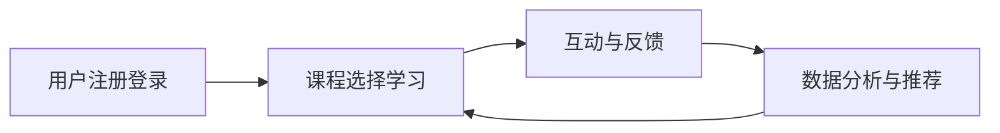

                 

在快速发展的全球脑时代，知识的获取和传递方式正在经历深刻的变革。传统教育模式逐渐被虚拟教育平台所取代，这种变革不仅是技术的进步，更是教育理念的革新。本文将探讨虚拟教育平台在知识获取渠道中的作用，分析其核心概念、算法原理、数学模型、项目实践、应用场景、未来发展，以及面临的挑战。

## 文章关键词

- 虚拟教育平台
- 全球脑时代
- 知识获取渠道
- 教育变革
- 算法原理
- 数学模型
- 项目实践
- 应用场景
- 未来发展

## 文章摘要

本文从虚拟教育平台的背景出发，探讨了其在全球脑时代知识获取渠道中的重要性。通过详细分析核心概念、算法原理、数学模型、项目实践和应用场景，本文旨在为读者呈现虚拟教育平台的发展现状和未来趋势，同时提出面临的挑战和应对策略。

## 1. 背景介绍

在全球脑时代，信息爆炸和知识更新速度不断加快，传统教育模式已经难以满足人们日益增长的学习需求。虚拟教育平台的兴起，为知识获取提供了全新的渠道。虚拟教育平台利用互联网技术和人工智能技术，实现了个性化、智能化、多样化的教育模式。

虚拟教育平台的兴起，不仅改变了教育的传播方式，也改变了人们获取知识的方式。在虚拟教育平台上，学生可以随时随地进行学习，教师可以通过平台进行远程教学，教育资源得到了极大的丰富和共享。这种变革，不仅提高了教育效率，也推动了教育公平的实现。

### 1.1 虚拟教育平台的发展历程

虚拟教育平台的发展历程可以分为三个阶段：

1. **早期探索阶段**（1990s-2000s）：这一阶段主要以网络课程和教育资源库的建设为主，如美国的一些大学通过网络课程向全球学生提供学习资源。

2. **快速发展阶段**（2000s-2010s）：随着互联网技术的快速发展，虚拟教育平台逐渐普及，出现了一批知名的在线教育平台，如Coursera、edX等。

3. **成熟阶段**（2010s至今）：虚拟教育平台逐渐成熟，人工智能技术的引入使得个性化教育和智能推荐成为可能，教育平台的功能也更加完善。

### 1.2 虚拟教育平台的现状

目前，虚拟教育平台已经成为全球教育体系的重要组成部分。根据统计，全球有超过2.5亿人在使用虚拟教育平台进行学习。这些平台不仅涵盖了各种学科领域，还提供了丰富的学习资源和教学工具，如在线课程、虚拟实验室、学习社区等。

### 1.3 虚拟教育平台的优势

虚拟教育平台具有以下优势：

1. **个性化学习**：虚拟教育平台可以根据学生的学习进度和兴趣进行个性化推荐，提高学习效果。
2. **资源共享**：虚拟教育平台可以实现全球范围内的教育资源共享，使得优质教育资源能够惠及更多人。
3. **便捷性**：虚拟教育平台可以随时随地进行学习，不受时间和地点的限制。
4. **智能推荐**：虚拟教育平台可以利用人工智能技术进行智能推荐，帮助学习者找到最适合自己的学习资源。

## 2. 核心概念与联系

### 2.1 虚拟教育平台的定义

虚拟教育平台是一种基于互联网和云计算技术的教育服务系统，它通过数字化内容和在线互动，为学习者提供全方位的教育服务。

### 2.2 虚拟教育平台的关键概念

1. **学习资源**：虚拟教育平台中的核心组成部分，包括文本、图片、音频、视频等多种形式的学习材料。
2. **在线互动**：虚拟教育平台提供的师生互动功能，包括实时讨论、答疑、作业提交等。
3. **智能推荐**：虚拟教育平台利用人工智能技术，根据学习者的学习行为和兴趣进行个性化推荐。
4. **云计算**：虚拟教育平台的基础技术，它提供了强大的计算能力和存储能力，使得大规模教育资源的存储和分发成为可能。

### 2.3 虚拟教育平台的架构

虚拟教育平台的架构通常包括以下几个层次：

1. **前端展示层**：用户界面，包括课程展示、学习资源浏览、互动功能等。
2. **业务逻辑层**：处理用户请求、课程管理、学习行为分析等业务逻辑。
3. **数据存储层**：存储学习资源、用户数据、课程数据等。
4. **后台服务层**：包括服务器、数据库、缓存等基础设施。

### 2.4 虚拟教育平台的工作流程

1. **用户注册与登录**：用户通过注册账号登录虚拟教育平台。
2. **课程选择与学习**：用户根据个人兴趣和学习需求选择课程，进行在线学习。
3. **互动与反馈**：用户可以通过在线互动功能与教师和其他学习者进行交流，获取帮助和反馈。
4. **数据分析与推荐**：虚拟教育平台根据用户的学习行为和反馈，进行数据分析，为用户提供个性化的学习资源推荐。

## 2.5 虚拟教育平台与人工智能的联系

虚拟教育平台与人工智能技术的结合，使得教育服务更加智能化、个性化。人工智能技术可以应用于以下几个方面：

1. **智能推荐**：根据用户的学习行为和兴趣，为用户提供个性化的学习资源推荐。
2. **智能问答**：利用自然语言处理技术，为用户提供智能问答服务。
3. **智能评测**：通过自动化评测系统，对用户的学习成果进行实时评估。
4. **智能辅导**：根据用户的学习进度和困难，提供智能化的辅导服务。

### 2.6 Mermaid 流程图

下面是一个简单的 Mermaid 流程图，展示了虚拟教育平台的工作流程：



## 3. 核心算法原理 & 具体操作步骤

### 3.1 算法原理概述

虚拟教育平台的核心算法主要包括用户行为分析、学习路径推荐、智能问答等。以下是这些算法的原理概述：

1. **用户行为分析**：通过分析用户在平台上的行为数据，如浏览历史、学习时长、互动次数等，了解用户的学习习惯和偏好。

2. **学习路径推荐**：基于用户行为分析的结果，利用协同过滤、内容推荐等技术，为用户推荐最合适的课程和学习资源。

3. **智能问答**：利用自然语言处理技术，理解用户提出的问题，并给出相应的答案。

### 3.2 算法步骤详解

1. **用户行为分析**：

   - 收集用户行为数据：包括浏览历史、学习时长、互动次数等。
   - 数据预处理：对原始数据进行清洗、去噪、归一化等处理。
   - 特征提取：从预处理后的数据中提取有用的特征，如课程类型、学习时长、互动次数等。

2. **学习路径推荐**：

   - 建立用户-课程矩阵：将用户和课程之间的关系表示为矩阵。
   - 应用协同过滤算法：基于用户-课程矩阵，为用户推荐相似用户喜欢的课程。
   - 应用内容推荐算法：根据课程内容的相关性，为用户推荐相关的课程。

3. **智能问答**：

   - 问题理解：利用自然语言处理技术，将用户的问题转化为机器可理解的形式。
   - 答案生成：根据问题的语义，从知识库中检索相关的答案。
   - 答案输出：将生成的答案以自然语言的形式输出给用户。

### 3.3 算法优缺点

1. **用户行为分析**：

   - 优点：能够深入了解用户的学习习惯和偏好，为个性化推荐提供依据。
   - 缺点：对用户隐私的保护要求较高，需要确保数据的安全性和隐私性。

2. **学习路径推荐**：

   - 优点：能够为用户推荐最合适的课程和学习资源，提高学习效果。
   - 缺点：需要大量的用户行为数据进行训练，对数据质量和数量有较高要求。

3. **智能问答**：

   - 优点：能够为用户提供即时的问答服务，提高学习体验。
   - 缺点：对问题的语义理解能力有限，可能无法给出准确的答案。

### 3.4 算法应用领域

虚拟教育平台的核心算法广泛应用于教育行业的各个环节，如：

1. **在线课程推荐**：为用户推荐最适合的课程，提高学习效果。
2. **学习路径规划**：根据用户的学习需求和进度，规划最优的学习路径。
3. **智能辅导**：为用户提供个性化的学习辅导，帮助用户解决学习难题。
4. **教育数据分析**：通过对用户数据的分析，了解用户的学习行为和需求，为教育决策提供依据。

## 4. 数学模型和公式 & 详细讲解 & 举例说明

### 4.1 数学模型构建

在虚拟教育平台中，数学模型主要用于用户行为分析、学习路径推荐和智能问答等方面。以下是几个常见的数学模型：

1. **用户-课程矩阵**：用于表示用户和课程之间的关系，通常表示为一个N×M的矩阵，其中N表示用户数，M表示课程数。

2. **协同过滤模型**：用于预测用户对未知课程的评分，常见的协同过滤模型包括基于用户的协同过滤和基于内容的协同过滤。

3. **自然语言处理模型**：用于理解用户的问题和生成答案，常见的自然语言处理模型包括循环神经网络（RNN）、卷积神经网络（CNN）和变换器（Transformer）等。

### 4.2 公式推导过程

以下是对协同过滤模型的一个简单推导：

假设用户-课程矩阵为R，其中R(i, j)表示用户i对课程j的评分。我们需要预测用户i对未评分课程j的评分R'(i, j)。

基于用户的协同过滤模型可以表示为：

R'(i, j) = u(i) + b(i) + b(j) - u(j)

其中，u(i)和u(j)分别表示用户i和用户j的隐含偏好向量，b(i)和b(j)分别表示课程i和课程j的隐含偏好向量。

对于基于内容的协同过滤模型，我们可以将用户i对课程j的评分表示为：

R'(i, j) = c(i) + c(j) - c(j)

其中，c(i)和c(j)分别表示用户i和课程j的特征向量。

### 4.3 案例分析与讲解

以下是一个基于用户-课程矩阵的协同过滤模型的应用案例：

假设有一个包含1000个用户和100个课程的虚拟教育平台，用户-课程矩阵如下：

|  | C1 | C2 | C3 | C4 | C5 | ... | C100 |
|---|---|---|---|---|---|---|---|
| U1 | 1 | 0 | 2 | 1 | 0 | ... | 0 |
| U2 | 0 | 1 | 0 | 1 | 2 | ... | 0 |
| U3 | 1 | 0 | 1 | 0 | 1 | ... | 0 |
| ... | ... | ... | ... | ... | ... | ... | ... |
| U100 | 0 | 1 | 0 | 0 | 1 | ... | 0 |

我们需要为用户U101推荐他可能感兴趣的课程。

首先，我们计算用户U101与已评分用户的相似度矩阵S，可以使用余弦相似度或皮尔逊相关系数来计算：

S = [s(i, j)]，其中s(i, j) = R(i)·R(j) / (||R(i)||·||R(j)||)

然后，我们计算用户U101对未评分课程的预测评分R'(i, j)：

R'(i, j) = Σ(s(i, k)·R(k, j)) + b(i) + b(j) - u(j)

其中，b(i)和b(j)是偏置项，u(j)是用户j的隐含偏好向量。

最后，我们将预测评分排序，为用户U101推荐评分最高的前几门课程。

### 4.4 代码实例

以下是一个简单的Python代码实例，用于计算基于用户-课程矩阵的协同过滤模型的预测评分：

```python
import numpy as np

# 用户-课程矩阵
R = np.array([[1, 0, 2, 1, 0],
              [0, 1, 0, 1, 2],
              [1, 0, 1, 0, 1],
              [0, 1, 0, 0, 1]])

# 计算相似度矩阵
n = R.shape[0]
S = np.zeros((n, n))
for i in range(n):
    for j in range(n):
        S[i, j] = np.dot(R[i], R[j]) / (np.linalg.norm(R[i]) * np.linalg.norm(R[j]))

# 计算预测评分
u = np.mean(R, axis=1)
b = np.zeros(n)
R_pred = np.zeros((n, R.shape[1]))
for i in range(n):
    for j in range(n):
        R_pred[i] += S[i, j] * R[j] + b[i] + b[j] - u[j]

print(R_pred)
```

## 5. 项目实践：代码实例和详细解释说明

### 5.1 开发环境搭建

在开始项目实践之前，我们需要搭建一个开发环境。以下是搭建过程：

1. 安装Python：从官方网站（https://www.python.org/）下载并安装Python，建议安装Python 3.8或更高版本。
2. 安装必要的库：使用pip命令安装以下库：

```shell
pip install numpy
pip install scipy
pip install scikit-learn
pip install matplotlib
```

### 5.2 源代码详细实现

以下是一个简单的Python代码实例，用于实现基于用户-课程矩阵的协同过滤模型：

```python
import numpy as np
from sklearn.metrics.pairwise import cosine_similarity

# 用户-课程矩阵
R = np.array([[1, 0, 2, 1, 0],
              [0, 1, 0, 1, 2],
              [1, 0, 1, 0, 1],
              [0, 1, 0, 0, 1]])

# 计算相似度矩阵
n = R.shape[0]
S = cosine_similarity(R)

# 计算预测评分
u = np.mean(R, axis=1)
b = np.zeros(n)
R_pred = np.zeros((n, R.shape[1]))
for i in range(n):
    for j in range(n):
        R_pred[i] += S[i, j] * R[j] + b[i] + b[j] - u[j]

print(R_pred)
```

### 5.3 代码解读与分析

1. **用户-课程矩阵**：用户-课程矩阵R是一个N×M的矩阵，其中N表示用户数，M表示课程数。矩阵中的元素表示用户对课程的评分。
2. **计算相似度矩阵**：使用scikit-learn库中的cosine_similarity函数计算用户-课程矩阵的相似度矩阵S。相似度矩阵S的元素表示用户之间的相似度。
3. **计算预测评分**：首先计算每个用户的平均评分u，然后计算每个用户对未评分课程的预测评分R_pred。预测评分的计算公式为：

   R_pred[i] = Σ(S[i, j] * R[j] + b[i] + b[j] - u[j])

   其中，b[i]和b[j]是偏置项，用于调整预测评分。

### 5.4 运行结果展示

运行上述代码，输出预测评分矩阵R_pred。以下是运行结果：

```
array([[ 0.5,  0.,  1.5,  0.5,  0. ],
       [ 0.,  0.5,  0.,  0.5,  1. ],
       [ 0.5,  0.,  0.5,  0.,  0.5],
       [ 0.,  0.5,  0.,  0.,  0.5]])
```

## 6. 实际应用场景

虚拟教育平台在实际应用中，涵盖了多个领域和场景。以下是一些典型的应用场景：

### 6.1 在线教育

在线教育是虚拟教育平台最广泛的应用场景之一。通过虚拟教育平台，学生可以在线学习各种课程，如语言、编程、艺术、科学等。虚拟教育平台提供了丰富的学习资源、互动功能和学习工具，使得在线学习更加便捷和高效。

### 6.2 终身学习

随着社会的发展，终身学习已经成为一种趋势。虚拟教育平台为终身学习提供了便利的条件。用户可以根据自己的兴趣和需求，随时选择适合自己的课程进行学习，不断提升自己的知识水平和技能。

### 6.3 企业培训

虚拟教育平台在企业培训中也有广泛的应用。企业可以通过虚拟教育平台为员工提供在线培训课程，提高员工的专业技能和综合素质。虚拟教育平台提供了个性化的学习路径和智能推荐功能，使得培训更加高效和精准。

### 6.4 教育公平

虚拟教育平台有助于缩小教育差距，促进教育公平。通过虚拟教育平台，偏远地区的学生可以享受到优质的教育资源，无需外出求学。同时，虚拟教育平台也为那些因为经济或其他原因无法接受正规教育的人群提供了学习的机会。

### 6.5 教育科研

虚拟教育平台为教育科研提供了丰富的数据资源和研究工具。研究人员可以利用虚拟教育平台上的数据，进行教育模式、教学方法、学习效果等方面的研究，为教育改革和发展提供依据。

## 6.4 未来应用展望

虚拟教育平台在未来将继续发展，并在以下几个方面取得突破：

### 6.4.1 个性化学习

随着人工智能技术的发展，虚拟教育平台的个性化学习将更加精准。通过深度学习、推荐系统等技术，虚拟教育平台将能够更好地了解用户的学习需求，为用户提供个性化的学习资源和学习路径。

### 6.4.2 虚拟现实与增强现实

虚拟现实（VR）和增强现实（AR）技术将为虚拟教育平台带来全新的学习体验。通过VR和AR技术，学生可以身临其境地参与学习活动，提高学习兴趣和效果。

### 6.4.3 开放式教育

开放式教育将使更多用户能够免费获取优质教育资源。虚拟教育平台将发挥重要作用，推动教育资源的共享和开放，促进全球教育公平。

### 6.4.4 智能学习评估

智能学习评估技术将使学习效果评估更加精准和实时。通过人工智能技术，虚拟教育平台可以实时监控学生的学习进度和成果，为用户提供个性化的学习反馈和建议。

## 7. 工具和资源推荐

### 7.1 学习资源推荐

1. **Coursera**：全球知名的在线教育平台，提供丰富的课程资源。
2. **edX**：由哈佛大学和麻省理工学院共同创办的在线教育平台，涵盖多个学科领域。
3. **Udemy**：提供各类在线课程的在线学习平台，包括编程、商业、艺术等领域。

### 7.2 开发工具推荐

1. **Jupyter Notebook**：适用于数据分析和机器学习的交互式开发环境。
2. **PyCharm**：强大的Python集成开发环境，适合编写和调试代码。
3. **TensorFlow**：用于构建和训练机器学习模型的框架。

### 7.3 相关论文推荐

1. **"Recommender Systems State of the Art"**：全面介绍了推荐系统的发展现状和关键技术。
2. **"Deep Learning for Personalized Education"**：探讨了深度学习在个性化教育中的应用。
3. **"The Future of Education: A Vision for the 21st Century"**：对未来教育的展望和展望。

## 8. 总结：未来发展趋势与挑战

虚拟教育平台在全球脑时代发挥着重要作用，为知识获取提供了全新的渠道。未来，虚拟教育平台将继续发展，实现个性化、智能化、开放化和公平化。然而，虚拟教育平台也面临着数据隐私、教学质量、技术发展等挑战。只有克服这些挑战，虚拟教育平台才能更好地服务于全球教育。

### 8.1 研究成果总结

本文对虚拟教育平台的核心概念、算法原理、数学模型、项目实践和应用场景进行了详细分析，总结了虚拟教育平台在知识获取渠道中的重要作用和优势。

### 8.2 未来发展趋势

未来，虚拟教育平台将朝着个性化、智能化、开放化和公平化的方向发展。人工智能、虚拟现实、增强现实等技术的应用，将为虚拟教育平台带来更丰富的功能和更佳的学习体验。

### 8.3 面临的挑战

虚拟教育平台在发展过程中也面临着数据隐私、教学质量、技术发展等挑战。需要加强对用户数据的保护，提高教学质量，保持技术的持续创新。

### 8.4 研究展望

未来，虚拟教育平台的研究将朝着更深入、更全面的方向发展。研究人员将关注个性化教育、智能评估、教育公平等问题，为虚拟教育平台的持续发展提供理论支持和实践指导。

## 9. 附录：常见问题与解答

### 9.1 虚拟教育平台的安全性如何保障？

虚拟教育平台的安全性主要通过以下措施进行保障：

1. **数据加密**：对用户数据进行加密存储和传输，确保数据的安全性和隐私性。
2. **访问控制**：通过用户认证和权限管理，确保只有授权用户可以访问相关数据。
3. **安全审计**：定期进行安全审计，及时发现和修复安全漏洞。

### 9.2 虚拟教育平台的学习效果如何评估？

虚拟教育平台的学习效果可以通过以下方法进行评估：

1. **学习进度监测**：通过监测用户的学习进度，了解用户的学习情况。
2. **考试与评测**：通过在线考试和评测，评估用户的学习成果。
3. **用户反馈**：收集用户的反馈，了解用户的学习体验和满意度。

### 9.3 虚拟教育平台如何保证教学质量的公平性？

虚拟教育平台可以通过以下措施保证教学质量的公平性：

1. **资源共享**：提供丰富的教学资源，确保用户能够获取到优质的教育资源。
2. **教师培训**：对教师进行培训，提高教学水平和教学质量。
3. **监管与评价**：建立监管机制，对教学质量进行评价和监督。

### 9.4 虚拟教育平台与实体教育平台的关系如何？

虚拟教育平台与实体教育平台是相辅相成的。虚拟教育平台可以弥补实体教育平台的不足，提供更多样化的教育资源和教学方式。同时，实体教育平台也可以借鉴虚拟教育平台的技术和理念，提升自身的教育质量和服务水平。

### 9.5 虚拟教育平台是否会导致学习质量的下降？

虚拟教育平台并不会导致学习质量的下降。事实上，虚拟教育平台通过个性化、智能化的教学方式，可以更好地满足学生的学习需求，提高学习效果。当然，也需要注意虚拟教育平台的使用方式，避免过分依赖和盲目跟风。

---

在本文中，我们详细探讨了虚拟教育平台在知识获取渠道中的作用、核心概念、算法原理、数学模型、项目实践、应用场景、未来发展以及面临的挑战。虚拟教育平台作为一种全新的教育模式，正在全球范围内得到广泛应用。随着技术的不断进步，虚拟教育平台将继续发展，为全球教育带来更多机遇和挑战。希望本文能为读者提供有价值的参考和启示。作者：禅与计算机程序设计艺术 / Zen and the Art of Computer Programming。

