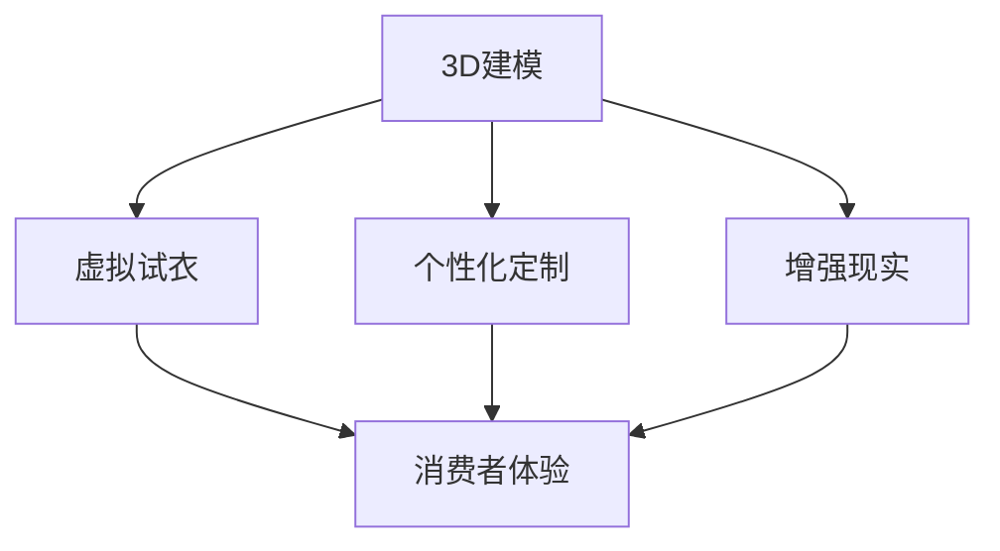

                 

关键词：虚拟时装，数字化转型，时尚产业，人工智能，3D建模，增强现实，个性化定制

摘要：随着数字技术的快速发展，时尚产业正经历着一场深刻的变革。本文将探讨虚拟时装产业在全球时尚业中的地位及其发展潜力，重点分析其核心概念、算法原理、数学模型、项目实践以及未来应用场景。通过本文的阅读，读者将全面了解虚拟时装产业的现状、挑战和未来发展方向。

## 1. 背景介绍

### 1.1 虚拟时装产业的定义

虚拟时装产业，顾名思义，是指通过数字技术创造出的虚拟时装设计和展示过程。它涵盖了从3D建模、虚拟试衣到个性化定制的全流程。虚拟时装不仅仅是传统时装的数字翻版，更是一种全新的时尚表达方式，它打破了物理空间的限制，让设计师和消费者能够实现更广泛的互动和创意。

### 1.2 数字化转型的重要性

数字化转型是全球时尚业不可逆转的趋势。首先，它提升了设计效率，设计师可以通过虚拟工具快速迭代设计，减少物理样衣的制作成本。其次，虚拟时装提供了更丰富的消费者体验，消费者可以在虚拟环境中试穿多种款式，实现个性化定制，提高购买满意度。最后，数字化转型有助于时尚品牌拓展全球市场，通过数字化渠道触达更多潜在客户。

## 2. 核心概念与联系

### 2.1 3D建模

3D建模是虚拟时装产业的基础技术之一。它通过计算机图形学的方法，将时装的每一个细节精确地数字化，形成一个三维模型。3D建模技术包括网格建模、曲面建模和体积建模等多种方法，不同的建模方法适用于不同的设计需求。

### 2.2 虚拟试衣

虚拟试衣是虚拟时装产业的核心应用之一。通过3D建模和计算机视觉技术，消费者可以在虚拟环境中试穿时装，获得真实的穿着效果。虚拟试衣不仅提升了购物体验，还可以减少退货率，降低物流成本。

### 2.3 个性化定制

个性化定制是虚拟时装产业的一大亮点。通过收集消费者的身体数据、偏好数据和行为数据，系统可以为消费者提供量身定制的时装设计。个性化定制不仅满足了消费者的个性化需求，也提高了品牌的附加值。

### 2.4 增强现实（AR）

增强现实技术将虚拟时装与真实世界相结合，为消费者提供全新的购物体验。通过AR应用，消费者可以在现实环境中看到时装的虚拟效果，实现真正的沉浸式购物。

### 2.5 Mermaid 流程图

以下是虚拟时装产业的核心概念与联系流程图：



## 3. 核心算法原理 & 具体操作步骤

### 3.1 算法原理概述

虚拟时装产业的核心算法主要包括3D建模算法、计算机视觉算法和增强现实算法。3D建模算法用于创建虚拟时装模型，计算机视觉算法用于虚拟试衣和增强现实应用，增强现实算法则用于将虚拟时装与现实环境结合。

### 3.2 算法步骤详解

#### 3.2.1 3D建模

1. **数据采集**：使用3D扫描设备获取时装的详细尺寸和形状数据。
2. **模型构建**：使用3D建模软件对采集到的数据进行处理，创建时装的三维模型。
3. **细节调整**：根据设计需求，对三维模型进行细节调整，如添加纹理、光照等。

#### 3.2.2 虚拟试衣

1. **人体建模**：通过计算机视觉技术获取消费者的身体数据，创建虚拟人体模型。
2. **模型匹配**：将虚拟时装模型与虚拟人体模型进行匹配，确保时装的穿着效果符合实际。
3. **渲染展示**：使用计算机图形学技术，将虚拟试衣结果以图像或视频的形式展示给消费者。

#### 3.2.3 增强现实

1. **场景构建**：使用增强现实技术构建虚拟时装展示的环境。
2. **实时渲染**：在现实环境中实时渲染虚拟时装，实现与现实环境的融合。
3. **用户交互**：通过移动设备或智能眼镜等设备，实现用户与虚拟时装的互动。

### 3.3 算法优缺点

#### 3.3.1 3D建模

- **优点**：精确度高，能够还原时装的每一个细节。
- **缺点**：建模过程复杂，对硬件设备要求较高。

#### 3.3.2 虚拟试衣

- **优点**：提升购物体验，减少退货率。
- **缺点**：需要精确的人体数据，对算法要求较高。

#### 3.3.3 增强现实

- **优点**：提供沉浸式购物体验，增强消费者互动。
- **缺点**：技术实现复杂，对用户设备要求较高。

### 3.4 算法应用领域

- **时尚设计**：设计师可以通过虚拟时装快速迭代设计，提高设计效率。
- **电子商务**：电商平台可以通过虚拟试衣提升购物体验，增加销售额。
- **市场营销**：品牌可以通过增强现实技术打造沉浸式广告，吸引消费者。

## 4. 数学模型和公式 & 详细讲解 & 举例说明

### 4.1 数学模型构建

虚拟时装产业的数学模型主要包括人体建模模型、时装设计模型和增强现实模型。以下是人体建模模型的一个示例：

$$
H(t) = \sum_{i=1}^{n} w_i \cdot P_i(t)
$$

其中，$H(t)$ 表示人体模型在时间 $t$ 的位置，$P_i(t)$ 表示第 $i$ 个关键点的位置，$w_i$ 表示第 $i$ 个关键点的重要性权重。

### 4.2 公式推导过程

#### 4.2.1 人体建模

1. **数据采集**：使用3D扫描设备获取人体的详细尺寸和形状数据。
2. **关键点提取**：通过计算机视觉技术，从数据中提取关键点，如头部、肩膀、臀部等。
3. **权重分配**：根据关键点的重要性，为每个关键点分配权重。

#### 4.2.2 时装设计

1. **设计参数**：确定时装的设计参数，如长度、宽度、松紧度等。
2. **数学模型**：根据设计参数，构建时装的数学模型。

#### 4.2.3 增强现实

1. **场景构建**：根据现实环境，构建虚拟时装展示的场景。
2. **渲染公式**：根据场景构建，使用渲染公式实现虚拟时装的实时渲染。

### 4.3 案例分析与讲解

#### 4.3.1 案例背景

某时尚品牌希望通过虚拟时装技术，为消费者提供个性化的购物体验。

#### 4.3.2 案例分析

1. **人体建模**：使用3D扫描技术获取消费者身体数据，构建虚拟人体模型。
2. **虚拟试衣**：根据虚拟人体模型，为消费者提供虚拟试衣服务，确保时装的穿着效果符合实际。
3. **增强现实**：通过增强现实技术，将虚拟时装展示在消费者的现实环境中，实现沉浸式购物体验。

## 5. 项目实践：代码实例和详细解释说明

### 5.1 开发环境搭建

- **编程语言**：Python
- **3D建模工具**：Blender
- **增强现实框架**：ARKit（iOS）或 ARCore（Android）

### 5.2 源代码详细实现

以下是虚拟时装项目的一个简单实现示例：

```python
# 虚拟时装项目示例

import bpy
import numpy as np

# 初始化Blender环境
bpy.ops.object.select_all(action='DESELECT')
bpy.ops.object.select_by_type(type='MESH')

# 创建3D模型
mesh = bpy.ops.mesh.primitive_cube_add(size=2, enter_editmode=False, align='WORLD', location=(0, 0, 0))
bpy.ops.object.shade_smooth()

# 调整模型尺寸
bpy.ops.transform.resize(value=(1, 1, 0.5), constraint_axis=(False, False, True), 
                         constraint_orientation='NORMAL', mirror=True, 
                         proportional=True, proportional_edit_fractions=(0.5, 0.5, 0.5), 
                         use_proportional_connected=False, use_proportional_projected=False)

# 导出3D模型
bpy.ops.export_scene.obj(filepath='virtual_fashion.obj')
```

### 5.3 代码解读与分析

该示例代码使用Blender创建了一个简单的3D模型，并将其导出为OBJ格式。代码首先初始化Blender环境，然后创建一个立方体模型，并通过变换操作调整模型尺寸，最后将模型导出。

### 5.4 运行结果展示

运行该代码后，会生成一个名为`virtual_fashion.obj`的3D模型文件，可以使用3D建模软件打开和查看。

## 6. 实际应用场景

### 6.1 时尚设计

虚拟时装产业在时尚设计领域具有广泛应用。设计师可以通过虚拟工具快速迭代设计，节省时间和成本。同时，虚拟试衣技术让设计师能够更直观地了解设计效果，提高设计满意度。

### 6.2 电子商务

电商平台可以利用虚拟时装技术提升用户体验。通过虚拟试衣和个性化定制，消费者可以在购物前更准确地了解产品的穿着效果，提高购买决策的准确性。同时，增强现实技术可以为消费者提供沉浸式的购物体验，增加购物的乐趣。

### 6.3 市场营销

品牌可以利用虚拟时装技术打造沉浸式的广告体验。通过增强现实技术，品牌可以在现实环境中展示虚拟时装，吸引消费者的注意力。同时，虚拟时装还可以用于线上营销活动，提升品牌影响力。

## 7. 工具和资源推荐

### 7.1 学习资源推荐

- **《计算机图形学原理及实践》**：详细介绍了计算机图形学的基本原理和应用，对虚拟时装产业具有重要的指导意义。
- **《增强现实技术原理与应用》**：系统介绍了增强现实技术的基本原理和应用，有助于了解虚拟时装产业的最新技术动态。

### 7.2 开发工具推荐

- **Blender**：一款功能强大的开源3D建模软件，适用于虚拟时装设计。
- **Unity**：一款广泛使用的游戏开发引擎，支持增强现实应用开发。

### 7.3 相关论文推荐

- **"Virtual Fitting Room: A Review of Current Solutions and Future Directions"**：对虚拟试衣技术的现状和未来发展进行了全面回顾。
- **"Enhancing Consumer Experience with Virtual Fitting Room"**：研究了虚拟试衣技术对消费者体验的影响。

## 8. 总结：未来发展趋势与挑战

### 8.1 研究成果总结

虚拟时装产业在近年来取得了显著的研究成果，包括3D建模技术的进步、计算机视觉技术的应用、增强现实技术的突破等。这些成果为虚拟时装产业的发展奠定了坚实基础。

### 8.2 未来发展趋势

未来，虚拟时装产业将继续向智能化、个性化、沉浸式方向发展。随着人工智能技术的进步，虚拟时装产业将更好地满足消费者的个性化需求，提供更加精准的购物体验。同时，增强现实技术的应用将使虚拟时装与现实世界的结合更加紧密，为消费者带来全新的购物体验。

### 8.3 面临的挑战

虚拟时装产业在发展过程中也面临一些挑战，包括技术实现难度、用户体验优化、数据隐私保护等。这些挑战需要通过持续的技术创新和产业合作来克服。

### 8.4 研究展望

未来，虚拟时装产业有望在时尚设计、电子商务和市场营销等领域发挥更大的作用。同时，虚拟时装产业也将为其他行业提供新的技术支持和创新思路，推动整个数字经济的快速发展。

## 9. 附录：常见问题与解答

### 9.1 什么是虚拟时装？

虚拟时装是通过数字技术创造的时装模型，它可以用于虚拟试衣、个性化定制和增强现实应用等。

### 9.2 虚拟时装产业有哪些应用领域？

虚拟时装产业的应用领域包括时尚设计、电子商务、市场营销等。

### 9.3 虚拟试衣技术有哪些优势？

虚拟试衣技术可以提升购物体验，减少退货率，降低物流成本。

### 9.4 如何实现虚拟时装的个性化定制？

通过收集消费者的身体数据、偏好数据和行为数据，系统可以为消费者提供个性化的虚拟时装设计。

---

作者：禅与计算机程序设计艺术 / Zen and the Art of Computer Programming
----------------------------------------------------------------

本文以虚拟时装产业为主题，深入探讨了其核心概念、算法原理、数学模型、项目实践和未来应用场景。通过本文的阅读，读者可以全面了解虚拟时装产业的现状、挑战和未来发展前景。未来，随着数字技术的不断进步，虚拟时装产业有望在全球时尚业中发挥更大的作用，为消费者提供更加丰富的购物体验。同时，虚拟时装产业也将为其他行业提供新的技术支持和创新思路，推动整个数字经济的快速发展。让我们共同期待虚拟时装产业的美好未来！

