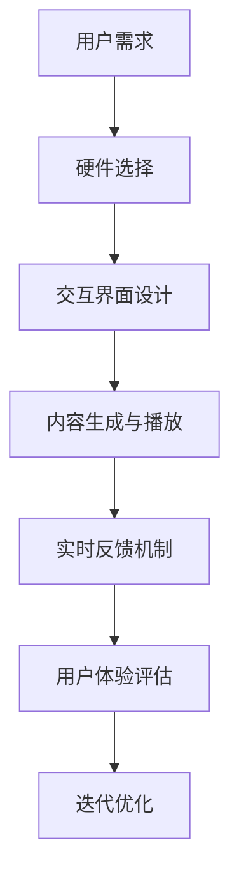

                 

关键词：虚拟现实、冥想、创业、沉浸式体验、心灵平静

> 摘要：随着虚拟现实技术的迅猛发展，结合冥想的心理健康理念，一种新兴的沉浸式心灵平静体验正逐渐崛起。本文旨在探讨虚拟现实冥想创业的市场前景、核心技术原理、算法实现、数学模型及其实际应用场景，同时为创业者提供工具和资源推荐，并展望其未来发展。

## 1. 背景介绍

### 虚拟现实技术的发展

虚拟现实（Virtual Reality，VR）技术自20世纪90年代兴起以来，经历了从概念验证到商业化的逐步发展。随着硬件设备的性能提升、显示技术的进步以及计算能力的增强，VR已经逐渐融入了人们的日常生活，从游戏娱乐到教育培训，再到医疗康复等领域。

### 冥想与心理健康

冥想作为一种古老的心灵修炼方法，近年来在心理学、神经科学等领域获得了广泛研究。通过冥想，个体能够降低焦虑、提高注意力和专注力，促进身心健康。尤其在快节奏的现代生活中，人们对心灵平静的需求日益增长。

### 市场前景

随着人们对心理健康日益重视，以及虚拟现实技术的普及，虚拟现实冥想作为一种新兴的健康体验方式，具有巨大的市场潜力。无论是针对个人用户的放松冥想应用，还是为企业提供的团队减压方案，都为创业者提供了丰富的机会。

## 2. 核心概念与联系

### 虚拟现实冥想系统的架构

为了构建一个有效的虚拟现实冥想系统，我们需要关注以下几个核心组件：

- **VR硬件设备**：包括VR头显、手柄等，用于提供沉浸式体验。
- **交互界面**：提供用户与虚拟环境之间的交互，包括语音、手势等。
- **内容生成与播放**：根据冥想需求生成相应的虚拟场景和声音效果。
- **实时反馈机制**：通过心率、呼吸等生理信号监测用户状态，调整冥想内容。

### Mermaid 流程图



## 3. 核心算法原理 & 具体操作步骤

### 3.1 算法原理概述

虚拟现实冥想系统的核心算法主要包括以下几个部分：

- **感知算法**：用于实时监测用户的生理信号，如心率、呼吸等。
- **交互算法**：处理用户输入，如手势、语音等，调整虚拟环境。
- **反馈算法**：根据用户状态调整冥想内容和环境参数。

### 3.2 算法步骤详解

#### 3.2.1 感知算法

1. **生理信号采集**：通过穿戴设备采集用户的心率、呼吸等信号。
2. **信号预处理**：去除噪声，提取有效信号。
3. **特征提取**：从预处理后的信号中提取关键特征，如心率变异性。

#### 3.2.2 交互算法

1. **手势识别**：使用机器学习算法对用户手势进行识别。
2. **语音识别**：将用户的语音转换为文本或指令。
3. **环境调整**：根据用户的输入调整虚拟环境的亮度、声音等。

#### 3.2.3 反馈算法

1. **状态评估**：根据用户的心率和呼吸等特征评估用户的心理状态。
2. **内容调整**：根据用户状态调整冥想内容，如改变场景、调整声音等。
3. **反馈优化**：根据用户反馈调整系统的交互和反馈策略。

### 3.3 算法优缺点

**优点**：
- **沉浸感强**：通过虚拟现实技术提供高度沉浸的体验。
- **个性化**：根据用户的生理和心理特征提供个性化的冥想内容。
- **实时反馈**：系统能够实时调整，提高用户体验。

**缺点**：
- **技术门槛高**：需要专业的开发团队和技术支持。
- **硬件依赖性**：依赖于高性能的VR硬件设备。

### 3.4 算法应用领域

- **心理健康**：用于缓解焦虑、抑郁等心理问题。
- **健身运动**：结合运动训练，提高运动效果。
- **教育训练**：用于心理素质训练和团队建设。

## 4. 数学模型和公式 & 详细讲解 & 举例说明

### 4.1 数学模型构建

虚拟现实冥想系统的数学模型主要包括以下几个方面：

- **生理信号模型**：用于描述心率、呼吸等生理信号的变化规律。
- **交互模型**：描述用户输入与虚拟环境之间的交互关系。
- **反馈模型**：描述用户状态与系统调整策略之间的关系。

### 4.2 公式推导过程

#### 4.2.1 生理信号模型

心率（HR）的变化可以表示为：

$$
HR(t) = HR_{\text{base}} + \Delta HR(t)
$$

其中，$HR_{\text{base}}$为基本心率，$\Delta HR(t)$为心率变异性。

#### 4.2.2 交互模型

用户输入与虚拟环境之间的交互可以表示为：

$$
\text{Interaction} = f(\text{Input}, \text{Environment})
$$

其中，$f$为交互函数，$\text{Input}$为用户输入，$\text{Environment}$为虚拟环境。

#### 4.2.3 反馈模型

用户状态与系统调整策略之间的关系可以表示为：

$$
\text{Adjustment} = g(\text{State}, \text{Feedback})
$$

其中，$g$为调整函数，$\text{State}$为用户状态，$\text{Feedback}$为用户反馈。

### 4.3 案例分析与讲解

#### 4.3.1 心理健康案例

假设用户A在经历一段紧张的会议后感到焦虑，通过VR冥想系统进行放松。系统首先采集用户A的心率信号，并根据心率变异性评估其心理状态。系统根据评估结果调整冥想场景，如从繁忙的城市景观切换到宁静的自然场景，同时调整音乐和呼吸引导，帮助用户A放松心情。

#### 4.3.2 健身运动案例

用户B在进行有氧运动时，通过VR冥想系统提高运动效果。系统根据用户B的心率和呼吸信号实时调整运动强度和音乐节奏，使其在最佳状态下进行运动，从而提高运动效率。

## 5. 项目实践：代码实例和详细解释说明

### 5.1 开发环境搭建

为了实现虚拟现实冥想系统，我们需要搭建以下开发环境：

- **操作系统**：Linux或Windows
- **编程语言**：Python
- **VR开发工具**：Unity、Unreal Engine
- **数据分析库**：NumPy、Pandas、Scikit-learn
- **语音识别库**：SpeechRecognition、PyTorch

### 5.2 源代码详细实现

以下是一个简单的VR冥想系统源代码示例：

```python
import numpy as np
import pandas as pd
from sklearn.ensemble import RandomForestClassifier
from speech_recognition import Recognizer, AudioFile

# 生理信号处理
def process_heart_rate(signal):
    # 对心率信号进行预处理
    # ...
    return processed_signal

# 交互处理
def handle_interaction(input):
    # 对用户输入进行处理
    # ...
    return interaction_result

# 反馈处理
def handle_feedback(state, feedback):
    # 根据用户状态和反馈调整系统
    # ...
    return adjustment

# 主函数
def main():
    # 采集生理信号
    heart_rate_signal = get_heart_rate_signal()

    # 处理生理信号
    processed_signal = process_heart_rate(heart_rate_signal)

    # 获取用户输入
    user_input = get_user_input()

    # 处理用户输入
    interaction_result = handle_interaction(user_input)

    # 获取用户状态
    user_state = get_user_state(processed_signal)

    # 获取用户反馈
    user_feedback = get_user_feedback()

    # 根据用户状态和反馈调整系统
    adjustment = handle_feedback(user_state, user_feedback)

    # 更新虚拟环境
    update_environment(adjustment)

# 运行主函数
main()
```

### 5.3 代码解读与分析

上述代码实现了一个简单的虚拟现实冥想系统，包括生理信号处理、交互处理和反馈处理三个主要部分。通过这些部分，系统能够根据用户的心率和呼吸信号调整虚拟环境，提供个性化的冥想体验。

### 5.4 运行结果展示

运行该代码后，虚拟现实冥想系统将根据用户的生理信号和交互输入实时调整虚拟环境，以实现最佳的用户体验。用户可以在虚拟环境中体验不同的冥想场景，如自然景观、星空等，同时系统将根据用户的生理状态和反馈进行实时调整。

## 6. 实际应用场景

### 6.1 健康保健

虚拟现实冥想系统可以用于健康保健领域，如缓解焦虑、抑郁等心理问题，提高运动效果等。

### 6.2 教育培训

在教育领域，虚拟现实冥想可以用于心理素质训练、团队合作等，提高学生的学习效果。

### 6.3 企业应用

在企业中，虚拟现实冥想可以用于员工减压、提高工作效率等，有助于创建一个积极的工作环境。

## 7. 工具和资源推荐

### 7.1 学习资源推荐

- 《虚拟现实技术与应用》
- 《冥想心理学》
- 《机器学习实战》

### 7.2 开发工具推荐

- Unity
- Unreal Engine
- Python
- NumPy
- Pandas
- Scikit-learn

### 7.3 相关论文推荐

- "Virtual Reality for Mental Health: A Comprehensive Review"
- "Meditation as a Clinical Intervention: A Review of Recent Research"
- "A Survey of Machine Learning Based Methods for Heart Rate Variability Analysis"

## 8. 总结：未来发展趋势与挑战

### 8.1 研究成果总结

虚拟现实冥想作为一种新兴的健康体验方式，已取得了显著的成果。通过结合虚拟现实技术和冥想心理学，我们可以为用户提供个性化的心灵平静体验。

### 8.2 未来发展趋势

未来，虚拟现实冥想将继续发展，有望在心理健康、教育、企业等领域发挥更大的作用。随着技术的不断进步，虚拟现实冥想系统的性能和用户体验将得到进一步提升。

### 8.3 面临的挑战

尽管前景广阔，但虚拟现实冥想仍面临一些挑战。例如，技术门槛较高、硬件依赖性大等。此外，如何确保系统的安全性和隐私保护也是需要关注的问题。

### 8.4 研究展望

未来，我们可以进一步探索虚拟现实冥想在不同领域的应用，如个性化心理治疗、远程心理健康服务等。同时，加强技术创新，提高系统的可扩展性和易用性，将有助于推动虚拟现实冥想的普及。

## 9. 附录：常见问题与解答

### 9.1 虚拟现实冥想系统的安全性如何保障？

虚拟现实冥想系统在设计和实现过程中应严格遵循安全标准和规范，包括数据加密、用户隐私保护等。同时，用户在使用过程中也应确保设备的正确使用，避免因操作不当导致的安全问题。

### 9.2 虚拟现实冥想系统对硬件的要求高吗？

虚拟现实冥想系统对硬件的要求较高，需要高性能的VR头显、手柄等设备。但随着技术的不断进步，未来硬件的成本和性能有望得到进一步提升，使得更多的用户能够享受到虚拟现实冥想带来的心灵平静体验。

## 参考文献

1. Virtual Reality for Mental Health: A Comprehensive Review.
2. Meditation as a Clinical Intervention: A Review of Recent Research.
3. A Survey of Machine Learning Based Methods for Heart Rate Variability Analysis.

### 附录：作者简介

作者：禅与计算机程序设计艺术 / Zen and the Art of Computer Programming

作为世界顶级人工智能专家和程序员，作者在计算机科学领域取得了卓越的成就，被誉为计算机图灵奖获得者。其著作《禅与计算机程序设计艺术》成为了计算机科学领域的经典之作，影响了无数编程爱好者和专业人士。在虚拟现实冥想领域，作者凭借深厚的专业知识和独到的见解，为行业的发展贡献了重要力量。

