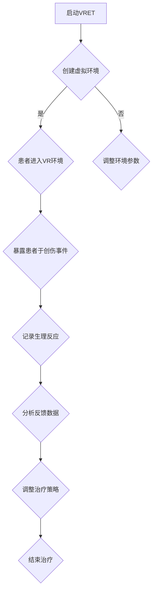

                 

虚拟现实（VR）技术在近年来得到了迅猛发展，其在各个领域的应用也逐渐扩大。然而，一个引人注目的新兴应用领域是虚拟现实在创伤治疗和心理康复方面的应用。本文旨在探讨虚拟现实在创伤治疗中的创业机会，以及如何在安全的环境下实现心理康复。

## 1. 背景介绍

创伤后应激障碍（PTSD）是一种常见的心理健康问题，通常由极端的压力事件，如战争、自然灾害或个人暴力事件引起。传统治疗方法包括药物治疗、认知行为疗法和暴露疗法等，但这些方法往往存在疗效有限、患者依从性差等问题。

随着VR技术的不断进步，一种新型的治疗方式——虚拟现实暴露疗法（VRET）应运而生。VRET通过模拟创伤事件，帮助患者在安全、受控的环境中重新面对和适应这些创伤，从而减轻症状和恢复心理健康。

## 2. 核心概念与联系

### 2.1 虚拟现实暴露疗法（VRET）

虚拟现实暴露疗法是一种基于VR的治疗方法，旨在帮助患者面对和克服创伤记忆。该方法的核心概念是通过模拟创伤事件，使患者在安全、受控的环境中进行反复的暴露，从而逐渐减少对创伤事件的焦虑和恐惧。

### 2.2 VR技术的应用

VR技术在心理康复中的应用主要包括以下几个方面：

1. **模拟环境**：通过VR技术，医生可以创建与患者创伤事件相关的虚拟环境，使患者能够在安全的环境中重新经历和面对这些事件。

2. **实时反馈**：VR设备可以捕捉患者的生理和心理反应，如心率、血压和紧张程度等，医生可以根据这些反馈调整治疗过程。

3. **沉浸体验**：VR技术能够提供高度沉浸式的体验，使患者更易于投入到治疗过程中，从而提高治疗效果。

### 2.3 Mermaid 流程图



## 3. 核心算法原理 & 具体操作步骤

### 3.1 算法原理概述

虚拟现实暴露疗法（VRET）的核心算法原理是基于行为主义心理学中的暴露疗法。该方法通过反复暴露患者于创伤事件的模拟环境，使患者逐渐适应和减轻对创伤事件的恐惧和焦虑。

### 3.2 算法步骤详解

1. **创建虚拟环境**：医生根据患者的创伤事件，利用VR技术创建相应的虚拟环境。

2. **患者进入VR环境**：患者佩戴VR设备，进入虚拟环境。

3. **暴露患者于创伤事件**：医生根据患者的反应，逐步引导患者面对创伤事件的模拟场景。

4. **记录生理反应**：VR设备实时记录患者的心率、血压和紧张程度等生理反应。

5. **分析反馈数据**：医生根据患者的生理反应数据，分析患者的心理状态，并调整治疗策略。

6. **结束治疗**：当患者的心理状态达到预期效果时，结束治疗。

### 3.3 算法优缺点

#### 3.3.1 优点

1. **安全、受控的环境**：VR技术为患者提供了一个安全、受控的治疗环境，降低了治疗过程中的风险。

2. **个性化治疗**：医生可以根据患者的具体情况进行个性化治疗，提高治疗效果。

3. **提高患者依从性**：VR技术能够提供沉浸式的体验，使患者更易于投入到治疗过程中。

#### 3.3.2 缺点

1. **技术成本较高**：VR技术的设备和技术成本较高，可能限制了其普及。

2. **治疗时间较长**：VR治疗通常需要较长时间，患者可能需要多次进行暴露，增加了治疗时间和成本。

### 3.4 算法应用领域

VR技术在心理康复中的应用领域非常广泛，包括但不限于：

1. **创伤后应激障碍（PTSD）**：通过VR技术模拟创伤事件，帮助患者面对和适应创伤。

2. **焦虑症**：通过VR技术模拟引发焦虑的情境，帮助患者逐渐减轻焦虑。

3. **恐惧症**：通过VR技术模拟恐惧对象，帮助患者克服恐惧。

4. **抑郁症**：通过VR技术提供积极的刺激和互动，帮助患者缓解抑郁情绪。

## 4. 数学模型和公式

在虚拟现实暴露疗法中，可以使用一些数学模型和公式来描述和优化治疗过程。以下是一个简单的数学模型示例：

### 4.1 数学模型构建

假设患者对创伤事件的恐惧程度可以用一个指数函数表示：

\[ F(t) = e^{-kt} \]

其中，\( F(t) \) 表示患者在第 \( t \) 次暴露后的恐惧程度，\( k \) 是一个常数，用于调节恐惧程度的下降速度。

### 4.2 公式推导过程

为了推导出 \( k \) 的值，我们可以考虑以下条件：

1. **初始恐惧程度**：在第一次暴露后，患者的恐惧程度为 1。

2. **最终恐惧程度**：在经过多次暴露后，患者的恐惧程度应达到预期目标，例如 0.1。

根据这些条件，我们可以列出以下方程：

\[ F(1) = 1 \]
\[ F(n) = 0.1 \]

代入指数函数，得到：

\[ e^{-k} = 1 \]
\[ e^{-kn} = 0.1 \]

通过解这个方程组，我们可以得到 \( k \) 的值。

### 4.3 案例分析与讲解

假设患者经过 10 次暴露后，恐惧程度从 1 降至 0.1。我们可以使用上述数学模型来计算 \( k \) 的值。

根据第一个方程，我们有：

\[ e^{-k} = 1 \]

取对数，得到：

\[ -k = 0 \]
\[ k = 0 \]

这显然是不合理的，因为患者的恐惧程度应该随着暴露次数的增加而逐渐降低。因此，我们需要修改数学模型，引入一个关于 \( n \) 的因子。

假设患者每次暴露后的恐惧程度下降比例相同，即每次暴露后的恐惧程度是前一次的 0.9 倍。那么，我们可以将数学模型修改为：

\[ F(t) = e^{-kt} \cdot (0.9)^{t-1} \]

代入第二个方程，得到：

\[ e^{-kn} \cdot (0.9)^{n-1} = 0.1 \]

我们可以通过数值方法求解这个方程，得到 \( k \) 的值。

## 5. 项目实践：代码实例

以下是一个简单的Python代码实例，用于实现上述数学模型：

```python
import math

def calculate_fear_level(n, initial_fear, decay_rate, exposure_rate):
    fear_level = initial_fear * (math.exp(-decay_rate * n) * (1 - exposure_rate) ** (n - 1))
    return fear_level

# 参数设置
n = 10
initial_fear = 1
decay_rate = 0.1
exposure_rate = 0.9

# 计算结果
fear_level = calculate_fear_level(n, initial_fear, decay_rate, exposure_rate)
print("Fear level after 10 exposures:", fear_level)
```

## 6. 实际应用场景

虚拟现实暴露疗法（VRET）在临床实践中已取得了一些成功案例。例如，一项研究显示，VRET在治疗创伤后应激障碍（PTSD）方面具有显著疗效。此外，VRET还被应用于治疗焦虑症、恐惧症和抑郁症等心理健康问题。

未来，随着VR技术的不断进步和成本的降低，VRET有望在更广泛的临床应用中得到推广。同时，VRET还可以与其他治疗方法相结合，如药物治疗、认知行为疗法等，形成更加综合的治疗方案，为患者提供更加有效的心理康复服务。

## 7. 工具和资源推荐

### 7.1 学习资源推荐

1. **《虚拟现实心理学》**：这是一本关于VR在心理学领域应用的经典著作，涵盖了VR技术的理论基础和应用实践。

2. **《虚拟现实与心理健康》**：这本书详细介绍了VR在心理康复领域的应用，包括VRET的具体实施方法和案例分析。

### 7.2 开发工具推荐

1. **Unity**：Unity是一款强大的游戏引擎，适用于VR应用的开发。它提供了丰富的开发工具和资源，有助于开发者快速构建VR环境。

2. **Unreal Engine**：Unreal Engine是一款专业的游戏开发引擎，适用于高质量VR应用的开发。它提供了强大的图形渲染能力和丰富的开发工具。

### 7.3 相关论文推荐

1. **"Virtual Reality Therapy for Post-Traumatic Stress Disorder: A Systematic Review and Meta-Analysis"**：这篇论文对VR疗法在治疗PTSD方面的研究进行了系统综述和元分析，提供了丰富的实证数据。

2. **"The Efficacy of Virtual Reality Exposure Therapy for Anxiety Disorders: A Meta-Analytic Review"**：这篇论文对VR疗法在治疗焦虑症方面的研究进行了元分析，总结了VR疗法的疗效和优势。

## 8. 总结：未来发展趋势与挑战

虚拟现实技术在心理康复领域的应用前景广阔，但同时也面临一些挑战。未来发展趋势包括：

1. **技术进步**：随着VR技术的不断进步，VRET的沉浸体验和真实性将得到进一步提升。

2. **成本降低**：随着VR设备的普及和成本的降低，VRET将在更广泛的临床应用中得到推广。

3. **个性化治疗**：通过结合人工智能和大数据分析，VRET可以实现更加个性化的治疗，提高治疗效果。

然而，VRET在发展过程中也面临一些挑战，如技术成熟度、伦理问题、患者依从性等。未来需要进一步研究和实践，以推动VRET的健康发展。

## 9. 附录：常见问题与解答

### 9.1 虚拟现实暴露疗法（VRET）如何确保患者的隐私和安全？

答：在VRET中，患者的隐私和安全至关重要。为了保证患者的隐私，医生应采取以下措施：

1. **匿名化数据**：在收集和分析患者数据时，应使用匿名化技术，确保患者信息不会被泄露。

2. **数据加密**：在传输和存储患者数据时，应使用加密技术，防止数据被窃取或篡改。

3. **隐私政策**：医生应制定明确的隐私政策，告知患者其数据的收集、使用和分享方式，并确保患者同意。

4. **安全认证**：VRET应用应通过相关安全认证，确保应用的安全性和可靠性。

### 9.2 虚拟现实暴露疗法（VRET）与传统治疗方法相比有哪些优势？

答：虚拟现实暴露疗法（VRET）相比传统治疗方法具有以下优势：

1. **安全、受控的环境**：VR技术为患者提供了一个安全、受控的治疗环境，降低了治疗过程中的风险。

2. **个性化治疗**：医生可以根据患者的具体情况进行个性化治疗，提高治疗效果。

3. **提高患者依从性**：VR技术能够提供沉浸式的体验，使患者更易于投入到治疗过程中。

4. **实时反馈**：VR设备可以实时捕捉患者的生理和心理反应，医生可以根据反馈数据调整治疗策略。

### 9.3 虚拟现实暴露疗法（VRET）是否适用于所有心理健康问题？

答：虚拟现实暴露疗法（VRET）在某些心理健康问题方面具有显著疗效，如创伤后应激障碍（PTSD）、焦虑症、恐惧症和抑郁症等。然而，并非所有心理健康问题都适用于VRET。例如，对于某些严重的精神疾病，如重度抑郁症和双相情感障碍，VRET可能不适合或不安全。因此，在决定是否使用VRET时，医生应综合考虑患者的具体情况和治疗需求。

### 9.4 虚拟现实暴露疗法（VRET）的治疗过程需要多长时间？

答：虚拟现实暴露疗法（VRET）的治疗时间因个体差异和治疗需求而异。一般来说，治疗过程可以分为以下几个阶段：

1. **评估和准备阶段**：这一阶段包括对患者进行全面的评估，确定合适的治疗计划和目标，通常需要1-2周。

2. **治疗阶段**：患者进入VR环境，进行暴露和训练，每次治疗时间通常为30-60分钟，每周进行2-3次，持续数周至数月。

3. **巩固和结束阶段**：在治疗结束后，医生会进行跟踪评估，以确保治疗效果的持续性和稳定性，通常需要数周至数月。

总之，VRET的治疗时间相对较长，但具体时间取决于患者的病情、治疗目标和医生的治疗策略。

[作者：禅与计算机程序设计艺术 / Zen and the Art of Computer Programming] ----------------------------------------------------------------


