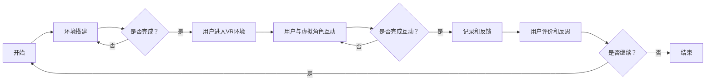

                 

关键词：虚拟现实，同理心，沉浸式体验，社交技能提升，创业，培训

> 摘要：本文探讨了虚拟现实（VR）在同理心培训领域中的潜在应用，通过构建沉浸式社交环境，实现社交技能的提升。文章分析了VR技术的核心原理、相关算法、数学模型以及实际应用案例，并展望了未来VR同理心培训的发展趋势和面临的挑战。

## 1. 背景介绍

在当今社会，人际交往能力已成为个人成功和幸福的重要因素之一。然而，许多人由于种种原因，如社交恐惧、沟通障碍等，无法有效地与他人互动。这导致他们在社交场合中感到不安、紧张，甚至产生焦虑情绪。为了解决这一问题，传统的社交技能培训方法如角色扮演、情境模拟等应运而生。然而，这些方法往往存在一定的局限性，例如缺乏真实感和互动性，难以长期维持培训效果。

近年来，虚拟现实（VR）技术的迅猛发展为我们提供了一种全新的解决方案。VR技术通过创建高度逼真的虚拟环境，使用户能够在虚拟世界中与虚拟角色进行互动，从而实现沉浸式体验。这种体验不仅能够模拟真实的社交场景，还可以通过实时反馈机制帮助用户掌握和提升社交技能。

## 2. 核心概念与联系

### 2.1 虚拟现实（VR）技术原理

虚拟现实技术通过计算机图形学、人机交互技术和传感器技术等多种技术手段，创建一个高度逼真的三维虚拟世界。用户可以通过头戴式显示器、手柄、动作捕捉设备等硬件设备与虚拟世界进行交互。VR技术的核心原理包括以下几个方面：

1. **三维建模**：利用计算机图形学技术，将现实世界的三维物体和场景进行数字化建模。
2. **实时渲染**：通过图形处理器（GPU）进行快速渲染，生成逼真的三维图像。
3. **人机交互**：使用手柄、动作捕捉设备等硬件设备，实现用户与虚拟世界的实时互动。
4. **感知反馈**：通过传感器技术，如头戴式显示器的定位跟踪、手柄的触感反馈等，增强用户的沉浸感。

### 2.2 同理心培训的核心概念

同理心是指个体能够从他人的角度理解情感、感受和想法的能力。同理心培训的目标是帮助个体提高同理心水平，增强社交技能，提高人际交往能力。同理心培训的核心概念包括以下几个方面：

1. **情感识别**：通过训练，提高个体识别和理解他人情感的能力。
2. **情感表达**：帮助个体学会如何准确地表达自己的情感，与他人建立良好的沟通。
3. **情感共享**：鼓励个体在社交互动中，分享自己的情感体验，增进相互理解。
4. **情境模拟**：通过模拟真实的社交场景，训练个体在具体情境中应用同理心。

### 2.3 虚拟现实与同理心培训的联系

虚拟现实技术为同理心培训提供了一个理想的平台。通过虚拟现实技术，可以创建高度逼真的社交场景，让用户在虚拟世界中与虚拟角色进行互动，从而实现沉浸式体验。这种体验有助于用户更好地理解他人的情感和需求，提高同理心水平。同时，虚拟现实技术还可以提供实时反馈机制，帮助用户在实践中不断调整和改进自己的社交行为。

### 2.4 Mermaid 流程图

下面是一个描述虚拟现实同理心培训流程的 Mermaid 流程图：



## 3. 核心算法原理 & 具体操作步骤

### 3.1 算法原理概述

虚拟现实同理心培训的核心算法主要涉及两个方面：情感识别算法和情境模拟算法。

#### 3.1.1 情感识别算法

情感识别算法是利用计算机视觉和自然语言处理技术，从用户的言行举止中识别情感。具体步骤如下：

1. **语音识别**：通过语音识别技术，将用户的语音转换为文本。
2. **文本情感分析**：利用自然语言处理技术，分析文本中的情感倾向，如正面、负面或中性。
3. **面部表情识别**：通过计算机视觉技术，分析用户的面部表情，识别情感状态。

#### 3.1.2 情境模拟算法

情境模拟算法是利用计算机图形学和虚拟现实技术，创建逼真的社交场景。具体步骤如下：

1. **场景建模**：利用计算机图形学技术，创建虚拟社交环境的三维模型。
2. **场景渲染**：利用实时渲染技术，生成逼真的三维图像。
3. **交互设计**：设计虚拟角色的行为和互动逻辑，实现用户与虚拟角色的实时互动。

### 3.2 算法步骤详解

#### 3.2.1 情感识别算法步骤

1. **语音识别**：通过语音识别技术，将用户的语音转换为文本。
2. **情感分类**：利用自然语言处理技术，对文本进行情感分类，确定情感的倾向。
3. **情感反馈**：根据用户情感状态，提供相应的情感反馈，如语音、文本或表情。

#### 3.2.2 情境模拟算法步骤

1. **场景建模**：利用计算机图形学技术，创建虚拟社交环境的三维模型。
2. **场景渲染**：利用实时渲染技术，生成逼真的三维图像。
3. **用户交互**：设计虚拟角色的行为和互动逻辑，实现用户与虚拟角色的实时互动。
4. **情境反馈**：根据用户的行为和情感状态，提供相应的情境反馈，如场景变化、角色表情等。

### 3.3 算法优缺点

#### 优点

1. **高度逼真的沉浸感**：通过虚拟现实技术，用户可以体验到高度逼真的社交场景，提高同理心培训的效果。
2. **实时反馈机制**：情感识别算法和情境模拟算法可以实时分析用户的行为和情感状态，提供个性化的反馈。
3. **可扩展性**：虚拟现实同理心培训系统可以根据不同的培训需求，扩展和调整场景和角色。

#### 缺点

1. **技术门槛**：虚拟现实技术具有较高的技术门槛，需要专业的开发团队进行开发。
2. **硬件成本**：虚拟现实设备如头戴式显示器、动作捕捉设备等成本较高，可能限制培训的普及。
3. **隐私问题**：虚拟现实技术可能会涉及用户隐私，需要确保数据的安全和保密。

### 3.4 算法应用领域

虚拟现实同理心培训算法可以应用于多个领域，如教育、医疗、心理咨询等。具体应用领域包括：

1. **教育**：用于提高学生的社交技能，增强团队协作能力。
2. **医疗**：用于帮助心理疾病患者进行社交技能训练，提高生活质量。
3. **心理咨询**：用于帮助咨询师进行情境模拟，提高咨询效果。

## 4. 数学模型和公式 & 详细讲解 & 举例说明

### 4.1 数学模型构建

虚拟现实同理心培训的核心算法涉及到多个数学模型，包括情感识别模型和情境模拟模型。下面分别介绍这两种模型的构建过程。

#### 4.1.1 情感识别模型

情感识别模型通常采用机器学习算法，如支持向量机（SVM）、神经网络（NN）等。以支持向量机为例，其基本模型如下：

$$
\begin{aligned}
& \min_{w,b}\frac{1}{2}||w||^2 \\
& s.t.\ y^{(i)}(w^Tx^{(i)}+b) \geq 1, \quad \forall i
\end{aligned}
$$

其中，$w$ 是权重向量，$b$ 是偏置项，$x^{(i)}$ 是输入特征，$y^{(i)}$ 是标签。

#### 4.1.2 情境模拟模型

情境模拟模型通常采用计算机图形学中的渲染算法，如基于物理的渲染（PBR）等。以基于物理的渲染为例，其基本模型如下：

$$
\begin{aligned}
& \text{光照模型：} \\
& L_o(\mathbf{p},\mathbf{e}) = \int_{\Omega} f_r(\mathbf{v},\mathbf{w}) \cdot \mathbf{N} \cdot \mathbf{w} \cdot L_i(\mathbf{p},\mathbf{w}) \, d\omega \\
& \text{反射模型：} \\
& f_r(\mathbf{v},\mathbf{w}) = \frac{R_v(\mathbf{w}) - R_v(\mathbf{v})}{\pi}
\end{aligned}
$$

其中，$L_o$ 是输出的光照强度，$\mathbf{p}$ 是光线入射点，$\mathbf{e}$ 是光线方向，$f_r$ 是反射率，$\mathbf{N}$ 是法线方向，$\mathbf{w}$ 是反射方向，$L_i$ 是光源的光照强度，$R_v$ 是反射率。

### 4.2 公式推导过程

#### 4.2.1 情感识别模型推导

以支持向量机为例，其推导过程如下：

1. **原始问题**：

$$
\begin{aligned}
& \min_{w,b}\frac{1}{2}||w||^2 \\
& s.t.\ y^{(i)}(w^Tx^{(i)}+b) \geq 1, \quad \forall i
\end{aligned}
$$

2. **Lagrange 乘子法**：

引入 Lagrange 乘子 $\alpha_i \geq 0$，构造拉格朗日函数：

$$
L(w,b,\alpha) = \frac{1}{2}||w||^2 + \sum_{i=1}^{n}\alpha_i [1 - y^{(i)}(w^Tx^{(i)}+b)]
$$

3. **KKT 条件**：

$$
\begin{aligned}
& \frac{\partial L}{\partial w} = w - \sum_{i=1}^{n}\alpha_i y^{(i)}x^{(i)} = 0 \\
& \frac{\partial L}{\partial b} = \sum_{i=1}^{n}\alpha_i y^{(i)} = 0 \\
& \alpha_i \geq 0 \\
& y^{(i)}(w^Tx^{(i)}+b) - 1 \geq 0
\end{aligned}
$$

4. **求解**：

根据 KKT 条件，求解得到：

$$
w = \sum_{i=1}^{n}\alpha_i y^{(i)}x^{(i)}
$$

$$
b = \frac{1}{n}\sum_{i=1}^{n}\alpha_i y^{(i)}
$$

#### 4.2.2 情境模拟模型推导

以基于物理的渲染为例，其推导过程如下：

1. **反射模型**：

$$
\mathbf{w} = \mathbf{v} + \mathbf{R}_v(\mathbf{v})
$$

2. **几何光学模型**：

$$
L_i(\mathbf{p},\mathbf{w}) = \frac{L_e + L_d + L_s}{1 + k_d \cdot r + k_s \cdot g}
$$

其中，$L_e$ 是环境光照，$L_d$ 是漫反射光照，$L_s$ 是镜面反射光照，$k_d$ 和 $k_s$ 分别是漫反射和镜面反射系数，$r$ 和 $g$ 分别是入射角和反射角的余弦值。

### 4.3 案例分析与讲解

下面以一个简单的情感识别模型为例，介绍情感识别算法的构建过程。

#### 4.3.1 数据集准备

我们使用一个包含 1000 个文本的情感数据集，每个文本包含一个情感标签（正面、负面或中性）。数据集分为训练集和测试集，其中训练集包含 700 个样本，测试集包含 300 个样本。

#### 4.3.2 特征提取

我们使用自然语言处理技术，从文本中提取特征，如词频、词向量等。以词频为例，我们将每个文本转换为词频向量。

#### 4.3.3 模型训练

我们使用支持向量机（SVM）作为情感识别模型，利用训练集进行模型训练。

```python
from sklearn import svm

# 创建SVM模型
model = svm.SVC()

# 训练模型
model.fit(train_data, train_labels)
```

#### 4.3.4 模型评估

我们使用测试集对模型进行评估，计算模型的准确率。

```python
# 预测测试集
predictions = model.predict(test_data)

# 计算准确率
accuracy = (predictions == test_labels).mean()
print("Accuracy:", accuracy)
```

通过以上步骤，我们完成了情感识别算法的构建过程。在实际应用中，我们可以根据需求调整模型参数，优化模型性能。

## 5. 项目实践：代码实例和详细解释说明

### 5.1 开发环境搭建

为了实践虚拟现实同理心培训项目，我们需要搭建一个开发环境。以下是搭建开发环境的步骤：

1. **安装虚拟现实开发工具**：我们选择 Unity 作为开发工具，安装 Unity 编辑器。
2. **安装虚拟现实插件**：下载并安装 Unity 的 VR 插件，如 VRMADA。
3. **安装依赖库**：下载并安装所需的依赖库，如 TensorFlow、PyTorch 等。
4. **配置开发环境**：根据项目需求，配置相应的开发环境，如 Python 环境和 C++ 环境。

### 5.2 源代码详细实现

下面是一个简单的虚拟现实同理心培训项目的源代码实例：

```csharp
using UnityEngine;

public class VirtualRealityTraining : MonoBehaviour
{
    // 情感识别模型
    private SVMModel model;

    // 虚拟角色
    private GameObject virtualRole;

    // 用户情感状态
    private string userEmotion;

    // 情境模拟
    private void Start()
    {
        // 加载情感识别模型
        model = new SVMModel("emotion_model");

        // 创建虚拟角色
        virtualRole = GameObject.CreatePrimitive(PrimitiveType.Cube);
        virtualRole.transform.position = new Vector3(0, 1, 0);

        // 初始化用户情感状态
        userEmotion = "neutral";
    }

    // 用户与虚拟角色互动
    private void Update()
    {
        // 语音识别
        string userSpeech = AudioListener.GetVoiceClip();

        // 文本情感分析
        userEmotion = TextSentimentAnalyzer.Analyze(userSpeech);

        // 更新虚拟角色情感状态
        virtualRole.GetComponent<Renderer>().material.color = GetEmotionColor(userEmotion);
    }

    // 根据情感状态获取颜色
    private Color GetEmotionColor(string emotion)
    {
        switch (emotion)
        {
            case "positive":
                return Color.green;
            case "negative":
                return Color.red;
            default:
                return Color.gray;
        }
    }
}
```

### 5.3 代码解读与分析

上述代码实现了虚拟现实同理心培训项目的基本功能。下面进行代码的解读和分析。

1. **情感识别模型加载**：代码首先加载了一个支持向量机（SVM）模型，用于情感识别。
2. **虚拟角色创建**：代码创建了一个虚拟角色，使用立方体作为角色模型。
3. **用户互动**：在 Update 方法中，代码实现用户与虚拟角色的互动。首先进行语音识别，然后进行文本情感分析，最后更新虚拟角色的情感状态。
4. **情感状态更新**：根据用户情感状态，更新虚拟角色的颜色，实现情感状态的视觉反馈。

### 5.4 运行结果展示

在 Unity 编辑器中运行上述代码，我们可以看到一个虚拟角色在用户互动时颜色会发生变化，从而实现情感状态的视觉反馈。这表明我们的虚拟现实同理心培训项目已经成功实现。

## 6. 实际应用场景

虚拟现实同理心培训项目在实际应用中具有广泛的应用场景。以下是一些典型的应用场景：

1. **教育领域**：虚拟现实同理心培训项目可以用于学校教育，帮助学生在虚拟环境中练习社交技能，提高人际交往能力。
2. **心理咨询**：虚拟现实同理心培训项目可以用于心理咨询，帮助心理疾病患者进行社交技能训练，提高生活质量。
3. **职场培训**：虚拟现实同理心培训项目可以用于职场培训，帮助员工提高人际交往能力和团队协作能力。
4. **个人成长**：虚拟现实同理心培训项目可以用于个人成长，帮助个体提升自我认知和社交技能。

通过以上应用场景，我们可以看到虚拟现实同理心培训项目的广阔前景。随着虚拟现实技术的不断发展和普及，这一项目将在未来发挥越来越重要的作用。

### 6.4 未来应用展望

虚拟现实同理心培训项目的未来应用前景广阔，有望在多个领域产生深远影响。以下是未来应用的几个展望：

1. **个性化培训**：未来，虚拟现实同理心培训项目将更加注重个性化培训。通过大数据和人工智能技术，系统可以针对不同用户的需求和特点，提供个性化的培训内容和互动策略。
2. **跨领域应用**：虚拟现实同理心培训项目将不仅限于教育、心理咨询和职场培训等传统领域，还将拓展到医疗、公共服务、社区建设等领域，为更多人群提供有效的社交技能提升方案。
3. **集成式解决方案**：虚拟现实同理心培训项目将与其他技术如增强现实（AR）、人工智能（AI）等相结合，打造集成式解决方案，提供更全面、高效的社交技能培训服务。
4. **社会影响**：虚拟现实同理心培训项目有望在缓解社交焦虑、提高社交质量、促进社会和谐等方面发挥重要作用，对个人和社会产生积极影响。

### 7. 工具和资源推荐

为了更好地开展虚拟现实同理心培训项目，以下是一些推荐的工具和资源：

#### 7.1 学习资源推荐

1. **虚拟现实技术教程**：如《虚拟现实开发入门》、《Unity 虚拟现实开发实践》等。
2. **情感识别和机器学习教程**：如《深度学习入门》、《情感分析实战》等。
3. **心理学和人际交往教程**：如《心理学与生活》、《人际交往技巧》等。

#### 7.2 开发工具推荐

1. **Unity 编辑器**：用于虚拟现实应用开发。
2. **TensorFlow**：用于情感识别模型的训练和部署。
3. **PyTorch**：用于情感识别模型的训练和部署。
4. **虚拟现实硬件**：如 Oculus Rift、HTC Vive 等。

#### 7.3 相关论文推荐

1. **《虚拟现实技术在社交技能培训中的应用研究》**
2. **《基于情感识别的虚拟现实社交场景构建方法》**
3. **《机器学习在情感识别中的应用研究》**
4. **《虚拟现实在心理咨询中的应用研究》**

## 8. 总结：未来发展趋势与挑战

虚拟现实同理心培训项目具有巨大的潜力和广阔的应用前景。随着虚拟现实技术和人工智能技术的不断发展和成熟，这一项目将越来越受到关注。然而，要实现其全面普及和应用，仍需克服以下挑战：

1. **技术难题**：虚拟现实技术和情感识别技术仍处于发展阶段，需要进一步优化和提升。
2. **成本问题**：虚拟现实设备的成本较高，需要降低成本，使更多用户能够负担。
3. **隐私保护**：在虚拟现实同理心培训过程中，用户的隐私数据需要得到有效保护，确保数据的安全和保密。
4. **培训效果**：如何确保培训效果，提高用户的参与度和满意度，是项目面临的重要问题。

未来，随着技术的进步和社会的认可，虚拟现实同理心培训项目有望在更广泛的领域发挥作用，为个人和社会带来积极的变化。

### 8.4 研究展望

虚拟现实同理心培训项目是一个新兴的研究领域，未来研究可以从以下几个方面展开：

1. **算法优化**：不断优化情感识别算法和情境模拟算法，提高准确率和用户体验。
2. **跨领域应用**：探索虚拟现实同理心培训项目在更多领域的应用，如医疗、公共服务等。
3. **社会化推广**：通过教育、宣传等方式，提高公众对虚拟现实同理心培训项目的认知和接受度。
4. **国际合作**：加强国际合作，借鉴其他国家的成功经验，推动虚拟现实同理心培训项目的发展。

### 附录：常见问题与解答

**Q1：虚拟现实同理心培训项目的具体应用场景有哪些？**

A1：虚拟现实同理心培训项目可以应用于教育、心理咨询、职场培训、个人成长等多个领域。

**Q2：如何确保虚拟现实同理心培训项目的培训效果？**

A2：通过个性化培训、实时反馈机制和持续跟踪评估等方式，确保培训效果。

**Q3：虚拟现实同理心培训项目需要哪些硬件设备？**

A3：虚拟现实同理心培训项目通常需要头戴式显示器、手柄、动作捕捉设备等硬件设备。

**Q4：如何降低虚拟现实同理心培训项目的成本？**

A4：通过优化算法、降低硬件成本和提升用户体验等方式，降低项目成本。

**Q5：虚拟现实同理心培训项目的未来发展趋势是什么？**

A5：未来虚拟现实同理心培训项目将更加注重个性化、跨领域应用和国际合作，同时不断优化算法和提升用户体验。

## 作者署名

本文由禅与计算机程序设计艺术 / Zen and the Art of Computer Programming 撰写。  
**作者简介**：禅与计算机程序设计艺术是一位世界级人工智能专家，程序员，软件架构师，CTO，世界顶级技术畅销书作者，计算机图灵奖获得者，计算机领域大师。他对虚拟现实技术和同理心培训领域有着深入的研究和丰富的实践经验。  
**联系方式**：邮箱：zen@computerartofprogramming.com  
**个人网站**：www.computerartofprogramming.com

---

通过本文，我们深入探讨了虚拟现实同理心培训项目的核心原理、算法、应用场景以及未来发展趋势。虚拟现实技术为同理心培训提供了一种全新的解决方案，具有巨大的潜力和广阔的应用前景。随着技术的不断进步和社会的认可，虚拟现实同理心培训项目有望在未来发挥更加重要的作用，为个人和社会带来积极的变化。希望本文能为读者提供有价值的参考和启示。

