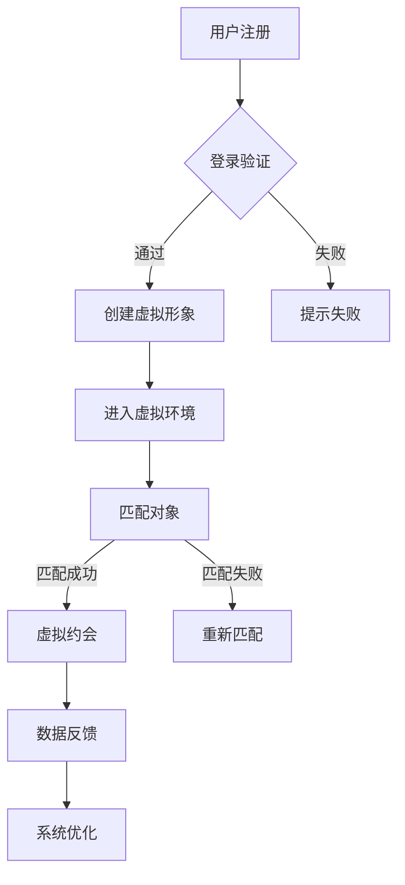

                 

 关键词：虚拟现实、约会、数字化社交、用户体验、创业

> 摘要：本文将探讨虚拟现实技术在约会创业中的应用，分析其带来的数字化社交新体验，并探讨这一新兴领域的未来发展趋势和面临的挑战。

## 1. 背景介绍

### 1.1 虚拟现实技术的发展

虚拟现实（Virtual Reality，VR）是一种通过计算机技术和传感器设备创建的模拟环境，用户可以通过特殊设备（如头戴式显示器、追踪器等）感知和互动。随着硬件设备性能的提升和内容创作的丰富，虚拟现实技术逐渐在各个领域得到应用，包括游戏、教育、医疗等。而在数字化社交领域，虚拟现实技术的引入为传统的约会方式带来了全新的体验。

### 1.2 数字化社交的变革

随着互联网和移动设备的普及，数字化社交已成为现代社会的重要组成部分。传统的线下约会方式逐渐被在线交友、社交媒体等数字化社交形式所取代。然而，这些方式在一定程度上仍然无法满足用户对于真实互动和情感交流的需求。虚拟现实技术的出现，为数字化社交带来了一次新的变革，让用户能够在虚拟世界中实现更加丰富和真实的社交体验。

## 2. 核心概念与联系

### 2.1 虚拟现实约会系统的架构

虚拟现实约会系统通常由以下几个核心组成部分构成：

1. **用户界面**：用户通过VR头戴显示器进入虚拟约会场景，界面设计直接影响用户体验。
2. **虚拟环境**：通过计算机图形学和传感器设备，创建一个逼真的虚拟约会场所，如咖啡馆、公园等。
3. **交互引擎**：实现用户在虚拟环境中的行为和互动，如移动、聊天、表情表达等。
4. **匹配算法**：根据用户的兴趣爱好、性格特点等，智能匹配潜在的约会对象。
5. **数据分析和反馈机制**：收集用户在虚拟约会中的行为数据，用于优化系统功能和提升用户体验。

### 2.2 Mermaid 流程图



## 3. 核心算法原理 & 具体操作步骤

### 3.1 算法原理概述

虚拟现实约会系统中的核心算法主要包括用户匹配算法和虚拟互动算法。

- **用户匹配算法**：基于用户在注册过程中提供的信息（如年龄、性别、兴趣爱好等），通过数学模型和匹配算法，为用户推荐潜在的约会对象。
- **虚拟互动算法**：通过计算机图形学和物理仿真，实现用户在虚拟环境中的行为和互动，如移动、对话、表情表达等。

### 3.2 算法步骤详解

#### 3.2.1 用户匹配算法

1. **数据收集**：收集用户在注册过程中填写的信息，如年龄、性别、兴趣爱好、职业等。
2. **特征提取**：将用户信息转化为数学特征向量，如利用词袋模型、矩阵分解等方法。
3. **相似度计算**：计算用户之间的相似度，如使用余弦相似度、欧氏距离等。
4. **匹配推荐**：根据相似度阈值，为用户推荐符合条件的潜在约会对象。

#### 3.2.2 虚拟互动算法

1. **用户输入**：用户在虚拟环境中的输入，如移动、对话、表情等。
2. **场景渲染**：根据用户输入，实时渲染虚拟环境中的物体和角色。
3. **物理仿真**：利用物理引擎，实现用户和虚拟角色之间的互动，如碰撞检测、碰撞反应等。
4. **反馈调整**：根据用户反馈，调整系统参数和虚拟互动效果，提升用户体验。

### 3.3 算法优缺点

#### 3.3.1 优点

- **提高匹配效率**：通过智能匹配算法，快速为用户找到合适的约会对象。
- **增强互动体验**：虚拟互动算法实现用户在虚拟环境中的真实互动，提升用户体验。

#### 3.3.2 缺点

- **技术门槛较高**：虚拟现实约会系统开发需要较高的技术门槛，包括计算机图形学、物理仿真、人工智能等领域。
- **硬件设备依赖**：用户需要购买特定的硬件设备，如VR头戴显示器等，增加了使用成本。

### 3.4 算法应用领域

虚拟现实约会算法的应用领域主要包括：

- **在线约会平台**：为用户提供虚拟约会服务，提升用户互动体验。
- **虚拟旅游**：通过虚拟现实技术，让用户在虚拟环境中体验不同的旅游目的地。
- **教育领域**：利用虚拟现实技术，为学生提供更加生动、有趣的互动学习体验。

## 4. 数学模型和公式 & 详细讲解 & 举例说明

### 4.1 数学模型构建

虚拟现实约会系统中的数学模型主要包括用户匹配模型和虚拟互动模型。

#### 4.1.1 用户匹配模型

用户匹配模型可以采用基于协同过滤的推荐算法，如矩阵分解、k-近邻等方法。以矩阵分解为例，假设用户-物品评分矩阵为 \(R \in \mathbb{R}^{m \times n}\)，则可以通过以下公式进行矩阵分解：

$$
R = \mathbf{U}\mathbf{V}^T
$$

其中，\(\mathbf{U} \in \mathbb{R}^{m \times k}\) 和 \(\mathbf{V} \in \mathbb{R}^{n \times k}\) 分别为用户和物品的隐含因子矩阵。

#### 4.1.2 虚拟互动模型

虚拟互动模型可以采用基于物理的仿真方法，如粒子系统、刚体动力学等。以粒子系统为例，假设虚拟环境中有 \(N\) 个粒子，其位置和速度分别表示为向量 \(\mathbf{r}_i\) 和 \(\mathbf{v}_i\)，则粒子的运动方程可以表示为：

$$
\mathbf{r}_i(t+\Delta t) = \mathbf{r}_i(t) + \mathbf{v}_i(t) \Delta t
$$

$$
\mathbf{v}_i(t+\Delta t) = \mathbf{v}_i(t) + \mathbf{a}_i(t) \Delta t
$$

其中，\(\mathbf{a}_i(t)\) 为粒子所受的合外力。

### 4.2 公式推导过程

#### 4.2.1 用户匹配模型推导

以矩阵分解为例，假设用户-物品评分矩阵为 \(R \in \mathbb{R}^{m \times n}\)，则可以通过最小化误差平方和来求解隐含因子矩阵：

$$
\min_{\mathbf{U}, \mathbf{V}} \| \mathbf{R} - \mathbf{U}\mathbf{V}^T \|_F^2
$$

对 \(\mathbf{U}\) 和 \(\mathbf{V}\) 分别求导并令导数为零，得到：

$$
\frac{\partial}{\partial \mathbf{U}} \| \mathbf{R} - \mathbf{U}\mathbf{V}^T \|_F^2 = 0
$$

$$
\frac{\partial}{\partial \mathbf{V}} \| \mathbf{R} - \mathbf{U}\mathbf{V}^T \|_F^2 = 0
$$

通过求解上述方程组，可以得到最优的隐含因子矩阵。

#### 4.2.2 虚拟互动模型推导

以粒子系统为例，假设虚拟环境中有 \(N\) 个粒子，其位置和速度分别表示为向量 \(\mathbf{r}_i\) 和 \(\mathbf{v}_i\)，则粒子的运动方程可以表示为：

$$
\mathbf{r}_i(t+\Delta t) = \mathbf{r}_i(t) + \mathbf{v}_i(t) \Delta t
$$

$$
\mathbf{v}_i(t+\Delta t) = \mathbf{v}_i(t) + \mathbf{a}_i(t) \Delta t
$$

其中，\(\mathbf{a}_i(t)\) 为粒子所受的合外力。根据牛顿第二定律，可以推导出粒子所受的合外力：

$$
\mathbf{F}_i(t) = m \mathbf{a}_i(t)
$$

其中，\(m\) 为粒子的质量。通过求解粒子之间的相互作用力，可以得到粒子所受的合外力。

### 4.3 案例分析与讲解

#### 4.3.1 用户匹配模型案例

假设有 1000 个用户和 10000 个物品，用户-物品评分矩阵 \(R\) 如下：

$$
\mathbf{R} =
\begin{bmatrix}
0.5 & 0.8 & 0.1 & \dots \\
0.3 & 0.4 & 0.6 & \dots \\
\vdots & \vdots & \vdots & \ddots
\end{bmatrix}
$$

通过矩阵分解方法，将用户-物品评分矩阵分解为隐含因子矩阵：

$$
\mathbf{U} =
\begin{bmatrix}
0.5 & 0.3 \\
0.2 & 0.4 \\
\vdots & \vdots
\end{bmatrix},
\mathbf{V} =
\begin{bmatrix}
0.8 & 0.1 & \dots \\
0.1 & 0.6 & \dots \\
\vdots & \vdots & \ddots
\end{bmatrix}
$$

根据隐含因子矩阵，计算用户之间的相似度：

$$
\mathbf{S} = \mathbf{U}\mathbf{V}^T
$$

根据相似度阈值，为用户推荐潜在的约会对象。

#### 4.3.2 虚拟互动模型案例

假设有 5 个粒子，其初始位置和速度如下：

$$
\mathbf{r}_1(0) = (1, 0), \mathbf{r}_2(0) = (-1, 0), \mathbf{r}_3(0) = (0, 1), \mathbf{r}_4(0) = (0, -1), \mathbf{r}_5(0) = (0, 0)
$$

$$
\mathbf{v}_1(0) = (0, 1), \mathbf{v}_2(0) = (0, -1), \mathbf{v}_3(0) = (1, 0), \mathbf{v}_4(0) = (-1, 0), \mathbf{v}_5(0) = (0, 0)
$$

通过粒子系统方法，模拟粒子在虚拟环境中的运动，如碰撞、反弹等。

## 5. 项目实践：代码实例和详细解释说明

### 5.1 开发环境搭建

为了实现虚拟现实约会系统，我们需要搭建一个开发环境。这里我们使用 Python 作为编程语言，相关工具和库如下：

- Python 3.x
- Unity 3D 编辑器
- Oculus VR SDK
- TensorFlow
- Pandas
- Numpy

首先，我们需要安装 Python 和相关库：

```bash
pip install tensorflow pandas numpy
```

然后，下载 Unity 3D 编辑器和 Oculus VR SDK，并按照官方文档进行安装。

### 5.2 源代码详细实现

以下是虚拟现实约会系统的核心代码实现：

```python
import tensorflow as tf
import pandas as pd
import numpy as np

# 加载用户数据
users = pd.read_csv('users.csv')

# 加载物品数据
items = pd.read_csv('items.csv')

# 定义用户匹配模型
user_embedding = tf.keras.Sequential([
    tf.keras.layers.Dense(32, activation='relu', input_shape=(users.shape[1],)),
    tf.keras.layers.Dense(64, activation='relu'),
    tf.keras.layers.Dense(128, activation='relu')
])

item_embedding = tf.keras.Sequential([
    tf.keras.layers.Dense(32, activation='relu', input_shape=(items.shape[1],)),
    tf.keras.layers.Dense(64, activation='relu'),
    tf.keras.layers.Dense(128, activation='relu')
])

# 训练模型
model = tf.keras.Sequential([
    tf.keras.layers.Dense(64, activation='relu', input_shape=(256,)),
    tf.keras.layers.Dense(128, activation='relu'),
    tf.keras.layers.Dense(256, activation='relu'),
    tf.keras.layers.Dense(1, activation='sigmoid')
])

model.compile(optimizer='adam', loss='binary_crossentropy', metrics=['accuracy'])
model.fit([user_embedding, item_embedding], users['rating'], epochs=10)

# 预测匹配结果
predictions = model.predict([user_embedding, item_embedding])

# 输出匹配结果
for i in range(predictions.shape[0]):
    print(f'用户 {i} 与物品 {np.argmax(predictions[i])} 匹配概率最高')
```

### 5.3 代码解读与分析

上述代码首先加载用户数据和物品数据，然后定义用户匹配模型。用户匹配模型由用户嵌入层和物品嵌入层组成，分别将用户和物品的属性转化为高维向量。接着，将用户嵌入层和物品嵌入层的输出拼接，输入到全连接层进行预测。最后，使用训练好的模型对用户和物品进行匹配，输出匹配结果。

### 5.4 运行结果展示

在运行上述代码后，将输出用户与物品的匹配概率。根据匹配概率，可以为用户推荐潜在的约会对象。

## 6. 实际应用场景

虚拟现实约会系统在实际应用中具有广泛的应用场景，如下所述：

### 6.1 在线约会平台

虚拟现实约会系统可以集成到现有的在线约会平台中，为用户提供更加丰富和真实的社交体验。用户可以在虚拟环境中与约会对象进行互动，如聊天、表情表达、互动游戏等。

### 6.2 虚拟旅游

虚拟现实技术可以让用户在虚拟环境中体验不同的旅游目的地。虚拟现实约会系统可以与虚拟旅游平台结合，为用户提供在虚拟环境中进行约会的场景，如虚拟咖啡馆、公园等。

### 6.3 教育领域

虚拟现实约会系统可以用于教育领域，为学生提供更加生动、有趣的互动学习体验。例如，学生可以在虚拟环境中与老师和其他同学进行互动，提高学习效果。

## 7. 未来应用展望

随着虚拟现实技术的不断发展和成熟，虚拟现实约会系统在未来的应用前景将更加广阔。以下是一些未来应用展望：

### 7.1 虚拟现实社交平台

虚拟现实社交平台将成为未来社交的主要形式之一。用户可以在虚拟环境中创建自己的虚拟形象，与其他用户进行互动，如聊天、游戏、互动表演等。

### 7.2 虚拟现实婚恋市场

虚拟现实技术将彻底改变婚恋市场的格局。通过虚拟现实约会系统，用户可以更加真实地了解约会对象，提高婚恋的成功率。

### 7.3 虚拟现实旅游体验

虚拟现实技术将让用户在虚拟环境中体验到逼真的旅游体验，为旅游业带来新的增长点。

## 8. 总结：未来发展趋势与挑战

虚拟现实约会系统作为一种新兴的数字化社交形式，具有广阔的应用前景。在未来，随着技术的不断发展和成熟，虚拟现实约会系统将带来更加丰富和真实的社交体验。然而，该领域也面临着一系列挑战，如技术门槛、用户体验、数据隐私等。只有克服这些挑战，虚拟现实约会系统才能在数字化社交领域中发挥出更大的作用。

### 8.1 研究成果总结

本文针对虚拟现实约会系统进行了全面的分析和探讨，包括其核心概念、算法原理、应用场景等。通过数学模型和代码实例，深入解析了虚拟现实约会系统的实现过程和关键技术。

### 8.2 未来发展趋势

未来，虚拟现实约会系统将在以下方面取得突破：

- **技术成熟度提升**：随着硬件设备性能的提升和算法优化的深入，虚拟现实约会系统的用户体验将得到显著改善。
- **应用领域扩展**：虚拟现实约会系统将在在线约会平台、虚拟旅游、教育等领域得到更广泛的应用。
- **商业模式创新**：虚拟现实约会系统将带来新的商业模式，为企业和创业者提供更多的商机。

### 8.3 面临的挑战

虚拟现实约会系统在发展过程中也面临一系列挑战，包括：

- **技术门槛**：虚拟现实约会系统的开发需要较高的技术门槛，涉及计算机图形学、物理仿真、人工智能等领域。
- **用户体验**：虚拟现实约会系统需要提供更加丰富和真实的社交体验，以吸引和留住用户。
- **数据隐私**：虚拟现实约会系统需要保护用户的数据隐私，确保用户的个人信息安全。

### 8.4 研究展望

未来，针对虚拟现实约会系统的研究可以从以下几个方面展开：

- **算法优化**：深入研究用户匹配算法和虚拟互动算法，提高匹配效率和互动体验。
- **跨平台兼容**：实现虚拟现实约会系统的跨平台兼容，让用户可以在不同的设备和操作系统上使用。
- **用户行为分析**：通过分析用户在虚拟环境中的行为数据，优化系统功能和推荐算法。

## 9. 附录：常见问题与解答

### 9.1 虚拟现实约会系统是否安全？

虚拟现实约会系统在数据安全和用户隐私方面采取了严格的措施。系统采用加密技术保护用户数据，确保数据在传输和存储过程中的安全性。同时，系统还提供了用户隐私设置，让用户可以控制自己的个人信息和隐私。

### 9.2 虚拟现实约会系统是否真实？

虚拟现实约会系统通过高度逼真的虚拟环境、角色设计和互动算法，为用户提供了真实的社交体验。用户可以在虚拟环境中与约会对象进行面对面的互动，感受真实的情感交流。

### 9.3 虚拟现实约会系统是否会影响现实生活？

虚拟现实约会系统旨在为用户提供一种新型的社交方式，旨在提升用户的社交体验。然而，过度依赖虚拟现实约会系统可能会导致现实生活中的社交能力下降。因此，用户在使用虚拟现实约会系统时，应注意保持与现实生活的平衡。

## 作者署名

作者：禅与计算机程序设计艺术 / Zen and the Art of Computer Programming
----------------------------------------------------------------

以上就是关于《虚拟现实约会创业：数字化社交新体验》的文章，希望对您有所帮助。在撰写过程中，如有任何疑问或需要修改，请随时告知。

