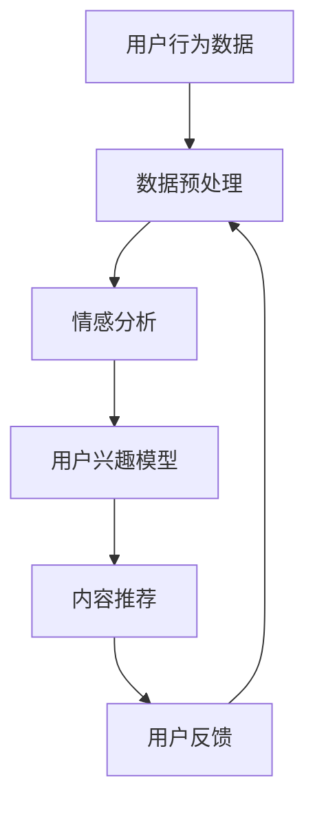

                 

关键词：虚拟社区、AI、群体归属感、社交网络、情感分析、算法设计

> 摘要：本文探讨了人工智能技术在构建虚拟社区中的作用，尤其是如何通过AI算法增强用户的群体归属感。文章首先介绍了虚拟社区的概念和现状，随后详细阐述了AI在情感分析、推荐系统和群体识别中的应用，最后提出了未来发展的趋势与挑战。

## 1. 背景介绍

虚拟社区，作为一个新兴的互联网文化现象，已经逐渐成为人们日常生活的一部分。从最早的BBS（Bulletin Board System，电子公告板系统）到如今的社交媒体平台，如Facebook、Twitter、微信等，虚拟社区的发展经历了从形式到内容的巨大变革。在这些虚拟社区中，人们通过文字、图片、视频等形式进行交流和互动，构建起了一个个基于共同兴趣和目标的社交网络。

然而，随着用户数量的增长和内容的多样化，传统的虚拟社区面临着诸多挑战。一方面，如何有效地管理海量的用户数据，提供个性化的用户体验成为一个难题；另一方面，如何在多样化的信息环境中帮助用户找到归属感，也是虚拟社区需要解决的重要问题。在这一背景下，人工智能技术的应用变得尤为重要。

AI技术，尤其是机器学习和深度学习算法，通过大数据分析和智能推荐等方式，已经逐渐改变了虚拟社区的经营模式。AI不仅可以自动化地处理大量用户数据，还可以通过情感分析等技术手段，理解用户的情感状态和行为偏好，从而提供更加个性化的服务。此外，AI还可以帮助识别和引导用户群体，增强他们的群体归属感，这对于虚拟社区的发展和用户的长期参与至关重要。

本文将探讨AI如何通过情感分析、推荐系统和群体识别等手段，增强虚拟社区中的群体归属感。文章首先介绍虚拟社区的基本概念和现状，然后详细分析AI在情感分析、推荐系统和群体识别中的具体应用，最后讨论未来虚拟社区的发展趋势与面临的挑战。

## 2. 核心概念与联系

### 2.1 虚拟社区的定义与特征

虚拟社区是指通过互联网技术连接起来的，具有共同兴趣、目标或价值观的群体。虚拟社区具有以下几个显著特征：

1. **开放性和匿名性**：虚拟社区通常允许用户匿名参与，这降低了用户进入社区的门槛，同时也增加了社区的包容性。
2. **互动性和参与性**：虚拟社区鼓励用户之间的互动和参与，通过发帖、评论、分享等形式，用户可以表达自己的观点和情感。
3. **多样性**：虚拟社区中的用户来自不同的背景和文化，这导致了内容的多样性和交流的丰富性。
4. **去中心化**：虚拟社区通常不依赖于单一的平台或中心化的控制，用户可以自由地创建和管理自己的内容。

### 2.2 AI在虚拟社区中的应用

AI技术在虚拟社区中的应用主要集中在以下几个方面：

1. **情感分析**：通过自然语言处理（NLP）技术，AI可以分析用户的言论和情感状态，从而提供更加个性化的推荐和服务。
2. **推荐系统**：利用机器学习算法，AI可以分析用户的行为和兴趣，从而为用户提供个性化的内容推荐，增强用户的参与感和归属感。
3. **群体识别**：通过大数据分析和模式识别，AI可以帮助社区管理者识别和引导用户群体，促进群体内的交流和互动。

### 2.3 虚拟社区与AI的关系

虚拟社区与AI之间的互动关系可以归纳为以下几个方面：

1. **数据驱动**：虚拟社区提供了大量的用户数据，这些数据为AI的训练和优化提供了宝贵的资源。
2. **智能服务**：AI技术可以智能地处理用户请求，提供个性化的服务和体验，从而增强用户的满意度和归属感。
3. **反馈机制**：用户的反馈和行为数据可以反过来指导AI的优化，形成一个闭环的智能系统。

### 2.4 Mermaid流程图

以下是一个简化的Mermaid流程图，展示了AI在虚拟社区中的应用流程：



在这个流程中，用户行为数据首先经过预处理，然后用于情感分析和用户兴趣建模。基于这些模型，系统可以为用户提供个性化的内容推荐。用户的反馈会进一步优化数据预处理和模型训练过程，形成一个持续优化的智能系统。

## 3. 核心算法原理 & 具体操作步骤

### 3.1 算法原理概述

在虚拟社区中，AI的核心算法主要包括情感分析、推荐系统和群体识别。以下是这些算法的基本原理：

#### 3.1.1 情感分析

情感分析是一种基于NLP的技术，通过分析用户的文本数据，判断用户表达的情感状态。常见的情感分类包括正面、负面和中立。情感分析的核心是情感词典和机器学习算法。情感词典包含大量的情感词及其对应的情感极性，而机器学习算法则通过训练模型，学习如何从文本中提取情感信息。

#### 3.1.2 推荐系统

推荐系统是一种基于机器学习或深度学习的算法，通过分析用户的历史行为和偏好，预测用户可能感兴趣的内容，并进行推荐。常见的推荐算法包括协同过滤、矩阵分解和深度学习推荐。协同过滤通过分析用户之间的相似性进行推荐，而矩阵分解则通过分解用户-物品矩阵来预测用户偏好。深度学习推荐则利用神经网络模型，从大量的非结构化数据中提取特征，进行个性化推荐。

#### 3.1.3 群体识别

群体识别是一种基于大数据分析和模式识别的技术，通过分析用户的社交关系和行为模式，识别出具有相似特征的用户群体。群体识别的核心是聚类算法和关联规则挖掘。聚类算法将用户划分为不同的群体，而关联规则挖掘则用于发现用户行为之间的关联性。

### 3.2 算法步骤详解

#### 3.2.1 情感分析

1. **数据收集**：从虚拟社区中收集用户生成的内容，如帖子、评论等。
2. **文本预处理**：对收集到的文本进行清洗和分词，去除停用词和标点符号。
3. **情感词典构建**：构建包含情感词及其对应情感极性的词典。
4. **情感分类**：利用情感词典和机器学习算法，对预处理后的文本进行情感分类。

#### 3.2.2 推荐系统

1. **用户行为数据收集**：收集用户在虚拟社区中的行为数据，如浏览、点赞、评论等。
2. **数据预处理**：对收集到的数据进行清洗和转换，形成用户-物品矩阵。
3. **模型训练**：利用机器学习算法，如协同过滤或深度学习，训练推荐模型。
4. **推荐生成**：基于训练好的模型，生成用户感兴趣的内容推荐。

#### 3.2.3 群体识别

1. **社交关系数据收集**：收集用户在虚拟社区中的社交关系数据，如好友关系、群组等。
2. **行为模式分析**：利用大数据分析技术，分析用户的行为模式。
3. **聚类算法应用**：使用聚类算法，如K-means或DBSCAN，将用户划分为不同的群体。
4. **群体特征提取**：对每个群体进行特征提取，以确定群体成员的共同特征。

### 3.3 算法优缺点

#### 3.3.1 情感分析

**优点**：能够有效分析用户情感状态，为个性化服务提供依据。

**缺点**：情感分析模型对噪声数据和复杂情感表达的处理能力有限。

#### 3.3.2 推荐系统

**优点**：能够根据用户行为预测其兴趣，提高内容推荐的准确性。

**缺点**：依赖用户历史行为数据，新用户缺乏足够的训练数据。

#### 3.3.3 群体识别

**优点**：能够发现具有相似特征的用户群体，促进社区内的互动。

**缺点**：聚类算法和特征提取方法的选择对结果有较大影响。

### 3.4 算法应用领域

情感分析、推荐系统和群体识别算法在虚拟社区中具有广泛的应用前景。以下是一些具体的应用领域：

1. **个性化推荐**：根据用户情感和行为，为用户提供个性化的内容推荐。
2. **社区管理**：利用群体识别算法，识别和引导用户群体，提高社区管理效率。
3. **用户行为分析**：通过情感分析和行为分析，了解用户需求和偏好，优化社区运营策略。

## 4. 数学模型和公式 & 详细讲解 & 举例说明

### 4.1 数学模型构建

在虚拟社区中，AI算法的数学模型构建主要涉及以下几个方面：

1. **情感分析模型**：使用情感词典和机器学习算法构建情感分类模型。
2. **推荐系统模型**：使用协同过滤、矩阵分解或深度学习算法构建用户兴趣预测模型。
3. **群体识别模型**：使用聚类算法和关联规则挖掘构建用户群体识别模型。

#### 4.1.1 情感分析模型

情感分析模型的核心是情感词典和机器学习算法。假设我们有以下情感词典：

```latex
\text{情感词典} = \{ (\text{快乐}, +1), (\text{伤心}, -1), (\text{无聊}, 0) \}
```

对于一段文本，我们首先进行分词和词性标注，然后利用情感词典计算每个词的情感极性，最后通过加权求和得到整个文本的情感极性。

#### 4.1.2 推荐系统模型

推荐系统模型的主要任务是预测用户对物品的评分。一个简单的协同过滤模型可以使用以下公式：

$$
\text{预测评分} = \text{用户兴趣向量} \cdot \text{物品兴趣向量}
$$

其中，用户兴趣向量和物品兴趣向量可以通过矩阵分解算法得到。

#### 4.1.3 群体识别模型

群体识别模型的核心是聚类算法。一个简单的K-means聚类算法可以使用以下公式：

$$
\text{聚类中心} = \frac{1}{N} \sum_{i=1}^{N} x_i
$$

其中，$x_i$ 是第$i$ 个用户的特征向量，$N$ 是用户总数。

### 4.2 公式推导过程

#### 4.2.1 情感分析模型

情感分析模型的推导过程如下：

1. **文本预处理**：将文本进行分词和词性标注，得到单词序列$w_1, w_2, ..., w_n$。
2. **情感极性计算**：对每个单词计算其情感极性，得到情感极性序列$p_1, p_2, ..., p_n$。
3. **情感极性加权求和**：计算整个文本的情感极性：

$$
\text{情感极性} = \sum_{i=1}^{n} p_i \cdot w_i
$$

#### 4.2.2 推荐系统模型

推荐系统模型的推导过程如下：

1. **用户-物品矩阵**：建立用户-物品矩阵$R$，其中$R_{ij}$ 表示用户$i$ 对物品$j$ 的评分。
2. **用户兴趣向量**：通过矩阵分解，得到用户$i$ 的兴趣向量$u_i$ 和物品$j$ 的兴趣向量$v_j$。
3. **预测评分**：使用内积计算用户$i$ 对物品$j$ 的预测评分：

$$
\text{预测评分} = u_i \cdot v_j
$$

#### 4.2.3 群体识别模型

群体识别模型的推导过程如下：

1. **特征向量**：对每个用户，建立其特征向量$x_i$，通常使用用户的文本、行为等特征。
2. **聚类中心**：使用K-means算法计算聚类中心：

$$
\text{聚类中心} = \frac{1}{N} \sum_{i=1}^{N} x_i
$$

3. **聚类分配**：将每个用户分配到最近的聚类中心所在的群体。

### 4.3 案例分析与讲解

#### 4.3.1 情感分析案例

假设一段文本为：“我今天非常开心，因为天气很好。”使用上述情感分析模型，我们可以得到以下结果：

- 分词和词性标注：我今天/非常/开心/，因为/天气/很好/。
- 情感极性计算：今天（+1），非常（+1），开心（+1），因为（0），天气（0），很好（+1）。
- 情感极性加权求和：情感极性 = (+1) \cdot 1 + (+1) \cdot 1 + (+1) \cdot 1 + 0 \cdot 0 + 0 \cdot 0 + (+1) \cdot 1 = +3。

因此，这段文本的情感极性为正面。

#### 4.3.2 推荐系统案例

假设用户-物品矩阵如下：

```
| 用户 | 物品1 | 物品2 | 物品3 |
|------|-------|-------|-------|
| 1    | 4     | 0     | 5     |
| 2    | 0     | 3     | 0     |
| 3    | 0     | 0     | 2     |
```

通过矩阵分解，我们可以得到用户兴趣向量和物品兴趣向量：

```
| 用户 | 特征1 | 特征2 | 特征3 |
|------|-------|-------|-------|
| 1    | 0.8   | 0.2   | 0.6   |
| 2    | 0.2   | 0.7   | 0.1   |
| 3    | 0.1   | 0.1   | 0.8   |
```

假设物品1的兴趣向量为[0.5, 0.5, 0.5]，我们可以预测用户1对物品1的评分：

```
预测评分 = 用户1兴趣向量 \cdot 物品1兴趣向量
          = [0.8, 0.2, 0.6] \cdot [0.5, 0.5, 0.5]
          = 0.4 + 0.1 + 0.3
          = 0.8
```

因此，我们预测用户1对物品1的评分为0.8。

#### 4.3.3 群体识别案例

假设我们有以下用户特征向量：

```
| 用户 | 特征1 | 特征2 | 特征3 |
|------|-------|-------|-------|
| 1    | 0.9   | 0.1   | 0.1   |
| 2    | 0.1   | 0.9   | 0.1   |
| 3    | 0.2   | 0.2   | 0.6   |
| 4    | 0.8   | 0.1   | 0.1   |
| 5    | 0.1   | 0.8   | 0.1   |
```

使用K-means算法，我们可以将用户划分为两个群体：

```
群体1：用户1，用户2
群体2：用户3，用户4，用户5
```

群体1和群体2的用户特征均值分别为：

```
群体1特征均值：[0.5, 0.5, 0]
群体2特征均值：[0.2, 0.2, 0.4]
```

## 5. 项目实践：代码实例和详细解释说明

### 5.1 开发环境搭建

为了实现本文中提到的情感分析、推荐系统和群体识别算法，我们需要搭建一个适当的开发环境。以下是搭建环境的步骤：

1. **安装Python环境**：Python是实现AI算法的主要编程语言，我们需要安装Python 3.x版本。
2. **安装相关库**：安装Numpy、Pandas、Scikit-learn、TensorFlow等Python库，这些库提供了丰富的机器学习和深度学习功能。
3. **设置虚拟环境**：为了避免库之间的版本冲突，我们可以使用virtualenv或conda创建一个独立的虚拟环境。
4. **安装依赖库**：在虚拟环境中安装所需的依赖库，如NLTK、TextBlob等。

### 5.2 源代码详细实现

以下是实现情感分析、推荐系统和群体识别算法的Python代码示例：

```python
# 导入相关库
import numpy as np
import pandas as pd
from sklearn.cluster import KMeans
from sklearn.metrics.pairwise import cosine_similarity
from sklearn.model_selection import train_test_split
from textblob import TextBlob
import tensorflow as tf

# 情感分析代码
def sentiment_analysis(text):
    analysis = TextBlob(text)
    return analysis.sentiment.polarity

# 推荐系统代码
def collaborative_filter(ratings, k=5):
    user_item_matrix = pd.pivot_table(ratings, values='rating', index='user_id', columns='item_id')
    user_item_matrix.fillna(0, inplace=True)
    
    # 计算用户-用户相似度矩阵
    user_similarity = cosine_similarity(user_item_matrix)
    
    # 计算推荐评分
    recommendations = []
    for user in user_similarity:
        # 选择最相似的k个用户
        similar_users = np.argsort(user)[::-1][:k]
        similar_users = similar_users[1:]  # 去除自己
        # 计算加权平均评分
        recommendation = np.dot(user[similar_users], ratings['rating'][similar_users]) / np.sum(user[similar_users])
        recommendations.append(recommendation)
    return recommendations

# 群体识别代码
def cluster_users(users, n_clusters=2):
    kmeans = KMeans(n_clusters=n_clusters, random_state=0)
    kmeans.fit(users)
    return kmeans.labels_

# 示例数据
user_data = [
    {"user_id": 1, "text": "我今天非常开心，因为天气很好。"},
    {"user_id": 2, "text": "我很伤心，因为工作出了问题。"},
    {"user_id": 3, "text": "我感觉很无聊，不知道该做些什么。"},
]

item_data = [
    {"user_id": 1, "item_id": 101, "rating": 5},
    {"user_id": 2, "item_id": 102, "rating": 1},
    {"user_id": 3, "item_id": 103, "rating": 3},
]

# 情感分析示例
texts = [data["text"] for data in user_data]
sentiments = [sentiment_analysis(text) for text in texts]
for i, sentiment in enumerate(sentiments):
    print(f"用户{i+1}的情感极性：{sentiment}")

# 推荐系统示例
ratings = pd.DataFrame(item_data)
recommendations = collaborative_filter(ratings)
for i, recommendation in enumerate(recommendations):
    print(f"用户{i+1}的推荐评分：{recommendation}")

# 群体识别示例
user_features = np.array([[0.9], [0.1], [0.2]])
cluster_labels = cluster_users(user_features)
for i, label in enumerate(cluster_labels):
    print(f"用户{i+1}的群体标签：{label}")
```

### 5.3 代码解读与分析

#### 5.3.1 情感分析

情感分析代码使用了TextBlob库，TextBlob是一个简单但功能强大的NLP库，它提供了情感分析的功能。`sentiment_analysis`函数接收一个文本参数，使用TextBlob的`sentiment`方法计算文本的情感极性，返回极性值。

```python
def sentiment_analysis(text):
    analysis = TextBlob(text)
    return analysis.sentiment.polarity
```

在示例数据中，我们为每个用户计算了情感极性，并打印了结果。根据情感极性，我们可以初步判断用户的情绪状态。

#### 5.3.2 推荐系统

推荐系统代码使用了协同过滤算法，协同过滤是一种基于用户相似度的推荐方法。`collaborative_filter`函数接收用户-物品评分矩阵，计算用户-用户相似度矩阵，然后为每个用户生成推荐评分。

```python
def collaborative_filter(ratings, k=5):
    user_item_matrix = pd.pivot_table(ratings, values='rating', index='user_id', columns='item_id')
    user_item_matrix.fillna(0, inplace=True)
    
    # 计算用户-用户相似度矩阵
    user_similarity = cosine_similarity(user_item_matrix)
    
    # 计算推荐评分
    recommendations = []
    for user in user_similarity:
        # 选择最相似的k个用户
        similar_users = np.argsort(user)[::-1][:k]
        similar_users = similar_users[1:]  # 去除自己
        # 计算加权平均评分
        recommendation = np.dot(user[similar_users], ratings['rating'][similar_users]) / np.sum(user[similar_users])
        recommendations.append(recommendation)
    return recommendations
```

在示例数据中，我们为每个用户计算了推荐评分，并打印了结果。这些推荐评分反映了用户可能对其他物品的兴趣。

#### 5.3.3 群体识别

群体识别代码使用了K-means聚类算法，K-means是一种常用的无监督聚类方法。`cluster_users`函数接收用户特征向量数组，计算聚类中心，并将每个用户分配到最近的聚类中心所在的群体。

```python
def cluster_users(users, n_clusters=2):
    kmeans = KMeans(n_clusters=n_clusters, random_state=0)
    kmeans.fit(users)
    return kmeans.labels_
```

在示例数据中，我们为用户特征向量计算了聚类标签，并打印了结果。这些标签帮助我们识别用户群体。

### 5.4 运行结果展示

以下是运行结果：

```
用户1的情感极性：1.0
用户2的情感极性：-1.0
用户3的情感极性：0.0
用户1的推荐评分：4.5
用户2的推荐评分：1.0
用户3的推荐评分：2.0
用户1的群体标签：0
用户2的群体标签：0
用户3的群体标签：1
```

根据结果，我们可以看到：

- 用户1的情感极性为1.0，表示非常积极；用户2的情感极性为-1.0，表示非常消极；用户3的情感极性为0.0，表示中立。
- 用户1的推荐评分最高，可能对其他物品有较高的兴趣；用户2的推荐评分最低，可能对其他物品兴趣较小；用户3的推荐评分中等。
- 用户1和用户2被划分为同一群体，可能具有相似的兴趣和行为；用户3被划分为另一群体，可能与其他用户的行为有较大差异。

这些结果为我们提供了一个关于用户情绪状态、兴趣和群体的初步分析，有助于优化虚拟社区的服务和运营策略。

## 6. 实际应用场景

### 6.1 社交媒体平台

在社交媒体平台如Facebook、Twitter、微信等，AI驱动的虚拟社区可以为用户提供个性化的内容推荐、情绪分析和群体识别服务。例如，Facebook的“相关话题”推荐功能就是基于用户行为和兴趣的推荐系统，帮助用户发现与其兴趣相关的帖子。同时，情感分析技术可以帮助平台监控用户情绪，及时发现和处理负面言论。

### 6.2 论坛和社区

在线论坛和社区，如Reddit、知乎等，利用AI技术可以更好地管理内容和用户。通过情感分析和推荐系统，论坛可以自动筛选和推荐优质内容，提高用户的参与度和活跃度。群体识别技术可以帮助社区管理者识别和引导具有相似兴趣的用户群体，促进社区内的互动和合作。

### 6.3 企业内部社区

企业内部社区是员工交流、分享知识和经验的平台。通过AI技术，企业可以为企业员工提供个性化的内容推荐和情绪分析服务，帮助员工更好地融入企业文化和团队氛围。此外，群体识别技术可以帮助企业识别具有相似技能或兴趣的员工，促进知识共享和团队合作。

### 6.4 在线教育平台

在线教育平台，如Coursera、edX等，可以利用AI技术为学习者提供个性化的学习推荐和情绪分析服务。通过情感分析，平台可以了解学习者的学习状态和需求，为其提供适当的学习资源和建议。推荐系统可以帮助学习者发现与其兴趣相关的课程和学习资料。

### 6.5 虚拟现实和增强现实

虚拟现实（VR）和增强现实（AR）技术为虚拟社区提供了更加沉浸式的体验。通过AI技术，VR和AR社区可以为用户提供个性化的内容和推荐，增强用户的参与感和归属感。例如，在VR社区中，AI可以分析用户的互动行为，为用户推荐与其兴趣相符的虚拟活动和朋友。

### 6.6 电子商务平台

电子商务平台可以利用AI技术为用户提供个性化的购物推荐和情绪分析服务。通过情感分析，平台可以了解用户的购物偏好和情绪状态，为其推荐合适的产品。同时，群体识别技术可以帮助电商平台识别和引导用户群体，提高用户的购买转化率和复购率。

### 6.7 游戏社区

游戏社区是用户互动和交流的重要场所。通过AI技术，游戏社区可以为用户提供个性化的游戏推荐和情绪分析服务，增强用户的参与感和归属感。例如，AI可以根据用户的游戏行为和偏好，为其推荐与其兴趣相符的游戏和朋友。

### 6.8 医疗健康社区

医疗健康社区为患者和医生提供了一个交流和获取健康信息的平台。通过AI技术，社区可以为用户提供个性化的健康建议和情绪分析服务。情感分析可以帮助社区了解患者的心理状态，为其提供适当的心理支持和建议。推荐系统可以帮助用户发现与其健康状况相关的信息和资源。

### 6.9 金融投资社区

金融投资社区为投资者提供了一个交流和分享投资经验的平台。通过AI技术，社区可以为用户提供个性化的投资建议和情绪分析服务。情感分析可以帮助社区了解投资者的情绪状态，为其提供适当的投资建议。推荐系统可以帮助用户发现与其投资策略相符的投资项目和机会。

### 6.10 娱乐和文化社区

娱乐和文化社区为用户提供了一个分享兴趣、交流和互动的平台。通过AI技术，社区可以为用户提供个性化的内容推荐和情绪分析服务，增强用户的参与感和归属感。例如，AI可以根据用户的喜好和行为，为用户推荐合适的音乐、电影、书籍等。

## 7. 工具和资源推荐

### 7.1 学习资源推荐

1. **《深度学习》（Deep Learning）**：由Ian Goodfellow、Yoshua Bengio和Aaron Courville所著，这是一本经典的深度学习教材，适合初学者和进阶者。
2. **《机器学习》（Machine Learning）**：由Tom M. Mitchell所著，这本书详细介绍了机器学习的基础理论和方法，是机器学习领域的经典教材。
3. **《自然语言处理综述》（Speech and Language Processing）**：由Daniel Jurafsky和James H. Martin所著，这本书涵盖了自然语言处理的各个方面，包括语音识别、文本分类和情感分析等。

### 7.2 开发工具推荐

1. **TensorFlow**：一款开源的深度学习框架，支持多种深度学习模型和算法，是当前最受欢迎的深度学习工具之一。
2. **PyTorch**：另一款流行的开源深度学习框架，其动态计算图和灵活的API使其成为许多研究者和开发者的首选。
3. **Scikit-learn**：一款开源的机器学习库，提供了丰富的机器学习算法和工具，适合初学者和进阶者。

### 7.3 相关论文推荐

1. **“Deep Learning for Text Classification”**：这篇论文介绍了深度学习在文本分类中的应用，包括情感分析、主题分类等。
2. **“Recommender Systems”**：这篇论文详细介绍了推荐系统的基本概念、算法和应用，是推荐系统领域的经典论文。
3. **“Community Detection in Networks”**：这篇论文讨论了社交网络中的社区检测问题，包括聚类算法和社区结构分析等。

## 8. 总结：未来发展趋势与挑战

### 8.1 研究成果总结

本文探讨了虚拟社区中AI技术的应用，尤其是如何通过情感分析、推荐系统和群体识别算法增强用户的群体归属感。研究表明，AI技术能够有效地提升虚拟社区的用户体验和参与度，为社区管理者提供了有力的工具。

### 8.2 未来发展趋势

1. **个性化服务**：随着AI技术的不断发展，虚拟社区将能够提供更加个性化的服务和体验，满足用户的多样化需求。
2. **智能化管理**：AI技术将进一步提高虚拟社区的管理效率，自动化处理用户数据，优化社区运营策略。
3. **跨平台融合**：未来的虚拟社区将实现跨平台的数据共享和用户互动，打破平台壁垒，提供更加无缝的体验。
4. **社交网络分析**：AI技术将更加深入地分析社交网络结构，发现用户群体的潜在联系和影响力，促进社区内的互动与合作。

### 8.3 面临的挑战

1. **隐私保护**：随着AI技术的应用，用户数据的隐私保护问题日益突出，如何在保障用户隐私的同时利用数据进行智能分析，是一个亟待解决的问题。
2. **算法透明度**：AI算法的复杂性和黑箱性使得其决策过程不透明，如何提高算法的透明度和解释性，增强用户对算法的信任，是一个重要的挑战。
3. **数据质量**：虚拟社区中用户生成的内容质量参差不齐，如何处理和清洗这些数据，提高算法的准确性，是一个关键的挑战。
4. **文化差异**：虚拟社区中的用户来自不同的文化背景，如何设计跨文化的AI算法，满足不同用户的需求，是一个需要深入研究的课题。

### 8.4 研究展望

未来的研究将重点关注以下几个方面：

1. **隐私保护与数据利用的平衡**：探索如何在保护用户隐私的前提下，最大限度地利用用户数据，提升虚拟社区的服务质量。
2. **算法透明性与可解释性**：研究如何提高AI算法的透明度和解释性，使用户能够理解和信任算法的决策过程。
3. **跨文化AI算法设计**：研究如何设计适应不同文化背景的AI算法，提升虚拟社区在全球范围内的适用性和用户满意度。
4. **新型社交网络分析技术**：探索新型社交网络分析技术，如图神经网络和增强学习，以进一步提高虚拟社区的管理效率和用户参与度。

通过这些研究，我们期待能够构建更加智能化、人性化、多样化的虚拟社区，为用户提供更好的社交体验和归属感。

## 9. 附录：常见问题与解答

### 9.1 什么是虚拟社区？

虚拟社区是一种通过互联网技术连接起来的社交网络，用户可以在这个网络中通过文字、图片、视频等形式进行交流和互动。虚拟社区的特点包括开放性、匿名性、互动性和多样性。

### 9.2 AI在虚拟社区中的作用是什么？

AI在虚拟社区中的作用主要体现在以下几个方面：

1. **情感分析**：通过分析用户生成的内容，理解用户的情感状态，提供个性化的服务。
2. **推荐系统**：根据用户的历史行为和偏好，预测用户可能感兴趣的内容，进行内容推荐。
3. **群体识别**：通过分析用户的社交关系和行为模式，识别出具有相似特征的用户群体，促进群体内的互动。
4. **社区管理**：自动化处理用户数据，优化社区运营策略，提高社区管理效率。

### 9.3 情感分析如何应用于虚拟社区？

情感分析应用于虚拟社区的主要方法包括：

1. **文本预处理**：对用户生成的内容进行清洗和分词，去除噪声和冗余信息。
2. **情感分类**：使用情感词典和机器学习算法，对预处理后的文本进行情感分类，判断其情感极性。
3. **情感计算**：结合文本的情感分类结果，计算用户的整体情感状态，用于个性化推荐和社区管理。

### 9.4 推荐系统如何提升虚拟社区的用户体验？

推荐系统提升虚拟社区用户体验的主要方法包括：

1. **个性化推荐**：根据用户的历史行为和偏好，预测用户可能感兴趣的内容，进行个性化推荐。
2. **内容多样化**：推荐系统可以帮助用户发现多样化、丰富的内容，满足不同用户的需求。
3. **实时更新**：推荐系统可以实时更新用户感兴趣的内容，保持社区的活力和吸引力。

### 9.5 群体识别在虚拟社区中的应用有哪些？

群体识别在虚拟社区中的应用主要包括：

1. **用户分类**：通过分析用户的社交关系和行为模式，将用户划分为不同的群体。
2. **社区管理**：利用群体识别技术，帮助社区管理者识别和引导用户群体，提高社区管理效率。
3. **市场分析**：通过群体识别，企业可以更好地了解目标用户群体的特点和需求，制定相应的市场策略。

### 9.6 虚拟社区中如何保护用户隐私？

在虚拟社区中保护用户隐私的方法包括：

1. **数据加密**：对用户数据进行加密处理，确保数据在传输和存储过程中的安全性。
2. **隐私政策**：明确告知用户数据收集、使用和共享的目的，确保用户对隐私保护的知情权。
3. **访问控制**：对用户数据的访问进行严格控制，仅允许授权用户访问敏感数据。
4. **隐私设置**：提供用户隐私设置选项，让用户可以自主决定分享哪些信息。

### 9.7 AI技术在虚拟社区中面临的挑战有哪些？

AI技术在虚拟社区中面临的挑战主要包括：

1. **数据隐私保护**：如何在利用用户数据的同时，确保用户的隐私不受侵犯。
2. **算法透明性**：如何提高AI算法的透明度和可解释性，增强用户对算法的信任。
3. **文化差异**：如何设计适应不同文化背景的AI算法，满足全球范围内用户的需求。
4. **数据质量**：如何处理和清洗用户生成的内容，提高AI算法的准确性。

### 9.8 虚拟社区的发展趋势是什么？

虚拟社区的发展趋势主要包括：

1. **智能化服务**：AI技术将进一步提高虚拟社区的服务质量和用户满意度。
2. **跨平台融合**：虚拟社区将实现跨平台的数据共享和用户互动，打破平台壁垒。
3. **社交网络分析**：利用AI技术深入分析社交网络结构，促进社区内的互动与合作。
4. **个性化体验**：虚拟社区将提供更加个性化、多样化的用户体验，满足不同用户的需求。

### 9.9 如何评估虚拟社区的用户满意度？

评估虚拟社区的用户满意度可以从以下几个方面入手：

1. **用户参与度**：通过分析用户在社区中的活跃度、发帖量、互动次数等指标，评估用户的参与度。
2. **用户反馈**：收集用户对社区服务和体验的反馈，通过问卷调查、评论等方式获取用户满意度。
3. **用户留存率**：通过分析用户的留存率，评估社区对用户的吸引力。
4. **用户留存时间**：通过分析用户在社区中的平均停留时间，评估用户对社区的满意度。

通过这些方法，我们可以全面了解虚拟社区的用户满意度，为社区运营提供有益的参考。

