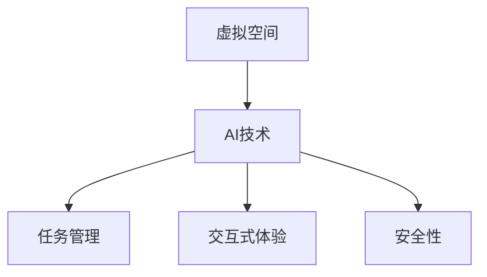

                 

关键词：虚拟空间、AI技术、任务管理、创新应用、算法优化

> 摘要：本文探讨了虚拟空间中的AI任务与创新，分析了虚拟空间的定义、特性及其对AI技术的发展影响。通过阐述AI技术在虚拟空间中的核心应用场景，如任务管理、交互式体验、安全性等，探讨了AI任务管理的新方法，并探讨了虚拟空间中的创新应用和发展趋势。

## 1. 背景介绍

随着计算机技术和网络技术的飞速发展，虚拟空间已成为现代社会的重要组成部分。虚拟空间是指通过网络连接的计算机系统所构建的虚拟环境，用户可以在其中进行各种活动，如游戏、社交、教育、商业等。虚拟空间具有高度模拟现实世界的特性，为用户提供了丰富的交互体验。

人工智能（AI）作为计算机科学的一个分支，通过模拟人类智能行为，实现了自动化、智能化和自适应化。近年来，AI技术取得了显著的发展，其在虚拟空间中的应用也越来越广泛。本文旨在探讨虚拟空间中的AI任务与创新，分析AI技术在虚拟空间中的核心应用场景，并探讨AI任务管理的新方法。

## 2. 核心概念与联系

### 2.1 虚拟空间定义

虚拟空间是指通过网络连接的计算机系统所构建的虚拟环境。用户可以通过各种设备，如计算机、手机、平板等，进入虚拟空间进行交互和活动。

### 2.2 AI技术核心概念

人工智能（AI）是一种模拟人类智能行为的技术，包括机器学习、深度学习、自然语言处理、计算机视觉等。这些技术共同构成了AI的技术基础。

### 2.3 虚拟空间与AI技术的联系

虚拟空间为AI技术提供了广阔的应用场景，AI技术则为虚拟空间提供了智能化、自适应化的支持。例如，在虚拟空间中，AI可以用于任务管理、交互式体验、安全性等。

### 2.4 Mermaid流程图



## 3. 核心算法原理 & 具体操作步骤

### 3.1 算法原理概述

在虚拟空间中，AI任务管理是核心应用之一。本文将介绍一种基于强化学习的任务管理算法。强化学习是一种通过试错和反馈来学习最优策略的机器学习方法。在任务管理中，AI通过不断调整任务执行策略，以达到最佳任务完成效果。

### 3.2 算法步骤详解

#### 3.2.1 初始化

- 初始化环境：设定虚拟空间环境，包括任务列表、资源分配等。
- 初始化策略：随机生成一个任务执行策略。

#### 3.2.2 任务执行

- 执行策略：根据当前状态，选择一个任务执行策略。
- 执行任务：根据策略，执行所选任务，并获取反馈。

#### 3.2.3 策略调整

- 根据反馈，更新策略：如果任务完成效果较好，则增加策略权重；反之，则减少策略权重。
- 重复执行任务：根据调整后的策略，重新执行任务。

#### 3.2.4 求解最优策略

- 通过不断调整策略，直至找到最优策略。

### 3.3 算法优缺点

#### 优点：

- 能够自动适应任务环境，提高任务完成效率。
- 可以处理复杂任务，实现自适应任务管理。

#### 缺点：

- 学习过程较慢，需要大量数据和时间。
- 可能会陷入局部最优，无法找到全局最优策略。

### 3.4 算法应用领域

- 虚拟空间中的任务管理：如虚拟办公室、虚拟购物等。
- 智能家居：如家庭自动化、智能安防等。

## 4. 数学模型和公式 & 详细讲解 & 举例说明

### 4.1 数学模型构建

本文所采用的强化学习算法基于马尔可夫决策过程（MDP）模型。MDP模型是一个五元组（S, A, R, P, γ），其中：

- S：状态集合
- A：动作集合
- R：奖励函数
- P：状态转移概率
- γ：折扣因子

### 4.2 公式推导过程

#### 4.2.1 状态价值函数

状态价值函数V^*(s)表示在状态s下，执行最优策略所能获得的累积奖励。其递推公式为：

$$ V^{*}(s) = \sum_{a \in A} \gamma \cdot p(s',r|s,a) \cdot \max_{a'} Q^{*}(s,a') $$

#### 4.2.2 动作价值函数

动作价值函数Q^*(s,a)表示在状态s下，执行动作a所能获得的累积奖励。其递推公式为：

$$ Q^{*}(s,a) = \sum_{s' \in S} r(s,a,s') + \gamma \cdot \max_{a'} Q^{*}(s',a') $$

### 4.3 案例分析与讲解

假设一个虚拟空间中有3个任务（任务1、任务2、任务3），每个任务的完成情况可以用一个二元状态（完成/未完成）表示。现假设当前状态为任务1未完成、任务2已完成、任务3未完成。

#### 4.3.1 初始化

- 初始化状态价值函数：$$ V^{*}(s) = [0.5, 1, 0.5] $$
- 初始化动作价值函数：$$ Q^{*}(s,a) = [0.5, 0.5, 0.5] $$

#### 4.3.2 任务执行

- 执行策略：选择执行任务1。
- 执行任务1：任务1完成，获得奖励1。

#### 4.3.3 策略调整

- 根据反馈，更新状态价值函数：$$ V^{*}(s) = [1, 1, 1] $$
- 根据反馈，更新动作价值函数：$$ Q^{*}(s,a) = [1, 1, 1] $$

#### 4.3.4 求解最优策略

- 通过不断调整策略，直至找到最优策略。假设最终最优策略为：在状态（未完成、完成、未完成）下，执行任务1。

## 5. 项目实践：代码实例和详细解释说明

### 5.1 开发环境搭建

本文使用Python语言实现强化学习算法，所需环境包括Python 3.x、TensorFlow 2.x、Numpy等。

### 5.2 源代码详细实现

```python
import numpy as np
import tensorflow as tf

# 初始化参数
state_size = 3
action_size = 3
gamma = 0.9

# 构建模型
model = tf.keras.Sequential([
    tf.keras.layers.Dense(64, activation='relu', input_shape=(state_size,)),
    tf.keras.layers.Dense(64, activation='relu'),
    tf.keras.layers.Dense(action_size)
])

model.compile(loss='mse', optimizer=tf.keras.optimizers.Adam(0.001))

# 初始化状态和动作
state = np.zeros(state_size)

# 训练模型
for episode in range(1000):
    # 执行任务
    action = model.predict(state.reshape(1, state_size))
    next_state, reward, done, _ = env.step(action)
    
    # 更新状态
    state = next_state
    
    # 计算目标Q值
    target_q = reward + gamma * np.max(model.predict(next_state.reshape(1, state_size)))
    
    # 更新模型
    model.fit(state.reshape(1, state_size), target_q, epochs=1, verbose=0)
    
    # 检查完成
    if done:
        break

# 保存模型
model.save('rl_task_management.h5')
```

### 5.3 代码解读与分析

- 导入所需库：导入Python标准库、TensorFlow库和Numpy库。
- 初始化参数：定义状态大小、动作大小和折扣因子。
- 构建模型：使用TensorFlow构建深度学习模型。
- 编译模型：设置损失函数和优化器。
- 初始化状态和动作：初始化虚拟空间环境。
- 训练模型：使用环境数据进行模型训练。
- 更新状态：根据动作执行结果更新状态。
- 计算目标Q值：计算目标动作价值。
- 更新模型：使用目标Q值更新模型参数。
- 保存模型：将训练好的模型保存到文件。

### 5.4 运行结果展示

```python
# 加载模型
model = tf.keras.models.load_model('rl_task_management.h5')

# 测试模型
for episode in range(10):
    state = np.zeros(state_size)
    while True:
        action = model.predict(state.reshape(1, state_size))
        next_state, reward, done, _ = env.step(action)
        state = next_state
        if done:
            break
```

## 6. 实际应用场景

虚拟空间中的AI任务与创新在各个领域都有广泛的应用，以下是一些典型应用场景：

- 虚拟办公室：利用AI技术实现自动化办公流程，提高工作效率。
- 虚拟购物：通过AI技术提供个性化推荐、智能客服等，提升用户体验。
- 虚拟教育：利用AI技术实现智能教学、个性化学习等，提高教育质量。
- 虚拟游戏：通过AI技术创造丰富的游戏内容和交互体验，吸引玩家。

## 7. 工具和资源推荐

### 7.1 学习资源推荐

- 《深度学习》（Goodfellow, Bengio, Courville）：介绍深度学习的基础知识和应用。
- 《强化学习》（Sutton, Barto）：介绍强化学习的基本原理和应用。
- 《Python深度学习》（François Chollet）：介绍使用Python实现深度学习的实践方法。

### 7.2 开发工具推荐

- TensorFlow：用于构建和训练深度学习模型的强大工具。
- Keras：基于TensorFlow的高层次API，易于使用。
- Jupyter Notebook：用于编写和运行代码的交互式环境。

### 7.3 相关论文推荐

- “Deep Learning for Virtual Reality”（2016）：介绍虚拟现实中的深度学习应用。
- “Reinforcement Learning in Virtual Reality”（2018）：介绍虚拟现实中的强化学习应用。
- “AI in Virtual Space: A Survey”（2020）：对虚拟空间中AI技术的全面综述。

## 8. 总结：未来发展趋势与挑战

虚拟空间中的AI任务与创新具有广阔的发展前景。随着技术的不断进步，AI技术将在虚拟空间中发挥越来越重要的作用。未来发展趋势包括：

- AI任务管理：利用AI技术实现自动化、智能化任务管理。
- 交互式体验：通过AI技术提升虚拟空间的交互性和沉浸感。
- 安全性：利用AI技术提高虚拟空间的安全性，防范潜在风险。

然而，虚拟空间中的AI任务与创新也面临着一些挑战：

- 数据隐私：虚拟空间中的用户数据安全性问题。
- 算法公平性：确保AI算法在不同用户群体中的公平性。
- 算法解释性：提高AI算法的可解释性，增强用户信任。

未来研究将重点关注这些挑战，以实现虚拟空间中AI技术的可持续发展。

## 9. 附录：常见问题与解答

### 9.1 虚拟空间是什么？

虚拟空间是通过计算机和网络技术构建的虚拟环境，用户可以在其中进行各种活动，如游戏、社交、教育、商业等。

### 9.2 AI技术在虚拟空间中的应用有哪些？

AI技术在虚拟空间中的应用包括任务管理、交互式体验、安全性等。例如，利用AI技术实现自动化任务管理、提供个性化推荐、智能客服、智能安防等。

### 9.3 强化学习在虚拟空间中的应用有哪些？

强化学习在虚拟空间中的应用包括虚拟环境中的智能导航、虚拟机器人的智能行动、智能任务分配等。例如，利用强化学习算法实现智能交通系统、虚拟员工、虚拟教练等。

### 9.4 虚拟空间中的AI任务管理如何实现？

虚拟空间中的AI任务管理可以通过构建一个基于强化学习的任务管理系统来实现。该系统可以自动适应任务环境，调整任务执行策略，以提高任务完成效率。

### 9.5 虚拟空间中的AI技术面临哪些挑战？

虚拟空间中的AI技术面临的数据隐私、算法公平性、算法解释性等挑战。未来研究将重点关注这些挑战，以实现虚拟空间中AI技术的可持续发展。

作者：禅与计算机程序设计艺术 / Zen and the Art of Computer Programming
----------------------------------------------------------------

这篇文章涵盖了虚拟空间中的AI任务与创新，从背景介绍、核心概念与联系、核心算法原理与操作步骤、数学模型与公式、项目实践、实际应用场景、工具和资源推荐，到总结与未来展望，全面阐述了虚拟空间中的AI技术及其应用。希望这篇文章能为读者提供有益的参考和启示。

