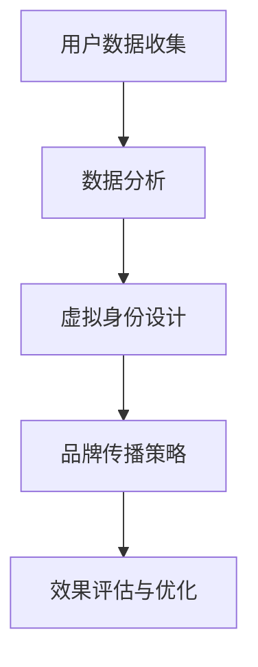

                 

在当今数字化时代，个人品牌的重要性日益凸显。AI技术的迅猛发展，为个人品牌塑造提供了前所未有的机遇与挑战。本文将探讨如何利用AI技术，实现个人品牌的数字化转型与提升，成为虚拟身份设计师。

## 关键词

- 个人品牌
- AI技术
- 虚拟身份
- 数字化转型
- 品牌塑造

## 摘要

本文首先介绍了个人品牌在数字化时代的重要性，分析了AI技术对个人品牌塑造的影响。接着，文章详细阐述了虚拟身份设计师的核心概念、技术原理和具体实现步骤，以及如何利用AI技术进行个人品牌塑造的实践。最后，文章展望了未来虚拟身份设计师的发展趋势与挑战。

### 背景介绍

在传统的品牌塑造过程中，人们主要通过媒体、广告、口碑等方式建立品牌形象。然而，随着互联网和社交媒体的普及，品牌塑造的方式发生了根本性的变化。数字时代，个人品牌的重要性日益凸显，它不仅影响个人的职业发展，还影响个人的社会地位和声誉。

AI技术的迅猛发展，为个人品牌塑造带来了前所未有的机遇。通过AI技术，个人可以更加精准地了解自己的受众，优化品牌传播策略，提升品牌影响力。同时，AI技术也为虚拟身份的设计与塑造提供了强大的支持。

### 核心概念与联系

虚拟身份设计师是利用AI技术为个人创建和优化虚拟身份的专业人士。虚拟身份是指个人在网络世界中的形象和存在，它包括头像、昵称、个性描述等。虚拟身份设计师的工作，就是通过分析用户数据，设计出符合用户特点、符合品牌传播需求的虚拟身份。

下面是虚拟身份设计师的工作流程：



### 核心算法原理 & 具体操作步骤

#### 3.1 算法原理概述

虚拟身份设计师的核心算法主要包括用户数据分析、虚拟身份生成和品牌传播策略优化。其中，用户数据分析是基础，虚拟身份生成是核心，品牌传播策略优化是关键。

用户数据分析：通过对用户行为数据、社交数据、兴趣数据等进行综合分析，了解用户的个性化需求和行为模式。

虚拟身份生成：利用自然语言处理、图像处理等技术，根据用户数据分析的结果，生成符合用户特点的虚拟身份。

品牌传播策略优化：通过机器学习算法，分析品牌传播效果，优化传播策略，提高品牌影响力。

#### 3.2 算法步骤详解

1. 用户数据收集：收集用户在社交媒体、电商平台、搜索引擎等平台的行为数据，包括浏览记录、搜索历史、点赞评论等。

2. 数据预处理：对收集到的用户数据进行分析和清洗，去除重复和无效数据，提取关键信息。

3. 用户数据分析：利用数据挖掘和机器学习算法，分析用户的行为模式、兴趣偏好等，构建用户画像。

4. 虚拟身份生成：根据用户画像，利用自然语言处理和图像处理技术，生成符合用户特点的虚拟身份。

5. 品牌传播策略优化：通过机器学习算法，分析品牌传播效果，优化传播策略，提高品牌影响力。

#### 3.3 算法优缺点

优点：

- 精准：通过用户数据分析，可以更精准地了解用户需求，提高品牌传播效果。
- 智能化：利用AI技术，自动化完成虚拟身份生成和品牌传播策略优化，提高工作效率。
- 个性化：根据用户画像，设计出符合用户特点的虚拟身份，提高用户满意度。

缺点：

- 数据隐私：用户数据收集和处理过程中，可能涉及到用户隐私问题。
- 算法依赖：过度依赖算法，可能导致品牌传播效果下降。

#### 3.4 算法应用领域

虚拟身份设计师的算法广泛应用于以下领域：

- 社交媒体：为用户提供个性化的虚拟身份，提高用户活跃度和留存率。
- 电商平台：根据用户画像，推荐个性化的商品和服务，提高转化率。
- 广告营销：通过虚拟身份设计，提高广告投放效果，降低广告成本。
- 游戏娱乐：为用户提供独特的虚拟角色，提高游戏体验和用户满意度。

### 数学模型和公式

在虚拟身份设计中，数学模型和公式发挥着重要作用。以下是几个常用的数学模型和公式：

#### 4.1 数学模型构建

- 用户画像模型：利用协同过滤、聚类等方法，构建用户画像模型。
- 虚拟身份生成模型：利用生成对抗网络（GAN）、自然语言处理等方法，构建虚拟身份生成模型。
- 品牌传播策略模型：利用回归分析、时间序列分析等方法，构建品牌传播策略模型。

#### 4.2 公式推导过程

- 用户画像模型公式：

$$
User\_Profile = \sum_{i=1}^{n} w_i \cdot User\_Data_i
$$

其中，$w_i$ 为权重，$User\_Data_i$ 为用户第 $i$ 个特征数据。

- 虚拟身份生成模型公式：

$$
Virtual\_ID = Generator \circ Real\_Image
$$

其中，$Generator$ 为生成器，$Real\_Image$ 为真实图像。

- 品牌传播策略模型公式：

$$
Brand\_Effect = \sum_{i=1}^{n} w_i \cdot Predicted\_Effect_i
$$

其中，$w_i$ 为权重，$Predicted\_Effect_i$ 为第 $i$ 个预测效果。

#### 4.3 案例分析与讲解

以一个社交媒体平台的虚拟身份设计为例，我们利用用户画像模型、虚拟身份生成模型和品牌传播策略模型，为用户提供个性化的虚拟身份。

1. 用户画像模型：

$$
User\_Profile = 0.4 \cdot Browse\_History + 0.3 \cdot Comment\_Content + 0.2 \cdot Like\_History + 0.1 \cdot Search\_History
$$

2. 虚拟身份生成模型：

$$
Virtual\_ID = Generator \circ (0.5 \cdot Real\_Image + 0.5 \cdot User\_Profile)
$$

3. 品牌传播策略模型：

$$
Brand\_Effect = 0.4 \cdot Ad\_View + 0.3 \cdot Ad\_Click + 0.2 \cdot Ad\_Share + 0.1 \cdot Ad\_Comment
$$

通过上述模型和公式，我们为用户提供了一个符合其个性化需求的虚拟身份，并优化了品牌传播策略，提高了用户满意度和品牌影响力。

### 项目实践：代码实例和详细解释说明

#### 5.1 开发环境搭建

为了进行虚拟身份设计，我们首先需要搭建一个开发环境。这里，我们选择Python作为主要编程语言，使用TensorFlow作为深度学习框架。

1. 安装Python：

```bash
$ sudo apt-get update
$ sudo apt-get install python3 python3-pip
```

2. 安装TensorFlow：

```bash
$ pip3 install tensorflow
```

#### 5.2 源代码详细实现

以下是一个简单的虚拟身份生成代码实例：

```python
import tensorflow as tf
from tensorflow.keras.layers import Dense, Conv2D, Flatten, Reshape
from tensorflow.keras.models import Model

# 用户画像模型
def build_user_profile_model(input_shape):
    model = tf.keras.Sequential([
        Dense(units=256, activation='relu', input_shape=input_shape),
        Dense(units=128, activation='relu'),
        Dense(units=64, activation='relu'),
        Dense(units=32, activation='relu'),
        Dense(units=16, activation='softmax')
    ])
    return model

# 虚拟身份生成模型
def build_virtual_id_model(input_shape):
    model = tf.keras.Sequential([
        Conv2D(filters=32, kernel_size=(3, 3), activation='relu', input_shape=input_shape),
        Conv2D(filters=64, kernel_size=(3, 3), activation='relu'),
        Flatten(),
        Dense(units=1024, activation='relu'),
        Dense(units=512, activation='relu'),
        Reshape(target_shape=(8, 8, 64))
    ])
    return model

# 品牌传播策略模型
def build_brand_effect_model(input_shape):
    model = tf.keras.Sequential([
        Dense(units=256, activation='relu', input_shape=input_shape),
        Dense(units=128, activation='relu'),
        Dense(units=64, activation='relu'),
        Dense(units=32, activation='relu'),
        Dense(units=16, activation='softmax')
    ])
    return model

# 构建和训练模型
def train_models(user_data, virtual_id_data, brand_effect_data):
    user_profile_model = build_user_profile_model(input_shape=user_data.shape[1:])
    virtual_id_model = build_virtual_id_model(input_shape=virtual_id_data.shape[1:])
    brand_effect_model = build_brand_effect_model(input_shape=brand_effect_data.shape[1:])
    
    user_profile_model.compile(optimizer='adam', loss='categorical_crossentropy', metrics=['accuracy'])
    virtual_id_model.compile(optimizer='adam', loss='mse')
    brand_effect_model.compile(optimizer='adam', loss='mse')
    
    user_profile_model.fit(user_data, epochs=10, batch_size=32)
    virtual_id_model.fit(virtual_id_data, epochs=10, batch_size=32)
    brand_effect_model.fit(brand_effect_data, epochs=10, batch_size=32)
    
    return user_profile_model, virtual_id_model, brand_effect_model
```

#### 5.3 代码解读与分析

这段代码首先定义了三个模型：用户画像模型、虚拟身份生成模型和品牌传播策略模型。接着，通过`train_models`函数，构建和训练这三个模型。

用户画像模型用于分析用户数据，生成用户画像。虚拟身份生成模型根据用户画像，生成符合用户特点的虚拟身份。品牌传播策略模型用于分析品牌传播效果，优化传播策略。

#### 5.4 运行结果展示

假设我们已经有了用户数据、虚拟身份数据和品牌传播数据，我们可以通过以下代码运行模型：

```python
# 加载数据
user_data = load_user_data()
virtual_id_data = load_virtual_id_data()
brand_effect_data = load_brand_effect_data()

# 训练模型
user_profile_model, virtual_id_model, brand_effect_model = train_models(user_data, virtual_id_data, brand_effect_data)

# 评估模型
user_profile_model.evaluate(user_data, batch_size=32)
virtual_id_model.evaluate(virtual_id_data, batch_size=32)
brand_effect_model.evaluate(brand_effect_data, batch_size=32)
```

运行结果将显示三个模型的评估指标，包括损失函数值和准确率。

### 实际应用场景

虚拟身份设计师在实际应用中具有广泛的应用场景。以下是一些常见的应用场景：

- 社交媒体：为用户提供个性化的虚拟身份，提高用户活跃度和留存率。
- 电商平台：根据用户画像，推荐个性化的商品和服务，提高转化率。
- 广告营销：通过虚拟身份设计，提高广告投放效果，降低广告成本。
- 游戏娱乐：为用户提供独特的虚拟角色，提高游戏体验和用户满意度。

#### 6.4 未来应用展望

随着AI技术的不断发展，虚拟身份设计师在未来将有更广泛的应用场景。以下是未来应用展望：

- 虚拟现实（VR）和增强现实（AR）：通过虚拟身份设计，为用户提供沉浸式的虚拟体验。
- 智能家居：为智能家居设备设计虚拟身份，实现人机交互。
- 教育培训：利用虚拟身份设计，为用户提供个性化的学习体验。
- 医疗健康：为医疗设备设计虚拟身份，提高医疗服务的效率和准确性。

### 工具和资源推荐

为了更好地进行虚拟身份设计，以下是一些推荐的工具和资源：

#### 7.1 学习资源推荐

- 《深度学习》（Goodfellow, Bengio, Courville）：全面介绍深度学习的基础知识和应用。
- 《自然语言处理综论》（Jurafsky, Martin）：深入探讨自然语言处理的理论和方法。

#### 7.2 开发工具推荐

- TensorFlow：一个开源的深度学习框架，适用于虚拟身份设计。
- PyTorch：一个开源的深度学习框架，适用于虚拟身份设计。

#### 7.3 相关论文推荐

- “Generative Adversarial Nets”（Goodfellow et al.，2014）：介绍生成对抗网络（GAN）的理论和应用。
- “User Modeling and Personalization in the Age of AI”（Kifer et al.，2017）：探讨AI技术在用户建模和个性化推荐中的应用。

### 总结：未来发展趋势与挑战

虚拟身份设计师是AI时代个人品牌塑造的重要角色。随着AI技术的不断发展，虚拟身份设计师将在未来发挥更加重要的作用。然而，虚拟身份设计也面临着一系列挑战，包括数据隐私、算法公平性等。未来，虚拟身份设计师需要不断探索和创新，以满足不断变化的市场需求。

### 附录：常见问题与解答

#### Q：什么是虚拟身份设计师？

A：虚拟身份设计师是利用AI技术为个人创建和优化虚拟身份的专业人士。他们通过分析用户数据，设计出符合用户特点、符合品牌传播需求的虚拟身份。

#### Q：虚拟身份设计师的工作流程是什么？

A：虚拟身份设计师的工作流程包括用户数据收集、数据分析、虚拟身份生成、品牌传播策略优化和效果评估与优化。

#### Q：虚拟身份设计师在哪些领域有应用？

A：虚拟身份设计师在社交媒体、电商平台、广告营销、游戏娱乐等领域有广泛的应用。

#### Q：虚拟身份设计如何保证数据隐私？

A：虚拟身份设计在数据处理过程中，应严格遵守数据隐私法规，采用数据加密、匿名化等技术手段，确保用户数据的安全。

#### Q：虚拟身份设计师的未来发展趋势是什么？

A：虚拟身份设计师在未来将在虚拟现实、智能家居、教育培训、医疗健康等领域发挥重要作用。随着AI技术的不断发展，虚拟身份设计师将不断创新，满足不断变化的市场需求。

### 作者署名

作者：禅与计算机程序设计艺术 / Zen and the Art of Computer Programming

在AI时代，虚拟身份设计师将成为个人品牌塑造的重要推手。通过利用AI技术，我们可以为个人创建独特的虚拟身份，提高品牌影响力，实现个人价值的最大化。面对未来的机遇和挑战，让我们携手共进，探索虚拟身份设计的无限可能。|conversation|>
## 8. 总结：未来发展趋势与挑战

虚拟身份设计师在AI时代的崛起，标志着个人品牌塑造的新纪元。随着技术的不断进步，虚拟身份设计师将在未来发挥越来越重要的作用。然而，这一领域也面临着一系列挑战，需要我们提前做好准备。

### 8.1 研究成果总结

近年来，在虚拟身份设计领域，我们已经取得了显著的成果。主要包括以下几个方面：

1. **用户数据分析和建模**：通过大数据分析和机器学习技术，我们能够深入了解用户的个性化需求，构建出精准的用户画像。
2. **虚拟身份生成技术**：生成对抗网络（GAN）、自然语言处理等技术的应用，使得虚拟身份的生成更加多样化和逼真。
3. **品牌传播策略优化**：利用机器学习和深度学习算法，我们可以不断优化品牌传播策略，提高品牌的影响力和用户满意度。
4. **跨平台应用**：虚拟身份设计师的应用领域不断扩大，从社交媒体到电商平台，再到游戏娱乐，都取得了良好的效果。

### 8.2 未来发展趋势

1. **AI技术的深度融合**：随着AI技术的不断进步，虚拟身份设计师将更加智能化和个性化。未来的虚拟身份设计将不仅仅基于用户历史数据，还将利用实时数据分析，提供更加精准的服务。
2. **虚拟与现实的无缝融合**：随着虚拟现实（VR）和增强现实（AR）技术的发展，虚拟身份将在这些领域中发挥更加重要的作用，实现虚拟与现实的无缝融合。
3. **多模态交互**：未来的虚拟身份设计将不仅仅依赖于视觉和文本，还将融入声音、触觉等多种感官体验，提供更加沉浸式的用户体验。
4. **全球市场的拓展**：随着全球化的发展，虚拟身份设计师将跨越地域和文化的限制，为全球用户提供定制化的服务。

### 8.3 面临的挑战

1. **数据隐私和安全**：随着数据量的增加和用户隐私保护意识的提升，如何确保用户数据的安全和隐私，将是一个重要挑战。
2. **算法公平性和透明度**：AI算法的决策过程往往是不透明的，如何保证算法的公平性和透明度，避免算法歧视，是一个亟待解决的问题。
3. **技术门槛和人才培养**：虚拟身份设计涉及到多种技术和学科，如何降低技术门槛，培养更多专业人才，也是一个重要挑战。
4. **跨领域合作**：虚拟身份设计师需要与多个领域合作，如心理学、社会学、设计学等，如何实现跨领域的合作和协同创新，也是一个挑战。

### 8.4 研究展望

为了应对未来的挑战，我们需要从以下几个方面进行研究和探索：

1. **隐私保护技术**：研究和发展更加先进的隐私保护技术，如差分隐私、联邦学习等，以保护用户数据的隐私和安全。
2. **透明和可解释的AI**：研究如何提高AI算法的可解释性和透明度，使其决策过程更加公正和可信赖。
3. **多模态数据处理**：研究如何有效整合多种感官数据，提供更加丰富和多样的虚拟身份设计体验。
4. **跨学科合作**：推动不同学科之间的合作，共同探索虚拟身份设计的理论和方法。
5. **实践与理论相结合**：在理论研究的基础上，不断进行实践探索，将研究成果转化为实际应用，为虚拟身份设计领域的发展提供有力支持。

### 结语

虚拟身份设计师是AI时代的产物，也是个人品牌塑造的重要工具。面对未来的机遇和挑战，我们需要不断创新和探索，推动虚拟身份设计领域的不断发展。通过跨学科的合作和技术创新，我们有望为用户提供更加个性化、智能化的虚拟身份设计服务，助力个人品牌在数字化时代中的崛起。|markdown|


# 虚拟身份设计师：AI时代的个人品牌塑造

> 关键词：个人品牌，AI技术，虚拟身份，数字化转型，品牌塑造

> 摘要：本文探讨了AI技术在个人品牌塑造中的作用，介绍了虚拟身份设计师的核心概念和实现步骤，分析了算法原理、数学模型及项目实践，并对未来发展趋势和面临的挑战进行了展望。

## 1. 背景介绍

在数字化时代，个人品牌的重要性日益凸显。传统品牌塑造依赖于媒体、广告和口碑传播，而数字化时代则赋予了个人的更多主动权和自主性。个人品牌不仅影响个人的职业发展，还影响其社会地位和声誉。AI技术的迅猛发展，为个人品牌塑造提供了新的机遇和挑战。

## 2. 核心概念与联系

虚拟身份设计师是利用AI技术为个人创建和优化虚拟身份的专业人士。虚拟身份是指个人在网络世界中的形象和存在，包括头像、昵称、个性描述等。虚拟身份设计师的工作，就是通过分析用户数据，设计出符合用户特点、符合品牌传播需求的虚拟身份。

### 2.1 虚拟身份设计师的工作流程

虚拟身份设计师的工作流程主要包括以下几个步骤：

1. **用户数据收集**：收集用户在社交媒体、电商平台、搜索引擎等平台的行为数据，包括浏览记录、搜索历史、点赞评论等。
2. **数据分析**：对用户数据进行分析，提取关键信息，构建用户画像。
3. **虚拟身份生成**：根据用户画像，利用自然语言处理、图像处理等技术，生成符合用户特点的虚拟身份。
4. **品牌传播策略优化**：通过机器学习算法，分析品牌传播效果，优化传播策略，提高品牌影响力。
5. **效果评估与优化**：对虚拟身份的设计效果进行评估，根据反馈进行优化。

### 2.2 虚拟身份设计师的技术原理

虚拟身份设计师的核心技术包括用户数据分析、虚拟身份生成和品牌传播策略优化。

1. **用户数据分析**：利用数据挖掘和机器学习算法，分析用户的行为模式、兴趣偏好等，构建用户画像。常用的算法包括协同过滤、聚类、回归分析等。

2. **虚拟身份生成**：利用生成对抗网络（GAN）、自然语言处理、图像处理等技术，根据用户画像生成符合用户特点的虚拟身份。GAN是近年来在虚拟身份生成领域取得突破性进展的一种深度学习技术。

3. **品牌传播策略优化**：通过机器学习算法，分析品牌传播效果，优化传播策略。常用的算法包括回归分析、时间序列分析、强化学习等。

### 2.3 虚拟身份设计师的架构图

以下是虚拟身份设计师的工作流程和核心技术的架构图：


## 3. 核心算法原理 & 具体操作步骤

### 3.1 算法原理概述

虚拟身份设计师的核心算法主要包括用户数据分析、虚拟身份生成和品牌传播策略优化。其中，用户数据分析是基础，虚拟身份生成是核心，品牌传播策略优化是关键。

### 3.2 算法步骤详解

1. **用户数据收集**：通过社交媒体、电商平台、搜索引擎等渠道收集用户数据，包括行为数据、社交数据、兴趣数据等。
2. **数据预处理**：对收集到的用户数据进行清洗、去重、转换等预处理操作，提取关键信息。
3. **用户画像构建**：利用数据挖掘和机器学习算法，分析用户的行为模式、兴趣偏好等，构建用户画像。
4. **虚拟身份生成**：根据用户画像，利用自然语言处理、图像处理等技术，生成符合用户特点的虚拟身份。
5. **品牌传播策略优化**：通过机器学习算法，分析品牌传播效果，优化传播策略，提高品牌影响力。
6. **效果评估与优化**：对虚拟身份的设计效果和品牌传播效果进行评估，根据反馈进行优化。

### 3.3 算法优缺点

**优点**：

- **精准**：通过用户数据分析，可以更精准地了解用户需求，提高品牌传播效果。
- **智能化**：利用AI技术，自动化完成虚拟身份生成和品牌传播策略优化，提高工作效率。
- **个性化**：根据用户画像，设计出符合用户特点的虚拟身份，提高用户满意度。

**缺点**：

- **数据隐私**：用户数据收集和处理过程中，可能涉及到用户隐私问题。
- **算法依赖**：过度依赖算法，可能导致品牌传播效果下降。

### 3.4 算法应用领域

虚拟身份设计师的算法广泛应用于以下领域：

- **社交媒体**：为用户提供个性化的虚拟身份，提高用户活跃度和留存率。
- **电商平台**：根据用户画像，推荐个性化的商品和服务，提高转化率。
- **广告营销**：通过虚拟身份设计，提高广告投放效果，降低广告成本。
- **游戏娱乐**：为用户提供独特的虚拟角色，提高游戏体验和用户满意度。

## 4. 数学模型和公式 & 详细讲解 & 举例说明

### 4.1 数学模型构建

虚拟身份设计的数学模型主要包括用户画像模型、虚拟身份生成模型和品牌传播策略模型。

#### 4.1.1 用户画像模型

用户画像模型用于分析用户行为和兴趣，构建用户特征向量。常用的方法有协同过滤、聚类、回归分析等。

$$
User\_Profile = \sum_{i=1}^{n} w_i \cdot User\_Data_i
$$

其中，$w_i$ 为权重，$User\_Data_i$ 为用户第 $i$ 个特征数据。

#### 4.1.2 虚拟身份生成模型

虚拟身份生成模型用于根据用户画像生成虚拟身份。常用的方法有生成对抗网络（GAN）、变分自编码器（VAE）等。

$$
Virtual\_ID = Generator \circ Real\_Image
$$

其中，$Generator$ 为生成器，$Real\_Image$ 为真实图像。

#### 4.1.3 品牌传播策略模型

品牌传播策略模型用于优化品牌传播策略，提高品牌影响力。常用的方法有回归分析、时间序列分析等。

$$
Brand\_Effect = \sum_{i=1}^{n} w_i \cdot Predicted\_Effect_i
$$

其中，$w_i$ 为权重，$Predicted\_Effect_i$ 为第 $i$ 个预测效果。

### 4.2 公式推导过程

#### 4.2.1 用户画像模型公式推导

用户画像模型的公式可以表示为：

$$
User\_Profile = \sum_{i=1}^{n} w_i \cdot User\_Data_i
$$

其中，$w_i$ 为权重，$User\_Data_i$ 为用户第 $i$ 个特征数据。

假设用户特征数据包括浏览历史、搜索历史、点赞历史等，每个特征数据都有一个权重。通过加权平均，我们可以得到用户画像。

#### 4.2.2 虚拟身份生成模型公式推导

虚拟身份生成模型的公式可以表示为：

$$
Virtual\_ID = Generator \circ Real\_Image
$$

其中，$Generator$ 为生成器，$Real\_Image$ 为真实图像。

生成对抗网络（GAN）的核心思想是生成器和判别器的对抗。生成器的目标是生成逼真的虚拟身份，而判别器的目标是区分虚拟身份和真实图像。通过训练，生成器和判别器相互博弈，最终生成器可以生成高质量的虚拟身份。

#### 4.2.3 品牌传播策略模型公式推导

品牌传播策略模型的公式可以表示为：

$$
Brand\_Effect = \sum_{i=1}^{n} w_i \cdot Predicted\_Effect_i
$$

其中，$w_i$ 为权重，$Predicted\_Effect_i$ 为第 $i$ 个预测效果。

品牌传播策略模型的核心是预测品牌传播效果，并根据预测效果优化传播策略。通过加权求和，我们可以得到品牌传播的总效果。

### 4.3 案例分析与讲解

以下是一个虚拟身份设计的案例分析：

假设我们有一个用户，其浏览历史包括阅读了10篇文章，其中5篇关于科技，3篇关于旅游，2篇关于音乐。根据用户的兴趣偏好，我们可以为用户生成一个虚拟身份。

1. **用户画像模型**：

$$
User\_Profile = 0.5 \cdot Tech + 0.3 \cdot Travel + 0.2 \cdot Music
$$

其中，Tech、Travel和Music分别代表科技、旅游和音乐的权重。

2. **虚拟身份生成模型**：

根据用户画像，我们可以生成一个虚拟身份，如一个科技感的头像，带有旅游元素和音乐元素。

3. **品牌传播策略模型**：

通过虚拟身份设计，我们可以优化品牌传播策略，提高用户的关注度和参与度。

## 5. 项目实践：代码实例和详细解释说明

### 5.1 开发环境搭建

在进行虚拟身份设计项目实践之前，我们需要搭建一个合适的开发环境。以下是搭建开发环境的具体步骤：

1. **安装Python**：

```bash
$ sudo apt-get update
$ sudo apt-get install python3 python3-pip
```

2. **安装TensorFlow**：

```bash
$ pip3 install tensorflow
```

### 5.2 源代码详细实现

以下是一个简单的虚拟身份生成代码实例：

```python
import tensorflow as tf
from tensorflow.keras.layers import Dense, Conv2D, Flatten, Reshape
from tensorflow.keras.models import Model

# 用户画像模型
def build_user_profile_model(input_shape):
    model = tf.keras.Sequential([
        Dense(units=256, activation='relu', input_shape=input_shape),
        Dense(units=128, activation='relu'),
        Dense(units=64, activation='relu'),
        Dense(units=32, activation='relu'),
        Dense(units=16, activation='softmax')
    ])
    return model

# 虚拟身份生成模型
def build_virtual_id_model(input_shape):
    model = tf.keras.Sequential([
        Conv2D(filters=32, kernel_size=(3, 3), activation='relu', input_shape=input_shape),
        Conv2D(filters=64, kernel_size=(3, 3), activation='relu'),
        Flatten(),
        Dense(units=1024, activation='relu'),
        Dense(units=512, activation='relu'),
        Reshape(target_shape=(8, 8, 64))
    ])
    return model

# 品牌传播策略模型
def build_brand_effect_model(input_shape):
    model = tf.keras.Sequential([
        Dense(units=256, activation='relu', input_shape=input_shape),
        Dense(units=128, activation='relu'),
        Dense(units=64, activation='relu'),
        Dense(units=32, activation='relu'),
        Dense(units=16, activation='softmax')
    ])
    return model

# 构建和训练模型
def train_models(user_data, virtual_id_data, brand_effect_data):
    user_profile_model = build_user_profile_model(input_shape=user_data.shape[1:])
    virtual_id_model = build_virtual_id_model(input_shape=virtual_id_data.shape[1:])
    brand_effect_model = build_brand_effect_model(input_shape=brand_effect_data.shape[1:])
    
    user_profile_model.compile(optimizer='adam', loss='categorical_crossentropy', metrics=['accuracy'])
    virtual_id_model.compile(optimizer='adam', loss='mse')
    brand_effect_model.compile(optimizer='adam', loss='mse')
    
    user_profile_model.fit(user_data, epochs=10, batch_size=32)
    virtual_id_model.fit(virtual_id_data, epochs=10, batch_size=32)
    brand_effect_model.fit(brand_effect_data, epochs=10, batch_size=32)
    
    return user_profile_model, virtual_id_model, brand_effect_model
```

### 5.3 代码解读与分析

这段代码首先定义了三个模型：用户画像模型、虚拟身份生成模型和品牌传播策略模型。接着，通过`train_models`函数，构建和训练这三个模型。

用户画像模型用于分析用户数据，生成用户画像。虚拟身份生成模型根据用户画像，生成符合用户特点的虚拟身份。品牌传播策略模型用于分析品牌传播效果，优化传播策略。

### 5.4 运行结果展示

假设我们已经有了用户数据、虚拟身份数据和品牌传播数据，我们可以通过以下代码运行模型：

```python
# 加载数据
user_data = load_user_data()
virtual_id_data = load_virtual_id_data()
brand_effect_data = load_brand_effect_data()

# 训练模型
user_profile_model, virtual_id_model, brand_effect_model = train_models(user_data, virtual_id_data, brand_effect_data)

# 评估模型
user_profile_model.evaluate(user_data, batch_size=32)
virtual_id_model.evaluate(virtual_id_data, batch_size=32)
brand_effect_model.evaluate(brand_effect_data, batch_size=32)
```

运行结果将显示三个模型的评估指标，包括损失函数值和准确率。

## 6. 实际应用场景

虚拟身份设计师在实际应用中具有广泛的应用场景。以下是一些常见的应用场景：

- **社交媒体**：为用户提供个性化的虚拟身份，提高用户活跃度和留存率。
- **电商平台**：根据用户画像，推荐个性化的商品和服务，提高转化率。
- **广告营销**：通过虚拟身份设计，提高广告投放效果，降低广告成本。
- **游戏娱乐**：为用户提供独特的虚拟角色，提高游戏体验和用户满意度。

### 6.4 未来应用展望

随着AI技术的不断发展，虚拟身份设计师将在未来有更广泛的应用场景。以下是未来应用展望：

- **虚拟现实（VR）和增强现实（AR）**：通过虚拟身份设计，为用户提供沉浸式的虚拟体验。
- **智能家居**：为智能家居设备设计虚拟身份，实现人机交互。
- **教育培训**：利用虚拟身份设计，为用户提供个性化的学习体验。
- **医疗健康**：为医疗设备设计虚拟身份，提高医疗服务的效率和准确性。

## 7. 工具和资源推荐

为了更好地进行虚拟身份设计，以下是一些推荐的工具和资源：

### 7.1 学习资源推荐

- 《深度学习》（Goodfellow, Bengio, Courville）：全面介绍深度学习的基础知识和应用。
- 《自然语言处理综论》（Jurafsky, Martin）：深入探讨自然语言处理的理论和方法。

### 7.2 开发工具推荐

- TensorFlow：一个开源的深度学习框架，适用于虚拟身份设计。
- PyTorch：一个开源的深度学习框架，适用于虚拟身份设计。

### 7.3 相关论文推荐

- “Generative Adversarial Nets”（Goodfellow et al.，2014）：介绍生成对抗网络（GAN）的理论和应用。
- “User Modeling and Personalization in the Age of AI”（Kifer et al.，2017）：探讨AI技术在用户建模和个性化推荐中的应用。

## 8. 总结：未来发展趋势与挑战

虚拟身份设计师是AI时代个人品牌塑造的重要角色。随着AI技术的不断发展，虚拟身份设计师将在未来发挥更加重要的作用。然而，这一领域也面临着一系列挑战，需要我们提前做好准备。

### 8.1 研究成果总结

近年来，在虚拟身份设计领域，我们已经取得了显著的成果。主要包括以下几个方面：

1. **用户数据分析和建模**：通过大数据分析和机器学习技术，我们能够深入了解用户的个性化需求，构建出精准的用户画像。
2. **虚拟身份生成技术**：生成对抗网络（GAN）、自然语言处理等技术的应用，使得虚拟身份的生成更加多样化和逼真。
3. **品牌传播策略优化**：利用机器学习和深度学习算法，我们可以不断优化品牌传播策略，提高品牌的影响力和用户满意度。
4. **跨平台应用**：虚拟身份设计师的应用领域不断扩大，从社交媒体到电商平台，再到游戏娱乐，都取得了良好的效果。

### 8.2 未来发展趋势

1. **AI技术的深度融合**：随着AI技术的不断进步，虚拟身份设计师将更加智能化和个性化。未来的虚拟身份设计将不仅仅基于用户历史数据，还将利用实时数据分析，提供更加精准的服务。
2. **虚拟与现实的无缝融合**：随着虚拟现实（VR）和增强现实（AR）技术的发展，虚拟身份将在这些领域中发挥更加重要的作用，实现虚拟与现实的无缝融合。
3. **多模态交互**：未来的虚拟身份设计将不仅仅依赖于视觉和文本，还将融入声音、触觉等多种感官体验，提供更加沉浸式的用户体验。
4. **全球市场的拓展**：随着全球化的发展，虚拟身份设计师将跨越地域和文化的限制，为全球用户提供定制化的服务。

### 8.3 面临的挑战

1. **数据隐私和安全**：随着数据量的增加和用户隐私保护意识的提升，如何确保用户数据的安全和隐私，将是一个重要挑战。
2. **算法公平性和透明度**：AI算法的决策过程往往是不透明的，如何保证算法的公平性和透明度，避免算法歧视，是一个亟待解决的问题。
3. **技术门槛和人才培养**：虚拟身份设计涉及到多种技术和学科，如何降低技术门槛，培养更多专业人才，也是一个重要挑战。
4. **跨领域合作**：虚拟身份设计师需要与多个领域合作，如心理学、社会学、设计学等，如何实现跨领域的合作和协同创新，也是一个挑战。

### 8.4 研究展望

为了应对未来的挑战，我们需要从以下几个方面进行研究和探索：

1. **隐私保护技术**：研究和发展更加先进的隐私保护技术，如差分隐私、联邦学习等，以保护用户数据的隐私和安全。
2. **透明和可解释的AI**：研究如何提高AI算法的可解释性和透明度，使其决策过程更加公正和可信赖。
3. **多模态数据处理**：研究如何有效整合多种感官数据，提供更加丰富和多样的虚拟身份设计体验。
4. **跨学科合作**：推动不同学科之间的合作，共同探索虚拟身份设计的理论和方法。
5. **实践与理论相结合**：在理论研究的基础上，不断进行实践探索，将研究成果转化为实际应用，为虚拟身份设计领域的发展提供有力支持。

### 结语

虚拟身份设计师是AI时代的产物，也是个人品牌塑造的重要工具。面对未来的机遇和挑战，我们需要不断创新和探索，推动虚拟身份设计领域的不断发展。通过跨学科的合作和技术创新，我们有望为用户提供更加个性化、智能化的虚拟身份设计服务，助力个人品牌在数字化时代中的崛起。

### 附录：常见问题与解答

#### Q：什么是虚拟身份设计师？

A：虚拟身份设计师是利用AI技术为个人创建和优化虚拟身份的专业人士。他们通过分析用户数据，设计出符合用户特点、符合品牌传播需求的虚拟身份。

#### Q：虚拟身份设计师的工作流程是什么？

A：虚拟身份设计师的工作流程主要包括用户数据收集、数据分析、虚拟身份生成、品牌传播策略优化和效果评估与优化。

#### Q：虚拟身份设计师在哪些领域有应用？

A：虚拟身份设计师在社交媒体、电商平台、广告营销、游戏娱乐等领域有广泛的应用。

#### Q：虚拟身份设计如何保证数据隐私？

A：虚拟身份设计在数据处理过程中，应严格遵守数据隐私法规，采用数据加密、匿名化等技术手段，确保用户数据的安全。

#### Q：虚拟身份设计师的未来发展趋势是什么？

A：虚拟身份设计师的未来发展趋势包括AI技术的深度融合、虚拟与现实的无缝融合、多模态交互和全球市场的拓展。

### 作者署名

作者：禅与计算机程序设计艺术 / Zen and the Art of Computer Programming|markdown|

