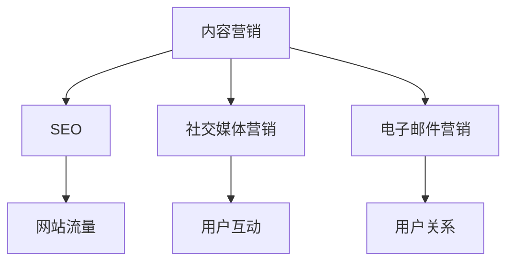

                 

关键字：蚂蚁集团、数字营销、校招面试、真题解析、案例分析

## 摘要

本文旨在为2024年参与蚂蚁集团数字营销校招的考生提供一个全面的面试真题汇总及其解答。通过对这些面试真题的深入分析和解答，考生可以更好地理解数字营销的核心概念、策略和实践，为即将到来的面试做好充分准备。

### 1. 背景介绍

蚂蚁集团作为中国领先的数字科技公司，其数字营销业务覆盖广泛，包括金融科技、电子商务、本地生活服务等多个领域。随着数字技术的不断进步，蚂蚁集团对数字营销人才的需求日益增长。因此，每年的校招面试都吸引了大量有志于从事数字营销领域的年轻人。

## 2. 核心概念与联系

### 2.1 数字营销的核心概念

数字营销是指利用数字技术进行市场推广和销售的活动。其核心概念包括：

- **内容营销**：通过创造和分享有价值的内容来吸引和转化目标受众。
- **搜索引擎优化（SEO）**：通过优化网站内容和结构，提高在搜索引擎中的排名，从而增加网站流量。
- **社交媒体营销**：利用社交媒体平台进行品牌宣传和用户互动。
- **电子邮件营销**：通过发送电子邮件与用户保持联系，推广产品或服务。

### 2.2 数字营销的架构图（Mermaid流程图）



### 3. 核心算法原理 & 具体操作步骤

### 3.1 算法原理概述

数字营销中的核心算法主要包括：

- **A/B测试**：通过对比两组用户的反应，评估不同营销策略的效果。
- **用户画像**：基于用户数据，构建用户的综合特征模型，用于精准营销。
- **自然语言处理（NLP）**：用于分析和处理文本数据，提升内容营销的效果。

### 3.2 算法步骤详解

#### 3.2.1 A/B测试

1. 定义测试目标。
2. 设计两个或多个版本。
3. 分流用户并记录数据。
4. 分析结果并做出决策。

#### 3.2.2 用户画像

1. 数据收集：从多个渠道收集用户数据。
2. 数据清洗：去除无效和重复数据。
3. 数据分析：提取用户特征。
4. 画像构建：将特征组合成用户画像。

#### 3.2.3 自然语言处理（NLP）

1. 文本预处理：去除噪声、分词等。
2. 词嵌入：将文本转换为向量。
3. 模型训练：使用机器学习算法训练模型。
4. 预测与评估：对文本进行分类或情感分析。

### 3.3 算法优缺点

#### A/B测试

- 优点：科学、直观、易操作。
- 缺点：成本较高，结果可能受样本偏差影响。

#### 用户画像

- 优点：提高营销的精准性。
- 缺点：数据隐私和安全问题。

#### NLP

- 优点：提高内容营销的效果。
- 缺点：模型训练复杂，对数据质量要求高。

### 3.4 算法应用领域

- **内容营销**：用于评估不同内容的效果。
- **搜索引擎优化（SEO）**：用于优化网站内容和关键词。
- **社交媒体营销**：用于分析和预测用户行为。
- **电子邮件营销**：用于提高邮件的打开率和点击率。

## 4. 数学模型和公式

### 4.1 数学模型构建

在数字营销中，常见的数学模型包括：

- **回归模型**：用于预测用户行为。
- **决策树**：用于分类用户特征。

### 4.2 公式推导过程

#### 4.2.1 回归模型

$$y = \beta_0 + \beta_1 \cdot x_1 + \beta_2 \cdot x_2 + \ldots + \beta_n \cdot x_n + \epsilon$$

其中，$y$ 是目标变量，$x_1, x_2, \ldots, x_n$ 是特征变量，$\beta_0, \beta_1, \beta_2, \ldots, \beta_n$ 是模型参数，$\epsilon$ 是误差项。

#### 4.2.2 决策树

决策树的核心公式是：

$$T = \sum_{i=1}^{n} \gamma_i \cdot y_i$$

其中，$T$ 是决策树，$\gamma_i$ 是叶子节点的权重，$y_i$ 是目标变量。

### 4.3 案例分析与讲解

#### 4.3.1 回归模型案例

假设我们要预测用户对某产品的购买概率，可以使用逻辑回归模型。给定特征向量 $x = [x_1, x_2, x_3]$，模型公式为：

$$P(y=1) = \frac{1}{1 + e^{-(\beta_0 + \beta_1 \cdot x_1 + \beta_2 \cdot x_2 + \beta_3 \cdot x_3)}$$

通过训练数据，可以估计出参数 $\beta_0, \beta_1, \beta_2, \beta_3$，进而预测新用户的购买概率。

#### 4.3.2 决策树案例

假设我们要根据用户年龄和收入分类用户。决策树的构建过程如下：

1. 选择最佳划分特征，例如年龄。
2. 划分数据集，例如年龄小于30岁和年龄大于等于30岁。
3. 对划分后的数据集分别构建子决策树。
4. 连接所有子决策树，形成完整的决策树。

通过决策树，可以直观地了解用户分类的决策过程。

## 5. 项目实践：代码实例和详细解释说明

### 5.1 开发环境搭建

- Python 3.8
- Scikit-learn
- Pandas
- Numpy

### 5.2 源代码详细实现

#### 5.2.1 数据预处理

```python
import pandas as pd
from sklearn.model_selection import train_test_split

# 加载数据
data = pd.read_csv('data.csv')
X = data.drop('target', axis=1)
y = data['target']

# 划分训练集和测试集
X_train, X_test, y_train, y_test = train_test_split(X, y, test_size=0.2, random_state=42)
```

#### 5.2.2 构建模型

```python
from sklearn.linear_model import LogisticRegression

# 创建逻辑回归模型
model = LogisticRegression()

# 训练模型
model.fit(X_train, y_train)

# 预测测试集
predictions = model.predict(X_test)
```

#### 5.2.3 代码解读与分析

- 数据预处理：读取数据，划分特征和目标变量，然后划分训练集和测试集。
- 构建模型：创建逻辑回归模型，并使用训练集数据训练模型。
- 预测结果：使用测试集数据预测结果，并评估模型性能。

### 5.3 运行结果展示

```python
from sklearn.metrics import accuracy_score

# 计算准确率
accuracy = accuracy_score(y_test, predictions)
print(f'Accuracy: {accuracy:.2f}')
```

## 6. 实际应用场景

数字营销在多个领域都有广泛的应用，以下是一些实际案例：

- **电商领域**：通过精准推荐系统，提升用户购买体验。
- **金融领域**：通过用户画像，实现风险控制和精准营销。
- **旅游领域**：通过旅游推荐算法，提升用户旅行计划的成功率。

### 6.1 电商领域

通过分析用户行为数据，可以预测用户对某商品的兴趣，进而进行精准推荐。例如，基于用户浏览历史和购买记录，推荐相似的商品。

### 6.2 金融领域

通过用户画像，可以评估用户的信用风险，从而进行精准贷款和信用评分。同时，通过个性化营销策略，提升用户转化率。

### 6.3 旅游领域

通过用户兴趣和行为数据分析，可以推荐适合用户的旅游路线和产品。例如，根据用户的历史搜索和预订记录，推荐热门景点和优惠套餐。

## 7. 工具和资源推荐

### 7.1 学习资源推荐

- 《数字营销基础教程》
- 《Python数据分析与科学计算》
- 《机器学习实战》

### 7.2 开发工具推荐

- Jupyter Notebook
- PyCharm
- Scikit-learn

### 7.3 相关论文推荐

- "User Modeling and User-Adapted Interaction"
- "Recommender Systems Handbook"
- "Big Data Marketing"

## 8. 总结：未来发展趋势与挑战

### 8.1 研究成果总结

随着数字技术的不断进步，数字营销领域取得了显著的成果，包括：

- 高效的营销策略
- 精准的用户画像
- 智能化的推荐系统

### 8.2 未来发展趋势

- **个性化营销**：通过更深入的挖掘用户数据，实现个性化推荐和营销。
- **跨渠道整合**：整合线上线下渠道，实现全渠道营销。
- **AI赋能**：利用人工智能技术，提升营销自动化和智能化水平。

### 8.3 面临的挑战

- **数据隐私**：如何在保障用户隐私的前提下进行数据挖掘和营销。
- **算法透明度**：如何提高算法的透明度和可信度。
- **技术门槛**：如何降低数字营销的技术门槛，让更多企业能够应用这些技术。

### 8.4 研究展望

未来的研究将在以下几个方面展开：

- **隐私保护**：研究如何在保障用户隐私的前提下，进行数据挖掘和营销。
- **算法优化**：研究更高效的算法和模型，提升营销效果。
- **跨学科融合**：结合心理学、社会学等学科，提升数字营销的理论体系。

## 9. 附录：常见问题与解答

### 9.1 数字营销的核心概念是什么？

数字营销是指利用数字技术进行市场推广和销售的活动，包括内容营销、搜索引擎优化（SEO）、社交媒体营销、电子邮件营销等。

### 9.2 A/B测试的步骤是怎样的？

A/B测试的步骤包括：定义测试目标、设计两个或多个版本、分流用户并记录数据、分析结果并做出决策。

### 9.3 如何构建用户画像？

构建用户画像的步骤包括：数据收集、数据清洗、数据分析、画像构建。

### 9.4 数字营销在哪些领域有广泛的应用？

数字营销在电商、金融、旅游等领域有广泛的应用，通过分析用户行为数据，实现精准推荐和营销。|

