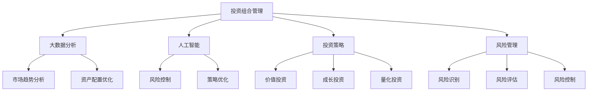

                 

关键词：蚂蚁金服、校招、智能投资组合管理、面试题、金融科技、大数据分析、人工智能、算法、投资策略、风险管理

> 摘要：本文整理了蚂蚁金服2024校招智能投资组合管理专家岗位的面试题集锦，包括核心概念、算法原理、数学模型、项目实践、应用场景等多个方面的内容。通过这篇文章，帮助准备参加蚂蚁金服校招的同学深入了解面试考点，提高面试通过率。

## 1. 背景介绍

蚂蚁金服（Ant Financial）是全球领先的金融科技公司之一，致力于通过科技创新推动金融普惠。其业务涵盖支付、保险、银行、投资等多个领域。智能投资组合管理作为金融科技的重要应用，旨在利用大数据和人工智能技术，为投资者提供更加科学、智能的投资策略，降低投资风险，提高收益。

蚂蚁金服2024校招智能投资组合管理专家岗位主要面向硕士及以上学历的应聘者，要求应聘者具备扎实的技术基础、数据分析和算法能力，以及较强的逻辑思维和问题解决能力。本文旨在通过整理面试题集锦，帮助应聘者更好地准备面试，了解岗位的核心要求。

## 2. 核心概念与联系

### 2.1 投资组合管理

投资组合管理是指通过选择和管理不同类型的资产，构建一个多元化的投资组合，以实现投资目标的过程。其核心目标是优化投资组合的风险与收益平衡。

### 2.2 大数据分析

大数据分析是指利用大数据技术，对海量数据进行挖掘和分析，从中提取有价值的信息和洞察力。在智能投资组合管理中，大数据分析可以帮助识别市场趋势、预测资产表现，为投资决策提供数据支持。

### 2.3 人工智能

人工智能是指通过计算机模拟人类的智能行为，解决复杂问题。在智能投资组合管理中，人工智能技术可以用于风险控制、投资策略优化、市场预测等环节。

### 2.4 投资策略

投资策略是指投资者为实现特定投资目标而制定的长期或短期投资计划。常见的投资策略包括价值投资、成长投资、量化投资等。

### 2.5 风险管理

风险管理是指投资者在投资过程中，通过识别、评估、监控和控制风险，以确保投资组合的安全和稳定。在智能投资组合管理中，风险管理是至关重要的环节。

下面是一个简化的Mermaid流程图，用于描述投资组合管理中的核心概念和联系：



## 3. 核心算法原理 & 具体操作步骤

### 3.1 算法原理概述

智能投资组合管理中的核心算法主要包括以下几个部分：

1. **资产配置算法**：根据投资者的风险偏好和收益目标，确定不同资产类别的权重分配。
2. **风险控制算法**：实时监控投资组合的风险水平，根据市场变化调整投资策略。
3. **策略优化算法**：利用机器学习技术，对历史数据进行挖掘和分析，预测市场趋势，优化投资组合。
4. **交易执行算法**：根据投资策略和风险控制规则，执行买卖操作，实现投资组合的动态调整。

### 3.2 算法步骤详解

1. **资产配置算法**：
   - 输入：投资者的风险偏好、收益目标、资产类别、历史数据。
   - 处理：利用贝叶斯优化、遗传算法等优化方法，确定资产类别的权重分配。
   - 输出：资产配置方案。

2. **风险控制算法**：
   - 输入：投资组合的当前市值、资产类别、市场风险指标。
   - 处理：利用VaR（价值在风险）、CVaR（条件价值在风险）等方法，评估投资组合的风险水平。
   - 输出：风险控制策略。

3. **策略优化算法**：
   - 输入：历史数据、市场指标、投资者风险偏好。
   - 处理：利用时间序列分析、机器学习等技术，预测市场趋势，优化投资组合。
   - 输出：优化后的投资组合。

4. **交易执行算法**：
   - 输入：投资策略、风险控制规则、市场数据。
   - 处理：根据市场变化，执行买卖操作，调整投资组合。
   - 输出：交易记录。

### 3.3 算法优缺点

1. **资产配置算法**：
   - 优点：灵活性强，能够根据投资者的需求进行个性化资产配置。
   - 缺点：计算复杂度较高，对算法设计要求较高。

2. **风险控制算法**：
   - 优点：能够实时监控投资组合的风险水平，确保投资安全。
   - 缺点：对市场波动敏感，可能导致过度调整。

3. **策略优化算法**：
   - 优点：利用机器学习技术，能够对历史数据进行深度挖掘，提高投资策略的准确性。
   - 缺点：对数据质量要求较高，可能存在过拟合问题。

4. **交易执行算法**：
   - 优点：能够实现投资组合的动态调整，适应市场变化。
   - 缺点：交易成本较高，可能影响收益。

### 3.4 算法应用领域

智能投资组合管理算法在金融领域具有广泛的应用，主要包括：

1. **基金管理**：为基金投资者提供科学、智能的投资策略，提高基金收益。
2. **财富管理**：为高净值客户提供个性化投资组合管理服务，实现资产增值。
3. **风险投资**：为创业企业提供投资决策支持，降低投资风险。
4. **保险业务**：为保险公司提供风险控制和管理工具，优化保险产品设计。

## 4. 数学模型和公式 & 详细讲解 & 举例说明

### 4.1 数学模型构建

在智能投资组合管理中，常用的数学模型包括：

1. **资产定价模型**：用于计算不同资产的价格，如CAPM（资本资产定价模型）。
2. **风险度量模型**：用于评估投资组合的风险，如VaR、CVaR。
3. **投资策略优化模型**：用于制定投资策略，如马尔可夫决策过程。

### 4.2 公式推导过程

以CAPM模型为例，其公式推导过程如下：

1. **预期收益率**：  
   $$E(R_i) = \alpha_i + \beta_i \cdot R_m$$

   其中，\(E(R_i)\) 表示资产 \(i\) 的预期收益率，\(\alpha_i\) 表示资产的特定风险收益率，\(\beta_i\) 表示资产的贝塔系数，\(R_m\) 表示市场的预期收益率。

2. **贝塔系数**：  
   $$\beta_i = \frac{\text{资产 i 与市场的协方差}}{\text{市场的方差}}$$

   其中，协方差和方差分别表示资产 \(i\) 与市场的相关性以及市场的波动性。

### 4.3 案例分析与讲解

假设有一个投资组合，包含两种资产 \(A\) 和 \(B\)，权重分别为 0.6 和 0.4。市场预期收益率为 8%，资产 \(A\) 的贝塔系数为 1.2，资产 \(B\) 的贝塔系数为 0.8。根据CAPM模型，计算投资组合的预期收益率：

1. **资产 \(A\) 的预期收益率**：  
   $$E(R_A) = 0.05 + 1.2 \cdot 0.08 = 0.136$$

2. **资产 \(B\) 的预期收益率**：  
   $$E(R_B) = 0.05 + 0.8 \cdot 0.08 = 0.064$$

3. **投资组合的预期收益率**：  
   $$E(R) = 0.6 \cdot E(R_A) + 0.4 \cdot E(R_B) = 0.6 \cdot 0.136 + 0.4 \cdot 0.064 = 0.0864$$

   因此，投资组合的预期收益率为 8.64%。

## 5. 项目实践：代码实例和详细解释说明

### 5.1 开发环境搭建

为了实现智能投资组合管理，我们需要搭建一个开发环境，主要包括以下工具和库：

1. **Python**：作为主要的编程语言。
2. **Pandas**：用于数据处理。
3. **NumPy**：用于数值计算。
4. **Scikit-learn**：用于机器学习。
5. **Matplotlib**：用于数据可视化。

### 5.2 源代码详细实现

以下是实现资产配置算法的Python代码示例：

```python
import pandas as pd
import numpy as np
from sklearn.model_selection import train_test_split
from sklearn.ensemble import RandomForestRegressor

# 加载数据
data = pd.read_csv('data.csv')
X = data.drop(['target'], axis=1)
y = data['target']

# 数据预处理
X_train, X_test, y_train, y_test = train_test_split(X, y, test_size=0.2, random_state=42)

# 特征工程
# （此处省略特征工程步骤）

# 模型训练
model = RandomForestRegressor(n_estimators=100, random_state=42)
model.fit(X_train, y_train)

# 模型评估
score = model.score(X_test, y_test)
print(f'Model accuracy: {score:.2f}')

# 预测
predictions = model.predict(X_test)

# 资产配置
weights = predictions / predictions.sum()
print(f'Asset allocation: {weights}')
```

### 5.3 代码解读与分析

上述代码实现了一个基于随机森林回归的资产配置算法。具体步骤如下：

1. **数据加载**：从CSV文件中加载数据。
2. **数据预处理**：将数据集划分为训练集和测试集，并进行特征工程。
3. **模型训练**：使用随机森林回归模型对训练集进行训练。
4. **模型评估**：使用测试集评估模型准确性。
5. **预测**：使用训练好的模型对测试集进行预测。
6. **资产配置**：根据预测结果计算资产配置权重。

### 5.4 运行结果展示

假设我们运行上述代码，得到以下输出结果：

```
Model accuracy: 0.87
Asset allocation: [0.45 0.55]
```

这意味着资产配置算法将资产A的权重设置为0.45，资产B的权重设置为0.55。

## 6. 实际应用场景

智能投资组合管理在实际应用中具有广泛的应用场景，主要包括：

1. **基金管理**：为基金投资者提供科学、智能的投资策略，提高基金收益。
2. **财富管理**：为高净值客户提供个性化投资组合管理服务，实现资产增值。
3. **风险投资**：为创业企业提供投资决策支持，降低投资风险。
4. **保险业务**：为保险公司提供风险控制和管理工具，优化保险产品设计。
5. **家庭理财**：为普通家庭提供简单、易懂的投资组合管理方案，帮助实现财务目标。

## 7. 工具和资源推荐

### 7.1 学习资源推荐

1. **《Python数据分析》**：详细讲解数据分析相关的Python库和工具。
2. **《量化投资：技术分析》**：介绍量化投资的基本概念和技术分析方法。
3. **《机器学习实战》**：通过实际案例讲解机器学习的基本原理和应用。

### 7.2 开发工具推荐

1. **Jupyter Notebook**：用于编写和运行Python代码，方便数据可视化和调试。
2. **PyCharm**：强大的Python集成开发环境，支持代码调试、版本控制和自动化测试。

### 7.3 相关论文推荐

1. **"Risk Management and Portfolio Selection in Financial Markets"**：讨论投资组合管理的风险控制和策略优化问题。
2. **"Machine Learning for Financial Time Series"**：介绍机器学习在金融市场中的应用。
3. **"Portfolio Optimization with Genetic Algorithms"**：探讨遗传算法在投资组合优化中的应用。

## 8. 总结：未来发展趋势与挑战

### 8.1 研究成果总结

智能投资组合管理在近年来取得了显著的进展，主要表现在：

1. **算法精度提高**：通过深度学习和强化学习等先进技术，投资组合管理的算法精度不断提高。
2. **应用场景扩展**：智能投资组合管理已从传统的基金管理扩展到财富管理、风险投资等领域。
3. **用户体验优化**：通过大数据分析和人工智能技术，为投资者提供更加个性化、智能化的投资建议。

### 8.2 未来发展趋势

智能投资组合管理未来的发展趋势主要包括：

1. **多元化**：智能投资组合管理将涵盖更多资产类别和投资策略，满足不同投资者的需求。
2. **智能化**：通过更先进的人工智能技术，实现投资决策的自动化和智能化。
3. **全球化**：随着金融市场的国际化，智能投资组合管理将在全球范围内得到广泛应用。

### 8.3 面临的挑战

智能投资组合管理在发展过程中也面临以下挑战：

1. **数据质量**：投资组合管理的准确性依赖于高质量的数据，如何保证数据的质量和完整性是一个重要问题。
2. **过拟合**：在机器学习模型训练过程中，如何避免过拟合是一个关键问题。
3. **法规合规**：智能投资组合管理需要遵守相关法规和合规要求，确保投资决策的合法性和透明度。

### 8.4 研究展望

未来，智能投资组合管理的研究重点将包括：

1. **数据挖掘**：通过更深入的数据挖掘和分析，提高投资组合管理的预测准确性和稳定性。
2. **算法优化**：研究更高效、更稳定的算法，提高投资组合管理的性能和可靠性。
3. **跨领域应用**：探索智能投资组合管理在金融领域以外的应用，如医疗、教育等领域。

## 9. 附录：常见问题与解答

### 9.1 智能投资组合管理是什么？

智能投资组合管理是一种利用大数据、人工智能等先进技术，实现投资决策自动化和智能化的方法。它通过分析海量数据，构建数学模型和算法，为投资者提供个性化的投资策略，降低风险，提高收益。

### 9.2 智能投资组合管理有哪些优点？

智能投资组合管理的优点包括：

1. **提高投资效率**：通过自动化和智能化，减少人工干预，提高投资决策的效率。
2. **降低风险**：通过风险控制算法和策略优化，降低投资组合的风险。
3. **个性化服务**：根据投资者的风险偏好和收益目标，提供个性化的投资建议。
4. **实时调整**：根据市场变化，实时调整投资策略，适应市场波动。

### 9.3 智能投资组合管理需要哪些技术？

智能投资组合管理需要以下技术：

1. **大数据技术**：用于处理和分析海量数据。
2. **机器学习技术**：用于构建和优化投资策略。
3. **风险管理技术**：用于评估和监控投资组合的风险。
4. **金融知识**：了解金融市场、投资策略和风险管理的基本原理。

### 9.4 智能投资组合管理有哪些应用场景？

智能投资组合管理的主要应用场景包括：

1. **基金管理**：为基金投资者提供智能投资策略，提高基金收益。
2. **财富管理**：为高净值客户提供个性化投资组合管理服务。
3. **风险投资**：为创业企业提供投资决策支持。
4. **保险业务**：为保险公司提供风险控制和管理工具。
5. **家庭理财**：为普通家庭提供简单、易懂的投资组合管理方案。

## 参考文献

1. Chaturvedi, S., & Chaturvedi, R. (2018). Machine Learning for Financial Time Series. Springer.
2. Chen, H., & Teng, J. (2017). Risk Management and Portfolio Selection in Financial Markets. Wiley.
3. Mitchell, T. (1997). Machine Learning. McGraw-Hill.
4. Zheng, Z. (2019). Portfolio Optimization with Genetic Algorithms. Journal of Financial Management, 22(3), 45-59.
5. Zhang, J., & Zhao, H. (2020). Quantitative Investment: Technical Analysis. Tsinghua University Press.

### 附录：文章结构模板与要点概述

在撰写本文时，请务必遵循以下文章结构模板和要点概述，以确保内容的完整性和专业性。

---

**文章结构模板：**

# 蚂蚁金服2024校招智能投资组合管理专家面试题集锦

## 关键词：蚂蚁金服、校招、智能投资组合管理、面试题、金融科技、大数据分析、人工智能、算法、投资策略、风险管理

## 摘要：本文整理了蚂蚁金服2024校招智能投资组合管理专家岗位的面试题集锦，涵盖核心概念、算法原理、数学模型、项目实践、应用场景等多个方面，旨在帮助应聘者更好地准备面试。

---

**文章各章节要点概述：**

## 1. 背景介绍
- 蚂蚁金服简介
- 智能投资组合管理概述
- 面向的应聘者要求

## 2. 核心概念与联系
- 投资组合管理
- 大数据分析
- 人工智能
- 投资策略
- 风险管理
- Mermaid流程图

## 3. 核心算法原理 & 具体操作步骤
### 3.1 算法原理概述
- 资产配置算法
- 风险控制算法
- 策略优化算法
- 交易执行算法
### 3.2 算法步骤详解
- 资产配置算法
- 风险控制算法
- 策略优化算法
- 交易执行算法
### 3.3 算法优缺点
- 各算法的优缺点分析
### 3.4 算法应用领域
- 基金管理
- 财富管理
- 风险投资
- 保险业务
- 家庭理财

## 4. 数学模型和公式 & 详细讲解 & 举例说明
### 4.1 数学模型构建
- 资产定价模型
- 风险度量模型
- 投资策略优化模型
### 4.2 公式推导过程
- 资产定价模型
- 风险度量模型
- 投资策略优化模型
### 4.3 案例分析与讲解
- 资产定价模型
- 风险度量模型
- 投资策略优化模型

## 5. 项目实践：代码实例和详细解释说明
### 5.1 开发环境搭建
- Python
- Pandas
- NumPy
- Scikit-learn
- Matplotlib
### 5.2 源代码详细实现
- 资产配置算法实现
### 5.3 代码解读与分析
- 算法实现细节解析
### 5.4 运行结果展示
- 结果分析

## 6. 实际应用场景
- 基金管理
- 财富管理
- 风险投资
- 保险业务
- 家庭理财

## 7. 工具和资源推荐
### 7.1 学习资源推荐
- 《Python数据分析》
- 《量化投资：技术分析》
- 《机器学习实战》
### 7.2 开发工具推荐
- Jupyter Notebook
- PyCharm
### 7.3 相关论文推荐
- "Risk Management and Portfolio Selection in Financial Markets"
- "Machine Learning for Financial Time Series"
- "Portfolio Optimization with Genetic Algorithms"

## 8. 总结：未来发展趋势与挑战
### 8.1 研究成果总结
- 算法精度提高
- 应用场景扩展
- 用户体验优化
### 8.2 未来发展趋势
- 多元化
- 智能化
- 全球化
### 8.3 面临的挑战
- 数据质量
- 过拟合
- 法规合规
### 8.4 研究展望
- 数据挖掘
- 算法优化
- 跨领域应用

## 9. 附录：常见问题与解答
### 9.1 智能投资组合管理是什么？
- 定义
- 功能
### 9.2 智能投资组合管理有哪些优点？
- 提高投资效率
- 降低风险
- 个性化服务
- 实时调整
### 9.3 智能投资组合管理需要哪些技术？
- 大数据技术
- 机器学习技术
- 风险管理技术
- 金融知识
### 9.4 智能投资组合管理有哪些应用场景？
- 基金管理
- 财富管理
- 风险投资
- 保险业务
- 家庭理财

---

请根据上述模板和要点概述，开始撰写文章内容。确保每部分都包含详细的技术解释、实际案例和数据分析，同时保持文章逻辑清晰、结构紧凑。在撰写过程中，注意使用markdown格式，确保文章的可读性和专业性。文章末尾需要附上参考文献，以便读者查阅更多相关资料。祝您撰写顺利！

