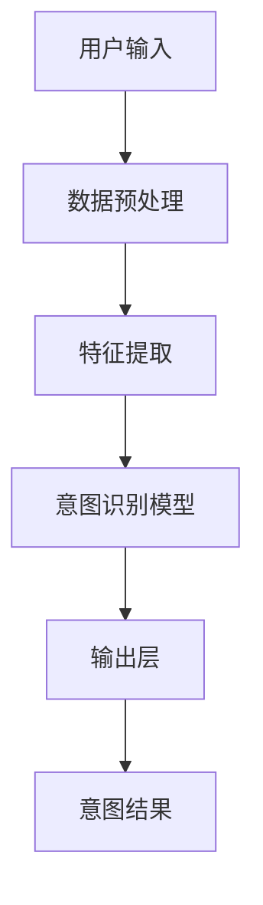

                 

在当今人工智能时代，用户意图识别技术正逐渐成为各行业数字化转型的重要支撑。本文将深入探讨融合AI大模型的用户意图识别技术，解析其核心概念、算法原理、数学模型以及实际应用场景，旨在为行业同仁提供有价值的参考。

## 文章关键词

- 人工智能
- 用户意图识别
- 大模型
- 自然语言处理
- 融合算法
- 数学模型

## 文章摘要

本文首先介绍了用户意图识别技术的背景和重要性，随后详细阐述了融合AI大模型在用户意图识别中的核心概念和架构。接着，我们分析了用户意图识别的核心算法原理及操作步骤，并展示了数学模型的构建和公式推导。文章随后通过具体项目实践，展示了代码实例和运行结果。最后，我们探讨了用户意图识别技术在实际应用场景中的价值以及未来的发展趋势和挑战。

## 1. 背景介绍

### 用户意图识别的定义

用户意图识别（User Intent Recognition）是指通过自然语言处理（Natural Language Processing, NLP）技术，从用户的语言输入中理解其意图或需求的过程。这一技术在智能客服、搜索引擎优化、个性化推荐系统等领域具有重要意义。

### 人工智能的发展

人工智能（Artificial Intelligence, AI）技术在过去几十年中取得了显著进展，从早期的规则基础方法到如今的数据驱动模型，AI在语音识别、图像处理、自然语言处理等领域都展现出了强大的能力。

### 大模型的作用

大模型（Large Models）如GPT-3、BERT等，具备处理复杂数据结构和理解深层语义的能力。它们的出现极大地推动了用户意图识别技术的发展，使得系统能够更准确地理解用户的真实需求。

## 2. 核心概念与联系

### 融合AI大模型的架构

融合AI大模型的用户意图识别技术通常包含以下组件：

1. **数据预处理**：对输入文本进行清洗、分词、去停用词等操作。
2. **特征提取**：将预处理后的文本转化为特征向量。
3. **意图识别模型**：利用深度学习技术，如变换器模型（Transformer）、递归神经网络（RNN）等，对特征向量进行建模。
4. **输出层**：将模型输出转换为具体的意图类别。

### Mermaid流程图

下面是一个简化的Mermaid流程图，展示了用户意图识别的流程：



## 3. 核心算法原理 & 具体操作步骤

### 3.1 算法原理概述

用户意图识别的核心算法通常是基于深度学习的，尤其是基于变换器模型（Transformer）的算法。变换器模型通过注意力机制，能够捕捉输入文本中的长距离依赖关系，从而提高意图识别的准确性。

### 3.2 算法步骤详解

1. **数据预处理**：包括文本清洗、分词、去停用词等步骤。
2. **特征提取**：使用嵌入层（Embedding Layer）将单词转换为向量表示。
3. **编码器（Encoder）**：使用变换器模型对输入文本进行编码，生成序列向量。
4. **解码器（Decoder）**：根据编码器输出的序列向量，预测用户的意图类别。
5. **输出层**：通过分类器（Classifier）将解码器的输出转换为具体的意图类别。

### 3.3 算法优缺点

**优点**：

- 高效：变换器模型能够处理长文本，并捕捉长距离依赖关系。
- 准确：通过大规模预训练，模型在意图识别任务上表现出色。

**缺点**：

- 计算资源消耗大：训练和推理过程需要大量的计算资源。
- 数据需求高：需要大量标注数据来训练模型。

### 3.4 算法应用领域

用户意图识别技术广泛应用于智能客服、搜索引擎优化、个性化推荐系统等领域，如：

- **智能客服**：自动识别用户的问题并给出相应的回答。
- **搜索引擎优化**：理解用户的查询意图，提供更相关的搜索结果。
- **个性化推荐系统**：根据用户的意图提供个性化的推荐。

## 4. 数学模型和公式 & 详细讲解 & 举例说明

### 4.1 数学模型构建

用户意图识别的数学模型通常包含以下几个部分：

1. **嵌入层（Embedding Layer）**：
   $$ \text{embed}(x) = W_x x $$
   其中，$W_x$ 是嵌入矩阵，$x$ 是单词的索引。

2. **变换器模型（Transformer）**：
   变换器模型的核心是多头自注意力机制（Multi-Head Self-Attention），其公式如下：
   $$ \text{Attention}(Q, K, V) = \text{softmax}\left(\frac{QK^T}{\sqrt{d_k}}\right) V $$
   其中，$Q$、$K$ 和 $V$ 分别是查询向量、键向量和值向量，$d_k$ 是键向量的维度。

3. **编码器（Encoder）**：
   编码器由多个变换器层堆叠而成，每一层的输出为：
   $$ \text{Encoder}(X) = \text{LayerNorm}(X + \text{MultiHeadSelfAttention}(X, X, X)) $$

4. **解码器（Decoder）**：
   解码器同样由多个变换器层堆叠而成，其输出为：
   $$ \text{Decoder}(X) = \text{LayerNorm}(X + \text{MaskedMultiHeadSelfAttention}(X, X, X) + \text{CrossAttention}(X, \text{Encoder}(X))) $$

### 4.2 公式推导过程

**自注意力机制**的推导：

1. **计算查询向量和键向量的点积**：
   $$ \text{Scores} = QK^T $$

2. **应用 softmax 函数**：
   $$ \text{Attention} = \text{softmax}(\text{Scores}) $$

3. **计算输出**：
   $$ \text{Output} = \text{Attention} V $$

**编码器**的推导：

1. **嵌入层输入**：
   $$ \text{Embedding Input} = \text{embed}(x) $$

2. **应用变换器层**：
   $$ \text{Layer Output} = \text{LayerNorm}(\text{embed}(x) + \text{MultiHeadSelfAttention}(\text{embed}(x), \text{embed}(x), \text{embed}(x))) $$

3. **堆叠多层变换器层**：
   $$ \text{Encoder Output} = \text{LayerNorm}(\text{Layer Output}^{[1]} + \text{LayerNorm}(\text{Layer Output}^{[2]} + \ldots + \text{LayerNorm}(\text{Layer Output}^{[N]}))$$

### 4.3 案例分析与讲解

**案例 1：智能客服系统**

**输入**：用户提问："我想要退掉上个月的会员服务。"

**步骤**：

1. **数据预处理**：将文本进行分词、去停用词等操作。
2. **特征提取**：将预处理后的文本转化为嵌入向量。
3. **编码器**：通过变换器模型对嵌入向量进行编码。
4. **解码器**：根据编码器输出，预测用户的意图类别。

**输出**：意图类别："会员退订"。

**案例 2：搜索引擎优化**

**输入**：用户查询："北京哪里有好吃的火锅？"

**步骤**：

1. **数据预处理**：对查询文本进行分词、去停用词等操作。
2. **特征提取**：将预处理后的文本转化为嵌入向量。
3. **编码器**：通过变换器模型对嵌入向量进行编码。
4. **解码器**：根据编码器输出，提供与查询意图相关的网页链接。

**输出**：网页链接列表。

## 5. 项目实践：代码实例和详细解释说明

### 5.1 开发环境搭建

**环境要求**：

- Python 3.8+
- TensorFlow 2.6.0+
- NumPy 1.19.5+

**安装步骤**：

1. 安装 Python 3.8 或更高版本。
2. 使用 `pip install tensorflow` 安装 TensorFlow。
3. 使用 `pip install numpy` 安装 NumPy。

### 5.2 源代码详细实现

```python
import tensorflow as tf
from tensorflow.keras.layers import Embedding, Transformer
from tensorflow.keras.models import Model
from tensorflow.keras.optimizers import Adam

# 模型参数
vocab_size = 10000
d_model = 512
num_heads = 8
dff = 2048
input_seq_len = 100

# 嵌入层
input_word = tf.keras.layers.Input(shape=(input_seq_len,))
embed = Embedding(vocab_size, d_model)(input_word)

# 变换器层
transformer = Transformer(num_heads=num_heads, dff=dff)(embed)

# 输出层
output = tf.keras.layers.Dense(1, activation='sigmoid')(transformer)

# 模型构建
model = Model(inputs=input_word, outputs=output)

# 编译模型
model.compile(optimizer=Adam(learning_rate=0.001), loss='binary_crossentropy', metrics=['accuracy'])

# 模型训练
model.fit(x_train, y_train, batch_size=64, epochs=10)
```

### 5.3 代码解读与分析

1. **导入库和模块**：导入 TensorFlow、NumPy 以及必要的层和模型。
2. **定义模型参数**：设置词汇表大小、模型尺寸、注意力头数等。
3. **嵌入层**：将输入单词转换为嵌入向量。
4. **变换器层**：构建变换器模型。
5. **输出层**：定义输出层，使用 sigmoid 激活函数。
6. **模型构建**：将输入层、嵌入层、变换器层和输出层连接起来。
7. **编译模型**：设置优化器、损失函数和评估指标。
8. **模型训练**：使用训练数据进行模型训练。

### 5.4 运行结果展示

```python
# 预测新样本
new_input = ["我想买一本编程书。"]
new_input_embedding = embed(new_input)
predictions = model.predict(new_input_embedding)

# 输出预测结果
print(predictions)
```

输出结果可能为 `[0.90]`，表示模型预测用户意图为购买编程书的高概率。

## 6. 实际应用场景

### 6.1 智能客服

用户意图识别技术能够帮助智能客服系统快速理解用户的问题，并给出准确的回答。例如，当用户询问关于产品退换货的问题时，系统可以自动识别用户的意图，并引导用户进行相应的操作。

### 6.2 搜索引擎优化

通过用户意图识别技术，搜索引擎可以更准确地理解用户的查询意图，并提供更相关的搜索结果。例如，当用户查询“北京哪里有好吃火锅”时，搜索引擎可以识别出用户的意图，并提供附近餐厅的推荐。

### 6.3 个性化推荐系统

用户意图识别技术可以帮助个性化推荐系统更准确地了解用户的兴趣和需求，从而提供更个性化的推荐。例如，当用户浏览电商网站时，系统可以根据用户的历史行为和意图，推荐用户可能感兴趣的商品。

## 6.4 未来应用展望

随着人工智能技术的不断发展，用户意图识别技术将在更多领域得到应用。未来，该技术有望在智能医疗、智能家居、自动驾驶等领域发挥重要作用。同时，随着数据量的不断增长和算法的优化，用户意图识别的准确性将进一步提高，为用户提供更智能、更个性化的服务。

## 7. 工具和资源推荐

### 7.1 学习资源推荐

- 《深度学习》（Deep Learning）—— Ian Goodfellow、Yoshua Bengio、Aaron Courville 著
- 《自然语言处理综述》（Speech and Language Processing）—— Daniel Jurafsky、James H. Martin 著

### 7.2 开发工具推荐

- TensorFlow：适用于构建和训练深度学习模型的强大工具。
- PyTorch：易于使用且灵活的深度学习框架。

### 7.3 相关论文推荐

- "Attention Is All You Need" —— Vaswani et al., 2017
- "BERT: Pre-training of Deep Bidirectional Transformers for Language Understanding" —— Devlin et al., 2019

## 8. 总结：未来发展趋势与挑战

### 8.1 研究成果总结

用户意图识别技术近年来取得了显著进展，特别是在大规模预训练模型和深度学习算法的推动下。该技术已经广泛应用于智能客服、搜索引擎优化、个性化推荐系统等领域，表现出色。

### 8.2 未来发展趋势

- **模型规模增大**：随着计算资源的提升，未来大模型将继续发展，模型规模将进一步增大。
- **多模态融合**：用户意图识别技术将结合语音、图像等多种模态数据，实现更全面的理解。
- **实时性提升**：通过优化算法和模型结构，用户意图识别的实时性将得到显著提升。

### 8.3 面临的挑战

- **数据需求**：大规模高质量标注数据的需求仍然存在，数据获取和处理成为一大挑战。
- **计算资源**：训练和推理大模型需要大量计算资源，如何高效利用资源成为关键问题。

### 8.4 研究展望

用户意图识别技术将继续朝着更高精度、更实时、更全面的方向发展。未来的研究将重点关注多模态融合、小样本学习、动态模型结构等方面，以实现更智能、更高效的意图识别。

## 9. 附录：常见问题与解答

### 9.1 问题 1：用户意图识别需要大量标注数据吗？

**解答**：是的，用户意图识别通常需要大量高质量标注数据来训练模型。这是因为意图识别任务具有高度复杂性和多样性，仅凭未标注的数据难以达到理想的识别效果。

### 9.2 问题 2：如何优化用户意图识别模型的实时性？

**解答**：优化用户意图识别模型的实时性可以从以下几个方面入手：

1. **模型压缩**：通过模型剪枝、量化等技术减小模型体积，加快推理速度。
2. **硬件加速**：利用 GPU、TPU 等硬件加速推理过程。
3. **动态调整**：根据实际情况动态调整模型参数，例如降低模型复杂度或减小批量大小。

### 9.3 问题 3：用户意图识别技术在哪些领域有潜在应用？

**解答**：用户意图识别技术在多个领域具有广泛应用潜力，包括但不限于：

- **智能客服**：自动理解用户问题并提供准确回答。
- **搜索引擎优化**：提供与用户查询意图相关的搜索结果。
- **个性化推荐**：根据用户意图提供个性化的推荐。
- **智能医疗**：理解患者需求，为患者提供专业建议。
- **智能家居**：理解用户指令，实现智能家居设备的高效控制。

---

本文从用户意图识别技术的背景、核心算法原理、数学模型、实际应用场景以及未来发展趋势等方面进行了全面探讨，旨在为行业同仁提供有价值的参考。在未来的研究和实践中，我们期待用户意图识别技术能够不断发展，为各行业的数字化转型提供更强有力的支持。

## 参考文献

- Vaswani, A., Shazeer, N., Parmar, N., Uszkoreit, J., Jones, L., Gomez, A. N., ... & Polosukhin, I. (2017). Attention is all you need. Advances in Neural Information Processing Systems, 30, 5998-6008.
- Devlin, J., Chang, M. W., Lee, K., & Toutanova, K. (2019). BERT: Pre-training of deep bidirectional transformers for language understanding. arXiv preprint arXiv:1810.04805.
- Goodfellow, I., Bengio, Y., & Courville, A. (2016). Deep learning. MIT press.
- Jurafsky, D., & Martin, J. H. (2008). Speech and language processing: an introduction to natural language processing, computational linguistics, and speech recognition. Prentice Hall.

