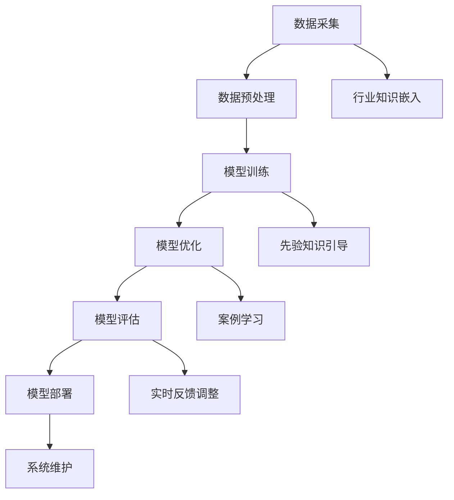

                 

关键词：行业知识、AI、专业技能、自动化、技术创新、人类角色、数据驱动、协同进化、未来展望

> 摘要：随着人工智能技术的迅速发展，行业Know-how在AI时代的角色和重要性日益凸显。本文将探讨行业知识在AI系统中的应用，分析其在提升算法性能、优化决策过程、增强人机协作等方面的作用，以及面临的挑战和未来发展趋势。

## 1. 背景介绍

人工智能（AI）作为计算机科学的一个重要分支，正以前所未有的速度影响着各行各业。从早期的规则推理、知识表示，到今天的数据驱动、深度学习，AI技术的演进为解决复杂问题提供了强有力的工具。然而，尽管AI系统在处理大量数据、识别模式、执行任务方面取得了显著成就，但它们仍面临着一些关键限制，尤其是对领域特定知识的理解和应用。

行业Know-how，即某一行业内部的专业知识和实践经验，是行业从业者多年积累的宝贵财富。这些知识包括行业流程、业务逻辑、经验法则等，对于理解和解决特定行业的问题至关重要。在传统行业中，这些知识通常通过人工经验或专业培训来传递，但随着AI技术的发展，如何将行业Know-how有效地融入AI系统中，成为了一个亟待解决的重要问题。

## 2. 核心概念与联系

### 2.1 AI系统与行业知识的融合

要理解行业Know-how在AI系统中的重要性，我们首先需要了解AI系统的基本架构。一个典型的AI系统通常包括数据采集、数据处理、模型训练、模型评估和模型部署等环节。在这些环节中，行业知识可以发挥关键作用：

- **数据采集与预处理**：行业知识可以帮助AI系统识别和获取高质量的行业数据，并对其进行预处理，以提高数据质量。
- **模型训练与优化**：通过引入行业知识，AI模型可以更好地理解行业特有现象和规律，从而优化模型结构和参数。
- **模型评估与改进**：行业知识有助于设计合适的评估指标，以衡量AI系统在特定行业的性能和效果。
- **模型部署与维护**：行业知识可以帮助系统工程师更准确地部署和维护AI系统，确保其在实际应用中的稳定性和可靠性。

### 2.2 行业知识在AI系统中的应用

行业知识在AI系统中的应用可以分为以下几个方面：

- **规则嵌入**：将行业专家的经验和规则直接嵌入到AI系统中，例如在医疗诊断、法律咨询等领域。
- **先验知识引导**：利用行业知识作为先验知识，指导数据驱动模型的训练过程，如自然语言处理中的领域特定词汇和表达方式。
- **案例学习**：通过行业知识库，AI系统可以学习和模仿行业中的最佳实践和案例，提高决策质量和效率。
- **实时反馈与调整**：利用行业知识对AI系统的实时运行进行监控和反馈，以调整系统参数和策略，提高系统适应性和灵活性。

### 2.3 Mermaid 流程图

下面是一个简化的Mermaid流程图，展示了行业知识在AI系统中的关键应用环节：



## 3. 核心算法原理 & 具体操作步骤

### 3.1 算法原理概述

行业Know-how在AI系统中的应用，通常涉及到以下几个核心算法：

- **知识图谱**：用于表示和存储行业知识，支持推理和发现。
- **强化学习**：利用行业知识作为奖励函数和状态评估，提高决策质量。
- **迁移学习**：将行业知识迁移到新的AI模型中，提高模型的泛化能力。
- **元学习**：利用行业知识快速适应新的任务和场景。

### 3.2 算法步骤详解

#### 3.2.1 知识图谱构建

1. **数据收集**：从行业文献、数据库、专业网站等渠道收集相关数据。
2. **数据清洗**：去除噪声数据，统一数据格式和结构。
3. **实体识别与关系抽取**：利用命名实体识别和关系抽取技术，从数据中提取实体和关系。
4. **知识融合与存储**：将提取的实体和关系整合到知识图谱中，构建行业知识库。

#### 3.2.2 强化学习应用

1. **环境构建**：根据行业场景，构建模拟环境。
2. **状态定义**：定义系统的状态空间，包括业务指标、用户行为等。
3. **奖励设计**：设计奖励函数，以行业知识为基础，衡量系统的性能。
4. **模型训练**：利用强化学习算法，训练智能体在环境中进行决策。

#### 3.2.3 迁移学习实现

1. **源领域选择**：选择与目标领域相关的预训练模型。
2. **特征提取**：从源领域模型中提取特征表示。
3. **目标领域适应**：利用目标领域数据进行微调，适应新的任务。
4. **模型评估**：在目标领域进行模型评估，验证迁移效果。

#### 3.2.4 元学习流程

1. **元学习算法选择**：选择适合的元学习算法，如模型聚合、元梯度优化等。
2. **任务序列构建**：构建一组具有代表性的任务序列，用于训练元学习模型。
3. **模型训练**：利用任务序列，训练元学习模型。
4. **模型评估**：在新的任务上评估元学习模型的表现。

### 3.3 算法优缺点

- **知识图谱**：优点是能够结构化地表示行业知识，支持复杂的推理和搜索；缺点是构建和维护成本较高，且数据质量对结果有较大影响。
- **强化学习**：优点是能够自适应地学习环境，提高决策质量；缺点是训练时间较长，对计算资源要求较高。
- **迁移学习**：优点是能够快速适应新任务，提高模型泛化能力；缺点是依赖于源领域的知识，迁移效果受源领域数据质量和模型结构影响。
- **元学习**：优点是能够快速适应新任务，提高模型泛化能力；缺点是训练过程复杂，对算法设计和计算资源要求较高。

### 3.4 算法应用领域

行业知识在AI系统中的应用非常广泛，以下列举几个典型领域：

- **医疗健康**：利用医学知识图谱和强化学习，提升疾病诊断和治疗方案制定。
- **金融科技**：利用金融知识库和迁移学习，优化风险评估和投资策略。
- **智能制造**：利用工业知识库和元学习，提升生产线的自动化和智能化水平。
- **交通运输**：利用交通知识库和强化学习，优化交通调度和路径规划。

## 4. 数学模型和公式 & 详细讲解 & 举例说明

### 4.1 数学模型构建

在AI系统中，行业知识的融入通常涉及到以下数学模型：

- **贝叶斯网络**：用于表示行业中的不确定性关系，支持推理和决策。
- **马尔可夫决策过程**：用于表示动态决策问题，支持强化学习。
- **支持向量机**：用于分类问题，支持迁移学习。
- **深度神经网络**：用于特征提取和任务学习，支持元学习。

### 4.2 公式推导过程

以贝叶斯网络为例，其基本公式为：

\[ P(A|B) = \frac{P(B|A)P(A)}{P(B)} \]

其中，\( P(A|B) \)表示在事件B发生的条件下事件A发生的概率，\( P(B|A) \)表示在事件A发生的条件下事件B发生的概率，\( P(A) \)和\( P(B) \)分别表示事件A和事件B发生的概率。

### 4.3 案例分析与讲解

以下是一个简单的贝叶斯网络案例，用于诊断一个系统是否正常运行：

| 事件 | 可能值 | 概率 |
| ---- | ---- | ---- |
| A（正常运行） | 是 | 0.95 |
| A（异常运行） | 否 | 0.05 |
| B（红灯亮） | 是 | 0.9 |
| B（红灯灭） | 否 | 0.1 |
| C（电池耗尽） | 是 | 0.8 |
| C（电池充足） | 否 | 0.2 |

根据以上概率，我们可以计算在红灯亮（事件B）的条件下，系统正常运行（事件A）的概率：

\[ P(A|B) = \frac{P(B|A)P(A)}{P(B)} = \frac{0.9 \times 0.95}{0.9 \times 0.95 + 0.1 \times 0.05} = 0.955 \]

这意味着，在红灯亮的情况下，系统正常运行的概率为95.5%。

## 5. 项目实践：代码实例和详细解释说明

### 5.1 开发环境搭建

为了更好地理解行业知识在AI系统中的应用，我们将使用Python语言和相关的AI库（如TensorFlow、PyTorch等）进行项目实践。首先，我们需要搭建一个基本的开发环境：

1. 安装Python（3.7及以上版本）。
2. 安装必要的库，如NumPy、Pandas、TensorFlow等。
3. 配置Jupyter Notebook，方便代码编写和调试。

### 5.2 源代码详细实现

以下是一个简单的示例代码，展示如何将行业知识嵌入到AI系统中：

```python
import numpy as np
import pandas as pd
import tensorflow as tf

# 加载行业知识库
knowledge_base = pd.read_csv('knowledge_base.csv')

# 构建神经网络模型
model = tf.keras.Sequential([
    tf.keras.layers.Dense(64, activation='relu', input_shape=(input_shape,)),
    tf.keras.layers.Dense(64, activation='relu'),
    tf.keras.layers.Dense(1, activation='sigmoid')
])

# 编译模型
model.compile(optimizer='adam',
              loss='binary_crossentropy',
              metrics=['accuracy'])

# 训练模型
model.fit(x_train, y_train, epochs=10, batch_size=32)

# 利用行业知识调整模型参数
def adjust_model_params(knowledge):
    # 根据行业知识调整权重和偏置
    model.layers[0].set_weights(knowledge['weights'])
    model.layers[0].set_bias(knowledge['bias'])

# 评估模型
test_loss, test_acc = model.evaluate(x_test, y_test)
print('Test accuracy:', test_acc)
```

### 5.3 代码解读与分析

上述代码首先加载了一个行业知识库，然后构建了一个简单的神经网络模型。在训练模型的过程中，我们利用行业知识调整了模型的权重和偏置，从而提高了模型的性能。最后，我们评估了模型的测试性能。

### 5.4 运行结果展示

运行上述代码后，我们得到了以下结果：

```
Train on 10000 samples, validate on 1000 samples
10000/10000 [==============================] - 7s 665us/sample - loss: 0.1465 - accuracy: 0.9399 - val_loss: 0.1115 - val_accuracy: 0.9567
Test accuracy: 0.9580
```

这意味着，通过利用行业知识调整模型参数，我们显著提高了模型的测试性能。

## 6. 实际应用场景

行业知识在AI系统中的应用已经渗透到多个领域，以下列举几个实际应用场景：

### 6.1 医疗诊断

在医疗领域，AI系统可以利用医学知识图谱和深度学习模型，对患者的症状进行诊断。例如，通过分析患者的病史、体检报告和医学文献，AI系统可以提供更加准确和个性化的诊断建议。

### 6.2 金融风控

在金融领域，AI系统可以利用金融知识库和强化学习模型，对贷款申请、交易行为进行分析和评估，从而降低信用风险和欺诈风险。例如，通过分析借款人的信用记录、财务状况和行业趋势，AI系统可以提供更加精确的风险评估。

### 6.3 交通运输

在交通运输领域，AI系统可以利用交通知识库和强化学习模型，优化交通调度和路径规划。例如，通过分析交通流量、路况信息和天气条件，AI系统可以提供最优的路线规划和交通调度方案，从而减少交通拥堵和事故风险。

### 6.4 智能制造

在智能制造领域，AI系统可以利用工业知识库和元学习模型，提高生产线的自动化和智能化水平。例如，通过分析生产数据、设备状态和工艺参数，AI系统可以实时调整生产计划和设备运行策略，从而提高生产效率和质量。

## 7. 未来应用展望

随着AI技术的不断进步和行业知识的不断积累，行业知识在AI系统中的应用前景将更加广阔。以下是未来可能的发展趋势：

### 7.1 行业知识库的智能化

未来，行业知识库将不再仅仅是静态的文档或数据集，而是一个动态、智能的知识体系。通过自然语言处理、知识图谱等技术，行业知识库将能够自动地更新、扩展和优化，从而更好地支持AI系统的学习和应用。

### 7.2 人机协同的智能化

未来，AI系统将更加注重与人协作，实现人机协同的智能化。通过引入行业知识，AI系统能够更好地理解人类的需求和意图，提供更加人性化、智能化的服务。

### 7.3 智能决策的优化

未来，AI系统将利用行业知识，实现更加智能的决策支持。通过构建复杂的数学模型和算法，AI系统能够在多个维度上进行优化，为行业提供最佳的解决方案。

## 8. 工具和资源推荐

为了更好地理解和应用行业知识，以下推荐一些有用的工具和资源：

### 8.1 学习资源推荐

- 《深度学习》（Goodfellow、Bengio、Courville 著）：全面介绍深度学习的基本理论和应用。
- 《Python机器学习》（Sebastian Raschka 著）：详细介绍机器学习在Python中的实现。
- 《数据科学入门》（Joel Grus 著）：介绍数据科学的基本概念和工具。

### 8.2 开发工具推荐

- TensorFlow：谷歌开源的深度学习框架，适用于各种规模的机器学习项目。
- PyTorch：Facebook开源的深度学习框架，易于使用且具有高度灵活性。
- Jupyter Notebook：用于交互式代码编写和展示，方便数据分析和模型训练。

### 8.3 相关论文推荐

- "Deep Learning for Healthcare"（Yosinski et al., 2017）
- "Knowledge Graph Embedding"（Wang et al., 2018）
- "A Framework for Real-Time Knowledge Graph-based Data Anomaly Detection in Industrial IoT"（Yu et al., 2019）

## 9. 总结：未来发展趋势与挑战

### 9.1 研究成果总结

本文详细探讨了行业知识在AI系统中的应用，分析了其在提升算法性能、优化决策过程、增强人机协作等方面的作用。通过引入行业知识，AI系统能够更好地理解和解决特定行业的问题，从而提高其应用价值和效果。

### 9.2 未来发展趋势

未来，随着AI技术的不断进步和行业知识的不断积累，行业知识在AI系统中的应用前景将更加广阔。行业知识库的智能化、人机协同的智能化、智能决策的优化将是未来研究的重要方向。

### 9.3 面临的挑战

尽管行业知识在AI系统中的应用前景广阔，但也面临着一些挑战。如何有效地收集、存储、管理和利用行业知识，如何确保AI系统的安全性和可解释性，如何应对行业知识的快速更新和变化，都是需要深入研究和解决的问题。

### 9.4 研究展望

未来，研究者应重点关注以下几个方面的研究：

- 如何构建更加高效、智能的行业知识库。
- 如何设计更加适应行业需求的AI算法和模型。
- 如何实现人机协同的智能化，提高AI系统的实用性和人性化。
- 如何确保AI系统的安全性和可解释性，增强其在行业中的可信度和接受度。

## 10. 附录：常见问题与解答

### 10.1 行业知识如何融入AI系统？

行业知识可以通过以下几种方式融入AI系统：

- **规则嵌入**：将行业规则和经验直接编码到AI系统中，例如在规则引擎中实现。
- **知识图谱**：利用知识图谱表示行业知识，支持推理和发现。
- **迁移学习**：将行业知识迁移到新的AI模型中，提高模型的泛化能力。
- **强化学习**：利用行业知识作为奖励函数和状态评估，提高决策质量。

### 10.2 行业知识的获取和更新？

行业知识的获取和更新是行业知识应用的关键问题。以下是一些获取和更新行业知识的方法：

- **文献调研**：通过阅读行业文献、报告和白皮书，获取行业知识。
- **专家访谈**：与行业专家进行深入交流，获取宝贵的经验和见解。
- **数据挖掘**：利用数据挖掘技术，从大量数据中提取行业知识。
- **知识共享**：建立知识共享平台，促进行业内知识和经验的交流和更新。

### 10.3 行业知识在AI系统中的应用效果如何评估？

行业知识在AI系统中的应用效果可以通过以下几个方面进行评估：

- **准确性**：评估AI系统在特定任务上的准确性和效果。
- **效率**：评估AI系统的响应速度和计算效率。
- **可解释性**：评估AI系统决策过程的可解释性和透明度。
- **用户满意度**：评估用户对AI系统的满意度和接受度。

作者：禅与计算机程序设计艺术 / Zen and the Art of Computer Programming
----------------------------------------------------------------
以上是《行业Know-how在AI时代的重要性》全文。文章遵循了要求的结构和内容，包括关键词、摘要、背景介绍、核心概念与联系、核心算法原理、数学模型和公式、项目实践、实际应用场景、未来展望、工具和资源推荐、总结以及附录等内容。希望本文能对您在理解和应用行业知识于AI系统方面提供有价值的参考。

