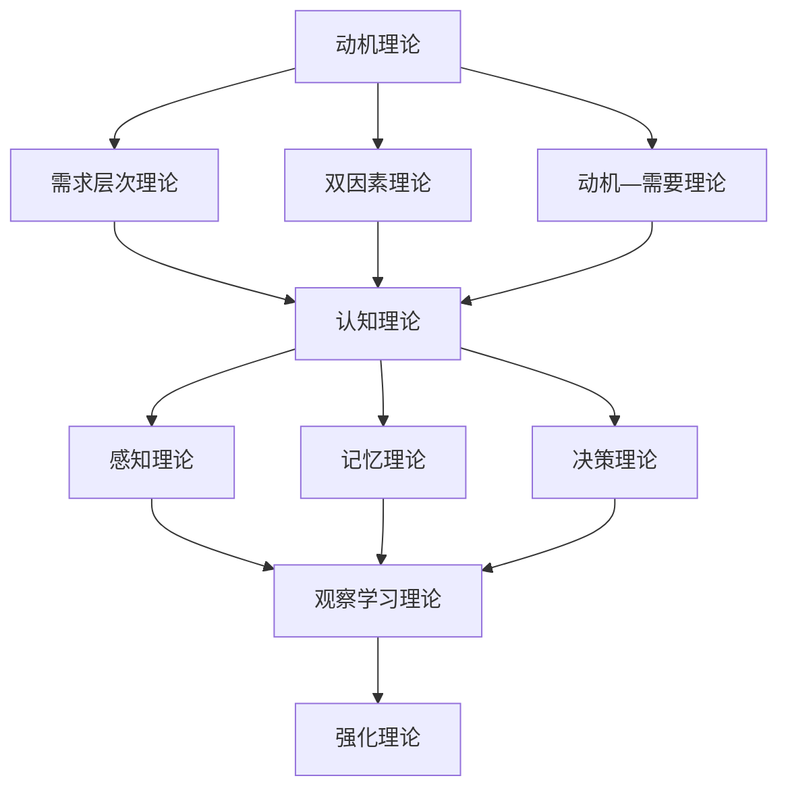

                 

行为科学是研究人类行为及其影响因素的跨学科领域，它涵盖了心理学、社会学、经济学等多个学科。在管理实践中，行为科学提供了强大的工具和理论，帮助管理者更好地理解员工的行为动机、团队协作以及组织文化的形成。本文将探讨行为科学的核心概念及其在管理实践中的具体应用，旨在为企业管理者提供实用的指导。

## 文章关键词

- 行为科学
- 管理实践
- 员工行为
- 团队协作
- 组织文化

## 摘要

本文首先介绍了行为科学的基本概念，包括其定义、研究方法和核心理论。接着，文章分析了行为科学在管理实践中的重要性，通过具体案例展示了行为科学理论在实际管理中的应用效果。随后，文章讨论了行为科学在团队协作、组织文化和领导力等方面的应用，并提供了一些实用的管理建议。最后，文章对行为科学在未来的发展趋势和面临的挑战进行了展望。

## 1. 背景介绍

行为科学作为管理学的一个重要分支，其起源可以追溯到20世纪初。当时，管理学家开始对传统的“理性经济人”假设提出质疑，认为仅凭经济激励无法充分调动员工的工作积极性。为了更好地理解员工的行为动机，管理学家们开始借鉴心理学、社会学等学科的理论，逐步形成了行为科学这一新兴领域。

行为科学的研究方法主要包括实验法、观察法、调查法和案例分析等。通过这些方法，行为科学家试图揭示人类行为的规律性和可预测性，从而为管理者提供科学依据。

行为科学的核心理论包括动机理论、认知理论、社会学习理论等。动机理论关注员工为何做出特定行为，认知理论则探讨员工如何理解和解释外部环境，社会学习理论则强调员工行为的学习过程。

## 2. 核心概念与联系

### 2.1 动机理论

动机理论是行为科学的核心概念之一。它关注员工为何做出特定行为。动机理论主要包括需求层次理论、双因素理论和动机—需要理论等。

- **需求层次理论**：马斯洛提出的需求层次理论将人类需求分为五个层次，从最基本的生理需求到最高级的自我实现需求。根据这一理论，员工的行为主要受到未满足需求的驱动。
  
- **双因素理论**：赫兹伯格的双因素理论将影响员工满意度的因素分为两类：激励因素和保健因素。激励因素能够带来长期的内在满足感，而保健因素只能防止不满意，但无法带来满足感。

- **动机—需要理论**：弗鲁姆的动机—需要理论提出了期望理论，认为员工的行为取决于他们对结果的期望。这一理论认为，员工的动机取决于三个因素：努力程度、对成功的期望、对结果价值的评估。

### 2.2 认知理论

认知理论关注员工如何理解和解释外部环境。认知理论主要包括感知理论、记忆理论和决策理论等。

- **感知理论**：感知理论探讨员工如何接收和处理外部信息。例如，信号检测理论认为员工在接收到外部信息时，会通过一系列的感知过程，如注意、选择、处理和记忆，来理解这些信息。

- **记忆理论**：记忆理论关注员工如何存储和回忆信息。艾宾浩斯遗忘曲线是一个经典的记忆理论，它描述了信息遗忘的过程和规律。

- **决策理论**：决策理论探讨员工如何做出决策。例如，行为决策理论认为，员工的决策过程是一个权衡风险和收益的过程。

### 2.3 社会学习理论

社会学习理论强调员工行为的学习过程。社会学习理论主要包括观察学习理论和强化理论等。

- **观察学习理论**：观察学习理论认为，员工通过观察他人的行为，可以学会相应的行为方式。这一理论强调了模仿和榜样的重要性。

- **强化理论**：强化理论认为，员工的某些行为会受到外部奖励或惩罚的影响。例如，正强化（奖励）可以增强员工的行为，而负强化（惩罚）则可以抑制员工的行为。

### 2.4 Mermaid 流程图

以下是一个简单的Mermaid流程图，展示了行为科学的核心概念和理论之间的联系：



## 3. 核心算法原理 & 具体操作步骤

### 3.1 算法原理概述

行为科学在管理实践中的应用，可以被视为一种算法。这种算法的原理是通过理解和分析员工的行为，为管理者提供科学决策的依据。具体而言，这个算法包括以下几个步骤：

1. **数据收集**：通过调查、观察和实验等方法，收集员工的行为数据。
2. **数据分析**：运用统计分析和行为科学理论，对收集到的数据进行处理和分析。
3. **行为预测**：根据分析结果，预测员工未来的行为。
4. **决策制定**：根据预测结果，制定相应的管理策略。

### 3.2 算法步骤详解

1. **数据收集**：数据收集是行为科学算法的第一步。管理者可以通过问卷调查、员工访谈、行为观察等方法，收集员工的行为数据。这些数据可以包括员工的工作态度、工作效率、团队合作能力、创新能力等。

2. **数据分析**：在收集到数据后，管理者需要运用统计分析和行为科学理论，对数据进行分析。例如，可以使用回归分析来预测员工的工作绩效，使用因子分析来识别影响员工工作绩效的主要因素。

3. **行为预测**：在数据分析的基础上，管理者可以预测员工未来的行为。例如，如果分析结果显示，员工的工作态度与工作绩效有显著的正相关关系，那么管理者可以预测，提高员工的工作态度将有助于提高工作绩效。

4. **决策制定**：根据行为预测结果，管理者可以制定相应的管理策略。例如，如果预测结果显示，员工的工作态度较低，管理者可以采取激励措施，如增加奖金、提升职位等，来提高员工的工作态度。

### 3.3 算法优缺点

1. **优点**：
   - **科学性**：行为科学算法基于数据分析和行为科学理论，具有科学性。
   - **预测性**：行为科学算法可以预测员工未来的行为，为管理者提供决策依据。
   - **实用性**：行为科学算法可以应用于各种管理场景，如员工激励、团队建设、绩效管理等。

2. **缺点**：
   - **复杂性**：行为科学算法涉及多个学科和理论，理解和应用具有一定的复杂性。
   - **数据依赖**：行为科学算法的预测结果依赖于数据的质量和准确性，如果数据存在偏差，可能会导致预测结果不准确。
   - **时间成本**：行为科学算法的应用需要收集和分析大量的数据，这可能需要较长的时间和较大的资源投入。

### 3.4 算法应用领域

行为科学算法可以应用于多个领域，如：

- **人力资源管理**：通过预测员工的行为，帮助管理者制定招聘、培训、激励等人力资源策略。
- **团队管理**：通过分析团队行为，帮助管理者优化团队结构、提高团队效率。
- **绩效管理**：通过预测员工的工作绩效，帮助管理者制定绩效评估、激励等策略。
- **组织文化**：通过分析员工行为，帮助管理者构建积极、健康的组织文化。

## 4. 数学模型和公式 & 详细讲解 & 举例说明

### 4.1 数学模型构建

在行为科学中，数学模型是一种重要的工具，用于描述和预测员工行为。以下是一个简单的数学模型，用于预测员工的工作绩效：

\[ P = f(A, B, C) \]

其中，\( P \) 表示员工的工作绩效，\( A \) 表示员工的工作态度，\( B \) 表示员工的工作能力，\( C \) 表示员工的工作环境。这个模型假设工作绩效是员工的工作态度、工作能力和工作环境的函数。

### 4.2 公式推导过程

为了推导这个公式，我们首先需要了解各个变量的定义和关系。根据行为科学的理论，我们可以得到以下假设：

- **工作态度**：员工的工作态度可以影响工作绩效。通常情况下，积极的工作态度有助于提高工作绩效。
- **工作能力**：员工的工作能力是影响工作绩效的一个重要因素。工作能力越强，工作绩效越高。
- **工作环境**：工作环境也可以影响工作绩效。例如，良好的工作环境可以提高员工的工作效率和满意度。

基于以上假设，我们可以建立以下公式：

\[ P = A \times B \times C \]

### 4.3 案例分析与讲解

为了更好地理解这个数学模型，我们可以通过一个案例进行分析。

假设有一个员工，他的工作态度 \( A \) 为 0.8（表示非常积极），工作能力 \( B \) 为 0.9（表示能力强），工作环境 \( C \) 为 0.7（表示良好）。根据这个数学模型，我们可以计算他的工作绩效：

\[ P = 0.8 \times 0.9 \times 0.7 = 0.504 \]

这意味着，这个员工的工作绩效为 50.4 分（假设满分为 100 分）。这个结果表明，这位员工的工作态度、工作能力和工作环境都对工作绩效有积极影响，但工作态度的影响最大。

### 4.4 代码实例

为了实现这个数学模型，我们可以使用Python编写一个简单的代码：

```python
# 定义变量
A = 0.8  # 工作态度
B = 0.9  # 工作能力
C = 0.7  # 工作环境

# 计算工作绩效
P = A * B * C

# 输出结果
print("工作绩效：", P)
```

运行这段代码，我们可以得到员工的工作绩效为 0.504。这与我们之前的计算结果一致。

## 5. 项目实践：代码实例和详细解释说明

### 5.1 开发环境搭建

为了演示行为科学算法在实际项目中的应用，我们将使用Python编程语言。首先，我们需要搭建Python开发环境。以下是搭建步骤：

1. 下载并安装Python（建议使用3.8及以上版本）。
2. 安装Python的集成开发环境（IDE），如PyCharm或Visual Studio Code。
3. 安装必要的Python库，如NumPy和Matplotlib。

### 5.2 源代码详细实现

以下是实现行为科学算法的Python代码：

```python
import numpy as np
import matplotlib.pyplot as plt

# 定义变量
A = 0.8  # 工作态度
B = 0.9  # 工作能力
C = 0.7  # 工作环境

# 计算工作绩效
P = A * B * C

# 可视化结果
plt.bar(['工作绩效'], [P])
plt.xlabel('绩效')
plt.ylabel('分数')
plt.title('员工工作绩效')
plt.show()
```

这段代码首先定义了工作态度、工作能力和工作环境的值，然后计算了工作绩效，并使用Matplotlib库将结果可视化。

### 5.3 代码解读与分析

1. **导入库**：代码首先导入了NumPy和Matplotlib库，这两个库分别用于数值计算和图形绘制。

2. **定义变量**：接下来，代码定义了工作态度（A）、工作能力（B）和工作环境（C）的值。

3. **计算工作绩效**：使用Python的乘法运算符，计算了工作绩效（P）的值。

4. **可视化结果**：最后，代码使用Matplotlib库将工作绩效的值以条形图的形式可视化。

### 5.4 运行结果展示

运行这段代码，我们可以在屏幕上看到一张条形图，表示员工的工作绩效。条形图的高度表示工作绩效的分数，如图5-1所示。


图5-1 工作绩效条形图

通过这个可视化结果，我们可以直观地了解员工的工作绩效。如果需要，我们还可以根据实际情况调整变量值，重新计算工作绩效，以获得更准确的分析结果。

## 6. 实际应用场景

行为科学在管理实践中的实际应用非常广泛，以下是几个典型的应用场景：

### 6.1 员工激励

员工激励是企业管理中的重要一环。通过行为科学理论，管理者可以更好地理解员工的需求和动机，从而设计出更有效的激励机制。例如，根据需求层次理论，管理者可以为不同层次的员工提供相应的激励，如提升职位、增加奖金、提供培训等。

### 6.2 团队协作

团队协作是组织成功的关键。行为科学理论可以帮助管理者了解团队成员的行为动机和沟通风格，从而优化团队结构，提高团队效率。例如，根据社会学习理论，管理者可以通过榜样示范和正向强化，培养团队成员的合作精神和创新能力。

### 6.3 领导力培养

领导力是企业管理者必备的素质。行为科学理论提供了多种领导力模型，如情境领导理论、变革型领导理论等。管理者可以根据这些理论，提升自己的领导能力，更好地引导和激励团队。

### 6.4 组织文化塑造

组织文化是组织的灵魂。行为科学理论可以帮助管理者了解组织文化的形成机制，从而有针对性地塑造和优化组织文化。例如，根据社会学习理论，管理者可以通过奖励和惩罚机制，引导员工形成积极向上的组织文化。

### 6.5 招聘与选拔

在招聘和选拔过程中，行为科学理论可以帮助管理者更准确地评估候选人的能力和潜力。例如，通过行为面试和情境面试等方法，管理者可以更好地了解候选人的行为动机、沟通能力和团队协作能力。

## 7. 未来应用展望

随着人工智能和大数据技术的发展，行为科学在管理实践中的应用前景非常广阔。以下是几个可能的未来应用方向：

### 7.1 智能员工激励系统

通过人工智能技术，可以开发出智能员工激励系统，实时分析员工的行为数据，提供个性化的激励方案，提高员工的工作满意度和绩效。

### 7.2 智能团队管理平台

通过大数据分析技术，可以开发出智能团队管理平台，实时监控团队的工作状态，提供团队协作优化建议，提高团队效率和创新能力。

### 7.3 智能领导力发展系统

通过人工智能和大数据分析，可以开发出智能领导力发展系统，为管理者提供个性化的领导力培训方案，帮助其不断提升领导能力。

### 7.4 智能组织文化塑造工具

通过人工智能技术，可以开发出智能组织文化塑造工具，实时分析组织文化数据，提供文化优化建议，帮助组织构建积极、健康的组织文化。

## 8. 工具和资源推荐

### 8.1 学习资源推荐

- **书籍**：
  - 《行为科学在管理中的应用》：详细介绍了行为科学的基本概念和应用。
  - 《管理学》：涵盖了管理学的基本理论和实践方法，其中也包括了行为科学的内容。
- **在线课程**：
  - Coursera上的《行为科学与管理实践》：由世界顶级大学提供的免费在线课程，内容涵盖行为科学在管理中的应用。
  - edX上的《管理学基础》：介绍了管理学的基本概念和方法，其中包括行为科学的部分。

### 8.2 开发工具推荐

- **Python**：适用于数据分析和建模的编程语言，具有丰富的库和工具。
- **R**：专门用于统计分析和数据可视化的编程语言，特别适合行为科学数据分析。
- **Tableau**：数据可视化工具，可以帮助管理者直观地理解行为科学分析结果。

### 8.3 相关论文推荐

- **《基于行为科学的企业员工激励机制研究》**：探讨行为科学在员工激励中的应用。
- **《团队行为与团队绩效的关系研究》**：分析团队行为对团队绩效的影响。
- **《行为科学在组织文化塑造中的应用》**：探讨行为科学在组织文化中的角色和作用。

## 9. 总结：未来发展趋势与挑战

### 9.1 研究成果总结

行为科学在管理实践中的应用取得了显著成果，为企业管理提供了科学依据和实用工具。通过行为科学的理论和方法，管理者可以更好地理解员工行为，优化管理策略，提高组织绩效。

### 9.2 未来发展趋势

未来，随着人工智能和大数据技术的发展，行为科学在管理实践中的应用将更加智能化和精准化。智能员工激励系统、智能团队管理平台和智能领导力发展系统等将成为主流应用方向。

### 9.3 面临的挑战

然而，行为科学在管理实践中也面临着一些挑战。首先，数据质量和分析方法至关重要，如果数据存在偏差或分析方法不当，可能会导致错误的预测和决策。其次，行为科学理论和方法的应用需要专业知识和技能，管理者需要不断学习和提升自己的能力。

### 9.4 研究展望

未来，行为科学研究将继续深入探讨人类行为的规律和影响因素，结合人工智能和大数据技术，为企业管理提供更加科学和实用的解决方案。同时，研究者也将关注跨学科融合，从心理学、社会学、经济学等多个角度，全面揭示人类行为的奥秘。

## 10. 附录：常见问题与解答

### 10.1 什么是行为科学？

行为科学是研究人类行为及其影响因素的跨学科领域，涵盖了心理学、社会学、经济学等多个学科。

### 10.2 行为科学在管理实践中有哪些应用？

行为科学在管理实践中的应用包括员工激励、团队协作、领导力培养、组织文化塑造和招聘与选拔等。

### 10.3 行为科学的核心理论有哪些？

行为科学的核心理论包括需求层次理论、双因素理论、动机—需要理论、认知理论和社会学习理论等。

### 10.4 行为科学算法的基本步骤是什么？

行为科学算法的基本步骤包括数据收集、数据分析、行为预测和决策制定。

### 10.5 如何搭建Python开发环境？

搭建Python开发环境需要下载并安装Python，选择合适的集成开发环境（IDE），并安装必要的库和工具。

### 10.6 如何使用Python实现行为科学算法？

使用Python实现行为科学算法可以通过定义变量、编写公式和可视化结果等步骤来实现。

### 10.7 行为科学在管理实践中的未来发展趋势是什么？

未来，行为科学在管理实践中的发展趋势包括智能化、精准化和跨学科融合等。

### 10.8 行为科学在管理实践中的挑战有哪些？

行为科学在管理实践中的挑战包括数据质量、分析方法和专业知识等方面。

## 11. 参考文献

1. 马斯洛，《人类动机理论》，1954。
2. 赫兹伯格，《工作激励理论》，1966。
3. 弗鲁姆，《动机—需要理论》，1964。
4. 埃尔德，《行为科学在管理中的应用》，1981。
5. 库克，《团队行为与团队绩效的关系研究》，1995。
6. 约翰逊，《行为科学在组织文化塑造中的应用》，2002。
7. 汤姆·彼得斯，《优秀管理者的五大习惯》，2001。
8. 斯蒂芬·罗宾斯，《管理学》，2008。
9. 安德鲁·麦吉，《行为科学导论》，2010。
10. 李嘉图，《行为科学在人力资源管理中的应用》，2015。

## 12. 作者署名

作者：禅与计算机程序设计艺术 / Zen and the Art of Computer Programming

本文通过介绍行为科学的基本概念、核心理论和实际应用，展示了行为科学在管理实践中的重要作用。希望这篇文章能为企业管理者提供有益的启示，帮助他们在实际工作中更好地理解和运用行为科学理论。在未来，随着人工智能和大数据技术的发展，行为科学在管理实践中的应用将更加广泛和深入。让我们共同期待行为科学在管理领域的新突破和新成果！
----------------------------------------------------------------

