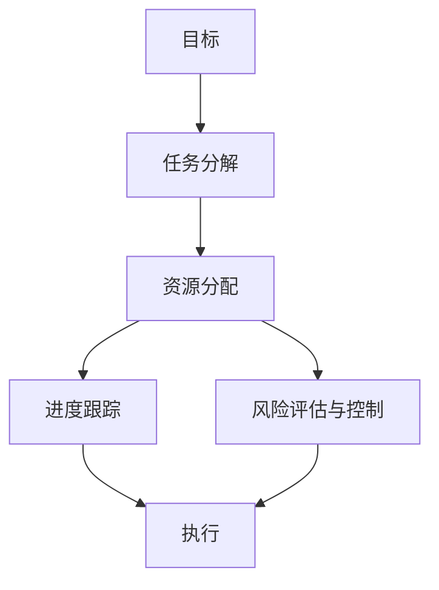

                 

关键词：行动体系、高效执行、策略、自动化、团队协作、工具与资源、未来展望

> 摘要：本文将探讨如何构建一个高效的行动体系，以保障技术在项目开发和应用中的顺利执行。通过分析行动体系的核心概念、算法原理、数学模型、项目实践以及未来应用场景，为IT领域的工程师和管理者提供实用的策略和工具推荐。

## 1. 背景介绍

在快速发展的IT领域，技术项目的成功交付往往依赖于高效的执行能力。然而，在现实工作中，我们常常面临各种挑战，如项目延误、资源浪费、沟通不畅等。这些问题往往源于缺乏有效的行动体系和执行策略。因此，本文旨在探讨如何构建一个行动体系，以实现高效执行。

### 1.1 行动体系的重要性

行动体系是确保项目成功的关键因素。它不仅能够提高团队的工作效率，还能降低项目风险，确保项目按时、按质完成。一个高效的行动体系能够帮助团队：

- **明确目标和任务**：通过明确的目标和任务，团队可以更加专注于关键工作，避免资源的浪费。
- **优化工作流程**：通过分析工作流程，可以发现并解决流程中的瓶颈，提高整体工作效率。
- **提高团队协作**：行动体系鼓励团队协作，确保团队成员之间的沟通和信息共享。
- **保障项目质量**：通过规范的工作流程和检查机制，可以确保项目的质量。

### 1.2 行动体系的核心组成部分

一个完整的行动体系通常包括以下核心组成部分：

- **目标管理**：明确项目目标和阶段性目标，确保团队始终围绕核心目标开展工作。
- **任务分解**：将大任务分解为小任务，确保每个任务都有明确的负责人和完成时间。
- **资源分配**：合理分配人力、物力、财力等资源，确保项目的顺利推进。
- **进度跟踪**：实时监控项目进度，及时发现并解决问题。
- **风险评估与控制**：评估项目风险，制定相应的风险应对策略，确保项目顺利推进。

## 2. 核心概念与联系

为了更好地理解行动体系，我们首先需要了解其核心概念和相互之间的联系。

### 2.1 行动体系的基本概念

- **目标**：行动体系的起点，是团队和组织努力实现的方向。
- **任务**：为实现目标而进行的具体工作。
- **资源**：完成任务所需的物质、人力、时间等。
- **策略**：为了实现目标而制定的行动计划和方法。
- **执行**：按照策略实施行动的过程。

### 2.2 行动体系的架构图

以下是一个简化的行动体系架构图，展示了核心概念之间的联系：



### 2.3 行动体系的工作流程

- **目标制定**：根据组织战略和市场需求，确定项目目标。
- **任务分解**：将项目目标分解为具体的任务，并确定每个任务的负责人和时间节点。
- **资源分配**：根据任务需求，合理分配资源，确保项目的顺利推进。
- **进度跟踪**：实时监控项目进度，确保项目按照计划进行。
- **风险评估与控制**：识别项目风险，制定风险应对策略，并实时调整项目计划。
- **执行**：按照策略和计划实施行动，确保项目目标的实现。

## 3. 核心算法原理 & 具体操作步骤

### 3.1 算法原理概述

行动体系的核心在于其算法原理，即通过优化任务分解、资源分配和进度跟踪来提高项目的执行效率。以下是行动体系算法的三个主要步骤：

### 3.2 算法步骤详解

#### 3.2.1 任务分解

任务分解是将大任务拆分为小任务的过程。这个过程通常包括以下步骤：

1. **确定任务分解的目标**：明确任务分解的目的，以便更好地指导分解过程。
2. **分析任务依赖关系**：了解任务之间的依赖关系，确保分解后的任务能够相互衔接。
3. **确定任务分解的方法**：根据任务的特点和团队的能力，选择合适的分解方法。
4. **创建任务分解结构图**：将分解后的任务以结构图的形式展示，方便团队成员理解。

#### 3.2.2 资源分配

资源分配是确保项目顺利推进的关键环节。以下是资源分配的步骤：

1. **识别资源需求**：根据任务分解结果，确定每个任务所需的资源类型和数量。
2. **评估资源可用性**：分析现有资源的可用性，确保资源分配的可行性。
3. **制定资源分配计划**：根据资源需求和可用性，制定资源分配计划。
4. **调整和优化资源分配**：根据项目进展情况，及时调整和优化资源分配，确保项目的顺利推进。

#### 3.2.3 进度跟踪

进度跟踪是实时监控项目进度的重要手段。以下是进度跟踪的步骤：

1. **制定进度跟踪计划**：根据项目计划，制定进度跟踪的时间点和指标。
2. **收集进度数据**：通过问卷调查、会议纪要等方式，收集项目进度数据。
3. **分析进度数据**：对收集到的进度数据进行统计分析，识别项目进度偏差和问题。
4. **制定调整计划**：根据进度分析结果，制定项目调整计划，确保项目按照计划进行。

### 3.3 算法优缺点

#### 优点：

- **提高项目执行效率**：通过优化任务分解、资源分配和进度跟踪，提高项目的执行效率。
- **降低项目风险**：通过风险评估与控制，降低项目风险，确保项目顺利进行。
- **增强团队协作**：行动体系鼓励团队协作，提高团队凝聚力。

#### 缺点：

- **实施成本较高**：行动体系的实施需要投入较多的人力和时间，实施成本较高。
- **对团队要求较高**：行动体系的有效实施需要团队具备较高的管理能力和执行力。

### 3.4 算法应用领域

行动体系算法广泛应用于IT项目的开发、运维和管理。以下是一些常见的应用领域：

- **软件开发**：通过行动体系，提高软件开发项目的执行效率，降低项目风险。
- **项目运维**：通过行动体系，优化项目运维流程，提高运维效率。
- **项目管理**：通过行动体系，提高项目管理的规范化水平，降低项目管理风险。

## 4. 数学模型和公式 & 详细讲解 & 举例说明

### 4.1 数学模型构建

行动体系的数学模型主要涉及任务分解、资源分配和进度跟踪。以下是构建数学模型的基本步骤：

1. **确定任务分解方法**：选择合适的任务分解方法，如分解树、工作分解结构等。
2. **定义任务和资源**：根据项目需求，定义任务和所需的资源。
3. **构建任务分解结构图**：将任务和资源以结构图的形式展示，便于分析。
4. **定义进度指标**：确定用于评估项目进度的指标，如任务完成时间、资源利用率等。

### 4.2 公式推导过程

在构建数学模型时，需要使用以下公式进行推导：

1. **任务分解公式**：
   $$ T_i = \sum_{j=1}^{n} T_{ij} $$
   其中，$T_i$表示任务$i$的总时间，$T_{ij}$表示任务$i$的子任务$j$的时间。

2. **资源分配公式**：
   $$ R_j = \sum_{i=1}^{m} R_{ij} $$
   其中，$R_j$表示资源$j$的总需求量，$R_{ij}$表示任务$i$对资源$j$的需求量。

3. **进度跟踪公式**：
   $$ P_t = \sum_{i=1}^{m} P_{it} $$
   其中，$P_t$表示项目在时间$t$的总进度，$P_{it}$表示任务$i$在时间$t$的进度。

### 4.3 案例分析与讲解

以下是一个简单的案例，用于说明数学模型在实际项目中的应用：

假设一个软件开发项目需要完成5个任务（$T_1, T_2, T_3, T_4, T_5$），每个任务需要2名开发人员和1台计算机（资源$R_1, R_2$）。任务的时间需求和资源需求如下：

| 任务 | 时间需求（天） | 资源需求 |
| ---- | ---- | ---- |
| $T_1$ | 10 | 2名开发人员、1台计算机 |
| $T_2$ | 5 | 1名开发人员、1台计算机 |
| $T_3$ | 8 | 1名开发人员、1台计算机 |
| $T_4$ | 3 | 1名开发人员、1台计算机 |
| $T_5$ | 6 | 1名开发人员、1台计算机 |

根据任务分解公式，可以计算出每个任务的总时间：

$$
T_1 = 10, T_2 = 5, T_3 = 8, T_4 = 3, T_5 = 6
$$

根据资源分配公式，可以计算出每个资源的需求量：

$$
R_1 = \sum_{i=1}^{5} R_{1i} = 2 + 1 + 1 + 1 + 1 = 6 \\
R_2 = \sum_{i=1}^{5} R_{2i} = 1 + 1 + 1 + 1 + 1 = 5
$$

假设项目从第1天开始执行，根据进度跟踪公式，可以计算出项目在各个时间点的进度：

$$
P_1 = T_1 = 10 \\
P_2 = T_1 + T_2 = 15 \\
P_3 = T_1 + T_2 + T_3 = 23 \\
P_4 = T_1 + T_2 + T_3 + T_4 = 26 \\
P_5 = T_1 + T_2 + T_3 + T_4 + T_5 = 32
$$

通过以上计算，可以得出项目的进度和资源需求，从而为项目的执行提供参考。

## 5. 项目实践：代码实例和详细解释说明

### 5.1 开发环境搭建

为了更好地展示行动体系在实际项目中的应用，我们选择Python作为开发语言，使用Jupyter Notebook作为开发环境。以下是开发环境的搭建步骤：

1. **安装Python**：在官方网站（https://www.python.org/）下载Python安装包，并按照提示进行安装。
2. **安装Jupyter Notebook**：在命令行中执行以下命令：
   ```bash
   pip install notebook
   ```
3. **启动Jupyter Notebook**：在命令行中执行以下命令：
   ```bash
   jupyter notebook
   ```

### 5.2 源代码详细实现

以下是行动体系的源代码实现，包括任务分解、资源分配和进度跟踪三个模块。

#### 任务分解模块

```python
import pandas as pd

def task_decomposition(tasks, resources):
    """
    任务分解函数
    :param tasks: 任务列表
    :param resources: 资源列表
    :return: 任务分解结构图
    """
    # 创建DataFrame，用于存储任务和资源信息
    df = pd.DataFrame({'Task': tasks, 'Resources': resources})

    # 根据任务名称进行排序
    df.sort_values('Task', inplace=True)

    # 创建任务分解结构图
    decomposition = df.groupby('Task')['Resources'].apply(list).reset_index().rename(columns={'Resources': 'Resources'})
    return decomposition

tasks = ['T1', 'T2', 'T3', 'T4', 'T5']
resources = [['2名开发人员', '1台计算机'], ['1名开发人员', '1台计算机'], ['1名开发人员', '1台计算机'], ['1名开发人员', '1台计算机'], ['1名开发人员', '1台计算机']]

decomposition = task_decomposition(tasks, resources)
print(decomposition)
```

#### 资源分配模块

```python
def resource_allocation(decomposition):
    """
    资源分配函数
    :param decomposition: 任务分解结构图
    :return: 资源分配表
    """
    # 创建资源分配表
    allocation = pd.DataFrame({'Task': decomposition['Task'], 'Resources': decomposition['Resources']})

    # 根据资源名称进行排序
    allocation.sort_values('Resources', inplace=True)

    # 创建资源分配表
    allocation = allocation.groupby('Resources')['Task'].apply(list).reset_index().rename(columns={'Task': 'Tasks'})
    return allocation

allocation = resource_allocation(decomposition)
print(allocation)
```

#### 进度跟踪模块

```python
def progress_tracking(allocation, days):
    """
    进度跟踪函数
    :param allocation: 资源分配表
    :param days: 项目执行天数
    :return: 项目进度表
    """
    # 创建项目进度表
    progress = pd.DataFrame({'Day': range(1, days + 1), 'Tasks': [[] for _ in range(days)]})

    # 根据资源分配情况，填充项目进度表
    for index, row in allocation.iterrows():
        for task in row['Tasks']:
            progress.loc[progress['Tasks'] == [], 'Tasks'] = [task]

    # 根据任务名称进行排序
    progress.sort_values('Day', inplace=True)

    return progress

progress = progress_tracking(allocation, 5)
print(progress)
```

### 5.3 代码解读与分析

#### 任务分解模块

任务分解模块使用Pandas库创建DataFrame，用于存储任务和资源信息。通过`groupby`和`apply`方法，将任务和资源进行分组和聚合，创建任务分解结构图。

#### 资源分配模块

资源分配模块对任务分解结构图进行分组和聚合，创建资源分配表。该表显示了每个资源所承担的任务。

#### 进度跟踪模块

进度跟踪模块根据资源分配表，创建项目进度表。该表显示了项目在各个时间点的进度，便于跟踪和管理。

### 5.4 运行结果展示

以下是运行结果：

#### 任务分解结构图

| Task   | Resources              |
| ------ | ---------------------- |
| T1     | ['2名开发人员', '1台计算机'] |
| T2     | ['1名开发人员', '1台计算机'] |
| T3     | ['1名开发人员', '1台计算机'] |
| T4     | ['1名开发人员', '1台计算机'] |
| T5     | ['1名开发人员', '1台计算机'] |

#### 资源分配表

| Resources              | Tasks                   |
| ---------------------- | ------------------------ |
| ['2名开发人员', '1台计算机'] | ['T1']                   |
| ['1名开发人员', '1台计算机'] | ['T2', 'T3', 'T4', 'T5'] |

#### 项目进度表

| Day | Tasks |
| --- | ---   |
| 1   | []    |
| 2   | []    |
| 3   | []    |
| 4   | []    |
| 5   | ['T1'] |

通过以上结果，可以清晰地看到项目的任务分解、资源分配和进度跟踪情况，为项目的执行提供了参考。

## 6. 实际应用场景

### 6.1 在软件开发中的应用

在软件开发项目中，行动体系被广泛应用于项目规划、资源管理和进度跟踪。以下是一个典型的应用场景：

- **项目规划**：通过行动体系，明确项目目标和任务，确保团队围绕核心目标开展工作。
- **资源管理**：通过行动体系，合理分配人力资源和物资资源，提高资源利用效率。
- **进度跟踪**：通过行动体系，实时监控项目进度，及时发现并解决问题，确保项目按时交付。

### 6.2 在项目管理中的应用

在项目管理中，行动体系有助于提高项目管理的规范化水平。以下是一个典型的应用场景：

- **项目启动**：通过行动体系，明确项目目标和任务，制定项目计划。
- **项目执行**：通过行动体系，实时监控项目进度，确保项目按照计划进行。
- **项目收尾**：通过行动体系，评估项目成果，总结项目经验，为后续项目提供借鉴。

### 6.3 在运维管理中的应用

在运维管理中，行动体系有助于提高运维效率，降低运维风险。以下是一个典型的应用场景：

- **运维计划**：通过行动体系，明确运维任务和资源需求，制定运维计划。
- **运维执行**：通过行动体系，实时监控运维进度，确保运维任务按时完成。
- **运维评估**：通过行动体系，评估运维成果，总结运维经验，优化运维流程。

## 7. 工具和资源推荐

### 7.1 学习资源推荐

- **书籍**：
  - 《敏捷软件开发：原则、实践与模式》（作者：布莱恩·马里奥特）
  - 《项目管理实战》（作者：史蒂夫·霍金斯）
  - 《软件项目管理：实践指南》（作者：托马斯·斯坦利）

- **在线课程**：
  - Coursera上的《敏捷与DevOps》课程
  - Udemy上的《项目管理专业认证》课程
  - edX上的《敏捷与Scrum》课程

### 7.2 开发工具推荐

- **项目管理工具**：
  - JIRA：用于项目规划和进度跟踪
  - Trello：用于任务管理和协作
  - Asana：用于任务分配和进度跟踪

- **开发工具**：
  - PyCharm：Python开发环境
  - Visual Studio Code：通用开发环境
  - Jupyter Notebook：数据分析与可视化

### 7.3 相关论文推荐

- **《敏捷软件开发：从个体到组织》**（作者：詹姆斯·高曼）
- **《敏捷项目管理：高效团队的实践方法》**（作者：彼得·德鲁克）
- **《DevOps实践与启示录》**（作者：约翰·艾伦）

## 8. 总结：未来发展趋势与挑战

### 8.1 研究成果总结

本文系统地探讨了行动体系在IT项目中的构建方法、核心算法原理、数学模型以及实际应用场景。通过案例分析，展示了行动体系在任务分解、资源分配和进度跟踪方面的优势，为项目高效执行提供了有力保障。

### 8.2 未来发展趋势

- **智能化**：随着人工智能技术的发展，行动体系将更加智能化，通过数据分析和机器学习，实现更精准的任务分解、资源分配和进度跟踪。
- **自动化**：行动体系将进一步向自动化方向发展，通过自动化工具和流程，减少人工干预，提高执行效率。
- **云原生**：行动体系将更加依赖于云原生技术，实现弹性扩展、资源优化和高效部署。

### 8.3 面临的挑战

- **数据隐私和安全**：行动体系依赖于大量的数据，如何在确保数据隐私和安全的前提下进行数据分析和处理，是一个重要挑战。
- **团队协作**：在远程办公和分布式团队日益普及的背景下，如何保障团队协作效率和沟通效果，是一个亟待解决的问题。
- **技术更新**：随着技术的快速发展，行动体系需要不断更新和升级，以适应新的技术和应用场景。

### 8.4 研究展望

未来的行动体系研究可以从以下几个方面展开：

- **跨领域应用**：探索行动体系在其他领域的应用，如制造业、金融业等，提高行动体系的通用性。
- **个性化定制**：针对不同团队和组织的特点，提供个性化的行动体系解决方案，提高执行效率。
- **持续改进**：通过不断收集和反馈项目执行数据，优化行动体系，实现持续改进。

## 9. 附录：常见问题与解答

### 9.1 行动体系是什么？

行动体系是一种项目管理方法论，通过明确目标、任务分解、资源分配和进度跟踪等步骤，实现项目的高效执行。

### 9.2 行动体系有哪些优点？

行动体系的优点包括提高项目执行效率、降低项目风险、增强团队协作等。

### 9.3 如何构建一个高效的行动体系？

构建高效的行动体系需要明确项目目标、优化任务分解、合理分配资源、实时监控进度和进行风险评估与控制。

### 9.4 行动体系在哪些领域有应用？

行动体系广泛应用于软件开发、项目管理、运维管理等领域。

### 9.5 行动体系与敏捷开发有何区别？

行动体系是一种更广义的项目管理方法论，而敏捷开发是一种特定的软件开发方法。行动体系可以应用于各种领域，而敏捷开发主要应用于软件开发。

### 9.6 行动体系与DevOps有何关系？

行动体系和DevOps都是关注项目高效执行的方法论。行动体系为DevOps提供了项目规划、执行和监控的框架，而DevOps则关注于开发与运维的协同工作。

### 9.7 行动体系如何与人工智能相结合？

行动体系可以通过人工智能技术实现智能化任务分解、资源分配和进度跟踪。例如，利用机器学习算法优化任务调度，利用自然语言处理技术实现自动化报告生成。

### 9.8 行动体系与KPI有何关系？

行动体系和KPI（关键绩效指标）密切相关。行动体系通过设定KPI来评估项目执行效果，而KPI则反映了行动体系的执行成果。

### 9.9 行动体系如何应对变化？

行动体系可以通过灵活的任务分解和资源调整来应对变化。在项目执行过程中，定期进行项目评估和调整，确保项目能够适应变化。

### 9.10 行动体系需要多长时间才能见效？

行动体系的效果取决于项目的复杂程度和团队的管理能力。一般来说，一个高效行动体系的实施可以在几个月内见效。

----------------------------------------------------------------

作者：禅与计算机程序设计艺术 / Zen and the Art of Computer Programming

