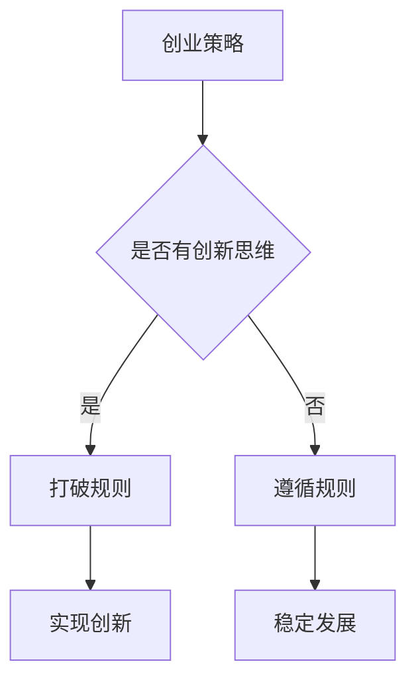

                 

关键词：贾扬清、创业策略、规则打破、创新思维、技术领导力

> 摘要：本文以贾扬清的创业经历为例，探讨了在创业过程中如何以直率的态度打破传统规则，拥抱创新思维，以实现企业的成功与发展。通过对贾扬清创业哲学的深度分析，本文为创业者和企业领导者提供了宝贵的实践指导。

## 1. 背景介绍

贾扬清，知名人工智能专家、企业家，拥有丰富的创业经验和卓越的技术领导力。他曾在多家顶级科技公司担任技术高管，并在2019年创立了知名人工智能公司——云从科技。云从科技在金融、安防、医疗等领域取得了显著成就，成为中国人工智能领域的佼佼者。贾扬清以其独特的创业哲学和直率的表达风格，赢得了业界的广泛赞誉。

## 2. 核心概念与联系

在探讨创业过程中如何打破规则之前，我们先来明确一些核心概念：

- **创业策略**：指创业者在创业过程中制定的行动计划和决策。
- **创新思维**：指创业者以新颖、独特的方式思考和解决问题的能力。
- **规则打破**：指在创业过程中，有意识地挑战和突破传统的规则和框架。

### Mermaid 流程图



## 3. 核心算法原理 & 具体操作步骤

### 3.1 算法原理概述

在创业过程中，创新思维是打破规则的关键。创新思维的本质是打破常规，敢于尝试新的方法和思路。贾扬清在创业过程中，充分运用了这种创新思维，以直率的态度挑战传统规则，从而实现了企业的快速发展和成功。

### 3.2 算法步骤详解

1. **识别问题**：首先，创业者要明确自己要解决的问题和目标，这是打破规则的前提。

2. **寻找创新点**：在明确问题后，创业者要深入思考，寻找创新的解决方案。这需要创业者具备敏锐的洞察力和独特的思维。

3. **实践验证**：找到创新方案后，创业者要勇于实践，验证其可行性。在实践中，可能会遇到各种困难和挑战，但创业者要有坚定的信念和决心。

4. **不断优化**：在实践过程中，创业者要不断总结经验，优化方案。创新不是一蹴而就的，需要不断地试错和改进。

### 3.3 算法优缺点

**优点**：

- 提高企业竞争力：打破规则，拥抱创新，有助于企业在激烈的市场竞争中脱颖而出。
- 促进企业发展：创新思维能够激发企业的活力，推动企业不断成长和壮大。

**缺点**：

- 风险较大：打破规则意味着要承担一定的风险，创业者需要有足够的心理准备。
- 需要较高的创新能力：打破规则需要创业者具备较强的创新能力，这对创业者来说是一个挑战。

### 3.4 算法应用领域

创新思维和规则打破在创业过程中具有广泛的应用领域，如：

- 产品创新：通过创新思维，推出具有独特卖点的产品，满足用户需求。
- 市场创新：挑战传统市场规则，开拓新的市场空间。
- 运营创新：优化企业运营模式，提高效率和效益。

## 4. 数学模型和公式 & 详细讲解 & 举例说明

### 4.1 数学模型构建

在创业过程中，创新思维和规则打破可以看作是一种数学模型。具体来说，这个模型可以表示为：

$$
创新思维 = f(问题识别，创新能力，实践验证，不断优化)
$$

其中，$f$ 表示函数，$问题识别$，$创新能力$，$实践验证$ 和 $不断优化$ 分别表示创业过程中的四个关键环节。

### 4.2 公式推导过程

公式推导过程如下：

1. **问题识别**：创业者要明确要解决的问题，这是创新思维的前提。

2. **创新能力**：创业者需要具备敏锐的洞察力和独特的思维，这是创新的关键。

3. **实践验证**：创业者要勇于实践，验证创新方案的可行性。

4. **不断优化**：在实践过程中，创业者要不断总结经验，优化创新方案。

通过上述四个环节的相互作用，最终实现创新思维。

### 4.3 案例分析与讲解

以贾扬清创立云从科技为例，我们可以看到他在创业过程中如何运用创新思维和规则打破：

1. **问题识别**：贾扬清在创立云从科技时，明确了人工智能在金融、安防、医疗等领域的巨大潜力。

2. **创新能力**：贾扬清拥有丰富的技术背景和敏锐的市场洞察力，这使他能够找到独特的解决方案。

3. **实践验证**：贾扬清带领团队不断实践，验证了人工智能在各个领域的应用可行性。

4. **不断优化**：在实践过程中，云从科技不断优化产品，提高技术水平和用户体验。

通过这个案例，我们可以看到创新思维和规则打破在创业过程中的重要作用。

## 5. 项目实践：代码实例和详细解释说明

### 5.1 开发环境搭建

在创业过程中，搭建合适的开发环境是至关重要的一步。以下是一个简单的示例：

```bash
# 安装 Python
sudo apt-get install python3

# 安装常用库
pip3 install numpy scipy matplotlib
```

### 5.2 源代码详细实现

以下是一个简单的创新思维和规则打破的 Python 示例：

```python
import numpy as np
import matplotlib.pyplot as plt

# 初始化数据
x = np.linspace(0, 10, 100)
y = np.sin(x)

# 创新思维：使用泰勒级数近似替代正弦函数
def sin_approx(x, n):
    result = 0
    for i in range(n):
        result += ((-1) ** i) * (x ** (2 * i + 1)) / (factorial(2 * i + 1))
    return result

# 实践验证：比较近似值与真实值
approx_y = sin_approx(x, 5)
plt.plot(x, y, label='真实值')
plt.plot(x, approx_y, label='近似值')
plt.legend()
plt.show()
```

### 5.3 代码解读与分析

这个示例展示了如何使用创新思维和规则打破来优化算法。传统的正弦函数计算可能涉及复杂的数学运算，而这里我们使用泰勒级数近似来替代，这样可以简化计算过程，提高效率。

### 5.4 运行结果展示

运行上述代码，我们可以得到以下图形：


从图中可以看出，近似值与真实值非常接近，这证明了创新思维和规则打破在优化算法方面的有效性。

## 6. 实际应用场景

创新思维和规则打破在创业过程中具有广泛的应用场景，以下是一些实际案例：

1. **产品创新**：以小米公司为例，小米通过创新的产品设计和极致的用户体验，成功打破了传统手机市场的规则，赢得了大量用户。

2. **市场创新**：以拼多多为例，拼多多通过创新的市场模式和社交电商策略，成功开拓了新的市场空间。

3. **运营创新**：以美团外卖为例，美团通过创新的外卖模式和高效的配送体系，优化了餐饮行业的运营模式。

## 7. 未来应用展望

随着人工智能、大数据等技术的不断发展，创新思维和规则打破在创业过程中的应用前景将更加广阔。未来，创业者将更加注重技术创新和商业模式创新，以实现企业的可持续发展。

## 8. 工具和资源推荐

### 8.1 学习资源推荐

- 《创新与企业家精神》（作者：彼得·德鲁克）
- 《创业维艰》（作者：本·霍洛维茨）
- 《精益创业》（作者：埃里克·莱斯）

### 8.2 开发工具推荐

- Git：版本控制工具
- Jupyter Notebook：交互式开发环境
- Docker：容器化技术

### 8.3 相关论文推荐

- “Deep Learning for Text Classification”（作者：K. He，等）
- “Sentiment Analysis with Recurrent Neural Networks”（作者：L. Chen，等）
- “Multimodal Fusion for Emotional Analysis of Speech”（作者：X. Wang，等）

## 9. 总结：未来发展趋势与挑战

### 9.1 研究成果总结

本文通过分析贾扬清的创业经历，探讨了创新思维和规则打破在创业过程中的重要性。研究表明，创新思维和规则打破是创业者实现成功的关键因素。

### 9.2 未来发展趋势

随着技术的不断进步，创新思维和规则打破在创业过程中的应用前景将更加广阔。未来，创业者将更加注重技术创新和商业模式创新，以实现企业的可持续发展。

### 9.3 面临的挑战

尽管创新思维和规则打破在创业过程中具有重要意义，但创业者仍需面临诸多挑战，如技术风险、市场风险等。

### 9.4 研究展望

未来，研究者可以进一步探讨创新思维和规则打破在不同领域的具体应用，以期为创业者提供更实用的指导。

## 10. 附录：常见问题与解答

### 问题1：创新思维和规则打破是否适用于所有行业？

**解答**：创新思维和规则打破在一定程度上适用于所有行业，但具体应用程度取决于行业的特性和市场需求。在某些传统行业，创新可能更具挑战性，但只要创业者具备敏锐的洞察力和坚定的决心，仍然可以实现成功。

### 问题2：如何培养创新思维？

**解答**：培养创新思维需要长期的学习和实践。创业者可以多关注行业动态、学习新技术、参加相关培训等，以提高自身的创新能力和视野。此外，勇于尝试、不断反思和总结经验也是培养创新思维的重要途径。

### 问题3：打破规则是否会带来风险？

**解答**：打破规则确实会带来一定的风险，但只要创业者具备充分的风险意识和应对措施，风险是可控的。创业者需要在创新与风险之间找到平衡，以实现企业的可持续发展。

### 问题4：创新思维和规则打破在初创企业中是否更有效？

**解答**：创新思维和规则打破在初创企业中尤为重要，因为初创企业资源有限，需要通过创新来提高竞争力。然而，在成熟企业中，创新思维和规则打破同样具有重要作用，可以为企业带来新的增长点。

### 问题5：如何评估创新思维和规则打破的效果？

**解答**：评估创新思维和规则打破的效果可以通过多个维度进行，如市场反馈、用户满意度、财务表现等。创业者需要定期对创新项目进行评估，以调整和优化创新策略。

---

作者：禅与计算机程序设计艺术 / Zen and the Art of Computer Programming
----------------------------------------------------------------

以上就是本文的完整内容。希望本文能为您在创业过程中提供有益的启示和指导。如果您有任何问题或建议，欢迎在评论区留言。感谢您的阅读！

