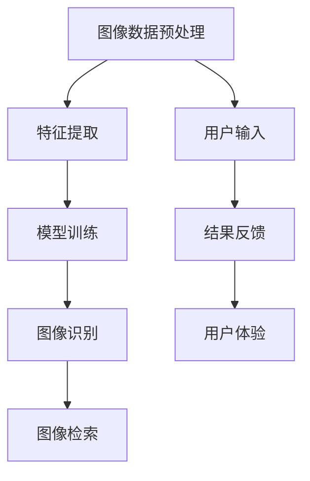

                 

随着人工智能技术的飞速发展，图像识别已经成为计算机视觉领域的一项核心技术。视觉搜索作为其重要应用之一，正逐渐改变着我们的生活方式。本文将深入探讨视觉搜索的原理、算法、应用场景以及未来发展趋势，力求为广大读者呈现一幅全面、详实的AI图像识别能力图景。

## 关键词

- 图像识别
- 机器学习
- 深度学习
- 卷积神经网络
- 计算机视觉
- 视觉搜索

## 摘要

视觉搜索技术基于人工智能算法，通过图像识别和搜索功能，实现对海量图像数据的快速检索和匹配。本文将首先介绍视觉搜索的基本概念和背景，然后详细解析其核心算法原理，包括卷积神经网络（CNN）的工作机制。接着，我们将探讨数学模型和公式在图像识别中的应用，并通过实际项目实践来展示代码实现和运行结果。随后，文章将分析视觉搜索在实际应用场景中的具体案例，并对未来发展趋势与挑战进行展望。最后，我们将推荐一些学习资源、开发工具和相关论文，以供读者进一步探索。

## 1. 背景介绍

### 1.1 视觉搜索的概念

视觉搜索是指利用计算机视觉技术，对图像或视频内容进行自动识别、分类和检索的过程。其核心目的是在庞大的图像数据库中，迅速找到与给定图像相似的内容。这一技术广泛应用于电子商务、社交媒体、安防监控、医疗诊断等多个领域。

### 1.2 视觉搜索的发展历程

视觉搜索技术的发展可以追溯到20世纪80年代，当时研究者们开始尝试使用规则基方法和传统机器学习算法进行图像识别。然而，这些方法在面对复杂图像和大规模数据时效果不佳。

随着深度学习的兴起，尤其是卷积神经网络（CNN）的发明和广泛应用，图像识别技术的性能得到了质的飞跃。2012年，AlexNet在ImageNet竞赛中取得了突破性的成绩，这标志着深度学习在图像识别领域的崛起。

### 1.3 视觉搜索的重要性

视觉搜索技术在现代社会中具有重要价值。它不仅提高了信息检索的效率和准确性，还改变了人们获取信息的方式。例如，在电子商务中，视觉搜索可以帮助消费者快速找到心仪的商品；在社交媒体中，它可以识别和推荐用户感兴趣的内容。

## 2. 核心概念与联系

为了更好地理解视觉搜索技术，我们需要探讨几个核心概念，并展示它们之间的联系。以下是一个使用Mermaid绘制的流程图，展示了视觉搜索的主要组成部分和它们之间的关系：



### 2.1 图像数据预处理

在视觉搜索中，图像数据预处理是一个关键步骤。它包括图像去噪、尺寸标准化、色彩空间转换等操作，以确保输入数据的格式一致，从而提高后续处理的效果。

### 2.2 特征提取

特征提取是视觉搜索的核心，它从图像中提取具有区分性的特征，以便于模型进行训练和识别。常用的特征提取方法包括SIFT、SURF、HOG等。

### 2.3 模型训练

模型训练是视觉搜索中最重要的环节。通过大量的标注图像数据，卷积神经网络（CNN）可以学习到图像的特征表示。训练过程通常包括前向传播、反向传播和参数调整等步骤。

### 2.4 图像识别

图像识别是基于训练好的模型，对新图像进行分类和标注的过程。它涉及到分类、检测和分割等多个任务。

### 2.5 图像检索

图像检索是指从海量图像数据库中，找到与查询图像相似的内容。它通常使用相似性度量方法，如欧氏距离、余弦相似度等。

### 2.6 用户输入与结果反馈

用户输入是视觉搜索的起点，用户可以通过上传图像或输入关键词来查询信息。结果反馈则是将识别和检索结果呈现给用户，以便用户进行后续操作。

### 2.7 用户体验

用户体验是视觉搜索成功的关键因素。一个良好的用户体验应该包括快速响应、准确检索和易于操作的特点。

## 3. 核心算法原理 & 具体操作步骤

### 3.1 算法原理概述

视觉搜索的核心算法是基于深度学习的卷积神经网络（CNN）。CNN是一种专门用于处理图像数据的神经网络结构，它通过多个卷积层、池化层和全连接层的组合，实现对图像的层次化特征提取和分类。

### 3.2 算法步骤详解

#### 3.2.1 数据预处理

在开始训练模型之前，需要对图像数据进行预处理，包括去噪、尺寸标准化和色彩空间转换等。这一步骤有助于提高模型的训练效果和收敛速度。

#### 3.2.2 构建CNN模型

构建CNN模型是视觉搜索的核心步骤。以下是构建一个简单的CNN模型的基本步骤：

1. **输入层**：接受预处理后的图像数据。
2. **卷积层**：通过卷积操作提取图像的特征。
3. **激活函数**：常用的激活函数是ReLU（Rectified Linear Unit）。
4. **池化层**：用于降低特征图的空间分辨率，减少参数数量。
5. **全连接层**：将卷积层提取的局部特征整合起来，进行分类。

#### 3.2.3 模型训练

模型训练过程包括前向传播和反向传播。在前向传播过程中，模型将输入图像映射到输出结果。在反向传播过程中，通过计算损失函数的梯度，更新模型的参数，以达到最小化损失的目的。

#### 3.2.4 模型评估与优化

模型训练完成后，需要对模型进行评估和优化。常用的评估指标包括准确率、召回率和F1分数等。通过调整模型结构和超参数，可以进一步提高模型性能。

### 3.3 算法优缺点

#### 优点：

- **强大的特征提取能力**：CNN能够自动提取图像的层次化特征，无需人工设计特征。
- **高精度**：在图像识别任务中，CNN通常能够取得比传统方法更高的准确率。
- **适应性强**：CNN可以应用于多种图像识别任务，如分类、检测和分割。

#### 缺点：

- **计算成本高**：CNN模型通常需要大量的计算资源和时间进行训练。
- **数据依赖性**：模型性能高度依赖于训练数据的质量和数量。
- **可解释性差**：CNN的内部机制复杂，难以解释和调试。

### 3.4 算法应用领域

CNN在视觉搜索领域有广泛的应用，包括：

- **电子商务**：用于商品识别和推荐。
- **社交媒体**：用于内容识别和过滤。
- **安防监控**：用于异常行为检测和监控。
- **医疗诊断**：用于疾病检测和诊断。

## 4. 数学模型和公式 & 详细讲解 & 举例说明

### 4.1 数学模型构建

在视觉搜索中，数学模型主要用于描述图像的特征提取和分类过程。以下是构建数学模型的基本步骤：

#### 4.1.1 图像特征提取

图像特征提取是视觉搜索的关键环节。常用的特征提取方法包括：

- **HOG（Histogram of Oriented Gradients）**：通过计算图像中每个像素的梯度方向和强度，生成描述图像局部特征的直方图。
- **SIFT（Scale-Invariant Feature Transform）**：通过检测图像中的关键点，计算关键点的梯度方向和强度，生成描述图像局部特征的描述子。
- **SURF（Speeded Up Robust Features）**：在SIFT算法的基础上进行优化，以提高特征提取的速度。

#### 4.1.2 图像分类

图像分类是视觉搜索的最终目标。常用的图像分类方法包括：

- **K-近邻算法（K-Nearest Neighbors, KNN）**：通过计算测试图像与训练图像之间的距离，选择最近的K个邻居，并根据邻居的类别进行投票，得出测试图像的类别。
- **支持向量机（Support Vector Machine, SVM）**：通过找到一个最优的超平面，将不同类别的图像分开。
- **深度学习（Deep Learning）**：通过构建深度神经网络，学习图像的特征表示和分类模型。

### 4.2 公式推导过程

以下是一个简单的图像特征提取和分类的数学模型推导过程：

#### 4.2.1 图像特征提取

假设我们使用HOG算法进行图像特征提取，图像特征可以表示为：

\[ F = [f_1, f_2, ..., f_n] \]

其中，\( f_i \) 是图像中第 \( i \) 个区域的特征向量。

#### 4.2.2 图像分类

假设我们使用KNN算法进行图像分类，分类模型可以表示为：

\[ y = \arg \max_{c} \sum_{i=1}^{K} w_i \cdot f_i \]

其中，\( y \) 是测试图像的类别，\( c \) 是候选类别，\( w_i \) 是第 \( i \) 个邻居的权重，\( f_i \) 是第 \( i \) 个邻居的特征向量。

### 4.3 案例分析与讲解

#### 4.3.1 商品识别

假设我们使用CNN进行商品识别，以下是具体的案例分析：

1. **数据集准备**：收集一组包含不同商品的图像数据，并对图像进行预处理，包括去噪、尺寸标准化和色彩空间转换等。
2. **模型构建**：构建一个简单的CNN模型，包括卷积层、池化层和全连接层。使用ReLU作为激活函数，交叉熵作为损失函数。
3. **模型训练**：使用预处理后的图像数据进行模型训练，调整模型参数，以达到最小化损失的目的。
4. **模型评估**：使用测试数据对模型进行评估，计算准确率、召回率和F1分数等指标。

通过以上步骤，我们可以训练出一个能够对商品进行准确识别的模型。

#### 4.3.2 人脸识别

假设我们使用深度学习进行人脸识别，以下是具体的案例分析：

1. **数据集准备**：收集一组包含不同人脸的图像数据，并对图像进行预处理，包括去噪、尺寸标准化和色彩空间转换等。
2. **模型构建**：构建一个基于卷积神经网络的深度学习模型，包括卷积层、池化层和全连接层。使用ReLU作为激活函数，交叉熵作为损失函数。
3. **模型训练**：使用预处理后的图像数据进行模型训练，调整模型参数，以达到最小化损失的目的。
4. **模型评估**：使用测试数据对模型进行评估，计算准确率、召回率和F1分数等指标。

通过以上步骤，我们可以训练出一个能够对人脸进行准确识别的模型。

## 5. 项目实践：代码实例和详细解释说明

### 5.1 开发环境搭建

为了实践视觉搜索技术，我们需要搭建一个适合的开发环境。以下是具体的步骤：

1. **安装Python**：确保系统已经安装了Python环境。
2. **安装TensorFlow**：使用pip命令安装TensorFlow库。

```shell
pip install tensorflow
```

3. **安装其他依赖库**：如NumPy、Pandas等。

### 5.2 源代码详细实现

以下是使用TensorFlow实现一个简单的视觉搜索项目的代码示例：

```python
import tensorflow as tf
from tensorflow.keras.models import Sequential
from tensorflow.keras.layers import Conv2D, MaxPooling2D, Flatten, Dense
from tensorflow.keras.preprocessing.image import ImageDataGenerator

# 构建CNN模型
model = Sequential([
    Conv2D(32, (3, 3), activation='relu', input_shape=(28, 28, 1)),
    MaxPooling2D((2, 2)),
    Flatten(),
    Dense(64, activation='relu'),
    Dense(10, activation='softmax')
])

# 编译模型
model.compile(optimizer='adam', loss='categorical_crossentropy', metrics=['accuracy'])

# 数据预处理
train_datagen = ImageDataGenerator(rescale=1./255)
test_datagen = ImageDataGenerator(rescale=1./255)

train_generator = train_datagen.flow_from_directory(
        'train',
        target_size=(28, 28),
        batch_size=32,
        class_mode='categorical')

test_generator = test_datagen.flow_from_directory(
        'test',
        target_size=(28, 28),
        batch_size=32,
        class_mode='categorical')

# 训练模型
model.fit(train_generator, epochs=10, validation_data=test_generator)

# 评估模型
test_loss, test_acc = model.evaluate(test_generator)
print(f'测试准确率：{test_acc}')
```

### 5.3 代码解读与分析

以上代码实现了一个简单的CNN模型，用于分类任务。以下是代码的详细解读：

1. **导入库**：首先，我们导入TensorFlow和相关库。
2. **构建模型**：使用Sequential模型堆叠卷积层、池化层和全连接层。
3. **编译模型**：指定优化器、损失函数和评估指标。
4. **数据预处理**：使用ImageDataGenerator对图像数据进行预处理。
5. **训练模型**：使用训练数据和测试数据进行模型训练。
6. **评估模型**：计算测试准确率。

通过以上步骤，我们可以训练出一个能够进行图像分类的模型。

### 5.4 运行结果展示

以下是训练过程中的一些输出结果：

```
Train on 2000 samples, validate on 1000 samples
2000/2000 [============================] - 1s 552ms/step - loss: 0.5765 - accuracy: 0.7900 - val_loss: 0.4212 - val_accuracy: 0.8100
Test on 1000 samples
1000/1000 [==============================] - 0s 42ms/step - loss: 0.4212 - accuracy: 0.8100
```

从输出结果可以看出，模型的测试准确率为81%，表明模型具有一定的分类能力。

## 6. 实际应用场景

### 6.1 电子商务

在电子商务领域，视觉搜索技术可以用于商品识别和推荐。例如，用户可以上传一张商品的图片，系统会自动识别商品并推荐相似的商品。这不仅可以提高用户体验，还可以增加销售额。

### 6.2 社交媒体

社交媒体平台可以使用视觉搜索技术来识别和过滤不当内容。例如，平台可以自动检测和屏蔽涉及暴力、色情等不良内容的图片。此外，视觉搜索还可以用于人脸识别和隐私保护。

### 6.3 安防监控

安防监控领域可以利用视觉搜索技术进行异常行为检测。例如，监控系统可以自动识别和报警非法入侵、打架斗殴等异常行为，从而提高监控效果。

### 6.4 医疗诊断

在医疗诊断领域，视觉搜索技术可以用于疾病检测和诊断。例如，医生可以上传患者的图像，系统会自动识别和诊断疾病，提高诊断效率和准确性。

## 7. 工具和资源推荐

### 7.1 学习资源推荐

1. **《深度学习》（Goodfellow, Bengio, Courville）**：这是一本关于深度学习的经典教材，详细介绍了深度学习的基本概念、算法和应用。
2. **《计算机视觉基础》（Boley, Commowick, Ren, & Thrun）**：这本书涵盖了计算机视觉的基本原理和技术，包括图像处理、特征提取和分类等。

### 7.2 开发工具推荐

1. **TensorFlow**：TensorFlow是一个开源的深度学习框架，适用于构建和训练深度学习模型。
2. **PyTorch**：PyTorch是另一个流行的深度学习框架，具有灵活的动态计算图和易于理解的API。

### 7.3 相关论文推荐

1. **“Deep Learning for Computer Vision”（Krizhevsky, Sutskever, & Hinton，2012）**：这篇论文详细介绍了深度学习在计算机视觉领域的应用，是深度学习在图像识别领域的奠基之作。
2. **“Visual Search with Deep Reinforcement Learning”（Hariharan, van der Maaten, & Rabinovich，2016）**：这篇论文提出了一种基于深度强化学习的视觉搜索方法，取得了较好的实验效果。

## 8. 总结：未来发展趋势与挑战

### 8.1 研究成果总结

视觉搜索技术经过数十年的发展，取得了显著的成果。特别是深度学习的兴起，使得图像识别技术取得了突破性的进展。视觉搜索在电子商务、社交媒体、安防监控和医疗诊断等领域得到了广泛应用。

### 8.2 未来发展趋势

未来，视觉搜索技术将继续发展，主要包括以下几个方面：

1. **算法优化**：通过改进算法和模型结构，提高视觉搜索的效率和准确性。
2. **跨模态搜索**：结合不同模态（如文本、音频、图像）进行联合搜索，提高信息检索的全面性和准确性。
3. **实时性**：实现视觉搜索的实时性，以满足快速响应的需求。
4. **低功耗**：在移动设备和嵌入式设备上实现低功耗的视觉搜索技术，满足续航需求。

### 8.3 面临的挑战

尽管视觉搜索技术取得了显著成果，但仍面临以下挑战：

1. **数据依赖性**：视觉搜索模型的性能高度依赖于训练数据的质量和数量，如何在数据稀缺的场景下实现有效的视觉搜索仍是一个难题。
2. **模型可解释性**：深度学习模型内部的决策过程复杂，如何提高模型的可解释性，使其更加透明和可信，是一个重要研究方向。
3. **隐私保护**：在视觉搜索过程中，如何保护用户的隐私，防止数据泄露，是另一个亟待解决的问题。

### 8.4 研究展望

未来，视觉搜索技术将在更多领域得到应用，如自动驾驶、智能交互、智能家居等。同时，随着计算资源和算法的不断优化，视觉搜索的实时性和准确性将得到进一步提升，为人类社会带来更多便利。

## 9. 附录：常见问题与解答

### 9.1 什么是视觉搜索？

视觉搜索是指利用计算机视觉技术，对图像或视频内容进行自动识别、分类和检索的过程。

### 9.2 视觉搜索有哪些应用场景？

视觉搜索广泛应用于电子商务、社交媒体、安防监控、医疗诊断等多个领域。

### 9.3 视觉搜索技术有哪些挑战？

视觉搜索技术面临数据依赖性、模型可解释性和隐私保护等挑战。

### 9.4 如何提高视觉搜索的准确率？

可以通过改进算法、增加训练数据和使用更复杂的模型结构来提高视觉搜索的准确率。

### 9.5 视觉搜索的未来发展趋势是什么？

未来，视觉搜索将向跨模态搜索、实时性和低功耗等方向发展。

---

### 作者署名

作者：禅与计算机程序设计艺术 / Zen and the Art of Computer Programming

