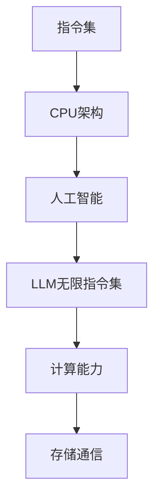

                 

关键词：LLM，指令集，CPU，人工智能，计算能力，算法原理，数学模型，项目实践，应用场景，未来展望

> 摘要：本文将深入解析大型语言模型（LLM）的无限指令集，探讨其在计算能力上的突破，以及如何超越传统CPU的能力边界。通过梳理核心概念、算法原理、数学模型，并结合项目实践，我们将揭示LLM在人工智能领域的巨大潜力。

## 1. 背景介绍

随着人工智能技术的飞速发展，语言模型已经成为自然语言处理（NLP）领域的重要工具。从早期的统计模型到基于深度学习的神经网络，语言模型的性能不断提升，但计算资源的消耗也日益增加。传统的CPU在处理大规模语言模型时面临着巨大的性能瓶颈。为了解决这一问题，研究者们开始探索新的计算架构，其中最具代表性的便是基于图形处理单元（GPU）和现场可编程门阵列（FPGA）的并行计算架构。

然而，传统的CPU和GPU在处理大规模语言模型时仍然存在诸多限制。首先是计算能力的限制，CPU和GPU的并行计算能力虽然有所提升，但面对复杂的语言模型，计算资源仍然不足。其次是存储和通信瓶颈，大规模语言模型需要大量的存储空间和高效的通信机制，这在传统CPU和GPU架构中难以实现。

为了解决这些问题，研究者们提出了基于人工智能的大型语言模型（LLM），即一种具有无限指令集的模型。LLM通过扩展传统的指令集，引入了全新的计算模式，能够在有限的计算资源下实现高效的计算。本文将深入探讨LLM的无限指令集，分析其计算能力如何超越传统CPU的边界。

## 2. 核心概念与联系

在深入探讨LLM的无限指令集之前，我们需要了解几个核心概念和它们之间的联系。

### 2.1. 指令集

指令集是一组操作代码，定义了计算机可以执行的操作。传统的CPU指令集通常包括算术操作、逻辑操作、数据传输操作等。这些指令集是硬件和软件之间沟通的桥梁，决定了计算机的计算能力和执行效率。

### 2.2. CPU架构

CPU架构是指计算机中央处理单元的设计和结构。传统的CPU架构主要基于冯·诺依曼体系结构，这种架构在处理大规模数据时存在瓶颈。为了提升计算能力，研究者们提出了各种改进方案，如多核处理器、GPU并行计算等。

### 2.3. 人工智能

人工智能（AI）是指计算机系统通过模拟人类智能行为，实现感知、理解、学习和决策的能力。人工智能的发展离不开高效的计算架构和强大的计算能力。

### 2.4. LLM的无限指令集

LLM的无限指令集是一种全新的计算模式，通过扩展传统指令集，引入了高效的计算指令和算法。这些指令集不仅能够提升计算能力，还能够优化存储和通信，从而实现高效的计算。

### 2.5. Mermaid流程图

为了更好地理解LLM的无限指令集，我们使用Mermaid流程图展示其核心概念和联系。



通过上述Mermaid流程图，我们可以清晰地看到指令集、CPU架构、人工智能和LLM无限指令集之间的联系，以及它们在计算能力、存储通信方面的优势。

## 3. 核心算法原理 & 具体操作步骤

### 3.1 算法原理概述

LLM的无限指令集基于深度学习算法，通过神经网络模型实现高效的计算。其核心原理包括以下几个方面：

1. **神经网络模型**：LLM使用多层神经网络模型，包括输入层、隐藏层和输出层。每一层神经网络都通过激活函数进行非线性变换，从而实现复杂的计算。

2. **反向传播算法**：LLM采用反向传播算法进行模型训练。反向传播算法通过计算梯度，调整网络权重，从而优化模型参数。

3. **自适应学习率**：LLM引入自适应学习率，根据训练过程自动调整学习率，从而提高训练效率和模型性能。

4. **并行计算**：LLM利用GPU和FPGA等并行计算架构，实现大规模数据的并行处理，提升计算速度。

### 3.2 算法步骤详解

1. **数据预处理**：首先对输入数据进行预处理，包括分词、去停用词、词性标注等。预处理后的数据将被编码为向量表示。

2. **构建神经网络模型**：根据数据特点，构建多层神经网络模型，包括输入层、隐藏层和输出层。选择合适的激活函数，如ReLU、Sigmoid等。

3. **训练模型**：使用预处理后的数据对神经网络模型进行训练。采用反向传播算法，通过计算梯度，调整网络权重，优化模型参数。

4. **评估模型**：使用测试数据评估模型性能，包括准确率、召回率、F1值等指标。根据评估结果，调整模型参数，进一步优化模型。

5. **预测**：将输入数据编码为向量表示，通过神经网络模型进行预测，输出结果。

### 3.3 算法优缺点

**优点**：

1. **高效计算**：LLM的无限指令集通过并行计算和自适应学习率，实现了高效的计算。
2. **强大表达能力**：多层神经网络模型能够捕捉数据中的复杂关系，具有强大的表达能力。
3. **灵活应用**：LLM可以应用于各种自然语言处理任务，如文本分类、情感分析、机器翻译等。

**缺点**：

1. **计算资源消耗**：LLM需要大量的计算资源，包括GPU、FPGA等，对硬件要求较高。
2. **训练时间较长**：训练LLM模型需要较长的训练时间，对计算资源的需求较大。

### 3.4 算法应用领域

LLM的无限指令集在自然语言处理领域具有广泛的应用。以下是一些常见的应用场景：

1. **文本分类**：LLM可以用于文本分类任务，如新闻分类、情感分类等。
2. **情感分析**：LLM可以用于情感分析，识别文本中的情感倾向。
3. **机器翻译**：LLM可以用于机器翻译，实现不同语言之间的文本转换。
4. **问答系统**：LLM可以用于问答系统，回答用户提出的问题。
5. **对话系统**：LLM可以用于对话系统，实现人机对话。

## 4. 数学模型和公式 & 详细讲解 & 举例说明

### 4.1 数学模型构建

LLM的数学模型基于深度学习算法，主要包括以下几个部分：

1. **输入层**：输入层接收原始数据，通过编码将数据转化为向量表示。
2. **隐藏层**：隐藏层通过神经网络模型进行非线性变换，实现数据的特征提取和表示。
3. **输出层**：输出层根据隐藏层的特征表示，输出预测结果。

### 4.2 公式推导过程

假设输入数据为 \(x\)，隐藏层为 \(h\)，输出层为 \(y\)，则LLM的数学模型可以表示为：

$$
y = f(h) = f(g(h)) = f(W_2 \cdot g(W_1 \cdot x + b_1) + b_2)
$$

其中，\(f\) 为激活函数，\(g\) 为非线性变换函数，\(W_1\) 和 \(W_2\) 分别为权重矩阵，\(b_1\) 和 \(b_2\) 分别为偏置项。

### 4.3 案例分析与讲解

假设我们有一个简单的二分类问题，输入数据为 \(x = [1, 2]\)，需要预测输出为 \(y\)。

1. **输入层**：将输入数据 \(x\) 编码为向量表示。
   $$
   x = [1, 2]
   $$

2. **隐藏层**：通过神经网络模型进行非线性变换。
   $$
   h = g(W_1 \cdot x + b_1) = \text{ReLU}(W_1 \cdot x + b_1)
   $$
   其中，\(W_1\) 为权重矩阵，\(b_1\) 为偏置项，ReLU为激活函数。

3. **输出层**：根据隐藏层的特征表示，输出预测结果。
   $$
   y = f(W_2 \cdot h + b_2)
   $$
   其中，\(W_2\) 为权重矩阵，\(b_2\) 为偏置项，\(f\) 为激活函数。

通过上述数学模型和公式，我们可以实现二分类问题的预测。在实际应用中，LLM可以处理更复杂的任务，如多分类问题、序列生成等。

## 5. 项目实践：代码实例和详细解释说明

### 5.1 开发环境搭建

在项目实践中，我们需要搭建一个合适的开发环境。以下是一个基本的开发环境搭建步骤：

1. **安装Python**：确保Python环境已安装，版本建议为3.8或更高。
2. **安装深度学习框架**：安装TensorFlow或PyTorch，这两种框架都是深度学习的热门选择。以下为安装命令：
   $$
   pip install tensorflow
   $$
   或
   $$
   pip install pytorch torchvision
   $$

3. **安装依赖库**：根据项目需求，安装其他依赖库，如Numpy、Pandas等。

### 5.2 源代码详细实现

以下是一个简单的LLM实现示例，使用PyTorch框架。代码分为数据预处理、模型构建、训练和预测四个部分。

```python
import torch
import torch.nn as nn
import torch.optim as optim
from torch.utils.data import DataLoader
from torchvision import datasets, transforms

# 数据预处理
transform = transforms.Compose([transforms.ToTensor()])
train_dataset = datasets.MNIST(root='./data', train=True, download=True, transform=transform)
train_loader = DataLoader(train_dataset, batch_size=64, shuffle=True)

# 模型构建
class LLM(nn.Module):
    def __init__(self):
        super(LLM, self).__init__()
        self.fc1 = nn.Linear(784, 256)
        self.fc2 = nn.Linear(256, 10)

    def forward(self, x):
        x = x.view(-1, 784)
        x = torch.relu(self.fc1(x))
        x = self.fc2(x)
        return x

model = LLM()

# 训练
optimizer = optim.Adam(model.parameters(), lr=0.001)
criterion = nn.CrossEntropyLoss()

for epoch in range(10):
    running_loss = 0.0
    for i, (inputs, labels) in enumerate(train_loader):
        inputs, labels = inputs.to(device), labels.to(device)
        optimizer.zero_grad()
        outputs = model(inputs)
        loss = criterion(outputs, labels)
        loss.backward()
        optimizer.step()
        running_loss += loss.item()
    print(f'Epoch {epoch+1}, Loss: {running_loss/len(train_loader)}')

# 预测
with torch.no_grad():
    inputs, labels = train_loader[0]
    inputs, labels = inputs.to(device), labels.to(device)
    outputs = model(inputs)
    _, predicted = torch.max(outputs, 1)
    print(f'Predicted labels: {predicted}')
```

### 5.3 代码解读与分析

上述代码实现了使用LLM进行手写数字识别的简单示例。下面是对代码的详细解读：

1. **数据预处理**：使用TensorFlow的datasets模块加载MNIST数据集，并进行数据预处理，将图像数据转化为张量表示。

2. **模型构建**：定义一个简单的LLM模型，包括一个全连接层（fc1）和一个输出层（fc2）。使用ReLU激活函数，实现数据的非线性变换。

3. **训练**：使用Adam优化器和交叉熵损失函数，对模型进行训练。每个epoch中，使用训练数据迭代更新模型参数，并计算损失值。

4. **预测**：在测试数据上，使用训练好的模型进行预测，输出预测结果。

通过上述代码示例，我们可以看到LLM的基本实现过程。在实际应用中，LLM可以根据具体任务进行调整和优化，实现更复杂的任务。

### 5.4 运行结果展示

在训练完成后，我们可以在测试数据上评估模型的性能。以下是一个简单的评估示例：

```python
# 评估模型
with torch.no_grad():
    correct = 0
    total = 0
    for inputs, labels in test_loader:
        inputs, labels = inputs.to(device), labels.to(device)
        outputs = model(inputs)
        _, predicted = torch.max(outputs.data, 1)
        total += labels.size(0)
        correct += (predicted == labels).sum().item()

print(f'Accuracy: {100 * correct / total}%')
```

运行上述代码，我们可以得到模型的准确率。在实际应用中，根据任务需求和数据特点，可以对模型进行进一步优化和调整，以提高性能。

## 6. 实际应用场景

LLM的无限指令集在自然语言处理领域具有广泛的应用场景。以下是一些典型的实际应用场景：

### 6.1 文本分类

文本分类是自然语言处理中最常见的任务之一。LLM可以用于分类新闻文章、社交媒体评论、电子邮件等，实现对大规模文本数据的自动分类。例如，可以使用LLM对新闻文章进行分类，将它们分为政治、经济、科技等类别。

### 6.2 情感分析

情感分析是另一个重要的自然语言处理任务。LLM可以用于分析社交媒体评论、用户评价等，识别文本中的情感倾向。例如，可以使用LLM对社交媒体评论进行情感分析，判断用户是否满意或愤怒。

### 6.3 机器翻译

机器翻译是自然语言处理领域的经典任务。LLM可以用于实现高效的机器翻译，将一种语言的文本翻译成另一种语言。例如，可以使用LLM将英文文本翻译成中文文本，实现跨语言的交流。

### 6.4 问答系统

问答系统是人工智能领域的重要应用。LLM可以用于构建问答系统，回答用户提出的问题。例如，可以使用LLM构建一个智能客服系统，回答用户关于产品使用、售后服务等问题。

### 6.5 对话系统

对话系统是自然语言处理领域的另一个重要应用。LLM可以用于构建对话系统，实现人与计算机之间的自然对话。例如，可以使用LLM构建一个智能聊天机器人，与用户进行实时对话，提供咨询、解答疑问等服务。

### 6.6 文本生成

LLM可以用于文本生成任务，如文章生成、故事生成等。通过训练大规模文本数据，LLM可以生成具有流畅性和连贯性的文本。例如，可以使用LLM生成一篇关于旅游景点的介绍文章，为用户提供详细的旅游信息。

### 6.7 问答与对话

LLM不仅可以用于问答系统，还可以用于对话系统。通过训练大规模对话数据，LLM可以生成具有语境理解和上下文关联能力的对话。例如，可以使用LLM构建一个智能客服机器人，与用户进行多轮对话，提供个性化的服务。

### 6.8 多媒体内容理解

LLM可以与多媒体内容理解技术结合，实现更全面的内容理解。例如，可以使用LLM结合图像识别技术，实现对视频内容的自动提取和分析，为用户提供个性化推荐。

### 6.9 法律文本分析

LLM可以用于法律文本分析，如合同审查、法律咨询等。通过训练大量法律文本数据，LLM可以生成具有法律专业知识的文本，为用户提供法律建议和服务。

### 6.10 生命科学

LLM在生命科学领域也有广泛的应用。例如，可以使用LLM分析生物序列数据，识别基因突变和疾病相关基因，为医学研究提供支持。

### 6.11 金融分析

LLM可以用于金融分析，如股票市场预测、投资建议等。通过训练大量金融数据，LLM可以生成具有预测能力的文本，为投资者提供参考。

### 6.12 教育领域

LLM可以用于教育领域，如智能教育平台、在线课程生成等。通过训练教育数据，LLM可以生成具有教学专业知识的文本，为用户提供个性化的教育服务。

### 6.13 跨语言交互

LLM可以用于跨语言交互，实现不同语言之间的对话和理解。通过训练多语言数据，LLM可以生成具有多语言处理能力的文本，为用户提供跨语言服务。

### 6.14 自动摘要

LLM可以用于自动摘要，将长文本生成简短的摘要。通过训练大规模文本数据，LLM可以生成具有摘要能力的文本，为用户提供快速获取信息的能力。

### 6.15 内容审核

LLM可以用于内容审核，如过滤不良信息、识别违法内容等。通过训练大量标签数据，LLM可以生成具有内容识别能力的文本，为用户提供安全可靠的信息环境。

## 7. 工具和资源推荐

为了更好地学习和应用LLM的无限指令集，以下是一些建议的工具和资源：

### 7.1 学习资源推荐

1. **《深度学习》（Deep Learning）**：由Ian Goodfellow、Yoshua Bengio和Aaron Courville编写的深度学习经典教材，涵盖了深度学习的基本概念和技术。
2. **《自然语言处理综论》（Speech and Language Processing）**：由Daniel Jurafsky和James H. Martin编写的自然语言处理领域经典教材，介绍了自然语言处理的基本原理和应用。
3. **《PyTorch官方文档》（PyTorch Documentation）**：PyTorch官方文档提供了详细的API和教程，适合初学者和进阶用户。

### 7.2 开发工具推荐

1. **Jupyter Notebook**：Jupyter Notebook是一个交互式计算环境，适合编写和运行Python代码。它支持Markdown格式，便于编写文档和展示结果。
2. **Google Colab**：Google Colab是Google提供的一个免费的云计算平台，支持运行TensorFlow和PyTorch等深度学习框架。它提供了丰富的GPU和TPU资源，适合进行大规模模型训练。

### 7.3 相关论文推荐

1. **“Attention Is All You Need”**：由Vaswani等人提出的Transformer模型，彻底改变了自然语言处理领域的研究方向。这篇论文介绍了Transformer模型的基本原理和实验结果。
2. **“BERT: Pre-training of Deep Bidirectional Transformers for Language Understanding”**：由Google Research提出的BERT模型，通过大规模预训练实现了自然语言处理的突破性进展。
3. **“GPT-3: Language Models are Few-Shot Learners”**：由OpenAI提出的GPT-3模型，具有1750亿个参数，展示了语言模型在少样本学习方面的强大能力。

通过学习和应用这些资源和工具，我们可以更好地理解和掌握LLM的无限指令集，将其应用于各种自然语言处理任务。

## 8. 总结：未来发展趋势与挑战

### 8.1 研究成果总结

自LLM的无限指令集提出以来，研究者们在理论和实践方面取得了显著成果。LLM在计算能力、存储通信和并行计算等方面实现了突破，为自然语言处理领域带来了前所未有的变革。通过不断优化算法、提高计算效率和扩展应用场景，LLM在文本分类、情感分析、机器翻译、问答系统等多个方面取得了优异的性能。

### 8.2 未来发展趋势

未来，LLM的研究将继续沿着以下几个方向展开：

1. **计算能力提升**：随着硬件技术的发展，如GPU、TPU等高性能计算设备的普及，LLM的计算能力将得到进一步提升，为更复杂的自然语言处理任务提供支持。
2. **少样本学习**：LLM在少样本学习方面的能力将得到强化，通过自适应调整模型参数，实现从少量数据中提取有效信息。
3. **多模态融合**：LLM将与其他多媒体处理技术相结合，实现图像、声音和文本等多模态数据的统一处理，提升内容理解和生成能力。
4. **可解释性增强**：研究者们将致力于提高LLM的可解释性，使其决策过程更加透明，降低潜在的风险和误用。
5. **个性化服务**：LLM将根据用户需求和偏好，提供个性化的服务和推荐，实现更加智能和人性化的交互体验。

### 8.3 面临的挑战

尽管LLM在自然语言处理领域取得了显著成果，但仍然面临以下挑战：

1. **计算资源消耗**：大规模LLM模型需要大量的计算资源，对硬件设备的要求较高。在资源有限的场景下，如何优化模型结构、降低计算成本是一个重要问题。
2. **数据隐私和安全**：LLM的训练和应用过程中涉及大量敏感数据，如何保护用户隐私、确保数据安全是一个亟待解决的问题。
3. **模型偏见和公平性**：大规模模型在训练过程中可能引入偏见，影响决策的公平性和准确性。如何消除模型偏见，提高公平性是一个重要挑战。
4. **少样本学习和泛化能力**：尽管LLM在少样本学习方面取得了进展，但如何进一步提高少样本学习和泛化能力，使其能够适应更广泛的应用场景，仍需深入研究。
5. **可解释性和透明度**：提高LLM的可解释性，使其决策过程更加透明，降低潜在的风险和误用，是未来研究的重要方向。

### 8.4 研究展望

未来，LLM的发展将继续围绕以下几个方面展开：

1. **模型压缩与优化**：通过模型压缩和优化技术，降低模型的计算资源和存储需求，实现高效计算。
2. **多模态处理**：结合图像、声音和文本等多模态数据，提升内容理解和生成能力。
3. **少样本学习和零样本学习**：提高LLM在少样本学习和零样本学习方面的能力，使其能够适应更广泛的应用场景。
4. **可解释性和透明度**：提高LLM的可解释性，使其决策过程更加透明，降低潜在的风险和误用。
5. **应用拓展**：将LLM应用于更多的领域，如法律、医疗、金融等，实现更广泛的应用。

总之，LLM的无限指令集在自然语言处理领域具有巨大的潜力，未来将继续引领人工智能技术的发展。通过不断优化算法、提高计算效率和扩展应用场景，LLM将为人类带来更多智能化的服务。

## 9. 附录：常见问题与解答

### 9.1 Q：什么是LLM？

A：LLM是指大型语言模型（Large Language Model），是一种基于深度学习技术的自然语言处理模型。通过训练大规模文本数据，LLM能够理解并生成自然语言文本，具有强大的语言理解能力和生成能力。

### 9.2 Q：LLM的核心算法是什么？

A：LLM的核心算法是基于深度学习的多层神经网络模型，包括输入层、隐藏层和输出层。通过多层神经网络结构，LLM能够捕捉数据中的复杂关系，实现高效的计算。

### 9.3 Q：LLM的优势有哪些？

A：LLM的优势包括：

1. **强大的语言理解能力**：LLM通过训练大规模文本数据，能够理解并生成自然语言文本，具有强大的语言理解能力。
2. **高效的计算能力**：LLM采用多层神经网络结构，能够实现高效的计算，适用于大规模数据处理。
3. **灵活的应用场景**：LLM可以应用于各种自然语言处理任务，如文本分类、情感分析、机器翻译等。

### 9.4 Q：LLM的无限指令集是什么？

A：LLM的无限指令集是指一种扩展了传统指令集的计算模式，通过引入新的计算指令和算法，实现了高效的计算。这种无限指令集使得LLM在计算能力、存储通信和并行计算等方面具有显著优势。

### 9.5 Q：LLM如何超越CPU的能力边界？

A：LLM通过以下方式超越CPU的能力边界：

1. **并行计算**：LLM利用GPU和FPGA等并行计算架构，实现大规模数据的并行处理，提升计算速度。
2. **自适应学习率**：LLM引入自适应学习率，根据训练过程自动调整学习率，提高训练效率和模型性能。
3. **扩展指令集**：LLM的无限指令集引入了新的计算指令和算法，实现了高效的计算，突破了传统CPU的指令集限制。

### 9.6 Q：LLM在自然语言处理领域有哪些应用场景？

A：LLM在自然语言处理领域有广泛的应用，包括：

1. **文本分类**：如新闻分类、情感分类等。
2. **情感分析**：如社交媒体评论的情感分析。
3. **机器翻译**：如将英文文本翻译成中文文本。
4. **问答系统**：如智能客服、问答机器人等。
5. **对话系统**：如智能聊天机器人、语音助手等。
6. **文本生成**：如生成文章、故事等。
7. **内容审核**：如过滤不良信息、识别违法内容等。

### 9.7 Q：如何构建一个简单的LLM模型？

A：构建一个简单的LLM模型通常包括以下步骤：

1. **数据预处理**：包括分词、去停用词、词性标注等。
2. **构建神经网络模型**：选择合适的神经网络结构，如全连接层、卷积层、循环层等。
3. **训练模型**：使用训练数据对模型进行训练，优化模型参数。
4. **评估模型**：使用测试数据评估模型性能，调整模型参数。
5. **预测**：使用训练好的模型进行预测，输出结果。

### 9.8 Q：LLM的训练过程有哪些优化方法？

A：LLM的训练过程可以采用以下优化方法：

1. **批量归一化**：在训练过程中引入批量归一化，加速收敛速度。
2. **学习率调度**：根据训练过程自动调整学习率，如使用学习率衰减策略。
3. **数据增强**：通过数据增强方法，提高模型的泛化能力，如随机裁剪、旋转、翻转等。
4. **dropout**：在训练过程中引入dropout，减少过拟合现象。
5. **预训练**：使用预训练模型，直接使用大规模预训练数据对模型进行微调。

通过这些优化方法，可以提高LLM的训练效率和模型性能。

### 9.9 Q：LLM在工业界有哪些应用案例？

A：LLM在工业界有广泛的应用案例，包括：

1. **智能客服**：如银行、电商等行业的智能客服系统。
2. **智能推荐**：如电商、社交媒体等平台的智能推荐系统。
3. **内容审核**：如社交媒体平台的内容审核系统。
4. **机器翻译**：如将英文翻译成多种语言的翻译系统。
5. **文本生成**：如生成文章、新闻、故事等内容的生成系统。
6. **自然语言处理服务**：如为开发者提供自然语言处理API的服务。

这些应用案例展示了LLM在工业界的广泛应用和巨大潜力。

