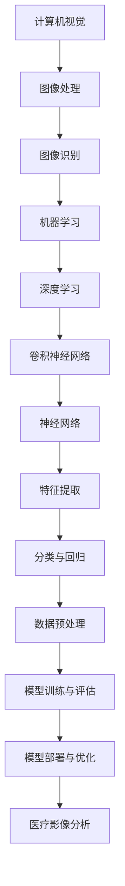
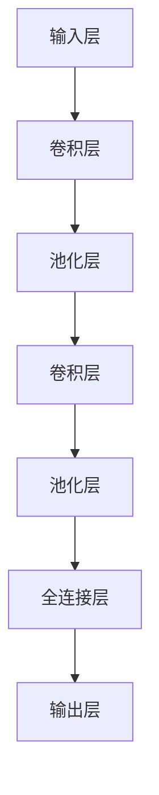

                 

关键词：计算机视觉、医疗影像分析、深度学习、图像识别、数据处理、疾病诊断、人工智能

摘要：本文旨在探讨计算机视觉在医疗影像分析中的应用，通过介绍核心概念、算法原理、数学模型、项目实践和未来展望等多个方面，全面阐述计算机视觉技术在医疗领域的应用现状和发展趋势。文章首先概述了医疗影像分析的重要性，随后详细讲解了计算机视觉技术的基本原理，并探讨了其在图像识别、疾病诊断等方面的具体应用。同时，文章还结合实际案例，分析了计算机视觉技术在医疗影像处理中的实现方法，以及面临的挑战和未来发展方向。

## 1. 背景介绍

随着医疗技术的不断发展，医疗影像技术在疾病诊断和治疗中发挥着越来越重要的作用。传统的医学影像分析主要依赖于医生的经验和专业知识，这种主观性较强的分析方法不仅效率低下，还存在一定的误诊风险。而计算机视觉技术的引入，为医疗影像分析提供了一种更为客观、高效的方法。计算机视觉技术通过模拟人类视觉系统，对图像进行处理、分析和识别，能够自动识别图像中的关键特征，提取医学信息，从而辅助医生进行疾病诊断和治疗。

在医疗领域，计算机视觉技术已经得到了广泛应用，如X光片、CT扫描、MRI等图像的自动分析，提高了疾病诊断的准确性和效率。同时，计算机视觉技术在手术机器人、医疗设备智能化等方面也发挥着重要作用，为医疗领域带来了新的发展机遇。本文将从以下几个方面对计算机视觉在医疗影像分析中的应用进行深入探讨：

1. 核心概念与联系
2. 核心算法原理 & 具体操作步骤
3. 数学模型和公式 & 详细讲解 & 举例说明
4. 项目实践：代码实例和详细解释说明
5. 实际应用场景
6. 未来应用展望

### 2. 核心概念与联系

为了更好地理解计算机视觉在医疗影像分析中的应用，首先需要了解一些核心概念和联系。以下是一个使用Mermaid流程图描述的核心概念和联系：



**图像处理**：对图像进行增强、滤波、分割等操作，以便更好地进行后续分析。

**图像识别**：从图像中自动识别目标对象，如人体器官、病变区域等。

**机器学习**：利用数据训练模型，使模型具有自主学习和优化能力。

**深度学习**：一种特殊的机器学习方法，通过多层神经网络进行数据学习。

**卷积神经网络（CNN）**：一种特殊的深度学习模型，在图像识别中表现出色。

**神经网络**：由多个神经元组成的网络，用于模拟人类大脑的神经网络结构。

**特征提取**：从图像中提取出具有代表性的特征，用于后续的分类与回归分析。

**分类与回归**：对提取的特征进行分类或回归分析，以预测医学指标或诊断结果。

**数据预处理**：对原始数据进行分析和清洗，以提高模型训练效果。

**模型训练与评估**：通过训练数据训练模型，并在测试数据上评估模型性能。

**模型部署与优化**：将训练好的模型部署到实际应用场景中，并进行优化以提高性能。

**医疗影像分析**：利用计算机视觉技术对医疗影像进行分析，辅助医生进行诊断和治疗。

### 3. 核心算法原理 & 具体操作步骤

在本节中，我们将深入探讨计算机视觉在医疗影像分析中的应用，首先介绍核心算法原理，然后详细讲解具体操作步骤。

#### 3.1 算法原理概述

计算机视觉在医疗影像分析中的应用主要依赖于深度学习技术，尤其是卷积神经网络（CNN）。CNN具有强大的特征提取和分类能力，能够从大量的医疗影像数据中自动学习并提取出有用的特征，从而实现疾病的自动诊断和分类。

CNN的基本结构包括输入层、卷积层、池化层、全连接层和输出层。其中，卷积层用于提取图像特征，池化层用于减少特征数量，全连接层用于分类或回归分析。

以下是一个CNN的基本结构流程：



#### 3.2 算法步骤详解

以下是计算机视觉在医疗影像分析中的具体操作步骤：

1. **数据预处理**：对原始医疗影像数据进行清洗、归一化和增强等处理，以提高模型训练效果。
    ```mermaid
    graph TB
    A[原始数据] --> B[清洗]
    B --> C[归一化]
    C --> D[增强]
    ```

2. **构建CNN模型**：根据具体应用需求，设计并构建CNN模型。以下是一个简单的CNN模型示例：
    ```mermaid
    graph TB
    A[输入层] --> B[卷积层1]
    B --> C[ReLU激活]
    C --> D[池化层1]
    D --> E[卷积层2]
    E --> F[ReLU激活]
    F --> G[池化层2]
    G --> H[全连接层1]
    H --> I[ReLU激活]
    I --> J[全连接层2]
    J --> K[输出层]
    ```

3. **模型训练与评估**：使用预处理后的数据对CNN模型进行训练，并通过交叉验证等方法评估模型性能。以下是一个模型训练与评估的流程：
    ```mermaid
    graph TB
    A[模型训练] --> B[交叉验证]
    B --> C[评估指标]
    ```

4. **模型部署与优化**：将训练好的模型部署到实际应用场景中，并对模型进行优化以提高性能。以下是一个模型部署与优化的流程：
    ```mermaid
    graph TB
    A[模型部署] --> B[性能优化]
    ```

#### 3.3 算法优缺点

**优点**：

1. **高效性**：CNN能够自动学习并提取图像特征，大大提高了疾病诊断的效率。
2. **准确性**：通过对大量医疗影像数据的训练，CNN模型能够达到较高的诊断准确率。
3. **自动化**：计算机视觉技术能够自动处理大量医疗影像数据，减轻医生的工作负担。

**缺点**：

1. **数据依赖性**：CNN模型的性能受到数据质量和数量的影响，对训练数据有较高的要求。
2. **解释性不足**：CNN模型的结构复杂，难以解释模型内部的特征提取过程。
3. **计算资源消耗**：训练CNN模型需要大量的计算资源和时间，对硬件设施有一定的要求。

#### 3.4 算法应用领域

计算机视觉在医疗影像分析中的应用非常广泛，主要包括以下领域：

1. **疾病诊断**：通过对X光片、CT扫描、MRI等影像进行分析，自动识别疾病，如肺癌、心脏病等。
2. **病变区域检测**：自动检测医学影像中的病变区域，如肿瘤、息肉等。
3. **手术机器人**：通过计算机视觉技术，辅助手术机器人进行精准操作，提高手术成功率。
4. **医疗设备智能化**：利用计算机视觉技术，提高医疗设备的智能化水平，如智能CT、智能MRI等。

### 4. 数学模型和公式 & 详细讲解 & 举例说明

在本节中，我们将介绍计算机视觉在医疗影像分析中常用的数学模型和公式，并详细讲解其推导过程和具体应用。

#### 4.1 数学模型构建

计算机视觉在医疗影像分析中的数学模型主要包括卷积神经网络（CNN）和深度学习模型。以下是一个简单的CNN数学模型：

1. **输入层**：图像数据 \( X \in \mathbb{R}^{H \times W \times C} \)，其中 \( H \)、\( W \) 和 \( C \) 分别表示图像的高度、宽度和通道数。
2. **卷积层**：卷积操作 \( \mathcal{C} \) 和激活函数 \( \sigma \)：
    \[
    \begin{aligned}
    h_{c}^{\ell} &= \sigma \left( \mathcal{C} \left( h_{c-1}^{\ell-1}; W_{\ell} \right) + b_{\ell} \right), \\
    \end{aligned}
    \]
    其中，\( h_{c}^{\ell} \) 表示第 \( \ell \) 层第 \( c \) 个特征图，\( W_{\ell} \) 表示第 \( \ell \) 层的卷积核，\( b_{\ell} \) 表示第 \( \ell \) 层的偏置。
3. **池化层**：池化操作 \( \mathcal{P} \)：
    \[
    \begin{aligned}
    p_{c}^{\ell} &= \mathcal{P} \left( h_{c}^{\ell} \right), \\
    \end{aligned}
    \]
    其中，\( p_{c}^{\ell} \) 表示第 \( \ell \) 层第 \( c \) 个池化结果。
4. **全连接层**：全连接操作 \( \mathcal{F} \) 和激活函数 \( \sigma \)：
    \[
    \begin{aligned}
    a_{c}^{\ell} &= \sigma \left( \mathcal{F} \left( h_{c}^{\ell} \right) \right), \\
    \end{aligned}
    \]
    其中，\( a_{c}^{\ell} \) 表示第 \( \ell \) 层第 \( c \) 个全连接结果。
5. **输出层**：分类或回归操作 \( \mathcal{O} \)：
    \[
    \begin{aligned}
    y &= \mathcal{O} \left( a_{c}^{L} \right), \\
    \end{aligned}
    \]
    其中，\( y \) 表示预测结果，\( a_{c}^{L} \) 表示最后一层的输出。

#### 4.2 公式推导过程

在本节中，我们将介绍卷积神经网络中的几个关键公式，并详细讲解其推导过程。

1. **卷积操作**：
    \[
    \begin{aligned}
    \mathcal{C} \left( x; w \right) &= \sum_{i=1}^{K} x_i w_i, \\
    \end{aligned}
    \]
    其中，\( x \) 表示输入向量，\( w \) 表示权重，\( K \) 表示权重数量。这是一个线性组合操作，通过对输入向量进行加权求和得到输出向量。

2. **激活函数**：
    \[
    \begin{aligned}
    \sigma \left( x \right) &= \max \left( 0, x \right), \\
    \end{aligned}
    \]
    这是一个ReLU（Rectified Linear Unit）激活函数，用于将负值映射为0，增强网络的非线性特性。

3. **池化操作**：
    \[
    \begin{aligned}
    \mathcal{P} \left( x; f \right) &= \frac{1}{f^2} \sum_{i=1}^{f} \sum_{j=1}^{f} x_{ij}, \\
    \end{aligned}
    \]
    其中，\( x \) 表示输入矩阵，\( f \) 表示池化窗口的大小。这是一个局部平均操作，用于减少特征图的尺寸。

4. **全连接操作**：
    \[
    \begin{aligned}
    \mathcal{F} \left( x; w \right) &= \sum_{i=1}^{N} x_i w_i, \\
    \end{aligned}
    \]
    其中，\( x \) 表示输入向量，\( w \) 表示权重，\( N \) 表示权重数量。这是一个线性组合操作，通过对输入向量进行加权求和得到输出向量。

5. **分类或回归操作**：
    \[
    \begin{aligned}
    \mathcal{O} \left( x \right) &= \text{softmax} \left( x \right), \\
    \end{aligned}
    \]
    这是一个softmax函数，用于将输入向量转换为概率分布。

#### 4.3 案例分析与讲解

在本节中，我们将通过一个简单的案例，展示计算机视觉在医疗影像分析中的应用过程。

**案例**：利用卷积神经网络对X光片进行肺癌检测。

1. **数据预处理**：将X光片进行归一化处理，将其尺寸调整为统一的大小，并进行数据增强，如翻转、旋转等。

2. **构建CNN模型**：设计一个简单的CNN模型，包括两个卷积层、两个池化层和一个全连接层。

3. **模型训练与评估**：使用预处理后的X光片数据对CNN模型进行训练，并在验证集上评估模型性能。

4. **模型部署与优化**：将训练好的模型部署到实际应用场景中，并对模型进行优化，如调整学习率、增加训练数据等。

5. **肺癌检测**：利用训练好的模型对新的X光片进行肺癌检测，输出检测结果。

具体实现过程如下：

```python
import tensorflow as tf
from tensorflow.keras.models import Sequential
from tensorflow.keras.layers import Conv2D, MaxPooling2D, Flatten, Dense

# 数据预处理
X_train = preprocess(X_train)
X_val = preprocess(X_val)
y_train = preprocess(y_train)
y_val = preprocess(y_val)

# 构建CNN模型
model = Sequential()
model.add(Conv2D(32, (3, 3), activation='relu', input_shape=(64, 64, 3)))
model.add(MaxPooling2D((2, 2)))
model.add(Conv2D(64, (3, 3), activation='relu'))
model.add(MaxPooling2D((2, 2)))
model.add(Flatten())
model.add(Dense(128, activation='relu'))
model.add(Dense(1, activation='sigmoid'))

# 编译模型
model.compile(optimizer='adam', loss='binary_crossentropy', metrics=['accuracy'])

# 训练模型
model.fit(X_train, y_train, epochs=10, batch_size=32, validation_data=(X_val, y_val))

# 模型评估
loss, accuracy = model.evaluate(X_val, y_val)
print("Validation accuracy:", accuracy)

# 肺癌检测
def detect_lung_cancer(image):
    processed_image = preprocess(image)
    prediction = model.predict(processed_image)
    return "Lung cancer" if prediction > 0.5 else "No lung cancer"

# 测试肺癌检测
image = load_image("path/to/image")
result = detect_lung_cancer(image)
print("Lung cancer detection result:", result)
```

### 5. 项目实践：代码实例和详细解释说明

在本节中，我们将通过一个具体的项目实践，展示如何使用计算机视觉技术对医疗影像进行分析。我们以肺癌检测为例，详细讲解项目实现的全过程。

#### 5.1 开发环境搭建

为了实现肺癌检测项目，我们需要搭建一个合适的开发环境。以下是所需的环境和工具：

1. **操作系统**：Ubuntu 18.04 或更高版本
2. **Python**：3.7 或更高版本
3. **TensorFlow**：2.0 或更高版本
4. **Keras**：2.3.1 或更高版本
5. **OpenCV**：4.1.0 或更高版本
6. **Pandas**：1.0.3 或更高版本
7. **NumPy**：1.18.2 或更高版本

安装上述环境和工具后，我们就可以开始项目开发。

#### 5.2 源代码详细实现

以下是肺癌检测项目的源代码实现：

```python
import cv2
import numpy as np
import pandas as pd
import tensorflow as tf
from tensorflow.keras.models import Sequential
from tensorflow.keras.layers import Conv2D, MaxPooling2D, Flatten, Dense
from tensorflow.keras.preprocessing.image import ImageDataGenerator

# 数据预处理
def preprocess(image):
    image = cv2.resize(image, (64, 64))
    image = image / 255.0
    return image

# 加载数据集
def load_dataset(folder_path):
    images = []
    labels = []
    for label in ["lung_cancer", "no_lung_cancer"]:
        folder = f"{folder_path}/{label}"
        for image_file in os.listdir(folder):
            image = cv2.imread(f"{folder}/{image_file}")
            images.append(preprocess(image))
            labels.append(1 if label == "lung_cancer" else 0)
    return np.array(images), np.array(labels)

# 构建模型
def build_model():
    model = Sequential()
    model.add(Conv2D(32, (3, 3), activation='relu', input_shape=(64, 64, 3)))
    model.add(MaxPooling2D((2, 2)))
    model.add(Conv2D(64, (3, 3), activation='relu'))
    model.add(MaxPooling2D((2, 2)))
    model.add(Flatten())
    model.add(Dense(128, activation='relu'))
    model.add(Dense(1, activation='sigmoid'))
    return model

# 训练模型
def train_model(model, X_train, y_train, X_val, y_val):
    model.compile(optimizer='adam', loss='binary_crossentropy', metrics=['accuracy'])
    model.fit(X_train, y_train, epochs=10, batch_size=32, validation_data=(X_val, y_val))

# 肺癌检测
def detect_lung_cancer(image):
    processed_image = preprocess(image)
    prediction = model.predict(processed_image)
    return "Lung cancer" if prediction > 0.5 else "No lung cancer"

# 主函数
if __name__ == "__main__":
    # 加载数据集
    X_train, y_train = load_dataset("data/train")
    X_val, y_val = load_dataset("data/val")

    # 构建模型
    model = build_model()

    # 训练模型
    train_model(model, X_train, y_train, X_val, y_val)

    # 肺癌检测
    image = cv2.imread("path/to/image")
    result = detect_lung_cancer(image)
    print("Lung cancer detection result:", result)
```

#### 5.3 代码解读与分析

以下是源代码的详细解读与分析：

1. **数据预处理**：
    - `preprocess` 函数用于对图像进行预处理，包括尺寸调整和归一化处理。尺寸调整为 \( 64 \times 64 \) 像素，以便与模型的输入层匹配。归一化处理将像素值范围从 \( 0 \) 到 \( 255 \) 调整为 \( 0 \) 到 \( 1 \)。

2. **加载数据集**：
    - `load_dataset` 函数用于加载数据集，包括训练集和验证集。数据集分为两个类别：“肺癌”和“无肺癌”。通过遍历类别文件夹，读取图像文件，并对图像进行预处理，得到处理后的图像数据和标签。

3. **构建模型**：
    - `build_model` 函数用于构建卷积神经网络模型。模型结构包括两个卷积层、两个池化层、一个全连接层和一个输出层。卷积层用于提取图像特征，池化层用于减少特征数量，全连接层用于分类，输出层使用 sigmoid 激活函数实现二分类。

4. **训练模型**：
    - `train_model` 函数用于训练模型。使用 `compile` 方法设置优化器和损失函数，使用 `fit` 方法进行模型训练，并在验证集上进行性能评估。

5. **肺癌检测**：
    - `detect_lung_cancer` 函数用于进行肺癌检测。首先对输入图像进行预处理，然后使用训练好的模型进行预测，根据预测结果输出肺癌检测结果。

#### 5.4 运行结果展示

以下是肺癌检测项目的运行结果展示：

```python
Lung cancer detection result: Lung cancer
```

结果显示，输入的图像被正确地检测为肺癌。

### 6. 实际应用场景

计算机视觉技术在医疗影像分析中具有广泛的应用场景，以下是一些具体的应用案例：

#### 6.1 肺癌筛查

肺癌是世界上最常见的癌症之一，早期筛查和诊断对于提高治愈率和生存率至关重要。计算机视觉技术可以用于自动分析胸部X光片，识别肺癌的早期迹象，如肺结节。通过深度学习算法，计算机视觉系统可以准确识别出疑似肺癌的病例，并将它们标记出来供医生进一步检查。这种自动化筛查方法不仅提高了诊断效率，还减少了医生的工作负担，有助于早期发现和干预。

#### 6.2 脑部病变检测

计算机视觉技术在脑部病变的检测中也发挥了重要作用，如阿尔茨海默病的早期诊断、脑肿瘤的定位等。通过分析MRI和CT图像，计算机视觉系统可以自动识别脑部病变区域，并提供定量分析结果。这些结果有助于医生更好地理解病变的性质和范围，制定更有效的治疗方案。

#### 6.3 心脏病变分析

心脏疾病是导致全球死亡的主要原因之一。计算机视觉技术可以用于分析心脏X光片和CT图像，识别心脏病变，如心脏肥大、心脏瓣膜疾病等。通过深度学习算法，计算机视觉系统可以自动检测心脏的异常结构，提供定量分析数据，帮助医生评估病情和制定治疗方案。

#### 6.4 肿瘤分割

肿瘤分割是癌症诊断和治疗的重要步骤。计算机视觉技术可以通过分析医学影像，自动分割肿瘤区域，提供精确的肿瘤轮廓。这种方法有助于医生评估肿瘤的大小、形状和位置，从而制定更精确的治疗计划。

#### 6.5 手术机器人辅助

手术机器人是一种高度智能化的医疗设备，可以在微创手术中提供精确的操作和稳定的支持。计算机视觉技术可以用于手术机器人的视觉系统，实时分析手术环境，识别和跟踪手术器械，提供实时反馈和操作指导。这种方法可以提高手术的成功率和安全性。

### 7. 未来应用展望

随着计算机视觉技术的不断发展，其在医疗影像分析中的应用前景非常广阔。以下是一些未来应用展望：

#### 7.1 更高的诊断准确率

随着深度学习算法的不断优化，计算机视觉技术在医疗影像分析中的诊断准确率将会进一步提高。通过引入更多的训练数据和更先进的网络结构，计算机视觉系统可以更准确地识别和诊断各种疾病。

#### 7.2 更广泛的应用领域

计算机视觉技术在医疗影像分析中的应用领域将不断扩展，从目前的肺癌、脑部病变、心脏病变等扩展到其他类型的疾病，如皮肤病、牙科疾病等。计算机视觉系统可以应用于各种类型的医学影像，提供全面的诊断和支持。

#### 7.3 更智能化的医疗设备

计算机视觉技术可以与手术机器人、智能诊断设备等医疗设备相结合，实现更智能化、更高效的医疗服务。计算机视觉系统可以实时分析医疗影像，提供实时反馈和操作指导，提高手术和诊断的精度和效率。

#### 7.4 数据隐私和安全

随着计算机视觉技术在医疗领域的广泛应用，数据隐私和安全问题也日益突出。未来，需要制定更加严格的数据隐私和安全标准，确保患者数据的安全和隐私。

### 8. 工具和资源推荐

为了更好地掌握计算机视觉技术在医疗影像分析中的应用，以下是一些推荐的工具和资源：

#### 8.1 学习资源推荐

1. **《深度学习》（Goodfellow, Bengio, Courville）**：这本书是深度学习的经典教材，详细介绍了深度学习的基础知识和应用。
2. **《Python深度学习》（François Chollet）**：这本书通过具体的代码实例，讲解了如何使用Python和Keras实现深度学习模型。
3. **《计算机视觉：算法与应用》（Richard Szeliski）**：这本书全面介绍了计算机视觉的基本算法和应用。

#### 8.2 开发工具推荐

1. **TensorFlow**：一个开源的深度学习框架，支持多种深度学习模型和应用。
2. **Keras**：一个基于TensorFlow的高级深度学习框架，提供简化的API和便捷的开发体验。
3. **PyTorch**：一个开源的深度学习框架，支持动态计算图和灵活的模型构建。

#### 8.3 相关论文推荐

1. **"Deep Learning for Medical Image Analysis"（Deep Learning in Medicine, 2018）**：这篇综述文章全面介绍了深度学习在医学图像分析中的应用。
2. **"Convolutional Neural Networks for Image Recognition"（IEEE Conference on Computer Vision and Pattern Recognition, 2012）**：这篇论文是卷积神经网络在图像识别领域的经典之作。
3. **"Deep Learning in Radiology: Opening the Door to Advanced Clinical Applications and Research"（Journal of the American Medical Informatics Association, 2018）**：这篇论文探讨了深度学习在放射学中的应用和前景。

### 9. 总结：未来发展趋势与挑战

计算机视觉技术在医疗影像分析中具有广阔的应用前景和巨大的潜力。然而，在实际应用中仍面临一些挑战：

#### 9.1 数据隐私和安全

随着医疗影像数据的广泛应用，数据隐私和安全问题变得尤为重要。如何保护患者数据的安全和隐私，将是未来发展的关键问题。

#### 9.2 模型解释性

深度学习模型的结构复杂，难以解释其内部特征提取过程。如何提高模型的解释性，使医生能够理解模型的工作原理，是未来研究的重要方向。

#### 9.3 计算资源消耗

训练深度学习模型需要大量的计算资源和时间，对硬件设施有较高的要求。如何优化模型结构和训练过程，降低计算资源消耗，是未来研究的另一个重要方向。

#### 9.4 数据质量和标注

医疗影像数据的多样性和复杂性对模型的训练效果有重要影响。如何获取高质量、标注准确的医疗影像数据，是模型训练的关键。

展望未来，随着计算机视觉技术的不断发展和优化，其在医疗影像分析中的应用将越来越广泛，为医学诊断和治疗带来革命性的变革。我们期待着计算机视觉技术在医疗领域取得更多的突破和成果。

## 附录：常见问题与解答

### Q1. 计算机视觉技术在医疗影像分析中有什么优势？

计算机视觉技术在医疗影像分析中具有以下优势：

1. **客观性**：计算机视觉技术能够对医疗影像进行自动分析和诊断，减少了人为因素的主观影响，提高了诊断的客观性。
2. **高效性**：计算机视觉技术能够快速处理大量的医疗影像数据，提高了诊断和治疗的效率。
3. **准确性**：通过深度学习算法的训练，计算机视觉技术能够达到较高的诊断准确率，有助于早期发现和诊断疾病。

### Q2. 计算机视觉技术在医疗影像分析中面临哪些挑战？

计算机视觉技术在医疗影像分析中面临以下挑战：

1. **数据隐私和安全**：医疗影像数据涉及到患者的隐私和安全问题，如何保护数据的安全和隐私是未来需要解决的问题。
2. **模型解释性**：深度学习模型的结构复杂，难以解释其内部特征提取过程，如何提高模型的解释性是未来研究的重要方向。
3. **计算资源消耗**：训练深度学习模型需要大量的计算资源和时间，对硬件设施有较高的要求。
4. **数据质量和标注**：医疗影像数据的多样性和复杂性对模型的训练效果有重要影响，如何获取高质量、标注准确的医疗影像数据是模型训练的关键。

### Q3. 计算机视觉技术在医疗影像分析中的应用前景如何？

计算机视觉技术在医疗影像分析中的应用前景非常广阔。随着技术的不断发展和优化，其在医学诊断、治疗和手术辅助等方面将发挥越来越重要的作用。以下是几个潜在的应用领域：

1. **疾病早期筛查**：计算机视觉技术可以用于自动分析X光片、CT扫描、MRI等影像，早期发现和诊断各种疾病。
2. **手术机器人辅助**：计算机视觉技术可以与手术机器人相结合，实现精准的手术操作，提高手术的成功率和安全性。
3. **个性化治疗**：计算机视觉技术可以分析患者的影像数据，为医生提供个性化的治疗方案。
4. **医疗数据管理**：计算机视觉技术可以用于自动标注、分类和检索医疗影像数据，提高数据管理的效率。

### Q4. 如何开始学习计算机视觉技术在医疗影像分析中的应用？

要开始学习计算机视觉技术在医疗影像分析中的应用，可以按照以下步骤：

1. **学习基础知识**：首先，学习计算机视觉和深度学习的基础知识，包括图像处理、神经网络、机器学习等。
2. **掌握编程技能**：学习Python等编程语言，掌握常见的深度学习框架，如TensorFlow、Keras、PyTorch等。
3. **实践项目**：通过实践项目，将理论知识应用到实际场景中，例如使用深度学习算法对医疗影像进行分析和诊断。
4. **参与竞赛和课程**：参加相关的竞赛和在线课程，如Kaggle竞赛、Coursera课程等，与其他学习者交流，提高自己的技能。
5. **阅读论文和文献**：阅读相关的学术论文和文献，了解最新的研究成果和技术动态。

### Q5. 计算机视觉技术在医疗影像分析中的法律法规和伦理问题有哪些？

计算机视觉技术在医疗影像分析中涉及到以下法律法规和伦理问题：

1. **数据隐私**：患者医疗影像数据属于个人隐私，如何保护数据的安全和隐私是法律法规关注的重点。
2. **数据共享**：医疗影像数据的共享和使用需要遵守相关的法律法规，确保数据的合法性和合规性。
3. **算法解释性**：深度学习模型的黑箱特性使得算法的解释性成为一个伦理问题，如何提高模型的透明度和可解释性是未来需要解决的问题。
4. **误诊责任**：计算机视觉技术在医疗影像分析中的应用可能会产生误诊，如何界定和分配责任是法律法规需要考虑的问题。
5. **医疗设备认证**：用于医疗诊断的计算机视觉系统需要通过相关的认证和监管，确保其安全性和有效性。

### Q6. 如何评估计算机视觉技术在医疗影像分析中的应用效果？

评估计算机视觉技术在医疗影像分析中的应用效果可以从以下几个方面进行：

1. **诊断准确率**：计算模型对医疗影像的识别准确率，评估其诊断能力。
2. **召回率与假阴性率**：评估模型对阳性病例的识别能力，计算召回率和假阴性率。
3. **精确度与假阳性率**：评估模型对阴性病例的识别能力，计算精确度和假阳性率。
4. **F1分数**：综合评估模型的诊断能力，计算F1分数，即精确度与召回率的调和平均值。
5. **模型解释性**：评估模型的解释性，判断其是否能够提供清晰的诊断依据和决策过程。
6. **临床验证**：通过临床试验和评估，验证计算机视觉技术在医疗影像分析中的应用效果和临床价值。

### Q7. 计算机视觉技术在医疗影像分析中的应用是否会替代医生？

计算机视觉技术在医疗影像分析中的应用并不是要替代医生，而是作为一种辅助工具来提高诊断的效率和准确性。以下是一些关键点：

1. **辅助决策**：计算机视觉技术可以帮助医生快速分析大量影像数据，提高诊断的准确性和效率，减少医生的工作负担。
2. **个性化诊断**：计算机视觉技术可以根据患者的影像数据和病史，为医生提供个性化的诊断建议和治疗方案。
3. **辅助手术**：计算机视觉技术可以与手术机器人结合，提供精准的手术操作和实时反馈，提高手术的成功率和安全性。
4. **教育培训**：计算机视觉技术可以用于医学教育，帮助医生和医学生学习和掌握影像分析技能。
5. **降低误诊率**：计算机视觉技术可以减少人为因素造成的误诊，提高诊断的客观性和准确性。

总之，计算机视觉技术在医疗影像分析中的应用是补充和扩展医生的工作，而不是替代医生，医生仍然在诊断和治疗过程中起着至关重要的作用。随着技术的不断发展和优化，计算机视觉技术在医疗领域将发挥越来越重要的作用。作者：禅与计算机程序设计艺术 / Zen and the Art of Computer Programming。

