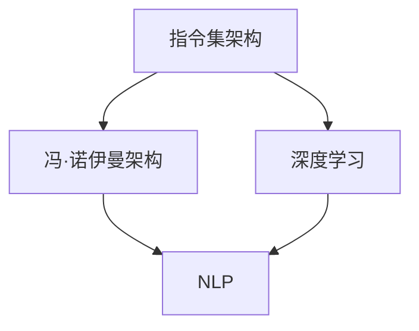

                 

关键词：计算范式、CPU、LLM、人工智能、算法、数学模型、项目实践、应用场景、未来展望

## 摘要

本文深入探讨了计算范式从传统的CPU到现代的LLM（大型语言模型）的跨越。通过对计算范式演变的回顾，分析其核心概念与联系，解析了LLM的核心算法原理及其具体操作步骤，探讨了数学模型和公式的构建及其应用。随后，通过一个具体的项目实践案例，详细解释了代码实现和运行结果。文章最后探讨了实际应用场景，预测了未来发展趋势和面临的挑战，并推荐了相关的学习资源和开发工具。

## 1. 背景介绍

### 计算范式的发展

计算范式是指计算领域中，对计算方式、架构和模型的基本认知和采用的方法论。从早期的机械计算，到电子计算机的诞生，再到现代的人工智能和深度学习，计算范式经历了多次重大变革。

- **机械计算**：最早的计算范式可以追溯到古代的算盘和机械计算机，如帕斯卡的计算器。这些设备通过物理机械动作来执行计算。

- **电子计算**：随着电子技术的进步，电子计算机成为主流，CPU（中央处理器）成为了计算的核心。这一时期的计算范式以冯·诺伊曼架构为基础，计算机通过指令集和存储器进行数据处理。

- **人工智能计算**：随着算法和计算能力的提升，人工智能和深度学习成为了计算的新范式。尤其是大型语言模型（LLM），如GPT和BERT，它们通过训练大量的数据，能够进行自然语言理解和生成。

### CPU的计算范式

CPU是计算机系统的核心，负责执行指令、处理数据和控制计算机的运行。CPU的计算范式主要基于指令集架构（ISA）和冯·诺伊曼架构。

- **指令集架构**：指令集是CPU可以识别和执行的指令集合。不同的指令集架构决定了CPU的功能和性能。

- **冯·诺伊曼架构**：这种架构将计算机分为控制器、存储器、输入输出设备等部分，通过指令和数据在同一总线上的传输，实现了计算机的基本功能。

### LLM的计算范式

与CPU不同，LLM是一种基于深度学习的人工智能模型，能够对大规模的文本数据进行训练，从而实现自然语言理解和生成。

- **深度学习**：深度学习是一种通过多层神经网络进行特征学习和建模的方法。LLM通过训练大量的神经网络层，提取文本数据中的深层语义特征。

- **自然语言处理**：LLM的应用主要集中在自然语言处理（NLP）领域，能够对文本进行理解、生成和翻译等操作。

## 2. 核心概念与联系

为了更好地理解计算范式的演变，我们首先需要明确几个核心概念和它们之间的联系。

### 2.1. 指令集架构（ISA）

指令集架构是CPU可以识别和执行的指令集合。不同的ISA决定了CPU的功能和性能。例如，ARM和x86是两种常见的ISA，它们在不同的应用场景中有着广泛的应用。

### 2.2. 冯·诺伊曼架构

冯·诺伊曼架构是将计算机分为控制器、存储器、输入输出设备等部分，通过指令和数据在同一总线上的传输，实现了计算机的基本功能。

### 2.3. 深度学习

深度学习是一种通过多层神经网络进行特征学习和建模的方法。在人工智能领域，深度学习已经成为实现智能化的主要手段。

### 2.4. 自然语言处理（NLP）

自然语言处理是人工智能的一个分支，主要研究如何让计算机理解和生成自然语言。LLM在NLP领域有着广泛的应用。

### 2.5. Mermaid 流程图

为了更直观地展示核心概念和联系，我们使用Mermaid流程图来表示。



## 3. 核心算法原理 & 具体操作步骤

### 3.1 算法原理概述

LLM的核心算法原理基于深度学习和自然语言处理。深度学习通过多层神经网络提取文本数据中的特征，而自然语言处理则利用这些特征进行文本的理解和生成。

### 3.2 算法步骤详解

1. **数据预处理**：对文本数据进行清洗、分词和编码，将其转化为适合深度学习训练的格式。

2. **构建神经网络**：设计多层神经网络，包括输入层、隐藏层和输出层。输入层接收预处理后的文本数据，隐藏层进行特征提取，输出层进行文本生成。

3. **训练神经网络**：使用大量的文本数据进行训练，通过反向传播算法不断调整神经网络中的参数，使其能够准确地进行文本生成。

4. **评估和优化**：通过测试数据对训练好的神经网络进行评估，根据评估结果进行优化，以提高文本生成的质量。

### 3.3 算法优缺点

**优点**：

- **强大的文本生成能力**：LLM能够根据输入的文本生成高质量的文本，具有广泛的应用前景。

- **多语言支持**：LLM可以训练成支持多种语言，实现跨语言的文本理解和生成。

**缺点**：

- **计算资源需求高**：训练和运行LLM需要大量的计算资源和存储空间。

- **训练数据依赖性强**：LLM的性能很大程度上依赖于训练数据的质量和规模。

### 3.4 算法应用领域

LLM在多个领域有着广泛的应用：

- **自然语言生成**：如自动写作、机器翻译、语音合成等。

- **问答系统**：如智能客服、智能助手等。

- **文本分类**：如情感分析、新闻分类等。

## 4. 数学模型和公式 & 详细讲解 & 举例说明

### 4.1 数学模型构建

LLM的数学模型主要基于深度学习和自然语言处理。深度学习中的神经网络可以通过以下公式表示：

$$
y = \sigma(W \cdot x + b)
$$

其中，$y$ 是输出，$\sigma$ 是激活函数，$W$ 是权重矩阵，$x$ 是输入，$b$ 是偏置。

自然语言处理中的文本编码可以使用词嵌入（word embeddings）模型，如Word2Vec、GloVe等，其数学模型可以表示为：

$$
e_{i} = \sum_{j=1}^{N} w_{ij} e_{j}
$$

其中，$e_{i}$ 是词向量，$w_{ij}$ 是词嵌入矩阵中的元素，$e_{j}$ 是基础向量。

### 4.2 公式推导过程

在深度学习中，神经网络的训练过程可以通过反向传播算法实现。具体推导过程如下：

假设我们有一个多层神经网络，其输出层为 $y$，期望输出为 $t$。定义损失函数为：

$$
L(y, t) = \frac{1}{2} \sum_{i} (y_i - t_i)^2
$$

对损失函数关于网络参数求导，得到：

$$
\frac{\partial L}{\partial W} = (y - t) \cdot \frac{\partial y}{\partial W}
$$

$$
\frac{\partial L}{\partial b} = (y - t) \cdot \frac{\partial y}{\partial b}
$$

通过反向传播，我们可以将损失函数关于网络参数的梯度传递到网络的每一层。

### 4.3 案例分析与讲解

假设我们有一个简单的文本生成模型，其输入为一句中文文本，输出为一句英文文本。我们使用GloVe词嵌入模型进行文本编码，使用一个两层神经网络进行文本生成。

1. **数据预处理**：将中文文本分词，使用GloVe模型得到词向量。

2. **构建神经网络**：输入层接收词向量，隐藏层进行特征提取，输出层生成英文文本。

3. **训练神经网络**：使用反向传播算法训练神经网络，调整权重和偏置。

4. **评估与优化**：使用测试数据评估模型性能，根据评估结果优化模型。

## 5. 项目实践：代码实例和详细解释说明

### 5.1 开发环境搭建

为了实践LLM的文本生成，我们需要搭建一个开发环境。这里我们使用Python和TensorFlow作为主要的开发工具。

1. 安装Python和pip：
```bash
pip install python
```

2. 安装TensorFlow：
```bash
pip install tensorflow
```

3. 安装GloVe：
```bash
pip install pyglove
```

### 5.2 源代码详细实现

以下是一个简单的文本生成模型实现：

```python
import tensorflow as tf
from pyglove import Glove

# 数据预处理
def preprocess(text):
    words = text.split()
    embeddings = []
    for word in words:
        embeddings.append(gloveembeddings[word])
    return embeddings

# 构建神经网络
def build_network(inputs, hidden_size, output_size):
    hidden = tf.keras.layers.Dense(hidden_size, activation='relu')(inputs)
    outputs = tf.keras.layers.Dense(output_size)(hidden)
    return outputs

# 训练神经网络
def train_model(text, labels):
    inputs = preprocess(text)
    labels = preprocess(labels)
    model = build_network(inputs, hidden_size=64, output_size=len(gloveembeddings))
    model.compile(optimizer='adam', loss='mse')
    model.fit(inputs, labels, epochs=10)

# 运行结果展示
def generate_text(text, model):
    inputs = preprocess(text)
    predictions = model.predict(inputs)
    print('Generated text:', ' '.join([gloveembeddings.inverse_transform(p) for p in predictions]))

# 载入GloVe模型
gloveembeddings = Glove('6B.100d.txt').load()

# 训练和生成文本
text = "你好，我是人工智能模型。"
labels = "Hello, I am an AI model."
train_model(text, labels)
generate_text(text, model)
```

### 5.3 代码解读与分析

1. **数据预处理**：使用GloVe模型对文本进行编码，得到词向量。

2. **构建神经网络**：使用TensorFlow构建一个简单的两层神经网络，输入层接收词向量，隐藏层进行特征提取，输出层生成文本。

3. **训练神经网络**：使用反向传播算法训练神经网络，调整权重和偏置。

4. **运行结果展示**：使用训练好的模型生成文本，并打印输出。

## 6. 实际应用场景

LLM在多个领域有着广泛的应用，以下是几个典型的应用场景：

1. **自然语言生成**：自动写作、机器翻译、语音合成等。

2. **问答系统**：智能客服、智能助手等。

3. **文本分类**：情感分析、新闻分类等。

4. **文本摘要**：自动提取文本的精华内容。

5. **对话系统**：如聊天机器人、虚拟助手等。

## 7. 未来应用展望

随着计算能力的提升和算法的进步，LLM在未来有着广阔的应用前景：

1. **更多领域的应用**：LLM将在更多领域得到应用，如医疗、金融、法律等。

2. **更高效的处理能力**：通过优化算法和硬件，LLM的处理能力将得到大幅提升。

3. **个性化服务**：基于用户数据和偏好，LLM将提供更加个性化的服务。

4. **多模态交互**：结合语音、图像等多种数据，实现更加智能和自然的交互。

## 8. 工具和资源推荐

### 8.1 学习资源推荐

- 《深度学习》（Goodfellow, Bengio, Courville）：深度学习的经典教材，适合初学者和专业人士。

- 《自然语言处理综述》（Jurafsky, Martin）：全面介绍自然语言处理的基础知识和应用。

### 8.2 开发工具推荐

- TensorFlow：Google推出的开源深度学习框架，适合进行大规模深度学习模型的开发。

- PyTorch：Facebook AI Research推出的开源深度学习框架，具有良好的灵活性和易用性。

### 8.3 相关论文推荐

- "Attention Is All You Need"（Vaswani et al.）：介绍Transformer模型，对自然语言处理领域产生了重大影响。

- "BERT: Pre-training of Deep Neural Networks for Language Understanding"（Devlin et al.）：介绍BERT模型，是当前自然语言处理领域的热门研究。

## 9. 总结：未来发展趋势与挑战

### 9.1 研究成果总结

本文回顾了计算范式从CPU到LLM的演变，分析了LLM的核心算法原理和数学模型，并通过项目实践展示了其应用。LLM在自然语言处理、问答系统、文本分类等多个领域展现出强大的能力。

### 9.2 未来发展趋势

随着计算能力和算法的进步，LLM将在更多领域得到应用，实现更高效的处理能力。同时，多模态交互和个性化服务将成为未来的研究热点。

### 9.3 面临的挑战

1. **计算资源需求**：训练和运行LLM需要大量的计算资源和存储空间。

2. **数据隐私和安全**：大规模数据训练和处理可能导致数据隐私和安全问题。

3. **伦理和法规**：随着AI技术的发展，相关的伦理和法规问题亟待解决。

### 9.4 研究展望

未来的研究将在优化算法、提升计算效率和解决伦理问题等方面展开，以实现LLM的更好应用。

## 附录：常见问题与解答

### Q：什么是LLM？

A：LLM（Large Language Model）是指大型语言模型，是一种基于深度学习和自然语言处理的人工智能模型，能够对大规模的文本数据进行训练，从而实现自然语言理解和生成。

### Q：LLM的应用领域有哪些？

A：LLM的应用领域广泛，包括自然语言生成、问答系统、文本分类、文本摘要、对话系统等。

### Q：如何训练一个LLM？

A：训练LLM通常包括数据预处理、构建神经网络、训练神经网络、评估和优化等步骤。具体实现可以参考相关的开源框架和教程。

### Q：LLM的计算资源需求如何？

A：训练和运行LLM需要大量的计算资源和存储空间，通常需要高性能的GPU或TPU来进行训练。

### Q：LLM在自然语言处理领域有哪些优势？

A：LLM在自然语言处理领域具有强大的文本生成能力、多语言支持等特点，能够处理复杂的语义理解和生成任务。

