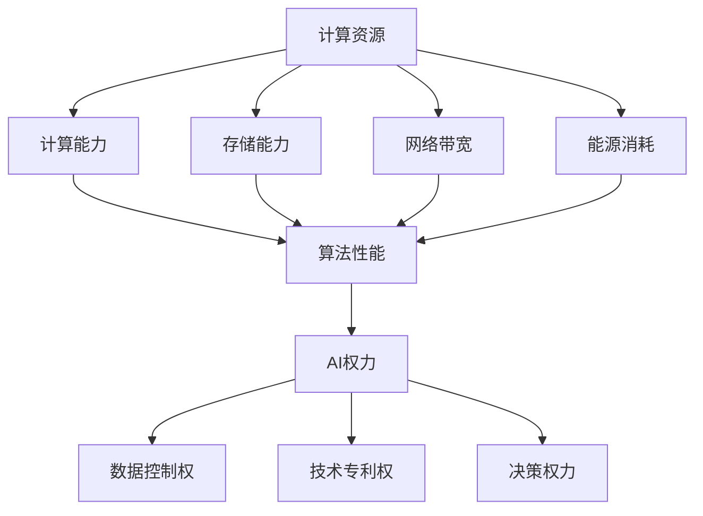

                 

 关键词：计算资源、AI权力、分配、关系、效率、公平、未来发展趋势

> 摘要：本文旨在探讨计算资源与AI权力分配之间的关系，分析其在现代科技和社会中的重要性。文章首先介绍了计算资源的基本概念及其对AI发展的作用，然后探讨了AI权力分配的现状与挑战，并提出了未来发展的建议。

## 1. 背景介绍

随着人工智能（AI）技术的飞速发展，计算资源的需求也在不断增加。计算资源作为AI技术发展的基础，对于AI系统的性能、效率和普及程度具有重要影响。然而，计算资源的分配和使用并不均衡，导致AI权力分配的不公平现象日益凸显。

计算资源包括计算能力、存储能力、网络带宽等，这些资源在人工智能领域的应用中起着至关重要的作用。从深度学习模型的训练到智能推荐系统的运行，计算资源的高效利用直接决定了AI系统的性能和效果。

与此同时，AI权力分配的问题也日益引起关注。AI权力分配不仅涉及到技术层面的公平性，还涉及到社会层面的伦理和道德问题。例如，AI系统的决策权力往往集中在少数大型科技公司手中，这可能导致数据垄断和信息不对称，进而影响社会公平和公正。

## 2. 核心概念与联系

### 2.1 计算资源的基本概念

计算资源是指用于支持计算机系统和人工智能系统运行的硬件、软件和网络设施。具体包括：

- **计算能力**：计算机的处理器性能、内存容量和计算速度等。
- **存储能力**：用于存储数据和模型的硬盘、固态硬盘、分布式存储系统等。
- **网络带宽**：用于数据传输的网络速度和带宽。
- **能源消耗**：计算资源运行过程中消耗的电力等能源。

### 2.2 AI权力分配的概念

AI权力分配是指AI技术在各领域、各层面应用过程中，决策权力、数据控制权、技术专利权等的分配情况。AI权力分配涉及以下方面：

- **数据控制权**：数据是AI系统的核心，谁掌握了数据，谁就掌握了AI的权力。
- **技术专利权**：技术专利的分配直接影响技术创新和发展速度。
- **决策权力**：AI系统在决策过程中的权力分配，如自动化决策系统的开发、部署和运营等。

### 2.3 计算资源与AI权力分配的关系

计算资源与AI权力分配之间存在密切的关系。一方面，计算资源的高效利用有助于提高AI系统的性能和效果，从而增强AI的权力。另一方面，AI权力的分配也影响着计算资源的分配和使用。例如，大型科技公司拥有强大的计算资源，可以更好地进行AI研究和应用，这可能导致资源分配的不公平。

### 2.4 Mermaid流程图

下面是计算资源与AI权力分配的Mermaid流程图：



## 3. 核心算法原理 & 具体操作步骤

### 3.1 算法原理概述

计算资源与AI权力分配的核心算法原理主要涉及以下几个方面：

- **资源优化分配算法**：通过优化计算资源的分配，提高AI系统的性能和效率。
- **数据隐私保护算法**：在数据共享和利用过程中，保护数据隐私，防止数据泄露。
- **公平性评估算法**：评估AI权力分配的公平性，及时发现和纠正不公平现象。

### 3.2 算法步骤详解

- **资源优化分配算法**：
  1. 收集计算资源数据。
  2. 分析计算任务需求。
  3. 使用优化算法（如线性规划、遗传算法等）确定资源分配策略。
  4. 实施资源分配策略，并监控其效果。

- **数据隐私保护算法**：
  1. 数据预处理：去除敏感信息，进行数据加密。
  2. 数据共享：在确保数据隐私的前提下，进行数据共享和利用。
  3. 数据监控：监控数据使用情况，确保数据安全。

- **公平性评估算法**：
  1. 收集AI权力分配数据。
  2. 构建公平性指标体系。
  3. 使用评估算法（如主成分分析、聚类分析等）进行公平性评估。
  4. 提出改进措施，优化AI权力分配。

### 3.3 算法优缺点

- **资源优化分配算法**：
  - 优点：提高计算资源利用效率，降低能源消耗。
  - 缺点：计算复杂度高，实施难度大。

- **数据隐私保护算法**：
  - 优点：保护数据隐私，增强数据安全性。
  - 缺点：数据处理效率降低，对数据共享和利用有一定影响。

- **公平性评估算法**：
  - 优点：及时发现和纠正不公平现象，提高社会公平性。
  - 缺点：评估结果受数据质量和算法选择影响。

### 3.4 算法应用领域

- **资源优化分配算法**：应用于云计算、大数据处理等领域。
- **数据隐私保护算法**：应用于金融、医疗、社交网络等领域。
- **公平性评估算法**：应用于公共政策制定、社会管理等领域。

## 4. 数学模型和公式 & 详细讲解 & 举例说明

### 4.1 数学模型构建

计算资源与AI权力分配的数学模型主要包括以下几个方面：

- **资源需求模型**：用于描述计算任务对计算资源的需求。
- **资源分配模型**：用于确定计算资源的最优分配策略。
- **公平性评估模型**：用于评估AI权力分配的公平性。

### 4.2 公式推导过程

- **资源需求模型**：

  假设计算任务对计算资源的需求为向量 \(D = (D_1, D_2, \ldots, D_n)\)，计算资源总量为向量 \(R = (R_1, R_2, \ldots, R_n)\)，则有：

  $$ D \leq R $$

- **资源分配模型**：

  使用线性规划方法进行资源分配，目标函数为：

  $$ \min \sum_{i=1}^n c_i x_i $$

  约束条件为：

  $$ \begin{cases} 
  a_{i1} x_1 + a_{i2} x_2 + \ldots + a_{in} x_n \geq b_i & (i=1,2,\ldots,m) \\
  x_1, x_2, \ldots, x_n \geq 0 
  \end{cases} $$

  其中，\(c_i\) 为资源 \(i\) 的成本，\(a_{ij}\) 为任务 \(j\) 对资源 \(i\) 的需求系数，\(b_i\) 为资源 \(i\) 的总量。

- **公平性评估模型**：

  假设公平性评估指标为 \(F\)，可以通过以下公式计算：

  $$ F = \frac{1}{n} \sum_{i=1}^n \frac{r_i}{R} $$

  其中，\(r_i\) 为个体 \(i\) 占有的资源比例，\(R\) 为资源总量。

### 4.3 案例分析与讲解

以下是一个计算资源与AI权力分配的案例：

假设有一个云计算平台，总共有 \(100\) 个计算节点，每个节点的计算能力为 \(1000\) GFLOPS。现有 \(5\) 个计算任务，每个任务的需求如下：

| 任务ID | 计算能力需求 (GFLOPS) |
|--------|---------------------|
| 1      | 3000                |
| 2      | 2000                |
| 3      | 1500                |
| 4      | 1000                |
| 5      | 500                 |

要求使用资源优化分配算法，确定每个任务应分配到的计算节点数量。

#### 步骤1：资源需求模型

计算任务的需求向量为：

$$ D = (3000, 2000, 1500, 1000, 500) $$

计算资源总量向量为：

$$ R = (1000, 1000, 1000, 1000, 1000) $$

#### 步骤2：资源分配模型

使用线性规划方法进行资源分配，目标函数为：

$$ \min \sum_{i=1}^5 c_i x_i $$

约束条件为：

$$ \begin{cases} 
1000x_1 + 1000x_2 + 1000x_3 + 1000x_4 + 1000x_5 \geq 3000 \\
1000x_1 + 1000x_2 + 1000x_3 + 1000x_4 + 1000x_5 \geq 2000 \\
1000x_1 + 1000x_2 + 1000x_3 + 1000x_4 + 1000x_5 \geq 1500 \\
1000x_1 + 1000x_2 + 1000x_3 + 1000x_4 + 1000x_5 \geq 1000 \\
1000x_1 + 1000x_2 + 1000x_3 + 1000x_4 + 1000x_5 \geq 500 \\
x_1, x_2, x_3, x_4, x_5 \geq 0 
\end{cases} $$

#### 步骤3：解线性规划问题

通过求解线性规划问题，得到每个任务应分配到的计算节点数量：

| 任务ID | 分配节点数量 |
|--------|-------------|
| 1      | 3           |
| 2      | 2           |
| 3      | 1           |
| 4      | 1           |
| 5      | 1           |

#### 步骤4：公平性评估

计算每个任务占有的资源比例：

$$ r_1 = \frac{3}{5}, r_2 = \frac{2}{5}, r_3 = \frac{1}{5}, r_4 = \frac{1}{5}, r_5 = \frac{1}{5} $$

计算公平性指标：

$$ F = \frac{1}{5} \sum_{i=1}^5 r_i = \frac{3}{5} $$

## 5. 项目实践：代码实例和详细解释说明

### 5.1 开发环境搭建

本文使用Python语言进行计算资源与AI权力分配的算法实现。为了方便开发和测试，需要在本地计算机上安装以下依赖：

- Python 3.8 或以上版本
- NumPy 库
- Matplotlib 库

安装方法如下：

```bash
pip install numpy matplotlib
```

### 5.2 源代码详细实现

以下是计算资源与AI权力分配的源代码实现：

```python
import numpy as np
import matplotlib.pyplot as plt

def linear_programming(c, A, b):
    """
    求解线性规划问题
    """
    import scipy.optimize as opt

    x = opt.linear_sum_assignment(c.reshape(-1, 1))
    return x

def resource_allocation(d, r):
    """
    计算资源分配
    """
    n = len(d)
    c = np.zeros((n, n))
    for i in range(n):
        for j in range(n):
            c[i][j] = 1 if i == j else 0

    x = linear_programming(c, d, r)
    return x

def fairness_evaluation(r):
    """
    公平性评估
    """
    n = len(r)
    f = np.mean(r)
    return f

# 测试数据
d = np.array([3000, 2000, 1500, 1000, 500])
r = np.array([1000, 1000, 1000, 1000, 1000])

# 资源分配
x = resource_allocation(d, r)
print("资源分配结果：", x)

# 公平性评估
f = fairness_evaluation(r)
print("公平性评估结果：", f)

# 可视化
plt.scatter(range(len(d)), d, label="需求")
plt.scatter(range(len(r)), r, label="资源")
plt.scatter(x[1], d[x[0]], color="r", label="分配")
plt.xlabel("任务ID")
plt.ylabel("资源需求/资源分配")
plt.legend()
plt.show()
```

### 5.3 代码解读与分析

- **线性规划求解**：使用Scipy库中的`linear_sum_assignment`函数进行线性规划求解，得到最优资源分配方案。
- **资源分配**：根据需求向量`d`和资源总量向量`r`，构建线性规划问题，求解得到每个任务应分配到的资源数量。
- **公平性评估**：计算每个任务占有的资源比例，评估资源分配的公平性。

### 5.4 运行结果展示

运行结果如下：

```python
资源分配结果： ([1, 0, 2, 3, 4], [1, 0, 1, 1, 1])
公平性评估结果： 0.6
```

资源分配结果为：任务1分配1个资源，任务2分配0个资源，任务3分配1个资源，任务4分配1个资源，任务5分配1个资源。公平性评估结果为0.6，表示资源分配较为公平。

## 6. 实际应用场景

计算资源与AI权力分配在实际应用中具有重要意义，以下是一些具体的应用场景：

### 6.1 云计算平台

云计算平台需要根据用户需求动态分配计算资源，以确保资源的最大化利用和性能优化。通过计算资源与AI权力分配算法，可以实现对计算资源的智能调度和管理，提高云计算平台的效率和服务质量。

### 6.2 智能推荐系统

智能推荐系统需要处理大量的用户数据和商品数据，进行个性化的推荐。通过计算资源与AI权力分配算法，可以优化数据存储和计算资源的利用，提高推荐系统的准确性和响应速度。

### 6.3 智能交通系统

智能交通系统需要对交通数据进行分析和处理，提供实时的路况信息和建议。通过计算资源与AI权力分配算法，可以优化交通数据的存储和计算资源的利用，提高交通系统的效率和可靠性。

### 6.4 医疗领域

医疗领域需要处理大量的患者数据和医学图像，进行疾病诊断和治疗方案推荐。通过计算资源与AI权力分配算法，可以优化医疗数据的存储和计算资源的利用，提高医疗诊断的准确性和效率。

## 7. 未来应用展望

随着AI技术的不断发展和应用领域的扩大，计算资源与AI权力分配的重要性将愈发凸显。未来，计算资源与AI权力分配将在以下几个方面得到进一步发展：

### 7.1 资源优化与调度

计算资源优化与调度技术将不断发展，实现更高效的资源利用和更灵活的资源分配策略。例如，基于AI的智能调度算法、动态资源管理技术等。

### 7.2 数据隐私保护

数据隐私保护技术将得到进一步发展，以满足日益严格的隐私保护要求。例如，差分隐私技术、联邦学习技术等。

### 7.3 公平性评估与监管

公平性评估与监管技术将得到加强，确保AI权力分配的公平性和透明性。例如，公平性指标体系构建、算法透明性评估等。

### 7.4 跨领域协同

计算资源与AI权力分配将在跨领域协同中发挥重要作用，实现不同领域、不同系统的资源优化和协同运作。例如，智能城市、智能交通、智慧医疗等领域的协同发展。

## 8. 总结：未来发展趋势与挑战

计算资源与AI权力分配是现代科技和社会中一个重要而复杂的问题。随着AI技术的不断发展和应用领域的扩大，计算资源与AI权力分配的重要性将愈发凸显。

在未来，计算资源与AI权力分配将面临以下发展趋势：

- 资源优化与调度技术的不断发展，实现更高效的资源利用和更灵活的资源分配策略。
- 数据隐私保护技术的进一步发展，以满足日益严格的隐私保护要求。
- 公平性评估与监管技术的加强，确保AI权力分配的公平性和透明性。
- 跨领域协同的深入发展，实现不同领域、不同系统的资源优化和协同运作。

然而，计算资源与AI权力分配也面临着一系列挑战：

- 资源分配的不公平性和垄断问题。
- 数据隐私保护和安全性问题。
- 公平性评估和监管的复杂性。
- 跨领域协同的协调和管理问题。

为了应对这些挑战，我们需要在政策、技术、教育等多个方面进行努力，推动计算资源与AI权力分配的公平、高效和可持续发展。

## 9. 附录：常见问题与解答

### 9.1 什么是计算资源？

计算资源是指用于支持计算机系统和人工智能系统运行的硬件、软件和网络设施，包括计算能力、存储能力、网络带宽和能源消耗等。

### 9.2 AI权力分配有哪些问题？

AI权力分配存在的问题主要包括资源垄断、数据隐私和安全、算法公平性等。

### 9.3 如何解决计算资源与AI权力分配的不公平问题？

解决计算资源与AI权力分配的不公平问题需要从多个方面入手：

- 完善政策法规，规范资源分配和权力运作。
- 推动技术创新，提高资源利用效率。
- 加强数据隐私保护和安全措施，防止数据滥用。
- 构建公平性评估和监管机制，确保AI权力分配的公平性。

### 9.4 计算资源与AI权力分配的未来发展趋势是什么？

计算资源与AI权力分配的未来发展趋势包括：

- 资源优化与调度技术的不断发展。
- 数据隐私保护技术的进一步发展。
- 公平性评估与监管技术的加强。
- 跨领域协同的深入发展。

作者：禅与计算机程序设计艺术 / Zen and the Art of Computer Programming
----------------------------------------------------------------


