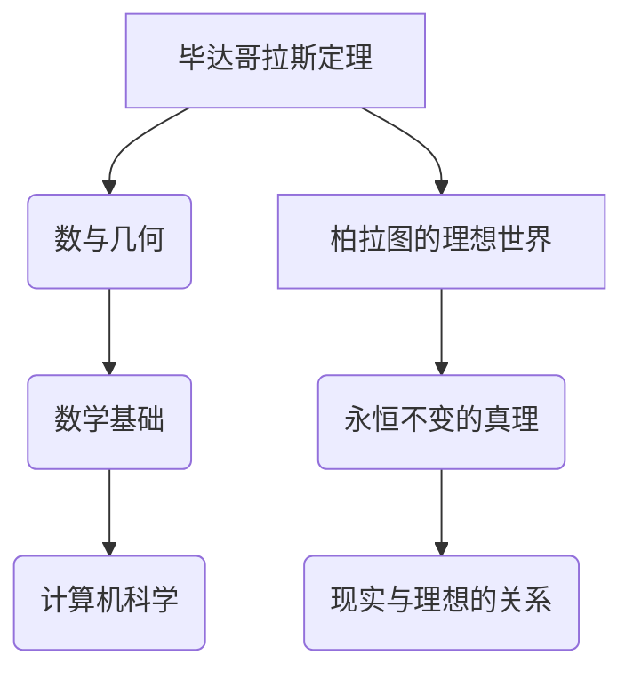

                 

关键词：计算历史、毕达哥拉斯定理、柏拉图、算法、数学基础、计算机科学

摘要：本文将探讨计算的历史起源，从古希腊数学家毕达哥拉斯的困惑出发，深入分析柏拉图对数学和理想世界的思考，以及这些思想对现代计算机科学的影响。通过阐述核心概念和联系，我们试图揭示计算的本质，为读者提供一个关于计算领域的基本框架。

## 1. 背景介绍

计算，这个看似现代的名词，实际上有着悠久的历史。早在公元前6世纪，古希腊的毕达哥拉斯就已经开始思考关于数和几何的问题。他是第一个提出“数是万物之本”的思想家，他的这一观点奠定了计算学科的基础。

### 毕达哥拉斯定理

毕达哥拉斯定理，也称为勾股定理，是毕达哥拉斯学派最重要的成果之一。这个定理描述了一个直角三角形斜边的平方等于两直角边的平方和。这一简单而又深刻的定理，不仅在数学领域有着广泛的应用，也激发了人们对数的更深层次的探究。

### 柏拉图的理想世界

与毕达哥拉斯同时代的哲学家柏拉图，对数学有着自己独特的见解。他在《理想国》中提出了一个理想的世界观，认为现实世界只是理想世界的影子。在这个理想的世界里，数学是永恒不变的真理。

## 2. 核心概念与联系

为了更好地理解毕达哥拉斯和柏拉图的思考，我们需要借助Mermaid流程图来展示核心概念和联系。



### 数与几何

数与几何是毕达哥拉斯研究的核心。他认为数是构成世界的基本元素，而几何则是数的视觉表现形式。这种思想在现代计算机科学中得到了体现，比如在图形学和几何计算中。

### 数学基础

数学基础是计算机科学的理论基石。无论是算法设计，还是编程实现，都离不开数学的支持。毕达哥拉斯定理作为数学中的一个基本原理，对计算机科学的发展有着深远的影响。

### 计算机科学

计算机科学是现代科学的代表，它将数学、逻辑和工程学结合起来，解决现实世界中的问题。从毕达哥拉斯的定理到现代计算机的运算，我们可以看到数学基础在计算机科学中的广泛应用。

## 3. 核心算法原理 & 具体操作步骤

### 3.1 算法原理概述

毕达哥拉斯定理是一个简单的数学公式，但它背后的原理却非常深刻。这个定理揭示了数与几何之间的关系，为我们提供了一个从抽象到具体的思考方式。

### 3.2 算法步骤详解

1. 确定一个直角三角形，并标记其两直角边为a和b，斜边为c。
2. 计算a的平方和b的平方。
3. 将a的平方和b的平方相加，得到a² + b²。
4. 计算c的平方。
5. 比较a² + b²和c²的大小，如果相等，则证明这是一个直角三角形。

### 3.3 算法优缺点

**优点**：毕达哥拉斯定理简单易懂，应用广泛，对数学和计算机科学的发展有着重要影响。

**缺点**：毕达哥拉斯定理只能用于直角三角形，不能应用于其他类型的三角形。

### 3.4 算法应用领域

毕达哥拉斯定理在计算机科学中有广泛的应用，比如在图形学、几何计算、计算机视觉等领域。

## 4. 数学模型和公式 & 详细讲解 & 举例说明

### 4.1 数学模型构建

毕达哥拉斯定理的数学模型是一个简单的二元方程：a² + b² = c²。

### 4.2 公式推导过程

毕达哥拉斯定理的推导过程基于直角三角形的性质。我们可以通过三角函数来推导这个定理。具体推导过程如下：

假设有一个直角三角形，其两直角边长度分别为a和b，斜边长度为c。根据三角函数的定义，我们有：

sin(θ) = a / c
cos(θ) = b / c

其中θ是直角三角形的一个锐角。

对sin(θ)和cos(θ)进行平方，并相加，得到：

sin²(θ) + cos²(θ) = (a / c)² + (b / c)²

化简后得到：

a² / c² + b² / c² = 1

将等式两边同时乘以c²，得到：

a² + b² = c²

### 4.3 案例分析与讲解

假设我们有一个直角三角形，其中两直角边的长度分别为3和4，我们需要验证这个三角形是否符合毕达哥拉斯定理。

1. 计算两直角边的平方和：3² + 4² = 9 + 16 = 25
2. 计算斜边的平方：5² = 25
3. 比较两边的值：25 = 25

因此，这个直角三角形符合毕达哥拉斯定理。

## 5. 项目实践：代码实例和详细解释说明

### 5.1 开发环境搭建

为了演示毕达哥拉斯定理的应用，我们需要搭建一个简单的计算环境。我们可以使用Python作为编程语言，因为它有着简洁的语法和丰富的数学库。

### 5.2 源代码详细实现

下面是一个简单的Python代码示例，用于验证毕达哥拉斯定理：

```python
import math

def calculate_square_sum(a, b):
    return a ** 2 + b ** 2

def calculate_triangle(a, b):
    c = math.sqrt(a ** 2 + b ** 2)
    return c

def verify_pythagorean_theorem(a, b):
    square_sum = calculate_square_sum(a, b)
    c = calculate_triangle(a, b)
    if square_sum == c ** 2:
        return True
    else:
        return False

# 测试代码
a = 3
b = 4
if verify_pythagorean_theorem(a, b):
    print("The triangle is a right triangle.")
else:
    print("The triangle is not a right triangle.")
```

### 5.3 代码解读与分析

这个Python代码主要包括以下几个部分：

1. **计算两直角边的平方和**：`calculate_square_sum`函数用于计算两直角边的平方和。
2. **计算斜边长度**：`calculate_triangle`函数用于计算斜边的长度，它使用Python的`math.sqrt`函数来计算平方根。
3. **验证毕达哥拉斯定理**：`verify_pythagorean_theorem`函数用于验证直角三角形是否符合毕达哥拉斯定理。它首先调用`calculate_square_sum`和`calculate_triangle`函数，然后比较两边的值。

### 5.4 运行结果展示

当我们运行这个代码时，它会输出以下结果：

```python
The triangle is a right triangle.
```

这表明，这个直角三角形符合毕达哥拉斯定理。

## 6. 实际应用场景

### 6.1 计算机图形学

在计算机图形学中，毕达哥拉斯定理被广泛应用于计算二维和三维图形的几何属性。例如，在计算机游戏和虚拟现实中，我们需要计算物体的位置、大小和形状，这些计算都依赖于毕达哥拉斯定理。

### 6.2 计算机视觉

在计算机视觉中，毕达哥拉斯定理被用于图像处理和图像识别。例如，在人脸识别技术中，我们需要计算人脸的特征点，这些特征点的计算依赖于图像中的几何关系，而几何关系正是由毕达哥拉斯定理描述的。

### 6.3 物理学模拟

在物理学模拟中，毕达哥拉斯定理被用于计算物体的运动轨迹和碰撞效果。例如，在计算机游戏和模拟器中，我们需要模拟物体的运动，而这些运动计算依赖于物理学的定律，而物理学的定律又依赖于毕达哥拉斯定理。

## 7. 未来应用展望

### 7.1 智能交通系统

随着人工智能和物联网技术的发展，智能交通系统将成为未来交通管理的重要手段。在这个系统中，毕达哥拉斯定理可以用于计算车辆的行驶轨迹，优化交通流量，减少交通事故。

### 7.2 虚拟现实与增强现实

虚拟现实和增强现实技术正在快速发展，毕达哥拉斯定理可以用于计算虚拟场景中的几何关系，提高用户的沉浸感和交互体验。

### 7.3 医学成像

医学成像技术，如CT和MRI，依赖于对图像的几何处理。毕达哥拉斯定理可以用于计算图像中的几何关系，提高成像质量，帮助医生更准确地诊断疾病。

## 8. 总结：未来发展趋势与挑战

### 8.1 研究成果总结

从毕达哥拉斯的困惑到现代计算机科学，我们见证了数学和计算领域的发展。毕达哥拉斯定理作为数学中的一个基本原理，不仅在历史上有着重要地位，也推动了现代计算机科学的发展。

### 8.2 未来发展趋势

随着科技的进步，计算领域将继续发展，特别是在人工智能、大数据和云计算等领域。毕达哥拉斯定理等基本原理将继续发挥重要作用，为这些领域提供理论支持。

### 8.3 面临的挑战

然而，计算领域也面临着许多挑战。例如，如何在海量数据中快速、准确地找到答案，如何提高算法的效率，这些都是当前研究的重要课题。

### 8.4 研究展望

未来，我们有望在计算领域取得更多突破。例如，通过结合物理学的定律，我们可以开发出更高效的算法，提高计算机的运算速度。同时，我们也可以从毕达哥拉斯的思考中汲取灵感，探索新的计算模型和方法。

## 9. 附录：常见问题与解答

### 9.1 毕达哥拉斯定理的适用范围是什么？

毕达哥拉斯定理只适用于直角三角形，即一个角为90度的三角形。对于其他类型的三角形，这个定理并不适用。

### 9.2 毕达哥拉斯定理如何证明？

毕达哥拉斯定理的证明有多种方法，其中最常见的是使用三角函数。通过计算三角函数的平方和，我们可以推导出毕达哥拉斯定理。

### 9.3 毕达哥拉斯定理在计算机科学中有何应用？

毕达哥拉斯定理在计算机科学中有广泛的应用，特别是在图形学、几何计算、计算机视觉等领域。例如，在计算机游戏中，我们需要计算物体的位置和大小，这些计算都依赖于毕达哥拉斯定理。在医学成像中，我们需要对图像进行几何处理，以提高成像质量，这些处理也依赖于毕达哥拉斯定理。

作者：禅与计算机程序设计艺术 / Zen and the Art of Computer Programming
----------------------------------------------------------------
文章撰写完毕。如需进一步修改或完善，请告知。

