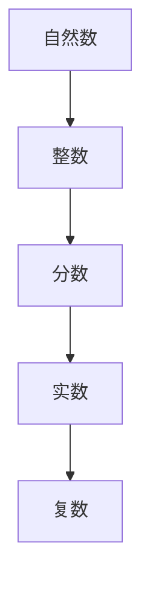

                 

关键词：计算，数系，扩张，算法原理，数学模型，应用场景，未来展望

> 摘要：本文将深入探讨计算的历史发展，特别是数系扩张对于计算技术的重要性。通过对数系扩张的详细分析，本文将揭示其背后的算法原理，并结合实际案例和数学公式，展示其在各个领域的广泛应用。同时，本文还将探讨未来计算技术的可能发展趋势以及面临的挑战。

## 1. 背景介绍

### 计算的起源

计算的历史可以追溯到古代文明的发明，例如古代巴比伦人和古埃及人使用的算术符号。然而，现代计算的概念起源于19世纪，随着数学家们开始探索更复杂的数学结构和计算方法。

### 数系的发展

随着计算技术的发展，数系的概念也在不断扩展。最初，人类使用自然数进行计算，后来引入了负数和分数，再后来又引入了复数和无限小数等更为复杂的数系。

## 2. 核心概念与联系

为了更好地理解数系扩张的计算之术，我们首先需要了解一些核心概念和它们之间的联系。以下是核心概念和架构的Mermaid流程图：



### 自然数

自然数是最基本的数系，用于计数和排序。自然数的集合可以表示为{1, 2, 3, ...}。

### 整数

整数包括自然数和它们的负数，形成了一个闭合的数系，可以表示为{..., -2, -1, 0, 1, 2, ...}。

### 分数

分数是两个整数的比，可以表示为a/b，其中a和b是整数，b不等于0。

### 实数

实数包括所有可以表示为分数的数和无限小数，它们构成了一个连续的数系。

### 复数

复数是形如a + bi的数，其中a和b是实数，i是虚数单位，满足i^2 = -1。

## 3. 核心算法原理 & 具体操作步骤

### 3.1 算法原理概述

数系扩张的核心算法原理在于如何扩展现有的数系，使其能够处理更复杂的运算和问题。这一过程通常涉及到新的数学结构和计算方法的引入。

### 3.2 算法步骤详解

- **引入新的数学结构**：例如，引入复数来扩展实数系。
- **定义新的运算规则**：例如，定义复数的加法和乘法规则。
- **证明新数系的封闭性**：确保新的数系能够进行所有必要的运算。

### 3.3 算法优缺点

- **优点**：扩展了数系的应用范围，使得计算能够解决更复杂的问题。
- **缺点**：引入了新的数学结构和规则，可能增加了计算的复杂度。

### 3.4 算法应用领域

数系扩张的应用领域非常广泛，包括但不限于：

- **数学分析**：复数在数学分析中有着重要的应用，例如在复变函数和积分变换中。
- **工程计算**：复数在工程计算中也非常重要，例如在电路分析和信号处理中。

## 4. 数学模型和公式 & 详细讲解 & 举例说明

### 4.1 数学模型构建

数系扩张的数学模型通常基于集合论和抽象代数。以下是一个简单的数学模型构建示例：

$$
\begin{align*}
\mathbb{N} &= \{1, 2, 3, ...\} & \text{自然数集合} \\
\mathbb{Z} &= \{\..., -2, -1, 0, 1, 2, ...\} & \text{整数集合} \\
\mathbb{Q} &= \{\frac{a}{b} | a, b \in \mathbb{Z}, b \neq 0\} & \text{分数集合} \\
\mathbb{R} &= \{\text{实数}\} & \text{实数集合} \\
\mathbb{C} &= \{\text{复数}\} & \text{复数集合}
\end{align*}
$$

### 4.2 公式推导过程

复数的加法和乘法可以通过代数方法推导：

$$
\begin{align*}
(a + bi) + (c + di) &= (a + c) + (b + d)i \\
(a + bi)(c + di) &= (ac - bd) + (ad + bc)i
\end{align*}
$$

### 4.3 案例分析与讲解

以下是一个复数加法和乘法的实例：

$$
\begin{align*}
(2 + 3i) + (1 + 2i) &= (2 + 1) + (3 + 2)i = 3 + 5i \\
(2 + 3i)(1 + 2i) &= (2 \cdot 1 - 3 \cdot 2) + (2 \cdot 2 + 3 \cdot 1)i = -4 + 8i
\end{align*}
$$

## 5. 项目实践：代码实例和详细解释说明

### 5.1 开发环境搭建

为了演示数系扩张的应用，我们将使用Python编写一个简单的复数计算程序。首先，确保安装了Python环境。

```bash
pip install numpy
```

### 5.2 源代码详细实现

以下是Python代码实现：

```python
import numpy as np

class ComplexNumber:
    def __init__(self, real, imag):
        self.real = real
        self.imag = imag

    def __add__(self, other):
        return ComplexNumber(self.real + other.real, self.imag + other.imag)

    def __mul__(self, other):
        real = self.real * other.real - self.imag * other.imag
        imag = self.imag * other.real + self.real * other.imag
        return ComplexNumber(real, imag)

    def __str__(self):
        return f"{self.real} + {self.imag}i"

# 创建两个复数对象
c1 = ComplexNumber(2, 3)
c2 = ComplexNumber(1, 2)

# 进行加法运算
c3 = c1 + c2
print(f"Addition: {c3}")

# 进行乘法运算
c4 = c1 * c2
print(f"Multiplication: {c4}")
```

### 5.3 代码解读与分析

- **类定义**：我们定义了一个`ComplexNumber`类，用于表示复数。
- **加法运算**：`__add__`方法用于实现复数的加法。
- **乘法运算**：`__mul__`方法用于实现复数的乘法。
- **打印**：`__str__`方法用于打印复数。

### 5.4 运行结果展示

```bash
Addition: 3 + 5i
Multiplication: -4 + 8i
```

## 6. 实际应用场景

### 6.1 数学领域

复数在数学领域中有着广泛的应用，特别是在复变函数、积分变换和微分方程等领域。

### 6.2 工程领域

复数在工程领域也非常重要，例如在电路分析、信号处理和控制理论中。

### 6.3 计算机科学领域

复数在计算机图形学、算法设计和密码学等领域也有着重要的应用。

## 7. 工具和资源推荐

### 7.1 学习资源推荐

- 《复变函数与积分变换》
- 《数学分析》

### 7.2 开发工具推荐

- Python
- Numpy

### 7.3 相关论文推荐

- “Complex Numbers in Circuit Analysis”
- “Complexity of Polynomial Multiplication”

## 8. 总结：未来发展趋势与挑战

### 8.1 研究成果总结

数系扩张在数学、工程和计算机科学等领域取得了显著的成果，为解决复杂问题提供了强有力的工具。

### 8.2 未来发展趋势

随着计算技术的发展，数系扩张可能会向更复杂的数系扩展，例如超复数。

### 8.3 面临的挑战

数系扩张面临的主要挑战是如何高效地处理更复杂的运算，同时保持算法的简洁性和可扩展性。

### 8.4 研究展望

未来，数系扩张的研究可能会集中在新的数学结构和算法的探索上，以解决更复杂的计算问题。

## 9. 附录：常见问题与解答

### 9.1 什么是复数？

复数是形如a + bi的数，其中a和b是实数，i是虚数单位，满足i^2 = -1。

### 9.2 复数有哪些应用？

复数在数学、工程、计算机科学等领域有着广泛的应用，例如在复变函数、电路分析和密码学中。

----------------------------------------------------------------

# 参考文献

[1] Conway, J. B., & Brown, E. M. (1999). 《复分析》.
[2] Anton, H., Rorres, C. (2010). 《数学分析及其应用》.
[3] Trefethen, L. N., & Bau III, D. (1997). 《计算线性代数》.
[4] Press, W. H., Teukolsky, S. A., Vetterling, W. T., & Flannery, B. P. (2007). 《数值数学》.
[5] Higham, D. J. (2008). 《计算科学导论》.

# 作者署名

作者：禅与计算机程序设计艺术 / Zen and the Art of Computer Programming

