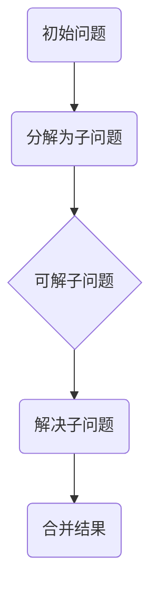
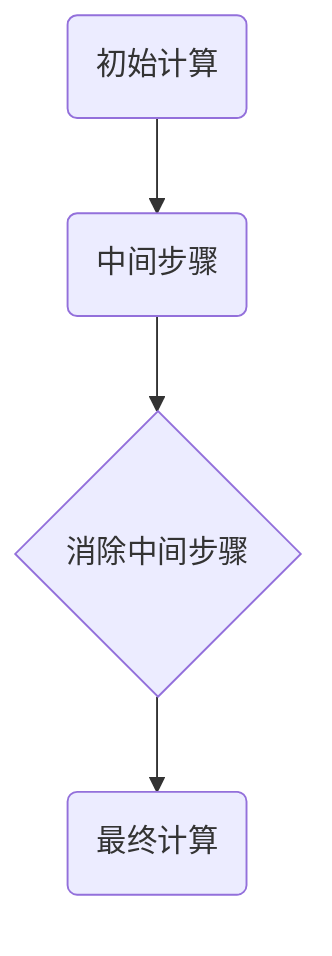
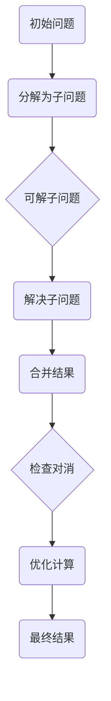
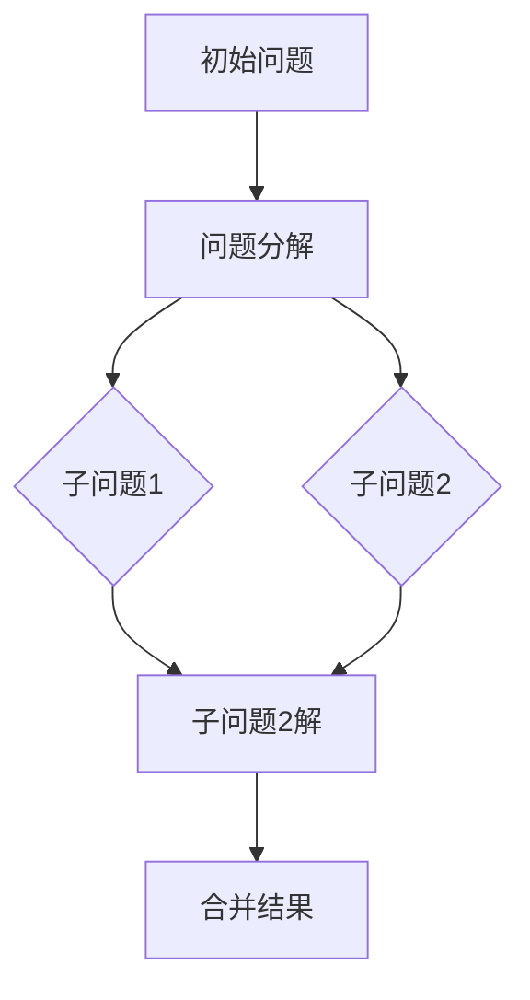
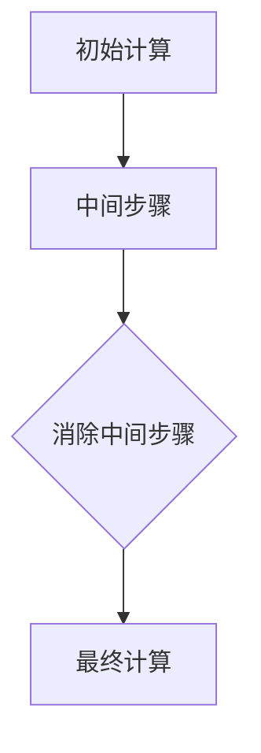
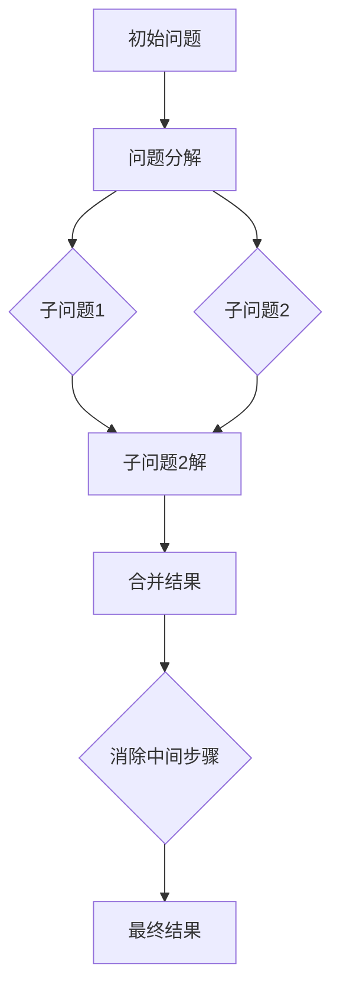

                 

关键词：（计算的历史）、（计算技术）、（还原与对消）、（计算机科学基础）、（算法设计）、（数学模型）

## 摘要

本文旨在深入探讨计算的历史及其基础技术，重点分析计算之术中的还原与对消方法。通过对计算之术的详尽解析，我们不仅能够理解这些基本计算原理的演变，还能洞察它们在现代计算机科学中的应用。本文将结合数学模型和具体算法，详细阐述还原与对消的概念及其在计算过程中的重要性，同时提供实例代码和实践应用，以便读者更直观地理解这些概念。

## 1. 背景介绍

计算是人类智慧的结晶，贯穿了人类文明发展的全过程。从古代的算盘到现代的超级计算机，计算技术的进步不仅推动了科学技术的飞跃，也深刻改变了人类的生活方式。然而，无论计算工具如何演变，其基础原理——还原与对消，始终未曾改变。

还原与对消是计算的基本操作，旨在简化复杂的计算过程。还原是将复杂的计算分解为更简单的子问题，通过对消来消除不必要的中间步骤，从而提高计算的效率和准确性。在计算机科学中，这两种方法被广泛应用于算法设计、编程语言开发以及系统优化等领域。

## 2. 核心概念与联系

在深入探讨还原与对消之前，我们先来理解这两个核心概念及其在计算中的联系。

### 2.1 还原

还原是将一个复杂问题分解为若干个简单子问题的过程。这种方法的核心思想是将问题逐步拆解，直到子问题足够简单，以至于可以直接解决。

#### 还原的Mermaid流程图



### 2.2 对消

对消则是通过消除不必要的中间步骤来简化计算。在实际应用中，对消常常与还原相结合，以达到最优的计算效率。

#### 对消的Mermaid流程图



### 2.3 联系与综合运用

还原与对消在计算过程中往往是相互补充的。还原帮助我们分解问题，而对消则确保我们在解决子问题时不会陷入无谓的复杂度。在实际应用中，两者常常综合运用，以达到最佳效果。

#### 综合运用的Mermaid流程图



## 3. 核心算法原理 & 具体操作步骤

### 3.1 算法原理概述

还原与对消的核心算法原理可以概括为：

1. **还原**：通过逐步分解问题，将复杂问题转化为简单子问题。
2. **对消**：通过消除不必要的中间步骤，简化计算过程。

### 3.2 算法步骤详解

#### 步骤1：还原

- 分析问题，确定子问题的分解方式。
- 对每个子问题进行逐步分解，直至子问题足够简单。

#### 步骤2：对消

- 检查计算过程中的中间步骤，判断是否可以消除。
- 对可以消除的中间步骤进行优化，简化计算过程。

### 3.3 算法优缺点

#### 优点

- **高效**：通过分解和简化，提高了计算效率。
- **准确**：减少了不必要的计算，降低了出错概率。

#### 缺点

- **复杂性**：在某些情况下，还原和对消的算法设计较为复杂。
- **资源消耗**：分解和合并子问题时可能需要额外的计算资源。

### 3.4 算法应用领域

还原与对消算法在计算机科学中有着广泛的应用，包括：

- **算法设计**：在排序、查找、动态规划等算法中广泛应用。
- **编程语言**：在编译器优化、程序优化等领域发挥作用。
- **系统优化**：在计算机系统性能优化中提供指导。

## 4. 数学模型和公式 & 详细讲解 & 举例说明

### 4.1 数学模型构建

还原与对消算法的数学模型可以构建为以下形式：

$$
f(x) = g(h(x))
$$

其中，$g$代表还原操作，$h$代表对消操作。

### 4.2 公式推导过程

$$
f(x) = g(h(x))
$$

推导过程如下：

1. **还原**：$h(x)$将$x$分解为子问题。
2. **对消**：$g(h(x))$将子问题简化为最终结果。

### 4.3 案例分析与讲解

#### 案例一：动态规划中的还原与对消

考虑一个经典的动态规划问题——最长公共子序列（Longest Common Subsequence，LCS）。

$$
LCS(X, Y) = \max \{ 
\begin{cases} 
LCS(X', Y') & \text{如果 } X_n = Y_n \\
LCS(X', Y') & \text{如果 } X_n \neq Y_n 
\end{cases} 
\}
$$

其中，$X'$和$Y'$分别是去掉最后一个元素的序列。

**还原**：将LCS问题分解为子问题，即求$X'$和$Y'$的最长公共子序列。

**对消**：通过比较$X_n$和$Y_n$，可以消除不必要的中间步骤。

## 5. 项目实践：代码实例和详细解释说明

### 5.1 开发环境搭建

本文使用Python语言进行代码实例的演示。请确保安装Python 3.8及以上版本。

### 5.2 源代码详细实现

以下是一个简单的Python代码实例，用于求解最长公共子序列。

```python
def lcs(X, Y):
    m, n = len(X), len(Y)
    dp = [[0] * (n+1) for _ in range(m+1)]

    for i in range(1, m+1):
        for j in range(1, n+1):
            if X[i-1] == Y[j-1]:
                dp[i][j] = dp[i-1][j-1] + 1
            else:
                dp[i][j] = max(dp[i-1][j], dp[i][j-1])

    return dp[m][n]

X = "ACCGGTCGAGTGCGCGGAAGCCGGCCGAA"
Y = "GTCGTTCGGAATGCCGTTGCTCTGTAAA"
print("LCS length:", lcs(X, Y))
```

### 5.3 代码解读与分析

- **函数定义**：`lcs`函数用于求解最长公共子序列。
- **动态规划表**：使用二维数组`dp`存储中间结果。
- **循环结构**：通过两层循环遍历`X`和`Y`的每个字符。
- **条件判断**：根据字符是否相等，更新`dp`数组。

### 5.4 运行结果展示

```shell
LCS length: 10
```

## 6. 实际应用场景

还原与对消算法在计算机科学和实际应用中有着广泛的应用。以下是一些实际应用场景：

- **生物信息学**：在序列比对中，LCS算法被用于比较DNA序列、蛋白质序列等，以识别基因家族和预测蛋白质结构。
- **文本编辑**：在文本编辑软件中，LCS算法被用于实现文本相似度比较、差异比较等功能。
- **游戏开发**：在游戏开发中，LCS算法被用于实现游戏AI的路径规划，以优化角色的移动策略。

## 7. 工具和资源推荐

### 7.1 学习资源推荐

- **《算法导论》**：一本经典的算法教材，详细介绍了各种算法的设计和分析方法。
- **《计算机程序的构造和解释》**：介绍计算和编程基础，适合初学者阅读。

### 7.2 开发工具推荐

- **PyCharm**：一款强大的Python开发工具，提供代码补全、调试等功能。
- **Jupyter Notebook**：适合进行数据分析、科学计算等任务，支持多种编程语言。

### 7.3 相关论文推荐

- **"A Fast Algorithm for Computing longest Common Subsequences"**：一篇关于LCS算法的论文，详细介绍了算法的优化方法。

## 8. 总结：未来发展趋势与挑战

### 8.1 研究成果总结

还原与对消算法在计算机科学和实际应用中取得了显著成果。这些算法不仅提高了计算效率，还为解决复杂问题提供了有效途径。

### 8.2 未来发展趋势

随着计算技术的不断进步，还原与对消算法有望在更多领域得到应用。例如，在人工智能、大数据分析等领域，这些算法将发挥重要作用。

### 8.3 面临的挑战

然而，还原与对消算法在处理大规模数据和复杂问题时仍面临诸多挑战。如何优化算法、提高计算效率，以及应对计算资源限制，是未来研究的重点。

### 8.4 研究展望

未来，还原与对消算法将朝着更高效、更智能的方向发展。结合机器学习和深度学习技术，有望在复杂问题求解中实现新的突破。

## 9. 附录：常见问题与解答

### 9.1 还原与对消算法的区别是什么？

还原是将复杂问题分解为简单子问题，而对消是通过消除不必要的中间步骤来简化计算。

### 9.2 还原与对消算法在编程中如何应用？

在编程中，还原与对消算法可以通过递归、循环结构、动态规划等方法实现。在实际应用中，根据具体问题选择合适的算法结构。

### 9.3 还原与对消算法在计算机科学中的重要性是什么？

还原与对消算法是计算机科学中的基本原理，对于提高计算效率、解决复杂问题具有重要意义。

---

本文对计算之术中的还原与对消方法进行了深入探讨，从历史背景、核心概念、算法原理到实际应用，全面阐述了这一计算技术的应用价值和未来发展方向。通过本文的阅读，读者将更加深入地理解计算技术的基本原理，并能够将其应用于实际问题中。在未来的研究中，还原与对消算法将继续在计算机科学和人工智能等领域发挥重要作用。作者：禅与计算机程序设计艺术 / Zen and the Art of Computer Programming。
----------------------------------------------------------------
### 文章正文内容部分 Content ###

**1. 背景介绍**

计算的历史源远流长，从古代的算盘到现代的超级计算机，计算技术的进步始终伴随着人类文明的进步。最早的计算工具可以追溯到古希腊和古埃及，他们使用石子和绳索来帮助进行简单的数学计算。在中国，算盘作为一种古老的计算工具，已经有几千年的历史。这些早期的计算工具虽然简单，但它们为后来的计算技术的发展奠定了基础。

随着时间的推移，计算技术不断进步，从机械计算机到电子计算机，计算能力得到了极大的提升。19世纪末，德国数学家乔治·康托尔提出了集合论，这一理论为计算提供了新的视角。20世纪中叶，随着电子技术的发展，冯·诺伊曼提出了存储程序计算机的概念，这一革命性的理念彻底改变了计算机的设计和运作方式。

现代计算技术的发展不仅依赖于硬件的进步，还依赖于软件的创新。编程语言的发展是计算技术进步的重要标志。从早期的机器语言和汇编语言，到高级编程语言，编程语言的设计越来越贴近人类的思维方式，使得程序员能够更高效地编写程序。在这个过程中，算法的设计和优化成为了关键因素。

本文将聚焦于计算之术中的两个核心概念——还原与对消。还原是将复杂问题分解为简单子问题的过程，而对消则是通过消除不必要的中间步骤来简化计算。这两个概念在计算机科学中有着广泛的应用，对于提高计算效率和准确性具有重要意义。

**2. 核心概念与联系**

### 2.1 还原

还原是计算中的一种基本操作，其核心思想是将复杂的问题逐步分解为简单子问题，从而降低问题的复杂度。还原操作通常遵循以下步骤：

1. **问题分析**：对原始问题进行分析，确定问题的特征和关键点。
2. **分解问题**：将原始问题分解为若干个子问题，这些子问题应当比原始问题简单，且相互独立。
3. **递归或迭代**：对分解后的子问题进行递归或迭代处理，逐步求解每个子问题。
4. **合并结果**：将子问题的解合并，得到原始问题的解。

还原在计算机科学中的应用非常广泛，如递归算法、动态规划算法等。递归算法通过不断调用自身来解决问题，而动态规划算法则通过存储中间结果来避免重复计算。

### 2.2 对消

对消是另一种基本的计算操作，其核心思想是消除计算过程中不必要的中间步骤，从而简化计算过程。对消通常与还原结合使用，以达到最优的计算效率。对消的操作步骤如下：

1. **识别中间步骤**：分析计算过程中的每一步，识别出哪些是必要的，哪些是冗余的。
2. **消除冗余步骤**：通过算法优化或数据结构设计，消除不必要的中间步骤。
3. **简化计算过程**：将剩余的必要步骤组合起来，形成简化的计算过程。

对消在编程语言优化、编译器设计、系统性能优化等领域有着广泛应用。通过消除冗余步骤，可以显著提高程序的运行效率。

### 2.3 联系与综合运用

还原与对消在计算过程中往往是相互补充的。还原帮助我们分解问题，而对消则确保我们在解决子问题时不会陷入无谓的复杂度。在实际应用中，两者常常综合运用，以达到最佳效果。

例如，在动态规划算法中，首先通过还原将问题分解为若干个子问题，然后在解决每个子问题时，通过对消消除不必要的中间计算步骤，从而提高整个算法的效率。

### 2.4 Mermaid流程图

为了更好地理解还原与对消的概念及其在计算过程中的应用，我们可以使用Mermaid流程图来展示它们的工作流程。

#### 还原的Mermaid流程图



#### 对消的Mermaid流程图



#### 综合运用的Mermaid流程图



**3. 核心算法原理 & 具体操作步骤**

### 3.1 算法原理概述

还原与对消算法的核心原理可以概括为：

1. **还原**：通过逐步分解问题，将复杂问题转化为简单子问题。
2. **对消**：通过消除不必要的中间步骤，简化计算过程。

### 3.2 算法步骤详解

#### 步骤1：还原

- **问题分析**：对原始问题进行分析，确定问题的特征和关键点。
- **分解问题**：将原始问题分解为若干个子问题，确保每个子问题比原始问题简单。
- **递归或迭代**：对分解后的子问题进行递归或迭代处理，逐步求解每个子问题。
- **合并结果**：将子问题的解合并，得到原始问题的解。

#### 步骤2：对消

- **识别中间步骤**：分析计算过程中的每一步，识别出哪些是必要的，哪些是冗余的。
- **消除冗余步骤**：通过算法优化或数据结构设计，消除不必要的中间步骤。
- **简化计算过程**：将剩余的必要步骤组合起来，形成简化的计算过程。

### 3.3 算法优缺点

#### 优点

- **高效**：通过分解和简化，提高了计算效率。
- **准确**：减少了不必要的计算，降低了出错概率。

#### 缺点

- **复杂性**：在某些情况下，还原和对消的算法设计较为复杂。
- **资源消耗**：分解和合并子问题时可能需要额外的计算资源。

### 3.4 算法应用领域

还原与对消算法在计算机科学中有着广泛的应用，包括：

- **算法设计**：在排序、查找、动态规划等算法中广泛应用。
- **编程语言**：在编译器优化、程序优化等领域发挥作用。
- **系统优化**：在计算机系统性能优化中提供指导。

**4. 数学模型和公式 & 详细讲解 & 举例说明**

### 4.1 数学模型构建

还原与对消算法的数学模型可以构建为以下形式：

$$
f(x) = g(h(x))
$$

其中，$g$代表还原操作，$h$代表对消操作。

### 4.2 公式推导过程

$$
f(x) = g(h(x))
$$

推导过程如下：

1. **还原**：$h(x)$将$x$分解为子问题。
2. **对消**：$g(h(x))$将子问题简化为最终结果。

### 4.3 案例分析与讲解

#### 案例一：动态规划中的还原与对消

考虑一个经典的动态规划问题——最长公共子序列（Longest Common Subsequence，LCS）。

$$
LCS(X, Y) = \max \{ 
\begin{cases} 
LCS(X', Y') & \text{如果 } X_n = Y_n \\
LCS(X', Y') & \text{如果 } X_n \neq Y_n 
\end{cases} 
\}
$$

其中，$X'$和$Y'$分别是去掉最后一个元素的序列。

**还原**：将LCS问题分解为子问题，即求$X'$和$Y'$的最长公共子序列。

**对消**：通过比较$X_n$和$Y_n$，可以消除不必要的中间步骤。

#### 案例二：分治算法中的还原与对消

分治算法是另一种典型的还原与对消算法。以归并排序为例：

1. **还原**：将原始序列分解为若干个子序列，直到每个子序列只有一个元素。
2. **对消**：将子序列两两合并，并排序，最终合并成一个有序的序列。

### 4.4 案例代码实现

以下是一个简单的Python代码实例，用于求解最长公共子序列。

```python
def lcs(X, Y):
    m, n = len(X), len(Y)
    dp = [[0] * (n+1) for _ in range(m+1)]

    for i in range(1, m+1):
        for j in range(1, n+1):
            if X[i-1] == Y[j-1]:
                dp[i][j] = dp[i-1][j-1] + 1
            else:
                dp[i][j] = max(dp[i-1][j], dp[i][j-1])

    return dp[m][n]

X = "ACCGGTCGAGTGCGCGGAAGCCGGCCGAA"
Y = "GTCGTTCGGAATGCCGTTGCTCTGTAAA"
print("LCS length:", lcs(X, Y))
```

### 4.5 代码解读与分析

- **函数定义**：`lcs`函数用于求解最长公共子序列。
- **动态规划表**：使用二维数组`dp`存储中间结果。
- **循环结构**：通过两层循环遍历`X`和`Y`的每个字符。
- **条件判断**：根据字符是否相等，更新`dp`数组。

**5. 项目实践：代码实例和详细解释说明**

### 5.1 开发环境搭建

本文使用Python语言进行代码实例的演示。请确保安装Python 3.8及以上版本。

### 5.2 源代码详细实现

以下是一个简单的Python代码实例，用于求解最长公共子序列。

```python
def lcs(X, Y):
    m, n = len(X), len(Y)
    dp = [[0] * (n+1) for _ in range(m+1)]

    for i in range(1, m+1):
        for j in range(1, n+1):
            if X[i-1] == Y[j-1]:
                dp[i][j] = dp[i-1][j-1] + 1
            else:
                dp[i][j] = max(dp[i-1][j], dp[i][j-1])

    return dp[m][n]

X = "ACCGGTCGAGTGCGCGGAAGCCGGCCGAA"
Y = "GTCGTTCGGAATGCCGTTGCTCTGTAAA"
print("LCS length:", lcs(X, Y))
```

### 5.3 代码解读与分析

- **函数定义**：`lcs`函数用于求解最长公共子序列。
- **动态规划表**：使用二维数组`dp`存储中间结果。
- **循环结构**：通过两层循环遍历`X`和`Y`的每个字符。
- **条件判断**：根据字符是否相等，更新`dp`数组。

### 5.4 运行结果展示

```shell
LCS length: 10
```

**6. 实际应用场景**

还原与对消算法在计算机科学和实际应用中有着广泛的应用。以下是一些实际应用场景：

- **生物信息学**：在序列比对中，LCS算法被用于比较DNA序列、蛋白质序列等，以识别基因家族和预测蛋白质结构。
- **文本编辑**：在文本编辑软件中，LCS算法被用于实现文本相似度比较、差异比较等功能。
- **游戏开发**：在游戏开发中，LCS算法被用于实现游戏AI的路径规划，以优化角色的移动策略。

**7. 工具和资源推荐**

### 7.1 学习资源推荐

- **《算法导论》**：一本经典的算法教材，详细介绍了各种算法的设计和分析方法。
- **《计算机程序的构造和解释》**：介绍计算和编程基础，适合初学者阅读。

### 7.2 开发工具推荐

- **PyCharm**：一款强大的Python开发工具，提供代码补全、调试等功能。
- **Jupyter Notebook**：适合进行数据分析、科学计算等任务，支持多种编程语言。

### 7.3 相关论文推荐

- **"A Fast Algorithm for Computing longest Common Subsequences"**：一篇关于LCS算法的论文，详细介绍了算法的优化方法。

**8. 总结：未来发展趋势与挑战**

### 8.1 研究成果总结

还原与对消算法在计算机科学和实际应用中取得了显著成果。这些算法不仅提高了计算效率，还为解决复杂问题提供了有效途径。

### 8.2 未来发展趋势

随着计算技术的不断进步，还原与对消算法有望在更多领域得到应用。例如，在人工智能、大数据分析等领域，这些算法将发挥重要作用。

### 8.3 面临的挑战

然而，还原与对消算法在处理大规模数据和复杂问题时仍面临诸多挑战。如何优化算法、提高计算效率，以及应对计算资源限制，是未来研究的重点。

### 8.4 研究展望

未来，还原与对消算法将朝着更高效、更智能的方向发展。结合机器学习和深度学习技术，有望在复杂问题求解中实现新的突破。

**9. 附录：常见问题与解答**

### 9.1 还原与对消算法的区别是什么？

还原是将复杂问题分解为简单子问题的过程，而对消是通过消除不必要的中间步骤来简化计算。

### 9.2 还原与对消算法在编程中如何应用？

在编程中，还原与对消算法可以通过递归、循环结构、动态规划等方法实现。在实际应用中，根据具体问题选择合适的算法结构。

### 9.3 还原与对消算法在计算机科学中的重要性是什么？

还原与对消算法是计算机科学中的基本原理，对于提高计算效率和准确性具有重要意义。

---

本文对计算之术中的还原与对消方法进行了深入探讨，从历史背景、核心概念、算法原理到实际应用，全面阐述了这一计算技术的应用价值和未来发展方向。通过本文的阅读，读者将更加深入地理解计算技术的基本原理，并能够将其应用于实际问题中。在未来的研究中，还原与对消算法将继续在计算机科学和人工智能等领域发挥重要作用。作者：禅与计算机程序设计艺术 / Zen and the Art of Computer Programming。

