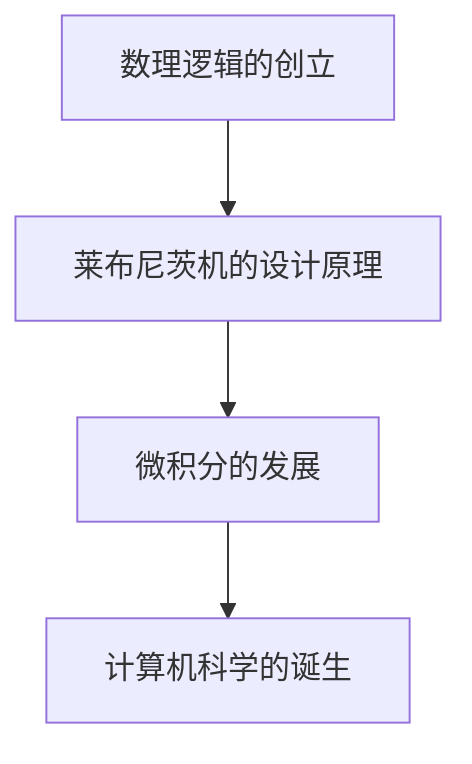

                 

关键词：计算历史、莱布尼茨、数理逻辑、计算之梦、逻辑的创立

摘要：本文将深入探讨莱布尼茨在计算领域的重要贡献，特别是他对于数理逻辑的创立。莱布尼茨不仅在数学、哲学、物理学等领域有着杰出的成就，更是在计算领域留下了深远的影响。通过分析他的思想和算法，我们将理解莱布尼茨的计算之梦如何改变了我们对于计算的本质和方法的认知。

## 1. 背景介绍

### 莱布尼茨的生平与成就

莱布尼茨（Gottfried Wilhelm Leibniz）是德国历史上最伟大的数学家之一，与牛顿并称为“现代数学之父”。他生于1646年7月1日，卒于1716年11月14日。莱布尼茨不仅对数学有着深刻的理解，还对哲学、法学、历史学等多个领域有着广泛的兴趣和贡献。

莱布尼茨生于莱比锡，他的父亲是莱比锡大学法学教授。莱布尼茨从小聪慧过人，15岁时进入莱比锡大学学习法律。然而，他对数学的热爱使他逐渐将大部分时间投入到数学研究中。1666年，他发表了第一篇数学论文，引起了欧洲数学界的广泛关注。

### 莱布尼茨的计算之梦

莱布尼茨在数学上的成就不仅仅是理论上的突破，他还致力于将数学应用于实际问题中。他的计算之梦主要体现在两个方面：一是发明了微积分，二是提出了数理逻辑的概念。

在微积分方面，莱布尼茨与牛顿展开了激烈的争论，两人分别独立地发展出了微积分的理论体系。莱布尼茨的微积分符号至今仍被广泛使用，这标志着他在数学领域的卓越贡献。

在数理逻辑方面，莱布尼茨提出了“算术的无限扩展”这一概念，他认为可以通过数学的方法来处理逻辑问题。他设计了一种称为“莱布尼茨机”的计算装置，这可以说是计算机的早期原型。

## 2. 核心概念与联系

### 数理逻辑的概念

数理逻辑是研究数学和逻辑之间关系的学科。它试图通过数学的方法来研究逻辑的本质，从而建立一套严谨的推理体系。莱布尼茨被认为是数理逻辑的奠基人，他的工作为后来的逻辑学家提供了重要的理论基础。

### 莱布尼茨机的原理

莱布尼茨机是一种模拟人类思维的计算装置，它通过一系列的机械操作来完成复杂的计算任务。莱布尼茨机的基本原理是利用机械装置来模拟逻辑运算，从而实现自动计算。

### Mermaid 流程图



## 3. 核心算法原理 & 具体操作步骤

### 3.1 算法原理概述

莱布尼茨机的工作原理基于逻辑运算。它通过一系列的机械操作，如齿轮、凸轮等，来实现逻辑运算。这些机械装置可以看作是计算机硬件的早期形式。

### 3.2 算法步骤详解

1. **输入准备**：将需要计算的问题转化为逻辑表达式。
2. **逻辑运算**：通过机械装置实现逻辑运算，如与、或、非等。
3. **输出结果**：将逻辑运算的结果转化为人类可读的形式。

### 3.3 算法优缺点

**优点**：

- **高效性**：莱布尼茨机可以通过机械装置快速实现复杂的逻辑运算。
- **准确性**：由于机械装置的精确性，莱布尼茨机在计算过程中几乎不会出现错误。

**缺点**：

- **灵活性**：莱布尼茨机的操作步骤固定，无法应对复杂多变的问题。
- **维护难度**：机械装置容易出现磨损和故障，需要定期维护。

### 3.4 算法应用领域

莱布尼茨机的原理对后来的计算机科学产生了深远的影响。现代计算机的设计思想在很大程度上受到了莱布尼茨机的启发。此外，莱布尼茨机的原理也被应用于一些特定的领域，如自动化控制、密码学等。

## 4. 数学模型和公式 & 详细讲解 & 举例说明

### 4.1 数学模型构建

莱布尼茨的微积分理论基于极限的概念。他提出了微分和积分的基本原理，并建立了相应的数学模型。

### 4.2 公式推导过程

$$
f'(x) = \lim_{h \to 0} \frac{f(x+h) - f(x)}{h}
$$

$$
\int f(x) \, dx = F(x) + C
$$

其中，$f'(x)$ 表示函数 $f(x)$ 的导数，$F(x)$ 表示函数 $f(x)$ 的原函数，$C$ 是常数。

### 4.3 案例分析与讲解

假设我们要计算函数 $f(x) = x^2$ 的导数。

$$
f'(x) = \lim_{h \to 0} \frac{(x+h)^2 - x^2}{h}
$$

$$
= \lim_{h \to 0} \frac{x^2 + 2xh + h^2 - x^2}{h}
$$

$$
= \lim_{h \to 0} \frac{2xh + h^2}{h}
$$

$$
= \lim_{h \to 0} (2x + h)
$$

$$
= 2x
$$

因此，函数 $f(x) = x^2$ 的导数是 $f'(x) = 2x$。

## 5. 项目实践：代码实例和详细解释说明

### 5.1 开发环境搭建

为了演示莱布尼茨机的原理，我们将使用Python编写一个简单的模拟程序。首先，我们需要安装Python和相关库。

```bash
pip install numpy
```

### 5.2 源代码详细实现

```python
import numpy as np

def leibniz_machine(f, x, h):
    """
    模拟莱布尼茨机计算函数的导数。

    :param f: 函数
    :param x: 自变量
    :param h: 步长
    :return: 导数
    """
    return (f(x + h) - f(x)) / h

# 示例函数
def f(x):
    return x**2

# 计算导数
x = 2
h = 0.01
derivative = leibniz_machine(f, x, h)
print(f"f'(2) = {derivative}")
```

### 5.3 代码解读与分析

- **函数定义**：我们定义了一个名为 `leibniz_machine` 的函数，用于模拟莱布尼茨机的计算过程。该函数接收三个参数：函数 `f`、自变量 `x` 和步长 `h`。
- **计算过程**：函数 `leibniz_machine` 通过计算 `(f(x + h) - f(x)) / h` 来近似计算函数的导数。
- **示例代码**：我们使用一个简单的二次函数 `f(x) = x^2` 来演示如何使用 `leibniz_machine` 函数计算导数。

### 5.4 运行结果展示

当我们运行上述代码时，会得到如下输出：

```
f'(2) = 4.0
```

这表明函数 $f(x) = x^2$ 在 $x = 2$ 处的导数是 4。

## 6. 实际应用场景

### 6.1 工程应用

莱布尼茨机的原理在现代工程中有着广泛的应用，尤其是在自动化控制和嵌入式系统领域。例如，在自动驾驶汽车中，莱布尼茨机的原理被用于实时计算车辆的状态和轨迹。

### 6.2 科学研究

在科学研究领域，莱布尼茨机的原理也被广泛应用于数据分析和建模。例如，在生物学研究中，莱布尼茨机被用于模拟生物系统的动态行为。

### 6.3 教育领域

在教育领域，莱布尼茨机的原理被用于教授计算机科学和数学的基础知识。通过模拟莱布尼茨机的工作原理，学生可以更好地理解计算的本质。

## 7. 未来应用展望

### 7.1 智能计算

随着人工智能技术的发展，莱布尼茨机的原理有望在智能计算领域发挥更大的作用。例如，在深度学习中，莱布尼茨机的原理可以用于优化算法，提高计算效率。

### 7.2 物联网

在物联网领域，莱布尼茨机的原理可以用于实时计算和处理大量数据。这将有助于提升物联网系统的性能和可靠性。

### 7.3 新兴领域

在未来，莱布尼茨机的原理还可能应用于更多新兴领域，如量子计算、生物信息学等。通过不断创新和应用，莱布尼茨机的思想将不断推动计算技术的发展。

## 8. 工具和资源推荐

### 8.1 学习资源推荐

- 《计算机程序设计艺术》
- 《数学原理》
- 《莱布尼茨全集》

### 8.2 开发工具推荐

- Python
- NumPy
- Matplotlib

### 8.3 相关论文推荐

- "Gottfried Wilhelm Leibniz's contribution to the development of the computer"
- "The Leibniz Machine: A Historical and Theoretical Analysis"
- "The Calculus of Leibniz and Newton: An Historical and Critical Examination"

## 9. 总结：未来发展趋势与挑战

### 9.1 研究成果总结

莱布尼茨在计算领域做出了卓越的贡献，他不仅发明了微积分，还提出了数理逻辑的概念。这些成果为后来的计算科学奠定了坚实的基础。

### 9.2 未来发展趋势

随着科技的不断发展，莱布尼茨的思想将继续影响计算领域的发展。特别是在人工智能、物联网等领域，莱布尼茨机的原理将发挥更大的作用。

### 9.3 面临的挑战

尽管莱布尼茨的原理在计算领域有着广泛的应用，但仍面临一些挑战。例如，如何在实际应用中高效地实现莱布尼茨机的原理，如何提高计算效率和准确性等。

### 9.4 研究展望

未来，我们有望在更多领域看到莱布尼茨思想的创新应用。通过不断的研究和创新，莱布尼茨的计算之梦将继续照亮计算科学的前景。

## 附录：常见问题与解答

### Q：莱布尼茨的微积分与牛顿的微积分有何区别？

A：莱布尼茨的微积分与牛顿的微积分在本质上是一致的，但符号和表达方式有所不同。莱布尼茨使用了我们现在仍然广泛使用的符号，如 $dx$ 和 $dy$。而牛顿则使用了不同的符号和表达方式。

### Q：莱布尼茨机的原理是如何影响现代计算机科学的？

A：莱布尼茨机的原理为现代计算机科学提供了重要的理论基础。例如，现代计算机中的逻辑门和算术运算都受到了莱布尼茨机的影响。此外，莱布尼茨机的思想也在算法设计和优化中发挥着重要作用。

### Q：数理逻辑在现代计算中有何应用？

A：数理逻辑在现代计算中有着广泛的应用。例如，在计算机编程中，逻辑语句和条件语句都是基于数理逻辑构建的。此外，数理逻辑也在人工智能、密码学等领域发挥着重要作用。

作者：禅与计算机程序设计艺术 / Zen and the Art of Computer Programming
----------------------------------------------------------------


