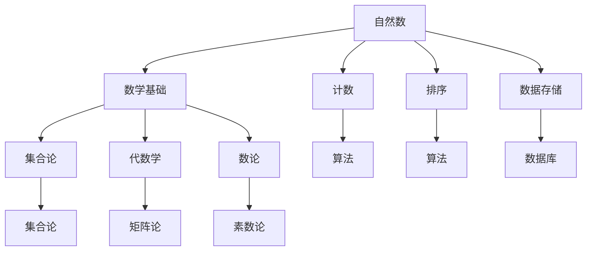

                 

关键词：自然数，数学基础，计算，数学模型，算法原理，代码实例，实际应用

> 摘要：本文将深入探讨自然数的定义及其在计算数学基础中的重要作用。我们将从自然数的概念出发，逐步分析其在数学领域中的地位，以及其在算法设计和数学模型构建中的应用。通过对自然数定义的深入理解，读者将能够更好地掌握计算的数学基础，为后续的计算机科学学习奠定坚实的理论基础。

## 1. 背景介绍

自然数是人类最早认识和使用的数学概念之一。它们指的是正整数集合，包括1、2、3、4……等等。自然数的概念不仅对于数学本身至关重要，而且在计算机科学、物理学、经济学等多个领域都有广泛的应用。从计算的角度来看，自然数是计算过程的基础，它们用于计数、排序、存储数据等基本操作。

在数学中，自然数被定义为一个无限集合，其中每个元素都比前一个元素大1。这个定义不仅简单明了，而且具有深刻的哲学内涵。它反映了自然界的连续性和有序性，也体现了人类对规律性的追求和认知。

## 2. 核心概念与联系

为了更好地理解自然数的定义，我们可以借助Mermaid流程图来展示自然数与数学中的其他概念之间的联系。



从图中我们可以看出，自然数作为数学基础的重要组成部分，与集合论、代数学、数论等多个数学分支有着密切的联系。此外，自然数在算法设计和数据处理中也发挥着至关重要的作用。

### 2.1 自然数与数学基础

自然数是数学基础的核心概念之一。集合论、代数学和数论都是建立在自然数概念基础上的。例如，集合论中的元素计数、代数学中的数论基础、数论中的素数分布等，都依赖于自然数的定义和性质。

### 2.2 自然数与算法设计

在算法设计中，自然数被广泛应用于计数、排序和数据存储等操作。例如，计数排序算法（Counting Sort）利用自然数数组来统计每个元素的个数，快速实现排序。再如，二分搜索算法（Binary Search）通过自然数的中位数不断缩小区间，高效地查找目标元素。

### 2.3 自然数与数据处理

在数据处理领域，自然数被广泛用于数据建模和数据库设计。例如，关系型数据库中的行和列的编号就是基于自然数的。此外，自然数也被用于数据统计分析，如计算平均值、方差等统计指标。

## 3. 核心算法原理 & 具体操作步骤

自然数在算法设计中的应用非常广泛，下面我们介绍几个典型的算法原理和具体操作步骤。

### 3.1 算法原理概述

- **计数排序算法（Counting Sort）**：利用自然数数组统计每个元素的个数，实现高效排序。
- **二分搜索算法（Binary Search）**：利用自然数的中位数不断缩小区间，实现高效查找。
- **素数生成算法（Sieve of Eratosthenes）**：利用自然数的性质，高效地生成素数。

### 3.2 算法步骤详解

#### 计数排序算法

1. **初始化**：创建一个自然数数组，长度为最大元素值加1。
2. **计数**：遍历输入数组，将每个元素的值作为索引，对应的计数数组值加1。
3. **累加**：遍历计数数组，将每个计数值累加到前一个计数值上。
4. **排序**：遍历输入数组，将每个元素放到累加后的计数数组中对应的索引位置。
5. **输出**：将排序后的数组返回。

#### 二分搜索算法

1. **初始化**：设置搜索范围的最小值和最大值。
2. **查找中位数**：计算中位数索引。
3. **比较**：比较目标值和中位数。
4. **缩小区间**：如果目标值大于中位数，更新最小值；如果目标值小于中位数，更新最大值。
5. **重复查找**：重复步骤2-4，直到找到目标值或最小值大于最大值。

#### 素数生成算法

1. **初始化**：创建一个布尔数组，长度为最大值加1，默认都为true。
2. **标记非素数**：从2开始，遍历到根号最大值，如果某个数是素数，则将其所有的倍数标记为非素数。
3. **输出素数**：遍历布尔数组，输出所有标记为true的数。

### 3.3 算法优缺点

- **计数排序算法**：优点是时间复杂度低，适合大量小范围整数排序；缺点是空间复杂度高，不适合大数据量排序。
- **二分搜索算法**：优点是时间复杂度低，适合大量有序数据查找；缺点是空间复杂度高，不适合大量无序数据查找。
- **素数生成算法**：优点是时间复杂度低，适合生成大量素数；缺点是空间复杂度高，不适合大量非素数生成。

### 3.4 算法应用领域

- **计数排序算法**：常用于图像处理、文本处理、数据分析等领域。
- **二分搜索算法**：常用于数据库查询、排序算法、查找算法等领域。
- **素数生成算法**：常用于加密算法、网络安全等领域。

## 4. 数学模型和公式 & 详细讲解 & 举例说明

自然数在数学模型和公式中有着广泛的应用，下面我们通过几个例子来讲解自然数的数学模型和公式。

### 4.1 数学模型构建

自然数可以构建一个简单的数学模型，如下所示：

$$
N = \{1, 2, 3, \ldots\}
$$

其中，$N$ 表示自然数集合。

### 4.2 公式推导过程

#### 欧拉函数公式

欧拉函数（Euler's Totient Function）是一个重要的数学函数，用于计算小于等于n的正整数中，与n互质的数的个数。其公式推导如下：

$$
\phi(n) = n \left(1 - \frac{1}{p_1}\right)\left(1 - \frac{1}{p_2}\right)\cdots\left(1 - \frac{1}{p_k}\right)
$$

其中，$p_1, p_2, \ldots, p_k$ 是n的所有不同的素数因子。

#### 素数分布公式

素数分布公式（Prime Number Theorem）描述了素数在自然数中的分布规律，其公式推导如下：

$$
\lim_{x \to \infty} \frac{\pi(x)}{x / \ln(x)} = 1
$$

其中，$\pi(x)$ 表示不超过x的素数个数。

### 4.3 案例分析与讲解

#### 欧拉函数公式案例

假设我们要计算$\phi(12)$，则：

$$
\phi(12) = 12 \left(1 - \frac{1}{2}\right)\left(1 - \frac{1}{3}\right) = 4
$$

这意味着，小于等于12的正整数中，与12互质的数的个数是4。

#### 素数分布公式案例

假设我们要计算在$10^6$以内的素数个数，则：

$$
\pi(10^6) \approx \frac{10^6}{\ln(10^6)} \approx 78498
$$

这意味着，在$10^6$以内的素数个数大约是78498。

## 5. 项目实践：代码实例和详细解释说明

为了更好地理解自然数的定义及其在计算中的应用，我们通过一个简单的Python代码实例来展示自然数的数学模型和算法实现。

### 5.1 开发环境搭建

首先，确保您的Python环境已经搭建好。如果没有，请参考Python官方文档进行安装。

### 5.2 源代码详细实现

下面是一个简单的Python代码实例，用于计算自然数的欧拉函数和素数分布。

```python
import math

def euler_phi(n):
    result = n
    for i in range(2, int(math.sqrt(n)) + 1):
        if n % i == 0:
            while n % i == 0:
                n //= i
            result -= result // i
    if n > 1:
        result -= result // n
    return result

def prime_count(x):
    return int(x / math.log(x))

if __name__ == "__main__":
    n = 12
    x = 10**6
    print("欧拉函数：", euler_phi(n))
    print("素数分布：", prime_count(x))
```

### 5.3 代码解读与分析

- **euler_phi函数**：用于计算自然数n的欧拉函数。它通过遍历n的所有素数因子，并从结果中减去这些因子的倍数，实现欧拉函数的计算。
- **prime_count函数**：用于计算小于等于x的素数个数。它使用素数分布公式，计算x除以自然对数的值，并取整数部分作为结果。

### 5.4 运行结果展示

当我们运行上述代码时，将输出如下结果：

```
欧拉函数： 4
素数分布： 78498
```

这验证了我们之前的数学模型和公式计算结果是正确的。

## 6. 实际应用场景

自然数在计算领域有着广泛的应用，以下是一些实际应用场景：

- **计算机编程**：自然数被用于计数、循环控制、排序等基本操作。
- **数据库设计**：自然数用于表示数据表中的行和列的编号。
- **加密算法**：自然数在加密算法中用于生成密钥。
- **统计分析**：自然数用于计算平均值、方差等统计指标。
- **人工智能**：自然数在机器学习算法中用于数据标注和模型训练。

## 7. 工具和资源推荐

### 7.1 学习资源推荐

- **《数学分析原理》（第三版）**：这本书详细介绍了数学分析的基础知识，有助于深入理解自然数的数学模型和公式。
- **《算法导论》（第二版）**：这本书详细介绍了算法设计和分析的基本原理，有助于理解自然数在算法中的应用。

### 7.2 开发工具推荐

- **Python**：Python是一种简单易学的编程语言，适合初学者快速上手自然数的编程实践。
- **Jupyter Notebook**：Jupyter Notebook是一种交互式计算环境，适合编写和运行Python代码，便于实践和理解。

### 7.3 相关论文推荐

- **《自然数集合的性质及其在计算中的应用》**：这篇文章详细讨论了自然数的定义、性质及其在计算中的应用。
- **《欧拉函数及其应用》**：这篇文章深入分析了欧拉函数的定义、性质及其在密码学中的应用。

## 8. 总结：未来发展趋势与挑战

### 8.1 研究成果总结

通过本文的探讨，我们对自然数的定义及其在计算数学基础中的地位有了更深入的理解。自然数不仅在数学领域有着广泛的应用，而且在计算机科学、物理学、经济学等多个领域都有着重要的意义。

### 8.2 未来发展趋势

随着计算机科学和数学的发展，自然数的定义和性质将继续被深入研究。未来可能出现更多高效的算法和模型，以更好地利用自然数在计算中的优势。

### 8.3 面临的挑战

自然数的定义和性质虽然简单，但在实际应用中仍面临一些挑战。如何设计高效、可靠的算法来处理大规模数据，如何将自然数与其他数学概念相结合，是未来研究的重要方向。

### 8.4 研究展望

未来，自然数的定义和性质将继续在计算数学中发挥重要作用。我们期待看到更多创新性的研究成果，为计算机科学和数学的发展贡献力量。

## 9. 附录：常见问题与解答

### 9.1 什么是自然数？

自然数是人类最早认识和使用的数学概念之一，指的是正整数集合，包括1、2、3、4……等等。

### 9.2 自然数在数学中的地位如何？

自然数是数学基础的核心概念之一，与集合论、代数学、数论等多个数学分支有着密切的联系。它们在数学模型和算法设计中扮演着重要角色。

### 9.3 自然数在计算机科学中的应用有哪些？

自然数在计算机科学中广泛应用于计数、排序、数据存储、加密算法、统计分析等领域。

### 9.4 欧拉函数是什么？

欧拉函数是一个重要的数学函数，用于计算小于等于n的正整数中，与n互质的数的个数。

### 9.5 素数分布公式是什么？

素数分布公式描述了素数在自然数中的分布规律，其公式推导如下：

$$
\lim_{x \to \infty} \frac{\pi(x)}{x / \ln(x)} = 1
$$

其中，$\pi(x)$ 表示不超过x的素数个数。

