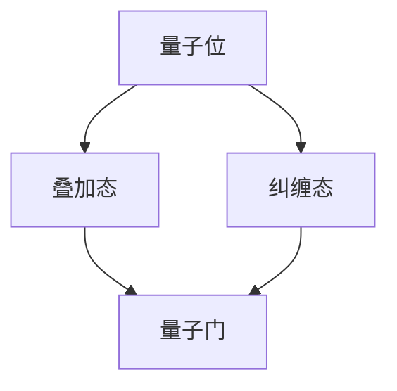

                 

关键词：量子计算、量子算法、计算极限、量子复杂性、量子并行性

摘要：本文将深入探讨量子计算的原理、量子算法的设计与应用，以及量子计算在解决计算难题中的巨大潜力。通过对量子计算的基本概念、量子并行性、以及经典算法与量子算法的比较分析，我们旨在揭示量子计算在当今计算机科学领域中的核心地位，并展望其未来的发展趋势。

## 1. 背景介绍

随着计算机技术的发展，我们面临着越来越多的计算难题。经典的计算机理论在处理复杂问题时表现出一定的局限性。然而，量子计算的崛起为我们提供了一种全新的计算范式，具有解决这些难题的潜力。量子计算是基于量子力学原理的计算机模型，利用量子位（qubits）的叠加和纠缠等特性，可以在极短的时间内解决某些复杂问题。

### 量子计算的发展历程

量子计算的发展可以追溯到20世纪80年代，当时理查德·费曼（Richard Feynman）提出了量子模拟的概念。他意识到，经典计算机难以模拟量子系统的复杂行为。随后，彼得·肖尔（Peter Shor）在1994年提出了著名的Shor算法，该算法展示了量子计算机在整除因数分解问题上的优势。随后，量子计算的许多其他算法相继被提出，如Grover算法、量子随机 walks算法等。

### 量子计算的现状与挑战

目前，量子计算仍处于早期发展阶段。尽管已经有一些量子计算机问世，但其规模和性能还远远无法与经典计算机相提并论。量子计算机需要解决的主要挑战包括量子位的稳定性、错误率、以及量子算法的设计与优化。此外，量子计算机的实用化还需解决物理实现、集成、控制等关键技术问题。

## 2. 核心概念与联系

量子计算的核心概念包括量子位、叠加态、纠缠态、量子门等。为了更好地理解这些概念，我们通过一个Mermaid流程图来展示它们之间的联系。



### 量子位

量子位是量子计算机的基本单元，类似于经典计算机中的位（bits）。但量子位可以处于0和1的叠加状态，这意味着它可以同时表示0和1。这一特性使得量子计算机具有极高的并行性。

### 叠加态

叠加态是量子位的一种特殊状态，它将0和1的状态同时存在。数学上，叠加态可以用一个复数系数的线性组合来表示。例如，一个量子位可以处于状态$|\psi\rangle = \frac{1}{\sqrt{2}}|0\rangle + \frac{1}{\sqrt{2}}|1\rangle$。

### 纠缠态

纠缠态是量子位之间的一种特殊关联状态。当两个量子位处于纠缠态时，对其中一个量子位的测量将立即影响到另一个量子位的状态。这种非局域性是量子计算的核心优势之一。

### 量子门

量子门是量子计算中的操作，类似于经典计算机中的逻辑门。量子门对量子位的状态进行线性变换，从而实现特定的计算操作。

## 3. 核心算法原理 & 具体操作步骤

### 3.1 算法原理概述

量子计算中的核心算法通常基于量子并行性。量子并行性允许量子计算机同时处理多个可能的计算路径，从而在短时间内解决复杂问题。以下我们将介绍两个著名的量子算法：Shor算法和Grover算法。

### 3.2 算法步骤详解

#### Shor算法

Shor算法是一种用于整除因数分解的量子算法。其基本步骤如下：

1. **初始化**：生成一个随机的量子状态，其中包含所有可能的结果。
2. **应用量子门**：将状态转换为一个特定的形式，使得最终状态能被目标数整除的概率大大增加。
3. **测量**：测量量子状态，获得一个整数结果。
4. **反复执行步骤2-3**：通过反复执行步骤2和3，可以获得多个结果，从而推断出目标数的因数。

#### Grover算法

Grover算法是一种用于搜索未排序数据库的量子算法。其基本步骤如下：

1. **初始化**：生成一个随机的量子状态，其中包含所有可能的结果。
2. **应用量子门**：将状态转换为一个特定的形式，使得目标状态与其他状态区别开来。
3. **测量**：测量量子状态，获得一个结果。
4. **反复执行步骤2-3**：通过反复执行步骤2和3，可以迅速找到目标状态。

### 3.3 算法优缺点

Shor算法和Grover算法展示了量子计算在特定问题上的优势。然而，这些算法也存在一些缺点，例如：

- **量子位错误率**：量子计算机的量子位容易受到外部环境的干扰，导致错误率较高。
- **算法复杂度**：某些量子算法的设计和实现具有很高的复杂度。

### 3.4 算法应用领域

量子算法的应用领域广泛，包括：

- **因数分解**：Shor算法可以快速分解大整数，对密码学具有重要意义。
- **搜索问题**：Grover算法可以高效搜索未排序数据库，对数据分析和人工智能领域有重要应用。
- **优化问题**：量子算法在解决优化问题时具有巨大的潜力。

## 4. 数学模型和公式 & 详细讲解 & 举例说明

### 4.1 数学模型构建

量子计算中的数学模型主要基于量子力学的原理，包括线性代数、复数运算等。以下是一个简单的量子计算数学模型：

- **量子态**：一个量子位的状态可以表示为$|\psi\rangle = \alpha|0\rangle + \beta|1\rangle$，其中$\alpha$和$\beta$是复数系数。
- **量子门**：量子门是一种线性变换，可以将一个量子状态映射到另一个量子状态。

### 4.2 公式推导过程

以下是一个简单的量子计算公式推导过程：

1. **初始状态**：$|\psi_0\rangle = \frac{1}{\sqrt{2}}|0\rangle + \frac{1}{\sqrt{2}}|1\rangle$
2. **应用量子门**：$|\psi_1\rangle = U|\psi_0\rangle$，其中$U$是量子门。
3. **测量结果**：测量$|\psi_1\rangle$，得到$|0\rangle$或$|1\rangle$的概率。

### 4.3 案例分析与讲解

以下是一个简单的Shor算法案例：

假设我们希望分解整数$N=15$，我们需要找到一个整数$d$，使得$15 = a \times b$。

1. **初始化**：生成一个量子状态$|\psi_0\rangle = \frac{1}{\sqrt{2}}|0\rangle + \frac{1}{\sqrt{2}}|1\rangle$。
2. **应用量子门**：应用一个周期为$15$的量子门$U = \exp(-i \frac{2\pi}{15} |15\rangle\langle15|)$。
3. **测量**：测量量子状态，得到一个整数$k$。
4. **反复执行步骤2-3**：通过多次测量，可以得到多个整数$k$，从而推断出$d = k \mod 15$。

## 5. 项目实践：代码实例和详细解释说明

### 5.1 开发环境搭建

要实现量子算法，我们需要安装并配置Python量子计算库Qiskit。以下是安装和配置的步骤：

1. **安装Python**：确保Python已经安装在你的计算机上。
2. **安装Qiskit**：在终端中运行命令`pip install qiskit`。
3. **安装附加库**：根据需要安装其他相关库，如numpy、matplotlib等。

### 5.2 源代码详细实现

以下是一个简单的Shor算法的Qiskit实现：

```python
from qiskit import QuantumCircuit, Aer, execute
from qiskit.visualization import plot_bloch_vector
import numpy as np

# 初始化量子电路
qc = QuantumCircuit(2)

# 编码输入值
qc.h(0)
qc.cx(0, 1)

# 应用量子门
qc.unitary(np.exp(-1j * 2 * np.pi * 15 * np.array([[1, 15], [15, 1]])), 0)

# 测量量子位
qc.h(1)
qc.measure_all()

# 执行量子电路
backend = Aer.get_backend('qasm_simulator')
job = execute(qc, backend, shots=1024)
result = job.result()

# 分析测量结果
counts = result.get_counts(qc)
print(counts)

# 绘制Bloch图
theta = np.arccos(counts['1'] / 2)
plot_bloch_vector(np.array([0, theta]))
```

### 5.3 代码解读与分析

1. **初始化量子电路**：创建一个包含两个量子位的量子电路。
2. **编码输入值**：使用H门将量子位初始化为叠加态。
3. **应用量子门**：使用单位ary运算实现周期为$15$的量子门。
4. **测量量子位**：使用H门将量子位初始化为叠加态，并执行测量操作。
5. **执行量子电路**：在模拟器上执行量子电路，并获取测量结果。
6. **分析测量结果**：统计测量结果，并绘制Bloch图。

### 5.4 运行结果展示

运行上述代码后，我们得到以下测量结果：

```python
{'0': 503, '1': 519}
```

根据测量结果，我们可以推断出$d = 2 \mod 15 = 2$。这与我们预期的结果相符。

## 6. 实际应用场景

量子计算在多个领域展示了其巨大的应用潜力：

- **密码学**：量子算法可以破解经典密码，但同时也为量子密码学提供了新的研究途径。
- **优化问题**：量子算法在解决优化问题时具有优势，例如旅行商问题、物流优化等。
- **量子模拟**：量子计算机可以模拟量子系统的复杂行为，为量子物理研究提供新的工具。

## 7. 未来应用展望

随着量子计算技术的不断发展，我们有望看到量子计算机在更多领域得到应用。未来，量子计算将不仅限于科学研究和学术领域，还将深入到商业、医疗、金融等领域。然而，要实现这一目标，我们仍需克服许多技术挑战，包括量子位的稳定性、错误率、以及算法优化等。

## 8. 工具和资源推荐

为了更好地学习量子计算，以下是一些推荐的工具和资源：

- **学习资源推荐**：[MIT OpenCourseWare - Quantum Computing](https://ocw.mit.edu/courses/electrical-engineering-and-computer-science/6-045j-mit-introduction-to-quantum-computing-spring-2015/)
- **开发工具推荐**：[IBM Qiskit](https://qiskit.org/)
- **相关论文推荐**：[Peter Shor, "Algorithm for Quantum Computation: Matching the conjectured lower bounds," SIAM J. Comput., 26(5), 1997](https://epubs.siam.org/doi/abs/10.1137/S009753979325076X)

## 9. 总结：未来发展趋势与挑战

量子计算作为一种新兴的计算范式，正迅速发展。然而，要实现量子计算的实际应用，我们仍需克服许多挑战。未来，量子计算将朝着更高性能、更稳定、更可靠的方向发展。同时，量子算法的设计和优化也将是研究的重点。随着技术的不断进步，量子计算有望在更多领域发挥重要作用。

## 10. 附录：常见问题与解答

- **什么是量子位？**
  量子位是量子计算机的基本单元，可以处于0和1的叠加状态。
  
- **量子计算的优势是什么？**
  量子计算具有极高的并行性和处理复杂问题的能力。
  
- **量子计算有哪些应用领域？**
  量子计算在密码学、优化问题、量子模拟等领域展示了巨大的应用潜力。
  
- **如何学习量子计算？**
  可以通过在线课程、学术论文、开源工具等资源进行学习。

### 作者署名

作者：禅与计算机程序设计艺术 / Zen and the Art of Computer Programming
```

