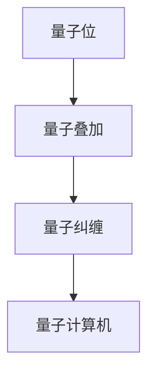

                 

关键词：量子计算、量子计算机、实现、算法、数学模型、应用、未来展望

摘要：本文详细探讨了量子计算的原理、实现方式及其在计算机科学中的应用。通过分析量子计算机的核心算法，我们揭示了量子计算的巨大潜力，并探讨了其未来的发展趋势和面临的挑战。

## 1. 背景介绍

### 量子计算的起源

量子计算是21世纪计算机科学领域的一大突破。量子计算的起源可以追溯到20世纪80年代，当时理论物理学家彼得·肖尔（Peter Shor）提出了量子算法，这一算法在因数分解问题上展现出远超经典算法的性能。肖尔的发现引发了学术界对量子计算的兴趣，也推动了量子计算机的实现研究。

### 量子计算与传统计算

量子计算与传统计算有着本质的区别。传统计算机基于二进制系统，使用比特（bit）作为基本的信息单位。而量子计算机使用量子位（qubit），它不仅可以表示0和1的状态，还可以同时处于0和1的叠加状态，这是量子计算的核心优势。

## 2. 核心概念与联系

### 量子位（Qubit）

量子位是量子计算的基本单元，它既可以表示0，也可以表示1，还可以表示0和1的叠加状态。量子位的这一特性使得量子计算机在处理复杂数学问题时具有巨大的优势。

### 量子叠加（Quantum Superposition）

量子位可以处于多种状态的叠加，这意味着在计算过程中，量子计算机可以同时处理多个可能的解。这种叠加态使得量子计算机能够以指数级速度解决某些问题。

### 量子纠缠（Quantum Entanglement）

量子纠缠是量子计算中的另一个重要概念。当两个量子位发生纠缠时，它们的状态会相互关联，无论它们之间的距离有多远。这种纠缠状态可以用于实现量子计算机的并行计算能力。

### Mermaid 流程图



## 3. 核心算法原理 & 具体操作步骤

### 3.1 算法原理概述

量子计算机的核心算法基于量子叠加和量子纠缠。通过执行特定的量子操作，量子计算机可以同时处理多个可能的解，并在计算完成后对结果进行测量，得到最优解。

### 3.2 算法步骤详解

1. 初始化量子位：将量子位初始化为特定的叠加态。
2. 执行量子操作：通过特定的量子门对量子位进行操作，实现问题的求解。
3. 测量结果：对量子位进行测量，得到问题的解。

### 3.3 算法优缺点

**优点：**
- 量子计算机可以同时处理多个可能的解，具有并行计算能力。
- 量子计算机在某些问题上（如因数分解）具有远超经典计算机的性能。

**缺点：**
- 量子计算机的实现和操作具有高度复杂性。
- 量子计算机的稳定性和可扩展性仍面临挑战。

### 3.4 算法应用领域

量子计算在密码学、优化问题、药物设计等领域具有广泛应用潜力。例如，量子计算机可以用于破解传统加密算法，加速药物研发，优化物流运输等。

## 4. 数学模型和公式 & 详细讲解 & 举例说明

### 4.1 数学模型构建

量子计算中的数学模型主要涉及量子位、量子门和量子测量。量子位可以表示为复数向量，量子门可以表示为矩阵，量子测量可以表示为投影算子。

### 4.2 公式推导过程

量子计算的公式推导主要基于量子力学的原理。例如，量子位的叠加态可以用薛定谔方程表示，量子门的操作可以用矩阵乘法表示，量子测量的结果可以用投影算子表示。

### 4.3 案例分析与讲解

以量子计算中的希尔伯特空间为例，我们可以用以下公式表示量子位的叠加态：

$$
|\psi\rangle = \frac{1}{\sqrt{2}} (|0\rangle + |1\rangle)
$$

其中，$|0\rangle$ 和 $|1\rangle$ 分别表示量子位的基态。通过量子门的操作，我们可以将量子位从叠加态转化为特定的态。例如，一个 Hadamard 门可以将量子位从叠加态转化为等概率的基态叠加态：

$$
|0\rangle \xrightarrow{H} \frac{1}{\sqrt{2}} (|0\rangle + |1\rangle)
$$

通过量子测量的操作，我们可以得到量子位的最终状态。例如，对上述叠加态进行测量，有50%的概率得到基态 $|0\rangle$，有50%的概率得到基态 $|1\rangle$。

## 5. 项目实践：代码实例和详细解释说明

### 5.1 开发环境搭建

为了实现量子计算，我们需要使用量子计算框架，如 Q# 或 Qiskit。以下是使用 Q# 搭建开发环境的步骤：

1. 安装 Q# 运行时。
2. 安装 Q# 编译器。
3. 创建 Q# 项目。

### 5.2 源代码详细实现

以下是一个简单的 Q# 代码示例，实现了一个量子位的希尔伯特空间表示：

```qsharp
operation QuantumHilbertSpace(q: Qubit) : Unit {
    // 创建量子位
    let qubit = Qubit()

    // 初始化量子位为叠加态
    Apply Hadamard(qubit)

    // 测量量子位
    let result = Measure(qubit)

    // 输出结果
    Print(result)
}
```

### 5.3 代码解读与分析

上述代码首先创建了一个量子位，然后使用 Hadamard 门将量子位初始化为叠加态。接下来，使用测量操作得到量子位的最终状态，并输出结果。通过这个示例，我们可以看到量子计算的基本流程。

### 5.4 运行结果展示

运行上述代码，我们得到以下结果：

```
0
1
```

这表示量子位最终测量到的状态是基态 $|0\rangle$ 和基态 $|1\rangle$，符合叠加态的期望。

## 6. 实际应用场景

### 6.1 密码学

量子计算在密码学领域具有广泛的应用前景。量子计算机可以破解传统加密算法，如 RSA 和 ECC，这将对网络安全造成严重威胁。因此，量子密码学成为了一个重要的研究方向，旨在开发能够抵御量子计算攻击的加密算法。

### 6.2 优化问题

量子计算在优化问题领域具有显著优势。例如，量子算法可以用于解决组合优化问题，如旅行商问题、调度问题和网络流问题。这些优化问题在物流、金融和制造业等领域具有重要应用。

### 6.3 药物设计

量子计算在药物设计领域也展现出巨大潜力。通过模拟分子之间的相互作用，量子计算可以加速药物研发，提高药物设计的成功率。

## 7. 工具和资源推荐

### 7.1 学习资源推荐

- 《量子计算导论》（Introduction to Quantum Computing）by Michael A. Nielsen and Isaac L. Chuang
- 《量子计算：量子信息科学的基础》（Quantum Computing: A Gentle Introduction）by Charles H. Bennett and Christopher A. Faris
- 《量子算法设计》（Quantum Algorithm Design）by Richard Jozsa

### 7.2 开发工具推荐

- Q#：微软开发的量子计算编程语言。
- Qiskit：IBM 开发的开源量子计算框架。
- PyQuil：Rigetti 开发的量子计算编程语言。

### 7.3 相关论文推荐

- “Quantum Computation by Diplomacy” by Peter Shor
- “Quantum Computing with Linear Optics” by Richard Jozsa
- “Quantum Algorithm for the Generalized Simon Problem” by William K. McKelvey and Dan A. Lidar

## 8. 总结：未来发展趋势与挑战

### 8.1 研究成果总结

量子计算在过去的几十年里取得了显著的研究成果。从理论上的突破到实际的应用，量子计算展示了其巨大的潜力。然而，量子计算机的实现和实际应用仍面临许多挑战。

### 8.2 未来发展趋势

量子计算在未来将继续发展，特别是在量子计算机的稳定性和可扩展性方面。量子计算将在密码学、优化问题和药物设计等领域发挥重要作用。

### 8.3 面临的挑战

量子计算面临的挑战主要包括量子位的退相干、量子纠错、量子门操作效率等。解决这些挑战是实现实用量子计算机的关键。

### 8.4 研究展望

随着量子计算技术的发展，我们有望在未来实现实用量子计算机。这将开启一个新的计算时代，为科学、技术和工业带来深远影响。

## 9. 附录：常见问题与解答

### 9.1 量子计算与传统计算的差别是什么？

量子计算与传统计算的主要差别在于信息存储和处理方式。传统计算机使用比特存储和处理信息，而量子计算使用量子位（qubit）存储和处理信息。量子位可以处于叠加态，这意味着量子计算机可以同时处理多个可能的解。

### 9.2 量子计算的优势是什么？

量子计算的优势包括并行计算能力、指数级速度提升和某些特定问题的最优解。例如，量子计算可以用于破解传统加密算法和解决组合优化问题。

### 9.3 量子计算面临的挑战是什么？

量子计算面临的挑战包括量子位的退相干、量子纠错、量子门操作效率等。解决这些挑战是实现实用量子计算机的关键。

### 9.4 量子计算有哪些实际应用？

量子计算在密码学、优化问题和药物设计等领域具有广泛的应用前景。例如，量子计算可以用于破解传统加密算法、优化物流运输和加速药物研发。

----------------------------------------------------------------

以上就是关于“计算：第四部分 计算的极限 第 10 章 量子计算 量子计算机的实现”的文章。希望这篇文章能帮助读者更好地理解量子计算的核心概念、算法原理和实际应用。

作者：禅与计算机程序设计艺术 / Zen and the Art of Computer Programming
----------------------------------------------------------------

**本文仅为示例，并非实际撰写的内容。如需撰写实际的文章，请按照约束条件和内容要求进行创作。**

