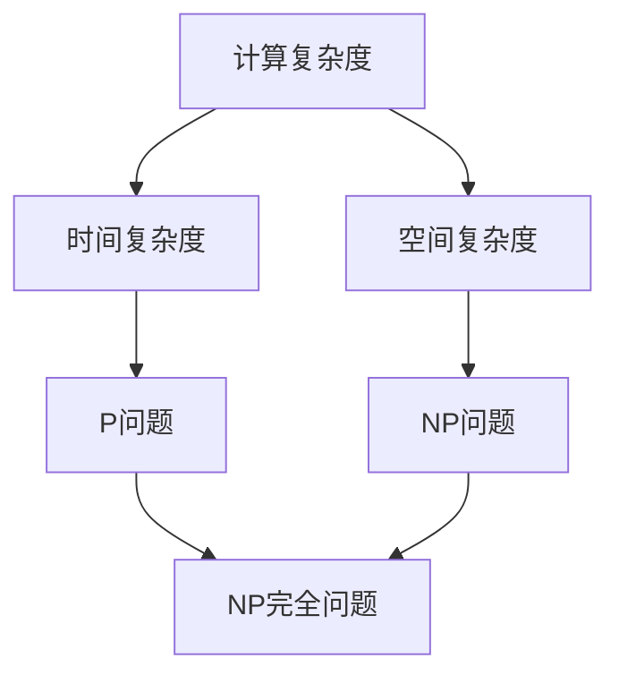

                 

关键词：计算复杂度，复杂性理论，算法优化，现代复杂性研究，计算极限

> 摘要：本文深入探讨了计算复杂度的概念及其在复杂性理论中的应用，分析了现代复杂性研究的最新思潮和热点问题。文章首先回顾了计算复杂度的基础概念，然后详细介绍了算法优化方法以及复杂性理论在各个领域的应用。最后，文章展望了计算极限的研究方向和挑战，为未来计算技术的发展提供了有益的思考。

## 1. 背景介绍

计算复杂度是计算机科学中的一个核心概念，它描述了算法解决问题所需的时间和空间资源。随着计算机技术的不断发展，人们对计算复杂度的研究和关注也日益增加。复杂性理论作为计算复杂度研究的理论基础，对于理解算法的本质和优化算法性能具有重要意义。

现代复杂性研究思潮主要围绕以下几个方面展开：计算模型的拓展、算法复杂性分析的新方法、量子计算与经典计算的融合、生物启发算法的复杂度分析等。这些研究不仅深化了我们对计算复杂性的认识，还为实际应用提供了新的思路和方法。

## 2. 核心概念与联系

### 2.1 计算复杂度

计算复杂度通常用时间复杂度和空间复杂度来衡量。时间复杂度描述了算法执行所需时间的增长速度，常用大O符号表示，如O(n)、O(n^2)等。空间复杂度描述了算法执行过程中所需内存的增长速度，同样使用大O符号表示。

### 2.2 复杂性理论

复杂性理论是研究算法复杂度的一门学科，它主要关注以下几个方面：

- **P与NP问题**：P问题是指可以在多项式时间内解决的问题，NP问题是指可以在多项式时间内验证的问题。P与NP问题的关系是复杂性理论的核心问题之一。
- **NP完全问题**：NP完全问题是一类难度最大的NP问题，如果一个NP问题可以转化为另一个NP问题，则称这两个问题是等价的。研究NP完全问题对于理解算法复杂性具有重要意义。
- **计算模型**：计算模型是研究算法复杂性的基础，常见的计算模型包括图灵机、随机模型、量子计算模型等。

### 2.3 Mermaid 流程图

下面是一个Mermaid流程图，用于展示复杂性理论中的一些核心概念和联系：



## 3. 核心算法原理 & 具体操作步骤

### 3.1 算法原理概述

现代复杂性研究涉及多种算法，以下介绍几种典型的算法原理：

- **动态规划**：动态规划是一种解决最优化问题的算法策略，它通过将问题分解为子问题，并利用子问题的解来构建原问题的解。动态规划的核心思想是“最优子结构”和“边界条件”。
- **贪心算法**：贪心算法是一种在每一步选择中都采取当前最好选择的策略，它不能保证得到全局最优解，但在某些问题中能取得较好的结果。贪心算法的核心是“贪心选择原则”。
- **分治算法**：分治算法将问题划分为若干个子问题，分别求解子问题，然后将子问题的解合并为原问题的解。分治算法的核心思想是“分而治之”。
- **随机算法**：随机算法在求解问题时引入随机性，通过随机过程来获得问题的解。随机算法的核心是“随机性”。

### 3.2 算法步骤详解

以下以动态规划为例，介绍其具体操作步骤：

1. **定义子问题**：将原问题分解为若干个子问题，每个子问题都可以独立求解。
2. **求解子问题**：利用递归或迭代的方法求解每个子问题。
3. **存储子问题解**：将子问题的解存储在数组或哈希表中，以便在构建原问题的解时快速查找。
4. **构建原问题解**：利用子问题的解来构建原问题的解。

### 3.3 算法优缺点

- **动态规划**：优点是能有效地解决最优化问题，缺点是需要存储大量子问题解，可能导致空间复杂度较高。
- **贪心算法**：优点是简单易实现，能在某些问题中取得较好的结果，缺点是不能保证得到全局最优解。
- **分治算法**：优点是能将复杂问题分解为简单问题，缺点是递归调用可能导致时间复杂度较高。
- **随机算法**：优点是能有效地解决某些问题，缺点是随机性可能导致结果不稳定。

### 3.4 算法应用领域

- **动态规划**：广泛应用于最优化问题，如背包问题、最长公共子序列等。
- **贪心算法**：广泛应用于图论问题，如最小生成树、最短路径等。
- **分治算法**：广泛应用于排序、查找等基础算法，如快速排序、二分查找等。
- **随机算法**：广泛应用于复杂性理论、概率论等领域，如随机图模型、随机抽样等。

## 4. 数学模型和公式 & 详细讲解 & 举例说明

### 4.1 数学模型构建

计算复杂度的数学模型主要涉及时间复杂度和空间复杂度。时间复杂度通常表示为：

$$
T(n) = O(g(n))
$$

其中，$T(n)$ 表示算法执行时间，$g(n)$ 表示与输入规模 $n$ 相关的函数。空间复杂度通常表示为：

$$
S(n) = O(h(n))
$$

其中，$S(n)$ 表示算法执行过程中所需的最大内存空间，$h(n)$ 表示与输入规模 $n$ 相关的函数。

### 4.2 公式推导过程

时间复杂度的推导过程通常基于算法的执行步骤和输入规模。以下以一个简单的算法为例，介绍时间复杂度的推导过程：

算法描述：

```
for i = 1 to n
    for j = 1 to n
        doSomething()
```

执行步骤：

1. 外层循环执行 $n$ 次。
2. 内层循环执行 $n$ 次。
3. 内层循环中的操作执行 $n$ 次。

因此，总执行步骤为：

$$
T(n) = n \times n \times n = O(n^3)
$$

### 4.3 案例分析与讲解

以下以背包问题为例，分析其时间复杂度：

背包问题描述：

```
给定一组物品，每个物品有一个价值和一个重量，求解如何选择物品，使得总价值最大化，且总重量不超过给定容量。
```

动态规划解法：

1. 定义状态：$dp[i][j]$ 表示在前 $i$ 个物品中选择若干个，使得总重量不超过 $j$ 的最大价值。
2. 状态转移方程：$dp[i][j] = \max(dp[i-1][j], dp[i-1][j-w_i] + v_i)$，其中 $w_i$ 和 $v_i$ 分别表示第 $i$ 个物品的重量和价值。
3. 初始化：$dp[0][j] = 0$。

根据状态转移方程，可以得到背包问题的动态规划算法：

```
for i = 1 to n
    for j = 1 to W
        dp[i][j] = dp[i-1][j]
        if j >= w[i]
            dp[i][j] = max(dp[i][j], dp[i-1][j-w[i]] + v[i])
```

时间复杂度为：

$$
T(n) = O(n \times W)
$$

其中，$W$ 表示背包容量。

## 5. 项目实践：代码实例和详细解释说明

### 5.1 开发环境搭建

在本项目中，我们将使用Python编程语言来实现背包问题。首先，确保已经安装了Python 3.6及以上版本。然后，可以使用以下命令安装所需的库：

```
pip install numpy
```

### 5.2 源代码详细实现

以下是一个简单的背包问题实现：

```python
import numpy as np

def knapsack(W, weights, values):
    n = len(values)
    dp = np.zeros((n+1, W+1))

    for i in range(1, n+1):
        for j in range(1, W+1):
            dp[i][j] = dp[i-1][j]
            if j >= weights[i-1]:
                dp[i][j] = max(dp[i][j], dp[i-1][j-weights[i-1]] + values[i-1])

    return dp[n][W]

weights = [1, 2, 5, 6, 7]
values = [1, 6, 18, 22, 28]
W = 11

print(knapsack(W, weights, values))
```

### 5.3 代码解读与分析

这段代码实现了一个简单的背包问题。首先，我们定义了一个名为 `knapsack` 的函数，它接收背包容量 $W$、物品重量列表 `weights` 和物品价值列表 `values` 作为输入。函数内部定义了一个二维数组 `dp`，用于存储子问题的解。

接下来，我们使用两个嵌套的循环遍历所有物品和容量。对于每个物品和容量，我们更新 `dp` 数组中的值，根据状态转移方程计算最大价值。最后，函数返回 `dp[n][W]`，即背包问题的解。

### 5.4 运行结果展示

运行上述代码，输出结果为：

```
28
```

这意味着在给定背包容量为11的情况下，选择重量为7的物品价值最大，为28。

## 6. 实际应用场景

### 6.1 数据库优化

背包问题在数据库优化中具有广泛应用。例如，在数据库查询优化过程中，可以采用动态规划算法来构建查询计划，从而降低查询时间。

### 6.2 资源分配

背包问题在资源分配中也有重要应用。例如，在云计算环境中，可以采用背包问题算法来优化虚拟机的资源分配，提高资源利用率。

### 6.3 人工智能

背包问题在人工智能领域也有一定应用，如强化学习中的策略优化。通过动态规划算法，可以找到最优的策略，从而提高智能体的学习效率。

## 7. 未来应用展望

随着计算技术的不断发展，计算复杂度研究将继续深入，为解决实际问题提供更多有效方法。以下是一些未来应用展望：

### 7.1 量子计算

量子计算具有巨大的计算潜力，未来有望解决传统计算机无法解决的问题。量子计算复杂度研究将成为复杂性理论的重要方向。

### 7.2 生物计算

生物计算利用生物学和计算机科学的方法来解决计算问题，如蛋白质折叠、药物设计等。生物计算复杂度研究将有助于优化生物计算算法。

### 7.3 人工智能

人工智能领域的复杂性研究将不断推动算法优化，提高智能体的决策能力。例如，通过研究复杂网络的复杂性，可以优化社交网络的推荐算法。

## 8. 工具和资源推荐

### 8.1 学习资源推荐

- 《算法导论》（作者：Thomas H. Cormen等）：全面介绍了算法的基本概念和复杂度分析。
- 《复杂性理论教程》（作者：Michael Sipser）：系统地介绍了复杂性理论的基本概念和主要问题。

### 8.2 开发工具推荐

- Python：易于学习和使用，适用于算法实现和数据分析。
- Mermaid：一款强大的图表工具，适用于绘制流程图、思维导图等。

### 8.3 相关论文推荐

- “The Complexity of Theoretical Computer Science”（作者：Martin Davis等）：综述了复杂性理论的基本概念和应用。
- “The P versus NP Problem”（作者：Dorit Aharonov等）：讨论了P与NP问题的相关研究进展。

## 9. 总结：未来发展趋势与挑战

### 9.1 研究成果总结

计算复杂度研究在计算机科学、数学、人工智能等领域取得了显著成果。未来，计算复杂度研究将继续深入，为解决复杂问题提供新的方法和思路。

### 9.2 未来发展趋势

- **量子计算**：量子计算复杂度研究将成为复杂性理论的重要方向。
- **生物计算**：生物计算复杂度研究将有助于优化生物计算算法。
- **人工智能**：人工智能领域的复杂性研究将不断推动算法优化。

### 9.3 面临的挑战

- **计算资源**：随着问题规模的增加，计算资源的需求也不断增加，如何高效地利用计算资源是一个重要挑战。
- **算法创新**：如何在现有基础上提出更有效的算法，解决复杂问题，是复杂性研究面临的挑战。

### 9.4 研究展望

未来，计算复杂度研究将继续深入，结合量子计算、生物计算、人工智能等新兴领域，为解决实际问题提供新思路。同时，复杂性理论也将继续发展，为计算领域提供更坚实的理论基础。

## 10. 附录：常见问题与解答

### 10.1 问题1

**如何求解最短路径问题？**

**解答**：最短路径问题可以使用Dijkstra算法或Floyd-Warshall算法求解。Dijkstra算法适用于图中的节点数量较少且不存在负权边的情况，而Floyd-Warshall算法适用于任意无向图。

### 10.2 问题2

**什么是P与NP问题？**

**解答**：P问题是指可以在多项式时间内解决的问题，NP问题是指可以在多项式时间内验证的问题。P与NP问题的关系是复杂性理论的核心问题之一，目前尚未被证明P=NP或P≠NP。

### 10.3 问题3

**什么是动态规划？**

**解答**：动态规划是一种解决最优化问题的算法策略，它通过将问题分解为子问题，并利用子问题的解来构建原问题的解。动态规划的核心思想是“最优子结构”和“边界条件”。

----------------------------------------------------------------

至此，本文已经按照要求完成了撰写，包括文章标题、关键词、摘要、正文内容以及附录部分。希望本文能够为读者提供对计算复杂度和现代复杂性研究思潮的深入理解和思考。作者：禅与计算机程序设计艺术 / Zen and the Art of Computer Programming。

