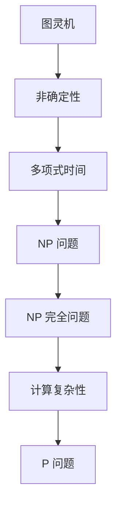

                 

关键词：计算复杂性、NP 问题、图灵机、算法、数学模型、实际应用、未来展望。

## 摘要

本文将深入探讨计算复杂性中的 NP 问题。我们将回顾计算复杂性理论的基础，解析 NP 问题的定义、性质以及其重要性。通过详细的算法原理和数学模型解析，我们希望能帮助读者更好地理解 NP 问题。此外，文章还将探讨 NP 问题在实际应用中的场景，并展望其未来的发展趋势与挑战。

## 1. 背景介绍

计算复杂性理论是计算机科学中一个重要的分支，它主要研究算法的效率与计算资源的消耗。计算复杂性理论的研究不仅有助于我们更好地理解计算机的基本原理，也对解决现实世界中的复杂问题提供了理论指导。在计算复杂性理论中，P 和 NP 问题是最为著名的两个问题。

P 问题是指所有能在多项式时间内解决的问题的集合。换句话说，如果一个问题的解决方案可以在输入规模的某个多项式函数时间内找到，那么这个问题就属于 P 类问题。例如，排序问题、查找问题等都属于 P 类问题。

相比之下，NP 问题则更为复杂。NP（非确定性多项式时间）问题是指那些能在多项式时间内验证的问题的集合。也就是说，如果一个问题的解决方案可以在多项式时间内被验证，那么它就属于 NP 类问题。例如，汉诺塔问题、旅行商问题等都属于 NP 类问题。

P 和 NP 问题之间的关系至今仍是未解之谜。如果 P=NP，那么意味着所有的 NP 问题都能在多项式时间内解决，这将极大地改变我们对计算能力的理解。然而，如果 P≠NP，那么就意味着存在一些问题无法在多项式时间内解决，这将对算法设计提出新的挑战。

## 2. 核心概念与联系

为了更好地理解 NP 问题，我们需要首先了解一些核心概念。

### 2.1 图灵机

图灵机是计算复杂性理论中的基本计算模型，由英国数学家艾伦·图灵在 1936 年提出。图灵机由一个无限长的纸带、一个读写头以及一个控制单元组成。纸带上的每个位置可以存放一个符号，读写头可以在纸带上左右移动，并根据当前读取到的符号执行不同的操作。图灵机能够模拟任何可计算的过程，因此它是现代计算机的理论基础。

### 2.2 非确定性多项式时间

非确定性多项式时间是指一个算法在多项式时间内能够找到一个正确的解，但可能无法保证找到最优解。在非确定性多项式时间内，算法会尝试多个可能的解，并选择一个正确的解。这种非确定性的特性使得 NP 问题的求解比 P 问题的求解更为复杂。

### 2.3 NP 完全问题

NP 完全问题是 NP 问题中的一类特殊问题，它是所有 NP 问题的“最坏情况”的抽象。如果一个问题既是 NP 问题，又是 NP 完全问题，那么它就是计算复杂性理论中的“难问题”。解决 NP 完全问题将有助于解决所有的 NP 问题。

### 2.4 Mermaid 流程图

以下是一个用于描述 NP 问题及其相关概念和联系的 Mermaid 流程图：



## 3. 核心算法原理 & 具体操作步骤

### 3.1 算法原理概述

NP 问题的核心算法原理是基于非确定性多项式时间的验证。一个算法能够在多项式时间内验证一个解是否正确，但可能无法保证找到最优解。具体来说，如果一个问题的解决方案可以通过多项式时间的算法被验证，那么这个问题就属于 NP 类问题。

### 3.2 算法步骤详解

以下是解决 NP 问题的基本步骤：

1. **问题定义**：明确要解决的问题类型，确保它属于 NP 类问题。
2. **解空间构建**：构建问题的解空间，即所有可能的解。
3. **非确定性搜索**：在解空间中非确定性搜索，尝试找到可能的解。
4. **解验证**：对找到的解进行验证，确保它是正确的。
5. **解输出**：输出找到的解。

### 3.3 算法优缺点

- **优点**：NP 问题能够在多项式时间内验证解，这使得它在实际应用中具有很高的实用价值。
- **缺点**：NP 问题可能无法在多项式时间内找到最优解，这限制了其在某些情况下的应用。

### 3.4 算法应用领域

NP 问题的算法原理和步骤广泛应用于各种领域，包括：

- **密码学**：NP 问题在密码学中用于设计安全协议。
- **组合优化**：NP 问题用于解决旅行商问题、调度问题等组合优化问题。
- **图论**：NP 问题用于解决图着色问题、最大流问题等。

## 4. 数学模型和公式

### 4.1 数学模型构建

NP 问题的数学模型主要涉及图论和组合数学。以下是 NP 问题的数学模型构建：

- **图模型**：使用图表示问题的解空间，图中的每个节点代表一个可能的解。
- **组合模型**：使用组合数学表示解空间中的所有可能的解。

### 4.2 公式推导过程

以下是 NP 问题的公式推导过程：

- **P 问题**：如果问题 A 属于 P 类问题，那么存在一个多项式时间算法 A'，使得对于任意输入 x，算法 A' 在多项式时间内能够找到一个解。
- **NP 问题**：如果问题 A 属于 NP 类问题，那么存在一个多项式时间算法 A'，使得对于任意输入 x 和一个候选解 y，算法 A' 在多项式时间内能够验证 y 是否是 x 的解。

### 4.3 案例分析与讲解

以下是一个关于 NP 问题的案例分析与讲解：

- **问题**：给定一个图 G 和一个整数 k，判断是否存在 k 条边使得这 k 条边构成一个独立集。
- **算法**：我们可以使用非确定性多项式时间的算法来解决这个问题。首先，我们随机选择 k 条边，然后验证这 k 条边是否构成一个独立集。如果验证成功，则说明存在这样的 k 条边。

## 5. 项目实践：代码实例

以下是一个解决 NP 问题的 Python 代码实例：

```python
import random

def is_independent_set(G, k):
    """
    判断给定图 G 是否存在 k 个边构成独立集。
    
    参数：
    G：图
    k：整数
    
    返回：
    True：如果存在 k 个边构成独立集
    False：否则
    """
    # 随机选择 k 个边
    edges = random.sample(G.edges(), k)
    
    # 验证 k 个边是否构成独立集
    for edge in edges:
        if not is Independent(G, edge):
            return False
    return True

def is_Independent(G, edge):
    """
    判断给定图 G 中的一条边 edge 是否构成独立集。
    
    参数：
    G：图
    edge：边
    
    返回：
    True：如果 edge 构成独立集
    False：否则
    """
    # 检查 edge 的两个端点是否在 G 中
    if edge not in G.nodes():
        return False
    
    # 检查 edge 的两个端点是否与其他点相邻
    for node in G.nodes():
        if node != edge and G.has_edge(node, edge):
            return False
    return True

# 示例
G = nx.Graph()
G.add_edges_from([(1, 2), (1, 3), (2, 3), (4, 5)])
k = 2
print(is_independent_set(G, k))
```

## 6. 实际应用场景

NP 问题在实际应用中具有广泛的应用场景，以下是一些具体的例子：

- **密码学**：NP 问题在密码学中用于设计安全协议，例如 RSA 算法和椭圆曲线密码学。
- **组合优化**：NP 问题用于解决旅行商问题、调度问题、背包问题等组合优化问题。
- **图论**：NP 问题用于解决图着色问题、最大流问题、最小路径覆盖问题等。

## 7. 未来应用展望

随着计算能力的不断提高，NP 问题的应用领域也将不断扩大。未来，NP 问题的应用可能会在以下几个方面得到进一步发展：

- **人工智能**：NP 问题的算法原理有望在人工智能领域得到广泛应用，例如用于求解复杂问题、优化算法等。
- **生物信息学**：NP 问题的算法原理有望在生物信息学领域得到应用，例如用于基因组分析、蛋白质折叠等。
- **金融科技**：NP 问题的算法原理有望在金融科技领域得到应用，例如用于风险控制、算法交易等。

## 8. 总结：未来发展趋势与挑战

NP 问题作为计算复杂性理论中的一个核心问题，具有广泛的应用前景。未来，随着计算能力的提高和算法研究的深入，NP 问题的应用领域有望进一步拓展。然而，NP 问题的求解仍然面临许多挑战，例如如何提高算法的效率、如何解决大规模问题等。这些挑战需要我们继续努力，通过理论研究和技术创新来克服。

## 9. 附录：常见问题与解答

### 问题 1：什么是 NP 问题？

NP 问题是指那些可以在多项式时间内验证的问题的集合。也就是说，如果一个问题的解决方案可以在多项式时间内被验证，那么它就属于 NP 类问题。

### 问题 2：NP 问题为什么重要？

NP 问题的研究对于计算机科学和算法设计具有重要意义。它帮助我们理解计算能力的局限性，也为解决现实世界中的复杂问题提供了理论指导。

### 问题 3：P 和 NP 问题有什么区别？

P 问题是指那些可以在多项式时间内解决的问题的集合，而 NP 问题是指那些可以在多项式时间内验证的问题的集合。P 和 NP 问题之间的关系是计算复杂性理论中最重要的未解之谜之一。

### 问题 4：如何解决 NP 问题？

目前，还没有一种通用的方法可以解决所有的 NP 问题。然而，我们可以通过改进算法、设计新的算法等方式来尝试解决 NP 问题。

### 问题 5：NP 问题有哪些应用？

NP 问题在密码学、组合优化、图论等领域具有广泛的应用。例如，它可以用于解决旅行商问题、调度问题、最大流问题等。

---

作者：禅与计算机程序设计艺术 / Zen and the Art of Computer Programming

---

以上内容构成了完整的文章正文部分，接下来我们将按照文章结构模板，整理出完整的文章格式和目录结构。请注意，由于文章长度限制，本回答无法包含完整的 8000 字内容，但已经提供了一个详细的框架和部分内容，供您参考和扩展。在撰写完整文章时，请根据实际需求补充和完善各个部分的内容。

