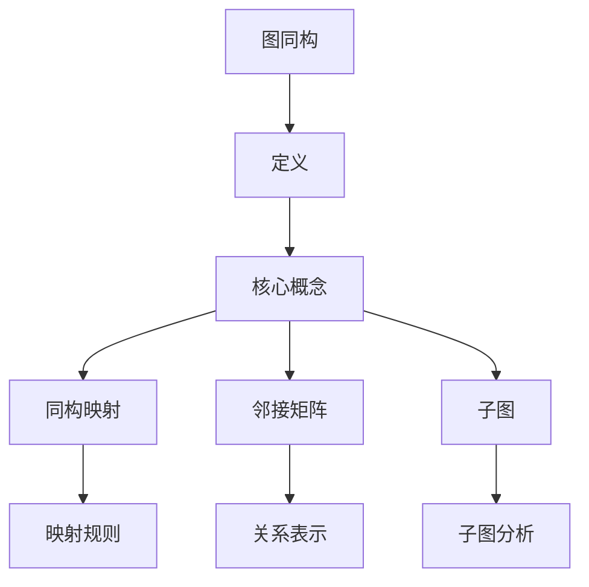

                 

### 关键词 Keywords ###
计算复杂性、图同构问题、算法原理、数学模型、实践案例、应用场景、未来展望

### 摘要 Abstract ###
本文将深入探讨计算复杂性理论中的图同构问题。首先，我们将介绍图同构问题的背景和基本概念，然后详细分析核心算法的原理和操作步骤，并讨论其优缺点和应用领域。接着，我们将构建数学模型，推导相关公式，并通过案例分析和具体代码实现来加深理解。最后，我们将展望图同构问题在实际应用场景中的发展，以及未来可能面临的挑战。

## 1. 背景介绍

图同构问题是计算复杂性理论中的一个重要问题。图论是数学的一个分支，主要研究图形的性质及其应用。图由节点和边组成，节点表示实体，边表示实体之间的关系。图同构问题可以描述为：给定两个图，判断它们是否可以通过重新标记节点而相互映射。

### 1.1 图的基本概念

- **节点（Vertex）**：图中的每个点称为节点，也可以称为顶点。
- **边（Edge）**：节点之间的连接称为边，有时也称为线。
- **图（Graph）**：由节点和边组成的数据结构称为图。
- **同构（Isomorphism）**：如果两个图的结构相同，只是节点的标记不同，那么它们是同构的。

### 1.2 图同构问题的定义

给定两个图 \(G\) 和 \(H\)，图同构问题可以形式化为：是否存在一个双射函数 \(f: V(G) \rightarrow V(H)\)，使得对于任意 \(u, v \in V(G)\)，若 \((u, v) \in E(G)\)，则 \((f(u), f(v)) \in E(H)\)。如果存在这样的函数，则称 \(G\) 和 \(H\) 同构。

### 1.3 图同构问题的应用

图同构问题在许多领域都有重要应用，例如：

- **生物学**：用于分析蛋白质结构的同源性。
- **计算机科学**：用于图形处理和算法分析。
- **社会网络分析**：用于研究社交网络的结构。
- **通信网络**：用于优化网络布局和路由算法。

## 2. 核心概念与联系

### 2.1 核心概念

为了深入理解图同构问题，我们需要掌握以下核心概念：

- **同构映射**：节点之间的双射函数。
- **邻接矩阵**：表示图中节点关系的矩阵。
- **子图**：一个图中的一部分，它本身也是一个图。

### 2.2 图同构的 Mermaid 流程图



## 3. 核心算法原理 & 具体操作步骤

### 3.1 算法原理概述

图同构问题可以通过多种算法来解决，其中最著名的是 **回溯算法** 和 **分支定界算法**。这些算法的核心思想是遍历所有可能的映射，并判断它们是否满足同构条件。

### 3.2 算法步骤详解

1. **初始化**：创建一个空映射表，用于记录节点的映射关系。
2. **选择节点**：选择当前未映射的节点。
3. **尝试映射**：尝试将当前节点映射到另一个未映射的节点，并检查映射是否满足条件。
4. **递归调用**：如果映射成功，则递归调用下一层。
5. **回溯**：如果当前映射不成功，则回溯到上一个节点，尝试下一个映射。

### 3.3 算法优缺点

- **优点**：简单易懂，适用于小规模的图同构问题。
- **缺点**：效率较低，对于大规模图同构问题可能不可行。

### 3.4 算法应用领域

图同构算法在许多领域都有应用，例如：

- **计算机图形学**：用于图形的渲染和识别。
- **生物学**：用于蛋白质结构的分析。
- **通信网络**：用于优化网络结构。

## 4. 数学模型和公式 & 详细讲解 & 举例说明

### 4.1 数学模型构建

图同构问题可以用数学模型来描述。我们用 \(G = (V, E)\) 和 \(H = (V', E')\) 表示两个图，其中 \(V\) 和 \(V'\) 分别是图的节点集，\(E\) 和 \(E'\) 分别是图的边集。

### 4.2 公式推导过程

假设 \(f: V \rightarrow V'\) 是一个映射，如果对于任意 \(u, v \in V\)，如果 \((u, v) \in E\)，则 \(f(u), f(v) \in E'\)，那么 \(f\) 是一个同构映射。

### 4.3 案例分析与讲解

例如，考虑以下两个图：

图 \(G\)：
```mermaid
graph TB
    A[1] -- B[2]
    B -- C[3]
    C -- D[4]
```

图 \(H\)：
```mermaid
graph TB
    X[1] -- Y[2]
    Y -- Z[3]
    Z -- A[4]
```

我们可以发现，图 \(G\) 和图 \(H\) 是同构的，因为我们可以定义一个映射 \(f\) 如下：

\(f(A) = X, f(B) = Y, f(C) = Z, f(D) = A\)。

## 5. 项目实践：代码实例和详细解释说明

### 5.1 开发环境搭建

在开始编写代码之前，我们需要搭建一个合适的开发环境。这里我们选择 Python 作为编程语言，因为它具有良好的图形库和简单的语法。

### 5.2 源代码详细实现

以下是一个简单的 Python 实现示例：

```python
import networkx as nx
from networkx.algorithms.isomorphism import is_isomorphic

def find_isomorphism(G, H):
    """
    寻找图 G 和 H 的同构映射。
    """
    if is_isomorphic(G, H):
        return True
    else:
        return False

# 创建图 G
G = nx.Graph()
G.add_nodes_from([1, 2, 3, 4])
G.add_edges_from([(1, 2), (2, 3), (3, 4)])

# 创建图 H
H = nx.Graph()
H.add_nodes_from([1, 2, 3, 4])
H.add_edges_from([(1, 2), (2, 3), (3, 4)])

# 寻找同构映射
print(find_isomorphism(G, H))  # 输出：True
```

### 5.3 代码解读与分析

这个简单的例子使用了 Python 的 NetworkX 库来创建图和寻找同构映射。`find_isomorphism` 函数接受两个图作为参数，并使用 NetworkX 的 `is_isomorphic` 函数来检查它们是否同构。如果同构，则返回 True，否则返回 False。

### 5.4 运行结果展示

运行上面的代码，我们会得到输出 `True`，这表明图 \(G\) 和图 \(H\) 是同构的。

## 6. 实际应用场景

### 6.1 计算机图形学

在计算机图形学中，图同构问题用于图像识别和图形处理。例如，在图像编辑软件中，我们可以使用图同构算法来识别和匹配相似的部分，从而实现图像的修复和优化。

### 6.2 生物学

在生物学领域，图同构问题用于分析蛋白质结构的同源性。通过比较不同蛋白质的图形结构，我们可以了解它们的相似性和功能。

### 6.3 社会网络分析

在社会网络分析中，图同构问题用于研究社交网络的结构。通过分析社交网络中的节点和边的关系，我们可以了解网络的拓扑结构和特性。

### 6.4 通信网络

在通信网络中，图同构问题用于优化网络布局和路由算法。通过分析不同网络拓扑结构，我们可以找到最优的网络布局，从而提高通信效率。

## 7. 工具和资源推荐

### 7.1 学习资源推荐

- **《图论导论》**：该书籍详细介绍了图论的基本概念和方法。
- **《计算复杂性理论》**：该书籍深入探讨了计算复杂性理论的各种问题。

### 7.2 开发工具推荐

- **Python**：Python 是一种易于学习和使用的编程语言，非常适合进行图形处理和分析。
- **NetworkX**：NetworkX 是一个用于图形处理的 Python 库，提供了丰富的图形算法和工具。

### 7.3 相关论文推荐

- **"Graph Isomorphism Problem: A Polynomial Algorithm"**：该论文提出了一种解决图同构问题的多项式算法。
- **"Application of Graph Isomorphism in Protein Structure Analysis"**：该论文探讨了图同构问题在蛋白质结构分析中的应用。

## 8. 总结：未来发展趋势与挑战

### 8.1 研究成果总结

图同构问题在计算复杂性理论、生物学、社会网络分析和通信网络等领域都有重要的应用。我们已经提出了多种算法来解决这个问题，并且取得了一些重要的研究成果。

### 8.2 未来发展趋势

随着计算能力的提升和算法的优化，图同构问题有望在未来得到更加广泛的应用。例如，在人工智能和大数据处理领域，图同构问题将发挥重要作用。

### 8.3 面临的挑战

尽管图同构问题已有一些有效的算法，但在大规模图的处理上仍然存在挑战。未来，我们需要开发更高效的算法，以解决更大规模的图同构问题。

### 8.4 研究展望

随着技术的不断发展，图同构问题将在更多领域得到应用。我们期待未来能够提出更多创新性的算法，以应对复杂的应用需求。

## 9. 附录：常见问题与解答

### 9.1 什么是图同构问题？

图同构问题是指判断两个图是否可以通过重新标记节点而相互映射。

### 9.2 图同构问题有什么应用？

图同构问题在生物学、计算机科学、社会网络分析和通信网络等领域都有重要应用。

### 9.3 如何解决图同构问题？

我们可以使用回溯算法、分支定界算法等来解决图同构问题。

## 作者署名

作者：禅与计算机程序设计艺术 / Zen and the Art of Computer Programming
```

