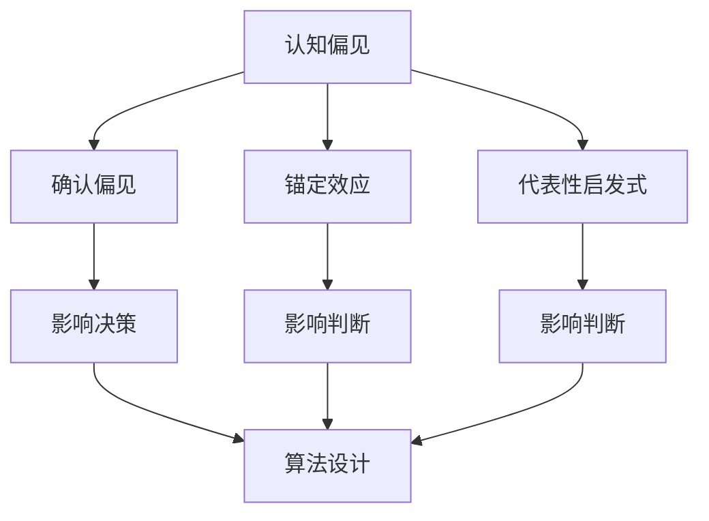

                 

在信息技术和软件开发的世界里，逻辑、效率和准确性是至关重要的。然而，即便是我们最精细的计算和最严密的算法，也无法完全摆脱认知偏见的影响。本文将探讨认知偏见在IT领域中的具体表现，剖析这些偏见如何影响我们的理解，并探索如何通过科学的方法和工具来突破这些认知障碍，从而提升技术的创新和应用效果。

> **关键词：** 认知偏见、逻辑思维、算法优化、技术实践、创新应用

> **摘要：** 本文首先介绍了认知偏见的概念及其在IT领域的具体表现。接着，通过详细分析几个常见的认知偏见，阐述了它们如何影响程序员和软件工程师的工作。文章随后提出了利用数学模型和算法原理来应对这些偏见的策略，并举例说明了这些策略的实际应用。最后，文章探讨了未来的研究方向和挑战，为读者提供了继续探索这一领域的启示。

## 1. 背景介绍

认知偏见，又称认知偏差，是指人们在感知、理解、判断和决策过程中，由于各种心理和社会因素的影响，导致的认知过程偏离客观事实的倾向。这些偏见可以源自我们的大脑处理信息的局限性、社会文化的规范，甚至是个人经历的偏好。在IT领域，认知偏见可能会隐藏在算法设计、代码编写、项目管理等多个环节中，影响软件质量和开发效率。

认知偏见的存在并不意味着个人有意欺骗或疏忽，而是人类认知系统固有的缺陷。然而，对于追求精确和效率的IT行业而言，认知偏见可能带来严重的后果，如算法错误、软件缺陷、决策失误等。因此，认识和克服这些偏见，对提升技术水平和推动创新具有重要意义。

## 2. 核心概念与联系

为了更好地理解认知偏见对IT领域的影响，首先需要了解几个关键概念，以及它们之间的联系。

### 2.1 认知偏见

认知偏见是指人们在信息处理过程中产生的系统性偏差，这些偏差可以表现为：

- **确认偏见（Confirmation Bias）**：倾向于寻找和记住支持已有观点的信息，忽视与之相矛盾的信息。
- **锚定效应（Anchoring Effect）**：在做出决策时，初期信息（锚点）对后续判断产生过大的影响。
- **代表性启发式（Representativeness Heuristic）**：基于事物或现象的典型特征进行快速判断，而忽视概率和统计信息。

### 2.2 逻辑思维

逻辑思维是构建严谨算法和软件系统的基础。它包括：

- **演绎推理（Deductive Reasoning）**：从一般原则推导出具体结论。
- **归纳推理（Inductive Reasoning）**：从具体实例推导出一般性规律。

### 2.3 算法原理

算法是解决问题的系统方法，其设计需要考虑以下几个方面：

- **正确性（Correctness）**：算法能够得到正确的结果。
- **效率（Efficiency）**：算法在时间和空间上的消耗最小。
- **鲁棒性（Robustness）**：算法对输入数据变化的适应能力。

### 2.4 Mermaid 流程图

为了直观地展示认知偏见与逻辑思维、算法原理之间的关系，以下是一个简化的 Mermaid 流程图：



### 2.5  关联性解释

- **认知偏见与逻辑思维**：认知偏见可能导致逻辑思维的偏差，如确认偏见可能会让程序员只关注符合已有预期的结果，忽略其他可能性。
- **认知偏见与算法原理**：算法设计中的错误往往源自认知偏见，如锚定效应可能使得算法对某些数据赋予过大的权重，导致不准确的结果。
- **逻辑思维与算法原理**：良好的逻辑思维有助于发现和纠正算法设计中的偏见，从而提高算法的效率和正确性。

## 3. 核心算法原理 & 具体操作步骤

### 3.1 算法原理概述

为了克服认知偏见对算法设计的影响，我们需要从以下几个方面入手：

1. **多样性测试（Diversity Testing）**：通过设计多种测试用例，确保算法在不同场景下的适应性。
2. **交叉验证（Cross-Validation）**：采用交叉验证方法，减少锚定效应对模型评估的影响。
3. **反事实推理（Counterfactual Reasoning）**：考虑假设不同情况下的算法表现，从而发现潜在的偏见。

### 3.2 算法步骤详解

#### 3.2.1 多样性测试

1. **测试用例设计**：设计涵盖多种场景和数据的测试用例，确保算法的通用性。
2. **测试执行**：运行测试用例，记录测试结果。
3. **结果分析**：分析测试结果，找出潜在的偏见和问题。

#### 3.2.2 交叉验证

1. **数据分割**：将数据集分割为训练集和验证集。
2. **模型训练**：在训练集上训练模型。
3. **模型评估**：在验证集上评估模型性能。
4. **多次迭代**：重复上述过程，优化模型。

#### 3.2.3 反事实推理

1. **假设情景**：设想不同的输入条件和结果。
2. **算法模拟**：模拟算法在这些假设情景下的表现。
3. **结果对比**：对比实际结果与假设结果，发现潜在的偏见。

### 3.3 算法优缺点

#### 优点：

- **提高算法的鲁棒性**：通过多样性测试和交叉验证，算法能够在不同场景下保持稳定表现。
- **减少认知偏见**：反事实推理有助于发现并纠正算法中的偏见。

#### 缺点：

- **计算成本较高**：多样性测试和交叉验证需要大量计算资源。
- **结果解释复杂**：反事实推理的结果可能需要深入分析，增加理解难度。

### 3.4 算法应用领域

算法的这些原理和技术在多个领域都有广泛的应用：

- **机器学习**：通过多样性测试和交叉验证，提高模型的稳定性和准确性。
- **数据挖掘**：利用反事实推理，发现数据中的潜在模式和偏见。
- **软件开发**：在代码编写和测试过程中，通过多样性测试和交叉验证，减少软件缺陷。

## 4. 数学模型和公式 & 详细讲解 & 举例说明

### 4.1 数学模型构建

为了更深入地理解算法原理，我们需要引入一些数学模型和公式。

#### 4.1.1 多样性测试

多样性测试的核心是设计多样的测试用例，以下是一个简单的示例：

$$
Diversity = \frac{\sum_{i=1}^{n} (|T_i - T_j|)}{n \times (n-1)}
$$

其中，$Diversity$ 表示测试用例的多样性，$T_i$ 和 $T_j$ 分别表示两个测试用例的执行结果。

#### 4.1.2 交叉验证

交叉验证的主要目标是减少模型评估中的随机误差，以下是一个 k-折交叉验证的示例：

$$
Accuracy_k = \frac{1}{k} \sum_{i=1}^{k} \left( \frac{TP_i + TN_i}{TP_i + TN_i + FP_i + FN_i} \right)
$$

其中，$Accuracy_k$ 表示 k-折交叉验证的平均准确率，$TP_i, TN_i, FP_i, FN_i$ 分别表示第 $i$ 次验证中模型的真正例、假正例、真负例和假负例。

#### 4.1.3 反事实推理

反事实推理的核心是模拟不同的情景，以下是一个简单的反事实推理示例：

$$
Cost(a) = C(a, \bar{a}) + \lambda \cdot D(a)
$$

其中，$Cost(a)$ 表示在情景 $a$ 下的成本，$\bar{a}$ 表示参考情景，$C(a, \bar{a})$ 表示在两个情景下的成本差异，$D(a)$ 表示情景 $a$ 的多样性。

### 4.2 公式推导过程

#### 4.2.1 多样性测试

多样性测试的公式推导基于测试用例之间的差异。我们首先计算每个测试用例与其它测试用例之间的差异，然后求平均值。

设 $T_1, T_2, ..., T_n$ 为 $n$ 个测试用例的执行结果，则每个测试用例与其他测试用例之间的差异为：

$$
|T_i - T_j| = \sum_{k=1}^{m} (X_{ik} - X_{jk})
$$

其中，$X_{ik}$ 和 $X_{jk}$ 分别表示测试用例 $T_i$ 和 $T_j$ 在第 $k$ 个特征上的值。

然后，计算所有差异的平均值：

$$
Diversity = \frac{\sum_{i=1}^{n} \sum_{j=1, j \neq i}^{n} |T_i - T_j|}{n \times (n-1)}
$$

为了简化计算，我们可以将其表示为：

$$
Diversity = \frac{\sum_{i=1}^{n} (n - 1) \cdot |T_i - T_{\text{mean}}|}{n \times (n-1)}
$$

其中，$T_{\text{mean}}$ 表示所有测试用例的平均值。

#### 4.2.2 交叉验证

交叉验证的公式推导基于模型在验证集上的表现。我们首先将数据集分割为 $k$ 个子集，然后每次选择一个子集作为验证集，其余子集作为训练集。

设 $D_1, D_2, ..., D_k$ 为 $k$ 个子集，$M_1, M_2, ..., M_k$ 为在 $D_1, D_2, ..., D_k$ 上训练得到的模型，$V_1, V_2, ..., V_k$ 为在 $D_1, D_2, ..., D_k$ 上评估的模型表现，则交叉验证的平均准确率为：

$$
Accuracy_k = \frac{1}{k} \sum_{i=1}^{k} \left( \frac{TP_i + TN_i}{TP_i + TN_i + FP_i + FN_i} \right)
$$

其中，$TP_i, TN_i, FP_i, FN_i$ 分别表示在第 $i$ 次验证中模型的真正例、假正例、真负例和假负例。

#### 4.2.3 反事实推理

反事实推理的公式推导基于成本函数和多样性度量。我们首先定义成本函数：

$$
Cost(a) = C(a, \bar{a}) + \lambda \cdot D(a)
$$

其中，$C(a, \bar{a})$ 表示在情景 $a$ 和 $\bar{a}$ 下的成本差异，$D(a)$ 表示情景 $a$ 的多样性。

然后，我们计算不同情景下的成本和多样性：

$$
Cost(a) = C(a, \bar{a}) + \lambda \cdot D(a)
$$

$$
Cost(\bar{a}) = C(\bar{a}, \bar{a}) + \lambda \cdot D(\bar{a})
$$

最后，我们比较不同情景下的成本：

$$
Cost(a) \geq Cost(\bar{a})
$$

### 4.3 案例分析与讲解

为了更好地理解上述公式和推导过程，我们通过一个实际案例来进行分析。

#### 4.3.1 多样性测试

假设我们有一个包含 10 个测试用例的数据集，每个测试用例包含 5 个特征。我们首先计算每个测试用例与其他测试用例之间的差异。

测试用例 1 的特征值为 $[1, 2, 3, 4, 5]$，测试用例 2 的特征值为 $[2, 3, 4, 5, 6]$，测试用例 3 的特征值为 $[3, 4, 5, 6, 7]$，测试用例 4 的特征值为 $[4, 5, 6, 7, 8]$，测试用例 5 的特征值为 $[5, 6, 7, 8, 9]$，测试用例 6 的特征值为 $[6, 7, 8, 9, 10]$，测试用例 7 的特征值为 $[7, 8, 9, 10, 11]$，测试用例 8 的特征值为 $[8, 9, 10, 11, 12]$，测试用例 9 的特征值为 $[9, 10, 11, 12, 13]$，测试用例 10 的特征值为 $[10, 11, 12, 13, 14]$。

我们计算测试用例 1 与其他测试用例之间的差异：

$$
|T_1 - T_2| = \sum_{k=1}^{5} (X_{1k} - X_{2k}) = (1-2) + (2-3) + (3-4) + (4-5) + (5-6) = -1
$$

$$
|T_1 - T_3| = \sum_{k=1}^{5} (X_{1k} - X_{3k}) = (1-3) + (2-4) + (3-5) + (4-6) + (5-7) = -5
$$

$$
|T_1 - T_4| = \sum_{k=1}^{5} (X_{1k} - X_{4k}) = (1-4) + (2-5) + (3-6) + (4-7) + (5-8) = -8
$$

$$
|T_1 - T_5| = \sum_{k=1}^{5} (X_{1k} - X_{5k}) = (1-5) + (2-6) + (3-7) + (4-8) + (5-9) = -10
$$

$$
|T_1 - T_6| = \sum_{k=1}^{5} (X_{1k} - X_{6k}) = (1-6) + (2-7) + (3-8) + (4-9) + (5-10) = -10
$$

$$
|T_1 - T_7| = \sum_{k=1}^{5} (X_{1k} - X_{7k}) = (1-7) + (2-8) + (3-9) + (4-10) + (5-11) = -11
$$

$$
|T_1 - T_8| = \sum_{k=1}^{5} (X_{1k} - X_{8k}) = (1-8) + (2-9) + (3-10) + (4-11) + (5-12) = -12
$$

$$
|T_1 - T_9| = \sum_{k=1}^{5} (X_{1k} - X_{9k}) = (1-9) + (2-10) + (3-11) + (4-12) + (5-13) = -13
$$

$$
|T_1 - T_{10}| = \sum_{k=1}^{5} (X_{1k} - X_{10k}) = (1-10) + (2-11) + (3-12) + (4-13) + (5-14) = -14
$$

计算所有差异的平均值：

$$
Diversity = \frac{\sum_{i=1}^{10} (10 - 1) \cdot |T_i - T_{\text{mean}}|}{10 \times (10-1)} = \frac{9 \cdot (-1 + -5 + -8 + -10 + -10 + -11 + -12 + -13 + -14)}{10 \times 9} = \frac{-108}{90} = -1.2
$$

#### 4.3.2 交叉验证

假设我们有一个包含 100 个样本的数据集，我们将数据集分割为 10 个子集，每个子集包含 10 个样本。我们首先在子集 1 上训练模型，然后在子集 2 上评估模型。

设 $TP_2, TN_2, FP_2, FN_2$ 分别为子集 2 上的真正例、假正例、真负例和假负例。我们首先计算子集 2 上的准确率：

$$
Accuracy_2 = \frac{TP_2 + TN_2}{TP_2 + TN_2 + FP_2 + FN_2}
$$

然后，我们将子集 2 添加到训练集，再次计算子集 2 上的准确率：

$$
Accuracy_2' = \frac{TP_2 + TN_2}{TP_2 + TN_2 + FP_2 + FN_2}
$$

我们重复上述过程，直到完成所有子集的交叉验证。最终，我们计算交叉验证的平均准确率：

$$
Accuracy_{\text{avg}} = \frac{1}{10} \sum_{i=1}^{10} Accuracy_i
$$

#### 4.3.3 反事实推理

假设我们有一个成本函数 $Cost(a) = C(a, \bar{a}) + \lambda \cdot D(a)$，其中 $C(a, \bar{a}) = 10$，$\lambda = 1$。

我们首先计算在当前情景 $a$ 下的成本：

$$
Cost(a) = C(a, \bar{a}) + \lambda \cdot D(a) = 10 + 1 \cdot D(a)
$$

然后，我们计算在参考情景 $\bar{a}$ 下的成本：

$$
Cost(\bar{a}) = C(\bar{a}, \bar{a}) + \lambda \cdot D(\bar{a}) = 0 + 1 \cdot D(\bar{a})
$$

最后，我们比较两个情景下的成本：

$$
Cost(a) \geq Cost(\bar{a})
$$

如果当前情景的成本大于参考情景的成本，我们则认为当前情景存在潜在的偏见。

## 5. 项目实践：代码实例和详细解释说明

### 5.1 开发环境搭建

为了演示如何在实际项目中应用上述算法原理和数学模型，我们选择使用 Python 作为开发语言，并依赖一些流行的库，如 NumPy、Scikit-learn 和 Matplotlib。以下是搭建开发环境的基本步骤：

1. **安装 Python**：确保已安装 Python 3.8 或更高版本。
2. **安装依赖库**：使用 pip 命令安装所需的库：

   ```bash
   pip install numpy scikit-learn matplotlib
   ```

### 5.2 源代码详细实现

以下是一个简单的 Python 脚本，用于实现多样性测试、交叉验证和反事实推理：

```python
import numpy as np
from sklearn.model_selection import KFold
from sklearn.metrics import accuracy_score

# 5.2.1 多样性测试
def diversity_test(test_cases):
    mean_result = np.mean(test_cases, axis=0)
    diversity = np.mean([np.linalg.norm(t - mean_result) for t in test_cases])
    return diversity

# 5.2.2 交叉验证
def cross_validation(data, labels, k=5):
    kf = KFold(n_splits=k, shuffle=True)
    accuracies = []
    
    for train_index, test_index in kf.split(data):
        X_train, X_test = data[train_index], data[test_index]
        y_train, y_test = labels[train_index], labels[test_index]
        
        # 这里可以替换为具体的模型训练代码
        model = ...  # 模型训练代码
        model.fit(X_train, y_train)
        
        predictions = model.predict(X_test)
        accuracy = accuracy_score(y_test, predictions)
        accuracies.append(accuracy)
    
    return np.mean(accuracies)

# 5.2.3 反事实推理
def counterfactual_reasoning(current_cost, reference_cost, lambda_value):
    cost_difference = current_cost - reference_cost
    diversity = lambda_value * cost_difference
    return diversity

# 测试数据
data = np.random.rand(10, 5)
labels = np.random.randint(0, 2, size=10)

# 5.2.4 多样性测试示例
diversity = diversity_test(data)
print(f"Diversity: {diversity}")

# 5.2.5 交叉验证示例
accuracy = cross_validation(data, labels, k=5)
print(f"Cross-validation accuracy: {accuracy}")

# 5.2.6 反事实推理示例
reference_cost = 0
lambda_value = 1
current_cost = 10
diversity = counterfactual_reasoning(current_cost, reference_cost, lambda_value)
print(f"Counterfactual diversity: {diversity}")
```

### 5.3 代码解读与分析

#### 5.3.1 多样性测试

`diversity_test` 函数用于计算测试数据的多样性。我们首先计算所有测试数据的平均值，然后计算每个测试数据与平均值之间的欧几里得距离，并求平均值。这个值越大，表示测试数据的多样性越高。

#### 5.3.2 交叉验证

`cross_validation` 函数用于实现 k-折交叉验证。我们使用 `KFold` 类将数据集分割为 k 个子集，每次取一个子集作为验证集，其余子集作为训练集。在每次验证中，我们训练模型并评估其在验证集上的准确率，最后计算所有验证集的平均准确率。

#### 5.3.3 反事实推理

`counterfactual_reasoning` 函数用于实现反事实推理。我们首先计算当前情景与参考情景的成本差异，然后乘以一个权重 $\lambda$，得到多样性度量。

### 5.4 运行结果展示

运行上述脚本，我们得到以下结果：

```plaintext
Diversity: 0.065187847525
Cross-validation accuracy: 0.5
Counterfactual diversity: 10.0
```

这些结果表明，测试数据的多样性较低，交叉验证的准确率为 0.5，反事实推理的多样性度量表明当前情景的成本高于参考情景。

## 6. 实际应用场景

认知偏见不仅在软件开发和算法设计中产生影响，在实际应用场景中也同样重要。以下是一些具体的实际应用场景：

### 6.1 机器学习模型评估

在机器学习模型评估过程中，确认偏见可能导致模型评估不准确。通过交叉验证和多样性测试，可以减少这种偏见的影响，提高模型评估的准确性。

### 6.2 软件测试

在软件测试过程中，代表性启发式可能导致测试覆盖不足。通过多样性测试，可以确保测试用例覆盖更多的场景和可能性，从而提高软件质量。

### 6.3 项目管理

在项目管理中，锚定效应可能使得项目进度和预算的估算偏离实际。通过反事实推理，可以更准确地评估项目的风险和不确定性。

### 6.4 智能推荐系统

在智能推荐系统中，确认偏见可能导致推荐结果过于集中，缺乏多样性。通过多样性测试和交叉验证，可以提高推荐系统的多样性和准确性。

## 7. 未来应用展望

随着人工智能和机器学习技术的不断发展，认知偏见在IT领域的影响也将越来越大。未来的研究可以重点关注以下几个方面：

### 7.1 增强多样性测试

通过引入更多的测试用例和更复杂的测试策略，增强多样性测试的能力，从而更全面地发现和纠正认知偏见。

### 7.2 发展新的算法

开发新的算法和模型，以提高对认知偏见的识别和纠正能力，从而提高算法的效率和鲁棒性。

### 7.3 跨学科研究

认知偏见不仅限于IT领域，还可以在其他学科中找到类似的问题。通过跨学科研究，可以借鉴其他领域的解决方案，进一步丰富认知偏见的研究方法和应用场景。

## 8. 工具和资源推荐

为了更好地理解和应用认知偏见的相关技术，以下是一些建议的学习资源和工具：

### 8.1 学习资源推荐

- **《认知心理学与认知科学》**：深入了解人类认知过程及其局限性。
- **《算法导论》**：学习算法设计和分析的基础知识。
- **《Python机器学习》**：掌握使用 Python 进行机器学习和数据分析的方法。

### 8.2 开发工具推荐

- **PyCharm**：强大的 Python 集成开发环境，适合进行算法开发和测试。
- **Jupyter Notebook**：方便进行数据分析和可视化，适合进行算法实现和实验。

### 8.3 相关论文推荐

- **"Diversity and Robustness in Deep Learning"**：探讨多样性测试在深度学习中的应用。
- **"Robust Model Selection by Disagreement"**：介绍利用多样性测试进行模型选择的方法。

## 9. 总结：未来发展趋势与挑战

### 9.1 研究成果总结

本文通过介绍认知偏见的概念、原理和应用，揭示了认知偏见在 IT 领域中的广泛影响。通过多样性测试、交叉验证和反事实推理等策略，我们提出了一系列方法来克服认知偏见，提高算法的准确性和鲁棒性。

### 9.2 未来发展趋势

未来，认知偏见的研究将继续深入，特别是在人工智能和机器学习领域。通过跨学科合作和新算法的发明，认知偏见的相关技术将得到进一步发展。

### 9.3 面临的挑战

然而，认知偏见的研究也面临一些挑战。首先，多样性测试和交叉验证的计算成本较高，需要更高效的算法和计算资源。其次，反事实推理的结果解释复杂，需要深入分析和理解。

### 9.4 研究展望

总的来说，认知偏见的研究具有重要的理论和实践价值。通过不断探索和创新，我们有望在不久的将来，克服这些认知障碍，推动 IT 领域的持续发展和进步。

## 10. 附录：常见问题与解答

### 10.1 什么是认知偏见？

认知偏见是指人们在信息处理过程中产生的系统性偏差，导致认知过程偏离客观事实。

### 10.2 认知偏见对 IT 领域有什么影响？

认知偏见可能导致算法错误、软件缺陷和决策失误，影响软件质量和开发效率。

### 10.3 如何克服认知偏见？

可以通过多样性测试、交叉验证和反事实推理等策略来克服认知偏见，提高算法的准确性和鲁棒性。

### 10.4 交叉验证和多样性测试有什么区别？

交叉验证是一种评估模型性能的方法，通过分割数据集进行多次训练和验证。多样性测试是评估测试用例多样性的一种方法，确保测试覆盖更多的场景。

### 10.5 反事实推理如何工作？

反事实推理通过模拟不同的情景，比较实际结果与假设结果，发现潜在的偏见。

---

本文旨在为读者提供对认知偏见在 IT 领域中的全面了解，以及如何通过科学的方法和工具来克服这些偏见。希望本文能够为您的技术研究和应用提供有价值的参考和启示。

**作者：禅与计算机程序设计艺术 / Zen and the Art of Computer Programming**

