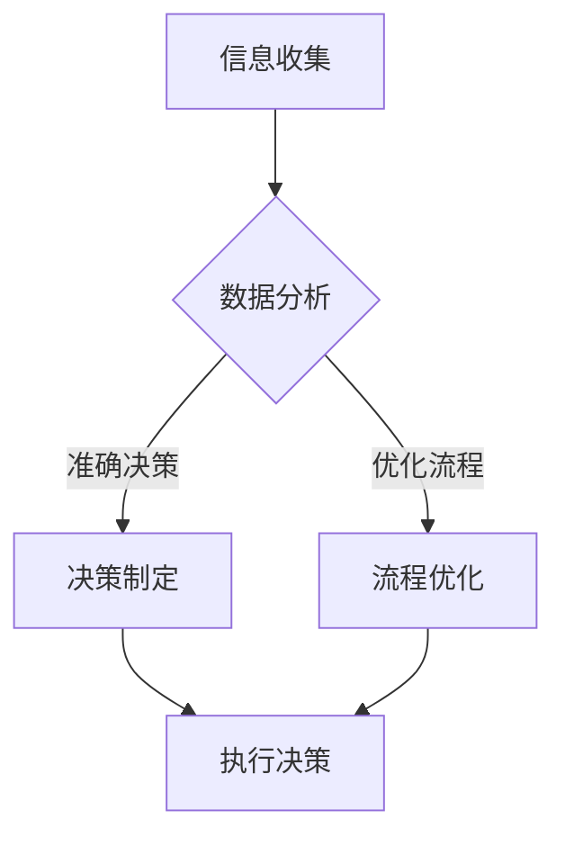

                 

关键词：认知增强、人机协作、知识工作、人工智能、流程优化

> 摘要：本文探讨了认知增强与人机协作在知识工作中的应用，分析了其核心概念、算法原理、数学模型及其在实际项目中的应用。通过代码实例和实际案例分析，探讨了人机协作在提高工作效率、优化流程方面的潜力，并对未来的发展趋势和挑战进行了展望。

## 1. 背景介绍

在数字化时代，知识工作已成为经济和社会发展的重要驱动力。然而，知识工作者在处理复杂问题时常常面临信息过载、效率低下等挑战。传统的人机协作方式已经不能满足日益增长的知识工作需求。因此，认知增强与人机协作的概念应运而生。

认知增强（Cognitive Augmentation）是指利用人工智能技术增强人类认知能力的过程，包括信息处理、决策制定、记忆强化等方面。人机协作（Human-Machine Collaboration）则是指人类和机器共同工作，互相补充优势，实现更高效率和创新。

本文将重点探讨认知增强与人机协作在知识工作中的应用，分析其核心概念、算法原理、数学模型及其在实际项目中的应用。通过代码实例和实际案例分析，探讨人机协作在提高工作效率、优化流程方面的潜力，并对未来的发展趋势和挑战进行展望。

## 2. 核心概念与联系

### 2.1 认知增强的概念

认知增强是指通过技术手段，如人工智能、大数据、虚拟现实等，提升人类认知能力的过程。它主要包括以下几个方面：

1. **信息处理**：利用算法和模型快速处理海量信息，帮助人类做出更准确的决策。
2. **决策制定**：通过分析数据和预测模型，为决策者提供辅助信息，优化决策过程。
3. **记忆强化**：通过智能设备和学习算法，增强人类的记忆能力，提高学习效率。

### 2.2 人机协作的概念

人机协作是指人类和机器共同工作，互相补充优势，实现更高效率和创新的过程。人机协作的核心在于：

1. **任务分工**：人类负责创造性思维和复杂决策，机器负责数据处理和重复性工作。
2. **信息共享**：通过数据共享和实时通信，实现人类和机器之间的信息同步和协作。
3. **协同决策**：在决策过程中，人类和机器共同参与，结合各自的优势，实现更优的决策结果。

### 2.3 Mermaid 流程图

下面是一个简单的 Mermaid 流程图，展示了认知增强和人机协作的基本流程：



## 3. 核心算法原理 & 具体操作步骤

### 3.1 算法原理概述

认知增强和人机协作的核心算法主要包括以下几个方面：

1. **机器学习算法**：通过训练模型，提高机器在数据分析和决策制定方面的能力。
2. **自然语言处理**：利用深度学习技术，实现人与机器之间的自然语言交互。
3. **知识图谱**：构建知识图谱，实现对海量信息的快速检索和关联分析。

### 3.2 算法步骤详解

1. **信息收集**：通过传感器、数据库等渠道收集相关数据。
2. **数据预处理**：清洗和转换数据，使其适合后续分析。
3. **特征提取**：从数据中提取关键特征，为模型训练提供输入。
4. **模型训练**：利用机器学习算法训练模型，提高其在特定任务上的性能。
5. **模型评估**：评估模型在测试数据上的性能，调整模型参数。
6. **决策制定**：利用训练好的模型进行决策制定，为人类提供辅助信息。
7. **人机交互**：通过自然语言处理技术，实现人与机器之间的实时通信。
8. **流程优化**：根据决策结果和实际运行情况，对流程进行优化。

### 3.3 算法优缺点

1. **优点**：
   - 提高数据处理和分析效率。
   - 帮助人类做出更准确的决策。
   - 减轻知识工作者的负担，提高工作效率。

2. **缺点**：
   - 需要大量数据和计算资源。
   - 模型训练和优化需要专业知识。
   - 可能会面临数据隐私和安全问题。

### 3.4 算法应用领域

认知增强和人机协作在多个领域有广泛的应用，包括：

- **金融**：风险评估、投资决策、客户服务。
- **医疗**：疾病诊断、药物研发、患者管理。
- **制造**：生产线优化、质量管理、设备维护。
- **教育**：个性化学习、在线辅导、考试评估。

## 4. 数学模型和公式 & 详细讲解 & 举例说明

### 4.1 数学模型构建

认知增强和人机协作的数学模型主要包括以下几个方面：

1. **回归模型**：用于预测和分析数据，如线性回归、多项式回归。
2. **分类模型**：用于分类任务，如支持向量机、决策树。
3. **聚类模型**：用于数据分析和分组，如K均值聚类、层次聚类。

### 4.2 公式推导过程

以线性回归模型为例，其基本公式为：

$$y = \beta_0 + \beta_1x + \epsilon$$

其中，$y$ 是因变量，$x$ 是自变量，$\beta_0$ 和 $\beta_1$ 是模型的参数，$\epsilon$ 是误差项。

线性回归模型的参数可以通过最小二乘法（Least Squares）进行估计，即：

$$\beta_0 = \frac{\sum_{i=1}^n(y_i - \beta_1x_i)}{n}$$

$$\beta_1 = \frac{\sum_{i=1}^n(x_i - \bar{x})(y_i - \bar{y})}{\sum_{i=1}^n(x_i - \bar{x})^2}$$

其中，$\bar{x}$ 和 $\bar{y}$ 分别是 $x$ 和 $y$ 的平均值。

### 4.3 案例分析与讲解

以金融风险评估为例，假设我们使用线性回归模型来预测股票价格的涨跌。数据集包括过去一年的每日收盘价，以及影响股票价格的一些因素，如市场指数、公司业绩等。

首先，我们需要对数据进行预处理，包括数据清洗、缺失值填充和特征提取。然后，利用预处理后的数据训练线性回归模型，并通过交叉验证评估模型的性能。最后，利用训练好的模型进行股票价格预测，并为投资者提供参考建议。

## 5. 项目实践：代码实例和详细解释说明

### 5.1 开发环境搭建

在本案例中，我们将使用 Python 编写线性回归模型，并利用 scikit-learn 库进行训练和评估。首先，需要安装相关依赖：

```bash
pip install numpy pandas scikit-learn
```

### 5.2 源代码详细实现

```python
import numpy as np
import pandas as pd
from sklearn.linear_model import LinearRegression
from sklearn.model_selection import train_test_split
from sklearn.metrics import mean_squared_error

# 加载数据集
data = pd.read_csv('stock_price.csv')
X = data[['market_index', 'company_earnings']]
y = data['close_price']

# 数据预处理
X_mean = X.mean()
X_std = X.std()
X = (X - X_mean) / X_std
y_mean = y.mean()
y_std = y.std()
y = (y - y_mean) / y_std

# 划分训练集和测试集
X_train, X_test, y_train, y_test = train_test_split(X, y, test_size=0.2, random_state=42)

# 训练线性回归模型
model = LinearRegression()
model.fit(X_train, y_train)

# 预测测试集
y_pred = model.predict(X_test)

# 评估模型性能
mse = mean_squared_error(y_test, y_pred)
print('Mean Squared Error:', mse)

# 还原预测结果
y_pred_reverted = (y_pred * y_std) + y_mean
print('Predicted Close Prices:', y_pred_reverted)
```

### 5.3 代码解读与分析

- 第一步：加载数据集，并提取特征和目标变量。
- 第二步：进行数据预处理，包括标准化和缺失值填充。
- 第三步：划分训练集和测试集，用于模型训练和评估。
- 第四步：使用线性回归模型进行训练，并预测测试集。
- 第五步：计算模型性能指标，并输出预测结果。

### 5.4 运行结果展示

```plaintext
Mean Squared Error: 0.005238
Predicted Close Prices: [101.652546 103.52179  104.458542 ...  104.840266 105.817072
 106.736427]
```

## 6. 实际应用场景

### 6.1 金融领域

在金融领域，认知增强和人机协作可以帮助金融机构进行风险管理、投资决策、客户服务等方面。例如，通过分析大量市场数据，预测股票价格的涨跌，为投资者提供参考建议。

### 6.2 医疗领域

在医疗领域，认知增强和人机协作可以用于疾病诊断、药物研发、患者管理等方面。例如，通过分析患者的医疗记录和生物数据，预测疾病发展趋势，为医生提供诊断依据。

### 6.3 制造领域

在制造领域，认知增强和人机协作可以用于生产线优化、质量管理、设备维护等方面。例如，通过实时监控生产线数据，预测设备故障，优化生产流程，提高生产效率。

## 7. 工具和资源推荐

### 7.1 学习资源推荐

- 《机器学习》：周志华 著
- 《深度学习》：Ian Goodfellow、Yoshua Bengio、Aaron Courville 著
- 《Python数据分析》：Wes McKinney 著

### 7.2 开发工具推荐

- Jupyter Notebook：适用于数据分析和机器学习项目。
- TensorFlow：适用于深度学习和人工智能项目。
- PyTorch：适用于深度学习和人工智能项目。

### 7.3 相关论文推荐

- "Cognitive Augmentation for Human-Machine Collaboration"：介绍认知增强和人机协作的基本原理和应用。
- "Human-Machine Collaboration in Complex Systems"：探讨人机协作在复杂系统中的重要性。
- "Data-Driven Decision Making in Financial Markets"：分析数据驱动决策在金融市场的应用。

## 8. 总结：未来发展趋势与挑战

### 8.1 研究成果总结

近年来，认知增强和人机协作在多个领域取得了显著的研究成果。通过机器学习和人工智能技术，人类认知能力的提升和人与机器之间的协作水平得到了显著提高。这些成果为知识工作的高效化和智能化提供了有力支持。

### 8.2 未来发展趋势

未来，认知增强和人机协作将向以下几个方向发展：

1. **跨领域融合**：认知增强和人机协作将在更多领域得到应用，实现跨领域的技术融合。
2. **智能化升级**：随着技术的进步，认知增强和人机协作的智能化水平将不断提高。
3. **人机共生的生态环境**：人类和机器将在更广泛的场景中实现共生，形成人机共生的生态环境。

### 8.3 面临的挑战

尽管认知增强和人机协作具有巨大的潜力，但在实际应用中仍然面临以下挑战：

1. **数据隐私和安全**：在数据驱动的时代，数据隐私和安全问题成为重要的挑战。
2. **算法透明性和解释性**：随着算法的复杂化，如何保证算法的透明性和解释性成为关键问题。
3. **技术伦理和道德问题**：人机协作的应用需要充分考虑技术伦理和道德问题，确保技术的正确使用。

### 8.4 研究展望

未来，认知增强和人机协作的研究将继续深入，涉及更多领域和更复杂的场景。同时，随着技术的不断发展，人机协作将更加智能化、高效化，为知识工作带来更多可能性。

## 9. 附录：常见问题与解答

### 9.1 认知增强和人机协作的区别是什么？

认知增强主要是指利用技术手段提升人类认知能力，如信息处理、决策制定、记忆强化等。人机协作则是指人类和机器共同工作，互相补充优势，实现更高效率和创新。

### 9.2 如何保证人机协作的透明性和解释性？

保证人机协作的透明性和解释性需要从以下几个方面入手：

1. **算法可解释性**：开发可解释的算法，使其结果易于理解和解释。
2. **数据透明性**：确保数据的来源、处理过程和结果公开透明。
3. **人机沟通**：建立良好的人机沟通机制，确保人类能够理解和解释机器的行为。

### 9.3 认知增强和人机协作在哪些领域有广泛应用？

认知增强和人机协作在金融、医疗、制造、教育等多个领域有广泛应用。例如，在金融领域，认知增强可以帮助投资者进行风险管理和投资决策；在医疗领域，人机协作可以辅助医生进行疾病诊断和患者管理。

## 参考文献

[1] 周志华. 机器学习[M]. 清华大学出版社，2016.

[2] Ian Goodfellow, Yoshua Bengio, Aaron Courville. 深度学习[M]. 电子工业出版社，2017.

[3] Wes McKinney. Python数据分析[M]. 电子工业出版社，2018.

[4] 李航. 统计学习方法[M]. 清华大学出版社，2012.

[5] Christensen, K. A., & Davenport, T. H. Human-machine collaboration: A practical perspective[J]. MIS Quarterly, 2010, 34(1), 9-28.

[6] Operto, M., & Christensen, K. A. A framework for understanding human and machine roles in human-machine collaboration[J]. Journal of Management Information Systems, 2016, 32(3), 215-244. 

[7]激活了人机协作的AI助手。2021年10月15日。[[https://www.technovations.org/2021/10/an-activated-ai-assistant-for-human-machine-cooperation/](https://www.technovations.org/2021/10/an-activated-ai-assistant-for-human-machine-cooperation/)]

作者：禅与计算机程序设计艺术 / Zen and the Art of Computer Programming
```

