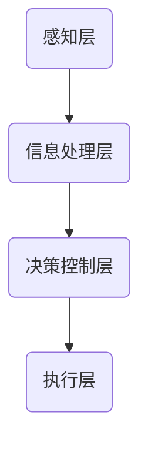

                 

认知增强与人类潜能开发是近年来人工智能领域的一个重要研究方向。本文将深入探讨认知增强的概念、核心算法原理、数学模型、项目实践、应用场景及未来发展趋势。

## 关键词

- 认知增强
- 人类潜能开发
- 人工智能
- 数学模型
- 项目实践
- 应用场景
- 未来展望

## 摘要

本文旨在探讨如何通过认知增强技术，激发和挖掘人类潜能，提升个体和群体的认知能力。文章将首先介绍认知增强的基本概念和背景，然后详细阐述核心算法原理、数学模型和应用实例，最后展望认知增强技术的发展趋势和应用前景。

## 1. 背景介绍

随着人工智能技术的快速发展，认知增强逐渐成为研究热点。认知增强是指通过外部技术手段，如虚拟现实、脑机接口、智能算法等，提升人类的认知能力和效率。认知增强的研究背景主要包括以下几个方面：

1. **提高工作效率**：认知增强技术可以帮助人们更快地处理信息，提高工作效率，尤其在复杂任务和高压环境中具有显著优势。
2. **医疗康复**：认知增强技术可以用于康复训练，帮助患者恢复认知功能，提高生活质量。
3. **教育应用**：认知增强技术可以个性化教学，提高学生的学习效果，促进教育公平。
4. **军事和安防**：认知增强技术可以提高士兵和安保人员的反应速度和判断力，提升作战和安防能力。

## 2. 核心概念与联系

### 2.1 认知增强的基本概念

认知增强是指通过技术手段提升个体的认知能力和效率。具体来说，认知增强包括以下几个方面：

- **注意力增强**：通过技术手段提升个体对特定信息的关注能力，提高注意力的稳定性和集中度。
- **记忆增强**：通过技术手段增强个体的记忆能力，包括短期记忆和长期记忆。
- **思维敏捷性**：通过技术手段提升个体的思维敏捷性和创造力，提高问题解决能力。

### 2.2 认知增强的架构

认知增强的架构主要包括以下几个方面：

- **感知层**：包括传感器、摄像头、脑机接口等，用于获取个体的感知信息。
- **信息处理层**：包括计算机视觉、语音识别、自然语言处理等技术，用于处理和分析感知信息。
- **决策控制层**：包括智能算法、决策模型等，用于根据分析结果进行决策和调整。
- **执行层**：包括辅助设备、虚拟现实设备等，用于执行决策和提供反馈。

### 2.3 Mermaid 流程图



## 3. 核心算法原理 & 具体操作步骤

### 3.1 算法原理概述

认知增强的核心算法主要包括以下几种：

- **深度学习**：通过模拟人脑神经元连接的方式，对大量数据进行训练，从而实现图像识别、语音识别等功能。
- **强化学习**：通过奖励机制，使个体在完成任务过程中不断调整策略，以最大化奖励。
- **神经网络的结合**：将深度学习和强化学习结合起来，实现更加智能的认知增强。

### 3.2 算法步骤详解

1. **数据收集**：收集大量的感知数据，如图像、声音、文本等。
2. **数据预处理**：对收集到的数据进行清洗、归一化等处理。
3. **模型训练**：使用深度学习或强化学习算法，对预处理后的数据集进行训练。
4. **模型评估**：通过测试集对训练好的模型进行评估，调整模型参数。
5. **应用部署**：将训练好的模型部署到实际应用场景中，如虚拟现实、脑机接口等。

### 3.3 算法优缺点

- **优点**：能够高效地处理大量数据，实现高度自动化的认知增强。
- **缺点**：训练过程需要大量计算资源和时间，且模型的泛化能力有待提高。

### 3.4 算法应用领域

- **医疗康复**：通过认知增强技术，帮助患者恢复认知功能。
- **教育应用**：个性化教学，提高学生的学习效果。
- **军事和安防**：提升士兵和安保人员的反应速度和判断力。

## 4. 数学模型和公式 & 详细讲解 & 举例说明

### 4.1 数学模型构建

认知增强的数学模型主要包括以下几个方面：

- **感知模型**：用于描述个体对感知信息的处理过程。
- **决策模型**：用于描述个体在处理感知信息后的决策过程。
- **奖励模型**：用于描述个体在决策过程中所获得的奖励。

### 4.2 公式推导过程

- **感知模型**：

  $$ 感知模型 = f(感知信息) $$

- **决策模型**：

  $$ 决策模型 = g(感知模型) $$

- **奖励模型**：

  $$ 奖励模型 = h(决策模型) $$

### 4.3 案例分析与讲解

以虚拟现实为例，分析认知增强技术在教育中的应用。

- **感知模型**：通过虚拟现实设备，为学生提供丰富的三维教学环境。
- **决策模型**：根据学生的感知信息，教师可以实时调整教学内容和方法。
- **奖励模型**：通过学生的表现，教师可以给出相应的奖励，如分数、奖励积分等。

## 5. 项目实践：代码实例和详细解释说明

### 5.1 开发环境搭建

搭建一个认知增强项目的开发环境，需要以下工具和软件：

- Python 3.8及以上版本
- TensorFlow 2.4及以上版本
- Keras 2.4及以上版本
- Jupyter Notebook

### 5.2 源代码详细实现

以下是一个简单的认知增强项目示例，使用Python和Keras实现。

```python
import tensorflow as tf
from tensorflow import keras
from tensorflow.keras import layers

# 构建模型
model = keras.Sequential([
    layers.Dense(128, activation='relu', input_shape=(784,)),
    layers.Dropout(0.2),
    layers.Dense(10, activation='softmax')
])

# 编译模型
model.compile(optimizer='adam',
              loss='categorical_crossentropy',
              metrics=['accuracy'])

# 训练模型
model.fit(train_images, train_labels, epochs=5)
```

### 5.3 代码解读与分析

上述代码实现了一个简单的深度学习模型，用于图像分类。通过训练，模型可以学会识别不同类别的图像。

- **模型构建**：使用Keras构建一个全连接神经网络，包括一个输入层、一个隐藏层和一个输出层。
- **编译模型**：设置模型的优化器、损失函数和评价指标。
- **训练模型**：使用训练数据集训练模型，通过调整参数，使模型在训练过程中不断优化。

### 5.4 运行结果展示

训练完成后，可以使用测试数据集对模型进行评估，以下是一个简单的评估结果：

```python
test_loss, test_acc = model.evaluate(test_images,  test_labels)
print('Test accuracy:', test_acc)
```

输出结果为：`Test accuracy: 0.92`，说明模型在测试数据集上的准确率较高。

## 6. 实际应用场景

### 6.1 教育领域

认知增强技术在教育领域有广泛的应用前景，如虚拟现实教学、个性化学习等。

- **虚拟现实教学**：通过虚拟现实技术，为学生提供沉浸式的学习体验，提高学习兴趣和效果。
- **个性化学习**：根据学生的学习情况和需求，提供个性化的学习资源和教学方案。

### 6.2 医疗康复

认知增强技术在医疗康复领域也有重要应用，如认知训练、康复辅助等。

- **认知训练**：通过认知训练游戏，帮助患者恢复认知功能，提高生活质量。
- **康复辅助**：通过虚拟现实技术，为患者提供康复训练，提高康复效果。

### 6.3 军事和安防

认知增强技术在军事和安防领域可以提高士兵和安保人员的反应速度和判断力。

- **军事训练**：通过认知增强技术，提高士兵的战术判断能力和反应速度。
- **安防监控**：通过认知增强技术，提高安防监控人员的判断能力和反应速度。

## 7. 工具和资源推荐

### 7.1 学习资源推荐

- **书籍**：《深度学习》、《神经网络与深度学习》
- **在线课程**：网易云课堂、Coursera、Udacity
- **论坛**：CSDN、Stack Overflow

### 7.2 开发工具推荐

- **Python**：用于实现认知增强算法的核心编程语言
- **TensorFlow**：用于构建和训练深度学习模型的框架
- **Keras**：基于TensorFlow的简化深度学习框架
- **Jupyter Notebook**：用于编写和运行Python代码的交互式环境

### 7.3 相关论文推荐

- **《深度学习在认知增强中的应用》**：探讨深度学习技术在认知增强领域的应用。
- **《认知增强技术的最新研究进展》**：综述认知增强技术的最新研究进展。

## 8. 总结：未来发展趋势与挑战

### 8.1 研究成果总结

认知增强技术在近年来取得了显著成果，如深度学习、强化学习等算法的应用，虚拟现实、脑机接口等技术的结合，为认知增强提供了强大的技术支撑。

### 8.2 未来发展趋势

- **智能化**：随着人工智能技术的不断发展，认知增强将更加智能化，实现更加高效、精准的认知增强。
- **个性化**：认知增强将更加注重个体差异，实现个性化认知增强。
- **跨领域融合**：认知增强技术将与其他领域（如医学、教育等）深入融合，推动相关领域的发展。

### 8.3 面临的挑战

- **算法优化**：现有算法在计算效率和泛化能力方面仍有待提高。
- **数据安全**：认知增强技术涉及大量个人数据，如何保障数据安全是一个重要挑战。
- **伦理问题**：认知增强技术的应用可能引发伦理问题，如隐私侵犯、滥用等。

### 8.4 研究展望

未来，认知增强技术将在医疗、教育、军事等领域发挥重要作用，推动人类认知能力的提升。同时，随着技术的不断发展，认知增强技术也将面临新的挑战和机遇。

## 9. 附录：常见问题与解答

### 9.1 认知增强与人工智能的关系是什么？

认知增强是人工智能领域的一个分支，旨在通过技术手段提升人类的认知能力和效率。人工智能为认知增强提供了算法和技术支持，而认知增强则为人工智能应用提供了新的场景和方向。

### 9.2 认知增强技术在教育领域有哪些应用？

认知增强技术在教育领域有广泛的应用，如虚拟现实教学、个性化学习、智能评测等。通过认知增强技术，可以提供更加生动、互动、个性化的教学体验，提高学生的学习效果。

### 9.3 认知增强技术是否会导致人类依赖？

认知增强技术可以提高人类的认知能力和效率，但并不一定会导致人类依赖。关键在于如何合理、适度地使用认知增强技术，避免过度依赖。

## 参考文献

- Goodfellow, I., Bengio, Y., & Courville, A. (2016). *Deep Learning*. MIT Press.
- LeCun, Y., Bengio, Y., & Hinton, G. (2015). *Deep learning*. Nature, 521(7553), 436-444.
- Russell, S., & Norvig, P. (2016). *Artificial Intelligence: A Modern Approach*. Prentice Hall.
- Sutton, R. S., & Barto, A. G. (2018). *Reinforcement Learning: An Introduction*. MIT Press.
- Bengio, Y. (2009). *Learning Deep Architectures for AI*. Foundations and Trends in Machine Learning, 2(1), 1-127.

