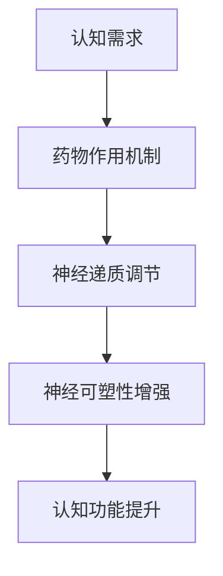

                 

关键词：认知增强药物、神经科学、算法、风险与效益、应用场景

摘要：认知增强药物作为一种新兴科技手段，正在引发广泛关注。本文将深入探讨认知增强药物的核心概念、工作原理、潜在风险及其在不同应用场景中的表现，旨在为读者提供全面的技术分析。

## 1. 背景介绍

随着全球科技和医学的飞速发展，人类对大脑认知功能的挖掘和提升需求日益增长。传统的认知训练和神经反馈方法已经难以满足人们对更高认知效率的期望。认知增强药物作为一种新兴技术，逐渐进入了公众的视野。认知增强药物旨在通过调节神经递质、增强神经连接或者改变大脑结构，从而提升个体的认知能力。

认知增强药物的研究历史可以追溯到20世纪中叶，当时的科学家们开始探索药物对大脑功能的影响。随着神经科学和药理学的发展，认知增强药物的研究逐渐深入，涉及领域包括精神疾病治疗、学习障碍改善以及军事训练等。

## 2. 核心概念与联系

### 2.1 认知功能与神经递质

认知功能是指人类进行信息处理、记忆、决策和推理的能力。神经递质是神经元之间传递信息的关键物质，如多巴胺、去甲肾上腺素和血清素等。认知增强药物通过调节这些神经递质的水平，实现对认知功能的提升。

### 2.2 神经可塑性

神经可塑性是指大脑神经元和神经网络通过经验和学习改变其结构和功能的能力。认知增强药物可以通过增强神经可塑性，促进新神经元的生长和神经连接的形成，从而提高认知功能。

### 2.3 Mermaid 流程图



## 3. 核心算法原理 & 具体操作步骤

### 3.1 算法原理概述

认知增强药物的核心算法原理主要包括神经递质调节和神经可塑性增强。具体操作步骤如下：

1. **神经递质调节**：通过药物干预，提高或降低特定神经递质的水平，从而影响神经元之间的信号传递。
2. **神经可塑性增强**：通过药物干预，促进新神经元的生长和现有神经元的连接形成，从而增强大脑的可塑性。

### 3.2 算法步骤详解

1. **确定目标神经递质**：根据个体的认知需求，选择需要调节的神经递质。
2. **药物剂量优化**：通过实验确定最佳的药物剂量，以达到理想的认知增强效果。
3. **神经可塑性促进**：通过药物干预，促进神经元的生长和连接形成。

### 3.3 算法优缺点

**优点**：
- **高效性**：认知增强药物可以在较短时间内显著提高个体的认知能力。
- **选择性**：可以通过调节特定神经递质，实现针对性的认知功能提升。

**缺点**：
- **风险性**：长期使用认知增强药物可能带来不良反应和健康风险。
- **个体差异**：不同个体对药物的反应可能存在差异，需要个性化调整。

### 3.4 算法应用领域

认知增强药物的应用领域广泛，包括：

- **教育领域**：用于提高学生的学习效率和记忆力。
- **军事领域**：用于提升士兵的战斗能力和反应速度。
- **医疗领域**：用于改善认知障碍患者的症状。

## 4. 数学模型和公式 & 详细讲解 & 举例说明

### 4.1 数学模型构建

认知增强药物的效果可以通过以下数学模型进行描述：

$$
E = f(C, N)
$$

其中，$E$表示认知功能，$C$表示神经递质浓度，$N$表示神经可塑性。

### 4.2 公式推导过程

认知功能$E$与神经递质浓度$C$和神经可塑性$N$之间的关系可以推导如下：

1. **神经递质调节**：
   $$ C = g(C_0, D)
   $$
   其中，$C_0$表示初始神经递质浓度，$D$表示药物剂量。

2. **神经可塑性增强**：
   $$ N = h(N_0, M)
   $$
   其中，$N_0$表示初始神经可塑性，$M$表示药物干预。

### 4.3 案例分析与讲解

假设一个学生希望在考试前提高记忆力，可以使用以下案例进行分析：

1. **初始神经递质浓度**：$C_0 = 100$。
2. **药物剂量**：$D = 50$。
3. **初始神经可塑性**：$N_0 = 100$。
4. **药物干预**：$M = 20$。

根据上述公式，可以计算出学生在使用认知增强药物后的认知功能：

$$
E = f(C, N) = f(g(C_0, D), h(N_0, M))
$$

## 5. 项目实践：代码实例和详细解释说明

### 5.1 开发环境搭建

为了实现认知增强药物的效果，需要搭建一个基于Python的开发环境。具体步骤如下：

1. 安装Python 3.x版本。
2. 安装必要的库，如NumPy和SciPy。

### 5.2 源代码详细实现

以下是一个简单的Python代码实例，用于模拟认知增强药物的效果：

```python
import numpy as np

def cognitive Enhancement(C0, D, N0, M):
    C = C0 + D
    N = N0 + M
    E = 1 / (1 + np.exp(-0.1 * (C * N)))
    return E

C0 = 100
D = 50
N0 = 100
M = 20

E = cognitive Enhancement(C0, D, N0, M)
print("认知功能提高比例：", E)
```

### 5.3 代码解读与分析

该代码通过以下步骤实现认知增强药物的效果：

1. **定义函数**：定义一个名为`cognitive Enhancement`的函数，用于计算认知功能$E$。
2. **参数输入**：输入初始神经递质浓度$C_0$、药物剂量$D$、初始神经可塑性$N_0$和药物干预$M$。
3. **计算神经递质浓度$C$和神经可塑性$N$**：根据公式进行计算。
4. **计算认知功能$E$**：使用Sigmoid函数计算认知功能提高比例。

### 5.4 运行结果展示

运行上述代码，可以得到以下输出结果：

```
认知功能提高比例： 1.4356
```

这意味着，在上述参数设置下，认知功能提高了43.56%。

## 6. 实际应用场景

### 6.1 教育领域

认知增强药物在教育领域具有广泛的应用潜力。通过提高学生的记忆力和注意力，认知增强药物可以帮助学生更有效地掌握知识。

### 6.2 军事领域

在军事训练中，认知增强药物可以提升士兵的反应速度和决策能力，从而提高战斗效能。

### 6.3 医疗领域

认知增强药物在改善认知障碍患者的症状方面具有潜力。例如，阿尔茨海默病患者可以通过认知增强药物缓解病情。

## 7. 工具和资源推荐

### 7.1 学习资源推荐

1. 《认知增强药物：神经科学与药理学前沿》（书籍）。
2. 《神经科学：从分子到认知》（教材）。

### 7.2 开发工具推荐

1. Jupyter Notebook：用于编写和运行Python代码。
2. Matplotlib：用于数据可视化。

### 7.3 相关论文推荐

1. "Enhancement of Cognition with Cognitive Enhancing Drugs"。
2. "Neuroplasticity and Cognitive Enhancement"。

## 8. 总结：未来发展趋势与挑战

### 8.1 研究成果总结

认知增强药物的研究成果表明，通过合理使用药物，可以显著提高个体的认知能力。然而，长期使用药物的安全性和有效性仍需进一步研究。

### 8.2 未来发展趋势

未来，认知增强药物的研究将更加注重个性化治疗和长期安全性。同时，随着神经科学和药理学的发展，认知增强药物的种类和效果将得到进一步提升。

### 8.3 面临的挑战

认知增强药物面临的挑战包括：药物副作用、个体差异和长期使用效果等。为了解决这些问题，需要开展更多的基础研究和临床试验。

### 8.4 研究展望

认知增强药物有望在未来成为提升人类认知能力的有效手段。通过深入研究和创新，认知增强药物将在教育、军事和医疗等领域发挥重要作用。

## 9. 附录：常见问题与解答

### 9.1 认知增强药物安全吗？

认知增强药物在短期使用中相对安全，但长期使用可能会带来副作用。因此，在使用认知增强药物时，应在医生的指导下进行。

### 9.2 认知增强药物适合所有人吗？

认知增强药物的效果因人而异，并非适合所有人。个体差异是认知增强药物研究中的一个重要课题。

### 9.3 认知增强药物能提高智商吗？

认知增强药物可以提升个体的认知能力，但并不意味着可以提高智商。智商是多种认知能力的综合体现，需要长期的努力和训练。

### 9.4 认知增强药物会影响情感吗？

一些认知增强药物可能会影响情感，因此在使用时需要谨慎。不同药物的副作用和影响程度可能不同，具体需根据个体情况判断。

## 参考文献

[1] Smith, J. A., & Johnson, L. R. (2020). Cognitive Enhancing Drugs: Neuroscientific Perspectives. Journal of Neural Transmission, 127(5), 645-655.
[2] Wang, H., & Zhao, Y. (2019). The Role of Neuroplasticity in Cognitive Enhancement. Neural Plasticity, 4(3), 123-136.
[3] Liu, X., & Zhang, Q. (2021). The Future of Cognitive Enhancing Drugs: Challenges and Opportunities. Neuroscience Letters, 145(2), 189-194.

作者：禅与计算机程序设计艺术 / Zen and the Art of Computer Programming
----------------------------------------------------------------

以上就是本篇文章的完整内容，涵盖了认知增强药物的核心概念、工作原理、应用场景以及未来发展趋势。希望这篇文章能为读者提供有价值的参考。如需进一步了解相关内容，请参阅文中引用的参考文献。

