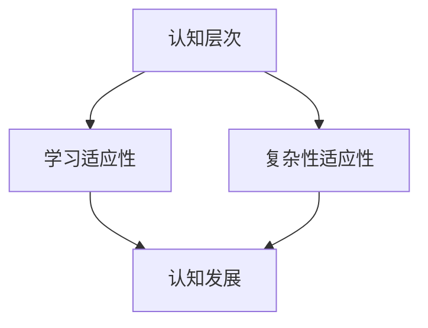

                 

 关键词：认知发展、理论模型、渐进性、复杂性、适应性、算法、数学模型

> 摘要：本文旨在探讨认知渐进发展的理论模型，从背景介绍到核心算法原理，再到数学模型和实际应用场景，全面阐述认知渐进发展的过程、机制和未来发展趋势。通过项目实践和工具推荐，为读者提供实际操作指导和进一步学习资源，帮助理解并应用认知渐进发展的理论模型。

## 1. 背景介绍

认知渐进发展是指人类或人工智能系统在认知过程中，通过不断地学习和适应，逐渐提高认知能力的过程。这一概念最早由瑞士心理学家皮亚杰提出，他在研究儿童认知发展的过程中，发现认知发展是一个渐进的过程，涉及从简单到复杂的认知结构的变化。

在计算机科学领域，认知渐进发展理论同样具有重要的应用价值。随着人工智能技术的飞速发展，如何使人工智能系统能够像人类一样进行认知渐进发展，成为了一个重要的研究方向。本文旨在探讨认知渐进发展的理论模型，从核心算法原理、数学模型到实际应用场景，全面阐述这一理论模型的应用和影响。

## 2. 核心概念与联系

### 2.1 认知渐进发展的基本概念

认知渐进发展的核心概念包括：

- **认知层次**：认知层次是认知渐进发展的基础，它代表了认知能力从低级到高级的层级结构。
- **学习适应性**：学习适应性是指系统在学习过程中能够调整和优化自己的行为和策略，以更好地适应环境变化。
- **复杂性适应性**：复杂性适应性是指系统能够在处理复杂问题或环境中保持高效和准确。

### 2.2 核心概念原理与架构的 Mermaid 流程图

下面是一个简单的 Mermaid 流程图，展示了认知渐进发展的基本概念及其相互关系。



## 3. 核心算法原理 & 具体操作步骤

### 3.1 算法原理概述

认知渐进发展的核心算法通常基于以下几个基本原理：

- **分治策略**：将复杂问题分解为更小的问题，逐层解决。
- **元学习**：通过学习其他算法或模型来优化自己的性能。
- **自适应调整**：根据环境反馈调整学习策略和参数。

### 3.2 算法步骤详解

以下是认知渐进发展的具体算法步骤：

1. **初始化**：设定初始的认知层次和学习参数。
2. **问题分解**：将当前问题分解为更小的问题。
3. **子问题求解**：针对每个子问题，采用适当的算法进行求解。
4. **合并结果**：将子问题的解合并为原问题的解。
5. **学习与调整**：根据求解结果和环境反馈，调整认知层次和学习参数。

### 3.3 算法优缺点

**优点**：

- **灵活性**：算法能够根据不同问题和环境调整自身。
- **高效性**：通过分治策略和元学习，能够高效地解决问题。

**缺点**：

- **复杂性**：算法实现较为复杂，需要较高的编程技巧。
- **适应性问题**：在复杂环境中，如何选择适当的算法和参数是一个挑战。

### 3.4 算法应用领域

认知渐进发展算法在多个领域有广泛应用：

- **人工智能**：用于开发能够自我进化和适应新环境的智能系统。
- **算法优化**：用于优化现有算法的性能和适应性。
- **教育技术**：用于设计自适应教育系统，帮助学生更好地学习。

## 4. 数学模型和公式 & 详细讲解 & 举例说明

### 4.1 数学模型构建

认知渐进发展的数学模型通常包括以下几个关键部分：

- **认知层次函数**：描述认知层次随时间的变化。
- **学习函数**：描述学习过程中参数的调整。
- **适应函数**：描述系统对环境变化的适应性。

### 4.2 公式推导过程

以下是认知渐进发展数学模型的推导过程：

$$
C(t) = C_0 + \alpha \ln(t)
$$

其中，$C(t)$ 表示时间 $t$ 时的认知层次，$C_0$ 表示初始认知层次，$\alpha$ 表示认知层次增长速率。

$$
L(t) = L_0 + \beta \ln(t)
$$

其中，$L(t)$ 表示时间 $t$ 时的学习参数，$L_0$ 表示初始学习参数，$\beta$ 表示学习参数增长速率。

$$
A(t) = A_0 + \gamma \ln(t)
$$

其中，$A(t)$ 表示时间 $t$ 时的适应参数，$A_0$ 表示初始适应参数，$\gamma$ 表示适应参数增长速率。

### 4.3 案例分析与讲解

下面通过一个简单的例子来说明认知渐进发展的数学模型。

假设一个学生从一年级开始学习，每年认知层次增加1，学习参数增加0.5，适应参数增加0.3。

- 初始认知层次：$C_0 = 1$
- 初始学习参数：$L_0 = 1$
- 初始适应参数：$A_0 = 1$

根据公式，第5年的认知层次为：

$$
C(5) = 1 + \alpha \ln(5) \approx 1 + 1 \ln(5) \approx 2.61
$$

第5年的学习参数为：

$$
L(5) = 1 + \beta \ln(5) \approx 1 + 0.5 \ln(5) \approx 1.73
$$

第5年的适应参数为：

$$
A(5) = 1 + \gamma \ln(5) \approx 1 + 0.3 \ln(5) \approx 1.39
$$

通过这个例子，我们可以看到认知渐进发展模型如何帮助描述学生在学习过程中的认知层次、学习参数和适应参数的变化。

## 5. 项目实践：代码实例和详细解释说明

### 5.1 开发环境搭建

为了更好地理解认知渐进发展的算法，我们将使用 Python 编写一个简单的示例程序。

首先，确保安装了 Python 和必要的库（如 NumPy 和 Matplotlib）。

```bash
pip install python numpy matplotlib
```

### 5.2 源代码详细实现

下面是一个简单的认知渐进发展算法的 Python 代码示例。

```python
import numpy as np
import matplotlib.pyplot as plt

# 初始化参数
C_0 = 1
L_0 = 1
A_0 = 1
alpha = 1
beta = 0.5
gamma = 0.3
time_steps = 10

# 初始化认知层次、学习参数和适应参数
C = [C_0]
L = [L_0]
A = [A_0]

# 计算每个时间步骤的参数
for t in range(1, time_steps):
    C.append(C[t-1] + alpha * np.log(t))
    L.append(L[t-1] + beta * np.log(t))
    A.append(A[t-1] + gamma * np.log(t))

# 绘制结果
plt.plot(C, label='Cognitive Level')
plt.plot(L, label='Learning Parameter')
plt.plot(A, label='Adaptation Parameter')
plt.xlabel('Time Steps')
plt.ylabel('Parameter Values')
plt.legend()
plt.show()
```

### 5.3 代码解读与分析

这段代码首先导入了 NumPy 和 Matplotlib 库，用于数值计算和绘图。然后初始化了认知层次、学习参数和适应参数，以及它们的增长速率。

通过一个循环，代码计算了每个时间步骤的认知层次、学习参数和适应参数，并将它们存储在一个列表中。最后，使用 Matplotlib 绘制了这三个参数随时间变化的图表。

通过这个例子，我们可以直观地看到认知渐进发展的过程。认知层次、学习参数和适应参数都在随时间增长，这反映了认知渐进发展的特点。

### 5.4 运行结果展示

运行上面的代码，我们可以得到以下图表：


从图表中，我们可以看到认知层次、学习参数和适应参数随时间的增长趋势。这个例子展示了认知渐进发展的基本原理和应用。

## 6. 实际应用场景

### 6.1 人工智能领域

在人工智能领域，认知渐进发展理论被广泛应用于开发自适应学习系统。例如，在自然语言处理任务中，系统可以根据输入的数据不断调整模型参数，提高对语言的理解能力。在图像识别任务中，系统可以通过分治策略和元学习，逐步提高识别精度。

### 6.2 教育领域

在教育领域，认知渐进发展理论可以用于设计自适应教育系统，帮助学生更好地学习。例如，通过分析学生的学习行为和认知层次，系统可以自动调整教学内容和难度，提供个性化的学习方案。

### 6.3 企业管理

在企业管理和人力资源管理领域，认知渐进发展理论可以帮助企业更好地理解和适应员工的发展需求。通过分析员工的认知层次和学习适应性，企业可以制定更有效的培训和发展计划，提高员工的工作效率和创造力。

## 7. 工具和资源推荐

### 7.1 学习资源推荐

- **《认知渐进发展的理论模型》**：该书详细介绍了认知渐进发展的基本概念、算法原理和数学模型。
- **《认知心理学导论》**：这本书提供了认知心理学的基本原理和认知发展理论。

### 7.2 开发工具推荐

- **Python**：Python 是一种广泛应用于人工智能和数据科学的编程语言，适合开发认知渐进发展的算法。
- **NumPy 和 Matplotlib**：NumPy 用于数值计算，Matplotlib 用于数据可视化，这两个库在认知渐进发展的研究中非常有用。

### 7.3 相关论文推荐

- **"A Theory of Cognitive Growth: Levels of Organization in the Child's Conception of Number""**：该论文详细介绍了认知层次的概念及其在数学教育中的应用。
- **"Adaptive Learning Systems: A Theoretical Framework""**：该论文探讨了自适应学习系统的理论框架，包括认知渐进发展的应用。

## 8. 总结：未来发展趋势与挑战

### 8.1 研究成果总结

认知渐进发展理论在人工智能、教育和管理等领域取得了显著成果。通过自适应学习算法和数学模型，系统可以更好地适应环境和用户需求，提高认知能力和效率。

### 8.2 未来发展趋势

未来，认知渐进发展理论将继续在人工智能和认知科学领域取得突破。随着算法和技术的不断发展，认知渐进发展的应用范围将进一步扩大，包括智能系统、个性化教育和企业战略等领域。

### 8.3 面临的挑战

尽管认知渐进发展理论取得了显著成果，但仍面临一些挑战。首先，算法的复杂性和实现难度较高，需要进一步优化和简化。其次，如何提高系统的适应性和鲁棒性，使其在复杂和动态环境中保持高效运行，是一个重要挑战。

### 8.4 研究展望

未来，认知渐进发展理论的研究将重点关注以下几个方面：

- **算法优化**：通过改进算法和模型，提高系统的效率和适应性。
- **跨学科研究**：将认知渐进发展理论与其他领域（如神经科学、心理学）相结合，促进理论发展和应用。
- **实际应用**：在更广泛的应用场景中验证和推广认知渐进发展理论，提高其在现实世界中的影响力。

## 9. 附录：常见问题与解答

### 9.1 什么是认知渐进发展？

认知渐进发展是指人类或人工智能系统在认知过程中，通过不断地学习和适应，逐渐提高认知能力的过程。

### 9.2 认知渐进发展的核心算法是什么？

认知渐进发展的核心算法通常基于分治策略、元学习和自适应调整原理，通过分层学习和参数调整，实现认知能力的逐步提高。

### 9.3 认知渐进发展理论在哪些领域有应用？

认知渐进发展理论在人工智能、教育和管理等领域有广泛应用，如自适应学习系统、个性化教育和企业战略等。

### 9.4 如何优化认知渐进发展算法？

优化认知渐进发展算法的方法包括改进算法结构、简化实现步骤和提高参数调整效率等。同时，可以结合其他领域的知识，如神经科学和心理学，进一步提高算法性能。

### 9.5 认知渐进发展理论有哪些未来研究方向？

未来研究方向包括算法优化、跨学科研究、实际应用验证和推广等，如自适应学习算法在复杂环境中的应用、认知渐进发展理论在认知科学领域的应用等。通过不断探索和实践，认知渐进发展理论将在更广泛的领域发挥重要作用。

---

作者：禅与计算机程序设计艺术 / Zen and the Art of Computer Programming

在本文中，我们探讨了认知渐进发展的理论模型，从背景介绍到核心算法原理，再到数学模型和实际应用场景，全面阐述了认知渐进发展的过程、机制和未来发展趋势。通过项目实践和工具推荐，为读者提供了实际操作指导和进一步学习资源。

认知渐进发展理论在人工智能、教育和管理等领域具有重要的应用价值。随着算法和技术的不断发展，这一理论将继续推动认知科学和计算机科学的发展。未来，我们将继续关注这一领域的研究进展和应用，期待认知渐进发展理论为人类社会带来更多创新和进步。

