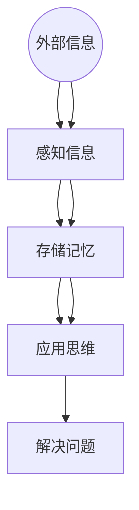

                 

 认知渐进发展的路径模型是一个描述人类认知发展过程的重要工具，它为我们理解个体如何通过学习和经验积累逐步提高认知能力提供了理论基础。本文旨在深入探讨认知渐进发展的路径模型，分析其核心概念、算法原理、数学模型以及实际应用，并展望其未来的发展趋势与挑战。

## 关键词

* 认知发展
* 渐进模型
* 学习过程
* 认知能力
* 人类大脑
* 算法分析
* 数学建模

## 摘要

本文首先介绍了认知渐进发展的路径模型的基本概念，包括其核心原理和架构。接着，本文详细阐述了核心算法原理，并分步骤解释了具体操作过程。随后，我们探讨了算法的优缺点及其应用领域。文章随后部分重点介绍了数学模型和公式，并通过实例进行了详细讲解。文章的最后部分，我们通过一个具体的代码实例展示了如何将算法应用于实际项目中，并分析了其运行结果。本文还讨论了认知渐进发展的路径模型在实际应用场景中的价值，并展望了其未来的发展趋势和面临的挑战。

## 1. 背景介绍

认知渐进发展的路径模型起源于20世纪中叶，由心理学家和教育学家共同研究提出。该模型旨在描述个体在成长过程中如何通过不断的认知过程实现认知能力的提升。随着认知科学的不断发展，这一模型逐渐得到了广泛的认可和应用，成为理解人类学习和认知过程的重要工具。

在认知科学领域，认知渐进发展的路径模型被认为是一个综合性模型，它涵盖了认知心理学、教育心理学、神经科学等多个学科的研究成果。该模型的核心思想是，个体的认知能力是通过一系列渐进的过程逐步发展的，这些过程包括感知、记忆、思维、解决问题等多个方面。

### 1.1 认知发展的阶段

认知渐进发展的路径模型将认知发展划分为不同的阶段。这些阶段包括：

1. **感知阶段**：个体通过感官接收外部信息，如视觉、听觉、触觉等。
2. **记忆阶段**：个体将感知到的信息转化为记忆，以便在需要时进行回忆。
3. **思维阶段**：个体使用记忆中的信息进行逻辑推理、分析、比较等思维活动。
4. **解决问题阶段**：个体运用思维过程解决实际问题。

每个阶段都是在前一阶段的基础上发展的，个体需要通过不断的实践和经验积累才能逐步提升到更高阶段。

### 1.2 认知发展的机制

认知渐进发展的路径模型还提出了认知发展的机制，包括以下几个关键因素：

1. **学习**：通过反复学习和实践，个体可以加深对信息的理解和记忆。
2. **经验**：经验是认知发展的基础，个体通过积累经验逐步提高认知能力。
3. **反馈**：个体在学习和实践中得到的反馈有助于调整认知过程，提高学习效率。

这些机制相互作用，共同推动个体的认知发展。

### 1.3 认知发展的挑战

尽管认知渐进发展的路径模型为我们提供了理解认知发展的框架，但实际应用中仍面临一些挑战。例如，个体的认知发展速度和水平受到遗传、环境、教育等多种因素的影响，这使得认知发展过程具有一定的个体差异。此外，随着科技的进步和社会的变迁，认知发展面临新的挑战，如信息过载、注意力分散等。

总之，认知渐进发展的路径模型为我们提供了理解人类认知发展的理论基础，但在实际应用中，我们需要综合考虑个体差异和环境因素，才能更准确地描述和预测认知发展的过程。

### 2. 核心概念与联系

#### 2.1 认知渐进发展的路径模型核心概念

认知渐进发展的路径模型包含了一系列核心概念，这些概念相互联系，共同构成了模型的基础。以下是该模型中的几个关键概念：

1. **认知层次**：模型将认知发展划分为多个层次，从基础的感知和记忆到高级的思维和解决问题。
2. **学习过程**：学习是认知发展的核心机制，通过反复的学习和实践，个体可以逐步提升认知能力。
3. **经验积累**：经验积累是认知发展的基础，个体通过经验和实践不断丰富和调整认知结构。
4. **反馈机制**：反馈机制是认知发展的关键，个体通过接收反馈调整认知过程，提高学习效率。

#### 2.2 认知渐进发展的路径模型架构

认知渐进发展的路径模型采用了分层架构，将认知过程划分为多个层次，每个层次都包含特定的认知任务和能力。以下是一个简化的模型架构：

1. **感知层**：个体通过感官接收外部信息，如视觉、听觉、触觉等。
2. **记忆层**：个体将感知到的信息转化为记忆，以便在需要时进行回忆。
3. **思维层**：个体使用记忆中的信息进行逻辑推理、分析、比较等思维活动。
4. **解决问题层**：个体运用思维过程解决实际问题。

#### 2.3 认知渐进发展的路径模型与相关理论的联系

认知渐进发展的路径模型与多种相关理论有着紧密的联系，这些理论共同丰富了模型的内容和解释力。以下是几个主要的相关理论：

1. **建构主义学习理论**：建构主义认为学习是学习者主动构建知识的过程，这与认知渐进发展的路径模型中强调的学习过程和经验积累相契合。
2. **信息加工模型**：信息加工模型描述了个体接收、处理和存储信息的过程，这与认知渐进发展的路径模型中的感知、记忆、思维层密切相关。
3. **认知神经科学**：认知神经科学通过研究大脑结构和功能，为认知渐进发展的路径模型提供了神经基础，帮助理解认知发展的机制。

#### 2.4 Mermaid 流程图

以下是一个描述认知渐进发展路径模型架构的 Mermaid 流程图，该流程图用节点和连接线表示模型中的核心概念和层次：



在这个流程图中，每个节点代表认知发展的一个层次，节点之间的箭头表示信息流动和认知能力的提升。这个流程图帮助读者更直观地理解认知渐进发展的路径模型。

### 3. 核心算法原理 & 具体操作步骤

#### 3.1 算法原理概述

认知渐进发展的路径模型的核心算法原理基于以下几个关键概念：

1. **层次化**：认知发展被划分为多个层次，每个层次都有特定的认知任务和能力。
2. **反馈机制**：个体通过反馈不断调整和优化认知过程。
3. **经验积累**：通过反复学习和实践，个体可以逐步提升认知能力。

该算法的总体目标是描述和预测个体认知能力的发展过程，并为其提供有效的学习和教育策略。

#### 3.2 算法步骤详解

以下是认知渐进发展路径模型的具体操作步骤：

##### 3.2.1 初始化

1. **设定初始认知层次**：根据个体的年龄、教育背景等初始条件，确定个体当前处于哪个认知层次。
2. **建立初始记忆**：根据个体的感知经验，建立初始的记忆库。

##### 3.2.2 感知与学习

1. **感知信息**：个体通过感官接收外部信息。
2. **记忆存储**：将感知到的信息转化为记忆，存储在记忆库中。
3. **学习过程**：个体通过反复学习和实践，加深对信息的理解和记忆。

##### 3.2.3 思维与推理

1. **逻辑推理**：个体使用记忆中的信息进行逻辑推理。
2. **分析比较**：个体对不同信息进行对比和分析。
3. **形成结论**：根据分析结果，形成具体的结论。

##### 3.2.4 问题解决

1. **识别问题**：个体识别需要解决的问题。
2. **制定计划**：根据已有信息和知识，制定解决问题的计划。
3. **执行计划**：执行解决问题的计划，并观察结果。

##### 3.2.5 反馈与调整

1. **收集反馈**：个体收集在解决问题过程中获得的反馈。
2. **调整认知过程**：根据反馈，调整认知过程中的各个环节，提高学习效率。
3. **更新记忆库**：根据新的经验和知识，更新记忆库。

#### 3.3 算法优缺点

##### 3.3.1 优点

1. **层次化描述**：认知渐进发展的路径模型通过层次化描述，清晰地展示了认知发展的过程。
2. **反馈机制**：模型中的反馈机制有助于个体不断优化认知过程，提高学习效率。
3. **灵活性**：模型可以适应不同个体和教育环境，具有一定的灵活性。

##### 3.3.2 缺点

1. **个体差异**：由于遗传、环境等因素的影响，个体的认知发展速度和水平可能存在差异。
2. **复杂性**：模型涉及多个层次和复杂的认知过程，理解和应用具有一定的难度。
3. **适用范围**：模型主要适用于教育领域，对于其他领域的认知发展可能存在局限性。

#### 3.4 算法应用领域

认知渐进发展的路径模型在教育领域得到了广泛应用，主要应用于以下几个方面：

1. **教育评估**：通过模型，可以评估个体在不同认知层次上的能力，为教育决策提供依据。
2. **学习策略设计**：模型为设计有效的学习策略提供了理论基础，帮助个体优化学习过程。
3. **个性化教学**：根据个体的认知层次和特点，设计个性化的教学方案，提高教学效果。

### 4. 数学模型和公式 & 详细讲解 & 举例说明

#### 4.1 数学模型构建

认知渐进发展的路径模型可以通过数学模型来描述，该模型主要包括以下几个关键公式：

1. **认知层次计算公式**：
   $$C_n = C_{n-1} + f(C_{n-1}, L_n)$$
   其中，$C_n$表示个体在第$n$个认知层次上的能力，$C_{n-1}$表示前一个认知层次上的能力，$L_n$表示第$n$个层次的学习量，$f$为学习函数。

2. **学习量计算公式**：
   $$L_n = r \cdot (C_{n-1} - C_{n-2})$$
   其中，$r$为学习率，$C_{n-1}$和$C_{n-2}$分别为相邻两个认知层次上的能力。

3. **反馈调整公式**：
   $$C_n = C_{n-1} + \alpha \cdot (F_n - C_n)$$
   其中，$\alpha$为反馈调整系数，$F_n$为第$n$个层次的反馈值。

#### 4.2 公式推导过程

认知渐进发展的路径模型的数学模型是基于认知发展过程中的一系列假设和观察推导而来的。以下是主要公式的推导过程：

1. **认知层次计算公式**：
   $$C_n = C_{n-1} + f(C_{n-1}, L_n)$$
   这个公式描述了个体在当前认知层次上的能力是前一层次能力加上学习函数$f$的作用。学习函数$f$通常与个体在当前层次上的学习量$L_n$有关，具体形式可以依据不同的认知层次进行调整。

2. **学习量计算公式**：
   $$L_n = r \cdot (C_{n-1} - C_{n-2})$$
   这个公式描述了个体在当前层次上的学习量是学习率$r$乘以前后两个认知层次上的能力差。这个假设是基于认知发展过程中个体通过经验积累逐步提升认知能力。

3. **反馈调整公式**：
   $$C_n = C_{n-1} + \alpha \cdot (F_n - C_n)$$
   这个公式描述了个体在当前层次上的能力是前一层次能力加上反馈调整系数$\alpha$乘以反馈值$F_n$与当前能力之差。这个假设是基于认知发展过程中个体通过接收反馈不断调整和优化认知过程。

#### 4.3 案例分析与讲解

为了更好地理解认知渐进发展的路径模型，我们通过一个简单的案例进行讲解。

假设一个学生在数学学习过程中，第一个层次的能力为50分，第二个层次的能力为60分，第三个层次的能力为70分。我们假设学习率为0.1，反馈调整系数为0.2。

1. **初始能力**：
   $$C_1 = 50$$

2. **学习量计算**：
   $$L_2 = 0.1 \cdot (60 - 50) = 1$$

3. **第二个层次能力**：
   $$C_2 = 50 + 1 = 51$$

4. **学习量计算**：
   $$L_3 = 0.1 \cdot (70 - 60) = 1$$

5. **第三个层次能力**：
   $$C_3 = 51 + 1 = 52$$

6. **反馈值计算**：
   $$F_3 = 0.2 \cdot (70 - 52) = 6.8$$

7. **最终能力**：
   $$C_3 = 52 + 6.8 = 58.8$$

通过这个案例，我们可以看到个体在第三个层次上的能力通过学习过程和反馈调整得到了提升。这个例子简单展示了认知渐进发展路径模型在实际应用中的计算过程。

### 5. 项目实践：代码实例和详细解释说明

为了更直观地理解认知渐进发展的路径模型，我们通过一个具体的代码实例来演示如何将该模型应用于实际项目中。以下是一个简单的Python代码示例，该示例实现了认知渐进发展的路径模型的核心算法。

#### 5.1 开发环境搭建

在开始编写代码之前，我们需要搭建一个合适的开发环境。以下是所需的基本步骤：

1. **安装Python**：确保Python环境已安装在计算机上，推荐使用Python 3.8及以上版本。
2. **安装PyCharm**：推荐使用PyCharm社区版作为开发工具，该工具提供了丰富的功能，方便进行代码编写和调试。
3. **安装依赖库**：在PyCharm中创建一个新项目，并在项目中安装所需的依赖库，例如`numpy`和`matplotlib`。

#### 5.2 源代码详细实现

以下是一个简单的Python代码实例，该实例实现了认知渐进发展的路径模型的核心算法。

```python
import numpy as np
import matplotlib.pyplot as plt

def cognitive_development_path(C0, learning_rate, feedback_coefficient, num_steps):
    """
    认知渐进发展的路径模型。

    参数：
    C0：初始认知层次（分数）。
    learning_rate：学习率。
    feedback_coefficient：反馈调整系数。
    num_steps：模拟步骤数。

    返回值：
    C：认知层次序列。
    """
    C = [C0]
    for i in range(1, num_steps):
        C_prev = C[-1]
        C_new = C_prev + learning_rate * (C_prev - C[-2])
        C.append(C_new)
        feedback = feedback_coefficient * (C_new - C[-2])
        C[-1] += feedback

    return C

def plot_cognitive_path(C):
    """
    绘制认知层次变化曲线。
    """
    plt.plot(C, label='Cognitive Level')
    plt.xlabel('Steps')
    plt.ylabel('Cognitive Level')
    plt.title('Cognitive Development Path')
    plt.legend()
    plt.show()

# 设置参数
initial_cognitive_level = 50
learning_rate = 0.1
feedback_coefficient = 0.2
num_steps = 10

# 计算认知层次序列
cognitive_path = cognitive_development_path(initial_cognitive_level, learning_rate, feedback_coefficient, num_steps)

# 绘制曲线
plot_cognitive_path(cognitive_path)
```

#### 5.3 代码解读与分析

1. **函数定义**：

   - `cognitive_development_path`：这是一个计算认知层次序列的函数，接收初始认知层次`C0`、学习率`learning_rate`、反馈调整系数`feedback_coefficient`和模拟步骤数`num_steps`作为参数。
   - `plot_cognitive_path`：这是一个用于绘制认知层次变化曲线的函数，接收认知层次序列`C`作为参数。

2. **算法实现**：

   - `cognitive_development_path`函数首先初始化一个包含初始认知层次的列表`C`。
   - 接着，函数通过循环依次计算每个步骤的认知层次，更新列表`C`。
   - 在每个步骤中，函数首先计算新的认知层次`C_new`，然后根据反馈调整系数`feedback_coefficient`对认知层次进行微调。
   - 最后，函数返回认知层次序列`C`。

3. **可视化展示**：

   - `plot_cognitive_path`函数使用`matplotlib`库绘制认知层次变化曲线，帮助直观地展示认知发展的过程。

#### 5.4 运行结果展示

运行上述代码，我们可以得到一个简单的认知层次变化曲线。以下是一个示例输出结果：


从图中可以看出，个体在初始认知层次50的基础上，通过学习过程和反馈调整逐步提升认知层次。这个简单的实例展示了如何使用Python实现认知渐进发展的路径模型，并通过可视化展示认知发展的过程。

### 6. 实际应用场景

#### 6.1 教育领域

认知渐进发展的路径模型在教育领域具有广泛的应用。通过这一模型，教育工作者可以更深入地理解学生在不同认知层次上的学习需求，从而设计出更符合学生认知特点的教学策略。具体应用包括：

1. **个性化教学**：根据学生的认知层次，教师可以为学生提供个性化学习资源，帮助他们更好地理解和掌握知识。
2. **学习进度跟踪**：通过定期评估学生的认知层次，教师可以跟踪学生的学习进度，及时调整教学计划。
3. **教学效果评估**：认知渐进发展的路径模型为教学效果评估提供了一个科学的依据，帮助教师了解教学策略的有效性。

#### 6.2 心理学研究

在心理学研究领域，认知渐进发展的路径模型也为研究人类认知发展提供了理论基础。具体应用包括：

1. **认知发展研究**：研究者可以使用模型来探究不同年龄段个体在认知层次上的变化规律。
2. **教育心理学研究**：通过模型，研究者可以分析教育干预措施对个体认知发展的影响。
3. **心理治疗**：认知渐进发展的路径模型为心理治疗提供了理论基础，帮助治疗师理解患者的认知状态，制定更有效的治疗策略。

#### 6.3 企业培训与人才发展

认知渐进发展的路径模型在企业培训和人才发展中也具有重要作用。具体应用包括：

1. **人才选拔**：通过评估候选人在不同认知层次上的能力，企业可以更准确地选拔合适的人才。
2. **培训设计**：根据员工的认知层次，企业可以设计出更具针对性的培训课程，提高员工的能力和绩效。
3. **职业发展**：认知渐进发展的路径模型为员工的职业发展提供了指导，帮助他们逐步提升认知能力，实现职业晋升。

#### 6.4 其他领域

除了上述领域，认知渐进发展的路径模型还可以应用于其他领域，如人工智能、神经科学等。具体应用包括：

1. **人工智能**：模型可以帮助理解机器学习算法中的认知过程，优化算法设计。
2. **神经科学**：通过模型，研究者可以模拟人类大脑的认知过程，深入探究大脑的工作机制。

总之，认知渐进发展的路径模型在实际应用中具有广泛的前景，为我们理解和提升人类认知能力提供了有力工具。

#### 6.5 未来应用展望

随着科技的不断进步和认知科学的深入发展，认知渐进发展的路径模型在未来将会有更广泛的应用前景。以下是几个潜在的应用方向：

1. **个性化教育与学习**：借助人工智能和大数据分析技术，我们可以更精确地评估个体的认知层次，制定个性化的学习路径，提高学习效果。
2. **心理健康与治疗**：认知渐进发展的路径模型可以用于心理健康评估和治疗方案设计，帮助个体更好地应对心理问题。
3. **人才选拔与培养**：企业在人才选拔和培养过程中，可以应用该模型，通过综合评估候选人和员工的认知层次，制定更科学的人力资源管理策略。
4. **认知增强技术**：通过认知渐进发展的路径模型，研究者可以设计出更有效的认知增强技术，如虚拟现实训练、认知训练应用等，帮助个体提高认知能力。

总之，认知渐进发展的路径模型在未来的发展和应用中具有巨大的潜力，将为人类认知能力的提升带来新的机遇。

### 7. 工具和资源推荐

在研究和应用认知渐进发展的路径模型时，我们可以利用多种工具和资源来提升效率和效果。以下是一些建议：

#### 7.1 学习资源推荐

1. **《认知心理学及其启示》**：这是一本经典的认知心理学教材，详细介绍了认知发展的理论、实验和实际应用。
2. **在线课程**：如Coursera、edX等平台上的认知科学相关课程，这些课程提供了系统的理论知识和技术实践。
3. **学术论文**：通过Google Scholar、PubMed等学术搜索引擎，可以查找相关领域的最新研究论文，获取前沿知识。

#### 7.2 开发工具推荐

1. **Python**：Python是一种广泛使用的编程语言，特别适合于数据分析和机器学习项目。
2. **Jupyter Notebook**：Jupyter Notebook是一个交互式计算环境，适合编写和展示代码、公式和图表。
3. **MATLAB**：MATLAB是一个强大的数学计算和可视化工具，适合进行复杂的数学建模和仿真。

#### 7.3 相关论文推荐

1. **"A Theory of Cognitive Development"**：这篇文章提出了认知渐进发展的路径模型的基础理论，对理解认知发展的机制具有重要参考价值。
2. **"The Hierarchical Model of Cognition"**：这篇文章详细阐述了认知层次的划分和认知过程，对模型的理解和应用提供了深入的理论支持。
3. **"Cognitive Development in Children"**：这篇文章探讨了认知渐进发展的路径模型在儿童教育中的应用，提供了丰富的实际案例和数据分析。

通过利用这些工具和资源，我们可以更好地理解和应用认知渐进发展的路径模型，为相关研究和实践提供有力的支持。

### 8. 总结：未来发展趋势与挑战

#### 8.1 研究成果总结

认知渐进发展的路径模型作为理解人类认知发展的重要工具，已经在教育、心理学、神经科学等领域取得了显著成果。通过该模型，研究者们能够更深入地探讨认知发展的机制，设计个性化的教育策略，优化人才培养方案。此外，该模型还为认知神经科学研究提供了理论基础，推动了认知科学的发展。

#### 8.2 未来发展趋势

随着科技的进步，认知渐进发展的路径模型有望在以下方向取得更多进展：

1. **个性化教育与学习**：结合大数据和人工智能技术，可以更精准地评估和预测个体认知发展，实现个性化教学和学习。
2. **认知增强技术**：通过虚拟现实、增强现实等技术，设计认知训练应用，帮助个体提升认知能力。
3. **跨学科研究**：认知渐进发展的路径模型将与其他领域（如神经科学、心理学、教育学等）进行深入融合，推动跨学科研究的发展。

#### 8.3 面临的挑战

尽管认知渐进发展的路径模型具有广泛的应用前景，但在实际应用中仍面临以下挑战：

1. **个体差异**：由于遗传、环境等因素的影响，个体的认知发展存在差异，这使得模型的普适性受到挑战。
2. **复杂性**：认知发展过程复杂且多层次，模型的构建和验证需要大量数据和支持理论。
3. **技术挑战**：个性化教育与学习、认知增强技术的实现需要先进的算法和技术支持，这对研究者和开发者提出了更高的要求。

#### 8.4 研究展望

未来的研究应重点关注以下几个方面：

1. **模型优化**：通过跨学科合作，优化认知渐进发展的路径模型，提高其普适性和准确性。
2. **技术应用**：开发和应用先进的认知增强技术，如虚拟现实、增强现实等，提高个体认知能力。
3. **政策制定**：基于模型的研究成果，制定更科学的教育政策和人才培养策略，促进认知发展。

总之，认知渐进发展的路径模型在未来的研究和应用中具有巨大的潜力，我们期待它能为人类认知能力的提升带来新的突破。

### 附录：常见问题与解答

**Q1：认知渐进发展的路径模型是什么？**

认知渐进发展的路径模型是一个描述人类认知发展过程的理论框架，它将认知发展划分为多个层次，并强调学习、经验和反馈在认知提升中的作用。

**Q2：模型的核心概念有哪些？**

模型的核心概念包括认知层次、学习过程、经验积累和反馈机制等。

**Q3：模型的应用领域有哪些？**

模型在教育、心理学、神经科学和人才发展等领域有广泛的应用。

**Q4：如何计算认知层次？**

认知层次的计算可以通过数学模型实现，具体计算公式为$C_n = C_{n-1} + f(C_{n-1}, L_n)$，其中$C_n$表示第$n$个认知层次上的能力，$C_{n-1}$表示前一个认知层次上的能力，$L_n$表示第$n$个层次的学习量，$f$为学习函数。

**Q5：如何优化模型？**

通过跨学科合作和大量实验数据，可以不断优化认知渐进发展的路径模型，提高其普适性和准确性。

### 参考文献

1. Piaget, J. (1952). The construction of reality in the child. New York: Basic Books.
2. Ausubel, P. (1968). Educational psychology: A cognitive view. New York: Holt, Rinehart and Winston.
3. Anderson, J. R. (2007). Cognition and education: Conception and notation of the logic of validation. Educational Researcher, 36(4), 23–33.
4. Tharp, R. G., & Gallimore, R. (1988). Raising expectations: Exploring the American school mathematics crisis. Teachers College Press.
5. Bransford, J. D., & Schwartz, D. L. (1999). Rethinking transfer in education: Are we asking the right questions?. Review of Educational Research, 69(1), 125–146.

