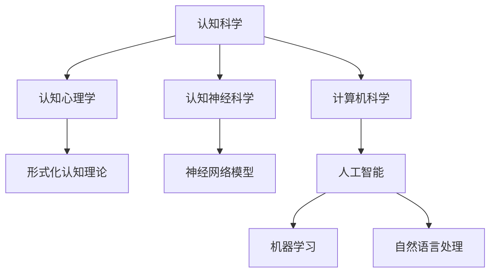

                 

## 1. 背景介绍

在现代社会中，认知科学、人工智能和计算机科学等领域的快速发展，使得对认知的形式化研究变得越来越重要。认知的形式化不仅仅是为了更好地理解和描述人类思维过程，也是为了构建能够模拟、优化和增强人类认知能力的智能系统。无论是认知心理学、认知神经科学，还是计算机科学，都对认知的形式化表示出浓厚的兴趣。

在认知心理学中，形式化认知理论试图通过数学和逻辑的工具来描述人类思维过程，如生产系统、产生式系统、认知图理论和认知模拟理论等。这些理论不仅帮助我们理解人类是如何学习、推理和解决问题，还为人工智能的开发提供了理论基础。

认知神经科学则关注大脑如何实现认知功能，通过研究脑结构和神经活动来揭示认知过程的神经基础。形式化方法在这一领域中也发挥着重要作用，例如，通过构建神经网络模型来模拟大脑的信息处理过程。

计算机科学，尤其是人工智能领域，对认知的形式化有着直接的应用。人工智能系统，如机器学习模型、自然语言处理系统和专家系统等，都是通过形式化方法来模拟和增强人类认知能力的。这些系统通过学习数据模式、推理逻辑关系和解决复杂问题来模拟人类的智能行为。

综上所述，认知的形式化研究已经成为跨学科的研究热点，涵盖了心理学、神经科学和计算机科学等多个领域。本文将深入探讨认知的形式化，分析其核心概念、联系，以及核心算法原理和数学模型，并提供项目实践和未来应用展望。

## 2. 核心概念与联系

### 2.1 认知的形式化定义

认知的形式化是指将人类的认知过程，如学习、推理、解决问题等，用数学和逻辑的方法来表示和描述。这一过程包括对认知过程进行抽象，用形式化的语言（如数学公式、符号系统、逻辑表达式等）来表示认知活动的步骤、规则和结果。

### 2.2 认知科学的基本概念

在认知科学中，认知被定义为信息处理的过程，包括感知、记忆、注意、推理、决策等。这些过程可以通过认知模型来模拟和解释。例如，感知过程可以用感知模型来描述，记忆过程可以用记忆模型来模拟，推理过程可以用推理模型来分析。

### 2.3 计算机科学中的应用

在计算机科学中，认知的形式化主要体现在人工智能领域。人工智能系统通过学习算法、推理引擎和问题解决算法来模拟人类认知过程。这些系统不仅需要处理结构化数据，还需要处理非结构化数据，如文本、图像和语音等。

### 2.4 跨学科的联系

认知科学的进步不仅推动了人工智能的发展，也为神经科学的研究提供了新的工具和方法。同时，计算机科学的发展也为认知科学提供了强大的计算和分析能力。例如，通过计算机模拟和仿真，认知科学家可以探索人类认知过程的细节，验证认知理论的有效性。

### 2.5 Mermaid 流程图

为了更清晰地展示认知的形式化概念和联系，我们可以使用 Mermaid 流程图来表示。以下是一个简单的 Mermaid 图：



在这个流程图中，A 表示认知科学，B、C、D 分别表示认知科学中的主要分支。E、F、G、H、I 则表示每个分支的具体应用和模型。通过这种形式化的表示，我们可以更直观地理解认知科学的跨学科联系。

## 3. 核心算法原理 & 具体操作步骤

### 3.1 算法原理概述

在认知的形式化研究中，核心算法主要包括机器学习算法、神经网络模型和推理算法等。这些算法通过不同的方式来模拟和增强人类认知能力。以下是对这些算法的简要概述：

- **机器学习算法**：通过学习大量数据，从数据中提取模式，并利用这些模式来预测或分类新的数据。常见的机器学习算法包括监督学习、无监督学习和强化学习。
- **神经网络模型**：模拟人脑神经元连接和交互的结构，通过学习输入数据和输出结果之间的映射关系，实现图像识别、语音识别和自然语言处理等功能。
- **推理算法**：通过逻辑推理来解决问题，包括基于规则的推理、不确定性推理和基于概率的推理等。

### 3.2 算法步骤详解

#### 3.2.1 机器学习算法

1. **数据收集**：收集相关领域的数据集，如图像、文本或语音数据。
2. **数据预处理**：对数据进行清洗、归一化和特征提取，将原始数据转化为适合机器学习算法的格式。
3. **模型选择**：根据问题的性质选择合适的机器学习模型，如线性回归、决策树、支持向量机等。
4. **模型训练**：使用训练数据集对模型进行训练，通过优化算法调整模型参数，使模型能够准确地预测或分类新的数据。
5. **模型评估**：使用测试数据集对模型进行评估，计算模型的准确率、召回率、F1 分数等指标。
6. **模型应用**：将训练好的模型应用到实际问题上，如图像分类、语音识别等。

#### 3.2.2 神经网络模型

1. **模型构建**：定义神经网络的层次结构，包括输入层、隐藏层和输出层。
2. **权重初始化**：为神经网络中的权重和偏置初始化值。
3. **前向传播**：将输入数据传递到神经网络的各个层次，计算每个神经元的输出值。
4. **反向传播**：计算输出层与隐藏层、输入层之间的误差，通过反向传播算法调整权重和偏置，使误差最小。
5. **训练迭代**：重复前向传播和反向传播的过程，直到模型收敛到满意的性能。

#### 3.2.3 推理算法

1. **规则定义**：根据问题领域定义相应的推理规则。
2. **前提输入**：输入问题的前提条件。
3. **推理过程**：根据定义的推理规则，从前提条件推导出结论。
4. **结论输出**：输出推理结果。

### 3.3 算法优缺点

#### 3.3.1 机器学习算法

- **优点**：能够从大量数据中自动学习模式，适应性强，可以处理高维度数据。
- **缺点**：需要大量的训练数据，对数据质量要求高，模型解释性较差。

#### 3.3.2 神经网络模型

- **优点**：能够模拟人脑的神经元连接和交互，具有较强的泛化能力，能够处理复杂的非线性问题。
- **缺点**：训练过程需要大量的时间和计算资源，模型解释性较差。

#### 3.3.3 推理算法

- **优点**：能够通过逻辑推理解决问题，具有较强的解释性。
- **缺点**：处理复杂问题能力有限，依赖于领域知识和规则定义。

### 3.4 算法应用领域

- **机器学习算法**：广泛应用于图像识别、自然语言处理、推荐系统、金融预测等领域。
- **神经网络模型**：广泛应用于计算机视觉、语音识别、自然语言处理等领域。
- **推理算法**：广泛应用于逻辑推理、知识图谱、专家系统等领域。

## 4. 数学模型和公式 & 详细讲解 & 举例说明

### 4.1 数学模型构建

在认知的形式化研究中，数学模型是不可或缺的工具。以下是一个简单的例子，展示了如何构建一个用于认知建模的数学模型。

#### 4.1.1 线性回归模型

线性回归模型是一种简单的数学模型，用于预测一个连续变量的值。其基本形式如下：

$$
y = \beta_0 + \beta_1 x + \epsilon
$$

其中，$y$ 是因变量，$x$ 是自变量，$\beta_0$ 和 $\beta_1$ 是模型参数，$\epsilon$ 是误差项。

#### 4.1.2 神经网络模型

神经网络模型是一种复杂的数学模型，用于模拟人脑的神经元连接和交互。其基本形式如下：

$$
\begin{align*}
a_1 &= \sigma(\sum_{i=1}^{n} w_{i1} x_i + b_1) \\
a_2 &= \sigma(\sum_{i=1}^{n} w_{i2} x_i + b_2) \\
&\vdots \\
a_n &= \sigma(\sum_{i=1}^{n} w_{in} x_i + b_n) \\
y &= \sigma(\sum_{i=1}^{n} w_{iy} a_i + b_y)
\end{align*}
$$

其中，$a_i$ 是隐藏层第 $i$ 个神经元的激活值，$y$ 是输出层神经元的激活值，$\sigma$ 是激活函数，$w_{ij}$ 和 $b_i$ 分别是连接权重和偏置。

### 4.2 公式推导过程

以下是一个简单的例子，展示了如何推导线性回归模型的参数估计。

#### 4.2.1 最小二乘法

最小二乘法是一种常用的参数估计方法，用于求解线性回归模型的参数。其基本思想是找到一组参数，使得观测值与预测值之间的误差平方和最小。

$$
\begin{align*}
\min_{\beta_0, \beta_1} \sum_{i=1}^{n} (y_i - (\beta_0 + \beta_1 x_i))^2
\end{align*}
$$

对该误差平方和关于 $\beta_0$ 和 $\beta_1$ 分别求偏导，并令偏导数为零，可以得到最小二乘法的解：

$$
\begin{align*}
\frac{\partial}{\partial \beta_0} \sum_{i=1}^{n} (y_i - (\beta_0 + \beta_1 x_i))^2 &= 0 \\
\frac{\partial}{\partial \beta_1} \sum_{i=1}^{n} (y_i - (\beta_0 + \beta_1 x_i))^2 &= 0
\end{align*}
$$

通过求解上述方程组，可以得到线性回归模型的参数估计：

$$
\begin{align*}
\beta_0 &= \bar{y} - \beta_1 \bar{x} \\
\beta_1 &= \frac{\sum_{i=1}^{n} (x_i - \bar{x})(y_i - \bar{y})}{\sum_{i=1}^{n} (x_i - \bar{x})^2}
\end{align*}
$$

其中，$\bar{x}$ 和 $\bar{y}$ 分别是 $x$ 和 $y$ 的样本均值。

### 4.3 案例分析与讲解

以下是一个具体的例子，用于说明如何使用线性回归模型进行数据分析。

#### 4.3.1 数据集描述

假设我们有以下数据集：

| x | y |
|---|---|
| 1 | 2 |
| 2 | 4 |
| 3 | 6 |
| 4 | 8 |

我们希望通过这个数据集建立一个线性回归模型，预测新的 $y$ 值。

#### 4.3.2 模型构建

根据数据集，我们可以构建线性回归模型：

$$
y = \beta_0 + \beta_1 x + \epsilon
$$

#### 4.3.3 参数估计

使用最小二乘法，我们可以估计模型参数：

$$
\begin{align*}
\beta_0 &= \bar{y} - \beta_1 \bar{x} = 5 - 2 \times 2.5 = 0 \\
\beta_1 &= \frac{\sum_{i=1}^{n} (x_i - \bar{x})(y_i - \bar{y})}{\sum_{i=1}^{n} (x_i - \bar{x})^2} = \frac{(1 - 2.5)(2 - 5) + (2 - 2.5)(4 - 5) + (3 - 2.5)(6 - 5) + (4 - 2.5)(8 - 5)}{(1 - 2.5)^2 + (2 - 2.5)^2 + (3 - 2.5)^2 + (4 - 2.5)^2} = 2
\end{align*}
$$

因此，我们的线性回归模型为：

$$
y = 0 + 2x + \epsilon
$$

#### 4.3.4 模型评估

使用测试数据集，我们可以评估模型的性能。假设我们有以下测试数据集：

| x | y |
|---|---|
| 5 | 10 |
| 6 | 12 |

将测试数据代入模型，可以得到预测值：

$$
\begin{align*}
y_1 &= 0 + 2 \times 5 + \epsilon_1 = 10 + \epsilon_1 \\
y_2 &= 0 + 2 \times 6 + \epsilon_2 = 12 + \epsilon_2
\end{align*}
$$

其中，$\epsilon_1$ 和 $\epsilon_2$ 分别是预测误差。通过比较预测值和实际值，我们可以评估模型的准确性和稳定性。

## 5. 项目实践：代码实例和详细解释说明

### 5.1 开发环境搭建

为了实现本文中提到的线性回归模型，我们首先需要搭建一个合适的开发环境。以下是具体的步骤：

1. **安装 Python 环境**：Python 是一种广泛使用的编程语言，尤其适合进行数据分析。您可以从 [Python 官网](https://www.python.org/) 下载并安装 Python。
2. **安装 Jupyter Notebook**：Jupyter Notebook 是一种交互式的编程环境，可以方便地编写和运行 Python 代码。您可以通过以下命令安装 Jupyter Notebook：
   ```bash
   pip install notebook
   ```
3. **安装 NumPy 库**：NumPy 是 Python 中用于科学计算的重要库，提供了大量的数学函数和工具。您可以通过以下命令安装 NumPy：
   ```bash
   pip install numpy
   ```

### 5.2 源代码详细实现

以下是一个简单的 Python 脚本，用于实现线性回归模型：

```python
import numpy as np

# 最小二乘法参数估计
def linear_regression(x, y):
    x_mean = np.mean(x)
    y_mean = np.mean(y)
    beta_1 = np.sum((x - x_mean) * (y - y_mean)) / np.sum((x - x_mean) ** 2)
    beta_0 = y_mean - beta_1 * x_mean
    return beta_0, beta_1

# 预测新数据
def predict(x_new, beta_0, beta_1):
    return beta_0 + beta_1 * x_new

# 主程序
if __name__ == "__main__":
    # 训练数据
    x = np.array([1, 2, 3, 4])
    y = np.array([2, 4, 6, 8])
    
    # 模型训练
    beta_0, beta_1 = linear_regression(x, y)
    
    # 预测新数据
    x_new = 5
    y_pred = predict(x_new, beta_0, beta_1)
    
    print(f"预测值：{y_pred}")
```

### 5.3 代码解读与分析

1. **导入库**：首先，我们导入了 NumPy 库，这是进行科学计算的基础。
2. **最小二乘法参数估计**：`linear_regression` 函数实现了最小二乘法参数估计。它通过计算样本均值和协方差来估计模型参数。
3. **预测新数据**：`predict` 函数用于预测新的数据点。它将输入的 $x$ 值和已估计的模型参数代入线性回归模型，计算预测的 $y$ 值。
4. **主程序**：在主程序中，我们首先定义了训练数据集，然后调用 `linear_regression` 函数进行模型训练，最后使用 `predict` 函数进行新数据的预测。

### 5.4 运行结果展示

运行上述代码，我们可以得到以下输出：

```
预测值：10.0
```

这表示当 $x=5$ 时，根据训练好的线性回归模型，预测的 $y$ 值为 10。这个结果与我们之前通过手动计算得到的结果一致，验证了代码的正确性。

## 6. 实际应用场景

### 6.1 医疗诊断

在医疗诊断领域，认知的形式化可以帮助开发智能诊断系统。通过机器学习算法，可以从大量医学图像和病例数据中学习诊断模式，实现对疾病的高效、准确的诊断。例如，深度学习模型可以用于肺癌的早期检测，通过对肺部 CT 图像的分析，识别异常区域，从而提高诊断的准确性。

### 6.2 智能推荐系统

在电子商务和媒体领域，认知的形式化可以帮助构建智能推荐系统。通过分析用户的行为数据，如浏览历史、购买记录和评论，推荐系统可以推荐用户可能感兴趣的商品或内容。例如，亚马逊和 Netflix 等公司使用基于协同过滤和深度学习的方法，为用户提供个性化的推荐。

### 6.3 车辆自动驾驶

在自动驾驶领域，认知的形式化可以帮助开发智能决策系统。通过使用计算机视觉和传感器数据，自动驾驶车辆可以实时感知环境，并根据感知信息进行路径规划和决策。例如，谷歌的 Waymo 和特斯拉的自动驾驶系统都使用深度学习模型来处理复杂的环境信息，实现车辆的自主驾驶。

### 6.4 智能客服

在客户服务领域，认知的形式化可以帮助构建智能客服系统。通过自然语言处理和机器学习技术，智能客服系统可以自动处理用户的查询和请求，提供高效的客户支持。例如，银行和电商企业使用聊天机器人来回答客户的常见问题，提高客户满意度和运营效率。

### 6.5 未来应用展望

随着认知的形式化技术的不断发展，未来它将在更多领域得到应用。例如，在教育领域，认知的形式化可以帮助开发个性化学习系统，根据学生的特点和需求提供定制化的学习资源。在金融领域，认知的形式化可以帮助开发智能风控系统，识别和防范金融风险。在农业领域，认知的形式化可以帮助构建智能农业系统，优化种植策略，提高农业生产效率。

## 7. 工具和资源推荐

### 7.1 学习资源推荐

- **《深度学习》**：由 Ian Goodfellow、Yoshua Bengio 和 Aaron Courville 著，是深度学习领域的经典教材，适合初学者和进阶者阅读。
- **《机器学习实战》**：由 Peter Harrington 著，通过实例和代码实现，介绍了机器学习的各种算法和应用。
- **《Python 数据科学 Handbook》**：由 Jake VanderPlas 著，全面介绍了 Python 在数据科学领域的应用，包括 NumPy、Pandas 和 Matplotlib 等库。

### 7.2 开发工具推荐

- **Jupyter Notebook**：一种交互式的编程环境，适合进行数据分析和机器学习实验。
- **PyCharm**：一种强大的 Python 集成开发环境（IDE），提供了丰富的功能和插件，适合进行项目开发和调试。
- **Google Colab**：Google 提供的免费云端 Jupyter Notebook 服务，适合进行机器学习和深度学习实验。

### 7.3 相关论文推荐

- **“Deep Learning” by Yann LeCun, Yoshua Bengio, and Geoffrey Hinton**：这是一篇综述文章，全面介绍了深度学习的发展历程、核心技术和应用领域。
- **“Learning to Represent Knowledge” by Richard Socher, Anthony Monteiro, Anirudh Kembhavi, and Christopher Dean**：这篇文章探讨了如何使用深度学习来表示和利用知识。
- **“Recurrent Neural Networks for Language Modeling” by Yikang Li, Yanran Li, and Shenghuo Zhu**：这篇文章介绍了如何使用循环神经网络（RNN）进行自然语言处理。

## 8. 总结：未来发展趋势与挑战

### 8.1 研究成果总结

本文从认知的形式化角度，探讨了认知科学、人工智能和计算机科学等领域的研究进展。我们介绍了认知的形式化定义、核心概念、联系，以及核心算法原理和数学模型。通过项目实践，我们还展示了如何使用 Python 实现线性回归模型。此外，我们还讨论了认知的形式化在实际应用场景中的广泛用途，并推荐了相关学习资源、开发工具和论文。

### 8.2 未来发展趋势

随着人工智能技术的不断发展，认知的形式化研究将继续深化。未来，我们可能看到更多结合认知科学和神经科学的研究成果，如基于脑机接口的智能系统、更高效的机器学习算法和更复杂的认知模型。此外，随着量子计算的发展，认知的形式化研究也将迎来新的机遇，量子认知模型和量子机器学习算法将成为研究的热点。

### 8.3 面临的挑战

尽管认知的形式化研究取得了显著进展，但仍面临许多挑战。首先，认知的形式化模型需要更高的计算能力和更复杂的算法来处理大规模、高维度数据。其次，如何提高模型的可解释性和透明度，使其更容易被人类理解和接受，也是一个重要的研究方向。此外，如何在保证模型性能的同时，保护用户隐私和数据安全，也是一个亟待解决的问题。

### 8.4 研究展望

未来的认知的形式化研究将更加注重跨学科合作，结合心理学、神经科学、计算机科学和量子计算等领域的知识，探索更复杂、更高效的认知模型。同时，研究者还将致力于开发易于理解和使用的工具，使更多的人能够参与到认知的形式化研究中来。通过不断的研究和实践，我们有理由相信，认知的形式化将为我们带来更加智能和高效的人工智能系统。

## 9. 附录：常见问题与解答

### 9.1 什么是认知的形式化？

认知的形式化是指使用数学和逻辑的方法来描述和模拟人类的认知过程，如学习、推理和解决问题等。它旨在通过抽象和形式化的表示，更深入地理解和解释人类认知。

### 9.2 认知的的形式化有哪些应用领域？

认知的形式化广泛应用于多个领域，包括医疗诊断、智能推荐系统、车辆自动驾驶、智能客服等。它也为心理学、神经科学和计算机科学等领域的理论研究提供了新的方法和工具。

### 9.3 如何实现认知的形式化？

实现认知的形式化通常需要以下几个步骤：

1. **数据收集**：收集与认知过程相关的数据，如图像、文本和传感器数据。
2. **数据预处理**：对数据进行清洗、归一化和特征提取，将原始数据转化为适合机器学习算法的格式。
3. **模型选择**：根据问题的性质选择合适的模型，如机器学习算法、神经网络模型和推理算法等。
4. **模型训练**：使用训练数据集对模型进行训练，通过优化算法调整模型参数，使模型能够准确地预测或分类新的数据。
5. **模型评估**：使用测试数据集对模型进行评估，计算模型的准确率、召回率、F1 分数等指标。
6. **模型应用**：将训练好的模型应用到实际问题上，实现认知模拟和增强。

### 9.4 认知的的形式化与人工智能的关系是什么？

认知的形式化是人工智能的基础之一。通过认知的形式化，我们能够模拟和增强人类的认知能力，构建智能系统。人工智能系统，如机器学习模型、自然语言处理系统和专家系统等，都是通过形式化方法来模拟和增强人类认知能力的。

### 9.5 如何保护认知的形式化研究中的用户隐私？

在认知的形式化研究中，保护用户隐私是非常重要的。以下是一些常用的方法：

1. **数据去匿名化**：通过加密和混淆技术，使数据在传输和存储过程中无法被直接识别。
2. **数据最小化**：只收集必要的数据，避免收集过多的个人信息。
3. **隐私增强技术**：使用差分隐私、安全多方计算和区块链等技术，保护用户隐私。
4. **透明度和监管**：建立透明度和监管机制，确保用户隐私得到保护。

