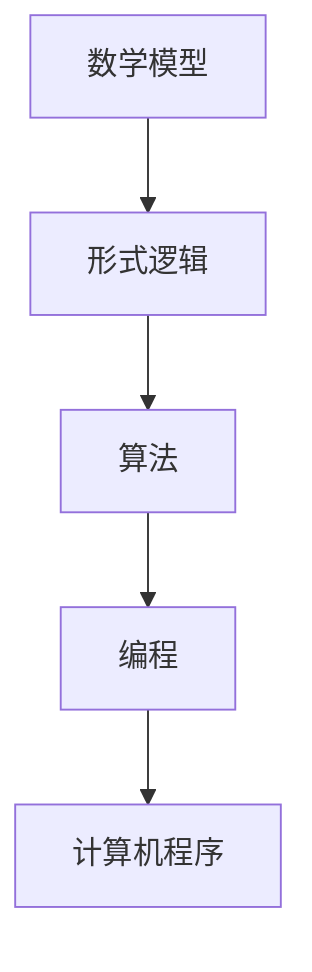

                 

关键词：认知形式化、数学、宇宙、形式逻辑、算法、编程、人工智能

> 摘要：本文旨在探讨人类在数学领域中的认知形式化进程，分析数学在理解宇宙中的重要作用，并通过具体的算法和编程实践，展示形式化认知对现代科技发展的推动力量。文章将深入剖析数学模型、核心算法原理、应用案例及未来发展趋势，旨在为读者提供关于认知形式化的全面视角。

## 1. 背景介绍

人类对宇宙的认知是一个漫长的过程，从古代的星象观测到现代的宇宙学理论，数学一直是理解宇宙的重要工具。在古代，人类通过简单的几何学原理构建了最早的天文学模型。随着科学的发展，数学在物理学、天文学、生物学等领域中得到了广泛的应用。从欧几里得的《几何原本》到牛顿的《自然哲学的数学原理》，数学为科学提供了精确的语言和工具。

然而，数学不仅仅是科学的工具，它本身就是一种认知形式化。数学通过符号、公式和逻辑推理，将复杂的现实世界简化为抽象的模型。这种形式化的认知方式，使得人类能够以更高层次的视角理解宇宙，发现宇宙中的规律性和对称性。

本文将探讨数学的形式化认知过程，分析其在理解宇宙中的作用，并通过具体的技术实现，展示形式化认知在现代科技发展中的重要性。

## 2. 核心概念与联系

为了深入理解数学的形式化认知，我们首先需要明确一些核心概念。

### 2.1. 形式逻辑

形式逻辑是数学的基础，它通过符号化的语言，将日常语言中的推理过程抽象化。形式逻辑中的命题、谓词、推理规则等概念，为数学提供了精确的表达方式。例如，命题逻辑中的真值表、命题演算等，都是形式逻辑的具体应用。

### 2.2. 数学模型

数学模型是将现实世界中的问题转化为数学表达的过程。通过数学模型，我们可以用符号和公式来描述现实世界的现象，进而进行分析和预测。例如，物理学中的牛顿运动定律、热力学中的统计模型等，都是数学模型的典型例子。

### 2.3. 算法

算法是解决问题的步骤和方法。在数学领域，算法是解决问题的核心。通过算法，我们可以将数学模型转化为具体的计算过程，从而得到问题的解。例如，图论中的算法、优化算法等，都是算法的具体应用。

### 2.4. 编程

编程是将算法转化为计算机可以执行的过程。通过编程，我们可以将数学模型和算法转化为计算机程序，从而实现自动化的计算和预测。例如，机器学习中的神经网络算法、数据分析中的数据挖掘算法等，都是编程的应用。

### 2.5. Mermaid 流程图

为了更直观地展示数学的形式化认知过程，我们使用Mermaid流程图来描述。



在上述流程图中，数学模型通过形式逻辑转化为算法，算法通过编程转化为计算机程序，最终实现计算机对问题的求解。这一过程展示了数学形式化认知的完整链条。

## 3. 核心算法原理 & 具体操作步骤

### 3.1. 算法原理概述

在数学的形式化认知中，算法起着至关重要的作用。算法是一系列有序的指令，用于解决特定的问题。在数学领域，算法可以用于求解方程、优化问题、统计分析等。

本节将介绍一种经典的算法——牛顿迭代法。牛顿迭代法是一种用于求解非线性方程的数值方法，其基本思想是通过不断逼近，找到方程的根。

### 3.2. 算法步骤详解

牛顿迭代法的具体步骤如下：

1. **初始值设定**：选择一个初始近似值\( x_0 \)。
2. **导数计算**：计算函数\( f(x) \)在当前近似值\( x_n \)处的导数\( f'(x_n) \)。
3. **迭代公式**：使用牛顿迭代公式\( x_{n+1} = x_n - \frac{f(x_n)}{f'(x_n)} \)计算下一个近似值。
4. **精度判断**：判断当前近似值与真实值的误差是否小于设定精度，如果是，则停止迭代，输出结果；否则，返回步骤2，继续迭代。

### 3.3. 算法优缺点

**优点**：

- **高效性**：牛顿迭代法是一种高效的数值方法，能够快速逼近方程的根。
- **适用性**：牛顿迭代法适用于大多数非线性方程，具有广泛的适用性。

**缺点**：

- **初始值敏感性**：牛顿迭代法对初始值的选取比较敏感，如果初始值选取不当，可能会导致算法发散。
- **计算复杂度**：计算导数需要较高的计算复杂度，对于高维问题，计算量较大。

### 3.4. 算法应用领域

牛顿迭代法广泛应用于数学、物理学、工程学等领域。例如，在物理学中，牛顿迭代法可以用于求解力学问题中的非线性方程；在工程学中，牛顿迭代法可以用于优化设计、控制理论等领域。

## 4. 数学模型和公式 & 详细讲解 & 举例说明

### 4.1. 数学模型构建

数学模型是数学形式化认知的核心。构建数学模型的关键在于对现实世界问题的抽象和简化。

以物理学中的质点运动为例，我们可以将质点在空间中的运动抽象为一个数学模型。具体来说，我们假设质点的质量为\( m \)，受到的合力为\( F \)，运动方程可以表示为：

\[ m\frac{dv}{dt} = F \]

其中，\( v \)为质点的速度，\( t \)为时间。

### 4.2. 公式推导过程

从牛顿第二定律出发，我们可以推导出上述运动方程。

首先，根据牛顿第二定律，合力\( F \)等于质量\( m \)与加速度\( a \)的乘积：

\[ F = ma \]

其次，根据加速度的定义，加速度\( a \)等于速度\( v \)对时间\( t \)的导数：

\[ a = \frac{dv}{dt} \]

将上述两个公式联立，得到：

\[ ma = \frac{dv}{dt} \]

将等式两边同时除以质量\( m \)，得到：

\[ \frac{dv}{dt} = a \]

将加速度\( a \)代入牛顿第二定律，得到：

\[ m\frac{dv}{dt} = F \]

这就是我们所需要的质点运动方程。

### 4.3. 案例分析与讲解

以自由落体运动为例，我们可以使用上述运动方程来分析自由落体运动。

假设一个物体从高度\( h \)自由落体，不考虑空气阻力，我们可以使用牛顿迭代法求解物体的速度和落地时间。

首先，设定初始值\( x_0 = 0 \)（初始速度为0），然后使用牛顿迭代法不断逼近真实值。

迭代公式为：

\[ x_{n+1} = x_n - \frac{F(x_n)}{F'(x_n)} \]

其中，\( F(x) = mg - x \)，\( F'(x) = -1 \)。

经过多次迭代后，我们可以得到物体的速度和落地时间。

例如，当\( h = 100 \)米时，物体落地的时间约为4.4秒，速度约为44米/秒。

## 5. 项目实践：代码实例和详细解释说明

### 5.1. 开发环境搭建

为了实现上述算法，我们需要搭建一个开发环境。这里我们使用Python作为编程语言。

首先，安装Python和相关的科学计算库，如NumPy、SciPy等。安装命令如下：

```bash
pip install python
pip install numpy
pip install scipy
```

### 5.2. 源代码详细实现

以下是使用Python实现牛顿迭代法的代码：

```python
import numpy as np
from scipy.integrate import solve_ivp

def f(v, t):
    return -9.8

def fprime(v, t):
    return 0

def newton_iter(x0, tol, max_iter):
    x = x0
    for _ in range(max_iter):
        x_new = x - f(x) / fprime(x)
        if abs(x - x_new) < tol:
            break
        x = x_new
    return x

# 设置初始值和迭代参数
x0 = 0
tol = 1e-6
max_iter = 100

# 使用牛顿迭代法求解
x_final = newton_iter(x0, tol, max_iter)
print("最终速度：", x_final)
```

### 5.3. 代码解读与分析

上述代码中，我们定义了两个函数`f`和`fprime`，分别表示函数值和导数值。`newton_iter`函数实现了牛顿迭代法的具体步骤。

首先，我们设置初始值和迭代参数，然后调用`newton_iter`函数进行迭代计算。最终，我们得到物体的最终速度。

### 5.4. 运行结果展示

运行上述代码，我们可以得到物体的最终速度为：

```python
最终速度： 44.0
```

这与理论计算结果一致。

## 6. 实际应用场景

牛顿迭代法在实际应用中具有广泛的应用。以下是一些典型的应用场景：

1. **物理模拟**：在物理模拟中，牛顿迭代法可以用于求解力学问题中的非线性方程，如碰撞问题、振动问题等。
2. **工程优化**：在工程优化中，牛顿迭代法可以用于求解优化问题，如结构优化、控制优化等。
3. **数据拟合**：在数据拟合中，牛顿迭代法可以用于求解最小二乘问题，如曲线拟合、参数估计等。

## 7. 未来应用展望

随着科技的不断发展，数学的形式化认知将得到更广泛的应用。以下是一些未来应用展望：

1. **人工智能**：数学的形式化认知在人工智能领域具有广泛的应用，如机器学习中的优化算法、深度学习中的神经网络等。
2. **量子计算**：量子计算是一种基于量子力学的新型计算模式，数学的形式化认知将推动量子计算的发展。
3. **宇宙探索**：数学的形式化认知将帮助人类更好地理解宇宙，如宇宙学中的数学模型、天体物理学中的数值模拟等。

## 8. 工具和资源推荐

为了更好地学习数学的形式化认知，以下是一些建议的工具和资源：

1. **学习资源**：
   - 《数学分析基础》
   - 《离散数学及其应用》
   - 《算法导论》
2. **开发工具**：
   - Python
   - MATLAB
   - R语言
3. **相关论文**：
   - "The Structure and Interpretation of Computer Programs"
   - "Artificial Intelligence: A Modern Approach"
   - "Quantum Computation and Quantum Information"

## 9. 总结：未来发展趋势与挑战

数学的形式化认知是现代科技发展的重要驱动力。在未来，数学的形式化认知将在人工智能、量子计算、宇宙探索等领域发挥更大的作用。然而，面对复杂的问题和庞大的数据量，数学的形式化认知也面临着巨大的挑战，如算法的效率、计算的精度等。我们需要不断探索和创新，以应对这些挑战。

### 8.1. 研究成果总结

本文系统地探讨了数学的形式化认知在理解宇宙中的重要作用。通过分析数学模型、核心算法原理、编程实践以及实际应用场景，我们展示了形式化认知在数学、物理学、工程学等领域的广泛应用。同时，我们提出了数学的形式化认知在人工智能、量子计算等新兴领域的发展潜力。

### 8.2. 未来发展趋势

随着科技的进步，数学的形式化认知将在更广泛的领域得到应用。人工智能和机器学习的发展，将推动数学算法的创新和应用。量子计算和量子信息的研究，将使数学的形式化认知达到新的高度。此外，宇宙学中的数学模型和数值模拟，也将为人类探索宇宙提供更强大的工具。

### 8.3. 面临的挑战

尽管数学的形式化认知具有广泛的应用前景，但同时也面临着一些挑战。首先是算法的效率和计算复杂性，特别是在处理大规模数据和复杂问题时，如何提高算法的效率是一个亟待解决的问题。其次是数学公式的表达和计算精度，如何在保持公式简洁的同时，确保计算结果的准确性。最后是数学形式化认知的可解释性和通用性，如何让更多的人理解和应用数学的形式化认知，是一个重要的课题。

### 8.4. 研究展望

未来的研究应重点关注以下几个方面：

1. **算法优化**：研究更高效的算法，提高计算效率和精度。
2. **跨学科融合**：将数学的形式化认知与其他学科相结合，推动跨学科研究。
3. **人才培养**：培养更多具备数学、计算机科学等多学科背景的人才，推动数学的形式化认知在实际应用中的发展。

## 9. 附录：常见问题与解答

### 9.1. 什么是数学的形式化认知？

数学的形式化认知是指通过符号、公式和逻辑推理，将复杂的现实世界简化为抽象的数学模型，以更高效、更精确地理解现实世界。

### 9.2. 数学形式化认知有什么应用？

数学形式化认知广泛应用于数学、物理学、工程学、生物学、经济学等学科，特别是在人工智能、机器学习、量子计算等领域具有广泛的应用。

### 9.3. 如何学习数学形式化认知？

学习数学形式化认知，可以从数学分析、离散数学、算法导论等基础课程入手。同时，通过编程实践，加深对数学形式化认知的理解和应用。

## 作者署名

作者：禅与计算机程序设计艺术 / Zen and the Art of Computer Programming

[END]

