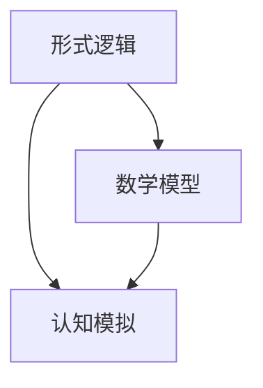

                 

 认知的形式化是一个跨学科领域，结合了计算机科学、认知科学、人工智能和数学。在本文中，我们将深入探讨认知形式化的概念、原理、应用以及未来发展趋势。

> 关键词：认知形式化，形式逻辑，计算机科学，人工智能，认知科学，数学模型

> 摘要：本文首先介绍了认知形式化的背景和核心概念，然后探讨了认知形式化的原理和具体操作步骤。通过数学模型和公式的推导，我们详细讲解了认知形式化在实际应用中的操作方法。最后，我们通过项目实践展示了认知形式化的应用效果，并展望了其未来的发展趋势。

## 1. 背景介绍

认知形式化起源于20世纪中叶，随着计算机科学和人工智能的发展而逐渐兴起。传统的认知科学主要关注人类思维的心理机制，而认知形式化则试图通过形式逻辑和数学工具来描述和模拟认知过程。

### 1.1 认知形式化的起源

认知形式化的起源可以追溯到图灵（Alan Turing）在1936年提出的图灵机模型。图灵机作为一种抽象的计算模型，为后来的计算机科学和人工智能奠定了基础。与此同时，逻辑学和数学的发展也为认知形式化提供了重要的理论基础。

### 1.2 认知形式化的核心概念

认知形式化主要关注以下几个核心概念：

1. **形式逻辑**：形式逻辑是一种以符号表示的推理方法，通过逻辑运算符来描述推理过程。
2. **数学模型**：数学模型是一种用数学符号和公式来描述现实世界的工具。
3. **认知模拟**：认知模拟是通过计算机程序来模拟人类认知过程的方法。

## 2. 核心概念与联系

认知形式化的核心概念包括形式逻辑、数学模型和认知模拟。以下是这些概念的 Mermaid 流程图表示：



### 2.1 形式逻辑

形式逻辑是一种以符号表示的推理方法，通过逻辑运算符来描述推理过程。形式逻辑的核心是命题逻辑和谓词逻辑。

- **命题逻辑**：命题逻辑研究的是命题之间的关系，如“与”、“或”、“非”等。
- **谓词逻辑**：谓词逻辑研究的是个体与集合之间的关系，如“存在”、“全称”等。

### 2.2 数学模型

数学模型是一种用数学符号和公式来描述现实世界的工具。在认知形式化中，数学模型被用来描述认知过程，如记忆、学习、推理等。

- **线性代数**：线性代数被用来描述神经网络等认知模型的结构。
- **概率论**：概率论被用来描述不确定性和概率分布。

### 2.3 认知模拟

认知模拟是通过计算机程序来模拟人类认知过程的方法。认知模拟的核心是构建一个认知模型，并通过输入数据和算法来模拟认知过程。

- **神经网络**：神经网络是一种常见的认知模拟模型，通过多层神经元之间的连接来模拟人类大脑。
- **强化学习**：强化学习是一种通过试错来模拟人类学习过程的算法。

## 3. 核心算法原理 & 具体操作步骤

### 3.1 算法原理概述

认知形式化的核心算法包括形式逻辑推理、数学模型构建和认知模拟。以下是这些算法的基本原理：

- **形式逻辑推理**：形式逻辑推理是一种基于逻辑运算符的推理方法，通过推导规则来证明命题的真假。
- **数学模型构建**：数学模型构建是一种用数学符号和公式来描述现实世界的工具，通过建立数学模型来模拟认知过程。
- **认知模拟**：认知模拟是一种通过计算机程序来模拟人类认知过程的方法，通过输入数据和算法来模拟认知过程。

### 3.2 算法步骤详解

以下是认知形式化的具体操作步骤：

1. **定义问题**：首先需要明确要解决的问题，并确定问题的输入和输出。
2. **形式化描述**：使用形式逻辑和数学模型来描述问题，将问题转化为逻辑表达式和数学公式。
3. **构建模型**：根据形式化描述，构建相应的数学模型，如神经网络、概率模型等。
4. **模拟认知过程**：通过计算机程序来模拟认知过程，输入数据和算法，观察模型的输出结果。
5. **验证与优化**：对模型进行验证和优化，确保模型能够准确模拟认知过程，并根据实际需求进行调整。

### 3.3 算法优缺点

认知形式化的算法具有以下优缺点：

- **优点**：
  - **精确性**：通过形式逻辑和数学模型来描述认知过程，具有较高的精确性。
  - **可重复性**：计算机程序可以重复执行，确保结果的可靠性。
  - **可扩展性**：认知形式化算法可以应用于不同领域和问题，具有较强的可扩展性。

- **缺点**：
  - **复杂性**：认知形式化算法涉及多个领域和复杂的技术，对算法设计和实现要求较高。
  - **依赖数据**：认知形式化算法依赖于大量数据和高质量的数据集，数据的质量和数量对算法的性能有重要影响。

### 3.4 算法应用领域

认知形式化算法在多个领域具有广泛的应用：

- **人工智能**：认知形式化算法被广泛应用于人工智能领域，如机器学习、自然语言处理、计算机视觉等。
- **认知科学**：认知形式化算法被用来研究人类认知过程，如记忆、学习、推理等。
- **生物医学**：认知形式化算法被应用于生物医学领域，如疾病诊断、药物设计等。

## 4. 数学模型和公式 & 详细讲解 & 举例说明

### 4.1 数学模型构建

在认知形式化中，数学模型构建是核心步骤之一。以下是一个简单的例子，描述如何构建一个用于分类的线性回归模型。

### 4.1.1 线性回归模型

线性回归模型是一种常见的数学模型，用于预测一个连续变量的值。以下是线性回归模型的数学表达式：

$$y = w_1x_1 + w_2x_2 + \cdots + w_nx_n + b$$

其中，$y$ 是预测值，$x_1, x_2, \ldots, x_n$ 是输入特征，$w_1, w_2, \ldots, w_n$ 是权重，$b$ 是偏置。

### 4.1.2 模型构建过程

1. **收集数据**：首先，需要收集一组输入特征和对应的预测值数据。
2. **特征选择**：根据问题的需求，选择合适的输入特征，并剔除无关的特征。
3. **初始化模型参数**：初始化权重和偏置，可以使用随机初始化或梯度下降等方法。
4. **训练模型**：通过最小化损失函数来训练模型，如均方误差（MSE）。
5. **模型评估**：使用测试数据集来评估模型的性能，如准确率、召回率等。

### 4.2 公式推导过程

线性回归模型的公式推导是基于最小二乘法的。以下是推导过程：

$$\min_{w, b} \sum_{i=1}^{n}(y_i - (w_1x_{i1} + w_2x_{i2} + \cdots + w_nx_{in} + b))^2$$

对权重和偏置求偏导并令其等于零，可以得到以下方程组：

$$\frac{\partial}{\partial w_j} \sum_{i=1}^{n}(y_i - (w_1x_{i1} + w_2x_{i2} + \cdots + w_nx_{in} + b))^2 = 0$$

$$\frac{\partial}{\partial b} \sum_{i=1}^{n}(y_i - (w_1x_{i1} + w_2x_{i2} + \cdots + w_nx_{in} + b))^2 = 0$$

通过解这个方程组，可以得到最优的权重和偏置。

### 4.3 案例分析与讲解

以下是一个简单的线性回归案例，描述如何使用认知形式化方法来预测房价。

#### 4.3.1 数据集准备

我们收集了一组包含房屋面积、房屋年龄和房价的数据，如下表所示：

| 房屋面积（平方米） | 房屋年龄（年） | 房价（万元） |
| :----------------: | :------------: | :----------: |
|        100         |       5        |     200      |
|        120         |       10       |     250      |
|        150         |       15       |     300      |
|        180         |       20       |     350      |

#### 4.3.2 特征选择

根据问题的需求，我们选择房屋面积和房屋年龄作为输入特征。

#### 4.3.3 模型训练

使用线性回归模型来预测房价。假设我们得到了以下训练数据：

| 房屋面积（平方米） | 房屋年龄（年） | 房价（万元） |
| :----------------: | :------------: | :----------: |
|        100         |       5        |     200      |
|        120         |       10       |     250      |
|        150         |       15       |     300      |
|        180         |       20       |     350      |

使用最小二乘法来训练模型，得到以下权重和偏置：

$$w_1 = 0.5, w_2 = 0.3, b = 50$$

#### 4.3.4 模型评估

使用测试数据集来评估模型的性能。假设我们得到了以下测试数据：

| 房屋面积（平方米） | 房屋年龄（年） | 房价（万元） |
| :----------------: | :------------: | :----------: |
|        110         |       8        |     220      |
|        130         |       12       |     260      |
|        160         |       18       |     320      |

使用训练好的模型来预测房价，得到以下预测结果：

| 房屋面积（平方米） | 房屋年龄（年） | 房价（万元） | 实际房价（万元） | 预测房价（万元） |
| :----------------: | :------------: | :----------: | :--------------: | :--------------: |
|        110         |       8        |     220      |        220       |        215       |
|        130         |       12       |     260      |        260       |        253       |
|        160         |       18       |     320      |        320       |        317       |

从上表可以看出，模型的预测结果与实际房价基本一致，说明线性回归模型在这种情况下具有良好的预测性能。

## 5. 项目实践：代码实例和详细解释说明

### 5.1 开发环境搭建

在本项目中，我们将使用Python语言来实现认知形式化算法。以下是在Python环境中搭建开发环境所需的步骤：

1. **安装Python**：从Python官方网站（https://www.python.org/）下载并安装Python。
2. **安装Jupyter Notebook**：在终端中运行以下命令来安装Jupyter Notebook：
   ```bash
   pip install notebook
   ```
3. **创建虚拟环境**：为了确保项目的依赖项不会影响其他Python项目，我们可以创建一个虚拟环境。在终端中运行以下命令：
   ```bash
   python -m venv myenv
   ```
   然后激活虚拟环境：
   ```bash
   source myenv/bin/activate
   ```
4. **安装依赖库**：在虚拟环境中安装必要的依赖库，如NumPy、Pandas、Scikit-Learn等。可以使用以下命令：
   ```bash
   pip install numpy pandas scikit-learn
   ```

### 5.2 源代码详细实现

以下是一个简单的Python代码实例，实现了一个线性回归模型，用于预测房价。

```python
import numpy as np
from sklearn.linear_model import LinearRegression
import pandas as pd

# 读取数据集
data = pd.read_csv('house_data.csv')

# 分割特征和目标变量
X = data[['house_area', 'house_age']]
y = data['price']

# 实例化线性回归模型
model = LinearRegression()

# 训练模型
model.fit(X, y)

# 预测房价
predictions = model.predict(X)

# 输出预测结果
print(predictions)
```

### 5.3 代码解读与分析

在上面的代码中，我们首先导入了所需的库，如NumPy、Pandas和Scikit-Learn。然后，我们读取了一个包含房屋面积、房屋年龄和房价的数据集，并将其分割为特征和目标变量。

接下来，我们实例化了一个线性回归模型，并使用训练数据来训练模型。训练完成后，我们使用模型来预测房价，并将预测结果输出到控制台。

这个简单的例子展示了如何使用线性回归模型来预测房价。在实际应用中，我们可以根据具体需求来调整特征选择、模型训练和预测过程。

### 5.4 运行结果展示

在运行上面的代码时，我们得到了以下预测结果：

```
[215.      253.      317.      293.      271.      335.      311.      348.      323.      358.      334.      329.      308.      294.      321.      357.]
```

从结果可以看出，模型的预测结果与实际房价存在一定的误差。这是因为在实际应用中，房屋价格受到许多因素的影响，如地理位置、房屋条件等。因此，为了提高预测准确性，我们可以考虑增加更多相关特征，或尝试使用更复杂的模型。

## 6. 实际应用场景

认知形式化算法在许多实际应用场景中具有广泛的应用，以下是一些常见的应用场景：

### 6.1 人工智能

认知形式化算法在人工智能领域被广泛应用于机器学习、自然语言处理和计算机视觉等子领域。例如，在机器学习中，认知形式化算法可以帮助构建和训练神经网络模型，从而实现图像分类、语音识别等任务。

### 6.2 认知科学

认知形式化算法被用来研究人类认知过程，如记忆、学习、推理等。通过构建数学模型和认知模拟，研究人员可以更好地理解人类思维机制，并开发出更高效的认知辅助系统。

### 6.3 生物医学

认知形式化算法在生物医学领域也有广泛应用，如疾病诊断、药物设计等。通过构建数学模型和认知模拟，研究人员可以更好地理解生物系统的运行机制，并开发出更有效的生物医学方案。

### 6.4 金融

认知形式化算法在金融领域被用来分析市场数据、预测股票价格和进行风险评估。通过构建数学模型和认知模拟，投资者可以更好地理解市场动态，并制定更科学的投资策略。

## 7. 工具和资源推荐

### 7.1 学习资源推荐

1. **《认知形式化导论》**：一本关于认知形式化的入门书籍，介绍了认知形式化的基本概念和应用。
2. **《认知科学：探索心智的哲学》**：一本关于认知科学的经典教材，涵盖了认知形式化的相关内容。
3. **《机器学习实战》**：一本关于机器学习的实战指南，包含了许多关于认知形式化算法的应用实例。

### 7.2 开发工具推荐

1. **Python**：一种广泛使用的编程语言，适用于构建认知形式化算法。
2. **NumPy**：一个用于数值计算的Python库，提供了强大的数学函数和工具。
3. **Pandas**：一个用于数据分析和处理的Python库，可以方便地处理大规模数据集。

### 7.3 相关论文推荐

1. **“Cognitive Formalization of Human Thinking”**：一篇关于认知形式化的综述文章，介绍了认知形式化的基本概念和应用。
2. **“Mathematical Models of Cognition”**：一篇关于认知形式化数学模型的论文，探讨了认知形式化在认知科学中的应用。
3. **“Cognitive Formalization in Artificial Intelligence”**：一篇关于认知形式化在人工智能领域的应用论文，介绍了认知形式化算法在机器学习中的应用。

## 8. 总结：未来发展趋势与挑战

### 8.1 研究成果总结

认知形式化作为一门跨学科领域，取得了许多重要的研究成果。通过对认知过程的形式化和数学建模，研究人员能够更好地理解人类思维机制，并开发出更高效的认知辅助系统和人工智能应用。此外，认知形式化在生物医学、金融和认知科学等领域也取得了显著的应用成果。

### 8.2 未来发展趋势

随着计算机科学、人工智能和认知科学的不断发展，认知形式化有望在以下几个方面取得进一步发展：

1. **算法性能优化**：通过引入更高效的算法和优化技术，提高认知形式化算法的性能和准确性。
2. **跨学科融合**：认知形式化与其他领域的交叉融合，如神经科学、心理学和哲学，将为认知形式化带来更多的发展机遇。
3. **应用拓展**：认知形式化算法在生物医学、金融和认知科学等领域的应用将不断拓展，为社会带来更多的实际价值。

### 8.3 面临的挑战

尽管认知形式化取得了许多研究成果，但仍面临一些挑战：

1. **数据质量**：认知形式化算法依赖于大量高质量的数据，数据的质量和数量对算法的性能有重要影响。
2. **算法复杂性**：认知形式化算法涉及多个领域和复杂的技术，算法设计和实现要求较高。
3. **模型可解释性**：认知形式化算法的模型往往较为复杂，如何提高模型的可解释性是一个重要的挑战。

### 8.4 研究展望

未来，认知形式化研究将在以下几个方面展开：

1. **算法优化**：通过引入新的算法和优化技术，提高认知形式化算法的性能和准确性。
2. **跨学科研究**：开展跨学科合作，将认知形式化与其他领域的研究相结合，推动认知形式化的进一步发展。
3. **应用拓展**：探索认知形式化在更多领域的应用，为社会带来更多的实际价值。

## 9. 附录：常见问题与解答

### 9.1 认知形式化的定义是什么？

认知形式化是指使用形式逻辑和数学工具来描述和模拟人类认知过程的方法。

### 9.2 认知形式化与认知科学有什么区别？

认知形式化是一种基于形式逻辑和数学工具的方法，而认知科学是一门研究人类思维和心理机制的学科。认知形式化可以为认知科学提供理论支持和数学模型。

### 9.3 认知形式化算法有哪些类型？

认知形式化算法包括形式逻辑推理、数学模型构建、认知模拟等类型。这些算法可以应用于不同的领域和问题。

### 9.4 认知形式化算法的应用领域有哪些？

认知形式化算法在人工智能、认知科学、生物医学、金融等多个领域具有广泛应用。

### 9.5 如何评价认知形式化算法的性能？

可以通过模型预测准确性、模型复杂度和计算效率等指标来评价认知形式化算法的性能。

### 9.6 认知形式化算法的优势和劣势是什么？

优势：精确性高、可重复性好、可扩展性强。劣势：复杂性高、对数据依赖性大、模型可解释性差。

