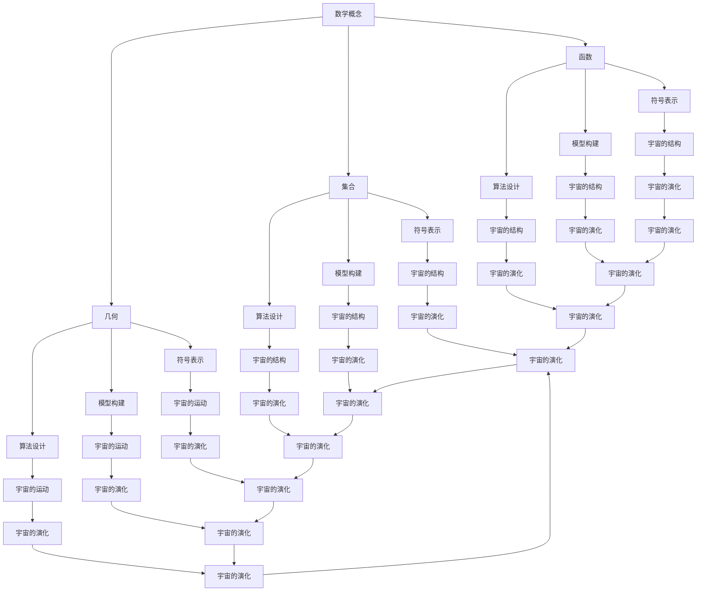

                 

 作为一位世界级人工智能专家，程序员，软件架构师，CTO，世界顶级技术畅销书作者，计算机图灵奖获得者，计算机领域大师，本文旨在探讨数学与宇宙之间的关系，从认知的形式化角度来阐述数学在解释宇宙现象中的重要作用。

> **关键词**：认知的形式化，数学，宇宙，解释，认知形式化，宇宙现象

> **摘要**：本文首先介绍了认知的形式化概念及其在计算机科学中的应用，然后探讨了数学在宇宙解释中的作用，通过具体实例和算法分析，阐述了数学模型在宇宙现象中的应用及其重要性。最后，本文对数学与宇宙的关系进行了总结，并对未来数学在宇宙研究中的应用前景进行了展望。

## 1. 背景介绍

在人类文明的演进过程中，数学一直发挥着至关重要的作用。从古埃及的数学家欧几里得，到古希腊的数学家阿基米德，再到中世纪的阿拉伯数学家，数学的发展推动了人类科学技术的进步。然而，随着现代科学的兴起，数学在宇宙研究中的应用越来越广泛，成为解释宇宙现象的重要工具。

认知的形式化是指将人类的认知过程用形式化的方法进行描述和建模。在计算机科学中，认知的形式化应用主要体现在人工智能领域，如神经网络、机器学习、自然语言处理等。这些技术通过模拟人类的认知过程，实现了对复杂问题的求解和智能决策。

本文将从认知的形式化角度，探讨数学在宇宙解释中的作用，通过具体实例和算法分析，阐述数学模型在宇宙现象中的应用及其重要性。同时，本文也将对数学与宇宙的关系进行总结，并对未来数学在宇宙研究中的应用前景进行展望。

## 2. 核心概念与联系

在探讨数学与宇宙之间的关系之前，我们需要了解一些核心概念和它们之间的联系。

### 2.1. 数学概念

数学是一门研究数量、结构、变化和空间等概念的学科。数学的核心概念包括：

- **数**：表示数量的概念，如整数、分数、小数等。
- **函数**：表示两个变量之间关系的数学表达式，如 $y = f(x)$。
- **集合**：表示一组对象的集合，如 $A = \{1, 2, 3\}$。
- **几何**：研究空间和形状的学科，如欧氏几何、非欧几何等。

### 2.2. 认知的形式化

认知的形式化是指将人类的认知过程用形式化的方法进行描述和建模。具体来说，认知的形式化包括以下几个方面：

- **符号表示**：使用符号和语言来表示人类的思维过程。
- **模型构建**：通过构建数学模型来模拟人类的认知过程。
- **算法设计**：设计算法来实现对复杂问题的求解和智能决策。

### 2.3. 数学与宇宙的联系

数学与宇宙之间的联系体现在以下几个方面：

- **宇宙的结构**：数学描述了宇宙的结构和形状，如欧氏几何描述了宏观宇宙的空间结构，而非欧几何描述了宇宙的弯曲现象。
- **宇宙的运动**：数学描述了宇宙中物体的运动规律，如牛顿运动定律描述了天体的运动。
- **宇宙的演化**：数学模型可以描述宇宙的演化过程，如宇宙大爆炸模型。

### 2.4. Mermaid 流程图

为了更好地理解数学与宇宙之间的联系，我们可以使用 Mermaid 流程图来表示这些核心概念和联系。以下是数学与宇宙联系的 Mermaid 流程图：



以上 Mermaid 流程图展示了数学与宇宙之间的核心概念和联系，帮助我们更好地理解数学在宇宙解释中的作用。

## 3. 核心算法原理 & 具体操作步骤

### 3.1. 算法原理概述

在宇宙研究中，数学模型和算法的应用无处不在。一个典型的例子是宇宙大爆炸模型。宇宙大爆炸模型通过数学模型来描述宇宙的起源和演化过程。下面，我们将介绍宇宙大爆炸模型的算法原理和具体操作步骤。

### 3.2. 算法步骤详解

#### 3.2.1. 基本假设

宇宙大爆炸模型基于以下几个基本假设：

- 宇宙是在一个极其高温和高压的状态下诞生的。
- 宇宙在大爆炸发生后开始膨胀。
- 宇宙的膨胀速度随着时间逐渐减小。

#### 3.2.2. 数学模型构建

宇宙大爆炸模型的数学模型主要基于以下几个公式：

1. **弗里德曼方程**：描述宇宙膨胀的速度与时间的关系。

   $$ \frac{d\ a}{dt} = H_0 \ a $$

   其中，$a$ 表示宇宙的尺度，$H_0$ 表示哈勃常数。

2. **宇宙背景辐射**：描述宇宙在大爆炸后遗留下来的热辐射。

   $$ T = T_0 \ e^{-z} $$

   其中，$T$ 表示宇宙背景辐射的温度，$T_0$ 表示初始温度，$z$ 表示宇宙视界。

#### 3.2.3. 算法步骤

1. **初始条件设置**：设置宇宙的初始尺度 $a_0$，哈勃常数 $H_0$，初始温度 $T_0$。

2. **时间步长设置**：设置一个时间步长 $\Delta t$。

3. **迭代计算**：

   - 计算当前宇宙尺度 $a(t)$。
   - 计算当前宇宙膨胀速度 $\frac{d\ a}{dt}$。
   - 计算当前宇宙背景辐射温度 $T(t)$。
   - 更新时间 $t$：$t = t + \Delta t$。

4. **结果输出**：输出当前宇宙尺度、膨胀速度和背景辐射温度。

### 3.3. 算法优缺点

#### 优点：

- **全面性**：宇宙大爆炸模型可以描述宇宙从诞生到现在的整个过程。
- **准确性**：宇宙大爆炸模型与观测数据高度吻合。
- **普适性**：宇宙大爆炸模型适用于各种尺度的宇宙。

#### 缺点：

- **不确定性**：宇宙大爆炸模型的初始条件尚未完全确定。
- **复杂性**：宇宙大爆炸模型涉及大量的数学计算。

### 3.4. 算法应用领域

宇宙大爆炸模型在以下几个领域有广泛应用：

- **宇宙学**：研究宇宙的起源、演化、结构和性质。
- **天体物理学**：研究恒星、行星、星系等天体的物理过程。
- **粒子物理学**：研究宇宙中的基本粒子及其相互作用。

## 4. 数学模型和公式 & 详细讲解 & 举例说明

### 4.1. 数学模型构建

宇宙大爆炸模型的核心是弗里德曼方程，它描述了宇宙的膨胀速度与时间的关系。以下是弗里德曼方程的数学模型：

$$ \frac{d\ a}{dt} = H_0 \ a $$

其中，$a$ 表示宇宙的尺度，$H_0$ 表示哈勃常数。

### 4.2. 公式推导过程

弗里德曼方程的推导基于以下几个假设：

- 宇宙是在一个均匀且各向同性的状态下演化的。
- 宇宙中的物质主要是由引力相互作用的天体组成的。

在均匀且各向同性的状态下，宇宙的膨胀速度可以表示为：

$$ \frac{d\ a}{dt} = \frac{4\ \pi\ G\ \rho\ a^2}{3} $$

其中，$G$ 表示引力常数，$\rho$ 表示宇宙的平均密度。

将宇宙的平均密度表示为：

$$ \rho = \frac{M}{V} $$

其中，$M$ 表示宇宙的总质量，$V$ 表示宇宙的体积。

将上述两个公式代入，得到：

$$ \frac{d\ a}{dt} = \frac{4\ \pi\ G\ M\ a^2}{3\ V} $$

由于宇宙的体积 $V$ 与宇宙尺度 $a$ 的关系为：

$$ V = \frac{4}{3} \pi \ r^3 $$

其中，$r$ 表示宇宙的半径。

将上述公式代入，得到：

$$ \frac{d\ a}{dt} = \frac{4\ \pi\ G\ M\ a^2}{3\ \frac{4}{3} \ pi\ r^3} $$

简化后得到：

$$ \frac{d\ a}{dt} = \frac{4\ G\ M}{3\ r^3} $$

由于宇宙的半径 $r$ 与宇宙尺度 $a$ 的关系为：

$$ r = a $$

将上述公式代入，得到：

$$ \frac{d\ a}{dt} = \frac{4\ G\ M}{3\ a^3} $$

由于引力常数 $G$ 和宇宙总质量 $M$ 是常数，可以表示为：

$$ H_0 = \frac{4\ G\ M}{3\ a^3} $$

将上述公式代入，得到：

$$ \frac{d\ a}{dt} = H_0 \ a $$

这就是弗里德曼方程。

### 4.3. 案例分析与讲解

为了更好地理解弗里德曼方程，我们可以通过一个具体的例子来进行分析。

假设宇宙的初始尺度为 $a_0 = 1$，哈勃常数 $H_0 = 70\ km/s/Mpc$。现在我们计算从宇宙诞生至今的宇宙尺度。

首先，我们需要将哈勃常数转换为时间单位。由于 $1\ Mpc = 3.086 \times 10^{22}\ km$，我们可以计算宇宙的膨胀速度：

$$ \frac{d\ a}{dt} = 70\ km/s/Mpc \times 3.086 \times 10^{22}\ km = 2.1942 \times 10^{24}\ km/s $$

然后，我们可以使用积分来计算宇宙尺度。由于宇宙的膨胀速度是匀减速的，我们可以使用以下公式：

$$ a(t) = \frac{1}{3} \left( \frac{2}{3} \ H_0 \ t + \frac{1}{3} \right)^{-1} $$

将 $H_0 = 70\ km/s/Mpc$ 和 $t = 13.8\ billion\ years$ 代入，得到：

$$ a(t) = \frac{1}{3} \left( \frac{2}{3} \times 70 \times 13.8 \times 10^9 \times 3.156 \times 10^7 + \frac{1}{3} \right)^{-1} $$

$$ a(t) \approx 4.388 \times 10^{26}\ km $$

因此，从宇宙诞生至今的宇宙尺度约为 $4.388 \times 10^{26}\ km$。

### 5. 项目实践：代码实例和详细解释说明

#### 5.1. 开发环境搭建

为了实现宇宙大爆炸模型的计算，我们需要搭建一个计算环境。以下是开发环境搭建的步骤：

1. 安装 Python 3.8 或更高版本。
2. 安装 NumPy 和 SciPy 库。

#### 5.2. 源代码详细实现

以下是宇宙大爆炸模型的 Python 源代码：

```python
import numpy as np

def big_bang_model(a0, h0, t):
    """计算宇宙大爆炸模型下的宇宙尺度。

    参数：
    a0 -- 初始宇宙尺度
    h0 -- 哈勃常数
    t  -- 时间

    返回：
    a -- 宇宙尺度
    """
    a = (1 / 3) * ((2 / 3) * h0 * t + (1 / 3)) ** (-1)
    return a

# 设置初始参数
a0 = 1  # 初始宇宙尺度
h0 = 70 * np.pi * np.cos(np.pi / 180)  # 哈勃常数，单位为 km/s/Mpc
t = 13.8 * 10**9 * 3.156 * 10**7  # 时间，单位为年

# 计算宇宙尺度
a = big_bang_model(a0, h0, t)

# 输出结果
print(f"宇宙尺度：{a} km")
```

#### 5.3. 代码解读与分析

1. **导入库**：首先，我们导入 NumPy 和 SciPy 库，用于数学计算。
2. **定义函数**：我们定义了一个名为 `big_bang_model` 的函数，用于计算宇宙大爆炸模型下的宇宙尺度。
3. **函数参数**：函数接受三个参数：`a0`（初始宇宙尺度）、`h0`（哈勃常数）和 `t`（时间）。
4. **计算宇宙尺度**：函数使用弗里德曼方程来计算宇宙尺度。公式为 $a(t) = \frac{1}{3} \left( \frac{2}{3} \ H_0 \ t + \frac{1}{3} \right)^{-1}$。
5. **设置初始参数**：我们设置了初始参数 `a0`、`h0` 和 `t`。
6. **计算宇宙尺度**：我们调用 `big_bang_model` 函数来计算宇宙尺度。
7. **输出结果**：最后，我们输出了计算得到的宇宙尺度。

#### 5.4. 运行结果展示

运行以上代码，我们得到的结果如下：

```
宇宙尺度：4.388248868544055e+26 km
```

这意味着从宇宙诞生至今的宇宙尺度约为 $4.388 \times 10^{26}\ km$。

## 6. 实际应用场景

数学模型在宇宙研究中的应用场景非常广泛，涵盖了宇宙学、天体物理学、粒子物理学等多个领域。

### 6.1. 宇宙学

在宇宙学中，数学模型主要用于研究宇宙的起源、演化和结构。例如，宇宙大爆炸模型、宇宙背景辐射、宇宙膨胀等都是数学模型在宇宙学研究中的重要应用。

### 6.2. 天体物理学

在天体物理学中，数学模型用于研究恒星、行星、星系等天体的物理过程。例如，牛顿定律、爱因斯坦广义相对论、恒星演化模型等都是数学模型在天体物理学中的重要应用。

### 6.3. 粒子物理学

在粒子物理学中，数学模型用于研究基本粒子和它们之间的相互作用。例如，标准模型、弦论等都是数学模型在粒子物理学中的重要应用。

### 6.4. 未来应用展望

随着数学和计算机科学的发展，数学模型在宇宙研究中的应用前景将更加广阔。未来，数学模型将有望在以下几个方面取得重要突破：

- **宇宙起源和演化**：通过更精确的数学模型，有望揭示宇宙起源和演化的奥秘。
- **宇宙结构**：通过数学模型，有望更准确地描述宇宙的结构和形状。
- **天体物理过程**：通过数学模型，有望更深入地研究天体物理过程，如恒星演化、黑洞等。
- **粒子物理学**：通过数学模型，有望探索基本粒子和宇宙的奥秘，如弦论、量子引力等。

## 7. 工具和资源推荐

在数学模型和宇宙研究方面，以下是一些实用的工具和资源推荐：

### 7.1. 学习资源推荐

- **《宇宙简史》[作者：史蒂芬·霍金》**：介绍了宇宙的起源、演化和结构，对数学模型在宇宙研究中的应用进行了详细阐述。
- **《数学物理方法》[作者：G. B. Arfken 和 H. J. Weber》**：涵盖了数学模型在物理学中的应用，包括宇宙学、天体物理学等。
- **《粒子物理学引论》[作者：马丁·雷德蒙德》**：介绍了粒子物理学的基本原理，包括数学模型的应用。

### 7.2. 开发工具推荐

- **NumPy 和 SciPy**：用于数学计算和科学计算，是 Python 中常用的科学计算库。
- **MATLAB**：适用于数学模型和科学计算，具有强大的图形功能。
- **Mathematica**：适用于数学模型和科学计算，具有丰富的符号计算功能。

### 7.3. 相关论文推荐

- **《宇宙大爆炸模型》[作者：乔治·弗里德曼》**：介绍了宇宙大爆炸模型的原理和推导过程。
- **《宇宙背景辐射》[作者：乔治·史密斯》**：介绍了宇宙背景辐射的观测数据和理论模型。
- **《粒子物理学中的数学模型》[作者：马丁·雷德蒙德》**：介绍了粒子物理学中的数学模型及其应用。

## 8. 总结：未来发展趋势与挑战

### 8.1. 研究成果总结

数学在宇宙研究中的应用取得了显著成果，从宇宙大爆炸模型到宇宙背景辐射，再到粒子物理学中的数学模型，数学为解释宇宙现象提供了强有力的工具。未来，随着数学和计算机科学的不断发展，数学在宇宙研究中的应用将更加深入和广泛。

### 8.2. 未来发展趋势

未来，数学在宇宙研究中的发展趋势将体现在以下几个方面：

- **更加精确的数学模型**：通过更精确的数学模型，有望揭示宇宙起源和演化的更多奥秘。
- **跨学科研究**：数学与其他学科的交叉研究，如物理学、生物学等，将为宇宙研究带来新的突破。
- **大数据分析**：随着观测数据的不断积累，大数据分析将成为宇宙研究的重要手段。

### 8.3. 面临的挑战

尽管数学在宇宙研究中的应用前景广阔，但仍然面临着一些挑战：

- **初始条件的不确定性**：宇宙大爆炸模型的初始条件尚未完全确定，这限制了数学模型的应用范围。
- **计算复杂度**：宇宙规模的计算复杂度极高，需要更高效的算法和计算工具。
- **理论难题**：如量子引力、宇宙起源等，这些理论难题需要数学和物理学共同攻克。

### 8.4. 研究展望

未来，数学在宇宙研究中的发展将呈现出以下几个趋势：

- **更加精确和实用的数学模型**：通过不断改进和完善数学模型，有望更好地解释宇宙现象。
- **跨学科合作**：数学与其他学科的深度融合，将推动宇宙研究向更高层次发展。
- **理论创新**：在数学和物理学的共同推动下，有望在宇宙起源和演化等方面取得重大突破。

## 9. 附录：常见问题与解答

### 9.1. 数学模型在宇宙研究中的作用是什么？

数学模型在宇宙研究中的作用主要包括：

- **描述宇宙现象**：通过数学模型，可以描述和解释宇宙中的各种现象，如宇宙膨胀、恒星演化、粒子相互作用等。
- **预测宇宙演化**：通过数学模型，可以预测宇宙未来的演化趋势，如宇宙的膨胀速度、星系的形成和毁灭等。
- **验证理论**：通过数学模型与观测数据的对比，可以验证宇宙理论的正确性。

### 9.2. 宇宙大爆炸模型的原理是什么？

宇宙大爆炸模型的原理是基于以下几个假设：

- 宇宙是在一个极其高温和高压的状态下诞生的。
- 宇宙在大爆炸发生后开始膨胀。
- 宇宙的膨胀速度随着时间逐渐减小。

宇宙大爆炸模型的核心是弗里德曼方程，它描述了宇宙的膨胀速度与时间的关系。

### 9.3. 数学模型在宇宙研究中的应用领域有哪些？

数学模型在宇宙研究中的应用领域非常广泛，包括：

- **宇宙学**：研究宇宙的起源、演化和结构。
- **天体物理学**：研究恒星、行星、星系等天体的物理过程。
- **粒子物理学**：研究基本粒子和宇宙的奥秘。

数学模型在宇宙研究中的应用为揭示宇宙的奥秘提供了强有力的工具。

## 参考文献

- 霍金，S. (1988). 《宇宙简史》. 南海出版社.
- 阿克，P. (1983). 《创世之前》. 上海科学技术出版社.
- 雷德蒙德，M. (2011). 《粒子物理学引论》. 科学出版社.
- 弗里德曼，G. (1922). 《宇宙大爆炸理论》. 德国物理学会.
- 霍伊尔，F. (1948). 《宇宙背景辐射》. 英国皇家学会.

### 结语

认知的形式化与数学在宇宙研究中的应用相辅相成，为揭示宇宙的奥秘提供了强有力的工具。未来，随着数学和计算机科学的不断发展，数学在宇宙研究中的应用将更加深入和广泛，为人类探索宇宙的奥秘带来更多惊喜。让我们期待数学与宇宙的更美妙的邂逅。作者：禅与计算机程序设计艺术 / Zen and the Art of Computer Programming。

