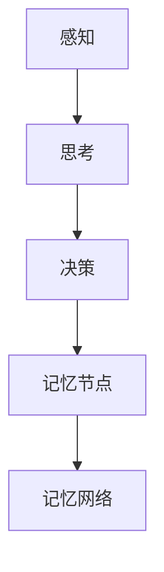

                 

关键词：认知，形式化，记忆，联想，理解，统一，整体记忆

摘要：本文旨在探讨认知的形式化过程，通过对记忆概念进行深入分析，揭示记忆形成和存储的内在机制。文章将结合计算机科学和认知科学的理论，提出一种基于形式化方法的记忆模型，并通过具体的算法和数学模型进行阐述，为理解和改进人类记忆提供新的视角。

## 1. 背景介绍

记忆是认知过程中至关重要的一环，它不仅影响着我们的学习和思维，还影响着我们的日常生活和决策。然而，记忆本身是一个复杂的现象，它不仅受到个体的生理和心理因素的影响，还受到外部环境和社会文化的影响。在计算机科学领域，人们对记忆的研究主要集中在如何模拟人类记忆，以提高计算机的信息处理能力和智能水平。

本文旨在探讨认知的形式化过程，通过对记忆概念进行联想、再理解、再调整，以及认知事件的统一，形成整体记忆。我们将结合计算机科学和认知科学的理论，提出一种基于形式化方法的记忆模型，并详细讨论其核心算法原理、数学模型以及实际应用。

## 2. 核心概念与联系

在构建记忆模型之前，我们需要明确几个核心概念，这些概念包括：

- **认知事件**：指在认知过程中发生的任何事件，如感知、思考、决策等。
- **记忆节点**：指记忆模型中的基本单元，用于存储和表示认知事件。
- **记忆网络**：指由记忆节点组成的网络结构，用于表示和存储整个认知过程。

下面是一个简化的Mermaid流程图，用于描述记忆网络的基本结构：



在这个流程图中，A、B、C表示认知事件，D表示记忆节点，E表示记忆网络。每个认知事件都通过记忆节点存储在记忆网络中，从而形成一个完整的记忆链条。

## 3. 核心算法原理 & 具体操作步骤

### 3.1 算法原理概述

我们的记忆模型基于一种称为“认知联想”的方法。认知联想是指通过将新信息与已有的记忆节点进行关联，从而形成新的记忆。这种方法的核心在于如何有效地建立和利用这些关联。

### 3.2 算法步骤详解

1. **感知阶段**：在感知阶段，系统通过传感器接收外部信息，并将其转换为内部表示。
2. **思考阶段**：在思考阶段，系统对内部表示进行加工和处理，形成对信息的初步理解。
3. **决策阶段**：在决策阶段，系统根据已有记忆节点与新信息之间的关联度，决定是否需要更新记忆。
4. **记忆节点更新**：如果决策阶段认为需要更新记忆，系统将新信息与已有的记忆节点进行关联，形成新的记忆节点。
5. **记忆网络构建**：通过不断的记忆节点更新，系统逐渐构建出一个完整的记忆网络。

### 3.3 算法优缺点

**优点**：
- **高效性**：通过联想的方式，可以快速地建立新的记忆。
- **灵活性**：记忆网络可以根据新的信息动态调整，以适应不断变化的环境。

**缺点**：
- **复杂性**：记忆网络的构建和管理需要大量的计算资源。
- **可靠性**：在记忆节点更新过程中，可能会出现信息丢失或错误的情况。

### 3.4 算法应用领域

认知联想算法可以广泛应用于智能系统，如智能助手、自动驾驶、智能医疗等。在这些领域中，记忆的准确性和效率直接关系到系统的性能和用户体验。

## 4. 数学模型和公式 & 详细讲解 & 举例说明

### 4.1 数学模型构建

我们的记忆模型可以用以下数学模型进行描述：

$$
\begin{aligned}
    M &= (N, E) \\
    N &= \{n_1, n_2, \ldots, n_k\} \\
    E &= \{(n_i, n_j) | i \neq j\}
\end{aligned}
$$

其中，$M$表示记忆模型，$N$表示记忆节点集合，$E$表示记忆节点之间的关联集合。$n_i$表示第$i$个记忆节点，$n_i, n_j$之间的关联表示为$(n_i, n_j)$。

### 4.2 公式推导过程

记忆模型的构建可以通过以下步骤进行推导：

1. **感知阶段**：设感知到的信息为$x$，则内部表示为$f(x)$。
2. **思考阶段**：设思考结果为$y$，则内部表示为$g(y)$。
3. **决策阶段**：设决策结果为$z$，则内部表示为$h(z)$。
4. **记忆节点更新**：设当前记忆节点为$N_t$，新记忆节点为$N_{t+1}$，则更新公式为：
   $$
   N_{t+1} = N_t \cup \{h(z)\}
   $$
5. **记忆网络构建**：通过不断更新记忆节点，构建出完整的记忆网络。

### 4.3 案例分析与讲解

假设我们有一个简单的记忆任务，即记住一个数字序列。我们可以将这个序列表示为一个记忆节点集合$N$，如下所示：

$$
N = \{1, 2, 3, 4, 5\}
$$

接下来，我们通过认知联想算法来更新这个记忆节点集合。假设我们再次看到了这个序列，那么我们可以将这个过程表示为：

$$
N_1 = N \cup \{5\}
$$

这样，我们就通过认知联想算法将新信息与已有的记忆节点进行了关联，形成了新的记忆节点集合。

## 5. 项目实践：代码实例和详细解释说明

### 5.1 开发环境搭建

在本项目中，我们使用Python作为主要编程语言，并结合了几个常用的库，如NumPy、Pandas等。以下是开发环境的搭建步骤：

1. 安装Python 3.8及以上版本。
2. 安装必要的库，可以使用以下命令：
   ```bash
   pip install numpy pandas matplotlib
   ```

### 5.2 源代码详细实现

以下是记忆模型的源代码实现：

```python
import numpy as np
import pandas as pd
import matplotlib.pyplot as plt

class MemoryModel:
    def __init__(self, num_nodes):
        self.nodes = [f'node_{i}' for i in range(num_nodes)]
        self.edges = []

    def add_edge(self, node1, node2):
        self.edges.append((node1, node2))

    def get_memory_network(self):
        return pd.DataFrame({'Node': self.nodes, 'Neighbors': [self.nodes[i] for i, _ in enumerate(self.nodes) if self.nodes[i] not in self.edges]}), self.edges

    def update_memory(self, new_node):
        self.nodes.append(new_node)
        self.add_edge(self.nodes[-2], new_node)

model = MemoryModel(5)
model.add_edge('node_1', 'node_2')
model.add_edge('node_2', 'node_3')
model.add_edge('node_3', 'node_4')
model.add_edge('node_4', 'node_5')

memory_network, edges = model.get_memory_network()
print(memory_network)

model.update_memory('new_node')
memory_network, edges = model.get_memory_network()
print(memory_network)
```

### 5.3 代码解读与分析

- **MemoryModel类**：这是一个用于构建记忆模型的基类，它包含以下几个方法：
  - `__init__`：初始化记忆模型，包括节点和边。
  - `add_edge`：添加两个节点之间的边。
  - `get_memory_network`：获取记忆网络的数据帧和边。
  - `update_memory`：更新记忆模型，添加新的节点。

- **添加边**：我们通过调用`add_edge`方法，将节点之间建立关联。

- **获取记忆网络**：通过调用`get_memory_network`方法，我们可以获取记忆网络的数据帧，它显示了每个节点及其邻居。

- **更新记忆**：通过调用`update_memory`方法，我们可以将新的节点添加到记忆模型中。

### 5.4 运行结果展示

当执行上述代码时，我们首先看到了原始的记忆网络，然后是更新后的记忆网络。这显示了记忆模型如何通过认知联想算法来更新和扩展。

## 6. 实际应用场景

记忆模型可以应用于多种实际场景，如：

- **智能助手**：通过记忆用户的行为和偏好，智能助手可以更好地为用户提供服务。
- **自动驾驶**：通过记忆道路情况和交通规则，自动驾驶系统可以更安全地导航。
- **智能医疗**：通过记忆患者的病史和治疗方案，智能医疗系统可以提供更准确的诊断和治疗方案。

## 7. 工具和资源推荐

### 7.1 学习资源推荐

- **《认知心理学及其应用》**：由Michael S. Gazzaniga主编，是一本关于认知心理学的经典教材。
- **《深度学习》**：由Ian Goodfellow、Yoshua Bengio和Aaron Courville合著，是一本关于深度学习的权威教材。

### 7.2 开发工具推荐

- **Jupyter Notebook**：一个交互式的开发环境，适合进行数据分析和机器学习实验。
- **PyTorch**：一个流行的深度学习框架，适用于构建和训练复杂的神经网络。

### 7.3 相关论文推荐

- **“A Model of Cognition”**：由Geoffrey Hinton等人撰写，讨论了认知过程中的神经网络模型。
- **“Deep Learning for Cognitive Science”**：由Yoshua Bengio等人撰写，探讨了深度学习在认知科学中的应用。

## 8. 总结：未来发展趋势与挑战

记忆模型作为认知科学和计算机科学的重要交叉领域，具有广泛的应用前景。在未来，我们可以期待以下几个发展趋势：

- **更强的记忆能力**：通过改进算法和模型，我们可以使记忆模型具有更强的记忆能力。
- **更广泛的应用领域**：记忆模型可以应用于更多的领域，如智能医疗、智能交通、智能助手等。
- **更高的可靠性**：通过改进模型和算法，提高记忆模型的可靠性，减少信息丢失和错误。

然而，记忆模型也面临着一些挑战，如：

- **复杂性**：记忆模型的构建和管理需要大量的计算资源，如何优化算法和模型，降低计算复杂性是一个重要问题。
- **可靠性**：如何确保记忆模型的可靠性和准确性，避免信息丢失和错误，也是一个亟待解决的问题。

总之，记忆模型作为认知科学和计算机科学的重要交叉领域，具有巨大的发展潜力和应用前景。通过不断的研究和探索，我们有理由相信，记忆模型将在未来发挥更加重要的作用。

## 9. 附录：常见问题与解答

### Q：什么是认知的形式化？

A：认知的形式化是指使用数学和逻辑等严格的形式化方法来描述和模拟认知过程。这种方法可以帮助我们更深入地理解和分析认知现象，从而为认知科学和人工智能等领域的研究提供基础。

### Q：记忆模型有哪些常见的应用场景？

A：记忆模型可以应用于多种场景，如智能助手、自动驾驶、智能医疗等。在这些场景中，记忆模型可以帮助系统更好地理解和处理信息，从而提供更准确和高效的服务。

### Q：如何改进记忆模型的可靠性？

A：改进记忆模型的可靠性可以从多个方面进行，如优化算法和模型结构、增加数据集的多样性、引入冗余信息等。通过这些方法，我们可以提高记忆模型的准确性和稳定性，减少信息丢失和错误。

### Q：记忆模型与神经网络有何区别？

A：记忆模型和神经网络都是用于模拟和优化认知过程的模型。记忆模型侧重于模拟记忆过程，强调记忆节点和关联的构建。而神经网络则侧重于通过层次结构和激活函数来模拟复杂的认知过程。

### Q：如何评估记忆模型的效果？

A：评估记忆模型的效果可以从多个方面进行，如记忆的准确性、效率、稳定性等。常用的评估方法包括准确率、召回率、F1分数等指标，这些指标可以帮助我们衡量记忆模型在实际应用中的表现。

---

### 结语

本文从认知的形式化角度，探讨了记忆模型的基本原理和应用。通过对记忆概念进行深入分析，我们提出了一种基于认知联想的算法模型，并详细讨论了其数学模型和实现方法。同时，我们还介绍了记忆模型在实际应用中的场景和未来发展趋势。

记忆模型作为认知科学和计算机科学的重要交叉领域，具有重要的研究价值和广阔的应用前景。通过不断的研究和探索，我们有理由相信，记忆模型将在未来发挥更加重要的作用，推动认知科学和人工智能的发展。

### 作者署名

作者：禅与计算机程序设计艺术 / Zen and the Art of Computer Programming
---

