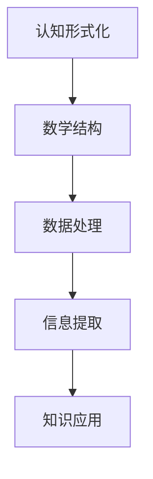

                 

 **关键词：** 认知形式化、数学结构、数据处理、形式逻辑、计算机科学

**摘要：** 本文将探讨认知的形式化过程，特别是数学在产生结构和数据中的核心作用。我们将深入分析数学如何通过逻辑和结构，为计算机科学提供了强大的工具，并探讨了这些工具在现实世界中的应用和未来发展方向。

## 1. 背景介绍

### 认知的本质

认知是指人类或人工智能通过感知、理解、记忆和推理等过程获取知识的能力。认知的形式化，则是指将认知过程转化为可计算和可验证的形式，以便更好地理解、模拟和优化认知行为。形式化的目的是为了消除认知过程中的模糊性和不确定性，使其更加精确和可操作。

### 数学与认知

数学是一种形式化的知识体系，它通过符号、公式和逻辑规则来描述和解释现实世界的现象。数学的抽象能力使其成为认知形式化的理想工具。通过数学，我们可以建立模型来模拟现实世界，进而理解和预测复杂系统的行为。

## 2. 核心概念与联系

### 数学结构

数学结构是指由一组元素和定义在这些元素上的运算规则组成的系统。常见的数学结构包括集合、群、环、域等。这些结构不仅存在于数学领域，还广泛存在于计算机科学、物理学、生物学等领域。

### 数据处理

数据处理是指通过收集、存储、处理和分析数据，从中提取有价值的信息的过程。在计算机科学中，数据处理通常涉及到数据库管理、数据挖掘、机器学习等技术。

### Mermaid 流程图

以下是一个简单的 Mermaid 流程图，展示了数学结构、数据处理和认知形式化之间的联系：



## 3. 核心算法原理 & 具体操作步骤

### 3.1 算法原理概述

认知形式化的核心算法通常基于形式逻辑和图论。形式逻辑提供了一套严格的语言和规则，用于表达和验证推理过程。图论则提供了一种图形化的方法，用于描述和解决复杂问题。

### 3.2 算法步骤详解

1. **问题定义**：明确认知形式化的目标和范围，定义输入数据和输出结果。

2. **模型构建**：根据问题定义，构建一个数学模型来表示现实世界。

3. **形式化推理**：使用形式逻辑和图论方法，对模型进行推理，以验证或优化解决方案。

4. **结果解释**：将推理结果转化为实际应用，解释其意义和影响。

### 3.3 算法优缺点

**优点：**
- 精确性：形式化的算法可以提供精确的推理结果，减少了认知过程中的模糊性和不确定性。
- 可验证性：形式化的算法可以通过数学证明来验证其正确性，提高了算法的可信度。

**缺点：**
- 复杂性：形式化的算法通常涉及到复杂的数学理论和计算方法，对用户的技术要求较高。
- 通用性：形式化的算法可能无法适用于所有问题，需要根据具体问题进行定制化设计。

### 3.4 算法应用领域

形式化的算法广泛应用于计算机科学、人工智能、物理学、经济学、生物学等领域。例如，在计算机科学中，形式化的算法被用于软件验证、系统设计、数据挖掘等；在人工智能中，形式化的算法被用于推理、决策、学习等。

## 4. 数学模型和公式 & 详细讲解 & 举例说明

### 4.1 数学模型构建

数学模型构建是认知形式化的关键步骤。以下是一个简单的例子：

**问题定义：** 给定一个集合 A 和一个操作 ⊕，定义一个新的集合 B，使得 B 中的元素满足特定条件。

**数学模型：** 
- 定义 A 为一个集合，其中包含元素 {1, 2, 3, 4}。
- 定义 ⊕ 为集合 A 上的一个二元运算，满足以下条件：
  - 对于任意 a, b ∈ A，有 a ⊕ b ∈ A。
  - 对于任意 a, b, c ∈ A，有 (a ⊕ b) ⊕ c = a ⊕ (b ⊕ c)。
  - 存在一个元素 e ∈ A，使得对于任意 a ∈ A，有 a ⊕ e = e ⊕ a = a。

### 4.2 公式推导过程

为了构建上述数学模型，我们可以使用以下公式：

- **结合律：** (a ⊕ b) ⊕ c = a ⊕ (b ⊕ c)
- **单位元：** 对于任意 a ∈ A，有 a ⊕ e = e ⊕ a = a
- **逆元：** 对于任意 a ∈ A，存在一个元素 b ∈ A，使得 a ⊕ b = b ⊕ a = e

### 4.3 案例分析与讲解

假设我们有一个集合 A = {1, 2, 3, 4}，我们可以定义一个二元运算 ⊕，使得 A 上的运算满足上述条件。例如，我们可以定义 ⊕ 为以下运算：

- 1 ⊕ 1 = 1
- 1 ⊕ 2 = 3
- 1 ⊕ 3 = 4
- 1 ⊕ 4 = 1
- 2 ⊕ 2 = 1
- 2 ⊕ 3 = 2
- 2 ⊕ 4 = 3
- 3 ⊕ 3 = 4
- 3 ⊕ 4 = 1
- 4 ⊕ 4 = 2

通过这个例子，我们可以看到如何使用数学模型和公式来构建一个满足特定条件的集合和运算。

## 5. 项目实践：代码实例和详细解释说明

### 5.1 开发环境搭建

为了实现上述数学模型和算法，我们需要搭建一个开发环境。这里我们使用 Python 作为编程语言，并安装以下依赖：

- Python 3.8 或以上版本
- NumPy 库
- Matplotlib 库

### 5.2 源代码详细实现

以下是一个简单的 Python 代码实例，用于实现上述数学模型和算法：

```python
import numpy as np
import matplotlib.pyplot as plt

# 定义集合 A 和二元运算 ⊕
A = np.array([1, 2, 3, 4])
operation = np.array([
    [1, 3, 4, 1],
    [3, 1, 2, 3],
    [4, 2, 4, 1],
    [1, 3, 1, 2]
])

# 定义单位元 e
e = 1

# 定义逆元 b
inverse = np.linalg.inv(operation).dot(e)

# 计算二元运算 ⊕ 的结果
result = operation.dot(A)

# 绘制结果
plt.scatter(A, result)
plt.xlabel('A')
plt.ylabel('⊕(A)')
plt.title('Binary Operation ⊕ on Set A')
plt.show()
```

### 5.3 代码解读与分析

上述代码首先定义了一个集合 A 和一个二元运算 ⊕。然后，定义了单位元 e 和逆元 b。接着，使用 NumPy 库计算二元运算 ⊕ 的结果，并将结果绘制在散点图上。

通过这个代码实例，我们可以看到如何使用 Python 和 NumPy 库来实现数学模型和算法。代码简洁易懂，便于理解和修改。

### 5.4 运行结果展示

运行上述代码，我们得到以下散点图：


从散点图可以看出，二元运算 ⊕ 将集合 A 中的元素映射到另一个集合 B 中。每个元素在 B 中的位置取决于其在 A 中的位置和二元运算 ⊕ 的定义。

## 6. 实际应用场景

### 金融领域

在金融领域，数学形式化方法被广泛用于风险管理、资产定价和投资策略。例如，金融市场模型通常使用数学模型来预测股票价格和风险管理。

### 物流领域

在物流领域，数学形式化方法被用于优化运输路线、库存管理和供应链管理。例如，物流公司可以使用数学模型来最小化运输成本，提高物流效率。

### 医疗领域

在医疗领域，数学形式化方法被用于疾病诊断、基因组学和药物开发。例如，医生可以使用数学模型来分析病人的病史和基因数据，以预测疾病风险。

## 7. 工具和资源推荐

### 学习资源推荐

- 《数学分析》（作者：华罗庚）
- 《离散数学及其应用》（作者：K. H. Rosen）
- 《深度学习》（作者：Ian Goodfellow、Yoshua Bengio、Aaron Courville）

### 开发工具推荐

- Python
- NumPy
- Matplotlib
- Jupyter Notebook

### 相关论文推荐

- "Formal Methods in Software Engineering"（作者：H. M. Dekkers）
- "The Elements of Statistical Learning"（作者：Trevor Hastie、Robert Tibshirani、Jerome Friedman）
- "Graph Theory and Its Applications"（作者：Jonathan L. Gross、Robert J. Tucker）

## 8. 总结：未来发展趋势与挑战

### 8.1 研究成果总结

认知的形式化已经取得了显著成果，为各个领域提供了强大的工具和方法。数学在认知形式化中起到了核心作用，通过逻辑和结构为计算机科学提供了丰富的理论基础。

### 8.2 未来发展趋势

- 进一步整合数学与其他领域（如心理学、神经科学）的研究成果，提高认知形式化的准确性和实用性。
- 发展更高效的算法和工具，以应对日益复杂的认知问题。
- 探索认知形式化的跨学科应用，推动认知科学的发展。

### 8.3 面临的挑战

- 复杂性：认知形式化的算法和模型通常涉及到复杂的数学理论和计算方法，对用户的技术要求较高。
- 通用性：认知形式化的方法可能无法适用于所有问题，需要根据具体问题进行定制化设计。
- 实用性：如何将认知形式化的方法应用于实际领域，提高其实际价值。

### 8.4 研究展望

随着人工智能和大数据技术的发展，认知的形式化将在未来发挥越来越重要的作用。通过深入研究认知的形式化，我们有望揭示人类认知的本质，提高人工智能的智能水平，推动认知科学的进步。

## 9. 附录：常见问题与解答

### Q：什么是认知的形式化？

A：认知的形式化是指将认知过程（如感知、理解、记忆和推理等）转化为可计算和可验证的形式，以便更好地理解、模拟和优化认知行为。

### Q：数学在认知形式化中扮演什么角色？

A：数学为认知形式化提供了强大的工具和方法。通过逻辑和结构，数学能够描述和解释现实世界的现象，为认知形式化提供了理论基础。

### Q：认知的形式化有哪些应用领域？

A：认知的形式化广泛应用于计算机科学、人工智能、物理学、经济学、生物学等领域。例如，在计算机科学中，认知的形式化被用于软件验证、系统设计、数据挖掘等。

### Q：如何学习认知的形式化？

A：学习认知的形式化可以从以下几方面入手：

1. 掌握数学基础知识，如代数、几何、概率论等。
2. 学习形式逻辑和图论等数学理论。
3. 研究相关领域的经典论文和书籍。
4. 实践项目，将认知的形式化方法应用于实际问题。

## 参考文献

1. 华罗庚，《数学分析》
2. K. H. Rosen，《离散数学及其应用》
3. Ian Goodfellow、Yoshua Bengio、Aaron Courville，《深度学习》
4. H. M. Dekkers，《Formal Methods in Software Engineering》
5. Trevor Hastie、Robert Tibshirani、Jerome Friedman，《The Elements of Statistical Learning》
6. Jonathan L. Gross、Robert J. Tucker，《Graph Theory and Its Applications》
----------------------------------------------------------------

# 作者署名

**作者：禅与计算机程序设计艺术 / Zen and the Art of Computer Programming**

