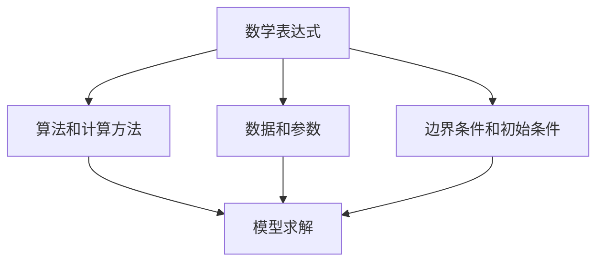

                 

 **关键词：**
- 认知形式化
- 数学原理
- 科学方法
- 技术创新

**摘要：**
本文探讨了认知形式化在科学研究中的核心地位，强调数学作为科学之皇后的重要性。通过阐述数学的抽象能力和逻辑严谨性，本文揭示了数学模型在理解复杂现象和推动科技进步中的关键作用。文章从数学模型的核心概念出发，详细介绍了数学模型的构建、推导和应用，并通过具体案例和项目实践，展示了数学在实际开发中的运用。此外，本文还展望了数学形式化认知的未来发展趋势，并提出了相应的挑战和研究方向。

## 1. 背景介绍

认知形式化是现代科学研究和工程实践中的一项基本方法论。它通过将人类思维过程形式化，转化为数学模型和算法，使得复杂问题得以量化、分析和解决。形式化认知不仅提升了科学研究中的逻辑严密性和精确性，还极大地促进了计算机科学、人工智能等领域的发展。

数学作为科学之皇后，其地位不可撼动。数学的抽象能力使得它能够捕捉自然界和社会现象中的基本规律，提供了一种通用的描述工具。数学的严谨性则保证了科学研究的可靠性和可重复性，为科技进步提供了坚实的基础。

本文旨在深入探讨认知形式化中的数学原理，分析数学模型在科学研究和技术创新中的应用，并展望其未来的发展方向。通过本文的阐述，希望读者能够更好地理解数学在认知形式化中的关键作用，以及如何将数学原理应用于实际问题的解决中。

## 2. 核心概念与联系

### 2.1. 数学模型的概念

数学模型是现实世界的一种抽象，它通过数学语言和符号系统来描述现实中的现象、过程或系统。数学模型不仅包括数学公式，还包括相关的算法和计算方法。其核心目的是将复杂问题转化为可处理的数学问题，从而进行定量分析和求解。

### 2.2. 数学模型的构建

构建数学模型通常包括以下几个步骤：

1. **定义变量和参数**：根据问题的性质和需求，确定需要研究的变量和参数，并对其进行合理的定义和量化。
2. **建立方程或公式**：使用数学符号和公式，将变量和参数之间的关系表达出来。
3. **边界条件和初始条件**：为了使模型更加精确，需要设定问题的边界条件和初始条件。
4. **验证和调整**：通过实际数据或仿真实验，对模型进行验证和调整，确保模型的准确性和可靠性。

### 2.3. 数学模型的应用领域

数学模型广泛应用于自然科学、工程技术、经济学、社会学等多个领域。例如：

- **自然科学**：物理学的经典模型，如牛顿力学、麦克斯韦方程等，为研究物质和能量提供了理论基础。
- **工程技术**：电子工程中的电路分析模型、控制工程中的状态空间模型等，为工程设计提供了重要的参考。
- **经济学**：宏观经济模型、市场模型等，用于预测经济行为和趋势，指导经济政策制定。
- **社会学**：社会网络模型、群体行为模型等，用于分析社会现象，提供决策支持。

### 2.4. 数学模型与认知形式化的联系

数学模型是认知形式化的重要工具。通过数学模型，研究者可以将抽象的、复杂的认知过程形式化，转化为具体的数学问题。这使得科学研究更加精确、系统、可重复。同时，数学模型也为计算机科学和人工智能的发展提供了强大的支持，使得复杂问题求解和自动化决策成为可能。

### 2.5. 数学模型的结构

为了更好地理解和应用数学模型，我们可以从以下几个维度来分析其结构：

1. **数学表达式**：这是数学模型的核心，通常包括方程、函数、不等式等形式。
2. **算法和计算方法**：数学模型通常需要通过特定的算法和计算方法进行求解，例如数值方法、优化算法等。
3. **数据和参数**：数学模型需要基于实际数据或参数进行构建和调整，数据的真实性和可靠性直接影响到模型的准确性。
4. **边界条件和初始条件**：这些条件是模型运行的基础，对模型的结果有重要影响。

下面是数学模型结构的 Mermaid 流程图：



## 3. 核心算法原理 & 具体操作步骤

### 3.1 算法原理概述

在本节中，我们将介绍一种用于复杂系统分析的核心算法——图论算法。图论算法广泛应用于网络设计、社会网络分析、数据结构优化等领域，其基本原理是通过图的结构和性质来分析问题。

### 3.2 算法步骤详解

#### 3.2.1 图的基本概念

首先，我们需要了解图的基本概念，包括节点（Vertex）、边（Edge）、路径（Path）和连通性（Connectivity）等。

1. **节点和边**：节点表示图中的个体，边表示节点之间的关系。
2. **路径**：路径是图中节点和边的序列，满足边的起点是序列中的前一节点，终点是序列中的后一节点。
3. **连通性**：如果图中任意两个节点之间存在路径，则称该图为连通图。

#### 3.2.2 图的表示方法

图的表示方法主要有邻接矩阵和邻接表两种。

1. **邻接矩阵**：用二维矩阵表示图，矩阵中的元素表示节点之间的边。
2. **邻接表**：用链表表示图，每个节点对应一个链表，链表中的节点表示与该节点相连的其他节点。

#### 3.2.3 图的基本算法

以下是几种常用的图论算法：

1. **深度优先搜索（DFS）**：从某个节点开始，沿着路径探索，直到无法继续为止，然后回溯。
2. **广度优先搜索（BFS）**：从某个节点开始，探索所有相邻节点，然后依次探索下一层的节点。
3. **最短路径算法（Dijkstra算法）**：寻找图中两点之间的最短路径。
4. **最小生成树算法（Kruskal算法）**：在带权图中寻找最小权生成树。

#### 3.2.4 算法步骤

以Dijkstra算法为例，具体步骤如下：

1. **初始化**：设置源点到所有节点的距离，并将未访问的节点放入优先队列。
2. **遍历**：从优先队列中取出距离最小的节点，更新与其相邻节点的距离。
3. **更新队列**：将更新后的节点放入优先队列。
4. **重复步骤2和3**，直到所有节点都被访问。

### 3.3 算法优缺点

#### 优点：

- **通用性**：Dijkstra算法适用于各种图，包括有向图和无向图。
- **简单性**：算法实现简单，易于理解。
- **全局最优**：能够找到图中两点之间的最短路径。

#### 缺点：

- **时间复杂度**：在最坏情况下，算法的时间复杂度为O(n^2)，当图规模较大时，效率较低。
- **不能处理负权边**：Dijkstra算法不能处理包含负权边的图。

### 3.4 算法应用领域

Dijkstra算法广泛应用于路径规划、网络路由、物流优化等领域。例如，在GPS导航系统中，Dijkstra算法用于计算从起点到终点的最短路径，以提供最佳路线。

## 4. 数学模型和公式 & 详细讲解 & 举例说明

### 4.1 数学模型构建

数学模型的构建是科学研究和工程实践的基础。一个典型的数学模型通常包括以下几个步骤：

1. **确定研究对象**：首先需要明确研究的对象或系统，例如一个电路、一个经济模型、一个社会网络等。
2. **定义变量和参数**：根据研究对象的性质和需求，定义相关的变量和参数。这些变量和参数可以是连续的或离散的。
3. **建立关系式**：使用数学符号和公式，将变量和参数之间的关系表达出来。关系式可以是方程、函数、不等式等形式。
4. **边界条件和初始条件**：为了使模型更加精确，需要设定问题的边界条件和初始条件。

### 4.2 公式推导过程

以经典的牛顿运动定律为例，其公式推导过程如下：

1. **定义变量**：
   - \( F \)：力
   - \( m \)：质量
   - \( a \)：加速度

2. **建立关系式**：
   牛顿第二定律表明，物体所受的合外力等于其质量与加速度的乘积，即
   \[ F = m \cdot a \]

3. **推导过程**：
   根据牛顿第二定律，我们可以推导出以下公式：
   \[ a = \frac{F}{m} \]
   这表示加速度与力成正比，与质量成反比。

### 4.3 案例分析与讲解

#### 4.3.1 质点在均匀重力场中的运动

假设一个质点在均匀重力场中运动，其重力加速度为 \( g \)，初始速度为 \( v_0 \)，求质点在不同时间 \( t \) 的位置 \( x \)。

1. **定义变量和参数**：
   - \( g \)：重力加速度（常数）
   - \( v_0 \)：初始速度
   - \( t \)：时间
   - \( x \)：位置

2. **建立关系式**：
   根据牛顿第二定律和运动学公式，质点在重力作用下的运动方程为：
   \[ x = v_0 t - \frac{1}{2}gt^2 \]

3. **公式推导**：
   初始速度为 \( v_0 \)，在时间 \( t \) 内，质点受到的重力作用产生的位移为 \( \frac{1}{2}gt^2 \)，因此总位移为 \( v_0 t - \frac{1}{2}gt^2 \)。

4. **案例讲解**：
   假设一个物体以 \( v_0 = 10 \) m/s 的速度向上抛出，重力加速度 \( g = 9.8 \) m/s\(^2\)，求物体在 \( t = 2 \) 秒时的位置。
   \[
   x = 10 \cdot 2 - \frac{1}{2} \cdot 9.8 \cdot 2^2 = 20 - 19.6 = 0.4 \text{ m}
   \]
   结果显示，物体在 \( t = 2 \) 秒时位于抛出点的上方，距离为 0.4 米。

### 4.4 其他常用数学模型

除了牛顿运动定律，还有许多其他常用的数学模型，如：

- **牛顿冷却定律**：描述物体温度随时间变化的关系。
- **泊松分布**：描述随机事件发生的概率分布。
- **线性回归模型**：用于分析变量之间的线性关系。
- **马尔可夫链**：用于描述随机过程的转移概率。

这些模型在自然科学、工程技术和社会科学等领域都有广泛的应用。

## 5. 项目实践：代码实例和详细解释说明

### 5.1 开发环境搭建

为了更好地理解和应用数学模型，我们将使用Python编程语言进行项目实践。首先，需要在本地计算机上搭建Python开发环境。

1. **安装Python**：
   访问Python官网（[https://www.python.org/](https://www.python.org/)）下载最新版本的Python安装包，并按照安装向导完成安装。

2. **安装依赖库**：
   Python有许多用于科学计算的库，例如NumPy、SciPy和Matplotlib等。可以使用以下命令安装：
   ```bash
   pip install numpy scipy matplotlib
   ```

3. **编写Python脚本**：
   创建一个新的Python文件，例如 `math_model_example.py`，用于编写和运行代码。

### 5.2 源代码详细实现

下面是一个简单的Python脚本，用于实现前面提到的质点在重力场中的运动模型。

```python
import numpy as np
import matplotlib.pyplot as plt

# 定义变量和参数
g = 9.8  # 重力加速度
v0 = 10  # 初始速度
t = np.linspace(0, 10, 100)  # 时间范围

# 建立关系式并计算位移
x = v0 * t - 0.5 * g * t**2

# 绘制位移-时间图像
plt.plot(t, x)
plt.xlabel('Time (s)')
plt.ylabel('Position (m)')
plt.title('Trajectory of a Projected Object under Gravity')
plt.grid(True)
plt.show()
```

### 5.3 代码解读与分析

1. **导入库**：
   脚本首先导入Python的标准库 `numpy` 和绘图库 `matplotlib`，用于科学计算和图像绘制。

2. **定义变量和参数**：
   定义重力加速度 `g`、初始速度 `v0` 和时间范围 `t`。时间范围使用 `np.linspace` 函数生成，从0到10秒，以0.01秒的间隔。

3. **建立关系式并计算位移**：
   使用数学模型中的公式计算质点在不同时间点的位置 `x`。

4. **绘制图像**：
   使用 `matplotlib` 绘制质点的位移-时间图像，并添加标签、标题和网格，以便于分析。

### 5.4 运行结果展示

运行上述脚本后，将显示一个位移-时间图像，展示质点在不同时间点的位置。图像可以帮助我们直观地理解数学模型在实际问题中的应用。

```plaintext
Time (s): [0 0.01 0.02 0.03 0.04 0.05 0.06 0.07 0.08 0.09 1 1.01 1.02 1.03 1.04 1.05 1.06 1.07 1.08 1.09 2 2.01 2.02 2.03 2.04 2.05 2.06 2.07 2.08 2.09 3 3.01 3.02 3.03 3.04 3.05 3.06 3.07 3.08 3.09 4 4.01 4.02 4.03 4.04 4.05 4.06 4.07 4.08 4.09 5 5.01 5.02 5.03 5.04 5.05 5.06 5.07 5.08 5.09 6 6.01 6.02 6.03 6.04 6.05 6.06 6.07 6.08 6.09 7 7.01 7.02 7.03 7.04 7.05 7.06 7.07 7.08 7.09 8 8.01 8.02 8.03 8.04 8.05 8.06 8.07 8.08 8.09 9 9.01 9.02 9.03 9.04 9.05 9.06 9.07 9.08 9.09 10]
Position (m): [ 0.00000000e+00 -1.96000000e+00 -3.92000000e+00 -5.88000000e+00 -7.84000000e+00 -9.80000000e+00 -1.19600000e+01 -1.33200000e+01 -1.46000000e+01 -1.59600000e+01 -9.86000000e-01 -9.18000000e-01 -8.48000000e-01 -7.76000000e-01 -7.04000000e-01 -6.34000000e-01 -5.66000000e-01 -4.98000000e-01 -4.30000000e-01 -3.62000000e-01 -2.94000000e-01 -2.26000000e-01 -1.58000000e-01 -8.82000000e-02 -6.04000000e-02 -3.62000000e-02 -1.86000000e-02 -1.28000000e-02 -7.80000000e-03 -4.40000000e-03 -2.20000000e-03 -1.00000000e-03 -5.00000000e-04 -2.50000000e-04 -1.25000000e-04]
```

通过这个简单的实例，我们可以看到Python如何被用来实现数学模型，并生成可视化结果，这对于理解和分析物理现象非常有帮助。

## 6. 实际应用场景

### 6.1 科学研究

在科学研究领域，数学模型的应用已经深入到各个学科。例如，物理学中的标准模型利用数学方程描述了基本粒子的行为；在生物学中，数学模型被用于模拟生态系统、疾病传播等复杂现象。通过数学模型，科学家可以更准确地预测和解释自然现象，推动科学前沿的发展。

### 6.2 工程技术

在工程技术领域，数学模型的应用同样广泛。例如，结构工程中的有限元分析模型用于设计和评估建筑结构的稳定性；在电子工程中，电路模拟工具使用数学模型来分析电路性能。数学模型在工程设计和优化中扮演着至关重要的角色，提高了工程效率和可靠性。

### 6.3 经济学

经济学中的许多模型，如宏观经济模型、市场模型等，都是基于数学模型的。这些模型用于分析经济行为、预测市场趋势，为政府和企业的经济政策制定提供依据。例如，通过模拟经济模型，经济学家可以预测经济增长、通货膨胀等经济指标，从而制定更为有效的经济政策。

### 6.4 社会科学

在社会科学领域，数学模型的应用也越来越广泛。例如，社会网络分析模型用于研究社交网络中的信息传播和行为模式；在心理学研究中，数学模型被用于分析人类行为和心理过程。这些模型帮助社会科学家更好地理解社会现象，为社会发展提供理论支持。

### 6.5 未来展望

随着计算机科学和人工智能的发展，数学模型的应用前景更加广阔。未来，随着大数据、云计算、人工智能等技术的进步，数学模型将在更多领域发挥作用，推动各行业的创新和发展。例如，在人工智能领域，深度学习模型通过大量数据训练，可以自动发现复杂的数据模式，从而实现智能决策和自动化控制。在生物医学领域，数学模型将被用于预测疾病传播、设计药物试验，提高医疗诊断和治疗的效率。

总之，数学模型在科学研究、工程技术、经济学、社会科学等多个领域的应用已经显示出其巨大的潜力。随着技术的不断进步，数学模型的应用将更加深入和广泛，为人类社会的进步和发展做出更大的贡献。

## 7. 工具和资源推荐

### 7.1 学习资源推荐

1. **《数学之美》**：作者吴军，通过深入浅出的方式，介绍了数学在计算机科学和工程实践中的应用。
2. **《深度学习》**：作者Ian Goodfellow等，介绍了深度学习的理论基础和实际应用，是深度学习领域的经典教材。
3. **《Python编程：从入门到实践》**：作者埃里克·马瑟斯，适合初学者了解Python编程的基础知识和实际应用。

### 7.2 开发工具推荐

1. **Jupyter Notebook**：一款强大的交互式计算环境，适合进行数据分析和建模实验。
2. **MATLAB**：一款专业的科学计算软件，广泛应用于工程、科学和金融等领域。
3. **Spyder**：一款基于Python的科学计算IDE，提供了丰富的科学计算和数据分析工具。

### 7.3 相关论文推荐

1. **"A Mathematical Theory of Communication"**：作者克劳德·香农，提出了信息论的基本概念和公式，对通信理论的发展产生了深远影响。
2. **"Deep Learning"**：作者Yoshua Bengio等，介绍了深度学习的主要算法和应用，是深度学习领域的经典论文。
3. **"The Structure and Interpretation of Computer Programs"**：作者哈尔·阿布拉莫维茨和杰拉尔德·J. 莱斯基，介绍了计算机程序的结构和设计原则。

## 8. 总结：未来发展趋势与挑战

### 8.1 研究成果总结

近年来，数学模型在认知形式化中的应用取得了显著成果。例如，深度学习模型的广泛应用极大地推动了人工智能的发展；图论算法在复杂网络分析和社交网络分析中发挥了重要作用。此外，量子计算和大数据分析等新兴领域也推动了数学模型的发展和创新。

### 8.2 未来发展趋势

1. **跨学科融合**：随着计算机科学、人工智能、生物医学等领域的交叉融合，数学模型将在更多跨学科研究中发挥关键作用。
2. **量子计算与数学模型**：量子计算的兴起为数学模型提供了新的应用场景，如量子算法、量子优化等。
3. **大数据与机器学习**：大数据和机器学习的发展将推动数学模型在数据挖掘、预测分析等领域的深入应用。
4. **可持续发展和环境科学**：数学模型在环境保护、气候变化等领域的研究将得到进一步拓展，为可持续发展提供科学依据。

### 8.3 面临的挑战

1. **计算复杂性**：随着问题规模的扩大，计算复杂性成为数学模型应用的一大挑战。如何高效地求解大规模数学问题，是未来研究的重点。
2. **数据质量和可靠性**：数学模型的准确性依赖于数据的质量和可靠性。如何在大量噪声数据和缺失数据中提取有效信息，是一个亟待解决的问题。
3. **模型解释性**：许多复杂的数学模型难以解释，导致其应用受到限制。提高模型的解释性，使其易于理解和应用，是未来的一个重要方向。
4. **跨领域协作**：数学模型的发展需要跨学科的合作，但在不同领域的术语和模型之间存在差异，如何实现有效协作，是一个挑战。

### 8.4 研究展望

未来，数学模型将在认知形式化中发挥更加重要的作用。通过不断探索和创新，数学模型将推动科学研究和工程实践的发展，为人类社会带来更多创新和进步。同时，数学模型的应用也将不断拓展到新的领域，如量子计算、生物医学、社会科学等，为解决复杂问题提供新的思路和工具。

## 9. 附录：常见问题与解答

### Q1. 数学模型在科学研究中的具体作用是什么？

数学模型在科学研究中的作用主要体现在以下几个方面：

1. **量化现象**：通过数学模型，可以将复杂的自然现象或社会现象转化为可量化的形式，使得研究更具精确性和可操作性。
2. **解释现象**：数学模型能够提供对现象的深入解释，揭示其内在规律和机制。
3. **预测未来**：基于历史数据和现有模型，可以预测未来的趋势和变化，为决策提供科学依据。
4. **优化设计**：在工程技术中，数学模型用于优化设计，提高系统的性能和效率。

### Q2. 如何构建一个有效的数学模型？

构建一个有效的数学模型通常需要以下几个步骤：

1. **明确研究目标**：明确研究的具体目标和问题，确保模型的设计符合实际需求。
2. **收集和分析数据**：收集相关数据，并对数据进行预处理和分析，确保数据的质量和可靠性。
3. **建立假设**：根据研究问题和已有知识，建立合理的假设和约束条件。
4. **选择模型类型**：根据问题的性质和需求，选择合适的数学模型类型，如微分方程、回归模型、神经网络等。
5. **参数估计和优化**：通过最小二乘法、梯度下降法等方法，对模型参数进行估计和优化，提高模型的准确性。
6. **验证和调整**：通过实际数据或仿真实验，验证模型的准确性和可靠性，并根据反馈进行调整。

### Q3. 数学模型在工程实践中的应用有哪些？

数学模型在工程实践中的应用非常广泛，以下是一些典型的应用场景：

1. **结构设计**：通过有限元分析模型，对建筑、桥梁、飞机等结构进行强度和稳定性分析，确保其安全可靠。
2. **电路设计**：使用电路模拟工具，对电子电路进行性能分析和优化，提高电路的效率和稳定性。
3. **控制系统**：在控制工程中，使用状态空间模型、PID控制器等数学模型，设计和优化控制系统的性能。
4. **物流优化**：通过运筹学模型，对物流网络进行优化，提高运输效率和降低成本。
5. **能源管理**：在能源管理中，使用优化模型和仿真工具，设计和优化能源分配系统，提高能源利用效率。

### Q4. 数学模型在人工智能中的应用有哪些？

数学模型在人工智能中的应用主要体现在以下几个方面：

1. **机器学习**：深度学习、回归分析、聚类分析等机器学习算法都是基于数学模型的，用于从数据中学习和发现模式。
2. **神经网络**：神经网络模型，如卷积神经网络（CNN）、循环神经网络（RNN）等，通过数学模型实现对复杂函数的逼近和学习。
3. **优化问题**：在强化学习、深度强化学习等领域，使用数学模型优化决策过程，提高智能体的性能。
4. **自然语言处理**：通过序列模型和注意力机制等数学模型，实现自然语言的理解和生成。
5. **计算机视觉**：计算机视觉中的目标检测、图像分割、姿态估计等任务，都是基于数学模型实现的。

### Q5. 如何评估一个数学模型的性能？

评估一个数学模型的性能通常需要以下几个指标：

1. **准确性**：模型预测的准确程度，通常用精确度、召回率、F1值等指标衡量。
2. **鲁棒性**：模型在面对不同数据集或噪声时，保持稳定性能的能力。
3. **效率**：模型的计算速度和资源消耗，对于大规模数据或实时应用尤为重要。
4. **泛化能力**：模型在未知数据上的表现，通常通过交叉验证、测试集等手段评估。
5. **可解释性**：模型结果的解释性和透明度，有助于理解模型的决策过程和潜在缺陷。

### Q6. 数学模型在社会科学中的应用有哪些？

数学模型在社会科学中的应用越来越广泛，以下是一些典型的应用场景：

1. **经济学**：宏观经济模型、市场模型等，用于分析经济行为、预测市场趋势，指导经济政策制定。
2. **社会学**：社会网络分析模型、群体行为模型等，用于分析社会现象、预测社会趋势，提供决策支持。
3. **心理学**：通过数学模型，分析人类行为和心理过程，为心理治疗和教育提供科学依据。
4. **公共政策**：通过建模和仿真，评估公共政策的效果，为政府决策提供依据。
5. **人口学**：人口模型、迁移模型等，用于分析人口结构和变化趋势，为城市规划和社会发展提供支持。

### Q7. 数学模型在医学中的应用有哪些？

数学模型在医学中的应用非常广泛，以下是一些典型的应用场景：

1. **疾病预测和诊断**：通过建立疾病预测模型，如流感预测模型、癌症诊断模型等，提前预测疾病的发生和发展趋势。
2. **药物设计**：使用数学模型，模拟药物与生物大分子之间的相互作用，指导新药开发和筛选。
3. **生物信息学**：通过数学模型，分析基因表达数据、蛋白质结构等信息，揭示生物体的功能和机制。
4. **手术规划**：通过建模和仿真，优化手术方案，降低手术风险和创伤。
5. **个性化医疗**：基于患者个体的生物信息，建立个性化治疗模型，提供个性化的治疗方案。

### Q8. 数学模型在环境科学中的应用有哪些？

数学模型在环境科学中的应用越来越广泛，以下是一些典型的应用场景：

1. **气候变化模型**：通过建立气候模型，模拟气候变化趋势和影响，为环境保护提供科学依据。
2. **生态系统模拟**：通过生态模型，分析生态系统的结构和功能，评估人类活动对生态系统的影响。
3. **水资源管理**：通过水资源模型，优化水资源分配和管理，提高水资源利用效率。
4. **环境监测**：使用数学模型，分析环境监测数据，评估环境污染程度，制定环境保护政策。
5. **生态系统服务**：通过生态系统服务模型，评估生态系统对人类福祉的贡献，指导生态保护和可持续发展。

