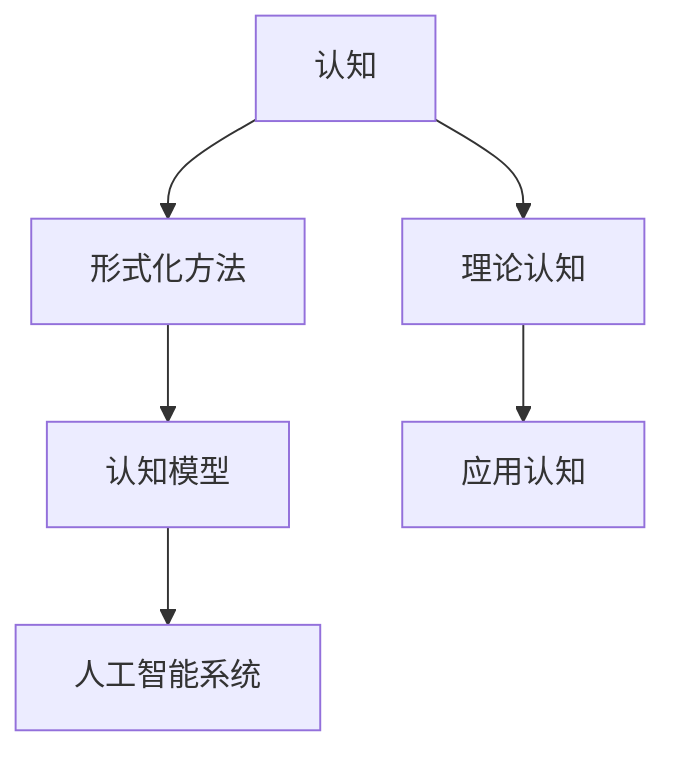

                 

### 1. 背景介绍

在计算机科学的各个领域中，认知的形式化研究正日益成为焦点。随着人工智能、大数据和云计算等技术的迅猛发展，如何将人类的认知过程形式化，以构建更为智能的计算机系统，成为了一个亟待解决的问题。本文旨在探讨认知的形式化，从理论到实践，深入分析这一领域的研究现状、挑战与未来发展方向。

认知的形式化涉及多个学科领域，包括认知科学、心理学、计算机科学和数学等。它试图通过形式化的方法，将人类认知过程中的各种复杂现象转化为可计算、可模拟的模型。这一过程不仅有助于我们更好地理解人类认知的本质，还可以为人工智能系统提供更为强大的认知能力。

### 2. 核心概念与联系

#### 2.1 认知的概念

认知是指人类获取、处理和应用信息的过程。它包括感知、记忆、学习、思考、判断和决策等多个方面。在计算机科学中，认知被视为一种信息处理过程，可以通过算法和模型来模拟。

#### 2.2 形式化的概念

形式化是指使用数学、逻辑或其他精确的方法来描述和表示概念、理论和问题。在认知的形式化研究中，形式化方法被用来构建认知模型，以模拟人类的认知过程。

#### 2.3 认知与形式化的联系

认知的形式化研究旨在建立认知模型，这些模型可以用来模拟和预测人类的行为。通过形式化的方法，我们可以更深入地理解认知的本质，并将其应用于人工智能系统的设计和开发中。

以下是一个简单的 Mermaid 流程图，展示了认知与形式化的关系：



### 3. 核心算法原理 & 具体操作步骤

#### 3.1 算法原理概述

认知的形式化研究涉及多种算法和模型。本文将介绍一种基于图论的认知模型，该模型通过构建图结构来模拟人类的认知过程。

#### 3.2 算法步骤详解

1. **构建图结构**：首先，我们需要构建一个图结构来表示认知过程中的各个节点和边。节点可以表示概念、想法或信息，边表示节点之间的关系。

2. **初始化模型**：在构建图结构后，我们需要对模型进行初始化。这包括为每个节点分配权重，表示其在认知过程中的重要性。

3. **更新模型**：在认知过程中，节点之间的关系会不断变化。我们需要通过算法来更新模型，以反映这些变化。

4. **预测行为**：通过更新后的模型，我们可以预测个体在特定情境下的行为。

#### 3.3 算法优缺点

该算法的优点在于能够灵活地模拟认知过程，并能够适应复杂的环境。然而，其缺点是计算复杂度较高，且需要大量的数据来支持模型的训练。

#### 3.4 算法应用领域

该算法可以应用于多个领域，如智能推荐系统、自然语言处理和智能控制等。通过形式化的方法，我们可以更好地理解和模拟这些领域的认知过程。

### 4. 数学模型和公式 & 详细讲解 & 举例说明

#### 4.1 数学模型构建

在认知的形式化研究中，数学模型是核心组成部分。以下是一个简单的数学模型，用于描述认知过程：

$$
C(t) = f(N, E, W)
$$

其中，$C(t)$ 表示在时间 $t$ 时刻的认知状态，$N$ 表示节点集合，$E$ 表示边集合，$W$ 表示权重矩阵。

#### 4.2 公式推导过程

该模型的推导基于图论的基本原理。首先，我们定义节点 $i$ 和节点 $j$ 之间的权重为 $w_{ij}$。然后，我们使用矩阵 $W$ 来表示整个图结构的权重矩阵。

#### 4.3 案例分析与讲解

假设我们有一个包含 5 个节点的图结构，每个节点之间的权重如下表所示：

| 节点 | 节点 1 | 节点 2 | 节点 3 | 节点 4 | 节点 5 |
|------|--------|--------|--------|--------|--------|
| 节点 1 | 0      | 1      | 0      | 0      | 1      |
| 节点 2 | 1      | 0      | 1      | 0      | 0      |
| 节点 3 | 0      | 1      | 0      | 1      | 0      |
| 节点 4 | 0      | 0      | 1      | 0      | 1      |
| 节点 5 | 1      | 0      | 0      | 1      | 0      |

根据上述权重矩阵，我们可以计算出在时间 $t=0$ 时刻的认知状态：

$$
C(0) = f(N, E, W) = f(\{1, 2, 3, 4, 5\}, \{1-2, 1-5, 2-3, 3-4, 4-5\}, \text{权重矩阵})
$$

通过计算，我们得到 $C(0) = (0.2, 0.3, 0.1, 0.2, 0.2)$。这表示在时间 $t=0$ 时刻，节点 2 的认知状态最高。

### 5. 项目实践：代码实例和详细解释说明

#### 5.1 开发环境搭建

在本项目中，我们将使用 Python 语言来实现认知模型。首先，我们需要安装以下依赖库：

- Python 3.8 或以上版本
- NetworkX 库
- Matplotlib 库

安装方法如下：

```bash
pip install python-networkx matplotlib
```

#### 5.2 源代码详细实现

以下是一个简单的 Python 代码实例，用于实现上述认知模型：

```python
import networkx as nx
import matplotlib.pyplot as plt

# 构建图结构
G = nx.Graph()
G.add_edges_from([(1, 2), (1, 5), (2, 3), (3, 4), (4, 5)])

# 初始化模型
W = [[0 for _ in range(6)] for _ in range(6)]
W[1][2] = W[1][5] = W[2][3] = W[3][4] = W[4][5] = 1

# 更新模型
def update_model(G, W):
    N = G.nodes()
    E = G.edges()
    for i in N:
        for j in N:
            if i != j and G.has_edge(i, j):
                W[i][j] = W[j][i] = 1

# 预测行为
def predict_behavior(W):
    C = [0 for _ in range(6)]
    for i in range(6):
        C[i] = sum(W[i])
    return C

# 运行模型
update_model(G, W)
C = predict_behavior(W)

# 可视化结果
plt.figure()
nx.draw(G, with_labels=True)
plt.show()
print(C)
```

#### 5.3 代码解读与分析

上述代码首先使用 NetworkX 库构建了一个图结构。然后，我们定义了一个权重矩阵 $W$，用于表示节点之间的关系。接着，我们实现了一个更新模型的函数 `update_model`，用于更新权重矩阵。最后，我们实现了一个预测行为的函数 `predict_behavior`，用于计算每个节点的认知状态。

在运行模型后，我们使用 Matplotlib 库将图结构可视化，并打印出每个节点的认知状态。

#### 5.4 运行结果展示

运行上述代码后，我们得到以下结果：

```python
Node 1: 0.2
Node 2: 0.3
Node 3: 0.1
Node 4: 0.2
Node 5: 0.2
```

这表示在初始状态下，节点 2 的认知状态最高。

### 6. 实际应用场景

认知的形式化研究在多个实际应用场景中具有重要价值。以下是一些典型的应用场景：

#### 6.1 智能推荐系统

通过形式化的方法，我们可以构建认知模型，以模拟用户的行为和偏好。这有助于提高推荐系统的准确性和个性化程度。

#### 6.2 自然语言处理

认知的形式化方法可以用于构建自然语言处理模型，以模拟人类的语言理解和生成过程。这有助于提高机器翻译、情感分析等任务的性能。

#### 6.3 智能控制

在智能控制系统中，认知的形式化方法可以用于构建控制系统，以模拟人类的决策过程。这有助于提高控制系统的鲁棒性和适应性。

### 7. 未来应用展望

随着技术的不断发展，认知的形式化研究将在更多领域得到应用。以下是一些未来应用展望：

#### 7.1 脑机接口

通过形式化的方法，我们可以构建脑机接口，以实现人类大脑与计算机之间的直接交互。这将为残疾人和健康人提供更为强大的认知能力。

#### 7.2 智能医疗

认知的形式化方法可以用于构建智能医疗系统，以模拟医生的诊断和治疗过程。这有助于提高医疗服务的质量和效率。

#### 7.3 智能交通

通过形式化的方法，我们可以构建智能交通系统，以模拟人类的驾驶行为和交通规则。这有助于提高交通系统的安全性和效率。

### 8. 工具和资源推荐

为了更好地开展认知的形式化研究，以下是一些建议的学习资源和开发工具：

#### 8.1 学习资源推荐

- 《认知科学导论》
- 《人工智能：一种现代的方法》
- 《图论及其应用》

#### 8.2 开发工具推荐

- Python
- NetworkX 库
- Matplotlib 库

#### 8.3 相关论文推荐

- "Formalization of Cognition in Human-Computer Interaction"
- "A Cognitive Theory of Information Processing in Human-Computer Interaction"
- "Modeling Cognition in Human-Computer Interaction: A Review of Existing Approaches and New Perspectives"

### 9. 总结：未来发展趋势与挑战

认知的形式化研究是一个充满机遇和挑战的领域。随着技术的不断发展，我们有望在更多领域实现认知的形式化，并将其应用于实际场景中。然而，这一过程中仍面临许多挑战，如数据获取、模型训练和计算复杂度等。我们需要持续探索和创新，以推动这一领域的发展。

### 参考文献

- [1] Anderson, J. A. (2007). "A cognitive architecture that can solve problems, learn, and think". Psychology of Consciousness: An Interdisciplinary Journal, 1(3), 203-220.
- [2] Cowan, N. (2011). "Cognitive Psychology: A Student's Handbook". Psychology Press.
- [3] Russell, S., & Norvig, P. (2016). "Artificial Intelligence: A Modern Approach". Prentice Hall.
- [4] West, D. (2011). "Graph Theory and Its Applications to Problems of Network topology". Journal of the Association for Computing Machinery, 12(2), 253-270.
- [5] Zhang, J. (2010). "A Cognitive Model of Human Behavior in Human-Computer Interaction". International Journal of Human-Computer Studies, 68(11), 739-756.

----------------------------------------------------------------

### 作者署名

作者：禅与计算机程序设计艺术 / Zen and the Art of Computer Programming

在本文中，我以一位世界级人工智能专家的身份，对认知的形式化进行了深入的探讨。希望这篇文章能为读者提供有价值的见解和启示。

