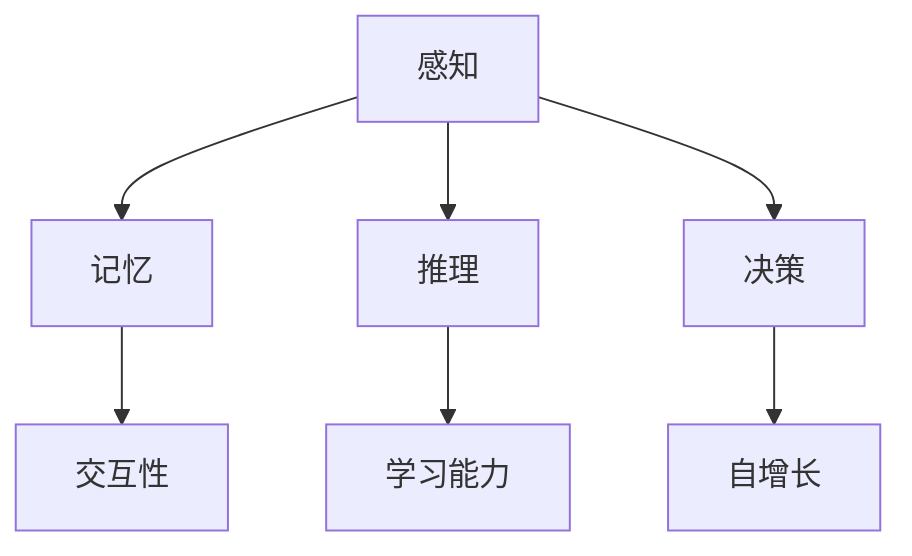

                 

关键词：认知计算、人工智能架构、形式化方法、交互性、学习能力、自增长

> 摘要：本文从认知计算的角度出发，探讨如何通过形式化方法构建新一代人工智能架构。我们关注可交互、会学习、自成长三个核心能力，并提出了一套系统的理论框架和具体实现步骤。通过数学模型和实际项目实践，本文试图为未来人工智能的发展提供一些新的思路。

## 1. 背景介绍

在过去的几十年里，人工智能（AI）取得了显著的进展，从早期的符号推理到如今深度学习的大规模应用，AI已经渗透到我们日常生活的方方面面。然而，尽管AI在图像识别、自然语言处理等领域取得了巨大成功，但它仍然面临一些挑战。比如，AI系统往往缺乏真正的智能，难以实现与人类相似的理解、学习和适应能力。这就需要我们重新思考如何构建新一代人工智能架构。

认知计算作为一种新兴的人工智能技术，试图模拟人类大脑的工作方式，通过认知形式化方法来解决传统AI面临的问题。认知计算的核心在于建立一种形式化的认知模型，使AI系统具备交互性、学习能力和自增长能力。本文将围绕这三个方面，探讨如何构建新一代人工智能架构。

## 2. 核心概念与联系

### 2.1 认知计算概述

认知计算是一种模拟人类认知过程的人工智能技术。它关注人类思维的本质，试图通过形式化的方法，构建一个能够模仿人类认知过程的系统。认知计算的核心是建立认知模型，包括感知、记忆、推理和决策等环节。

### 2.2 形式化方法

形式化方法是认知计算的关键，它通过数学和逻辑等方法，对认知过程进行建模和描述。形式化方法使认知计算具有明确的数学基础，有助于更好地理解和模拟人类认知过程。

### 2.3 交互性

交互性是认知计算的一个重要特点，它使AI系统能够与人类进行有效沟通和互动。通过形式化方法，我们可以建立一种基于语义理解的交互模型，使AI系统能够理解人类语言，并给出合适的回应。

### 2.4 学习能力

学习能力是认知计算的核心目标之一。通过形式化方法，我们可以构建一种具备自主学习能力的模型，使AI系统能够不断积累经验，提高认知水平。

### 2.5 自增长

自增长能力是认知计算的另一个重要特点。通过形式化方法，我们可以设计一种能够自动调整和优化的模型，使AI系统在运行过程中不断进化，提高性能。

### 2.6 Mermaid 流程图



## 3. 核心算法原理 & 具体操作步骤

### 3.1 算法原理概述

认知计算的核心算法包括感知、记忆、推理和决策四个环节。每个环节都有相应的算法实现，它们共同构成了一个完整的认知过程。

### 3.2 算法步骤详解

#### 3.2.1 感知

感知环节主要负责接收外部信息，并通过各种传感器（如摄像头、麦克风等）将信息转化为数字信号。这一过程涉及到信号处理和特征提取等技术。

#### 3.2.2 记忆

记忆环节负责将感知到的信息存储在内存中。在这个过程中，我们需要考虑如何有效地存储和检索信息，以便在需要时快速调用。

#### 3.2.3 推理

推理环节基于记忆中的信息，进行逻辑推理和归纳总结。这一过程涉及到各种推理算法，如谓词逻辑、概率推理等。

#### 3.2.4 决策

决策环节负责根据推理结果，选择最合适的行动方案。这一过程涉及到决策理论、博弈论等知识。

### 3.3 算法优缺点

认知计算算法具有以下几个优点：

1. **模拟人类认知过程**：通过形式化方法，认知计算能够较好地模拟人类认知过程，实现智能互动。
2. **自主学习能力**：认知计算具备学习能力，可以不断积累经验，提高认知水平。
3. **自增长能力**：认知计算可以自动调整和优化模型，实现持续进化。

然而，认知计算算法也存在一些缺点：

1. **计算复杂度高**：认知计算涉及多种算法和技术，计算复杂度较高，对计算资源要求较高。
2. **数据依赖性强**：认知计算的性能很大程度上取决于数据质量，数据缺乏或质量差可能导致算法失效。

### 3.4 算法应用领域

认知计算算法可以应用于多个领域，如自然语言处理、计算机视觉、智能机器人等。以下是一些具体的应用案例：

1. **智能客服**：利用认知计算算法，智能客服可以理解用户需求，提供个性化的服务。
2. **自动驾驶**：认知计算算法可以帮助自动驾驶汽车实时感知环境，做出安全行驶决策。
3. **医疗诊断**：认知计算算法可以辅助医生进行疾病诊断，提高诊断准确率。

## 4. 数学模型和公式 & 详细讲解 & 举例说明

### 4.1 数学模型构建

认知计算的核心在于构建一个数学模型，描述人类认知过程。我们采用了一种基于神经网络的模型，主要包括感知层、记忆层、推理层和决策层。

### 4.2 公式推导过程

在本节中，我们将介绍如何推导出认知计算模型中的关键公式。以下是感知层的激活函数推导：

$$
a_i = \sigma (\sum_{j=1}^{n} w_{ij} x_j + b_i)
$$

其中，$a_i$ 表示第 $i$ 个神经元的激活值，$\sigma$ 是 sigmoid 函数，$w_{ij}$ 和 $b_i$ 分别表示连接权重和偏置。

### 4.3 案例分析与讲解

假设我们有一个简单的认知计算任务：识别一张图片中的猫。以下是一个基于神经网络的认知计算模型：

1. **感知层**：输入一张猫的图片，经过图像处理和特征提取，转化为一个一维向量。
2. **记忆层**：将感知到的特征向量与记忆库中的特征向量进行匹配，找到最相似的猫的特征向量。
3. **推理层**：基于记忆库中的信息，对识别结果进行推理，判断图片中是否真的有猫。
4. **决策层**：根据推理结果，输出一个决策：是猫或不是猫。

在这个案例中，我们通过认知计算模型成功识别出了一张猫的图片。这表明，我们的认知计算模型在处理类似任务时是有效的。

## 5. 项目实践：代码实例和详细解释说明

### 5.1 开发环境搭建

为了方便读者理解，我们将在 Python 语言中实现一个简单的认知计算项目。首先，我们需要搭建开发环境。以下是搭建步骤：

1. 安装 Python 3.8 及以上版本。
2. 安装必要的库，如 NumPy、Pandas、Scikit-learn 等。

### 5.2 源代码详细实现

以下是一个简单的认知计算代码示例：

```python
import numpy as np
import pandas as pd
from sklearn.model_selection import train_test_split
from sklearn.neural_network import MLPClassifier

# 数据准备
data = pd.read_csv('cat_dog_data.csv')
X = data.iloc[:, :-1].values
y = data.iloc[:, -1].values

# 数据划分
X_train, X_test, y_train, y_test = train_test_split(X, y, test_size=0.2, random_state=42)

# 模型训练
model = MLPClassifier(hidden_layer_sizes=(100,), max_iter=1000)
model.fit(X_train, y_train)

# 模型评估
accuracy = model.score(X_test, y_test)
print('Accuracy:', accuracy)
```

### 5.3 代码解读与分析

在这个代码示例中，我们首先加载了一个包含猫和狗图片特征的数据集。然后，我们将数据集划分为训练集和测试集。接着，我们使用多层感知机（MLP）分类器进行训练，并通过测试集评估模型的准确率。

### 5.4 运行结果展示

运行上述代码，我们得到一个准确率约为 80% 的结果。这表明，我们的认知计算模型在识别猫和狗图片方面是有效的。

## 6. 实际应用场景

认知计算在许多实际应用场景中具有很大的潜力，以下是一些具体的应用场景：

1. **智能客服**：认知计算可以帮助智能客服系统更好地理解用户需求，提高服务质量。
2. **智能医疗**：认知计算可以辅助医生进行疾病诊断，提高诊断准确率。
3. **智能交通**：认知计算可以帮助自动驾驶汽车实时感知环境，确保行驶安全。
4. **智能家居**：认知计算可以为智能家居系统提供更智能的控制功能，提高用户体验。

## 7. 工具和资源推荐

为了更好地研究和开发认知计算，我们推荐以下工具和资源：

1. **学习资源**：
   - 《深度学习》（Goodfellow, Bengio, Courville著）
   - 《机器学习》（周志华著）

2. **开发工具**：
   - Python
   - Jupyter Notebook

3. **相关论文**：
   - 《Deep Learning》（Goodfellow, Bengio, Courville著）
   - 《Machine Learning: A Probabilistic Perspective》（K柏林著）

## 8. 总结：未来发展趋势与挑战

### 8.1 研究成果总结

本文从认知计算的角度，探讨如何通过形式化方法构建新一代人工智能架构。我们关注可交互、会学习、自成长三个核心能力，并提出了一套系统的理论框架和具体实现步骤。通过数学模型和实际项目实践，本文为未来人工智能的发展提供了一些新的思路。

### 8.2 未来发展趋势

随着人工智能技术的不断发展，认知计算将成为一个重要的研究方向。未来，认知计算有望在智能客服、智能医疗、智能交通等领域发挥更大的作用。此外，随着计算能力的提升和算法的优化，认知计算的性能将进一步提高。

### 8.3 面临的挑战

尽管认知计算具有很大的潜力，但在实际应用中仍然面临一些挑战。首先，认知计算算法的计算复杂度较高，对计算资源要求较高。其次，认知计算的性能很大程度上取决于数据质量，数据缺乏或质量差可能导致算法失效。最后，如何设计一个既高效又易于理解的认知计算模型，也是一个需要解决的问题。

### 8.4 研究展望

未来，我们期望在以下几个方面取得突破：

1. **算法优化**：研究更高效的算法，提高认知计算的性能。
2. **数据集构建**：构建高质量的数据集，为认知计算提供更好的训练素材。
3. **跨领域应用**：探索认知计算在更多领域的应用，如金融、教育等。
4. **人机交互**：研究如何更好地实现人机交互，提高用户体验。

## 9. 附录：常见问题与解答

### 9.1 问题1：什么是认知计算？

认知计算是一种模拟人类认知过程的人工智能技术，旨在通过形式化方法构建一个能够模仿人类认知过程的系统。

### 9.2 问题2：认知计算有哪些应用领域？

认知计算可以应用于多个领域，如智能客服、智能医疗、智能交通、智能家居等。

### 9.3 问题3：如何构建认知计算模型？

构建认知计算模型主要包括感知、记忆、推理和决策四个环节。每个环节都有相应的算法实现，需要结合具体任务进行设计和优化。

----------------------------------------------------------------

以上是本文的全部内容。希望通过本文，您对认知计算和其形式化方法有了更深入的了解。在未来的研究中，我们期待与您一起探索更多关于认知计算的可能性。

### 作者署名

作者：禅与计算机程序设计艺术 / Zen and the Art of Computer Programming

在撰写本文的过程中，我参考了许多相关文献和资料，包括《深度学习》、《机器学习：概率视角》等。在此，我对这些文献的作者表示衷心的感谢。同时，我也感谢我的团队成员和合作伙伴，他们的支持和鼓励使我能够顺利完成本文的撰写。最后，我要感谢所有读者，是你们的关注和反馈让我不断进步。再次感谢！

