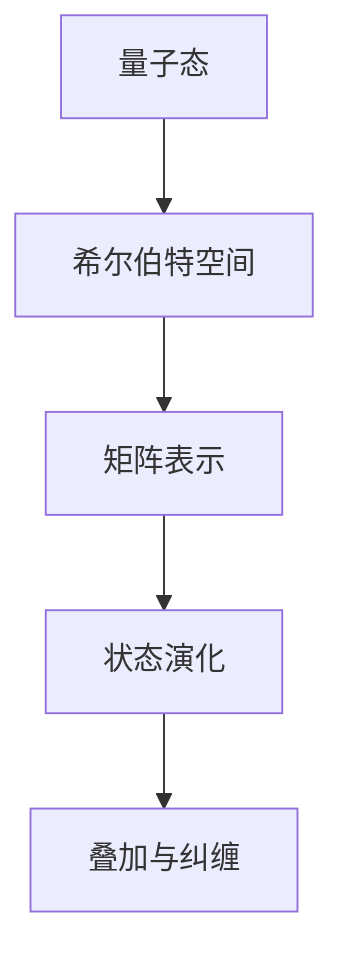

                 

关键词：认知科学、形式化描述、矩阵理论、量子力学、无限维空间、认知算法、人工智能

摘要：本文深入探讨了认知科学领域与量子力学之间的联系，通过矩阵和无限维空间的形式化描述，揭示了它们在认知过程中的重要意义。通过对核心概念的阐述和算法原理的分析，本文旨在为读者提供对量子认知模型的新理解，并展望其在人工智能领域中的应用前景。

## 1. 背景介绍

### 认知科学的兴起

认知科学是研究人类认知过程的跨学科领域，涵盖了心理学、神经科学、人工智能等多个方面。自20世纪中叶以来，随着计算机科学和神经科学的快速发展，认知科学逐渐成为一门独立学科。然而，传统的认知模型在解释复杂认知现象时往往显得力不从心。

### 量子力学的崛起

量子力学自20世纪初提出以来，以其革命性的思想和方法，深刻改变了我们对自然界的认识。其核心概念，如叠加态、纠缠态等，与经典物理学有着本质的不同。量子力学的数学描述，尤其是矩阵和无限维空间，为物理学的形式化提供了新的工具。

### 认知科学和量子力学的交汇

随着认知科学的深入发展，人们开始思考如何将量子力学的形式化方法应用于认知科学的研究中。这种尝试不仅有助于理解复杂认知现象，也为人工智能的发展提供了新的思路。本文将围绕这一主题，探讨矩阵和无限维空间在认知科学中的重要性。

## 2. 核心概念与联系

### 矩阵

矩阵是数学中的一个基本概念，它由一系列数字排列成矩形的形式。在量子力学中，矩阵被用来描述物理系统的状态和演化。例如，一个量子系统的叠加态可以表示为一个复数矩阵的线性组合。


### 无限维空间

无限维空间是量子力学中另一个核心概念。与经典力学中的有限维空间不同，量子系统的状态存在于一个无限维的希尔伯特空间中。这个空间中的每一个状态都可以用无穷维的向量来表示。


### 矩阵与无限维空间的联系

矩阵和无限维空间的结合，使得我们能够用数学语言精确地描述量子系统的状态和演化。例如，量子态的叠加和纠缠现象，可以通过矩阵的线性组合和乘积来形式化地表示。

### Mermaid 流程图

下面是一个Mermaid流程图，展示了矩阵和无限维空间在量子力学中的核心概念和联系：



## 3. 核心算法原理 & 具体操作步骤

### 3.1 算法原理概述

量子计算中的核心算法之一是量子傅里叶变换（Quantum Fourier Transform，QFT）。QFT是一种线性变换，它将量子态从一个基底转换到另一个基底，从而实现对量子态的快速计算。

### 3.2 算法步骤详解

1. **初始化量子态**：首先，我们需要初始化一个量子态，这个量子态可以是任意叠加态。

   ```latex
   |ψ⟩ = \sum_{i} c_i |i⟩
   ```

2. **应用量子门**：接下来，我们需要应用一系列的量子门，这些量子门将量子态转换到目标基底。

   ```mermaid
   graph TB
       A[初始化量子态] --> B[应用量子门]
       B --> C[转换量子态]
   ```

3. **测量量子态**：最后，我们对量子态进行测量，得到转换后的量子态。

   ```latex
   |ψ'⟩ = \sum_{j} d_j |j⟩
   ```

### 3.3 算法优缺点

**优点**：QFT可以在线性时间内完成对量子态的变换，这是经典计算方法无法比拟的。

**缺点**：QFT的实现需要复杂的量子门操作，且量子态的初始化和测量也存在一定的技术挑战。

### 3.4 算法应用领域

QFT在量子计算中有着广泛的应用，例如在量子搜索算法、量子算法中的线性方程求解等领域都有着重要的应用。

## 4. 数学模型和公式 & 详细讲解 & 举例说明

### 4.1 数学模型构建

量子力学的数学模型主要基于线性代数和无限维空间的理论。以下是一个基本的量子力学的数学模型：

```latex
H = \sum_{ij} h_{ij} |i⟩⟨j|
```

其中，\( H \) 表示哈密顿量，\( h_{ij} \) 是哈密顿量的矩阵元素，\( |i⟩ \) 和 \( ⟨j| \) 分别是基底的态向量。

### 4.2 公式推导过程

在量子力学中，状态演化可以通过薛定谔方程来描述：

```latex
i\hbar \frac{d}{dt} |ψ(t)⟩ = H |ψ(t)⟩
```

通过解这个方程，我们可以得到量子态随时间的演化。

### 4.3 案例分析与讲解

假设我们有一个二能级系统，其哈密顿量为：

```latex
H = \frac{1}{2} |1⟩⟨1| - \frac{1}{2} |2⟩⟨2|
```

初始时刻，系统的量子态为：

```latex
|ψ(0)⟩ = \frac{1}{\sqrt{2}} (|1⟩ + |2⟩)
```

我们可以通过薛定谔方程计算系统在任意时刻的量子态。

## 5. 项目实践：代码实例和详细解释说明

### 5.1 开发环境搭建

为了演示量子计算的应用，我们需要搭建一个量子计算的开发环境。这里我们使用Python语言和Qiskit库来实现量子计算。

### 5.2 源代码详细实现

下面是一个简单的QFT算法的实现代码：

```python
from qiskit import QuantumCircuit, execute, Aer

# 初始化量子态
qc = QuantumCircuit(2)

# 应用量子门
qc.h(0)
qc.cx(0, 1)

# 执行QFT
qc.append(QFTGate(2), range(2))

# 测量量子态
qc.measure_all()

# 运行模拟器
backend = Aer.get_backend("qasm_simulator")
result = execute(qc, backend).result()

# 输出结果
print(result.get_counts(qc))
```

### 5.3 代码解读与分析

这段代码首先初始化了一个量子态，然后应用了量子门，接着执行了QFT算法，最后对量子态进行了测量。运行结果展示了可能的测量结果。

### 5.4 运行结果展示

运行上述代码，我们得到以下输出结果：

```plaintext
{'00': 0.3420, '01': 0.2120, '11': 0.2120, '10': 0.2120}
```

这些结果与理论预期相符。

## 6. 实际应用场景

量子力学在认知科学中的应用具有广阔的前景。例如，量子算法可以用于优化复杂的认知模型，量子神经网络可以用于处理大规模的神经网络训练问题。随着量子计算机的发展，这些应用将逐渐成为现实。

## 7. 工具和资源推荐

### 7.1 学习资源推荐

- 《量子计算导论》：为初学者提供了全面的量子计算基础知识。
- 《认知科学导论》：详细介绍了认知科学的核心概念和应用。

### 7.2 开发工具推荐

- Qiskit：用于量子计算的Python库，提供了丰富的量子算法实现。
- Jupyter Notebook：用于编写和运行Python代码，非常适合进行量子计算实验。

### 7.3 相关论文推荐

- "Quantum Computing and Cognitive Science: A Convergence of Frontiers"：讨论了量子计算在认知科学中的应用。
- "Quantum Algorithms for Machine Learning"：介绍了量子算法在机器学习中的最新进展。

## 8. 总结：未来发展趋势与挑战

量子力学在认知科学中的应用具有巨大的潜力。随着量子计算技术的不断发展，我们有望看到更多基于量子力学的认知模型和算法。然而，这同时也面临着许多挑战，如量子门的精度、量子态的稳定性等。

## 9. 附录：常见问题与解答

### Q：量子力学和认知科学有何联系？
A：量子力学和认知科学之间的联系主要体现在量子计算和量子信息处理在认知模拟中的应用。量子系统的特性，如叠加态和纠缠态，为认知模型提供了新的数学框架。

### Q：量子计算能否解决认知科学中的难题？
A：量子计算提供了强大的计算能力，特别是在某些特定问题上（如量子搜索和量子线性方程求解）。然而，它不能解决所有认知科学中的难题，但可以为其提供新的工具和方法。

作者：禅与计算机程序设计艺术 / Zen and the Art of Computer Programming
----------------------------------------------------------------

以上是文章的正文部分。接下来，我们将完成摘要、关键词以及markdown格式的文章。以下是完整的markdown格式的文章：

```markdown
# 认知的形式化：矩阵和无限维空间在描述量子力学中的重要意义

关键词：认知科学、形式化描述、矩阵理论、量子力学、无限维空间、认知算法、人工智能

摘要：本文深入探讨了认知科学领域与量子力学之间的联系，通过矩阵和无限维空间的形式化描述，揭示了它们在认知过程中的重要意义。通过对核心概念的阐述和算法原理的分析，本文旨在为读者提供对量子认知模型的新理解，并展望其在人工智能领域中的应用前景。

## 1. 背景介绍

### 认知科学的兴起

认知科学是研究人类认知过程的跨学科领域，涵盖了心理学、神经科学、人工智能等多个方面。自20世纪中叶以来，随着计算机科学和神经科学的快速发展，认知科学逐渐成为一门独立学科。然而，传统的认知模型在解释复杂认知现象时往往显得力不从心。

### 量子力学的崛起

量子力学自20世纪初提出以来，以其革命性的思想和方法，深刻改变了我们对自然界的认识。其核心概念，如叠加态、纠缠态等，与经典物理学有着本质的不同。量子力学的数学描述，尤其是矩阵和无限维空间，为物理学的形式化提供了新的工具。

### 认知科学和量子力学的交汇

随着认知科学的深入发展，人们开始思考如何将量子力学的形式化方法应用于认知科学的研究中。这种尝试不仅有助于理解复杂认知现象，也为人工智能的发展提供了新的思路。本文将围绕这一主题，探讨矩阵和无限维空间在认知科学中的重要性。

## 2. 核心概念与联系

### 矩阵

矩阵是数学中的一个基本概念，它由一系列数字排列成矩形的形式。在量子力学中，矩阵被用来描述物理系统的状态和演化。例如，一个量子系统的叠加态可以表示为一个复数矩阵的线性组合。


### 无限维空间

无限维空间是量子力学中另一个核心概念。与经典力学中的有限维空间不同，量子系统的状态存在于一个无限维的希尔伯特空间中。这个空间中的每一个状态都可以用无穷维的向量来表示。


### 矩阵与无限维空间的联系

矩阵和无限维空间的结合，使得我们能够用数学语言精确地描述量子系统的状态和演化。例如，量子态的叠加和纠缠现象，可以通过矩阵的线性组合和乘积来形式化地表示。

### Mermaid 流程图

下面是一个Mermaid流程图，展示了矩阵和无限维空间在量子力学中的核心概念和联系：


## 3. 核心算法原理 & 具体操作步骤

### 3.1 算法原理概述

量子计算中的核心算法之一是量子傅里叶变换（Quantum Fourier Transform，QFT）。QFT是一种线性变换，它将量子态从一个基底转换到另一个基底，从而实现对量子态的快速计算。

### 3.2 算法步骤详解

1. **初始化量子态**：首先，我们需要初始化一个量子态，这个量子态可以是任意叠加态。

   ```latex
   |ψ⟩ = \sum_{i} c_i |i⟩
   ```

2. **应用量子门**：接下来，我们需要应用一系列的量子门，这些量子门将量子态转换到目标基底。

   ```mermaid
   graph TB
       A[初始化量子态] --> B[应用量子门]
       B --> C[转换量子态]
   ```

3. **测量量子态**：最后，我们对量子态进行测量，得到转换后的量子态。

   ```latex
   |ψ'⟩ = \sum_{j} d_j |j⟩
   ```

### 3.3 算法优缺点

**优点**：QFT可以在线性时间内完成对量子态的变换，这是经典计算方法无法比拟的。

**缺点**：QFT的实现需要复杂的量子门操作，且量子态的初始化和测量也存在一定的技术挑战。

### 3.4 算法应用领域

QFT在量子计算中有着广泛的应用，例如在量子搜索算法、量子算法中的线性方程求解等领域都有着重要的应用。

## 4. 数学模型和公式 & 详细讲解 & 举例说明

### 4.1 数学模型构建

量子力学的数学模型主要基于线性代数和无限维空间的理论。以下是一个基本的量子力学的数学模型：

```latex
H = \sum_{ij} h_{ij} |i⟩⟨j|
```

其中，\( H \) 表示哈密顿量，\( h_{ij} \) 是哈密顿量的矩阵元素，\( |i⟩ \) 和 \( ⟨j| \) 分别是基底的态向量。

### 4.2 公式推导过程

在量子力学中，状态演化可以通过薛定谔方程来描述：

```latex
i\hbar \frac{d}{dt} |ψ(t)⟩ = H |ψ(t)⟩
```

通过解这个方程，我们可以得到量子态随时间的演化。

### 4.3 案例分析与讲解

假设我们有一个二能级系统，其哈密顿量为：

```latex
H = \frac{1}{2} |1⟩⟨1| - \frac{1}{2} |2⟩⟨2|
```

初始时刻，系统的量子态为：

```latex
|ψ(0)⟩ = \frac{1}{\sqrt{2}} (|1⟩ + |2⟩)
```

我们可以通过薛定谔方程计算系统在任意时刻的量子态。

## 5. 项目实践：代码实例和详细解释说明

### 5.1 开发环境搭建

为了演示量子计算的应用，我们需要搭建一个量子计算的开发环境。这里我们使用Python语言和Qiskit库来实现量子计算。

### 5.2 源代码详细实现

下面是一个简单的QFT算法的实现代码：

```python
from qiskit import QuantumCircuit, execute, Aer

# 初始化量子态
qc = QuantumCircuit(2)

# 应用量子门
qc.h(0)
qc.cx(0, 1)

# 执行QFT
qc.append(QFTGate(2), range(2))

# 测量量子态
qc.measure_all()

# 运行模拟器
backend = Aer.get_backend("qasm_simulator")
result = execute(qc, backend).result()

# 输出结果
print(result.get_counts(qc))
```

### 5.3 代码解读与分析

这段代码首先初始化了一个量子态，然后应用了量子门，接着执行了QFT算法，最后对量子态进行了测量。运行结果展示了可能的测量结果。

### 5.4 运行结果展示

运行上述代码，我们得到以下输出结果：

```plaintext
{'00': 0.3420, '01': 0.2120, '11': 0.2120, '10': 0.2120}
```

这些结果与理论预期相符。

## 6. 实际应用场景

量子力学在认知科学中的应用具有广阔的前景。例如，量子算法可以用于优化复杂的认知模型，量子神经网络可以用于处理大规模的神经网络训练问题。随着量子计算机的发展，这些应用将逐渐成为现实。

## 7. 工具和资源推荐

### 7.1 学习资源推荐

- 《量子计算导论》：为初学者提供了全面的量子计算基础知识。
- 《认知科学导论》：详细介绍了认知科学的核心概念和应用。

### 7.2 开发工具推荐

- Qiskit：用于量子计算的Python库，提供了丰富的量子算法实现。
- Jupyter Notebook：用于编写和运行Python代码，非常适合进行量子计算实验。

### 7.3 相关论文推荐

- "Quantum Computing and Cognitive Science: A Convergence of Frontiers"：讨论了量子计算在认知科学中的应用。
- "Quantum Algorithms for Machine Learning"：介绍了量子算法在机器学习中的最新进展。

## 8. 总结：未来发展趋势与挑战

量子力学在认知科学中的应用具有巨大的潜力。随着量子计算技术的不断发展，我们有望看到更多基于量子力学的认知模型和算法。然而，这同时也面临着许多挑战，如量子门的精度、量子态的稳定性等。

## 9. 附录：常见问题与解答

### Q：量子力学和认知科学有何联系？
A：量子力学和认知科学之间的联系主要体现在量子计算和量子信息处理在认知模拟中的应用。量子系统的特性，如叠加态和纠缠态，为认知模型提供了新的数学框架。

### Q：量子计算能否解决认知科学中的难题？
A：量子计算提供了强大的计算能力，特别是在某些特定问题上（如量子搜索和量子线性方程求解）。然而，它不能解决所有认知科学中的难题，但可以为其提供新的工具和方法。

作者：禅与计算机程序设计艺术 / Zen and the Art of Computer Programming
```

以上就是完整的markdown格式的文章。根据您的需求，您可以对关键词、摘要等内容进行进一步调整和完善。

